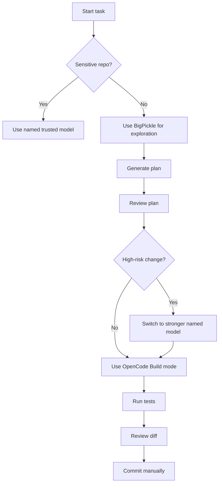

# OpenCode and BigPickle: Open-Source Coding Agent and Free Stealth Model

## Executive Summary

OpenCode is an open-source AI coding agent designed around a terminal-first workflow, while also supporting desktop, IDE, GitHub Actions, server, SDK, and MCP-based integrations. It is best understood as a local, provider-agnostic coding-agent runtime rather than just another chat interface for code.

BigPickle is a stealth model currently available through OpenCode for free for a limited time. It is attractive because it gives users a large-context, zero-cost coding model inside OpenCode. However, because it is a stealth model, its exact provider, training background, and model card are not publicly disclosed. That makes it useful for experimentation, but risky for confidential code or production-critical decisions.

The practical recommendation is simple:

Use **OpenCode** as a serious open-source coding-agent environment.

Use **BigPickle** as a free, temporary, large-context exploration model.

Do **not** treat BigPickle as a fully vetted production model unless you have tested it carefully on your own repository and are comfortable with the privacy and reliability trade-offs.

---

## 1. What Is OpenCode?

OpenCode is an open-source AI coding agent. Its core idea is to let developers work with AI directly inside their normal engineering environment: terminal, editor, repository, and automation pipeline.

Unlike a simple chatbot, OpenCode can inspect files, edit code, run shell commands, use language-server information, call tools, and connect to many different model providers. This makes it closer to a coding-agent operating layer.

OpenCode supports several usage surfaces:

- Terminal UI
- Command-line one-shot mode
- Desktop app
- IDE extension
- GitHub Actions integration
- Headless server mode
- JavaScript / TypeScript SDK
- MCP server integrations
- Local and hosted model providers

The important point is that OpenCode is not tied to one model vendor. It can use models from many providers through its provider system. This is one of its biggest advantages compared with more closed coding-agent tools.

---

## 2. OpenCode Architecture

At a high level, OpenCode has four layers:

```mermaid
flowchart TD
    User[Developer] --> UI[OpenCode UI Layer]
    UI --> Agent[Agent Layer]
    Agent --> Tools[Tool Layer]
    Agent --> Models[Model Provider Layer]
    Tools --> Repo[Local Repository]
    Tools --> Shell[Shell Commands]
    Tools --> LSP[Language Server]
    Tools --> MCP[MCP Tools]
    Models --> Hosted[Hosted Models]
    Models --> Local[Local Models]
````

The user interacts through the terminal, desktop app, IDE, GitHub, or server API. OpenCode then routes the task through its agent layer. The agent can read files, edit files, search the repo, run commands, use LSP context, or call MCP tools.

This design gives OpenCode three important properties:

1. **Model flexibility**
   You are not locked into one model provider.

2. **Local workflow compatibility**
   OpenCode works inside your existing repo and development environment.

3. **Agentic execution**
   It can move beyond suggestions and actually perform multi-step engineering work.

---

## 3. Built-In Agent Modes

OpenCode includes different agent roles. The two most important are:

### Build Mode

Build is the default implementation-oriented agent. It is intended for writing code, editing files, running commands, and completing engineering tasks.

Use Build mode when you already know what you want changed and you are comfortable letting the agent operate on the repository.

Example tasks:

```text
Refactor this module to remove duplicated validation logic.
```

```text
Implement this API endpoint and add tests.
```

```text
Fix the failing unit test and explain the root cause.
```

### Plan Mode

Plan is more cautious. It is better for analysis, architecture review, and task decomposition. It should be used before making large edits.

Example tasks:

```text
Analyze this repository and propose how to add OAuth login.
```

```text
Find the main risk areas before we migrate this service to async I/O.
```

```text
Read the codebase and explain where order matching logic lives.
```

A good OpenCode workflow is:


This is safer than starting directly with implementation, especially in large or unfamiliar repositories.

---

## 4. What Is BigPickle?

BigPickle is a stealth model available through OpenCode. OpenCode describes it as free for a limited time.

The important known points are:

* Model ID: `opencode/big-pickle`
* It is available through OpenCode / OpenCode Zen.
* It is free for a limited time.
* It has a large context window.
* It is intended for coding-agent usage.
* It is a stealth model, meaning the exact model identity is not publicly disclosed.
* During the free period, data may be used to improve the model.

The last two points are the most important caveats.

BigPickle is not like using a clearly named model such as Claude, GPT, Gemini, Qwen, DeepSeek, or Kimi, where the model family and provider are explicitly known. With BigPickle, you are using a model whose identity is intentionally hidden.

That does not automatically mean it is bad. It means due diligence is harder.

---

## 5. Why BigPickle Is Interesting

BigPickle is interesting because coding agents can become expensive quickly.

A coding agent does not only send your current prompt. It may also send:

* File contents
* Search results
* Previous conversation state
* Tool outputs
* Test logs
* Stack traces
* Dependency context
* Agent instructions
* Repository-specific rules

This can consume many tokens. A free large-context model is therefore attractive for exploratory coding work.

BigPickle is especially useful when you want to do broad analysis before spending money on a premium model.

For example:

```text
Explore this repository and summarize the architecture.
```

```text
Find all places where authentication logic is implemented.
```

```text
Read the main trading strategy files and explain the data flow.
```

```text
Generate a migration plan from this old API structure to the new one.
```

These tasks can require a lot of context but may not need the most expensive model.

---

## 6. Practical Use Cases for OpenCode

### 6.1 Repository Understanding

OpenCode is very useful for understanding an unfamiliar codebase.

Good prompts:

```text
Explain the architecture of this repository.
```

```text
Where does request authentication happen?
```

```text
Trace the data flow from ingestion to final output.
```

```text
Find the files most relevant to the matching engine.
```

This is one of the safest uses because the agent can mostly read and summarize before making edits.

---

### 6.2 Refactoring

OpenCode can help perform multi-file refactors.

Example:

```text
Refactor the duplicated validation logic into a shared helper.
Make the smallest safe change and run the relevant tests.
```

This is stronger than manually asking a chatbot for a patch because OpenCode can inspect the real repository and apply edits directly.

However, this should still be reviewed carefully. Agent-generated refactors can introduce subtle behavior changes.

---

### 6.3 Test Generation

OpenCode is useful for generating tests around existing behavior.

Example:

```text
Add tests for this module before changing the implementation.
Focus on edge cases and current behavior.
```

This is often a good use case because tests create a safety net before further agentic edits.

---

### 6.4 Debugging

OpenCode can read error logs, inspect code, and propose fixes.

Example:

```text
This test is failing. Find the root cause and propose a minimal fix.
```

For debugging, OpenCode is especially useful when it can run the failing test locally and iterate.

---

### 6.5 Documentation

OpenCode can create or improve documentation based on actual code.

Example:

```text
Read the implementation and update the README with accurate setup instructions.
```

This is a relatively low-risk task and a good place to use cheaper models.

---

### 6.6 GitHub Automation

OpenCode can be connected to GitHub workflows. This allows it to help with:

* Issue triage
* Pull request review
* Automated code changes
* CI-based agent tasks
* Comment-triggered agent workflows

This is useful for teams that want to move from local AI assistance to repeatable engineering automation.

However, GitHub automation should be configured conservatively. Running an agent inside CI with repository permissions can create security and quality risks if not properly sandboxed.

---

### 6.7 Internal Engineering Tools

Because OpenCode supports server and SDK usage, teams can build internal workflows around it.

Examples:

* Internal code review assistant
* Repo migration helper
* Test failure explainer
* Documentation updater
* Security checklist assistant
* Release-note generator
* Codebase search interface

This is where OpenCode starts becoming more like an agent platform than a single coding assistant.

---

## 7. Practical Use Cases for BigPickle

BigPickle should be treated differently from OpenCode itself. OpenCode is the tool. BigPickle is one model option inside that tool.

BigPickle is best for:

### 7.1 Cheap Exploration

Use it when you want to inspect a large repo without spending premium-model tokens.

Example:

```text
Explore this repo and summarize the top-level architecture.
```

### 7.2 First-Pass Planning

Use it to produce an initial plan, then ask a stronger model or human reviewer to validate the plan.

Example:

```text
Create a migration plan for replacing this config system.
Do not edit files yet.
```

### 7.3 Large-Context Search

Use it when the task requires reading many files but the output does not need to be perfect.

Example:

```text
Find all code paths related to order cancellation.
```

### 7.4 Draft Documentation

Use it for low-risk writing tasks.

Example:

```text
Draft internal documentation for this module based on the source code.
```

### 7.5 Model Comparison

Use it as a baseline when comparing coding models.

Example workflow:

```text
Ask BigPickle for a plan.
Ask Claude / GPT / Gemini / Qwen for the same plan.
Compare correctness, precision, and risk.
```

This can be useful because BigPickle is free during the promotional period.

---

## 8. Caveats for OpenCode

### 8.1 Agentic Tools Can Modify Real Code

OpenCode can edit files and run commands. This is powerful but risky.

Always use version control. Before giving the agent broad permissions, make sure your repository is clean:

```bash
git status
```

A safer workflow is:

```bash
git checkout -b agent/open-code-test
opencode
```

Then review the diff:

```bash
git diff
```

---

### 8.2 Shell Access Needs Guardrails

If the agent can run shell commands, it can potentially run dangerous commands.

Examples of risky actions:

```bash
rm -rf
```

```bash
git reset --hard
```

```bash
curl ... | bash
```

```bash
npm install unknown-package
```

```bash
pip install unknown-package
```

Use ask-before-run permissions for shell commands, especially in important repositories.

---

### 8.3 MCP Tools Expand the Attack Surface

MCP integration is powerful because it allows OpenCode to call external tools and services.

But every new tool increases the attack surface.

Risks include:

* Tool misuse
* Prompt injection through external data
* Leaking sensitive context
* Excessive context consumption
* Unexpected side effects
* Confused-deputy problems

Only connect MCP servers that you trust.

---

### 8.4 Share Features Can Leak Context

If a tool has a share feature, assume shared sessions may contain sensitive information unless proven otherwise.

Coding-agent conversations often include:

* Source code
* Stack traces
* Secrets accidentally printed in logs
* Internal architecture
* Customer-specific behavior
* Private file paths
* Business logic

Do not share sessions from private repositories unless you have reviewed the content.

---

### 8.5 Fast-Moving Project Risk

OpenCode is active and evolving quickly. That is good because bugs get fixed and features improve.

But fast-moving tools can also introduce:

* Breaking changes
* Provider routing bugs
* Model compatibility issues
* Config changes
* Permission behavior changes
* Integration regressions

For serious team usage, pin versions and test upgrades before rolling them out broadly.

---

## 9. Caveats for BigPickle

BigPickle has sharper caveats than OpenCode itself.

### 9.1 Stealth Model Means Limited Due Diligence

The biggest issue is model transparency.

Because BigPickle is a stealth model, users do not know enough about:

* Exact provider
* Training data policy
* Model family
* Safety tuning
* Evaluation results
* Long-term availability
* Enterprise compliance posture

This makes it hard to approve for regulated or sensitive environments.

---

### 9.2 Free Period Is Temporary

BigPickle is free for a limited time.

That means workflows built around it may break economically later.

Possible future outcomes:

* It becomes paid.
* It disappears.
* Rate limits change.
* Context limits change.
* Quality changes.
* The model is replaced by another stealth model.

Do not build a production workflow that assumes BigPickle will remain free forever.

---

### 9.3 Data May Be Used to Improve the Model

This is the most important privacy caveat.

During the free period, OpenCode states that collected data may be used to improve the model.

That means you should avoid sending:

* Proprietary source code
* Customer data
* Secrets
* API keys
* Trading strategies
* Internal infrastructure details
* Security-sensitive logs
* Unreleased product code
* Regulated data

A safe rule:

Use BigPickle only on code you would be comfortable sending to a third-party model-improvement pipeline.

---

### 9.4 Reliability May Vary

Community reports have mentioned BigPickle issues such as:

* Not following repository instructions reliably
* Stopping responses early
* Overthinking simple tasks
* Producing unexpected language output
* Becoming unstable after certain client upgrades
* Having compatibility or routing problems

These reports do not mean BigPickle is unusable. They mean it should be validated before being trusted.

For serious work, compare BigPickle output against a stronger named model or human review.

---

### 9.5 Not Ideal for Final Production Edits

BigPickle is better as an exploration model than a final authority.

Good use:

```text
Find possible approaches to refactor this module.
```

Riskier use:

```text
Rewrite this payment service and commit the result.
```

For final production edits, use stronger guardrails:

* Plan mode first
* Small diffs
* Tests
* Human review
* Named model comparison
* CI validation

---

## 10. Recommended Workflow

A practical workflow is to combine OpenCode and BigPickle with different levels of trust.



The key idea is to separate:

* **Cheap exploration**
* **Implementation**
* **Validation**
* **Final review**

BigPickle can help with the first step. It should not automatically own the whole pipeline.

---

## 11. Suggested Permission Setup

For safer OpenCode usage, start with conservative permissions.

Example:

```json
{
  "$schema": "https://opencode.ai/config.json",
  "model": "opencode/big-pickle",
  "permission": {
    "*": "ask",
    "read": "allow",
    "grep": "allow",
    "glob": "allow",
    "edit": "ask",
    "write": "ask",
    "bash": "ask"
  }
}
```

This lets the agent read and search freely, but asks before edits and shell commands.

For sensitive repositories, do not use BigPickle as the default model:

```json
{
  "$schema": "https://opencode.ai/config.json",
  "permission": {
    "*": "ask",
    "read": "allow",
    "grep": "allow",
    "glob": "allow",
    "edit": "ask",
    "write": "ask",
    "bash": "ask"
  }
}
```

Then manually select a trusted model provider.

---

## 12. When To Use OpenCode + BigPickle

Use this combination when:

* You are exploring an open-source repo.
* You want cheap large-context analysis.
* You are doing first-pass planning.
* You need codebase summarization.
* You are drafting documentation.
* You are comparing model behavior.
* You are working on non-sensitive side projects.
* You want to reduce premium-model token cost.

Example:

```text
Use BigPickle to inspect the repo and create a plan.
Do not edit files.
After the plan, list the files that would need to change.
```

This is a good prompt because it limits the model to analysis.

---

## 13. When Not To Use BigPickle

Avoid BigPickle when:

* The repository is private and sensitive.
* The code contains trade secrets.
* The task involves customer data.
* The task involves credentials or infrastructure.
* You need model provenance.
* You need enterprise compliance approval.
* You need stable long-term pricing.
* You need highly reliable instruction following.
* You are making high-risk production changes.

In these cases, use OpenCode with a named, approved model instead.

---

## 14. Comparison With Other Coding Agents

OpenCode competes with tools such as Aider, Cline, OpenHands, Continue, Goose, and Claude Code.

The main difference is its combination of:

* Open-source core
* Terminal-first workflow
* Provider flexibility
* Agent modes
* Permissions
* MCP support
* GitHub integration
* SDK / server usage
* Desktop and IDE support

Aider is simpler and very strong for terminal pair-programming. Cline is more editor-centered. OpenHands is heavier and more platform-like. Goose is broader and more general-purpose. Claude Code is polished but more tied to Anthropic’s ecosystem.

OpenCode’s appeal is that it gives developers more control over the model and workflow.

---

## 15. Final Assessment

OpenCode is easy to recommend for developers who want an open-source coding agent with strong provider flexibility and a terminal-native workflow. It is especially attractive for technical users who want more control than closed coding assistants provide.

BigPickle is useful, but in a narrower way. Its value comes from being free, large-context, and integrated into OpenCode. Its weakness is that it is a stealth model with limited transparency and explicit data-use caveats during the free period.

The best mental model is:

**OpenCode is the durable tool. BigPickle is the temporary cheap model.**

Use OpenCode as part of your real development workflow.

Use BigPickle for low-risk exploration, planning, and experimentation.

Do not use BigPickle as the default model for sensitive or production-critical engineering work unless your team has explicitly accepted the privacy, reliability, and provenance trade-offs.

---

## References

* OpenCode official site: [https://opencode.ai/](https://opencode.ai/)
* OpenCode documentation: [https://opencode.ai/docs/](https://opencode.ai/docs/)
* OpenCode GitHub repository: [https://github.com/anomalyco/opencode](https://github.com/anomalyco/opencode)
* OpenCode Zen documentation: [https://opencode.ai/docs/zen/](https://opencode.ai/docs/zen/)
* OpenCode provider metadata on Models.dev: [https://models.dev/providers/opencode](https://models.dev/providers/opencode)
* OpenCode permissions documentation: [https://opencode.ai/docs/permissions/](https://opencode.ai/docs/permissions/)
* OpenCode agents documentation: [https://opencode.ai/docs/agents/](https://opencode.ai/docs/agents/)
* OpenCode tools documentation: [https://opencode.ai/docs/tools/](https://opencode.ai/docs/tools/)
* OpenCode GitHub integration documentation: [https://opencode.ai/docs/github/](https://opencode.ai/docs/github/)
* OpenCode MCP documentation: [https://opencode.ai/docs/mcp-servers/](https://opencode.ai/docs/mcp-servers/)
