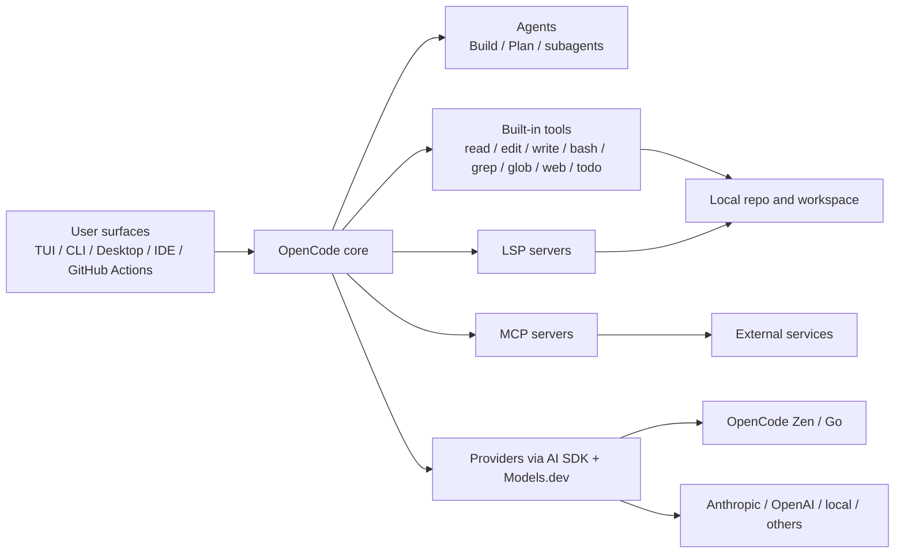

## Executive Summary

OpenCode is a mature, fast-moving open-source coding agent centered on a terminal-first workflow, but it now spans a desktop app, IDE extension, headless HTTP server, JS/TS SDK, GitHub Actions integration, LSP support, and MCP-based tool extension. Its strongest differentiators are provider-agnostic model access, a granular permission system, built-in primary and subagent roles, and a configuration system that works at user, project, organization, and managed-enterprise levels. The core repository is MIT-licensed, and the project was showing `v1.17.8` as the latest release on June 17, 2026, with recent release notes focused on MCP reliability, OpenAI-compatible tool schema fixes, and faster session timelines. citeturn2view2turn14view0turn6view7turn12view5turn12view4

BigPickle is not documented as a conventional public model with a model card; OpenCode describes it only as a **stealth model** that is **free on OpenCode for a limited time**. Officially, the practical facts that are clear today are: model ID `opencode/big-pickle`, `chat/completions` endpoint family, 200k context, 32k output, zero token price during the free period, and a privacy exception stating that collected data **may be used to improve the model** during that period. That makes BigPickle attractive as a zero-cost large-context option, but much weaker than named alternatives on provenance, compliance due diligence, and predictability. citeturn23view0turn19view0turn24view0

The most sensible practical posture is: use **OpenCode** when you want a local-first, model-flexible coding agent with strong operator control; use **BigPickle** when cost is the main constraint and the task is exploratory, non-sensitive, and easy to validate. Avoid BigPickle for regulated or confidential code, and avoid relying on it as your sole production model until you have validated its behavior on your repository, because community issue reports in 2026 include rule-following failures, premature stopping, unexpected language drift, and transient routing or compatibility bugs after upgrades. citeturn12view1turn6view2turn24view0turn20view0turn20view1turn20view2turn20view3

## Overview

OpenCode describes itself as an open-source AI coding agent available as a terminal interface, desktop app, and IDE extension. The public product page also emphasizes LSP support, multi-session work, share links, GitHub Copilot login, ChatGPT Plus/Pro login, and access to “75+” providers through Models.dev, including local models. In practice, that places OpenCode between a classic terminal pair-programmer and a more extensible agent platform. citeturn2view0turn2view1turn6view7

Architecturally, OpenCode has a relatively clean split: a user-facing shell surface area (TUI, CLI, IDE, desktop, GitHub workflow, web/headless server), a configurable agent layer, and an execution layer that combines providers, built-in tools, LSP, MCP tools, and project-local state. The agent layer includes two built-in primary agents—**Build** and **Plan**—and several built-in subagents such as **General**, **Explore**, and **Scout**. Build is the full-access default; Plan is intentionally restricted and asks before edits or bash execution. citeturn12view1turn7view4



That architecture is reflected directly in the docs. OpenCode uses the AI SDK and Models.dev for provider support; built-in tools include bash, edit, write, read, grep, glob, experimental LSP access, patching, todo management, and web tools; MCP servers can be local or remote and become available alongside built-in tools; and a headless `opencode serve` command exposes an OpenAPI HTTP interface that the SDK can drive programmatically. citeturn6view7turn21view1turn6view3turn12view5turn12view4

A useful nuance is that OpenCode’s “privacy-first” positioning is real but conditional. The site and enterprise docs say OpenCode does not store your code or context data, and Enterprise is positioned around keeping code and data inside your own infrastructure. However, credentials are stored locally in `~/.local/share/opencode/auth.json`, sessions and logs are stored in local app directories, and the share feature explicitly syncs conversation history to OpenCode servers and exposes it publicly to anyone with the link until you unshare it. That means the secure default is viable, but it is not the only operating mode. citeturn6view6turn6view7turn11view2turn13view0turn13view1

OpenCode’s licensing position is straightforward for the core product: the GitHub repository is MIT-licensed. The more important licensing and policy complexity comes from the model layer, because OpenCode can broker access to third-party models, and Zen’s hosted offerings are governed by service terms and provider-specific data handling. That distinction matters especially for BigPickle, whose upstream identity is intentionally undisclosed. citeturn2view2turn11view1turn24view0

A concise map of official links is below.

| Resource | What it covers |
|---|---|
| OpenCode project site citeturn2view1 | Product overview, install surfaces, privacy positioning |
| Docs home citeturn2view0 | Installation, configuration, usage, integrations |
| GitHub repo citeturn2view2 | Source, license, releases, issues, community |
| Download page citeturn1search4 | CLI, desktop beta, extensions |
| Zen docs citeturn2view4 | Hosted models, pricing, privacy, BigPickle details |
| Go docs citeturn11view5 | Low-cost open-model subscription |
| Models.dev provider page citeturn19view0 | Model metadata such as context, output, and capabilities |

A minimal “latest available at time of research” setup looks like this. OpenCode documents install via shell script or package managers, then provider login, project initialization, and model selection through the TUI. BigPickle can be selected through Zen and, in config form, uses the `opencode/<model-id>` naming format. citeturn3view1turn8view0turn22view2turn23view0

```bash
curl -fsSL https://opencode.ai/install | bash
cd /path/to/project
opencode
/connect
/models
/init
```

```json
{
  "$schema": "https://opencode.ai/config.json",
  "model": "opencode/big-pickle",
  "permission": {
    "*": "ask",
    "read": "allow",
    "grep": "allow",
    "glob": "allow"
  }
}
```

## Use Cases

OpenCode is best understood as a **controlled coding agent runtime**, not just a chat front end. The cleanest entry pattern is to start in **Plan** mode for repo analysis and risk-free exploration, then switch to **Build** for edits once the implementation path is clear. This works especially well because `/init` creates an `AGENTS.md` file after analyzing the project, and the docs explicitly recommend committing that file so the agent can better learn project structure and conventions over time. citeturn12view1turn3view1

A sensible interactive workflow looks like this:

```mermaid
flowchart TD
    S[Open repo] --> C[/connect provider]
    C --> M[/models select model]
    M --> I[/init create AGENTS.md]
    I --> P[Use Plan agent to inspect architecture]
    P --> B[Switch to Build for implementation]
    B --> T[Run tests or lint with bash]
    T --> G[Optionally export to GitHub workflow or share]
```

That pattern fits several concrete scenarios. First, **large-repository comprehension**: use Plan plus `@general` or `@explore` to search files, trace dependencies, and draft a change plan without granting silent write access. Second, **interactive implementation**: use Build with read/edit/bash access, plus LSP if enabled, to make precise edits and run validation commands. Third, **GitHub workflow automation**: the official GitHub integration supports issue triage, feature implementation, and PR review inside GitHub Actions runners by commenting `/opencode` or `/oc`, or by wiring scheduled or issue/PR-triggered workflows. Fourth, **embedded or programmatic control**: `opencode serve` plus `@opencode-ai/sdk` can be used to build custom interfaces, wrappers, or internal workflow automation. citeturn7view4turn21view1turn12view3turn12view4turn12view5

For a terminal-first analyst workflow, the non-interactive CLI is useful for scripting and one-shot checks:

```bash
opencode run "Explain how authentication works in this repo"
opencode run "Search for race conditions in src/auth and summarize risks"
```

The docs explicitly position `opencode run` for scripting, automation, and quick answers without launching the full TUI. citeturn8view0

For IDE-centered teams, OpenCode’s extension flow is intentionally light. The IDE docs say it works with VS Code, Cursor, and related editors that support terminals; running `opencode` in the integrated terminal can auto-install the extension, and keyboard shortcuts can insert file references into the conversation. This makes OpenCode comparatively attractive when you want the agent runtime to remain outside any one editor vendor’s proprietary stack. citeturn9view0

For repository automation, OpenCode’s GitHub integration is stronger than many users initially realize. The docs describe issue triage, branch-and-PR generation, PR review, line-specific review comments, and secure execution inside GitHub’s own runners. That gives OpenCode a practical path from local experimentation to CI-mediated automation without switching tools. citeturn12view3turn9view4

BigPickle fits a narrower but still useful set of scenarios. Because it is free, has a 200k context window, supports reasoning, tool calling, structured output, and temperature control through the OpenCode provider catalog, it is well suited as a **large-context fallback** for architectural exploration, initial repo indexing, rough implementation planning, and broad search-heavy sessions where cost would otherwise dominate tool choice. The best use is exploratory and disposable: tasks where human review is expected and model provenance is not a gating requirement. citeturn19view0turn24view0

## Comparisons

OpenCode’s closest competitors are not all trying to solve the same problem. The table below is intentionally pragmatic.

| Agent | Positioning | Key contrast with OpenCode | License and current public status | Use when | Avoid when |
|---|---|---|---|---|---|
| **OpenCode** | Terminal-first coding agent with desktop, IDE, GitHub, HTTP server, SDK, MCP, permissions, and provider flexibility. citeturn2view0turn6view7turn12view5turn12view4 | Broadest mix of local control, provider-agnostic access, and operator guardrails. | MIT; repo shows latest `v1.17.8` on Jun 17, 2026. citeturn2view2turn14view0 | You want one runtime for terminal, editor, GitHub, and internal automation. | You need a slower-moving, narrower tool surface with fewer moving parts. |
| **Aider** | Terminal AI pair programmer focused on code editing with broad LLM support and repo mapping. citeturn17view2 | Simpler and more opinionated; less of an agent platform, more of a terminal copilot. | Apache-2.0; repo showed `v0.86.0` on Aug 9, 2025. citeturn17view2turn15search17 | You want minimal setup and a focused terminal editing workflow. | You need first-class MCP/server/enterprise-style configuration layers. |
| **Cline** | Autonomous coding agent as SDK, IDE extension, and CLI. citeturn17view3 | Stronger editor-centric identity; OpenCode is more terminal-native and permission-explicit. | Apache-2.0; repo showed CLI `v3.0.27` on Jun 17, 2026. citeturn17view3 | You want an agent that lives primarily inside the editor and CI/CD. | You prefer a terminal-native workflow and explicit permission gating as a first-class primitive. |
| **OpenHands** | Self-hosted developer control center for agents and automations across local, remote, and cloud backends. citeturn17view0 | Stronger on always-on orchestration and multi-backend automation; heavier operational footprint. | Core MIT with source-available enterprise/cloud components documented separately. citeturn16search12turn17view1 | You need persistent agents, cloud backends, Slack/GitHub automation, or team control centers. | You want a lighter local install and tighter terminal loop. |
| **Goose** | Native open-source general-purpose agent for desktop, CLI, and API, not limited to coding. citeturn17view4 | Broader general-agent ambition; OpenCode is more coding-specific and workflow-opinionated. | Apache-2.0; part of the Agentic AI Foundation. citeturn17view4 | You want one local agent for code, research, writing, and automation. | You want a coding-specialized agent with stronger built-in repo/permissions conventions. |

BigPickle is harder to compare on model lineage because OpenCode intentionally does not disclose its upstream identity. The operational comparison below is therefore about what is actually documented today.

| Model | What is officially known | Practical reading | Use when | Avoid when |
|---|---|---|---|---|
| **BigPickle** | Stealth model; `opencode/big-pickle`; `chat/completions`; 200k context / 32k output; free for a limited time; data may be used to improve the model during the free period. citeturn23view0turn19view0turn24view0 | Cheapest large-context option in OpenCode, but the least transparent on provenance. | Large-context exploration, draft plans, low-risk prototyping, fallback routing. | Confidential code, compliance-sensitive teams, or tasks requiring auditable model provenance. |
| **DeepSeek V4 Flash Free** | Free during limited period; `chat/completions`; 200k / 128k in the OpenCode provider catalog; data may be used to improve the model during the free period. citeturn23view0turn19view0turn24view0 | Better documented family name and much larger output budget than BigPickle. | Cost-sensitive coding sessions needing longer outputs. | Same privacy caveat as other free-collection models. |
| **MiMo-V2.5 Free** | Free during limited period; 200k / 32k in the provider catalog; data may be used to improve the model during the free period. citeturn24view0turn19view0 | Similar output envelope to BigPickle, but disclosed family name. | Alternative free model for benchmarking against BigPickle on your repo. | Sensitive code or production-critical unattended edits. |
| **North Mini Code Free** | Free during limited period; 256k / 64k in the provider catalog; provider-specific retention and improvement notice warns against personal or confidential data. citeturn24view0turn19view0 | The strongest official warning among the free options. | Code-focused experiments on non-sensitive repos. | Any repo with proprietary or regulated content. |
| **Claude Sonnet 4.5** | Named model; `messages`; pricing known; 1M context / 64k output in OpenCode’s provider catalog. citeturn23view3turn19view0turn24view0 | Higher-cost but much easier to justify for quality, provenance, and enterprise review. | High-value implementation, production code review, and stricter instruction following. | Cost-constrained exploratory work where a free model is good enough. |

My recommendation is straightforward: if you want **one default setup**, use **OpenCode + a named premium model for production work**, and keep **BigPickle** as a **free exploration or overflow model** rather than the authoritative model for final edits. That recommendation is an inference from OpenCode’s documented permission model and BigPickle’s limited disclosure plus the 2026 issue pattern. citeturn6view2turn24view0turn20view0turn20view1turn20view2turn20view3

## Caveats

The biggest caveat with OpenCode is not that it lacks capability, but that it exposes a lot of power. By default, tools are enabled, and tool behavior is governed by a permission system that can allow, ask, or deny individual actions. That is excellent for advanced users, but it means poor defaults or permissive configurations can give the model broad file and shell access. In addition, MCP tools consume context, and the docs explicitly warn that some MCP servers can add enough tokens to exceed context limits. citeturn6view0turn6view2turn6view3

A second caveat is privacy mode drift. OpenCode says it does not store your code or context data in normal operation, but several features change the data surface materially: local auth and session storage live on disk, the share feature uploads conversation history to OpenCode servers, and shared conversations remain accessible until explicitly unshared. For organizations, this argues strongly for disabling share by policy unless there is a deliberate collaboration need. citeturn6view6turn11view2turn13view0turn13view1

BigPickle has a sharper privacy caveat still. OpenCode’s Zen docs explicitly carve BigPickle out from the normal zero-retention statement and say that, during the free period, collected data may be used to improve the model. Combined with the fact that it is a stealth model with no public model card in the official materials, that creates a real compliance and procurement risk. The important point is not that the model is necessarily unsafe, but that official due-diligence artifacts are materially thinner than for named model families. That last sentence is an inference from the documented “stealth” status and absence of further public disclosure in official docs. citeturn24view0

On reliability, OpenCode itself looks healthy as a project. The repo is large, active, and ships frequent releases; the latest public release on June 17, 2026 included fixes around MCP behavior, provider compatibility, and session performance, and the docs were updated on June 18, 2026. That is a sign of responsiveness, but it also suggests a rapidly evolving surface area where regressions are realistic. The BigPickle-specific issue history reinforces this: public reports in 2026 mention ignoring `AGENTS.md` rules, stopping early in plan-like tasks, verbose or unstable reasoning, unexpected Chinese output, and at least one version-specific routing error after a client upgrade. citeturn14view0turn9view0turn20view0turn20view1turn20view2turn20view3

On community and support status, OpenCode appears strong for an open-source agent: the main repo shows very large adoption, active releases, Discord presence, a growing ecosystem around plugins and themes, and community integrations. The ecosystem itself is now substantive enough that “OpenCode” should be thought of as a platform, not just a binary. That is an advantage if you want extensibility, but a risk if you need a conservative, low-change operational baseline. citeturn3view3turn2view2turn21view0turn14view0

The concise bottom line is this: **OpenCode is easy to recommend; BigPickle is easy to experiment with, but not yet easy to standardize on.** OpenCode’s core is transparent, permissively licensed, and operationally versatile. BigPickle is currently valuable mostly because it is free and large-context, not because it is well-documented. For serious teams, that distinction should drive deployment policy. citeturn2view2turn24view0turn19view0