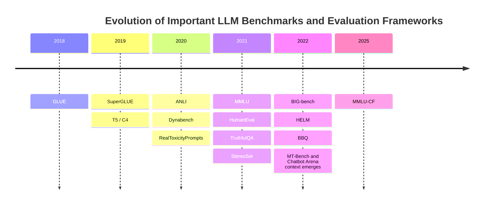

## Executive Summary

Large language model benchmarks are not simply “leaderboards.” They are measurement systems that turn abstract capabilities into reproducible observable signals: first defining tasks and data distributions, then fixing prompt formats, decoding rules, scoring functions, and statistical procedures, and finally mapping model outputs into comparable numbers. A good benchmark should answer three questions at the same time: whether the model **can do the task**, **under what conditions it performs well**, and **whether we can trust that the score truly reflects capability**. GLUE and SuperGLUE represent classic task collections; MMLU represents broad-domain knowledge and exam-style ability; HumanEval represents functional correctness in programming; BIG-bench and HELM shift the focus from single tasks to capability maps and multidimensional evaluation; C4, strictly speaking, is a corpus rather than a benchmark, but it is often mistakenly discussed as an evaluation term. That confusion itself is common in LLM evaluation discussions. ([Wang et al., 2018](https://aclanthology.org/W18-5446/); [Wang et al., 2019](https://papers.neurips.cc/paper_files/paper/2019/hash/4496bf24afe7fab6f046bf4923da8de6-Abstract.html); [Hendrycks et al., 2021](https://arxiv.org/abs/2009.03300); [Chen et al., 2021](https://arxiv.org/abs/2107.03374); [Srivastava et al., 2022](https://arxiv.org/abs/2206.04615); [Liang et al., 2023](https://arxiv.org/abs/2211.09110); [Raffel et al., 2020](https://arxiv.org/abs/1910.10683))

If there is only one thing to remember, it is this: **a benchmark score is always an estimate under a specific protocol; it is not the capability itself**. The same model may score very differently under zero-shot, few-shot, chain-of-thought, self-consistency, different stop sequences, different answer extraction rules, and different tokenization. Therefore, if cross-paper comparisons do not align the protocol, they often compare “evaluation settings” rather than “models.” This is also why contamination, dynamic benchmarks, LLM-as-a-judge bias, and reproducibility reporting standards have become increasingly important in recent years. ([Brown et al., 2020](https://arxiv.org/abs/2005.14165); [Wei et al., 2022](https://arxiv.org/abs/2201.11903); [Wang et al., 2023](https://arxiv.org/abs/2203.11171); [Dror et al., 2018](https://aclanthology.org/P18-1128/); [Kiela et al., 2021](https://arxiv.org/abs/2104.14337); [Zheng et al., 2023](https://arxiv.org/abs/2306.05685); [Deng et al., 2024](https://aclanthology.org/2024.naacl-long.482/); [Zhao et al., 2025](https://aclanthology.org/2025.acl-long.656/))

For technical readers, the most practical framework is to decompose a benchmark into five layers: **measurement objective**, **data design**, **prompt and decoding protocol**, **scoring metric**, and **statistical and reporting standard**. If any one layer is handled poorly, even a visually impressive score can lead to misleading conclusions. The following sections explain benchmark types, representative cases, metric mathematics, statistical validity, contamination and safety risks, and final recommendations for design and interpretation. ([Liang et al., 2023](https://arxiv.org/abs/2211.09110); [Wang et al., 2018](https://aclanthology.org/W18-5446/); [Wang et al., 2019](https://papers.neurips.cc/paper_files/paper/2019/hash/4496bf24afe7fab6f046bf4923da8de6-Abstract.html); [Hendrycks et al., 2021](https://arxiv.org/abs/2009.03300); [Srivastava et al., 2022](https://arxiv.org/abs/2206.04615))

## Definition and Purpose of Benchmarks

In the most general form, a benchmark can be written as a quadruple
$$B = (\mathcal{D}, \Pi, M, S),$$
where $$\mathcal{D}$$ is the evaluation data and task distribution, $$\Pi$$ is the prompting and inference protocol, $$M$$ is the set of models being evaluated, and $$S$$ is the scoring rule that maps outputs into metrics. This formalization matters because in the LLM era, beyond “data” and “model,” **prompt protocol** and **scoring rule** often dominate results. There are many examples: the core of GLUE and SuperGLUE is fixed tasks plus private tests; the core of MMLU is four-choice knowledge testing; the core of HumanEval is not string matching but unit-test pass rate; HELM explicitly reports multiple objectives such as accuracy, fairness, toxicity, efficiency, and calibration rather than collapsing everything into a single total score. ([Wang et al., 2018](https://aclanthology.org/W18-5446/); [Wang et al., 2019](https://papers.neurips.cc/paper_files/paper/2019/hash/4496bf24afe7fab6f046bf4923da8de6-Abstract.html); [Hendrycks et al., 2021](https://arxiv.org/abs/2009.03300); [Chen et al., 2021](https://arxiv.org/abs/2107.03374); [Liang et al., 2023](https://arxiv.org/abs/2211.09110))

Benchmarks generally serve four purposes. The first is **model selection**: for example, choosing which checkpoint is more suitable for knowledge QA, code generation, or a dialogue product. The second is **research attribution**: determining whether an improvement comes from model architecture, data, alignment method, inference strategy, or merely prompt engineering. The third is **risk exposure**: for example, TruthfulQA, RealToxicityPrompts, StereoSet, BBQ, ANLI, and Dynabench are designed to expose model errors, bias, or brittleness. The fourth is **governance and communication**: frameworks such as HELM are not primarily about identifying first place, but about making results multidimensional, auditable, reportable, and reproducible. ([Lin et al., 2022](https://arxiv.org/abs/2109.07958); [Gehman et al., 2020](https://arxiv.org/abs/2009.11462); [Nadeem et al., 2021](https://aclanthology.org/2021.acl-long.416/); [Parrish et al., 2022](https://aclanthology.org/2022.findings-acl.165/); [Nie et al., 2020](https://aclanthology.org/2020.acl-main.441/); [Kiela et al., 2021](https://arxiv.org/abs/2104.14337); [Liang et al., 2023](https://arxiv.org/abs/2211.09110))

Benchmarks also have structural limitations. Static datasets may be absorbed into training data, leaderboards may incentivize the research community to overfit a small number of public tests, single numbers may hide sub-capabilities and risk dimensions, and open-ended generation tasks often rely on human or LLM judges because automatic scoring is insufficient, further introducing evaluator bias. GLUE was already described by its authors as having shrinking headroom one year after launch; SuperGLUE was created to address that problem; MMLU-CF further incorporates contamination resistance directly into benchmark design. ([Wang et al., 2019](https://papers.neurips.cc/paper_files/paper/2019/hash/4496bf24afe7fab6f046bf4923da8de6-Abstract.html); [Zhao et al., 2025](https://aclanthology.org/2025.acl-long.656/); [Deng et al., 2024](https://aclanthology.org/2024.naacl-long.482/); [Kiela et al., 2021](https://arxiv.org/abs/2104.14337))

## Benchmark Types and Representative Examples

From the perspective of use case, common benchmarks can be divided into five major types. **Task-based** benchmarks focus on explicit task collections, such as GLUE, SuperGLUE, and SQuAD. **Capability-based** benchmarks focus on knowledge, reasoning, programming, or broad multi-domain coverage, such as MMLU and BIG-bench. **Adversarial** benchmarks expose fragility through human adversarial construction or dynamic data collection, such as ANLI and Dynabench. **Human-preference or human-evaluation** benchmarks use human or judge-model pairwise preference, such as MT-Bench and Chatbot Arena. **Synthetic or programmatic** benchmarks use programmable rules, unit tests, or manually constructed samples to increase control, such as HumanEval and many synthetic or programmatic tasks inside BIG-bench. HELM crosses these categories, but it is better understood as an “evaluation framework” rather than a single dataset. ([Wang et al., 2018](https://aclanthology.org/W18-5446/); [Wang et al., 2019](https://papers.neurips.cc/paper_files/paper/2019/hash/4496bf24afe7fab6f046bf4923da8de6-Abstract.html); [Hendrycks et al., 2021](https://arxiv.org/abs/2009.03300); [Srivastava et al., 2022](https://arxiv.org/abs/2206.04615); [Chen et al., 2021](https://arxiv.org/abs/2107.03374); [Nie et al., 2020](https://aclanthology.org/2020.acl-main.441/); [Kiela et al., 2021](https://arxiv.org/abs/2104.14337); [Zheng et al., 2023](https://arxiv.org/abs/2306.05685); [Liang et al., 2023](https://arxiv.org/abs/2211.09110))

The following table gives a compressed reference first; the later paragraphs add scope, source, licensing, and typical score ranges.

| benchmark | year | tasks                                                           | main metric                                                             | language                                                                                  | scale                                                                        | license                                       | typical use                                                   |
| --------- | ---: | --------------------------------------------------------------- | ----------------------------------------------------------------------- | ----------------------------------------------------------------------------------------- | ---------------------------------------------------------------------------- | --------------------------------------------- | ------------------------------------------------------------- |
| GLUE      | 2018 | 9 NLU tasks                                                     | Accuracy, F1, Matthews, Pearson/Spearman, average score                 | English                                                                                   | 9 tasks; each task ranges from hundreds to hundreds of thousands of examples | Inherits original dataset licenses            | Transfer learning and general NLU comparison                  |
| SuperGLUE | 2019 | 8 harder NLU tasks                                              | Accuracy, F1/Acc, F1a/EM, EM/F1, average score                          | English                                                                                   | 8 tasks; mixture of low-resource and large reading-comprehension tasks       | Inherits original dataset licenses            | Harder semantic understanding and low-resource generalization |
| MMLU      | 2021 | 57 subject-area four-choice exams                               | Accuracy                                                                | English                                                                                   | About 116k total questions, 57 subjects                                      | MIT                                           | Broad-domain knowledge and exam-style reasoning               |
| HumanEval | 2021 | Python function generation                                      | pass@k                                                                  | Python tasks plus English docstrings                                                      | 164 problems                                                                 | MIT                                           | Functional correctness of code generation                     |
| BIG-bench | 2022 | 204 diverse tasks                                               | Task-dependent, often exact match or multiple-choice accuracy           | Mainly English, also includes 1000+ written languages and synthetic/programming languages | 204 tasks                                                                    | Apache-2.0                                    | Capability exploration, scaling effects, emergent behavior    |
| HELM      | 2022 | 42 scenarios, 7 metrics, 30 models in the initial evaluation    | Accuracy, calibration, robustness, fairness, toxicity, efficiency, etc. | Mainly English, multiple scenarios                                                        | Framework-style, not a single fixed dataset                                  | Apache-2.0 for code; data depends on scenario | Multidimensional auditing and risk/performance trade-offs     |
| C4        | 2019 | Strictly speaking, a pretraining corpus rather than a benchmark | Often paired with perplexity or downstream transfer scores              | Mainly English; community-derived multilingual versions exist                             | Hundreds of GB; HF multilingual version is 10B–100B scale                    | ODC-By and source-site terms                  | Pretraining corpus and data-quality research                  |

The table synthesizes information from the original papers and official materials for GLUE, SuperGLUE, MMLU, HumanEval, BIG-bench, HELM, and T5/C4. ([Wang et al., 2018](https://aclanthology.org/W18-5446/); [Wang et al., 2019](https://papers.neurips.cc/paper_files/paper/2019/hash/4496bf24afe7fab6f046bf4923da8de6-Abstract.html); [Hendrycks et al., 2021](https://arxiv.org/abs/2009.03300); [Chen et al., 2021](https://arxiv.org/abs/2107.03374); [Srivastava et al., 2022](https://arxiv.org/abs/2206.04615); [Liang et al., 2023](https://arxiv.org/abs/2211.09110); [Raffel et al., 2020](https://arxiv.org/abs/1910.10683))

**GLUE** covers general English NLU and includes CoLA, SST-2, MRPC, STS-B, QQP, MNLI, QNLI, RTE, WNLI, and a diagnostic set. The official task design deliberately mixes large-scale and low-resource datasets, in-domain and cross-domain settings, sentence classification and sentence-pair inference. Therefore, it measures not just optimization on one task, but “transfer and sample efficiency.” The metric is the average of task-specific metrics: CoLA uses Matthews correlation; MRPC/QQP use accuracy and F1; STS-B uses Pearson and Spearman; most others use accuracy. The data was not built from scratch but integrated from existing public datasets, so licensing also follows the original data sources. Historically, representative GLUE scores roughly ranged from the original strong baseline of 63.7, to 2019 SOTA of 88.4, to T5-11B at 90.3, and around 91.3 on the official leaderboard; this is also why GLUE later came to be viewed as close to saturation. ([Wang et al., 2018](https://aclanthology.org/W18-5446/); [Wang et al., 2019](https://papers.neurips.cc/paper_files/paper/2019/hash/4496bf24afe7fab6f046bf4923da8de6-Abstract.html); [Raffel et al., 2020](https://arxiv.org/abs/1910.10683))

**SuperGLUE** was proposed to restore difficulty and headroom. It keeps GLUE’s high-level goal but replaces the tasks with 8 harder, lower-resource, more varied tasks: BoolQ, CB, COPA, MultiRC, ReCoRD, RTE, WiC, and WSC, while adding diagnostic sets and more complete human baselines. Its metrics are also task-specific: for example, CB reports F1/Accuracy, MultiRC reports F1a/EM, ReCoRD reports EM/F1, and most others use accuracy. The data still mostly comes from existing datasets, so licensing again depends on the original sources. In the original paper, BERT scored 69.0, BERT++ scored 71.5, and the estimated human score was 89.8; T5-11B later pushed the average score to 88.9, nearly matching humans. However, the authors also noted that “machine superhuman” performance on MultiRC and ReCoRD may reflect metrics biased toward machine-like outputs rather than true understanding beyond humans. This is a classic case of benchmark interpretation. ([Wang et al., 2019](https://papers.neurips.cc/paper_files/paper/2019/hash/4496bf24afe7fab6f046bf4923da8de6-Abstract.html); [Raffel et al., 2020](https://arxiv.org/abs/1910.10683))

**MMLU** covers four-choice exams across 57 academic and professional subjects, from elementary mathematics and history to law, medicine, and ethics. Its advantages are broad coverage, simple scoring, and strong sensitivity to few-shot/in-context learning, so it quickly became the de facto standard for “knowledge and exam-style reasoning.” The official dataset card lists about 116k rows, English, and MIT licensing. The original paper notes that the random baseline is 25%, while the largest GPT-3 few-shot model at the time scored about 43.9%; the official repository later lists GPT-2 at 32.4, fine-tuned GPT-3 at 53.9, and Chinchilla at 67.5; the GPT-4 technical report reports 86.4%. But this benchmark also became one of the earliest centers of contamination controversy. Later work proposed detection methods such as retrieval overlap and TS-Guessing, observing suspicious memorization-like behavior for some closed models on MMLU. MMLU-CF redesigned the benchmark with a larger source pool, three decontamination rules, and a closed-source test set, showing that model scores and rankings change substantially relative to the original MMLU. ([Hendrycks et al., 2021](https://arxiv.org/abs/2009.03300); [OpenAI, 2023](https://cdn.openai.com/papers/gpt-4.pdf); [Deng et al., 2024](https://aclanthology.org/2024.naacl-long.482/); [Zhao et al., 2025](https://aclanthology.org/2025.acl-long.656/))

**HumanEval** specifically evaluates Python code generation. It has only 164 problems, but each problem includes a function signature, docstring, and unit tests. Scoring is not based on whether the output string resembles the reference answer, but whether the generated program passes tests, making it closer to actual functional correctness than BLEU/ROUGE. The official dataset card marks English descriptions, Python tasks, and MIT licensing. The original Codex paper reports GPT-3 at 0%, GPT-J at 11.4%, and Codex at 28.8% pass@1; if taking 100 samples per problem, it reaches 70.2% pass@100. The GPT-4 technical report reports 67.0%, and Code Llama also reports up to 67% on HumanEval. This shows that HumanEval is highly sensitive to **sampling strategy**: pass@1, pass@10, and pass@100 are not descriptions of the same capability. ([Chen et al., 2021](https://arxiv.org/abs/2107.03374); [OpenAI, 2023](https://cdn.openai.com/papers/gpt-4.pdf); [Rozière et al., 2023](https://arxiv.org/abs/2308.12950))

**BIG-bench** aims to test “capabilities that current models have not yet mastered, but that future models may suddenly acquire.” The original version has 204 tasks from more than 100 institutions and hundreds of contributors, covering linguistics, common sense, mathematics, bias, programming, and multilingual tasks. The official dataset card shows that the Hugging Face implementation contains 167 JSON tasks and 24 lite tasks, and that the whole benchmark includes 1000+ written languages as well as synthetic/programming languages, licensed under Apache-2.0. Its scoring is not a single formula but task-dependent, with many tasks using exact match or multiple-choice accuracy. The key finding of the original paper is not a leaderboard, but that as scale increases, model performance and calibration generally improve, while absolute performance often remains below human levels; some capabilities improve smoothly, while others appear to break through suddenly at certain scales. Later BBH work further showed that prompt protocol can strongly change conclusions: with chain-of-thought, PaLM exceeded average human performance on 10 of 23 difficult tasks, while Codex exceeded it on 17. ([Srivastava et al., 2022](https://arxiv.org/abs/2206.04615); [Suzgun et al., 2022](https://arxiv.org/abs/2210.09261))

**HELM** differs most from the above benchmarks because it does not pursue a single total score. Instead, it explicitly decomposes evaluation into multiple dimensions. The initial evaluation covered 42 scenarios, 7 metric categories, and 30 prominent models, aiming to expose accuracy, calibration, robustness, fairness, bias, toxicity, efficiency, and other aspects simultaneously. It is therefore closer to an “audit framework”: suitable for answering “which model performs better on which task, at what cost, and with what risks,” rather than “who is first place.” In practical interpretation, HELM’s “typical score range” should not be reduced to a single number. A better statement is that reachable ranges vary greatly by scenario, and the real value lies in the trade-off surface and reporting transparency. ([Liang et al., 2023](https://arxiv.org/abs/2211.09110))

**C4** must be strictly distinguished from benchmarks. It is the Colossal Clean Crawled Corpus proposed by T5, a cleaned Common Crawl pretraining corpus, not a benchmark. Its research value lies in data quality and pretraining design rather than leaderboard evaluation. The T5 paper states that C4 is a hundreds-of-GB clean English web text corpus; the Hugging Face C4 card marks multilingual derived versions at 10B–100B scale and licensing as ODC-By. Whenever a report mixes “a score on C4” with “a score on GLUE/MMLU,” it has already confused two different layers: “corpus” and “evaluation.” ([Raffel et al., 2020](https://arxiv.org/abs/1910.10683))

The timeline of major benchmarks is as follows. ([Wang et al., 2018](https://aclanthology.org/W18-5446/); [Wang et al., 2019](https://papers.neurips.cc/paper_files/paper/2019/hash/4496bf24afe7fab6f046bf4923da8de6-Abstract.html); [Raffel et al., 2020](https://arxiv.org/abs/1910.10683); [Hendrycks et al., 2021](https://arxiv.org/abs/2009.03300); [Chen et al., 2021](https://arxiv.org/abs/2107.03374); [Srivastava et al., 2022](https://arxiv.org/abs/2206.04615); [Liang et al., 2023](https://arxiv.org/abs/2211.09110); [Zhao et al., 2025](https://aclanthology.org/2025.acl-long.656/))

## Metric Calculation and Limitations

Most benchmark metrics can be viewed as averages of some sample-level loss or similarity function. The most basic is **accuracy**:

$$
\mathrm{Acc}=\frac{1}{n}\sum_{i=1}^{n}\mathbf{1}(\hat y_i=y_i).
$$

It is intuitive, interpretable, and easy to attach confidence intervals to, but it can be misleading when classes are imbalanced or when open-ended generation has multiple valid answers. For extractive QA or information extraction, **precision**, **recall**, and **F1** are more common:

$$
P=\frac{TP}{TP+FP},\qquad
R=\frac{TP}{TP+FN},\qquad
F_1=\frac{2PR}{P+R}.
$$

F1 is more tolerant of partial matches than accuracy, but it may still over-reward surface overlap. SQuAD-style tasks therefore often report both **Exact Match** — exact agreement after normalization — and token-level F1. ([Rajpurkar et al., 2016](https://arxiv.org/abs/1606.05250); [Rajpurkar et al., 2018](https://arxiv.org/abs/1806.03822))

**BLEU** and **ROUGE** are string-overlap metrics. The standard BLEU form uses clipped n-gram precision with a brevity penalty:

$$
\mathrm{BLEU}=BP\cdot \exp\left(\sum_{n=1}^{N} w_n \log p_n\right),\qquad
BP=\min\left(1,e^{,1-r/c}\right),
$$

where $$p_n$$ is clipped n-gram precision, $$r$$ is reference length, and $$c$$ is output length. BLEU has a historically important role in machine translation, but for open-ended generation, summarization, and code, it often overemphasizes surface form. ROUGE is more recall-oriented, for example:

$$
\mathrm{ROUGE}\mbox{-}N=\frac{\sum_{\text{ref }g}\mathrm{Count}*{\text{match}}(g)}{\sum*{\text{ref }g}\mathrm{Count}(g)}.
$$

ROUGE-N measures n-gram coverage, while ROUGE-L measures longest common subsequence. It is usually more natural than BLEU for summarization, but it still cannot reliably capture factual consistency or semantic equivalence. ([Papineni et al., 2002](https://aclanthology.org/P02-1040/); [Lin, 2004](https://aclanthology.org/W04-1013/))

Internal language-modeling quality is often measured by **negative log-likelihood** and **perplexity**:

$$
\mathrm{NLL}=-\frac{1}{T}\sum_{t=1}^{T}\log p_\theta(x_t\mid x_{<t}),
\qquad
\mathrm{PPL}=\exp(\mathrm{NLL}).
$$

Perplexity is sensitive to predictive distributions and is suitable for comparing next-token models under the same tokenization and corpus. Once tokenizer, character normalization, or corpus source differs, horizontal comparison becomes difficult. More importantly, low perplexity does not guarantee strong instruction following, truthfulness, or safety, so it is better understood as a **modeling-quality metric**, not a complete capability metric. ([Raffel et al., 2020](https://arxiv.org/abs/1910.10683); [OpenAI, 2023](https://cdn.openai.com/papers/gpt-4.pdf))

Another unavoidable dimension in the LLM era is **calibration**. Ideal calibration is defined as:

$$
\Pr(\hat Y=Y\mid \hat P=p)=p,\quad \forall p\in[0,1].
$$

That is, when a model reports 0.8 confidence, it should be correct about 80% of the time in the long run. In practice, people often use **Expected Calibration Error**:

$$
\mathrm{ECE}=\sum_{m=1}^{M}\frac{|B_m|}{n}\left|\mathrm{acc}(B_m)-\mathrm{conf}(B_m)\right|,
$$

where $$B_m$$ is the $$m$$-th confidence bin. ECE is easy to understand and works well with reliability diagrams, but it depends on the binning strategy and compresses “where the model is miscalibrated” into a single number. MMLU- and BIG-bench-style evaluations often need additional calibration reporting because models do not merely answer incorrectly; they often answer incorrectly **with great confidence**. ([Guo et al., 2017](https://proceedings.mlr.press/v70/guo17a.html); [Hendrycks et al., 2021](https://arxiv.org/abs/2009.03300); [Srivastava et al., 2022](https://arxiv.org/abs/2206.04615))

For open-ended dialogue and aligned models, **human preference score** and **win rate** are more common. If one output wins in pairwise comparison, one can define:

$$
\mathrm{WinRate}=\frac{W+0.5T}{W+L+T},
$$

where $$W,L,T$$ are wins, losses, and ties. If scoring uses Likert scales or rubrics, one can take the average score, but pairwise win rate is usually more stable than absolute scoring. Since InstructGPT, pairwise human preference has become almost standard for comparing aligned models. MT-Bench and Chatbot Arena systematized this idea and reported that GPT-4 judge agreement with human preferences can exceed 80%. The weakness is that judge bias is hard to eliminate completely, including position bias, verbosity bias, and self-enhancement bias. ([Ouyang et al., 2022](https://arxiv.org/abs/2203.02155); [Zheng et al., 2023](https://arxiv.org/abs/2306.05685))

The table below compresses common metrics, strengths, weaknesses, and failure modes from a practical perspective.

| metric                | what it measures well                                      | strength                                             | weakness                                 | common failure mode                                         |
| --------------------- | ---------------------------------------------------------- | ---------------------------------------------------- | ---------------------------------------- | ----------------------------------------------------------- |
| Accuracy              | Whether classification/multiple-choice answers are correct | Intuitive, easy to compute CI and significance tests | Misleading under class imbalance         | Learns option bias or formatting cues                       |
| F1                    | Extraction, QA, detection tasks                            | Reflects partial match                               | Still biased toward literal overlap      | Semantically correct paraphrases are underestimated         |
| EM                    | Extractive QA                                              | Strict, prevents fuzzy interpretation                | Too harsh                                | Correct but differently phrased answers get 0               |
| BLEU                  | Translation                                                | Cheap and reproducible                               | Insensitive to semantic equivalence      | High n-gram overlap but wrong meaning                       |
| ROUGE                 | Summarization                                              | Sensitive to coverage                                | Does not guarantee factuality            | Sentence copying scores high; hallucination not penalized   |
| Perplexity            | Next-token modeling                                        | Sensitive to model distribution                      | Not comparable across tokenizers/corpora | Low PPL but poor downstream ability                         |
| ECE                   | Trustworthiness of confidence                              | Reveals over/under-confidence                        | Depends on binning                       | Severe local miscalibration is averaged away                |
| Preference / Win-rate | Dialogue quality and alignment                             | Closer to product experience                         | Expensive or judge-biased                | Rewards verbosity, surface politeness, or judge preferences |

The table synthesizes perspectives from original work on BLEU, ROUGE, SQuAD, calibration, InstructGPT, and MT-Bench. ([Papineni et al., 2002](https://aclanthology.org/P02-1040/); [Lin, 2004](https://aclanthology.org/W04-1013/); [Rajpurkar et al., 2018](https://arxiv.org/abs/1806.03822); [Guo et al., 2017](https://proceedings.mlr.press/v70/guo17a.html); [Ouyang et al., 2022](https://arxiv.org/abs/2203.02155); [Zheng et al., 2023](https://arxiv.org/abs/2306.05685))

In one sentence: **judging whether a benchmark is trustworthy is often more important than calculating the score itself**. For closed-form tasks, accuracy/F1 works well. For summarization and open-ended generation, BLEU/ROUGE are only weak proxies. For high-risk products, reports without calibration, preference, and robustness are incomplete. For code and tool use, execution-based evaluation is preferable. ([Chen et al., 2021](https://arxiv.org/abs/2107.03374); [Liang et al., 2023](https://arxiv.org/abs/2211.09110); [Zheng et al., 2023](https://arxiv.org/abs/2306.05685))

## Evaluation Design and Statistical Validity

The most underestimated part of LLM evaluation design is the **prompt protocol**. Brown et al. formalized zero-shot, one-shot, and few-shot as different in-context learning settings; Wei et al. showed that chain-of-thought can greatly improve complex reasoning; Wang et al. further showed that self-consistency, which samples multiple reasoning paths and takes a majority vote, can further improve scores. This means benchmark score is not a function of $$\mathcal{D}$$ alone, but an interaction between $$\mathcal{D}$$ and $$\Pi$$: **how you ask often determines what you measure**. Therefore, putting “MMLU 0-shot” and “MMLU 5-shot CoT self-consistency” on the same line for comparison is methodologically problematic. ([Brown et al., 2020](https://arxiv.org/abs/2005.14165); [Wei et al., 2022](https://arxiv.org/abs/2201.11903); [Wang et al., 2023](https://arxiv.org/abs/2203.11171))

At the implementation level, at minimum one should fix and report the following: template, system prompt, number and sampling method of few-shot exemplars, option order, whether chain-of-thought is allowed, answer extraction rules, stop sequence, max tokens, temperature, top-$$p$$, whether multiple samples are drawn, how refusal/null answers are handled, and tokenizer and preprocessing versions. HumanEval is especially sensitive to sampling; self-consistency itself uses higher-temperature sampling of multiple reasoning paths before aggregation, so “temperature=0” and “temperature>0” often measure two different inference regimes. ([Chen et al., 2021](https://arxiv.org/abs/2107.03374); [Wang et al., 2023](https://arxiv.org/abs/2203.11171); [EleutherAI lm-evaluation-harness](https://github.com/EleutherAI/lm-evaluation-harness))

The evaluation flow can be conceptualized as follows. ([Liang et al., 2023](https://arxiv.org/abs/2211.09110); [EleutherAI lm-evaluation-harness](https://github.com/EleutherAI/lm-evaluation-harness))

```mermaid id="3q8quo"
flowchart LR
    A[Task definition and data split] --> B[Prompt template and few-shot examples]
    B --> C[Decoding settings<br/>temperature top-p max tokens stop]
    C --> D[Model generation]
    D --> E[Answer extraction and normalization]
    E --> F[Automatic scoring<br/>accuracy F1 pass@k ECE]
    F --> G[Human or LLM judge review]
    G --> H[Statistical analysis<br/>CI paired test multiple comparisons]
    H --> I[Reporting and reproducible release]
```

For **human evaluation**, the key is not merely “whether humans were involved,” but whether the protocol is rigorous. To build human baselines, SuperGLUE used Mechanical Turk crowdworkers, first training them and then collecting annotations. InstructGPT collected human demonstrations and pairwise preference rankings. MT-Bench and Chatbot Arena showed that strong judge models can serve as lower-cost substitutes, but they also explicitly documented position bias and verbosity bias. In practice, an ideal protocol should include at least: double blinding, randomized presentation order, explicit rubric, repeated annotation, arbitration mechanisms, inter-rater agreement reporting, and a valid “unclear/unjudgeable” option. ([Wang et al., 2019](https://papers.neurips.cc/paper_files/paper/2019/hash/4496bf24afe7fab6f046bf4923da8de6-Abstract.html); [Ouyang et al., 2022](https://arxiv.org/abs/2203.02155); [Zheng et al., 2023](https://arxiv.org/abs/2306.05685))

For statistical validity, for Bernoulli-type metrics such as accuracy, a basic approximate confidence interval can be written as:

$$
\hat p \pm z_{\alpha/2}\sqrt{\frac{\hat p(1-\hat p)}{n}}.
$$

But in benchmark comparisons, **paired bootstrap** or **permutation/randomization tests** are more common and more appropriate, because two models are usually compared on the same samples and observations are not independent. Dror et al. systematically organized significance-test choices in NLP; later work also argues that one should not report only $$p$$-values, but also effect sizes and confidence intervals, because “statistically significant” does not mean “practically important.” ([Dror et al., 2018](https://aclanthology.org/P18-1128/); [Delobelle et al., 2022](https://aclanthology.org/2022.lrec-1.640/))

**Multiple comparisons** are often ignored in leaderboard culture. Suppose you compare 20 models, 10 benchmarks, and dozens of prompt variants. Without controlling family-wise error rate or false discovery rate, it is almost inevitable that “some setting happens to win by a lot.” Conservative control can use Bonferroni; more practical control can use Benjamini–Hochberg. More importantly, one should pre-register the main analysis and report exploratory analysis separately from confirmatory analysis. This is especially important in research involving prompt ablation, CoT, and decoding sweeps. ([Dror et al., 2018](https://aclanthology.org/P18-1128/))

Calibration itself is also part of statistical validity. If a model has 80% accuracy on MMLU but only 70% correctness in the confidence-0.95 bin, its product risk may be higher than another model with 78% accuracy but good calibration. This is also why HELM includes calibration and efficiency in the same evaluation report rather than collapsing everything into one average score. ([Guo et al., 2017](https://proceedings.mlr.press/v70/guo17a.html); [Liang et al., 2023](https://arxiv.org/abs/2211.09110))

## Robustness, Contamination, Fairness, and Safety

**Robustness** asks whether scores still hold when the data distribution, wording, distractors, or adversarial strategy changes. ANLI directly collects NLI samples through human-and-model adversarial interaction. Dynabench connects data construction and model iteration into a dynamic loop, making “being easily fooled by humans” part of the benchmark itself. The value of these benchmarks is not to pursue high average scores, but to reveal brittle behavior that static benchmarks cannot see. ([Nie et al., 2020](https://aclanthology.org/2020.acl-main.441/); [Kiela et al., 2021](https://arxiv.org/abs/2104.14337))

**Data contamination/leakage** is one of the biggest methodological crises in recent LLM benchmarks. Contamination can include literal text overlap, near paraphrase, answer leakage, and public test sets being reincorporated into training data after release. Common detection methods include n-gram or retrieval-overlap search between training corpora and benchmark items, membership/memorization proxies, masked slot guessing, or tracking validation/test gaps. Deng et al. proposed retrieval-based overlap and Testset Slot Guessing, observing unusually high guessing rates for masked test fragments on MMLU for some models. Zhao et al.’s MMLU-CF makes a system-level correction using a larger source pool, three decontamination rules, and closed-source tests. Strictly speaking, any high score on a public benchmark should first be treated as a mixed signal of “capability plus possible contamination,” not pure capability. ([Deng et al., 2024](https://aclanthology.org/2024.naacl-long.482/); [Zhao et al., 2025](https://aclanthology.org/2025.acl-long.656/))

In **fairness and bias** evaluation, benchmarks have also moved from a single demographic-parity imagination toward multidimensional methods. StereoSet measures stereotypical associations across four domains. BBQ places bias into QA contexts and covers nine social dimensions relevant to U.S. English contexts. Both remind us that model bias does not appear only in word-vector similarity, but becomes explicit in actual decisions and answers. Practical fairness reporting should at least distinguish group differences, content bias, and interaction bias: group differences mean different performance across demographics; content bias means preference for stereotyped options; interaction bias means the same ability behaves differently under different identity prompts. ([Nadeem et al., 2021](https://aclanthology.org/2021.acl-long.416/); [Parrish et al., 2022](https://aclanthology.org/2022.findings-acl.165/))

In **safety**, there are at least three complementary paths. The first is toxicity: RealToxicityPrompts uses 100k natural web prompts and toxicity scores to test whether models degenerate into harmful content. The second is truthfulness: TruthfulQA uses 817 questions across 38 categories that are likely to elicit common human false beliefs, testing whether models merely imitate high-frequency false text. The third is refusal and alignment: for instruction-following models, one must additionally test harmful request refusal, over-refusal, and the balance with helpfulness. The most common misunderstanding of safety benchmarks is to interpret “a toxicity score went down” as “the model is safer overall.” In reality, safety is usually a multi-objective optimization problem, and different risk dimensions can trade off against one another. ([Gehman et al., 2020](https://arxiv.org/abs/2009.11462); [Lin et al., 2022](https://arxiv.org/abs/2109.07958); [Ouyang et al., 2022](https://arxiv.org/abs/2203.02155); [Liang et al., 2023](https://arxiv.org/abs/2211.09110))

Together, these works show one thing: **capability benchmarks and risk benchmarks cannot substitute for each other**. A high MMLU score does not imply safety. A high HumanEval score does not imply factual accuracy. A high preference win rate does not imply good calibration. Improved safety metrics do not guarantee that core task ability remains intact. For products and research, a combined evaluation of capability, robustness, fairness, safety, and calibration is more reliable than any single benchmark. ([Liang et al., 2023](https://arxiv.org/abs/2211.09110); [Zheng et al., 2023](https://arxiv.org/abs/2306.05685))

## Reproducibility, Common Misreadings, and Recommendations

A reproducible benchmark report should minimally include: model name and checkpoint date, whether it is base or instruction-tuned, tokenizer and version, context length, prompt template, few-shot exemplar selection method, decoding parameters, stop tokens, answer extraction rules, evaluation harness and commit, seed, hardware/execution batch settings, and any manual post-processing. The value of tools such as lm-evaluation-harness and HELM is not merely that they make scores easier to run, but that they turn protocols into programmable, traceable artifacts. ([Liang et al., 2023](https://arxiv.org/abs/2211.09110); [EleutherAI lm-evaluation-harness](https://github.com/EleutherAI/lm-evaluation-harness))

One of the most common misreadings is treating “human parity” on a benchmark as synonymous with general intelligence or real-world competence. After GLUE was surpassed, the community did not stop research; instead, SuperGLUE emerged. After models approached human performance on SuperGLUE, that still did not mean they had reliable, robust, auditable language understanding. The T5 paper even points out that “superhuman” performance on some SuperGLUE reading-comprehension tasks may come from scoring rules being biased toward machine outputs rather than true capability exceeding humans. ([Wang et al., 2019](https://papers.neurips.cc/paper_files/paper/2019/hash/4496bf24afe7fab6f046bf4923da8de6-Abstract.html); [Raffel et al., 2020](https://arxiv.org/abs/1910.10683))

The second common misreading is directly comparing scores under different protocols. MMLU 0-shot, 5-shot, CoT, and self-consistency; HumanEval pass@1 and pass@100; MT-Bench single-turn and multi-turn; even different answer-extraction regexes for the same benchmark are theoretically different estimands. If a paper does not fully report the protocol, the safest approach is not “compare first and caveat later,” but to treat the results as not strictly comparable. ([Brown et al., 2020](https://arxiv.org/abs/2005.14165); [Wang et al., 2023](https://arxiv.org/abs/2203.11171); [Chen et al., 2021](https://arxiv.org/abs/2107.03374); [Zheng et al., 2023](https://arxiv.org/abs/2306.05685))

The third trap is treating public benchmarks as permanently valid capability measures. Contamination and leaderboard chasing are institutional phenomena, not individual researcher flaws. For high-profile benchmarks, three strategies should be prioritized: keeping a closed test set, dynamically updating the benchmark, or at least conducting contamination audits. MMLU-CF’s design shows that benchmarks themselves also need versioning and redesign, rather than passively accepting old scores as still valid. ([Deng et al., 2024](https://aclanthology.org/2024.naacl-long.482/); [Zhao et al., 2025](https://aclanthology.org/2025.acl-long.656/); [Kiela et al., 2021](https://arxiv.org/abs/2104.14337))

If you want to **design** a new benchmark, my recommendation is: first define whether you are measuring task success rate, knowledge coverage, reasoning, preference, risk, or combined capability; then build the dataset with multiple data sources and clear license-cleaning procedures; fix the main protocol, and treat few-shot, CoT, and different decoding settings as additional settings rather than mixing them into the main result; report paired bootstrap confidence intervals for main metrics; control for multiple comparisons; and provide contamination audits, human-evaluation rubrics, and complete metadata. If the task is in a high-risk domain, calibration and refusal behavior must also be reported. ([Dror et al., 2018](https://aclanthology.org/P18-1128/); [Delobelle et al., 2022](https://aclanthology.org/2022.lrec-1.640/); [Guo et al., 2017](https://proceedings.mlr.press/v70/guo17a.html); [Liang et al., 2023](https://arxiv.org/abs/2211.09110))

If you want to **choose benchmarks** for model evaluation, the most practical method is not to find the single “most authoritative” one, but to build a **benchmark portfolio**. For example, if the product focuses on knowledge QA, use MMLU-style benchmarks plus TruthfulQA and calibration. If it focuses on coding agents, use HumanEval-style tests plus execution benchmarks closer to real development workflows. If it focuses on dialogue products, use MT-Bench/Chatbot Arena-style pairwise preference, then add safety and long-context robustness. For most product organizations, a four-part set of “task ability + risk + preference + reproducibility report” is usually more decision-useful than any single total score. ([Hendrycks et al., 2021](https://arxiv.org/abs/2009.03300); [Chen et al., 2021](https://arxiv.org/abs/2107.03374); [Lin et al., 2022](https://arxiv.org/abs/2109.07958); [Zheng et al., 2023](https://arxiv.org/abs/2306.05685); [Liang et al., 2023](https://arxiv.org/abs/2211.09110))

Finally, the healthiest mental model for interpreting benchmark results is: **every score is a local projection with an error bar**. It can tell you relative performance under certain conditions, but it cannot alone represent real-world quality. It can help you find weaknesses, but it cannot guarantee the absence of blind spots. It can support research progress, but after success it will quickly be absorbed, saturated, contaminated, and then require the next generation of benchmarks to start again. This is the fundamental reason LLM benchmarks continue to evolve rather than being settled once and for all. ([Wang et al., 2019](https://papers.neurips.cc/paper_files/paper/2019/hash/4496bf24afe7fab6f046bf4923da8de6-Abstract.html); [Srivastava et al., 2022](https://arxiv.org/abs/2206.04615); [Liang et al., 2023](https://arxiv.org/abs/2211.09110); [Zhao et al., 2025](https://aclanthology.org/2025.acl-long.656/))
