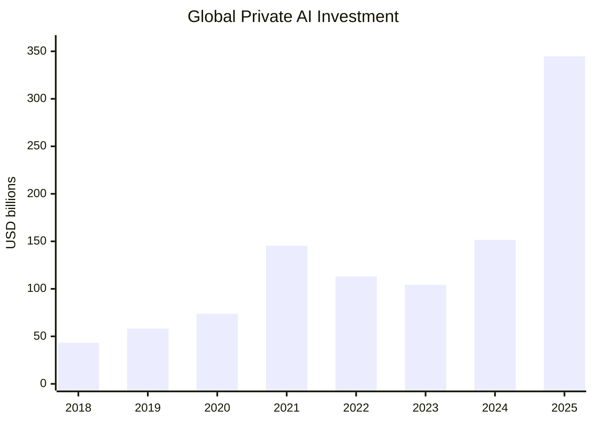
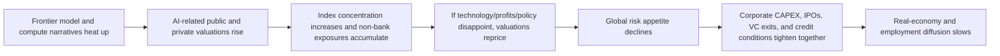
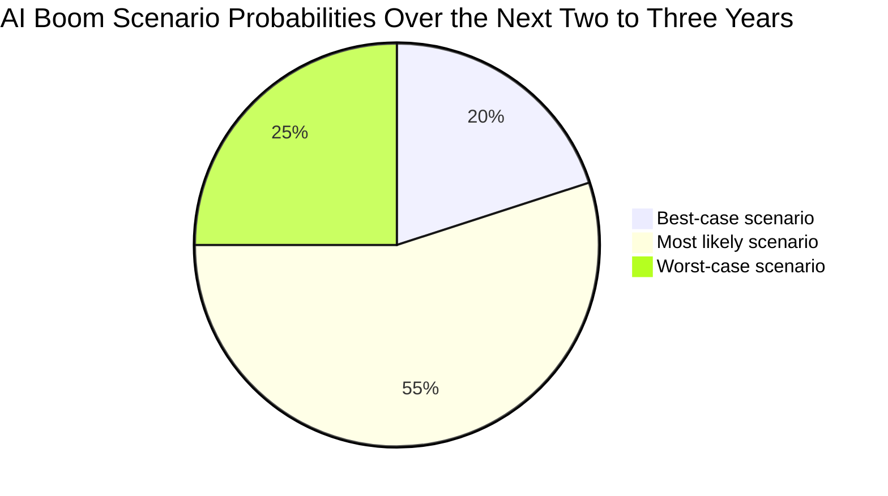

## Executive Summary

The core judgment of this article is: **as of mid-2026, the most accurate description of the global AI boom is not a “completely fake bubble,” but rather “a boom supported by real technological breakthroughs and real demand, while some assets and financing links have already shown clear signs of bubble-like behavior.”** It cannot simply be equated with the pure dot-com mania of 1999, because today’s most sought-after AI leaders usually have real revenue, cloud distribution power, GPU supply-chain advantages, and continuously improving model capabilities. However, “bubble” must still be treated as a serious risk because capital concentration, valuation extrapolation, narrow exit channels, compute and energy bottlenecks, and policy uncertainty have already appeared at the same time. In its 2025 Financial Stability Review, the ECB noted that market participants viewed “whether AI stocks are forming a bubble” as one of the most prominent tail risks. Meanwhile, OECD data show that AI absorbed 61% of global VC in 2025, with mega-deals accounting for around 73% of total AI VC, indicating that capital supply has become highly dependent on a very small number of ultra-large transactions. ([ECB](https://www.ecb.europa.eu/press/financial-stability-publications/fsr/html/ecb.fsr202511~263b5810d4.en.html); [OECD](https://www.oecd.org/en/publications/venture-capital-investments-in-artificial-intelligence-through-2025_a13752f5-en/full-report.html))

Viewed through a historical framework, **today’s AI boom is more like a hybrid of “dot-com-level narrative intensity + the capital structure of the 2021 SPAC/zero-rate tech bull market + a genuine possibility of a general-purpose technology.”** It resembles dot-com most in that the narrative overwhelms short-term cash flow, while issuance and financing focus on a “huge future market” rather than current profits. It resembles the 2021 SPAC cycle most in that valuations and exits are highly sensitive to market sentiment, and transaction outcomes are dominated by a few large events. What differs from past bubbles is that model capabilities, enterprise adoption, cloud capital expenditure, chip supply chains, and industrial deployment have indeed created a real economic foundation. The Stanford AI Index 2026 shows that global private AI investment reached USD 344.66 billion in 2025. Under the OECD definition, AI VC reached USD 258.7 billion in 2025, returning close to the 2021 peak. These two numbers cannot be directly added together, but they point to the same reality: **AI has become the world’s dominant absorber of venture capital.** ([Stanford HAI](https://hai.stanford.edu/assets/files/ai_index_report_2026_chapter_4_economy.pdf); [OECD](https://www.oecd.org/en/publications/venture-capital-investments-in-artificial-intelligence-through-2025_a13752f5-en/full-report.html))

The implicit assumptions used in this article are as follows: **the main analysis period is 2018–2026; because full-year 2026 data are not yet available, all 2026 figures are treated as year-to-date or latest available high-frequency observations as of 2026-06-26; Stanford/Quid’s “private investment” and OECD/Preqin’s “VC investment” use different definitions, so this article only compares their direction and relative scale rather than adding them together.** Stanford also explicitly notes that Quid’s private investment data **do not include Chinese government guidance funds**, so looking only at private capital underestimates China’s total resource allocation to AI. ([OECD](https://www.oecd.org/en/publications/venture-capital-investments-in-artificial-intelligence-through-2025_a13752f5-en/full-report.html); [Stanford HAI](https://hai.stanford.edu/assets/files/ai_index_report_2026_chapter_4_economy.pdf))

In terms of policy implications, the most feasible position is not to “suppress the AI boom,” but to **avoid allowing capital markets to misprice a “long-term technological trend” as “short-term risk-free profitability.”** Therefore, policymakers should prioritize stronger disclosure, stress testing, competition policy, energy and compute infrastructure governance, and worker transition support. Investors should treat AI as a **high-volatility, high-concentration, high-technical-path-risk** capital-intensive industry rather than a simple high-margin software narrative. Researchers should treat reproducibility, safety, evaluation credibility, and energy transparency as public-goods problems as important as model capability itself. ([IMF](https://www.imf.org/-/media/files/publications/imf-notes/2026/english/insea2026002.pdf); [NIST](https://nvlpubs.nist.gov/nistpubs/ai/NIST.AI.600-1.pdf); [International AI Safety Report](https://internationalaisafetyreport.org/publication/international-ai-safety-report-2025); [IEA](https://www.iea.org/reports/energy-and-ai))

## What Is an AI Bubble and How to Identify One

The classic definition of a bubble can be traced to Kindleberger: asset prices continue to rise sharply, further stimulating expectations that “prices will rise even more,” attracting new buyers, especially speculators, and eventually plunging when expectations reverse, potentially triggering a financial crisis. Applied to AI, this definition is not about deciding “whether AI has value,” but about judging **whether AI asset prices, financing scale, and exit assumptions have already moved far ahead of verifiable cash flows, adoption rates, and productivity diffusion speed.** ([Brookings](https://www.brookings.edu/wp-content/uploads/2006/03/2006a_bpea_smith.pdf))

To identify an AI bubble, looking only at valuation is far from enough. AI differs from internet stocks in 2000 because today’s core beneficiaries are often cloud and semiconductor giants that already have economies of scale. Therefore, a more effective framework should examine five layers at the same time. The first is **valuation detachment**: whether metrics such as Shiller CAPE, EV/Sales, and industry concentration are too high. The second is **abnormal capital flows**: whether AI is excessively consuming total VC and whether transaction volume is dominated by a few mega-deals. The third is **exit dependency**: whether IPOs, mergers and acquisitions, and secondary-market absorption capacity are too narrow. The fourth is **the real-economy gap**: whether firms are merely “trying AI” without forming reproducible productivity gains. The fifth is **technical and resource bottlenecks**: whether compute, data, energy, safety, and evaluation problems will discount the current narrative. This is also why the ECB, while acknowledging that today’s large technology firms have more diversified business models than in 2000, still warns that high valuations, concentration, and cross-market exposures make AI a financial-stability tail risk. ([ECB](https://www.ecb.europa.eu/press/financial-stability-publications/fsr/html/ecb.fsr202511~263b5810d4.en.html); [NIST](https://nvlpubs.nist.gov/nistpubs/ai/NIST.AI.600-1.pdf); [OECD](https://www.oecd.org/en/publications/venture-capital-investments-in-artificial-intelligence-through-2025_a13752f5-en/full-report.html))

Under this framework, **the clearest bubble-like segments in AI today are not “all AI,” but frontier models, compute infrastructure, data centers, and a small number of listed high-beta beneficiary assets.** OECD data show that since 2023, the hottest category in AI VC has shifted toward IT infrastructure and hosting, attracting USD 109.3 billion in 2025, nearly approaching the USD 149.4 billion raised by all other AI industries combined. In the same year, mega-deals accounted for around 73% of total AI VC, and deals above USD 1 billion alone accounted for nearly half of the total. This structure is usually not the healthy appearance of a mature diffusion technology, but a typical pre-bubble allocation pattern in which the market first fully capitalizes infrastructure scarcity. ([OECD](https://www.oecd.org/en/publications/venture-capital-investments-in-artificial-intelligence-through-2025_a13752f5-en/full-report.html))

It is worth noting that **a bubble does not mean the technology ultimately fails.** After the dot-com crash, the internet did not fail. After repeated clean-energy capital-cycle collapses, the technology continued to accumulate. Today’s AI risk is more like “a good technology being priced by the wrong capital structure.” If adoption speed, unit economics, or compute supply are slower than market expectations, then an increase in discount rates or a delay in profit realization would be enough to reprice some valuations. The IMF in 2026 also clearly described AI as a **macro-critical transformation**, while noting that near-term effects remain constrained by energy, grids, data centers, organizational friction, and institutional absorption capacity. ([IMF](https://www.imf.org/-/media/files/publications/imf-notes/2026/english/insea2026002.pdf))

## Historical Bubble Comparisons and Quantitative Positioning

The table below compares the AI boom with three major bubble cycles: the 1999–2000 dot-com bubble, the 2000–06 U.S. housing bubble, and the 2020–21 SPAC/zero-rate technology bubble. The point of the table is not to look for superficial similarities, but to observe whether **valuation, capital flows, issuance/exits, and post-event returns** show historical resonance.

| Event                            | Valuation and price signals                                                                                                                                                                                                                                                                                                                                                                                                                                                                                                                                                                                                                                                                                                                                    | Financing/issuance signals                                                                                                                                                                                                                                                                                                                                                                                                                                                                                                         | Exit and post-event signals                                                                                                                                                                                                                                                                    | Implications for AI today                                                                                                                                                                                                              |
| -------------------------------- | -------------------------------------------------------------------------------------------------------------------------------------------------------------------------------------------------------------------------------------------------------------------------------------------------------------------------------------------------------------------------------------------------------------------------------------------------------------------------------------------------------------------------------------------------------------------------------------------------------------------------------------------------------------------------------------------------------------------------------------------------------------- | ---------------------------------------------------------------------------------------------------------------------------------------------------------------------------------------------------------------------------------------------------------------------------------------------------------------------------------------------------------------------------------------------------------------------------------------------------------------------------------------------------------------------------------- | ---------------------------------------------------------------------------------------------------------------------------------------------------------------------------------------------------------------------------------------------------------------------------------------------- | -------------------------------------------------------------------------------------------------------------------------------------------------------------------------------------------------------------------------------------- |
| Dot-com                          | At the end of 1999, Shiller CAPE reached a historical extreme of 44.2. For a sample of internet companies in February 2000, NBER estimated a total market capitalization of about USD 942.97 billion and sales of only USD 27.43 billion, implying a P/S ratio of about 34.4x. If comparable industry profits were applied, the target P/E ratio reached 605. ([GuruFocus](https://www.gurufocus.com/economic_indicators/56/sp-500-shiller-cape-ratio); [NBER](https://www.nber.org/system/files/working_papers/w8630/w8630.pdf))                                                                                                                                                                                                                              | From 1998 to April 2000, 305 internet IPOs had an average first-day return of 95.5%; among them, the 206 IPOs in 1999 had an average first-day return of 93.3%. ([NBER](https://www.nber.org/system/files/working_papers/w8630/w8630.pdf))                                                                                                                                                                                                                                                                                         | The market was extremely tolerant of “growth first, profits later”; many companies completed IPOs before their business models were validated. ([NBER](https://www.nber.org/system/files/working_papers/w8630/w8630.pdf))                                                                      | **Similarity**: narrative dominates short-term cash flow. **Difference**: today’s core beneficiaries are mostly high-cash-flow giants, not zero-revenue startups.                                                                      |
| U.S. housing bubble              | Brookings in 2006 noted that U.S. house prices had risen by about 50% over the previous five years, and by more than 100% in hot markets. Under Kindleberger’s definition, it already had the classic cycle of price increases, expectation reinforcement, and expanding speculative buying. The Dallas Fed in 2025 also noted that the U.S. house price-to-rent ratio had risen by about 20% since 2020Q1 and was approaching the pre-2006 high. ([Brookings](https://www.brookings.edu/wp-content/uploads/2006/03/2006a_bpea_smith.pdf); [Dallas Fed](https://www.dallasfed.org/research/economics/2025/0225); [Dallas Fed LinkedIn](https://www.linkedin.com/posts/dallasfed_evidence-suggests-us-house-pricerent-ratio-activity-7300604604050722816-hSex)) | Financing was driven not by equity but by credit; the real key was mortgage expansion and balance-sheet leverage. ([Brookings](https://www.brookings.edu/wp-content/uploads/2006/03/2006a_bpea_smith.pdf))                                                                                                                                                                                                                                                                                                                         | The housing bubble was more damaging than dot-com because it was embedded in banks, collateral, and household wealth. ([Brookings](https://www.brookings.edu/wp-content/uploads/2006/03/2006a_bpea_smith.pdf))                                                                                 | If AI becomes a systemic risk, the path is less likely to be household credit and more likely to be **stock-market wealth effects, non-bank exposures, and a pullback in corporate capital expenditure.**                              |
| SPAC/zero-rate technology bubble | In 2021, there were 613 SPAC IPOs in the U.S., raising USD 144.53 billion. DeSPACs in the same year had an average one-year return of -64.2%, or -53.9% after market adjustment. ([Ritter SPAC data](https://site.warrington.ufl.edu/ritter/files/IPOs-SPACs.pdf))                                                                                                                                                                                                                                                                                                                                                                                                                                                                                             | SPACs became a low-threshold listing and risk-transfer tool. In 2021Q4, the average redemption rate for deSPACs had already reached 62%, and after 2022 it exceeded 80% in many quarters. ([Ritter SPAC data](https://site.warrington.ufl.edu/ritter/files/IPOs-SPACs.pdf))                                                                                                                                                                                                                                                        | Exits looked superficially prosperous, but real absorption willingness was weak; post-listing returns collapsed. ([Ritter SPAC data](https://site.warrington.ufl.edu/ritter/files/IPOs-SPACs.pdf))                                                                                             | If today’s AI depends heavily on high-valuation private rounds and narrow IPO windows rather than stable M&A and profitable cash flows, it will repeat the problem of “exits seeming to exist, while liquidity is actually very thin.” |
| Current AI boom                  | In June 2026, Shiller CAPE was about 39.66, around 90% of the 1999 peak of 44.2. In January 2026 U.S. industry EV/Sales ratios, semiconductors were at 15.70x and system/application software at 11.41x, far above the whole-market level of 3.97x. ([GuruFocus](https://www.gurufocus.com/economic_indicators/56/sp-500-shiller-cape-ratio); [Damodaran data](https://pages.stern.nyu.edu/~adamodar/New_Home_Page/datafile/psdata.html))                                                                                                                                                                                                                                                                                                                      | Under the OECD definition, AI VC was USD 258.7 billion in 2025, accounting for 61% of global VC. Mega-deals accounted for 73%, and the top five deals approached USD 63 billion. Under the Stanford definition, global private AI investment reached USD 344.66 billion in 2025. ([OECD](https://www.oecd.org/en/publications/venture-capital-investments-in-artificial-intelligence-through-2025_a13752f5-en/full-report.html); [Stanford HAI](https://hai.stanford.edu/assets/files/ai_index_report_2026_chapter_4_economy.pdf)) | U.S. VC exit value reached a new high in 2026Q1, but if the top five transactions and exits are excluded, investment and exit value fall by 73.2% and 86.6%, respectively, showing that liquidity is highly concentrated. ([NVCA/PitchBook](https://nvca.org/pitchbook-nvca-venture-monitor/)) | **This is not a bubble with “no fundamentals,” but a bubble risk where “fundamentals are real, yet capital markets may have priced in realization too quickly.”**                                                                      |

Putting these numbers together, the biggest difference between today’s AI boom and dot-com is this: at the dot-com peak, the market was willing to assign the entire internet sector about **34 times sales and 605 times target earnings**, while listed companies generally lacked mature business models. Today’s high multiples in AI are mainly concentrated in **semiconductors, system/application software, a few model platforms, and infrastructure**, behind which there are real revenue and capital-expenditure cycles. However, the commonality between AI and dot-com is also clear: **capital markets often convert “long-term possibility” directly into “short-term certainty.”** If, over the next 2–3 years, AI revenue diffusion speed, inference cost decline, enterprise workflow reconstruction, and safety-governance progress fall short of expectations, repricing may happen faster than technological progress. ([NBER](https://www.nber.org/system/files/working_papers/w8630/w8630.pdf); [GuruFocus](https://www.gurufocus.com/economic_indicators/56/sp-500-shiller-cape-ratio); [Damodaran data](https://pages.stern.nyu.edu/~adamodar/New_Home_Page/datafile/psdata.html))

## Global Investment Landscape and Regional Competition

The geography of global AI investment is already very clear: **the United States is far ahead; China ranks second in private-capital data, but if government guidance funds are included, its actual resource allocation would be higher; Europe and the United Kingdom remain in the second tier, but are more concentrated in a few countries and a few distinctive companies; Israel, Canada, India, Singapore, and the UAE form specialized nodes.** OECD’s 2025 VC data based on Preqin show that U.S. companies absorbed around 75% of global AI VC, or USD 194.0 billion; EU27 absorbed around 6%, or USD 15.8 billion; China around 5%, or USD 13.9 billion; and the United Kingdom around 5%, or USD 13.8 billion. Stanford/Quid’s private-investment definition shows that U.S. private AI investment in 2025 was around USD 285.88 billion, far above Europe’s USD 20.92 billion and China’s USD 12.41 billion. The two definitions differ, but the direction is exactly the same. ([OECD](https://www.oecd.org/en/publications/venture-capital-investments-in-artificial-intelligence-through-2025_a13752f5-en/full-report.html); [Stanford HAI](https://hai.stanford.edu/assets/files/ai_index_report_2026_chapter_4_economy.pdf))

| Region          |                                                                                                                                                                                          2025 investment scale |                                                      2013–2025 cumulative / supplementary indicators | Structural features                                                                                                                                                                   | Main weaknesses                                                                                                                | Sources                                                                                                                                                                                                                                                                                                          |
| --------------- | -------------------------------------------------------------------------------------------------------------------------------------------------------------------------------------------------------------: | ---------------------------------------------------------------------------------------------------: | ------------------------------------------------------------------------------------------------------------------------------------------------------------------------------------- | ------------------------------------------------------------------------------------------------------------------------------ | ---------------------------------------------------------------------------------------------------------------------------------------------------------------------------------------------------------------------------------------------------------------------------------------------------------------- |
| United States   |                                                                                 OECD VC USD 194.0 billion; Stanford private investment USD 285.88 billion; generative AI private investment USD 163.64 billion | 2013–25 cumulative private AI investment USD 757.27 billion; 1,953 newly funded AI companies in 2025 | Very large capital markets, cloud and chip leaders, strongest model and platform distribution power                                                                                   | High concentration, valuation and CAPEX pressure, antitrust and power bottlenecks                                              | [OECD](https://www.oecd.org/en/publications/venture-capital-investments-in-artificial-intelligence-through-2025_a13752f5-en/full-report.html); [Stanford HAI](https://hai.stanford.edu/assets/files/ai_index_report_2026_chapter_4_economy.pdf)                                                                  |
| China           |                                                                                     OECD VC USD 13.9 billion; Stanford private investment USD 12.41 billion; generative AI private investment USD 1.48 billion |   2013–25 cumulative private AI investment USD 131.83 billion; 161 newly funded AI companies in 2025 | Open-source models, industrial deployment, state-industry coordination, domestic data and application-scenario advantages                                                             | Advanced-chip constraints, pressure on foreign capital/cross-border flows, private-capital data underestimates real investment | [OECD](https://www.oecd.org/en/publications/venture-capital-investments-in-artificial-intelligence-through-2025_a13752f5-en/full-report.html); [Stanford HAI](https://hai.stanford.edu/assets/files/ai_index_report_2026_chapter_4_economy.pdf); [CAC](https://www.cac.gov.cn/2026-03/17/c_1775482074695536.htm) |
| Europe and EU27 |                                                                          OECD: EU27 USD 15.8 billion; Stanford: Europe private investment USD 20.92 billion; generative AI private investment USD 3.21 billion |                                                                639 newly funded AI companies in 2025 | Stronger in industrial AI, defense technology, open source, and sovereign-AI demands                                                                                                  | Fragmented markets, insufficient capital depth and compute resources                                                           | [OECD](https://www.oecd.org/en/publications/venture-capital-investments-in-artificial-intelligence-through-2025_a13752f5-en/full-report.html); [Stanford HAI](https://hai.stanford.edu/assets/files/ai_index_report_2026_chapter_4_economy.pdf)                                                                  |
| United Kingdom  |                                                                                                                                                                                       OECD VC USD 13.8 billion |                                           2013–25 cumulative private AI investment USD 34.07 billion | Stronger fintech, language models, biotech AI, and research commercialization                                                                                                         | Scale still much smaller than the U.S. and China; large infrastructure capacity constrained                                    | [OECD](https://www.oecd.org/en/publications/venture-capital-investments-in-artificial-intelligence-through-2025_a13752f5-en/full-report.html); [Stanford HAI](https://hai.stanford.edu/assets/files/ai_index_report_2026_chapter_4_economy.pdf)                                                                  |
| Other nodes     | Israel USD 18.54 billion, Canada USD 19.59 billion, Germany USD 17.16 billion, France USD 15.57 billion, and India USD 15.39 billion are among the top cumulative private-investment destinations from 2013–25 |                       Israel, Canada, India, Singapore, and the UAE each have specialized ecosystems | Israel leans toward cybersecurity/defense; Canada toward research and compute; India toward services outsourcing and applications; Gulf states toward sovereign-wealth-led deployment | Insufficient scale, talent, and control over cloud platforms                                                                   | [Stanford HAI](https://hai.stanford.edu/assets/files/ai_index_report_2026_chapter_4_economy.pdf)                                                                                                                                                                                                                 |

A special point must be emphasized: **China’s “seemingly smaller” investment should not be directly interpreted as “lower actual investment.”** Stanford explicitly states that Quid’s private investment data **do not include Chinese government guidance funds**. The cited research indicates that between 2000 and 2023, Chinese government guidance funds deployed around USD 912 billion across industries, of which around USD 184 billion flowed to AI companies. In other words, comparing only private equity/VC systematically underestimates China’s real capital-mobilization capacity relative to the United States. ([Stanford HAI](https://hai.stanford.edu/assets/files/ai_index_report_2026_chapter_4_economy.pdf))

The chart below is based on the global private AI investment series from the Stanford AI Index 2026 and shows the acceleration path from 2018 to 2025. Although there was a pullback in 2022–2023, investment rapidly resumed upward after 2024, and 2025 showed an almost “second bubble-like” jump. ([Stanford HAI](https://hai.stanford.edu/assets/files/ai_index_report_2026_chapter_4_economy.pdf))

If we further examine transaction structure, the bubble-like characteristics become even clearer. OECD data show that in 2025, the average AI VC deal size was about USD 35.8 million, but **the median was only USD 5 million**. This means the market is not heating evenly, but that averages are being pulled up by a very small number of ultra-large transactions. Early-stage rounds still account for more than 75% of deal count, but only about one quarter of deal value. In other words, while the market appears to show that “many companies are raising money,” most capital is actually concentrating into a few late-stage or infrastructure targets. ([OECD](https://www.oecd.org/en/publications/venture-capital-investments-in-artificial-intelligence-through-2025_a13752f5-en/full-report.html))

High-frequency signals from 2026 show that this concentration is intensifying. PitchBook notes that **global AI venture funding in 2026Q1 was about USD 255.5 billion, already exceeding all of 2025**, and that three deals accounted for 67% of total capital. CB Insights also notes that **private AI companies raised USD 226.0 billion in 2026Q1, with OpenAI’s single round alone reaching USD 122.0 billion**. These numbers cannot be directly spliced onto the Stanford/OECD annual series, but they clearly show that **the “heat” in the first half of 2026 is not broad diffusion; it is mega-rounds once again pulling the entire market upward.** ([PitchBook](https://pitchbook.com/news/articles/q1-2026-ai-funding-blows-past-2025-total-with-three-deals-accounting-for-67-of-capital); [CB Insights](https://www.cbinsights.com/research/report/ai-trends-q1-2026/))

## Macroeconomics, Financial Contagion, and Social Impact

From a macro perspective, AI contains two opposing forces at the same time. The first is **a potential productivity dividend**. OECD estimates that under its main scenario, AI could add around 0.25–0.6 percentage points to annualized total factor productivity growth in the United States over the next decade and around 0.4–0.9 percentage points to labor productivity growth. Extended to the G7, annualized labor productivity gains in high-AI-exposure countries could reach 0.4–1.3 percentage points. The IMF’s global model further indicates that under a high-TFP baseline scenario, world GDP could rise by nearly 4% over 10 years. This means that **the AI boom is not built entirely on nothing; the market is indeed betting on a potentially large reacceleration of productivity.** ([OECD](https://www.oecd.org/en/publications/miracle-or-myth-assessing-the-macroeconomic-productivity-gains-from-artificial-intelligence_b524a072-en.html); [OECD PDF](https://www.oecd.org/content/dam/oecd/en/publications/reports/2025/06/macroeconomic-productivity-gains-from-artificial-intelligence-in-g7-economies_dcf91c3e/a5319ab5-en.pdf); [IMF](https://www.imf.org/-/media/files/publications/wp/2025/english/wpiea2025076-print-pdf.pdf))

The second force is **financial amplification and contagion**. The ECB’s 2025 Financial Stability Review notes that although market participants disagree on whether “AI stocks are a bubble,” they widely regard it as a prominent tail risk. At the same time, U.S. equity-market concentration has reached new highs, and euro-area non-bank financial institutions have high exposure to U.S. securities. Therefore, if AI-related stocks correct sharply because technological progress, regulation, or profitability falls short of expectations, the European financial system would be affected directly and indirectly through holding losses and lower risk appetite. ([ECB](https://www.ecb.europa.eu/press/financial-stability-publications/fsr/html/ecb.fsr202511~263b5810d4.en.html))

This contagion path can be visualized as the following chain: AI is less likely to explode first through household credit, as the 2008 housing bubble did. It is more likely to transmit sequentially through **stock-market concentration, non-bank balance sheets, corporate capital expenditure, aggregate demand, and risk appetite**. The IMF in 2026 also treats AI as a “macro-critical transformation,” specifically naming energy, grids, data-center infrastructure, and institutional absorption capacity as limiting conditions for near-term impact. ([ECB](https://www.ecb.europa.eu/press/financial-stability-publications/fsr/html/ecb.fsr202511~263b5810d4.en.html); [IMF](https://www.imf.org/-/media/files/publications/imf-notes/2026/english/insea2026002.pdf))

On the social side, AI’s impact is not simply “jobs disappearing,” but **work reorganization, wage polarization, and intensified regional/gender inequality**. The ILO’s 2025 updated global occupational exposure index shows that around **one quarter of global workers** are in occupations exposed to generative AI to some degree. Among them, **3.3% of global employment** falls into the highest-exposure category, and women are more exposed than men, at 4.7% versus 2.4%. High-income countries also have much greater overall exposure than low-income countries, at 34% versus 11%. IMF research further notes that advanced economies, because their employment structures are more cognitively intensive, will feel both the benefits and costs of AI earlier. Women and highly educated workers are more exposed, but also more likely to benefit. If AI is more complementary to high-income workers and capital returns rise, both income and wealth inequality may expand. ([ILO](https://www.ilo.org/publications/generative-ai-and-jobs-refined-global-index-occupational-exposure); [IMF](https://www.imf.org/-/media/files/publications/sdn/2024/english/sdnea2024001.pdf))

So far, real labor-market data look more like **reallocation preceding mass layoffs**. The ECB’s 2026 analysis of the U.S. labor market shows that between 2019 and 2025, employment in occupations at high AI substitution risk declined by more than 4% on average, while low-risk occupations grew by 13%. The employment share of high-risk jobs fell from 35% to 33%, while that of low-risk jobs rose from 23% to 25%. However, the same research also finds that **no significant wage-growth differences have yet been observed**, suggesting that the first-stage effect looks more like structural adjustment than broad wage collapse. ([ECB Economic Bulletin](https://www.ecb.europa.eu/press/economic-bulletin/focus/2026/html/ecb.ebbox202604_01~d9259db536.en.html))

Education and reskilling therefore become the key mediating variables determining whether “the bubble turns into prosperity.” The World Economic Forum’s 2025 survey shows that **86% of employers** expect AI and information-processing technologies to transform their organizations by 2030, **59% of workers** will need additional training to meet future skill needs, and around **39% of existing skill sets** will be transformed. If reskilling and institutional adjustment fail to keep up, the productivity story capitalized by markets may be realized first in financial markets but fail to land in labor markets, ultimately reinforcing political tension around “asset prices rise, but wages do not.” ([WEF](https://reports.weforum.org/docs/WEF_New_Economy_Skills_2025.pdf); [WEF](https://reports.weforum.org/docs/WEF_The_Human_Advantage_Stronger_Brains_in_the_Age_of_AI_2026.pdf); [WEF](https://reports.weforum.org/docs/WEF_Putting_Talent_at_the_Centre_An_Evolving_Imperative_for_Manufacturing_2025.pdf))

## Technical Limits, Safety Risks, and Governance Responses

Whether one views AI as a bubble or not, the question ultimately cannot be separated from technical fundamentals. The current technical reality is: **capabilities are improving quickly, but cost, energy, data, and safety constraints are also rising quickly.** The Stanford AI Index 2026 notes that top U.S. and Chinese models have alternated in leadership several times since early 2025. By March 2026, Anthropic’s leading model was only 2.7% ahead of the best Chinese model. The United States still produced more notable models in 2025, but China’s catching-up speed is very fast. This shows that the market has grounds to treat AI as a long-term strategic technology. It also means that competition will not naturally settle into an oligopoly, but is more likely to enter an arms race of **high fixed costs, fast iteration, and strong policy intervention.** ([Stanford HAI](https://hai.stanford.edu/ai-index/2026-ai-index-report); [LinkedIn summary](https://www.linkedin.com/pulse/stanfords-2026-ai-index-10-numbers-every-business-see-steven-8ejjc))

The problem is that this progress is achieved at extremely high capital intensity. Epoch AI data show that since 2020, **frontier language-model training costs have increased at around 3.5x per year**. The largest known training runs have reached about **5e26 FLOP**. Epoch also estimates that if this trend continues, the largest training runs could exceed the **USD 1 billion level** by 2027. This means frontier model competition naturally tilts toward a small number of companies with extreme capital and compute concentration. It also means that any shock to financing costs, supply chains, or policy will be amplified into a reshuffling of the competitive landscape. ([Epoch AI](https://epoch.ai/trends); [Epoch AI](https://epoch.ai/publications/how-much-does-it-cost-to-train-frontier-ai-models))

Energy and infrastructure are the second hard constraint. In *Energy and AI*, the International Energy Agency estimates that global data-center electricity consumption could rise to around **945 TWh** by 2030, roughly doubling from 2024 and accounting for **slightly less than 3%** of global electricity consumption. From 2024 to 2030, data-center electricity consumption is expected to grow at around **15%** annually, more than four times the growth rate of total electricity consumption in other sectors. The IMF in 2026 also lists energy, grids, and data centers as major bottlenecks for near-term diffusion. This means AI is not constrained only by software and algorithms, but also by the physical world: electricity, cooling, water, site selection, and construction capacity. ([IEA](https://www.iea.org/reports/energy-and-ai/energy-demand-from-ai); [IEA](https://www.iea.org/reports/energy-and-ai); [IMF](https://www.imf.org/-/media/files/publications/imf-notes/2026/english/insea2026002.pdf))

Data supply is also not infinite. Epoch AI estimates the amount of high-quality public human text at around **300 trillion tokens**, with a 90% confidence interval of roughly 100–1,000 trillion tokens. This does not mean data will run out tomorrow, but it means that if the next generation of models relies only on “more internet text,” data quality and marginal gains will increasingly become problems. It will also push the industry toward higher-quality data, synthetic data, proprietary data, and multimodal data. These shifts themselves introduce new problems around cost, copyright, transparency, bias, and reproducibility. ([Epoch AI](https://epoch.ai/publications/will-we-run-out-of-data-limits-of-llm-scaling-based-on-human-generated-data); [arXiv](https://arxiv.org/html/2406.14325v3))

On robustness and safety, current evidence is also insufficient to support the claim that “the technology is mature and risks are negligible.” The *International AI Safety Report 2025* states that future capability trajectories remain highly uncertain and that existing benchmarks do not always map well to real-world capabilities. On safety, AI systems may perform well in ordinary contexts but **can still be induced to perform harmful actions when facing adversarial inputs and jailbreaks**. In addition, the amount of human supervision used for fine-tuning is tiny relative to pretraining data, implying that “fully removing harmful capabilities through a small amount of alignment data” has inherent limits. NIST’s 2025 report on adversarial machine learning systematically organizes risks such as data poisoning, evasion, and privacy breaches, and explicitly states that existing mitigation techniques also have clear limitations. ([International AI Safety Report](https://internationalaisafetyreport.org/publication/international-ai-safety-report-2025); [NIST](https://nvlpubs.nist.gov/nistpubs/ai/NIST.AI.100-2e2025.pdf))

NIST’s generative AI risk-management framework further reminds us that generative AI risks are not only hallucinations, but include **information integrity, data privacy, intellectual property, bias and homogenization, violent/hateful content, environmental impact, value-chain and third-party integration risks, and content provenance**. The framework even specifically notes that repeated use of the same model may create “algorithmic monocultures,” increasing correlated failure risk. This is why the easiest thing for markets to underestimate today is not model capability itself, but **the fragility and externalities of the entire AI supply chain.** ([NIST](https://nvlpubs.nist.gov/nistpubs/ai/NIST.AI.600-1.pdf))

Governance responses currently show a multi-center pattern: the EU leans toward written law, North America toward frameworks and executive orders, China toward administrative regulation and filing systems, and international organizations toward principles. The EU official page still treats **2026-08-02** as the main start and enforcement node for most AI Act rules, but reports in May 2026 mentioned a provisional political agreement to delay some high-risk rules to 2027-12-02, showing that the implementation pace still has room for adjustment. The United States does not have a unified federal AI basic law; after EO 14110 was revoked in 2025, policy emphasis shifted toward the NIST AI RMF, the 2025 *America’s AI Action Plan*, and a new June 2026 executive order focused on advanced AI innovation and national-security testing. In China, from the 2023 *Interim Measures for the Management of Generative Artificial Intelligence Services*, to the 2025 *Measures for the Identification of AI-Generated Synthetic Content*, to the 2026 *Interim Measures for the Management of AI Anthropomorphic Interaction Services*, a system combining filing, labeling, and scenario-based regulation has formed. As of the end of February 2026, **796** generative AI services had completed filing. At the international level, UNESCO’s Recommendation on the Ethics of AI continues to use **human rights, transparency, fairness, sustainability, and human oversight** as common principles. ([EU AI Act Service Desk](https://ai-act-service-desk.ec.europa.eu/en/ai-act/timeline/timeline-implementation-eu-ai-act); [Reuters](https://www.reuters.com/world/eu-countries-lawmakers-strike-provisional-deal-watered-down-ai-rules-2026-05-07/); [NIST](https://www.nist.gov/artificial-intelligence/ai-congressional-mandates-executive-orders-and-actions); [NIST AI RMF](https://www.nist.gov/itl/ai-risk-management-framework); [White House AI Action Plan](https://www.whitehouse.gov/wp-content/uploads/2025/07/Americas-AI-Action-Plan.pdf); [White House](https://www.whitehouse.gov/presidential-actions/2026/06/promoting-advanced-artificial-intelligence-innovation-and-security/); [CAC 2023](https://www.cac.gov.cn/2023-07/13/c_1690898327029107.htm); [CAC 2025](https://www.cac.gov.cn/2025-03/14/c_1743654684782215.htm); [CAC 2026](https://www.cac.gov.cn/2026-04/10/c_1777558395078289.htm); [CAC filing data](https://www.cac.gov.cn/2026-03/17/c_1775482074695536.htm); [UNESCO](https://www.unesco.org/en/artificial-intelligence/recommendation-ethics))

## Scenario Analysis, Monitoring Dashboard, and Recommendations

The scenario probabilities below are not mechanical model outputs, but **analytical judgments** based on the financial, macroeconomic, technical, and governance evidence integrated in this article. They are built on four facts: first, AI capabilities and capital expenditure do have a real foundation; second, diffusion speed is constrained by energy, organizational, and skill bottlenecks; third, market valuations and capital supply are highly concentrated; fourth, exit markets remain quite narrow. ([IMF](https://www.imf.org/-/media/files/publications/imf-notes/2026/english/insea2026002.pdf); [ECB](https://www.ecb.europa.eu/press/financial-stability-publications/fsr/html/ecb.fsr202511~263b5810d4.en.html); [OECD](https://www.oecd.org/en/publications/venture-capital-investments-in-artificial-intelligence-through-2025_a13752f5-en/full-report.html); [IEA](https://www.iea.org/reports/energy-and-ai))

| Scenario             | Probability | Economic/market outcome                                                                                                                                                                                                                                                                                                                                                                                         | Main triggers                                                                                                                                                                                                                                                                                                                                                                                                                                                                                                                                                                                                                                                                                                                                                              |
| -------------------- | ----------: | --------------------------------------------------------------------------------------------------------------------------------------------------------------------------------------------------------------------------------------------------------------------------------------------------------------------------------------------------------------------------------------------------------------- | -------------------------------------------------------------------------------------------------------------------------------------------------------------------------------------------------------------------------------------------------------------------------------------------------------------------------------------------------------------------------------------------------------------------------------------------------------------------------------------------------------------------------------------------------------------------------------------------------------------------------------------------------------------------------------------------------------------------------------------------------------------------------- |
| Best-case scenario   |         20% | AI productivity gains truly diffuse broadly. Earnings growth among large listed technology companies catches up with valuations, and returns on frontier model and infrastructure CAPEX are gradually validated. The market remains volatile, but this is “valuation digestion” rather than a bubble bursting.                                                                                                  | Inference costs continue to decline significantly; enterprises enter large-scale workflow reconstruction; energy and chip supply improve; no major safety incidents occur; cross-border regulation becomes more predictable. ([OECD](https://www.oecd.org/en/publications/miracle-or-myth-assessing-the-macroeconomic-productivity-gains-from-artificial-intelligence_b524a072-en.html); [IMF](https://www.imf.org/-/media/files/publications/wp/2025/english/wpiea2025076-print-pdf.pdf); [Epoch AI](https://epoch.ai/trends); [IEA](https://www.iea.org/reports/energy-and-ai))                                                                                                                                                                                          |
| Most likely scenario |         55% | A **local bubble bursts while the overall industry continues**: valuations in frontier models and compute/data-center chains diverge sharply, some application companies are eliminated, but AI as a whole continues to grow. The market may see a 20–35% sector-level correction rather than a full financial crisis.                                                                                          | Adoption diffusion is slower than market expectations; exit markets improve only modestly; mega-deals continue to dominate financing; some regions face electricity, water, talent, and compliance frictions. ([OECD](https://www.oecd.org/en/publications/venture-capital-investments-in-artificial-intelligence-through-2025_a13752f5-en/full-report.html); [IMF](https://www.imf.org/-/media/files/publications/imf-notes/2026/english/insea2026002.pdf); [IEA](https://www.iea.org/reports/energy-and-ai/energy-demand-from-ai); [Reuters](https://www.reuters.com/business/intense-ai-use-still-rare-among-euro-zone-firms-ecb-researchers-find-2026-06-24/))                                                                                                         |
| Worst-case scenario  |         25% | A **sharp repricing** driven by the resonance of valuations, credit, and policy: frontier AI stock valuations and private rounds are significantly marked down, VC down rounds spread, data-center and compute CAPEX are forced to delay, and global risk appetite is damaged. This does not necessarily repeat 2008, but it would be enough to become a major growth-stock and venture-capital cycle collapse. | Major safety/national-security incident; AI progress or monetization disappoints; interest rates rise again; energy and grid bottlenecks worsen; policy frictions between China, the U.S., and the EU intensify; highly concentrated exit value causes liquidity to evaporate suddenly. ([ECB](https://www.ecb.europa.eu/press/financial-stability-publications/fsr/html/ecb.fsr202511~263b5810d4.en.html); [IMF](https://www.imf.org/-/media/files/publications/imf-notes/2026/english/insea2026002.pdf); [NIST](https://nvlpubs.nist.gov/nistpubs/ai/NIST.AI.100-2e2025.pdf); [Epoch AI](https://epoch.ai/publications/will-we-run-out-of-data-limits-of-llm-scaling-based-on-human-generated-data); [NVCA/PitchBook](https://nvca.org/pitchbook-nvca-venture-monitor/)) |

To identify early which of these three scenarios is unfolding, the following indicators should be monitored continuously. Their biggest difference from simply watching stock prices is that **these variables deteriorate before a bubble becomes visible, or show that “fundamentals are not keeping up with the narrative” before the bubble is obvious.**

| Monitoring indicator             |                                                          Current reading | Why it matters                                                                    | Early warning signal                                                                                                                                                                                                                                                                                                                                                |
| -------------------------------- | -----------------------------------------------------------------------: | --------------------------------------------------------------------------------- | ------------------------------------------------------------------------------------------------------------------------------------------------------------------------------------------------------------------------------------------------------------------------------------------------------------------------------------------------------------------- |
| Shiller CAPE                     |                                                    Around 39.66, 2026-06 | Measures whether overall U.S. equity valuation is approaching historical extremes | Continued rise toward or above the 1999 high of 44.2, while earnings revisions decline. ([GuruFocus](https://www.gurufocus.com/economic_indicators/56/sp-500-shiller-cape-ratio))                                                                                                                                                                                   |
| AI share of global VC            |                                                                61%, 2025 | Reflects whether venture capital is overconcentrated in a single theme            | If the share keeps rising while enterprise adoption/profit diffusion does not move together, it is a bubble signal. ([OECD](https://www.oecd.org/en/publications/venture-capital-investments-in-artificial-intelligence-through-2025_a13752f5-en/full-report.html))                                                                                                 |
| Mega-deal share of AI VC         |                                                                73%, 2025 | Shows whether the market is being held hostage by a few transactions              | If this share continues to rise, small and medium-sized real innovation may be squeezed out. ([OECD](https://www.oecd.org/en/publications/venture-capital-investments-in-artificial-intelligence-through-2025_a13752f5-en/full-report.html))                                                                                                                        |
| Average vs median AI deal size   |                     Average USD 35.8 million; median USD 5 million, 2025 | Measures whether capital is overly concentrated at the top                        | A widening gap between average and median indicates increasing dependence on mega-rounds. ([OECD](https://www.oecd.org/en/publications/venture-capital-investments-in-artificial-intelligence-through-2025_a13752f5-en/full-report.html))                                                                                                                           |
| Exit-market breadth              | U.S. VC 2026Q1 exit value falls 86.6% if the top five exits are excluded | Measures whether there is genuinely healthy liquidity                             | If exits depend only on a few companies, any closing of the window will quickly transmit to private valuations. ([NVCA/PitchBook](https://nvca.org/pitchbook-nvca-venture-monitor/))                                                                                                                                                                                |
| Real-economy adoption depth      |  More than 70% of euro-area firms use AI, but only 7% use it intensively | Measures whether the market story has landed as workflow transformation           | If “broad trial, narrow intensive use” persists, valuation rationality will be compressed. ([Reuters](https://www.reuters.com/business/intense-ai-use-still-rare-among-euro-zone-firms-ecb-researchers-find-2026-06-24/))                                                                                                                                           |
| Electricity and data-center load |            Data-center electricity consumption may reach 945 TWh by 2030 | Measures whether AI faces hard physical-world bottlenecks                         | If electricity, water, construction, or equipment becomes the new diffusion ceiling, markets will reprice long-term capacity. ([IEA](https://www.iea.org/reports/energy-and-ai/energy-demand-from-ai); [IEA](https://www.iea.org/reports/energy-and-ai))                                                                                                            |
| Safety and adversarial risk      |  Persistent jailbreak, data-poisoning, and value-chain third-party risks | Determines regulation and accident-risk premia                                    | A major safety incident or large-scale model misuse would directly raise the policy discount rate. ([International AI Safety Report](https://internationalaisafetyreport.org/publication/international-ai-safety-report-2025); [NIST](https://nvlpubs.nist.gov/nistpubs/ai/NIST.AI.100-2e2025.pdf); [NIST](https://nvlpubs.nist.gov/nistpubs/ai/NIST.AI.600-1.pdf)) |

Finally, for three types of stakeholders, the most important recommendations are as follows. These recommendations are not abstract principles, but direct responses to the current distribution of risk.

| Stakeholder                | Recommendation                                                                                                                                                                                                                                                                                                                                              | Reason                                                                                                                                                                                                                                                                                                                                                                                                                                                                                                                                                                                                                                                                    |
| -------------------------- | ----------------------------------------------------------------------------------------------------------------------------------------------------------------------------------------------------------------------------------------------------------------------------------------------------------------------------------------------------------- | ------------------------------------------------------------------------------------------------------------------------------------------------------------------------------------------------------------------------------------------------------------------------------------------------------------------------------------------------------------------------------------------------------------------------------------------------------------------------------------------------------------------------------------------------------------------------------------------------------------------------------------------------------------------------- |
| Policymakers               | Incorporate AI into **macroprudential monitoring**. Do not only regulate content risks; also monitor market concentration, non-bank exposures, the AI CAPEX cycle, and data-center energy pressure. At the same time, integrate reskilling, unemployment insurance, digital infrastructure, and competition policy into one package.                        | The IMF already treats AI as a macro-critical transformation. The ECB notes that it may transmit through concentration and cross-market exposure. ILO/IMF/WEF data show that labor reallocation and skill transition are urgent. ([IMF](https://www.imf.org/-/media/files/publications/imf-notes/2026/english/insea2026002.pdf); [ECB](https://www.ecb.europa.eu/press/financial-stability-publications/fsr/html/ecb.fsr202511~263b5810d4.en.html); [ILO](https://www.ilo.org/publications/generative-ai-and-jobs-refined-global-index-occupational-exposure); [WEF](https://reports.weforum.org/docs/WEF_The_Human_Advantage_Stronger_Brains_in_the_Age_of_AI_2026.pdf)) |
| Investors                  | Replace the simple question of “is it exposed to AI?” with a three-axis framework: **cash-flow visibility × compute dependency × exit breadth**. Avoid treating all AI-related targets as homogeneous high-growth stocks. Prioritize testing CAPEX payback period, customer retention, gross-margin structure, model substitutability, and regulatory risk. | Today’s bubble risk mainly comes from capital intensity, transaction concentration, and narrow exits, rather than the complete absence of technology. ([OECD](https://www.oecd.org/en/publications/venture-capital-investments-in-artificial-intelligence-through-2025_a13752f5-en/full-report.html); [NVCA/PitchBook](https://nvca.org/pitchbook-nvca-venture-monitor/); [Epoch AI](https://epoch.ai/trends); [ECB](https://www.ecb.europa.eu/press/financial-stability-publications/fsr/html/ecb.fsr202511~263b5810d4.en.html))                                                                                                                                         |
| Researchers and developers | Institutionalize **reproducibility, red-team testing, content provenance, energy disclosure, and third-party risk management**. Do not equate attractive benchmark scores with real-world reliability. Prioritize research that reduces social externalities rather than merely chasing parameters and rankings.                                            | NIST, the International AI Safety Report, and reproducibility literature all show that evaluation, robustness, and reproducibility remain structural weaknesses at the current stage. ([NIST](https://nvlpubs.nist.gov/nistpubs/ai/NIST.AI.100-2e2025.pdf); [International AI Safety Report](https://internationalaisafetyreport.org/publication/international-ai-safety-report-2025); [arXiv](https://arxiv.org/html/2406.14325v3); [NIST](https://nvlpubs.nist.gov/nistpubs/ai/NIST.AI.600-1.pdf))                                                                                                                                                                      |

Overall, **the most likely outcome is not either extreme — “AI is a fake proposition” or “AI rises forever without risk.” Rather, AI will indeed change the global economy, but in the process of change, markets have first priced it as a short and straight profit curve. Over the next two to three years, markets will be forced to relearn that the diffusion of a general-purpose technology is usually slower than the narrative, less smooth than capital markets, and more dependent on institutional and physical-world constraints than any single valuation model can capture.** As long as this point is ignored, the AI boom will continue to swing back and forth between “technological revolution” and “asset bubble.” ([IMF](https://www.imf.org/-/media/files/publications/imf-notes/2026/english/insea2026002.pdf); [ECB](https://www.ecb.europa.eu/press/financial-stability-publications/fsr/html/ecb.fsr202511~263b5810d4.en.html); [IEA](https://www.iea.org/reports/energy-and-ai); [OECD](https://www.oecd.org/en/publications/venture-capital-investments-in-artificial-intelligence-through-2025_a13752f5-en/full-report.html))
