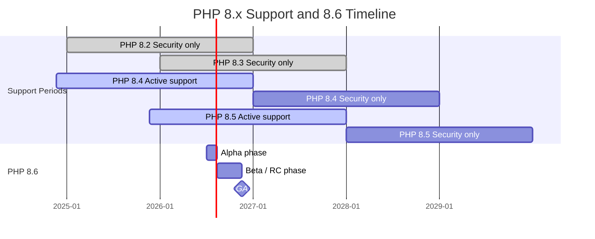

---

layout: post
title: "In-Depth Research Report on the State of PHP"
date: 2026-06-29
category: software engineering
---

## Executive Summary

As of mid-2026, the overall state of PHP can be summarized as “mature but still evolving.” The language core completed a modernization leap during the PHP 8 series, adding features over the past five years such as enums, readonly, fibers, typed class constants, property hooks, the URI extension, and the pipe operator. Version governance has maintained a clear annual release cadence and predictable support windows: 8.4 and 8.5 are still under full support, while 8.6 already has a public schedule and is expected to reach GA in November 2026. This means PHP is no longer merely a conservative language focused on “maintaining compatibility,” but a production platform that continues to move forward at a steady pace. ([php.net](https://www.php.net/supported-versions.php), [PHP 8.1 release](https://www.php.net/releases/8.1/en.php), [PHP 8.3 release](https://www.php.net/releases/8.3/en.php), [PHP 8.4 release](https://www.php.net/releases/8.4/en.php), [PHP 8.5 release](https://www.php.net/releases/8.5/en.php), [PHP 8.6 timetable](https://wiki.php.net/todo/php86))

On the ecosystem side, PHP remains enormous. Packagist, the main public repository for Composer, has registered more than 457,000 packages and accumulated more than 186.6 billion installs; this is direct evidence that the PHP ecosystem still has overwhelming long-tail vitality. Looking at major frameworks, Laravel is clearly the strongest full-stack framework in terms of downloads and community voice; Symfony maintains a strong enterprise position and component-level influence; Yii remains active after the formal release of Yii 3, but its center of gravity looks more like stable transition; Laminas’s Mezzio and components remain active, but traditional Laminas MVC has entered security-only mode, suggesting that its new-project adoption trend has weakened further. ([Packagist statistics](https://packagist.org/statistics), [Packagist](https://packagist.org/), [Laravel framework on Packagist](https://packagist.org/packages/laravel/framework), [Symfony on Packagist](https://packagist.org/packages/symfony/symfony), [Yii2 on Packagist](https://packagist.org/packages/yiisoft/yii2), [Laminas MVC on Packagist](https://packagist.org/packages/laminas/laminas-mvc), [Symfony releases](https://symfony.com/releases), [Laminas MVC EOL schedule](https://getlaminas.org/blog/2026-03-06-laminas-mvc-eol-schedule.html), [Yii GitHub organization](https://github.com/yiisoft), [Yii 3 release](https://www.yiiframework.com/news/777/yii3-is-released))

In terms of performance, PHP’s baseline still mainly revolves around PHP-FPM, a model that is mature, observable, and well understood across hosting and containerized environments. The JIT introduced in PHP 8 brings “conditional improvement”: official data shows that it helps synthetic benchmarks and some long-running CPU workloads significantly, but typical web applications usually perform close to PHP 7.4; Tideways also points out that common Laravel, Symfony, and WordPress examples do not show a magical leap between 8.2, 8.3, 8.4, and 8.5. In other words, modern PHP’s performance advantage comes more from the language itself, Opcache, FPM/worker models, framework optimization, I/O architecture, and infrastructure choices, rather than the JIT switch alone. ([PHP-FPM manual](https://www.php.net/manual/en/install.fpm.php), [PHP 8.0 release](https://www.php.net/releases/8.0/en.php), [PHP JIT RFC](https://wiki.php.net/rfc/jit), [Tideways PHP 8.4 benchmark](https://tideways.com/profiler/blog/php-benchmarks-8-4-performance-is-steady-compared-to-8-3-and-8-2), [Tideways PHP 8.5 benchmark](https://tideways.com/profiler/blog/php-benchmarks-8-5-vs-8-4-8-3-and-7-4), [FrankenPHP worker mode](https://frankenphp.dev/docs/worker/), [FrankenPHP performance](https://frankenphp.dev/docs/performance/))

Security is the part of PHP today that should least be judged by old impressions. The PHP core still has CVEs that require rapid patching, especially around CGI/FPM/SAPI, streams, extensions, and edge cases; however, the official maintenance process is clear, and Composer and Packagist have noticeably strengthened supply-chain protection over the past two years, including `composer audit`, policy blocking, malicious-package marking, and transparency-log direction. For teams, the real risk is usually not “PHP is insecure,” but “running unsupported versions, unaudited dependencies, old frameworks without upgrades, and leaving web risks at the application layer.” ([PHP changelog](https://www.php.net/ChangeLog-8.php), [PHP 2024 archive](https://www.php.net/archive/2024.php), [Composer config](https://getcomposer.org/doc/06-config.md), [Composer CLI](https://getcomposer.org/doc/03-cli.md), [Packagist supply-chain security update](https://blog.packagist.com/an-update-on-composer-packagist-supply-chain-security/), [Composer 2.10 release](https://blog.packagist.com/composer-2-10-release/))

If evaluating whether PHP is worth adopting today, the conclusion is not a simple “yes” or “no,” but “highly dependent on the problem shape.” For teams that need high delivery efficiency, mature hosting, stable database workflows, content/commerce systems, ecosystem richness, and continuity for large existing systems, PHP remains a very pragmatic choice. But if the team’s goal is single-language full-stack consistency, extremely high-concurrency resident-process models, or avoiding large historical baggage, then existing frameworks, deployment models, and upgrade capabilities need to be evaluated more strictly. ([PDO manual](https://www.php.net/manual/en/book.pdo.php), [Laravel broadcasting](https://laravel.com/docs/13.x/broadcasting), [Symfony Messenger](https://symfony.com/doc/current/components/messenger.html), [Laravel Cloud](https://cloud.laravel.com/docs/intro), [Google Cloud Run PHP deployment](https://docs.cloud.google.com/run/docs/quickstarts/build-and-deploy/deploy-php-service), [AWS Lambda custom runtime](https://docs.aws.amazon.com/lambda/latest/dg/runtimes-custom.html), [FrankenPHP](https://frankenphp.dev/))

## Research Scope and Criteria

This report takes 2026-06-29 as the observation point and focuses on PHP’s evolution in the PHP 8.x era over the past five years, including language evolution, official version support, the Packagist/Composer ecosystem, major frameworks, performance, security, community, and deployment patterns. Because the topic does not specify a region, the “job demand” section uses visible indicators from global and English-language public job platforms as approximations rather than precise labor-market statistics for a specific country. Therefore, that section should be interpreted as a trend signal, not as an official employment census. ([Stack Overflow Trends announcement](https://stackoverflow.blog/2017/05/09/introducing-stack-overflow-trends/), [Adzuna PHP developer jobs](https://www.adzuna.com/php-developer), [LinkedIn PHP developer jobs worldwide](https://www.linkedin.com/jobs/php-developer-jobs-worldwide), [Indeed remote PHP developer jobs](https://www.indeed.com/q-remote-php-developer-jobs.html))

The data sources prioritize official and primary sources, including php.net, wiki.php.net, Packagist, Composer, framework documentation, PHP-FIG, OWASP, Docker/AWS/Google Cloud documentation, and major benchmark or observational sources. A small number of “real-world performance” and “job market” data points use mature third-party sources as supplements, and their interpretive limitations are separately noted in the text. ([PHP supported versions](https://www.php.net/supported-versions.php), [Packagist statistics](https://packagist.org/statistics), [Composer](https://getcomposer.org/), [Laravel releases](https://laravel.com/docs/13.x/releases), [Symfony releases](https://symfony.com/releases), [PHP-FIG PSRs](https://www.php-fig.org/psr/), [OWASP Cheat Sheet Series](https://cheatsheetseries.owasp.org/index.html))

## Language Evolution and Version Lifecycle

The core changes in PHP over the past five years can be understood as a shift from “syntax convenience” toward “maturation of types and execution models.” PHP 8.0 brought JIT into the core; PHP 8.1 introduced enums, readonly properties, first-class callables, fibers, and intersection types; PHP 8.2 formally deprecated dynamic properties, pushing old-style code toward a more analyzable and maintainable model; PHP 8.3 added typed class constants, `#[\Override]`, `json_validate()`, and expanded the Random API; PHP 8.4 was represented by property hooks, asymmetric visibility, and the new DOM API; PHP 8.5 further added the URI extension, pipe operator, `clone()` with property overrides, `#[\NoDiscard]`, and persistent cURL share handles. This roadmap is highly consistent: improving type safety, readability, static-analysis friendliness, and modern application-development ergonomics. ([PHP 8.0 release](https://www.php.net/releases/8.0/en.php), [PHP 8.1 release](https://www.php.net/releases/8.1/en.php), [PHP 8.2 deprecated features](https://www.php.net/manual/en/migration82.deprecated.php), [PHP 8.3 release](https://www.php.net/releases/8.3/en.php), [PHP 8.4 release](https://www.php.net/releases/8.4/en.php), [PHP 8.5 release](https://www.php.net/releases/8.5/en.php))

PHP’s official version governance remains highly predictable: each branch usually receives about two years of active support and one year of security-only support. As of mid-2026, 8.2 and 8.3 have left active support and receive only security fixes until the end of 2026 and 2027 respectively; 8.4 and 8.5 remain under active support until the end of 2026 and 2027 respectively, with security support extending to the end of 2028 and 2029. For enterprise governance, this cadence has two important implications. First, staying on 8.1 or earlier is already clearly undesirable. Second, if teams want to keep upgrade pressure manageable, the upgrade process should be productized and routinized rather than postponed until EOL and treated as one major migration. ([PHP supported versions](https://www.php.net/supported-versions.php))

| PHP branch | Initial release                                                                                                                | Active support ends                                                | Security support ends                                              | Status as of 2026-06 |
| ---------- | ------------------------------------------------------------------------------------------------------------------------------ | ------------------------------------------------------------------ | ------------------------------------------------------------------ | -------------------- |
| 8.2        | 2022-12-08 ([php.net](https://www.php.net/supported-versions.php))                                                             | 2024-12-31 ([php.net](https://www.php.net/supported-versions.php)) | 2026-12-31 ([php.net](https://www.php.net/supported-versions.php)) | Security fixes only  |
| 8.3        | 2023-11-23 ([php.net](https://www.php.net/supported-versions.php))                                                             | 2025-12-31 ([php.net](https://www.php.net/supported-versions.php)) | 2027-12-31 ([php.net](https://www.php.net/supported-versions.php)) | Security fixes only  |
| 8.4        | 2024-11-21 ([php.net](https://www.php.net/supported-versions.php))                                                             | 2026-12-31 ([php.net](https://www.php.net/supported-versions.php)) | 2028-12-31 ([php.net](https://www.php.net/supported-versions.php)) | Under full support   |
| 8.5        | 2025-11-20 ([php.net](https://www.php.net/supported-versions.php), [PHP 8.5 release](https://www.php.net/releases/8.5/en.php)) | 2027-12-31 ([php.net](https://www.php.net/supported-versions.php)) | 2029-12-31 ([php.net](https://www.php.net/supported-versions.php)) | Under full support   |

PHP’s “roadmap” is unlike some languages where a single company publishes a long multi-year plan. Instead, it lands progressively through RFCs and the annual version cadence. Looking at the official `todo:php86`, PHP 8.6 already publicly lists Alpha, Beta, RC, and GA schedules. Feature Freeze is set for 2026-08-13, and GA is expected on 2026-11-19. This shows that the next version is not a vague vision, but already part of a concrete delivery pipeline. ([PHP 8.6 timetable](https://wiki.php.net/todo/php86))

The following diagram is drawn from the official PHP support table and the PHP 8.6 timetable. ([PHP supported versions](https://www.php.net/supported-versions.php), [PHP 8.6 timetable](https://wiki.php.net/todo/php86))

## Ecosystem Scale and Framework Landscape

Looking only at public packages and dependency management, PHP’s ecosystem scale remains first-tier. Packagist explicitly describes itself as Composer’s main repository; its statistics page shows that as of mid-2026, it has registered about 457,961 packages, 5,654,274 versions, and more than 186,620,657,542 package installs since 2012-04-13. This means the reality of PHP development is not a scattered collection of tools, but an enormous dependency-distribution and reuse network. Composer itself also remains the standard dependency manager, with version 2.10.1 shown on the homepage; over the past two release cycles, it has more visibly strengthened security blocking, auditing, and malicious-package detection. ([Packagist](https://packagist.org/), [Packagist statistics](https://packagist.org/statistics), [Composer](https://getcomposer.org/), [Composer config](https://getcomposer.org/doc/06-config.md), [Composer 2.9 changelog](https://getcomposer.org/changelog/2.9.0-RC1), [Composer 2.10 release](https://blog.packagist.com/composer-2-10-release/))

Among the major frameworks, Laravel is currently still the strongest single full-stack framework by adoption. Packagist shows that `laravel/framework` has accumulated about 543 million installs and more than 20,000 dependent packages; GitHub shows about 34.8k stars, the latest stable releases were still being published in late June 2026, and the official documentation maintains an annual major-release cadence with 18 months of bug fixes and 2 years of security fixes. This combination of high download volume, fast releases, and fixed support windows shows that Laravel’s advantage is not only DX, but also the way it integrates “ecosystem, education, deployment products, and release cadence” into something close to a platform-level system. ([Laravel framework on Packagist](https://packagist.org/packages/laravel/framework), [Laravel framework on GitHub](https://github.com/laravel/framework), [Laravel releases on GitHub](https://github.com/laravel/framework/releases), [Laravel release docs](https://laravel.com/docs/13.x/releases))

Symfony’s positioning is different: it is both a full framework and a large component ecosystem. `symfony/symfony` has about 87.13 million installs on Packagist and about 31.1k GitHub stars; the official release page shows both the current stable line 8.1 and the LTS 7.4 support status, with 7.4 LTS supported until the end of 2029. Combined with the official website’s claim that its components are reused by many projects, this means Symfony’s actual influence is often underestimated if one looks only at full-stack framework downloads. Its moat remains deep in enterprise systems, long-lived systems, bundle/component patterns, and composable architecture. ([Symfony on Packagist](https://packagist.org/packages/symfony/symfony), [Symfony on GitHub](https://github.com/symfony/symfony), [Symfony releases](https://symfony.com/releases), [Symfony 7.4 release](https://symfony.com/releases/7.4), [Symfony official site](https://symfony.com/))

Yii’s signal is more nuanced. Yii 2 still has about 30.73 million installs and 14.3k GitHub stars, with the latest 2.0.55 release published in May 2026; the official GitHub organization also explicitly says it “supports Yii 1, Yii 2, and develops the brand new Yii 3,” while official news shows that Yii 3 was formally released on 2025-12-31, and 2026 still saw updates to runners, templates, and components. This shows Yii has not stagnated, but its market narrative has shifted from “competing as a single main framework” to “stable Yii 2 maintenance plus Yii 3 componentized advancement.” For new teams, the issue with Yii is not that it lacks vitality, but that its market mindshare and talent pool are smaller than Laravel/Symfony. ([Yii2 on Packagist](https://packagist.org/packages/yiisoft/yii2), [Yii2 on GitHub](https://github.com/yiisoft/yii2), [Yii GitHub organization](https://github.com/yiisoft), [Yii 3 release](https://www.yiiframework.com/news/777/yii3-is-released), [Yii 2026 news](https://www.yiiframework.com/news?year=2026), [Yii runner RoadRunner update](https://www.yiiframework.com/news/812/yii-runner-roadrunner-3-2))

Laminas needs to be viewed separately. Laminas components and Mezzio remain active, but traditional `laminas-mvc` has been officially marked feature-complete and security-only, with security support extending to the end of PHP 8.4’s security period, namely 2028-12-31. Packagist still shows about 25.99 million downloads, but GitHub stars are already low, and the official blog clearly states that MVC no longer accepts new features or general bug fixes. In practice, this means Laminas remains maintainable for existing enterprise systems, but for greenfield projects, there are significantly fewer reasons to adopt traditional MVC by default. ([Laminas MVC on Packagist](https://packagist.org/packages/laminas/laminas-mvc), [Laminas MVC on GitHub](https://github.com/laminas/laminas-mvc), [Laminas MVC EOL schedule](https://getlaminas.org/blog/2026-03-06-laminas-mvc-eol-schedule.html), [Laminas MVC is retiring](https://getlaminas.org/blog/2025-06-06-laminas-mvc-is-retiring.html))

| Framework     |                                                           Packagist installs |                                             GitHub stars | Official support/status                                                                                                                                                         | Adoption trend interpretation                                                       |
| ------------- | ---------------------------------------------------------------------------: | -------------------------------------------------------: | ------------------------------------------------------------------------------------------------------------------------------------------------------------------------------- | ----------------------------------------------------------------------------------- |
| Laravel       |  543,075,296 ([Packagist](https://packagist.org/packages/laravel/framework)) |   34.8k ([GitHub](https://github.com/laravel/framework)) | 18 months of bug fixes and 2 years of security fixes per version ([Laravel docs](https://laravel.com/docs/13.x/releases))                                                       | Strongest among the four; framework + productized platform is the most complete     |
| Symfony       |     87,135,747 ([Packagist](https://packagist.org/packages/symfony/symfony)) |     31.1k ([GitHub](https://github.com/symfony/symfony)) | 8.1 is current stable; 7.4 is LTS until 2029-11 ([Symfony releases](https://symfony.com/releases), [Symfony 7.4](https://symfony.com/releases/7.4))                             | Strong enterprise and component ecosystem; clearest long-term governance            |
| Yii 2 / Yii 3 | 30,731,447, Yii 2 ([Packagist](https://packagist.org/packages/yiisoft/yii2)) | 14.3k, Yii 2 ([GitHub](https://github.com/yiisoft/yii2)) | Yii 2 still maintained; Yii 3 released on 2025-12-31 ([Yii 3 release](https://www.yiiframework.com/news/777/yii3-is-released), [Yii organization](https://github.com/yiisoft))  | Still active, but new-project mindshare is weaker than the first two                |
| Laminas MVC   | 25,987,436 ([Packagist](https://packagist.org/packages/laminas/laminas-mvc)) |   173 ([GitHub](https://github.com/laminas/laminas-mvc)) | Security-only until 2028-12-31 ([GitHub](https://github.com/laminas/laminas-mvc), [Laminas EOL schedule](https://getlaminas.org/blog/2026-03-06-laminas-mvc-eol-schedule.html)) | Suitable for maintaining old projects, not suitable as the default for new projects |

## Performance Status and Execution Models

The mainstream execution model for PHP in production environments today is still based on PHP-FPM. The official manual directly describes FPM as the primary PHP FastCGI implementation, suitable for high-load sites, and providing advanced process management, pools, different uid/gid/chroot/env configurations, observability, and logging capabilities. Although this model is old-school, its maturity is exactly what allows Nginx/Apache + FPM, containerization, shared hosting, PaaS, and managed hosting to form a highly stable operations experience. ([PHP-FPM manual](https://www.php.net/manual/en/install.fpm.php), [PHP-FPM configuration](https://www.php.net/manual/en/install.fpm.configuration.php))

JIT is the most easily misunderstood feature of the PHP 8 era. When announcing PHP 8.0, the official release notes emphasized that Tracing JIT could reach about 3x performance in synthetic benchmarks and 1.5–2x improvement in some long-running applications, but typical web applications were roughly comparable to PHP 7.4. The more detailed JIT RFC reaches the same conclusion: `bench.php` exceeds 2x, PHP-Parser is about 1.3x, Amphp hello-world is about 5%, while real WordPress web requests only go from 315 req/s to 326 req/s. In other words, the value of JIT is more like opening the ceiling for CPU-bound workloads, some CLI/long-running programs, and specific resident processes, rather than automatically making ordinary CRUD websites explode in performance. ([PHP 8.0 release](https://www.php.net/releases/8.0/en.php), [PHP JIT RFC](https://wiki.php.net/rfc/jit))

This judgment is consistent with practical observations. Tideways’ 2025 benchmark of Laravel, Symfony, and WordPress examples pointed out that the overall differences between PHP 8.2, 8.3, and 8.4 are not large; a later comparison of 8.5 reached the same direction: upgrading to the latest PHP is important, but it is not a shortcut that replaces application-layer bottleneck analysis. The implication for decision-makers is very practical: if your bottleneck is in the database, ORM, N+1 queries, I/O, or external API latency, changing minor versions will not be more effective than observability, caching, and architecture adjustment. ([Tideways PHP 8.4 benchmark](https://tideways.com/profiler/blog/php-benchmarks-8-4-performance-is-steady-compared-to-8-3-and-8-2), [Tideways PHP 8.5 benchmark](https://tideways.com/profiler/blog/php-benchmarks-8-5-vs-8-4-8-3-and-7-4))

The most noteworthy new execution model in recent years is not JIT itself, but the expansion of worker/server models. FrankenPHP officially claims that it can be 3.5x faster than FPM on an API Platform application, and clearly states that worker mode keeps the application resident in memory to reduce bootstrap overhead; however, its documentation also emphasizes that static variables, global variables, and in-memory caches persist across requests, so unintended state pollution must be prevented. This shows that modern PHP is moving from “restart on every request” toward “optional resident workers,” but this is not a zero-cost dividend. It trades higher performance potential for stricter state-management requirements. ([FrankenPHP](https://frankenphp.dev/), [FrankenPHP worker mode](https://frankenphp.dev/docs/worker/), [FrankenPHP performance](https://frankenphp.dev/docs/performance/), [PHP Foundation on FrankenPHP](https://thephp.foundation/blog/2025/05/15/frankenphp/))

Serverless scenarios should also be evaluated separately. AWS Lambda does not have an official PHP managed runtime; instead, it explicitly requires PHP to use a custom runtime path. Bref fills the gap with an open-source runtime. Bref’s official performance page uses PHP’s official `bench.php` as a CPU-intensive example, showing that in Lambda, higher memory configuration also corresponds to higher CPU, reducing execution time from 5.7 seconds at 128MB to 0.33 seconds at 2048MB. This is well suited for event processing and bursty traffic, but it still cannot be equated with the cost-performance profile of traditional steady web workloads. ([AWS Lambda runtimes](https://docs.aws.amazon.com/lambda/latest/dg/lambda-runtimes.html), [AWS Lambda custom runtime](https://docs.aws.amazon.com/lambda/latest/dg/runtimes-custom.html), [Bref](https://bref.sh/), [Bref performance](https://bref.sh/docs/environment/performances))

For chart presentation, if a team wants to supplement internal decision material with more visualization, the most valuable material is not a single bar chart, but three kinds of charts: first, a line chart comparing req/s or p95 latency for the same application across PHP 8.2–8.5; second, a stacked bar chart comparing FPM, FrankenPHP worker, and Lambda/Bref in cold start, steady-state latency, and RAM usage; third, a scatter plot mapping “throughput” against “deployment complexity.” This is more suitable for architecture selection than only looking at the highest req/s in a demo. The above benchmarks can be sourced respectively from the official PHP JIT explanation, Tideways, FrankenPHP, and Bref. ([PHP 8.0 release](https://www.php.net/releases/8.0/en.php), [Tideways PHP 8.5 benchmark](https://tideways.com/profiler/blog/php-benchmarks-8-5-vs-8-4-8-3-and-7-4), [FrankenPHP](https://frankenphp.dev/), [Bref performance](https://bref.sh/docs/environment/performances))

## Security and Governance

PHP’s security posture today is actually quite transparent at its core: the official changelog and news archive disclose patch contents very specifically, rather than vaguely saying “several security fixes.” The 2024 patch records specifically mention several notable issues, including CVE-2024-4577 for Windows CGI argument injection, subsequent bypass issues CVE-2024-8926/8927, CVE-2024-9026 for FPM child log alteration, CVE-2024-8925 for multipart form-data parsing errors, and vulnerabilities at the streams, LDAP, MySQLnd, PDO Firebird/DBLIB extension layers. These cases show that PHP’s risk surface is not only in language syntax, but often appears at SAPI and extension boundaries. ([PHP changelog](https://www.php.net/ChangeLog-8.php), [PHP 2024 archive](https://www.php.net/archive/2024.php))

The real governance focus is “version support windows” and “supply chain.” The php.net homepage and news archive regularly mark security releases and clearly encourage users to upgrade; if an organization remains on an unsupported version, the risk is not abstract, but the direct loss of official patches. On the other hand, Composer/Packagist significantly strengthened supply-chain mechanisms in 2025–2026: `composer audit` can audit installed packages for vulnerabilities; policy/blocking can block unsafe or flagged versions during `update`, `require`, and `remove`; Composer 2.10 also began using malicious-package-filter data sources by default. This means that if a PHP team today still has not integrated dependency auditing into CI/CD, it is usually not a tool shortage, but a process-design problem. ([Composer config](https://getcomposer.org/doc/06-config.md), [Composer CLI](https://getcomposer.org/doc/03-cli.md), [Packagist supply-chain security update](https://blog.packagist.com/an-update-on-composer-packagist-supply-chain-security/), [Composer 2.10 release](https://blog.packagist.com/composer-2-10-release/))

At the application layer, common PHP risks are not fundamentally different from other web stacks. They still mainly concentrate around SQL injection, XSS, deserialization, command execution, and unsafe input handling. OWASP clearly states that SQL injection and XSS remain among the most common risks, while the official PHP manual directly demonstrates using PDO prepared statements to avoid concatenating user input directly into SQL; the official function index also provides ready-made building blocks such as `password_hash` and `random_bytes`. These are mature and low-friction defenses. ([OWASP SQL Injection Prevention Cheat Sheet](https://cheatsheetseries.owasp.org/cheatsheets/SQL_Injection_Prevention_Cheat_Sheet.html), [OWASP Cross Site Scripting Prevention Cheat Sheet](https://cheatsheetseries.owasp.org/cheatsheets/Cross_Site_Scripting_Prevention_Cheat_Sheet.html), [OWASP Deserialization Cheat Sheet](https://cheatsheetseries.owasp.org/cheatsheets/Deserialization_Cheat_Sheet.html), [PHP PDO prepared statements](https://www.php.net/manual/en/pdo.prepare.php), [PHP function index](https://www.php.net/manual/en/indexes.functions.php))

Therefore, the most reasonable security baseline for practical teams is not asking “does PHP have vulnerabilities,” but whether the following things have been institutionalized: continuously using supported branches; running `composer audit` in CI; always using prepared statements for database access; using the `password_hash` family for password hashing; not deserializing untrusted data; and constraining FPM/worker/serverless execution permissions, environment variables, and secret management at the platform layer. If these are done, PHP’s security risk profile has no essential disadvantage compared with mainstream server-side languages. ([PHP supported versions](https://www.php.net/supported-versions.php), [Composer CLI](https://getcomposer.org/doc/03-cli.md), [PHP PDO prepared statements](https://www.php.net/manual/en/pdo.prepare.php), [OWASP Deserialization Cheat Sheet](https://cheatsheetseries.owasp.org/cheatsheets/Deserialization_Cheat_Sheet.html), [Laravel Cloud compliance](https://cloud.laravel.com/docs/compliance))

## Community, Talent, and Deployment Status

From developer-community indicators, PHP is not a disappearing language, but one that has entered a mature and stable phase. Stack Overflow announced in 2026 that the old Trends tool was deprecated and recommended using Data Explorer instead; therefore, the most stable official alternative indicator is the annual Developer Survey. The survey shows PHP usage among “all respondents” at 18.2% in 2024 and 18.9% in 2025; among professional developers, it rose slightly from 18.7% to 19.1%. This is not explosive growth, but neither is it continuous decline. It looks more like a mature language maintaining stability on a large installed base. ([Stack Overflow Trends announcement](https://stackoverflow.blog/2017/05/09/introducing-stack-overflow-trends/), [Stack Overflow 2024 Developer Survey](https://survey.stackoverflow.co/2024/technology), [Stack Overflow 2025 Developer Survey](https://survey.stackoverflow.co/2025/technology))

GitHub activity also supports this judgment. `php/php-src` currently has about 40.2k stars and maintains many open issues and pull requests; the PHP Foundation has continued publishing impact and transparency reports over the past two years, stating that its mission is to provide funding and governance support for PHP core and long-term prosperity; in 2025, it also brought FrankenPHP into official support scope. This shows PHP’s community vitality does not only come from historical inertia, but also from continuous investment in core evolution, modernized server forms, and external narrative. ([php-src on GitHub](https://github.com/php/php-src/blob/master/main/main.c), [php-src commits](https://github.com/php/php-src/commits), [php-src issues](https://github.com/php/php-src/issues/), [PHP Foundation 2023 transparency report](https://thephp.foundation/blog/2024/02/26/transparency-and-impact-report-2023/), [PHP Foundation 2025 impact report](https://thephp.foundation/blog/2026/05/27/impact-and-transparency-report-2025/), [PHP Foundation on FrankenPHP](https://thephp.foundation/blog/2025/05/15/frankenphp/))

For job demand, because no geographic scope is specified, global public job platforms can only be treated as approximations. LinkedIn currently shows “15,000+ Php Developer jobs in Worldwide”; Indeed shows about 308 remote PHP developer jobs; Adzuna’s US page shows about 388 PHP developer jobs and an average salary of about USD 135,147. These numbers fluctuate, are biased toward English-language markets, and are affected by platform indexing strategies, but they are sufficient to support a conservative conclusion: although the PHP talent market is not as hot as AI/TypeScript, it still has meaningful scale, especially in operations, commerce systems, content systems, Laravel/Symfony, and modernization of existing enterprise applications. ([LinkedIn PHP developer jobs worldwide](https://www.linkedin.com/jobs/php-developer-jobs-worldwide), [Indeed remote PHP developer jobs](https://www.indeed.com/q-remote-php-developer-jobs.html), [Adzuna PHP developer jobs](https://www.adzuna.com/php-developer))

In deployment and hosting, PHP’s advantage is that the options are very complete, and everything from the most traditional to the most modern can work. Docker’s official PHP image is a Docker Official Image with public downloads exceeding 1 billion; Docker’s official documentation also directly provides PHP and Laravel container/dev/prod tutorials. Google Cloud clearly provides a quick PHP deployment path for Cloud Run and a `php85` base image; although AWS Lambda has no official managed runtime, the custom-runtime + Bref path is already mature enough; platforms such as Laravel Cloud, Laravel Vapor, and SymfonyCloud powered by Upsun further move PHP hosting from “assemble it yourself” toward “framework-aware managed platforms.” ([Docker PHP image](https://hub.docker.com/_/php/tags), [Docker PHP guide](https://docs.docker.com/guides/php/develop/), [Docker Laravel production setup](https://docs.docker.com/guides/frameworks/laravel/production-setup/), [Google Cloud Run PHP deployment](https://docs.cloud.google.com/run/docs/quickstarts/build-and-deploy/deploy-php-service), [Google Cloud Run PHP runtime](https://docs.cloud.google.com/run/docs/runtimes/php), [AWS Lambda custom runtime](https://docs.aws.amazon.com/lambda/latest/dg/runtimes-custom.html), [Bref](https://bref.sh/), [Laravel Cloud](https://cloud.laravel.com/docs/intro), [Laravel Vapor](https://vapor.laravel.com/), [SymfonyCloud on Platform.sh](https://platform.sh/marketplace/symfony/))

PHP’s interoperability with JavaScript, databases, and microservices is no longer a weakness. PHP-FIG’s PSR-7, PSR-15, and PSR-18 give HTTP messages, middleware, and HTTP clients cross-framework standard interfaces; PDO remains a stable abstraction layer for multi-database access; Laravel’s broadcasting/Reverb directly targets JavaScript and WebSocket use cases; Symfony HttpClient and Messenger provide official support for API consumption and message-oriented architecture. This means PHP’s role in modern systems is not only as the backend of monolithic websites, but also as an API node, event processor, queue consumer, or one language boundary within a microservice system. ([PHP-FIG PSR-7](https://www.php-fig.org/psr/psr-7/), [PHP-FIG PSR-15](https://www.php-fig.org/psr/psr-15/), [PHP-FIG PSR-18](https://www.php-fig.org/psr/psr-18/), [PDO manual](https://www.php.net/manual/en/book.pdo.php), [Laravel broadcasting](https://laravel.com/docs/13.x/broadcasting), [Laravel Reverb](https://laravel.com/docs/13.x/reverb), [Symfony HttpClient](https://symfony.com/doc/current/http_client.html), [Symfony Messenger](https://symfony.com/doc/current/components/messenger.html))

| Deployment option                    | Model                               | Main advantage                                                                                                                                                                                                                                                                                        | Main cost                                                                                                 | Suitable scenario                                              |
| ------------------------------------ | ----------------------------------- | ----------------------------------------------------------------------------------------------------------------------------------------------------------------------------------------------------------------------------------------------------------------------------------------------------- | --------------------------------------------------------------------------------------------------------- | -------------------------------------------------------------- |
| Docker official PHP image            | Containerized, self-managed, or K8s | Standardized, portable, complete tutorials and ecosystem ([Docker PHP image](https://hub.docker.com/_/php/tags), [Docker PHP guide](https://docs.docker.com/guides/php/develop/))                                                                                                                     | Must handle networking, observability, and scaling yourself                                               | Multi-environment consistency; teams with container capability |
| Nginx/Apache + PHP-FPM               | Traditional mainstream              | Mature, stable, highly observable, widely hosted ([PHP-FPM manual](https://www.php.net/manual/en/install.fpm.php))                                                                                                                                                                                    | Per-request startup model has bootstrap cost                                                              | Most websites, SaaS, commerce systems                          |
| FrankenPHP worker mode               | Modern app server                   | Official integrations with Laravel/Symfony; reduces bootstrap cost ([FrankenPHP](https://frankenphp.dev/), [FrankenPHP Symfony](https://frankenphp.dev/docs/symfony/), [FrankenPHP Laravel](https://frankenphp.dev/docs/laravel/))                                                                    | Must manage cross-request state pollution ([FrankenPHP worker mode](https://frankenphp.dev/docs/worker/)) | Lower latency, willingness to adjust app lifecycle             |
| AWS Lambda + Bref                    | Serverless                          | Automatic scaling, low idle cost ([Bref](https://bref.sh/), [AWS Lambda custom runtime](https://docs.aws.amazon.com/lambda/latest/dg/runtimes-custom.html))                                                                                                                                           | Custom runtime, cold starts, and observability are more complex                                           | Event-driven workloads, peak traffic, non-long connections     |
| Google Cloud Run                     | Container-style serverless          | Fast PHP deployment from source or container ([Google Cloud Run PHP deployment](https://docs.cloud.google.com/run/docs/quickstarts/build-and-deploy/deploy-php-service), [Google Cloud Run PHP runtime](https://docs.cloud.google.com/run/docs/runtimes/php))                                         | Platform abstraction limits; long-running services require design                                         | APIs, internal services, GCP-oriented teams                    |
| Laravel Cloud / Vapor / SymfonyCloud | Managed PHP platform                | Framework-aware integration of database/worker/scaling ([Laravel Cloud](https://cloud.laravel.com/docs/intro), [Laravel Cloud compute](https://cloud.laravel.com/docs/compute), [Laravel Vapor](https://vapor.laravel.com/), [SymfonyCloud on Platform.sh](https://platform.sh/marketplace/symfony/)) | Platform lock-in and cost transparency need case-by-case evaluation                                       | Small teams, teams wanting less DevOps burden                  |

## Migration Challenges, Future Outlook, and Recommendations

PHP’s real difficulty is not new language features, but “moving from the old world to the new world.” The official migration documentation clearly reminds users to test backward incompatibilities before upgrading from 7.4 to 8.0; 8.0 changed weak-comparison rules for numeric and non-numeric strings; 8.1 changed “required parameter after optional parameter” from deprecation to `ArgumentCountError`; 8.2 deprecated dynamic properties; 8.4 also has new backward-incompatible changes and removals/adjustments. These changes are all reasonable in isolation, but if a system is old, under-tested, uses many magic properties and historical packages, and has not been maintained regularly, upgrading across multiple versions at once can still be painful. ([PHP 8.0 migration](https://www.php.net/manual/en/migration80.php), [PHP 8.0 incompatible changes](https://www.php.net/manual/en/migration80.incompatible.php), [PHP 8.1 incompatible changes](https://www.php.net/manual/en/migration81.incompatible.php), [PHP 8.2 deprecated features](https://www.php.net/manual/en/migration82.deprecated.php), [PHP 8.4 migration](https://www.php.net/manual/en/migration84.php))

Migration risks at the framework layer also differ. Symfony’s strength is that the official documentation clearly provides major-upgrade processes and deprecations helpers, making it suitable for gradual migration through “clear deprecations first, then upgrade major versions.” The Laminas community even directly discusses using the Strangler Fig pattern to gradually replace old systems. By contrast, teams using Laravel usually need to pay more attention to the chain effects of annual major cadence on package compatibility; teams using Yii face a strategic choice between stable Yii 2 maintenance and the new Yii 3 architecture, not merely a simple version upgrade. ([Symfony major upgrade guide](https://symfony.com/doc/current/setup/upgrade_major.html), [Laminas Strangler Fig pattern](https://getlaminas.org/blog/2025-08-06-strangler-fig-pattern.html), [Yii 3 release](https://www.yiiframework.com/news/777/yii3-is-released))

For a future outlook, PHP’s strengths and risks are both clear. Its strengths are: the language is more typed and more analyzable than before; the dependency ecosystem is enormous; database and web-delivery workflows are mature; deployment options span from shared hosting to serverless; large existing systems and small-to-medium products can both find appropriate toolchains. Its risks are: heavy historical baggage, fragmentation in the framework landscape, weaker talent-brand appeal than AI/JS ecosystems, some organizations still staying on unsupported versions, and an easy tendency to underestimate state-management complexity in new forms such as worker mode. The opportunities mainly come from three directions: first, the PHP Foundation’s investment in core and surrounding modernization; second, new execution models such as FrankenPHP that give PHP a chance to redefine its performance narrative; third, productized platforms such as Laravel Cloud/SymfonyCloud/Upsun that lower the infrastructure threshold for PHP teams. ([PHP Foundation 2023 transparency report](https://thephp.foundation/blog/2024/02/26/transparency-and-impact-report-2023/), [PHP Foundation on FrankenPHP](https://thephp.foundation/blog/2025/05/15/frankenphp/), [Laravel Cloud](https://cloud.laravel.com/docs/intro), [SymfonyCloud on Platform.sh](https://platform.sh/marketplace/symfony/), [PHP supported versions](https://www.php.net/supported-versions.php))

For teams considering PHP, my recommendation is simple but clear. If what you are building is a business backend, content system, membership/order workflow, API-first SaaS, or anything that requires fast delivery without reinventing infrastructure wheels, PHP is still very much worth considering, and the first choices are usually Laravel or Symfony. If you already have a large existing PHP system, the highest-priority task is not rewriting, but institutionalizing upgrade and dependency-governance workflows. If you care deeply about extreme throughput and resident-process models, you can evaluate FrankenPHP worker mode, Laravel Octane, or specific async/message architectures, but must include state isolation and observability costs in the calculation. If you are still on PHP 7.x or a framework close to EOL, delaying migration is not recommended—the risk is usually already greater than the migration cost. ([Laravel releases](https://laravel.com/docs/13.x/releases), [Symfony releases](https://symfony.com/releases), [FrankenPHP worker mode](https://frankenphp.dev/docs/worker/), [Laravel Octane](https://laravel.com/docs/13.x/octane), [PHP supported versions](https://www.php.net/supported-versions.php))

### Concise Decision Recommendations for Teams

| Team situation                                                                   | Recommendation                                                                                                                                                                                                                                                                                                                                                                                               |
| -------------------------------------------------------------------------------- | ------------------------------------------------------------------------------------------------------------------------------------------------------------------------------------------------------------------------------------------------------------------------------------------------------------------------------------------------------------------------------------------------------------ |
| Greenfield Web / SaaS project, valuing delivery speed and ecosystem completeness | Evaluate Laravel first; if long-term governance, LTS, and componentization matter more, evaluate Symfony. ([Laravel framework](https://packagist.org/packages/laravel/framework), [Symfony framework](https://packagist.org/packages/symfony/symfony), [Laravel releases](https://laravel.com/docs/13.x/releases), [Symfony 7.4 LTS](https://symfony.com/releases/7.4))                                      |
| Large existing PHP system                                                        | First inventory version support, dependency audits, and testing gaps, then upgrade sequentially to 8.4/8.5; do not stay on EOL branches. ([PHP supported versions](https://www.php.net/supported-versions.php), [Composer audit](https://getcomposer.org/doc/03-cli.md))                                                                                                                                     |
| Pursuing lower latency and less bootstrap cost                                   | Try FrankenPHP worker mode, but specifically verify cross-request state, memory leaks, and observability strategy. ([FrankenPHP worker mode](https://frankenphp.dev/docs/worker/), [FrankenPHP performance](https://frankenphp.dev/docs/performance/))                                                                                                                                                       |
| Wanting to minimize DevOps burden                                                | First look at platformized options such as Laravel Cloud, Vapor, SymfonyCloud/Upsun, and Cloud Run. ([Laravel Cloud](https://cloud.laravel.com/docs/intro), [Laravel Vapor](https://vapor.laravel.com/), [SymfonyCloud on Platform.sh](https://platform.sh/marketplace/symfony/), [Google Cloud Run PHP deployment](https://docs.cloud.google.com/run/docs/quickstarts/build-and-deploy/deploy-php-service)) |
| High security requirements and strict supply-chain management                    | Integrate `composer audit`, policy blocking, and support-window control into CI/CD and platform governance. ([Composer audit](https://getcomposer.org/doc/03-cli.md), [Composer config](https://getcomposer.org/doc/06-config.md), [PHP supported versions](https://www.php.net/supported-versions.php))                                                                                                     |

## Open Questions and Limitations

This report has prioritized official and primary data, but several limitations still need to be stated clearly. First, Stack Overflow’s old Trends tool was retired in March 2026, so this report uses the official 2024/2025 Developer Survey as a proxy for community trends rather than directly citing long-term tag time-series curves. Second, the job-demand section uses public pages from LinkedIn, Indeed, Adzuna, and similar platforms as approximations, and cannot represent all regions or private recruiting channels. Finally, the performance section deliberately avoids treating any single benchmark as the final truth; PHP’s real-world performance depends heavily on framework, I/O, database, cache, deployment model, and observability tuning, so the final validation should still be done against your own workload. ([Stack Overflow Trends announcement](https://stackoverflow.blog/2017/05/09/introducing-stack-overflow-trends/), [Stack Overflow 2024 Developer Survey](https://survey.stackoverflow.co/2024/technology), [Stack Overflow 2025 Developer Survey](https://survey.stackoverflow.co/2025/technology), [LinkedIn PHP developer jobs](https://www.linkedin.com/jobs/php-developer-jobs-worldwide), [Indeed remote PHP developer jobs](https://www.indeed.com/q-remote-php-developer-jobs.html), [Adzuna PHP developer jobs](https://www.adzuna.com/php-developer), [Tideways PHP 8.5 benchmark](https://tideways.com/profiler/blog/php-benchmarks-8-5-vs-8-4-8-3-and-7-4), [FrankenPHP worker mode](https://frankenphp.dev/docs/worker/))
