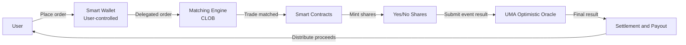

**Executive summary:** Polymarket is a blockchain-based prediction market platform founded in New York by Shayne Coplan in June 2020 ([ICE](https://ir.theice.com/press/news-details/2025/ICE-Announces-Strategic-Investment-in-Polymarket/default.aspx)). The platform allows users to trade “Yes/No” binary prediction contracts on major events in politics, sports, cryptocurrency, economics, and other categories. Polymarket trading uses a decentralized structure, with an off-chain Central Limit Order Book (CLOB) for order matching, while settlement and outcome submission are completed through smart contracts on Polygon and the UMA oracle ([Polymarket Docs](https://docs.polymarket.com/polymarket-101)). Since launch, the platform has grown rapidly: during the 2024 U.S. election period, monthly trading volume reached billions of dollars; in the first eight months of 2025, cumulative volume exceeded \$7.7B ([CCN](https://www.ccn.com/news/crypto/polymarket-7-5-billion-2025-prediction-markets/)). In early 2022, the U.S. CFTC found that Polymarket had illegally offered futures transactions and imposed a \$1.4M penalty ([CFTC](https://www.cftc.gov/PressRoom/PressReleases/8478-22)). In 2025, Polymarket spent \$112M to acquire the CFTC-registered exchange QCX, and on July 9, 2025, officially became a regulated Designated Contract Market (DCM) through Polymarket US ([PRNewswire](https://www.prnewswire.com/news-releases/polymarket-acquires-cftc-licensed-exchange-and-clearinghouse-qcex-for-112-million-302509626.html)); in October 2025, Intercontinental Exchange (ICE) announced a \$2B investment in Polymarket at an approximately \$8B valuation ([ICE](https://ir.theice.com/press/news-details/2025/ICE-Announces-Strategic-Investment-in-Polymarket/default.aspx)). Overall, Polymarket is known for its high trading volume, user-friendly interface, and innovative matching mechanism, but it has also drawn scrutiny because of regulatory controversy and potential market manipulation risks ([Wikipedia](https://en.wikipedia.org/wiki/Polymarket), [TradingView](https://www.tradingview.com/news/cointelegraph:0636da552094b:0-polymarket-s-monthly-volume-declines-for-first-time-since-august/)).

## Platform overview and history

* **Founding and development:** Polymarket was founded in June 2020 by Shayne Coplan, a former rideshare platform manager ([ICE](https://ir.theice.com/press/news-details/2025/ICE-Announces-Strategic-Investment-in-Polymarket/default.aspx)). In its early stage, it used the USDC.e stablecoin on Avalanche for trading, and later migrated to Polygon ([Polymarket Help Center](https://help.polymarket.com/en/articles/14762452-polymarket-exchange-upgrade-april-28-2026)). The platform allows global users on its international version to participate in prediction markets and has established QCX LLC in the United States as a CFTC-regulated subsidiary, Polymarket US ([Polymarket](https://polymarket.com/), [PRNewswire](https://www.prnewswire.com/news-releases/polymarket-acquires-cftc-licensed-exchange-and-clearinghouse-qcex-for-112-million-302509626.html)).

* **Major milestones:** In January 2022, the U.S. Commodity Futures Trading Commission (CFTC) ruled that Blockratize Inc., Polymarket’s predecessor, had illegally operated futures contracts, imposed a \$1.4M penalty, and required liquidation of certain non-compliant markets ([CFTC](https://www.cftc.gov/PressRoom/PressReleases/8478-22)). In July 2025, Polymarket completed the acquisition of QCX to return to the U.S. market ([PRNewswire](https://www.prnewswire.com/news-releases/polymarket-acquires-cftc-licensed-exchange-and-clearinghouse-qcex-for-112-million-302509626.html)); in the same month, QCX LLC was approved by the CFTC as a Designated Contract Market. In October 2025, ICE announced a \$2B investment in Polymarket at an \$8B valuation ([ICE](https://ir.theice.com/press/news-details/2025/ICE-Announces-Strategic-Investment-in-Polymarket/default.aspx)); in January 2026, after Polymarket expanded its fee mechanism to all cryptocurrency markets, its daily fee revenue exceeded one million dollars ([BeInCrypto](https://beincrypto.com/polymarket-fee-revenue-million-daily/)).

* **Controversy and regulation:** Polymarket’s markets on war and political betting have triggered controversy. *The Wall Street Journal* described its markets as a “legal and ethical grey area” ([Wikipedia](https://en.wikipedia.org/wiki/Polymarket)). In late 2025, the Ontario Securities Commission in Canada accused Polymarket of violating local binary options restrictions, fined two operating companies, and prohibited them from operating in Ontario ([Capital Markets Tribunal](https://www.capitalmarketstribunal.ca/en/proceedings/decisions-in-brief/decision-brief-ontario-securities-commission-v-blockratize-inc-enforcement-proceeding-settlement)). The Dutch gambling regulator also ordered Polymarket to cease operations on the grounds that it was unlicensed ([TradingView](https://www.tradingview.com/news/financemagnates:c8826095d094b:0-dutch-regulator-shuts-polymarket-over-unlicensed-betting-and-election-concerns/)). Some U.S. state governments have issued letters or passed legislation banning prediction markets. For example, Minnesota explicitly banned them, while the Illinois Gaming Board sent a letter ordering Polymarket US to refund users and cease operations ([Norton Rose Fulbright](https://www.nortonrosefulbright.com/en/knowledge/publications/ad8a494a/prediction-markets-at-a-crossroads-preemption-enforcement-and-rulemaking)). At the federal level, Senator Elizabeth Warren and others wrote to the CFTC in 2026, asking it to prevent officials from using insider information to speculate in prediction markets ([TradingView](https://www.tradingview.com/news/cointelegraph:0636da552094b:0-polymarket-s-monthly-volume-declines-for-first-time-since-august/)). The regulatory framework for platforms like Polymarket remains unclear, and industry participants and policymakers still disagree on the legal definition of prediction markets ([Better Markets](https://bettermarkets.org/newsroom/suspicious-cftc-ftx-like-approval-related-to-polymarket-gambling-should-be-fully-disclosed-to-the-public/)).

|   **Time**   | **Event**                                                                                                                                                                                                                                           |
| :----------: | :-------------------------------------------------------------------------------------------------------------------------------------------------------------------------------------------------------------------------------------------------- |
|   June 2020  | Polymarket was founded in New York, United States ([ICE](https://ir.theice.com/press/news-details/2025/ICE-Announces-Strategic-Investment-in-Polymarket/default.aspx))                                                                              |
| January 2022 | The CFTC fined Polymarket / Blockratize \$1.4M and required liquidation of some markets ([CFTC](https://www.cftc.gov/PressRoom/PressReleases/8478-22))                                                                                              |
|   July 2025  | Polymarket acquired the CFTC-registered exchange QCX, and Polymarket US became a CFTC DCM ([PRNewswire](https://www.prnewswire.com/news-releases/polymarket-acquires-cftc-licensed-exchange-and-clearinghouse-qcex-for-112-million-302509626.html)) |
| October 2025 | ICE invested \$2B in Polymarket ([ICE](https://ir.theice.com/press/news-details/2025/ICE-Announces-Strategic-Investment-in-Polymarket/default.aspx))                                                                                                |

## Core mechanism

* **Market type:** Every market on Polymarket is a single “Yes/No” binary question ([Polymarket Docs](https://docs.polymarket.com/polymarket-101)). If an event has multiple possible outcomes, it is split into multiple mutually exclusive binary markets. For example, a multi-candidate election can be broken into several markets: Will Candidate A win? Will Candidate B win? And so on. Each market generates two ERC-1155 assets: every 1 dollar of stablecoin (PUSD) creates one “Yes” share and one “No” share. If the market outcome is “Yes,” holders of “Yes” shares can redeem 1 dollar, while “No” shares become worthless ([Polymarket Docs](https://docs.polymarket.com/polymarket-101)).

* **Matching mechanism:** Polymarket uses an off-chain Central Limit Order Book (CLOB) matching architecture ([Polymarket Docs](https://docs.polymarket.com/polymarket-101)). Users can place limit orders or market orders to buy and sell “Yes/No” shares, and execution prices are determined by supply and demand from bid and ask quotes ([Polymarket Docs](https://docs.polymarket.com/concepts/prices-orderbook)). Prices are displayed in the range of \$0 to \$1, representing the probability that the event will occur. For example, \$0.30 represents a 30% probability ([Polymarket Docs](https://docs.polymarket.com/concepts/prices-orderbook)). The order book displays the bid/ask spread. For example, political markets have an approximate matching fee rate of 4%, and the fee is highest when the share price is close to \$0.50$$ ([Polymarket Fees](https://docs.polymarket.com/trading/fees)).

  **Main Polymarket market matching fee rates:** Taker fees range from 3% to 7%, depending on market category; if the system needs to balance matching efficiency, maker fees can be set to zero and some fees can be returned as rebates ([Polymarket Fees](https://docs.polymarket.com/trading/fees)). For example, crypto markets charge a 7% fee, the highest rate; sports charge only 3%; and geopolitical markets may even be fee-free ([Polymarket Fees](https://docs.polymarket.com/trading/fees)). Makers can receive subsidies through the platform’s Maker Rebate program and Liquidity Reward program to encourage liquidity provision ([Polymarket Fees](https://docs.polymarket.com/trading/fees), [Liquidity Rewards](https://help.polymarket.com/en/articles/13364466-liquidity-rewards)).

* **Settlement and outcome resolution:** Polymarket uses smart contracts on Polygon to settle all trades ([Polymarket Docs](https://docs.polymarket.com/polymarket-101)). It uses Polymarket USD (PUSD) as the settlement currency, and 1 PUSD is always equivalent to 1 USDC ([Polymarket Help Center](https://help.polymarket.com/en/articles/14762452-polymarket-exchange-upgrade-april-28-2026)). After a market ends, the result must be submitted to UMA’s Optimistic Oracle. A submitter reports a possible outcome, and the system has an approximately 24-hour Challenge Period. If no one objects, the result is finalized; if someone challenges it, UMA token holders vote, and the final result is determined by that vote ([Polymarket Docs](https://docs.polymarket.com/polymarket-101)). The following flowchart shows the path from user order placement to final outcome resolution:

* **Dispute resolution:** As shown above, if a submitted outcome is challenged, the market enters the dispute process. First, the outcome submitter proposes a result; others can challenge or accept it. If challenged, the process moves to the next step: UMA token holders vote to determine the outcome. If the challenge fails, the event ends according to the reported result; otherwise, the vote result becomes final, and the smart contract executes redemption for the winners ([Polymarket Docs](https://docs.polymarket.com/polymarket-101)).

## Token economics and governance

As of now, Polymarket **has not issued a native governance token**. Trading is conducted entirely with PUSD, which is pegged 1:1 to USDC, as betting capital ([Polymarket Help Center](https://help.polymarket.com/en/articles/14762452-polymarket-exchange-upgrade-april-28-2026)). The platform still plans to launch a token named POLY for ecosystem incentives and governance, such as future proposal voting and staking rewards, but the official team has not announced the token supply, distribution, or release timeline. Therefore, the token economics details remain unknown. In terms of governance, users currently have no direct voting rights over market creation or modification. Markets are mainly proposed by the community, while Polymarket itself maintains market standards and enforcement rules, including anti-manipulation clauses ([Polymarket Integrity](https://integrity.polymarket.com/)). The future POLY token may give holders voting rights over platform policies, fees, or market listings, but this still depends on official announcements.

## User experience

* **Registration and login:** The international version of Polymarket (polymarket.com) generally uses a non-custodial mechanism without KYC. Users can connect directly with EVM wallets such as MetaMask, Rainbow, and Coinbase Wallet, or create a smart wallet address through an Email Magic Link ([Polymarket Docs](https://docs.polymarket.com/polymarket-101)). After login, the system deploys a dedicated smart “deposit wallet” for the user on Polygon, and all user assets and trades are managed through that wallet address. Starting in 2026, Polymarket began selectively requiring some active users to submit identity documents, such as passports, to improve trading speed and comply with potential regulatory requirements ([PYMNTS](https://www.pymnts.com/authentication/digital-identity/2026/polymarket-debuts-new-id-verification-measures-for-customers/)); ordinary users can still generally continue to log in quickly by email or wallet connection. U.S. users must use Polymarket US (QCX LLC), the regulated exchange platform, and complete KYC/AML according to U.S. regulations.

* **Deposits and trading:** Users must first deposit USDC into their smart wallet. The international version of Polymarket integrates several bridging and payment methods: users can transfer USDC from exchanges that support Polygon, or directly buy USDC using credit cards or bank transfers ([Polymarket](https://polymarket.com/predictions/governance)). The platform recently launched Polymarket USD (PUSD), a stablecoin on Polygon pegged 1:1 to USDC ([Polymarket Help Center](https://help.polymarket.com/en/articles/14762452-polymarket-exchange-upgrade-april-28-2026)). After depositing, users can buy and sell shares in different markets. Polymarket’s web interface is simple and intuitive, providing market lists, real-time charts, and order book depth information; users can also browse an aggregated exchange-style interface. The official team has also launched the mobile app Polymtrade (iOS/Android), allowing users to browse and trade by phone. When trading, any buy of “Yes” or sell of “No” is matched against other users’ opposing orders, without review. Binance information reports that daily fee revenue once exceeded one million dollars, which indicates active matching ([BeInCrypto](https://beincrypto.com/polymarket-fee-revenue-million-daily/)).

* **Withdrawals and transfers:** After trading ends, users can withdraw PUSD (USDC) or shares back to their own wallets at any time. Polymarket has no deposit or withdrawal fees; withdrawal converts PUSD back to USDC and sends it to the user’s wallet address. Regarding taxes, Polymarket provides no specific guidance. Generally speaking, betting profits should be treated as capital gains or income according to the user’s local jurisdiction, and users must report and pay taxes themselves.

## Liquidity and market making

* **Market-making incentives:** Polymarket encourages liquidity providers (makers) to place competitive orders. Part of the taker fees collected by the platform is distributed daily to makers as Maker Rebates, with approximately 20%–25% returned ([Polymarket Fees](https://docs.polymarket.com/trading/fees)). In addition, Polymarket has a Liquidity Rewards program, which distributes additional PUSD daily to eligible liquidity providers based on orders and trades ([Liquidity Rewards](https://help.polymarket.com/en/articles/13364466-liquidity-rewards)). These measures help ensure that important markets have sufficient bid/ask depth and relatively narrow spreads.

* **Slippage and spreads:** Popular markets, such as U.S. elections and major cryptocurrency price movements, are usually active, with sufficient order book depth and very small slippage for aggressive trades. Less popular markets may have wider spreads. For example, in a common Polymarket 1-dollar trade, when liquidity is sufficient, the cost can be executed with only a small cost, less than 1%; otherwise, trading near \$0.40–\$0.60 can be more expensive ([Polymarket Fees](https://docs.polymarket.com/trading/fees)). Overall, the platform design and capital incentives keep typical spreads in most important markets at a few cents, or a few percentage points of probability, while extreme or less liquid markets, such as non-mainstream events, may have spreads of tens of cents or more.

* **Comparison with competitors:** Compared with other prediction markets, Polymarket’s CLOB trading mechanism provides better efficiency in active markets. Augur, an Ethereum oracle and AMM platform, and Gnosis/Omen, which uses conditional token AMMs, are more decentralized but have relatively lower liquidity. Kalshi is a U.S.-restricted traditional order book platform, highly regulated but limited in user base. The following table summarizes the main platform features:

| **Platform**  | **Native token**     | **Chain**                         | **Trading mechanism**                  | **Regulatory status**                                                                                       | **2025 trading volume**                                                                                                                                                                 |
| ------------- | -------------------- | --------------------------------- | -------------------------------------- | ----------------------------------------------------------------------------------------------------------- | --------------------------------------------------------------------------------------------------------------------------------------------------------------------------------------- |
| Polymarket    | None; uses PUSD/USDC | Polygon Layer 2                   | Decentralized CLOB; off-chain matching | International version unregulated; U.S. version (QCX) is a CFTC DCM ([Polymarket](https://polymarket.com/)) | About \$7.7B in the first eight months of 2025 ([CCN](https://www.ccn.com/news/crypto/polymarket-7-5-billion-2025-prediction-markets/))                                                 |
| Augur         | REP                  | Ethereum                          | AMM / Continuous Double Auction (CDA)  | Unregulated; fully decentralized                                                                            | Not publicly disclosed; smaller scale                                                                                                                                                   |
| Omen (Gnosis) | None; DAI/USDC       | Gnosis Chain / Ethereum           | Conditional token AMM                  | Unregulated; decentralized                                                                                  | Not publicly disclosed; smaller scale                                                                                                                                                   |
| Kalshi        | None                 | Centralized USD exchange platform | Traditional order book matching        | Regulated by the U.S. CFTC as a DCM                                                                         | About \$23.8B in 2025 ([TradingView](https://www.tradingview.com/news/financemagnates:c8826095d094b:0-dutch-regulator-shuts-polymarket-over-unlicensed-betting-and-election-concerns/)) |

## Security and audits

Polymarket’s smart contracts have been audited by several professional firms, such as Cantina Labs and Quantstamp, and the platform provides a bug bounty program ([Polymarket Help Center](https://help.polymarket.com/en/articles/14762452-polymarket-exchange-upgrade-april-28-2026)). So far, there have been no reports of major security incidents or malicious exploitation of smart contract vulnerabilities. All trades are publicly recorded on-chain, which helps detect abnormal behavior ([Polymarket Integrity](https://integrity.polymarket.com/)). However, users still face general DeFi risks, such as issuer risk in the USDC stablecoin, including possible bank account freezes, and unknown vulnerabilities in on-chain contracts. In addition, oracle risk comes from the possibility that the oracle may provide an incorrect result, although UMA’s mechanism is designed to correct errors through community consensus. Polymarket also emphasizes market compliance and trading conduct rules. It has established internal monitoring and cooperates with law enforcement agencies, stressing “zero tolerance” for manipulation and insider trading ([Polymarket Integrity](https://integrity.polymarket.com/)).

## Economic analysis

* **Trading volume and fees:** Polymarket’s trading volume grew significantly during 2024–2025. The chart below shows total monthly trading volume since September 2020, with the blue bar chart rising sharply to a peak during the 2024 U.S. election and other events. In the first eight months of 2025, cumulative trading volume was about \$7.74B ([CCN](https://www.ccn.com/news/crypto/polymarket-7-5-billion-2025-prediction-markets/)); in March 2026, the platform’s monthly trading volume reached the \$10B level ([TradingView](https://www.tradingview.com/news/cointelegraph:0636da552094b:0-polymarket-s-monthly-volume-declines-for-first-time-since-august/)). During the same period, weekly trading fee revenue, shown in a stacked bar chart, exceeded one million dollars, and reached new highs in the previous quarter ([BeInCrypto](https://beincrypto.com/polymarket-fee-revenue-million-daily/)).

  

  *Figure: Polymarket historical monthly trading volume, blue bars, 2020–2025. Source: Dune via CCN.*

  

  *Figure: Weekly fee revenue of different prediction market platforms, with Polymarket shown in blue. Source: Gate Research via BlockBeats.*

* **Revenue status:** As trading volume grew and more markets began charging fees, Polymarket’s revenue increased rapidly. In early March 2026, the platform’s average daily trading fees reached about \$1M, equivalent to an annualized approximately \$338M ([BeInCrypto](https://beincrypto.com/polymarket-fee-revenue-million-daily/)). At the same time, data released by Polymarket showed that in the previous 70 days, from January 6 to mid-March, cumulative fee revenue exceeded \$11M ([Binance Square / BlockBeats](https://www.binance.com/en/square/post/302467436096306)), suggesting a potential annual revenue ceiling of hundreds of millions of dollars. Part of this revenue is used for liquidity subsidies. For example, at least \$13.4M has been distributed to incentivize market makers ([Binance Square / BlockBeats](https://www.binance.com/en/square/post/302467436096306)). Compared with competitors, Polymarket has the highest trading volume, but users also pay relatively higher fees; decentralized platforms such as Augur or Omen still have small trading volumes, while Kalshi has lower trading fees but is limited to U.S. users ([BeInCrypto](https://beincrypto.com/polymarket-fee-revenue-million-daily), [TradingView](https://www.tradingview.com/news/cointelegraph:0636da552094b:0-polymarket-s-monthly-volume-declines-for-first-time-since-august/)).

* **Typical return profile:** The trading risk of prediction markets is higher than traditional investing, and most users are not profitable. According to reports, about 70% of traders on Polymarket lose money over the long term, while only a very small minority, about 0.1%, earned roughly 67% of total profits ([Wikipedia](https://en.wikipedia.org/wiki/Polymarket)). This reflects the gambling-like nature of prediction markets. Although research suggests prediction markets often forecast more accurately than polls, there are no hedging or protection mechanisms. If a trader’s judgment is wrong, they may face a total loss.

## Main applications and famous markets

Polymarket covers many types of use cases: **politics**, such as U.S. presidential elections and U.K. elections; **cryptocurrency**, such as Bitcoin price ranges and specific project developments; **sports**, such as World Cup outcomes; **macroeconomics**, such as inflation rates and interest rate decisions; and more. Well-known examples of markets on the platform include “Will Trump win in 2024?”, “Will Bitcoin exceed a certain value by year-end?”, and “Will a new Russia-Ukraine conflict break out?” Under the Governance category, there are also markets such as “Will a company issue a token?” and “Will a certain policy pass?” These markets provide users with an event-probability tool based on crowd intelligence and capital efficiency. According to statistics, prediction markets often reflect event trends several months earlier than traditional polls ([Polymarket](https://polymarket.com/predictions/governance)). However, it should be noted that these markets often lack institutionalized hedging mechanisms and can be affected by large capital users, so manipulation or price anomalies may occur from time to time ([Wikipedia](https://en.wikipedia.org/wiki/Polymarket), [Polymarket Integrity](https://integrity.polymarket.com/)).

## Risks

* **Market manipulation risk:** Because Polymarket allows pseudonymous trading and had looser regulation in its early stage, some traders have reportedly used insider information or manipulative methods for profit ([Wikipedia](https://en.wikipedia.org/wiki/Polymarket), [Polymarket Integrity](https://integrity.polymarket.com/)). The official team emphasizes that “insider trading and people who affect betting outcomes are strictly prohibited from participating” ([Polymarket Integrity](https://integrity.polymarket.com/)) and continuously monitors abnormal trading. However, ordinary investors should remain cautious: markets can be influenced by large capital players through buying undervalued positions or selling overvalued positions, especially in small, low-liquidity markets. In April 2026, police arrested a U.S. military service member in a Polymarket-related case, alleging that he used military intelligence to place bets ([Polymarket Integrity](https://integrity.polymarket.com/)), highlighting information asymmetry risk.

* **Oracle risk:** Polymarket relies on the UMA oracle to verify event outcomes. If oracle data is manipulated or the system makes an error, settlement results may be wrong. However, UMA’s design provides a challenge period and community voting mechanism, which can correct erroneous results to some extent ([Polymarket Docs](https://docs.polymarket.com/polymarket-101)). If the final outcome is still wrong, funds will be incorrectly allocated between winners and losers, harming traders.

* **Regulatory risk:** Different jurisdictions define prediction markets differently, and future legal changes remain uncertain. If more jurisdictions classify these trades as illegal gambling or unapproved derivatives, Polymarket may be forced to restrict certain markets or even face penalties. For example, the Netherlands and Canada have already taken prohibitive action against the platform ([Capital Markets Tribunal](https://www.capitalmarketstribunal.ca/en/proceedings/decisions-in-brief/decision-brief-ontario-securities-commission-v-blockratize-inc-enforcement-proceeding-settlement), [TradingView](https://www.tradingview.com/news/financemagnates:c8826095d094b:0-dutch-regulator-shuts-polymarket-over-unlicensed-betting-and-election-concerns/)). In addition, if USDC is controlled or frozen by regulators, Polymarket’s trading and reserves may also be affected.

* **Counterparty and technical risk:** Polymarket uses a non-custodial model and does not have a single counterparty credit risk, but smart contracts themselves may contain vulnerabilities. In addition, interruptions or congestion on the Polygon network may affect settlement speed. Overall, users should treat Polymarket risk as comparable to that of a high-risk financial product.

## Practical operating guide

1. **Create an account / wallet:** Visit the international Polymarket website or download the Polymtrade mobile app. Click “Connect Wallet” and choose an Ethereum wallet such as MetaMask or Coinbase Wallet, or register with email / Magic Link to create a smart wallet. U.S. users should use Polymarket US (QCX) and complete KYC.

2. **Deposit funds:** Deposit USDC to your Polymarket wallet address on the Polygon network, such as by withdrawing from a crypto exchange or using a bridge. The platform also supports third-party payments, such as credit cards, to buy USDC directly ([Polymarket](https://polymarket.com/predictions/governance)). After deposit, the system automatically converts funds into PUSD.

3. **Place trades:** Choose a market, such as “Will event X happen?”, and buy “Yes” or “No” shares based on your probability judgment. You can use a limit order, specifying the desired buy/sell price, or a market order, which executes directly at the current best bid/ask. After submitting an order, if it is filled, your wallet receives the corresponding share token. When trading, the platform automatically deducts the corresponding fee ([Polymarket Fees](https://docs.polymarket.com/trading/fees)).

4. **Manage positions:** Before the market ends, you can sell your position on the secondary market or place the opposite bet to hedge. If your judgment changes, you can also easily switch from “Yes” to “No,” or vice versa, to reduce potential losses. Position value can be viewed at any time in the user interface.

5. **Redeem and withdraw:** After the event is finally settled according to the official result, winning shares can be redeemed in the smart wallet for 1 dollar, while losing shares become 0. After redemption, your dollar-denominated asset (PUSD) can be withdrawn directly back to a personal wallet and converted back to USDC for transfer or exchange. Withdrawals have no additional fees.

6. **Tax matters:** Polymarket does not withhold taxes. Users must report profits according to the laws of their own location. In general, profits may be treated as capital gains or other income. Consult a tax professional or refer to local regulations.

## Open questions and future research

* The specific mechanism and governance model of Polymarket’s future token issuance remain unclear, including token supply and lock-up conditions. It is necessary to continue monitoring official announcements and white paper updates.

* Regulatory trends for prediction markets across countries remain uncertain. It is important to monitor CFTC legislative developments, relevant EU and Asian regulations, and the impact of state enforcement actions on platform operations.

* Ecosystem stability: it is necessary to study whether Polymarket’s incentives, such as Maker Rebates and Liquidity Rewards, can balance liquidity and fee revenue over the long term, and how capital efficiency changes as markets mature.

* Technical differences and market competition with rivals: evaluate technical innovations from decentralized competitors such as Augur and Omen, as well as changes in the appeal of U.S.-registered platforms such as Kalshi to global users.

* Security risk assessment: continue monitoring Polymarket smart contract audit reports and any potential vulnerabilities; study how to strengthen oracle security and trading behavior monitoring mechanisms.

**References:** Polymarket official documentation and FAQs ([Polymarket Docs](https://docs.polymarket.com/polymarket-101), [Polymarket Fees](https://docs.polymarket.com/trading/fees)); news reports and institutional announcements ([ICE](https://ir.theice.com/press/news-details/2025/ICE-Announces-Strategic-Investment-in-Polymarket/default.aspx), [CFTC](https://www.cftc.gov/PressRoom/PressReleases/8478-22), [PRNewswire](https://www.prnewswire.com/news-releases/polymarket-acquires-cftc-licensed-exchange-and-clearinghouse-qcex-for-112-million-302509626.html), [CCN](https://www.ccn.com/news/crypto/polymarket-7-5-billion-2025-prediction-markets/), [TradingView](https://www.tradingview.com/news/financemagnates:c8826095d094b:0-dutch-regulator-shuts-polymarket-over-unlicensed-betting-and-election-concerns/), [TradingView / Cointelegraph](https://www.tradingview.com/news/cointelegraph:0636da552094b:0-polymarket-s-monthly-volume-declines-for-first-time-since-august/)). All data and explanations above are cited from the sources linked inline.
