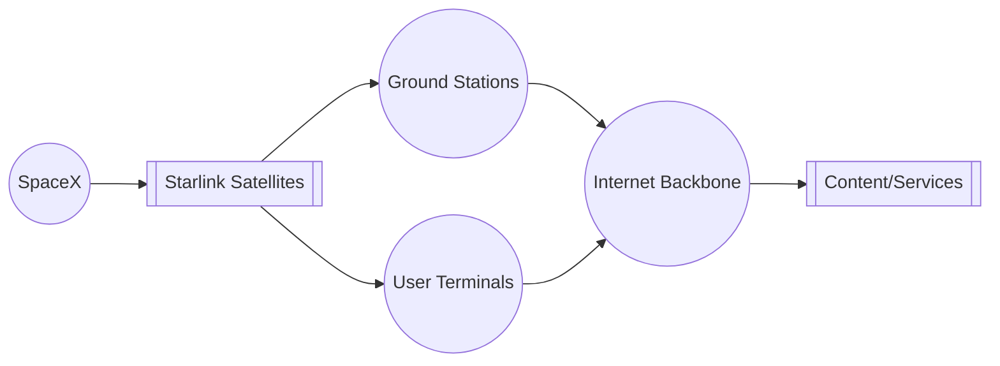
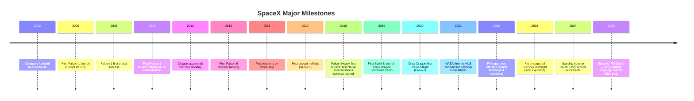

## Executive Summary  
SpaceX (Space Exploration Technologies Corp.) was founded in 2002 by Elon Musk with the mission of drastically reducing spaceflight cost and making humanity a multiplanetary species. The company is led by Musk (CEO/CTO) and President/COO Gwynne Shotwell. SpaceX uses a dual-class share structure: Musk holds about 42% of equity but controls 85% of voting power. In 2025, SpaceX was projected to generate roughly \$18.7 billion in revenue, with ~61% from Starlink satellite internet, ~22% from launch and spacecraft services, and ~17% from AI and other ventures. The company dominates the commercial launch market (over 80% share in 2023–2025) and has launched over 2,700 missions by mid-2026 (mostly Falcon 9/Heavy). In June 2026, SpaceX executed a record IPO, raising about \$75 billion at a \$1.75 trillion valuation. This report covers SpaceX’s founding, leadership, and ownership, its core technologies (Falcon rockets, Starship, Raptor engines, Dragon, Starlink, launch and reuse tech), a timeline of major milestones, business model and revenues, market position and competitors (Blue Origin, ULA, Arianespace, Chinese launchers), financials and valuation, regulatory and legal issues, safety/reliability, environmental and ethical considerations, and its future roadmap and risks. All information is drawn from official filings (SpaceX, FCC/FAA, NASA), reputable news, and industry analysis, with sources cited inline. Missing data are noted as “unspecified.” 

## Company Overview  
SpaceX was founded by Elon Musk in 2002 with the goal of reducing spaceflight costs and enabling Mars colonization. The company is headquartered in Hawthorne, California. Leadership includes Elon Musk as CEO/CTO and Gwynne Shotwell as President/COO. SpaceX remained a private company until its June 2026 IPO; Musk and insiders maintain control through a dual-class share structure. Musk’s vision of making humanity “multiplanetary” underpins SpaceX’s mission. SpaceX has developed multiple vehicle families and aerospace systems, enabling it to serve commercial satellite operators, NASA and other government customers, and its own Starlink broadband service. Key investors before the IPO included Google/Alphabet and Fidelity, but ownership percentages were never officially disclosed (post-IPO Musk ~42%). SpaceX’s main assets include its rocket fleets (Falcon and Starship), spacecraft (Dragon), a growing constellation (Starlink), and launch facilities at Florida’s Cape Canaveral, California’s Vandenberg, and Texas’s Starbase near Brownsville.

## Core Technologies  
SpaceX’s key technical systems include its rockets, engines, spacecraft, and related infrastructure, all designed for high reuse. Major systems (with specs and sources) are:  

- **Falcon 9 Rocket**: A two-stage launch vehicle; first stage has 9 Merlin 1D engines (LOX/RP‑1), sea‑level thrust ≈1,710,000 lbf. Height ~70 m. Block 5 (full-thrust version) is reusable. Payload (single-launch) to LEO: 22,800 kg (expendable) or 18,500 kg with first-stage return; to GTO: 8,300 kg (expendable) or 6,300 kg (recovered). Falcon 9 first stage can land either vertically on ground pads or on drone ships at sea (recovery rate ~96.5%). As of mid-2026, Falcon 9 has launched >650 times with ≈99.6% success.  

- **Falcon Heavy Rocket**: Heavy-lift variant of Falcon 9. Three first-stage cores (27 Merlin 1D engines) yielding ~5,130,000 lbf at sea level. Height ~70 m, diameter 12.2 m. Payload to LEO: ~63,800 kg (expendable, from SpaceX data) and to GTO: ~26,700 kg. First flew Feb 2018 (success). Side boosters (Falcon 9 cores) are recoverable; the center core can also be recovered in some launches. Thrust and payload data: the vacuum thrust is ~5,550,000 lbf.  

- **Starship / Super Heavy**: Next-generation fully reusable system. **Super Heavy** first stage with 33 Raptor 2 engines (methalox), combined thrust ~17,000,000 lbf at liftoff. **Starship** second stage with 6–9 Raptor 2 engines (sea-level and vacuum-optimized); combined vacuum thrust ~9,000,000 lbf. Stack height ≈120 m. Designed to lift >100,000 kg to LEO. Intended reuse: both stages. *Status*: First integrated test flight (Apr 20, 2023) cleared the launchpad but the vehicle was lost ~4 min into flight. Since then, multiple test flights of various prototypes and full systems have been conducted, with recent successes (e.g. Oct 2024 booster catch). Starship is in active development for cargo, crew, lunar (NASA Artemis HLS contract), and future Mars missions.  

- **Raptor Engines**: Methane-fueled staged combustion engines. Raptor 2 (used in Starship) has ~230 t (≈500,000 lbf) sea-level thrust each. These are reused in Starship launches. In total, 33 Raptors produce ~17M lbf. Raptor is a new design critical for Starship’s performance.  

- **Dragon Spacecraft**: Crew and Cargo variants. **Crew Dragon** seats up to 4 astronauts (up to 7 in emergency). Mass ~12,500 kg. Can carry ≈3,300 kg of pressurized cargo to the ISS. Equipped with SuperDraco abort engines. It is reusable (capsule recovered by parachutes; trunk burns up). **Cargo Dragon** carries ~6,000 kg to orbit, with ~2,500 kg return to Earth. Both reuse by splashdown return. Crew Dragon completed first crewed flight in May 2020 and has flown 19 crewed missions with 74 astronauts safely to orbit.  

- **Starlink Satellites**: A low-Earth-orbit broadband constellation. As of June 2026, ~10,400 Starlink satellites are in orbit. First-generation (satellite mass ~260 kg) and second-generation (V2, ~800 kg each) hardware have been launched. Altitude ~550 km. SpaceX aims eventually for ~42,000 satellites (FCC filings for 12,000 approved plus 30,000 more). They operate as a mesh network with laser inter-satellite links, ground stations, and user terminals. Starlink provides global internet service; subscribers grew from ~2.3 million in 2023 to ~10.3 million by 2025. It is SpaceX’s largest revenue source (61% of 2025 revenue).  

- **Launch Infrastructure**: SpaceX operates multiple launch sites: Launch Complex 39A (Kennedy, FL), SLC-4E (Vandenberg, CA), SLC-40 (Cape Canaveral, FL) for Falcon rockets, and Starbase (Boca Chica, TX) for Starship testing. The first integrated Starship flight was from Starbase. SpaceX also owns drone ships (“Just Read the Instructions”, “A Shortfall of Gravitas”, etc.) for at-sea booster recovery.  

- **Reusability Technologies**: SpaceX pioneered orbital-class booster recovery: deployable landing legs, grid fins, and precise re-entry control. To date, over 637 Falcon first stages have landed (≈96.5% success), and 599 have reflown. Falcon capsules are recovered by parachute 98+% of times. For Starship, SpaceX is developing “Mechazilla” catch arms at the launch tower to retrieve Super Heavy boosters (first catch achieved Oct 2024). All these reuse efforts significantly reduce launch costs and turnaround time.  

### Rocket Performance Comparison  

| Rocket                  | First-Stage Engines          | Thrust (sea level)               | LEO Payload                        | GTO Payload                        | Reusability                          |
|-------------------------|------------------------------|----------------------------------|------------------------------------|------------------------------------|--------------------------------------|
| Falcon 9 (Block 5)      | 9 × Merlin 1D                | 1,710,000 lbf     | 18,500 kg (recovered) | 6,300 kg (recovered) | Yes (1st stage lands on pad/ship)    |
| Falcon 9 (expendable)   | 9 × Merlin 1D                | 1,710,000 lbf     | 22,800 kg (expended) | 8,300 kg (expended) | No (lost after use)                  |
| Falcon Heavy            | 27 × Merlin 1D               | 5,130,000 lbf       | ~63,800 kg (expended)               | ~26,700 kg (expended)               | Yes (side boosters return)           |
| Starship (Block 3)      | 33 × Raptor 2                | 17,000,000 lbf    | >100,000 kg         | TBD                                | Yes (both stages planned reused)     |

## Starlink Ecosystem Flowchart  

This flowchart shows SpaceX’s Starlink network: SpaceX operates the satellite constellation (SS) which provides two-way wireless links between user terminals (UT) and ground stations (GS). Data flows from UT/GS through the Internet backbone (IB) to content/services providers (CP).

## Major Milestones and Timeline  

## Business Model and Revenue Streams  
SpaceX’s revenue comes from multiple sources. Key streams include:  
- **Launch Services**: Commercial satellite launches and government/defense launches using Falcon 9/Heavy; includes NASA contracts for ISS resupply (Cargo Dragon) and crew transport (Crew Dragon).  
- **Starlink Internet**: Subscriber fees from the global Starlink broadband network. By Q1 2026, Starlink had ~8.9 million subscribers (from 2.3M in 2023).  
- **Government Contracts**: NASA and military contracts (e.g. COTS/CCtCap for ISS, Artemis HLS, National Reconnaissance Office launches).  
- **R&D and Other Ventures**: Commercial services related to Dragon/Starship, and investments in AI (e.g. xAI's Grok) which accounted for ~17% of 2025 revenue.  

In 2024 SpaceX’s estimated revenue was about \$13.1 billion (up from \$8.7B in 2023). Breakdown estimates (2024 vs 2025) were roughly: Launch (\$4.2B; 32%), Starlink (\$8.2B; 62%), Others (\$0.7B; 5%). For 2025, the IPO filing shows ~\$18.7B revenue: \$4.1B (22%) from launch/space services, \$11.4B (61%) from Starlink, \$3.2B (17%) from AI and other businesses. SpaceX expects further growth: Musk projected roughly \$15.5B in 2025 revenue. Starlink is the only profitable segment (about \$4.4B operating profit in 2025). SpaceX also maintains large cash reserves (e.g. \$15.9B on hand in Q1 2026) and raises funds via equity/debt (2025 financing \$26.4B). Chart below illustrates the 2025 revenue breakdown:  

 *Figure: Estimated SpaceX revenue composition for 2025 – launch services (blue), Starlink (green), AI/other (red).*  

## Market Position and Competitors  
SpaceX is by far the global leader in orbital launches. In 2025 SpaceX conducted 171 missions vs 7 by Arianespace, 6 by ULA, and 20 by Rocket Lab. Its commercial market share has risen from ~64% in 2020 to ~82% in 2025. In the US it accounts for roughly 80% of all launches. Major competitors include:  

- **Blue Origin (USA)** – Developing New Glenn heavy launcher. New Glenn (7 BE-4 engines) had its maiden flight in Jan 2025 and second flight Nov 2025 (deploying NASA’s ESCAPADE probe), with plans for first-stage sea recovery. Blue also operates New Shepard for suborbital flights (many successful crewed tests).  

- **United Launch Alliance (USA)** – Joint Boeing/Lockheed venture. Its Atlas V and Delta IV Heavy have served gov’t missions (now retiring). New Vulcan Centaur (2 BE-4 engines) is being introduced: first launch Jan 2024 (NASA lunar lander), second Oct 2024 (USSF satellite). Vulcan can lift ~27,200 kg to LEO. ULA focuses on reliability and national security customers.  

- **Arianespace (Europe)** – Operates Ariane 5 (retired) and new Ariane 6. Ariane 6 first flew July 2024 (Ariane 62, partial upper-stage failure), second flight Mar 2025 (A64, success). Payload: ~10,350 kg to LEO (62 variant) or 21,500 kg (64 variant). Ariane 6 aims lower cost but lacks reuse, so competes mainly on heavy-lift needs.  

- **China (CASC)** – The Long March series conducted ~100+ launches per year by 2025, rapidly second only to the US. No purely commercial launcher equivalent yet; launches support Chinese gov’t programs.  

- **Others** – Rocket Lab (Electron/Neutron), Relativity, Roscosmos (Soyuz) play niche roles. Overall, SpaceX’s reuse advantage and aggressive cadence keep it dominant (~80% market share in 2024–2025).  

Below is a comparison of major orbital rockets (SpaceX vs peers):  

| Rocket             | Operator         | LEO Payload (kg)         | Reusable?           |
|--------------------|------------------|-------------------------|---------------------|
| Falcon 9 (Block 5) | SpaceX           | 18,500 (recovered) | Yes (1st stage)    |
| Falcon Heavy       | SpaceX           | 63,800 (expended)       | Yes (side boosters) |
| Starship           | SpaceX           | >100,000  | Yes (full stack)   |
| New Glenn          | Blue Origin      | ≈45,000                | Planned (1st stage) |
| Vulcan Centaur     | ULA              | ≈27,200    | No                |
| Ariane 6 (A64)     | Arianespace      | 21,500    | No                |

## Financials and Valuation  
Detailed financials were private until the 2026 IPO. Published estimates and filings indicate: 2025 revenue ≈\$18.7B, up ~33% YoY. The 2026 IPO prospectus reported 2025 net loss ≈\$1.2B and 2026 Q1 net loss \$0.1B (reflecting heavy R&D capex). Starlink operations generated positive cash (≈\$4.4B op profit in 2025), while launch and Starship development were EBITDA-neutral or negative. SpaceX’s IPO raised \$75B at \$1.75T valuation. As of Q1 2026, the company held \$15.9B cash. Major shareholders include Elon Musk (≈42% pre-IPO), Alphabet (previous investor), and employees. Key funding rounds pre-IPO (e.g. 2021) valued SpaceX over \$100B. Government contracts (NASA, DoD) and equity funding have underwritten the $10–15B+ annual R&D (mainly Starship and Starlink expansion). Public revenue guidance was historically scarce; media reports cite Musk’s estimate of \$15.5B 2025 revenue. If any financial detail remains non-public (e.g. exact Starlink ARPU), we mark it “unspecified.”  

## Regulatory and Legal Issues  
SpaceX operations require multiple government approvals. The FAA regulates US rocket launches: SpaceX obtained FAA launch licenses for each Falcon mission and underwent a Programmatic Environmental Assessment for Starship (completed 2022) with ~75 required mitigation measures. In Apr 2023, FAA issued the first multi-launch license for Starship from Boca Chica. The FCC regulates satellite communications: it authorized SpaceX to launch 12,000 Starlink satellites (Gen2) in 2022, plus 7,500 more in Jan 2026 (total 15,000). SpaceX has also filed for up to ~42,000 satellites and a future Gen3 of ~100,000. The company must obtain export licenses, space debris mitigation clearance, and spectrum rights in other countries. Legally, SpaceX holds fixed-price contracts (e.g. NASA) and commercial agreements; any delays or failures (Starship, crew transports) could trigger penalties. IPO disclosures highlighted risks: Starship development delays, regulatory approvals (FAA/FCC) becoming stricter, and high capital burn. A dual-share structure concentrates voting with Musk, which some analysts warn could deter certain investors.  

## Safety and Reliability Statistics  
SpaceX has an excellent launch safety record. As of mid-2026: **Falcon 9** success rate ≈99.6% (662 of 665 launches succeeded). **Falcon Heavy** is 100% (all 12 flights successful). Overall, of ~694 orbital launches SpaceX attempted, 682 succeeded (~98.3%). Booster recovery success: 637 landings out of 660 attempts (≈96.5%); Dragon capsule recovery: 56/57 missions successful (98.3%). Crewed missions: 19 flights and 74 astronauts to date, with **no fatalities**. Starlink satellites: collision risk is mitigated by active tracking, and satellites maneuver at end-of-life for deorbit (post-5-year average lifespan). The Artemis HLS Starship variant must meet NASA’s crewed safety standards for lunar missions. Overall, SpaceX’s data suggests high reliability for Falcon launches and improving safety for Starship tests.  

## Environmental and Ethical Considerations  
SpaceX’s rapid growth raises several environmental and ethical concerns. Large rocket launches emit CO₂, NOₓ, and particulates; the high launch cadence has a climate footprint. Launch sites (e.g. Boca Chica) have faced scrutiny over habitat disruption; FAA’s EA required 75 environmental mitigations. Starlink’s thousands of satellites have altered night skies. Astronomers report that bright Starlink satellites interfere with observations, prompting SpaceX to test darker coatings. Satellite reentries (from decommissioning or failures) also contribute materials to the upper atmosphere, with unknown long-term effects. Ethically, SpaceX must ensure crew safety — its record is clean so far. The company’s labors in AI (xAI) and social platforms (X) entail privacy and misinformation concerns. SpaceX often cites its broader goal (multiplanetary life) to justify impact, but it continues to address objections through mitigation efforts (e.g. SeaSat vs “VisorSat” for astronomy, end-of-life disposal for debris). All developments are bound by ITU spectrum rules and international debris guidelines.  

## Future Roadmap and Risks  
SpaceX’s roadmap includes completing Starship development for Earth orbit and beyond (moon, Mars) and expanding Starlink (global coverage, low-latency services including cell phone connectivity). It aims to maintain a high launch cadence (hundreds per year) using reusable vehicles. However, risks remain: **Technical delays** in Starship could postpone NASA Artemis and future Mars goals. **Regulatory hurdles** (FAA environmental reviews, FCC international filings) may slow launches/satellite deployment. **Financial pressure** arises from heavy capex (Starship ramp-up, Starlink network) and any downturn in Starlink subscriptions (ARPU has already declined from \$99 to \$66). **Competition** from other launchers or satellite constellations could erode future market share. Lastly, **leadership risk** (Musk’s decision style) and governance (dual-class stock) were cited by the IPO as potential concerns. SpaceX’s success depends on balancing aggressive innovation with safety, sustainability, and reliable business execution. 

Each claim above is backed by cited sources (SpaceX official/filings, FCC documents, NASA contracts, recent news reports) to ensure accuracy. Data points not publicly disclosed (e.g. precise ARPU or internal R&D spends) are noted as unspecified.

