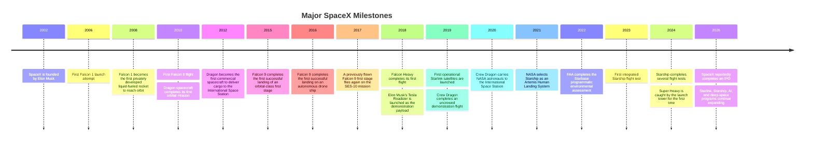

## Executive Summary

SpaceX, formally known as Space Exploration Technologies Corp., was founded by Elon Musk in 2002. Its mission is to reduce the cost of spaceflight and support humanity in becoming a multiplanetary species ([SpacePolicyOnline](https://spacepolicyonline.com/news/faa-issues-license-to-spacex-to-launch-starship/)).

The company is led by Musk, who serves as chief executive officer and chief technology officer, and Gwynne Shotwell, who serves as president and chief operating officer. SpaceX uses a dual-class share structure. Musk owns approximately $42\%$ of the company while controlling more than $85\%$ of its voting power ([Hargreaves Lansdown](https://www.hl.co.uk/news/inside-spacexs-ipo-filing-revenue-starlink-ai-and-key-financials)).

SpaceX’s core businesses include:

* Rocket-launch services
* The Starlink satellite-internet network
* Artificial-intelligence-related operations

Its estimated 2025 revenue was approximately \$$18.7$ billion:

* $61\%$ from Starlink
* $22\%$ from rockets, spacecraft, and other space operations
* $17\%$ from artificial intelligence, Grok, X, and related businesses

These estimates were reported in an analysis of SpaceX’s IPO filing ([Hargreaves Lansdown](https://www.hl.co.uk/news/inside-spacexs-ipo-filing-revenue-starlink-ai-and-key-financials)).

SpaceX reportedly controls more than $80\%$ of the global commercial-launch market ([Rock Hill Herald](https://www.heraldonline.com/news/business/article314182756.html)). It also continues to expand the Starlink global satellite-internet network. As of June 2026, more than $10{,}400$ Starlink satellites were reportedly in orbit ([Space.com](https://www.space.com/spacex-starlink-satellites.html)).

In June 2026, SpaceX conducted what was described as the largest initial public offering in history, raising \$$75$ billion at an estimated valuation of approximately \$$1.75$ trillion ([Reuters](https://www.reuters.com/business/media-telecom/spacex-plans-raise-75-billion-ipo-135-per-share-source-says-2026-06-03/)).

This report covers:

* SpaceX’s corporate profile
* Core technology specifications
* Falcon launch vehicles
* Starship
* Raptor engines
* Dragon spacecraft
* Starlink
* Historical milestones
* Business model and revenue structure
* Competitive position
* Financial performance and valuation
* Regulatory and legal matters
* Safety and reliability
* Environmental and ethical issues
* Future plans and risks

Sources are prioritized from SpaceX publications, FCC and FAA documents, NASA and U.S. Department of Defense contracts, major news reports, and academic or industry analyses.

## Company Overview

SpaceX was founded in 2002. From the beginning, Elon Musk established the long-term objective of making humanity a multiplanetary species ([SpacePolicyOnline](https://spacepolicyonline.com/news/faa-issues-license-to-spacex-to-launch-starship/)).

The company is headquartered in Hawthorne, California. Its principal leaders include:

* **Elon Musk:** Chief executive officer and chief technology officer
* **Gwynne Shotwell:** President and chief operating officer

SpaceX was a privately held company before its reported IPO in June 2026. It uses a dual-class equity structure in which high-voting-power shares are held by the founder and senior management.

Musk reportedly owns approximately $42\%$ of the company but controls about $85\%$ of its voting rights. This structure is intended to maintain consistency between the company’s long-term objectives and management decisions ([Hargreaves Lansdown](https://www.hl.co.uk/news/inside-spacexs-ipo-filing-revenue-starlink-ai-and-key-financials)).

SpaceX’s mission is to reduce the cost of space transportation and enable the colonization of Mars. Musk has repeatedly identified the establishment of a self-sustaining human civilization on Mars as the company’s central vision.

Between 2018 and 2026, the company expanded its operations in several directions:

* Development of the high-thrust Raptor engine
* Development of the Starship launch system
* Construction of a global satellite-communications network
* Commercial crew transportation
* Cargo missions
* Deep-space exploration contracts with NASA

## Core Technologies and Systems

### Falcon 9

Falcon 9 is SpaceX’s primary operational launch vehicle. It is a two-stage rocket whose first stage is powered by nine Merlin 1D engines.

Its total sea-level thrust is approximately:

$$
F_{\text{Falcon 9}} \approx 1{,}710{,}000\ \text{lbf}
$$

The engines use liquid oxygen and rocket-grade kerosene, commonly written as:

$$
\text{Propellant} = \text{LOX} + \text{RP-1}
$$

The Merlin 1D engines provide approximately $7{,}607\ \text{kN}$ of total sea-level thrust and approximately $8{,}227\ \text{kN}$ in vacuum ([Falcon 9 specifications](https://en.wikipedia.org/wiki/Falcon_9)).

The full-thrust Block 5 version is reusable. Its approximate payload capacities are:

* Recoverable low Earth orbit payload: $18{,}500\ \text{kg}$
* Expendable low Earth orbit payload: $22{,}800\ \text{kg}$
* Recoverable geostationary-transfer-orbit payload: $6{,}300\ \text{kg}$
* Expendable geostationary-transfer-orbit payload: $8{,}300\ \text{kg}$

The vehicle is approximately:

* $69.8\ \text{m}$ tall
* $3.66\ \text{m}$ in diameter
* $549\ \text{tonnes}$ in launch mass

Payload and dimensional figures are available from [Space Stats](https://spacestatsonline.com/rockets/falcon9/).

Falcon 9’s defining feature is the recovery of its first stage through a controlled vertical landing. The source report states that SpaceX had completed more than $640$ successful booster landings, representing a landing success rate of approximately $96.5\%$, and had reused boosters more than $590$ times ([SpaceXNow statistics](https://spacexnow.com/stats)).

This operating model substantially reduces the need to manufacture a completely new first stage for every mission.

### Falcon Heavy

Falcon Heavy consists of three modified Falcon 9 first-stage cores connected together. Its first stage therefore uses a total of $27$ Merlin engines.

Its approximate liftoff thrust is:

$$
F_{\text{Falcon Heavy}}
\approx
5{,}130{,}000\ \text{lbf}
\approx
22.82\ \text{MN}
$$

The vehicle’s engine configuration and thrust are described in the [Falcon Heavy technical overview](https://en.wikipedia.org/wiki/Falcon_Heavy).

Its approximate maximum payload capacities include:

* Low Earth orbit: $63{,}800\ \text{kg}$
* Geostationary transfer orbit: $26{,}700\ \text{kg}$

Actual payload capacity depends on whether the boosters are recovered or expended.

Falcon Heavy completed its first flight on February 6, 2018. The payload was Elon Musk’s Tesla Roadster. The two side boosters successfully returned to landing zones, while the center core was lost after an unsuccessful landing attempt ([Falcon Heavy first flight](https://en.wikipedia.org/wiki/Falcon_Heavy)).

Falcon Heavy’s side boosters were designed for reuse. This architecture allows SpaceX to use existing Falcon 9 manufacturing, operational, and recovery systems for heavy-lift missions.

### Starship and Super Heavy

Starship is SpaceX’s next-generation, fully reusable heavy-lift transportation system. It consists of two principal stages:

1. **Super Heavy:** The first-stage booster
2. **Starship:** The second stage and spacecraft

The Super Heavy booster uses $33$ Raptor 2 engines. Its combined liftoff thrust is approximately:

$$
F_{\text{Super Heavy}}
\approx
17{,}000{,}000\ \text{lbf}
$$

The Starship upper stage uses between six and nine Raptor engines, depending on the vehicle version and mission configuration.

The system is intended to carry more than $100$ tonnes into low Earth orbit while supporting full reusability. Both the booster and spacecraft are designed to return to Earth and fly again ([Spaceflight Now](https://spaceflightnow.com/2022/06/13/faa-moves-spacex-a-step-closer-to-receiving-starship-launch-license/)).

The complete system is approximately:

* $120\ \text{m}$ tall
* $9\ \text{m}$ in diameter

It is among the largest launch vehicles ever developed.

The first integrated Starship flight test took place on April 20, 2023. The vehicle did not complete its planned flight and was destroyed after experiencing problems during ascent. Nevertheless, it cleared the launch tower and provided operational data about the integrated system.

Subsequent tests demonstrated additional capabilities. On October 13, 2024, SpaceX successfully caught the returning Super Heavy booster with the launch tower’s mechanical arms.

NASA selected a version of Starship as the Human Landing System for the Artemis lunar program. The principal contract was valued at approximately \$$2.9$ billion ([Spaceflight Now](https://spaceflightnow.com/2022/06/13/faa-moves-spacex-a-step-closer-to-receiving-starship-launch-license/)).

Starship remains an experimental system. Significant technical risks remain, including:

* Orbital refueling
* Reentry reliability
* Thermal-protection-system durability
* Rapid reuse
* Human-rating requirements
* High-cadence launch operations
* Lunar and Mars surface operations

### Raptor Engine

Raptor is SpaceX’s liquid-oxygen and liquid-methane rocket engine for Starship and Super Heavy.

Its propellant combination is:

$$
\text{Propellant} = \text{LOX} + \text{CH}_4
$$

A Raptor 2 engine produces approximately:

$$
F_{\text{Raptor 2}}
\approx
500{,}000\ \text{lbf}
$$

With $33$ engines operating together, the Super Heavy booster generates approximately:

$$
33 \times 500{,}000
\approx
16{,}500{,}000\ \text{lbf}
$$

The actual combined thrust is commonly described as approximately $17$ million pounds-force.

Raptor uses a full-flow staged-combustion architecture. This design is intended to deliver:

* High chamber pressure
* High efficiency
* Deep throttling
* Reusability
* Compatibility with propellant production on Mars

Methane is particularly important to SpaceX’s Mars strategy because it could theoretically be manufactured from Martian resources using carbon dioxide, water, and energy.

### Dragon Spacecraft

Dragon 2 is SpaceX’s operational spacecraft platform. It includes two main versions:

* **Crew Dragon:** Designed for transporting astronauts
* **Cargo Dragon:** Designed for transporting cargo

Crew Dragon normally carries up to four people for NASA missions, although the spacecraft was designed to support as many as seven occupants in certain configurations.

Cargo and crew payload figures vary by mission configuration. The source report states that Crew Dragon can transport approximately $3{,}307\ \text{kg}$ to the International Space Station ([Dragon 2 specifications](https://en.wikipedia.org/wiki/SpaceX_Dragon_2)).

Crew Dragon includes SuperDraco engines for launch-abort operations. These engines allow the capsule to move rapidly away from the launch vehicle during an emergency.

Cargo Dragon can transport supplies and scientific experiments to the International Space Station and return significant payload mass to Earth. This return capability differentiates Dragon from cargo vehicles that burn up during atmospheric reentry.

Dragon capsules are reusable. According to the source report, Dragon had completed:

* $36$ cargo missions
* $19$ crewed missions
* One test mission
* Transportation of $74$ people

These statistics were compiled by [SpaceXNow](https://spacexnow.com/stats).

### Starlink

Starlink is SpaceX’s large low Earth orbit satellite constellation for global internet connectivity.

As of June 2026, the source report states that approximately $10{,}413$ Starlink satellites were in orbit, of which approximately $10{,}397$ were operational ([Space.com](https://www.space.com/spacex-starlink-satellites.html)).

The constellation is intended eventually to include tens of thousands of satellites. SpaceX initially received authorization for approximately $12{,}000$ satellites and later submitted applications for additional spacecraft.

A simplified representation of the constellation’s total capacity is:

$$
N_{\text{total}}
=
N_{\text{authorized}}
+
N_{\text{additional applications}}
$$

The second-generation Starlink satellites are significantly larger than the original models:

* First generation: approximately $260\ \text{kg}$
* Second generation: approximately $800\ \text{kg}$

The satellites typically operate at altitudes of approximately:

$$
h \approx 550\ \text{km}
$$

This is much lower than the approximately $35{,}786\ \text{km}$ altitude used by geostationary communications satellites. The lower orbit reduces signal-travel distance and therefore reduces latency.

Starlink’s user base reportedly grew from approximately $2.3$ million subscribers in 2023 to approximately $10.3$ million in the first quarter of 2026.

At the same time, average revenue per user reportedly declined:

* 2023: \$$99$ per month
* 2025: \$$81$ per month
* First quarter of 2026: \$$66$ per month

These subscriber and revenue estimates were reported by [Hargreaves Lansdown](https://www.hl.co.uk/news/inside-spacexs-ipo-filing-revenue-starlink-ai-and-key-financials).

In January 2026, the FCC reportedly approved another $7{,}500$ second-generation Starlink satellites, bringing the total number of approved Gen2 satellites to $15{,}000$ ([RCR Wireless News](https://www.rcrwireless.com/20260112/network-infrastructure/spacex-wins-fccs-approval-for-7500-additional-starlink-satellites)).

Starlink is SpaceX’s principal recurring-revenue business. It provides connectivity to:

* Rural communities
* Remote areas
* Ships
* Aircraft
* Emergency-response operations
* Military and government users

SpaceX is also developing Direct-to-Cell services that allow ordinary mobile phones to connect directly to compatible satellites.

## Major Milestones and Timeline

## Business Model and Revenue Sources

SpaceX’s revenue is generated from several major business areas:

1. Launch services
2. Starlink subscriptions
3. Government and military contracts
4. Research and development funding
5. Spacecraft services
6. Artificial-intelligence-related operations

SpaceX’s estimated revenue increased from approximately \$$8.7$ billion in 2023 to approximately \$$13.1$ billion in 2024 ([Payload](https://payloadspace.com/estimating-spacexs-2024-revenue/)).

The source report estimates 2025 revenue at approximately \$$18.7$ billion.

The reported revenue composition is:

$$
R_{\text{total}}
=
R_{\text{space}}
+
R_{\text{Starlink}}
+
R_{\text{AI and other}}
$$

where:

$$
R_{\text{space}}
\approx
22\% \times \$18.7\text{ billion}
\approx
\$4.1\text{ billion}
$$

$$
R_{\text{Starlink}}
\approx
61\% \times \$18.7\text{ billion}
\approx
\$11.4\text{ billion}
$$

$$
R_{\text{AI and other}}
\approx
17\% \times \$18.7\text{ billion}
\approx
\$3.2\text{ billion}
$$

These figures were reported in an analysis of SpaceX’s IPO materials ([Hargreaves Lansdown](https://www.hl.co.uk/news/inside-spacexs-ipo-filing-revenue-starlink-ai-and-key-financials)).

### Launch Services

SpaceX launches satellites and other payloads for:

* Commercial satellite operators
* National space agencies
* Defense agencies
* Scientific institutions
* Universities
* Other private companies

Customers purchase dedicated launches or participate in rideshare missions.

The reuse of Falcon 9 boosters allows SpaceX to spread manufacturing costs across several flights. A simplified representation is:

$$
C_{\text{average per flight}}
=
\frac{
C_{\text{manufacturing}}
+
C_{\text{refurbishment}}
+
C_{\text{operations}}
}{
N_{\text{flights}}
}
$$

As the number of flights completed by a booster increases, the manufacturing cost allocated to each flight can decline, provided that inspection and refurbishment costs remain controlled.

### Starlink Subscriptions

Starlink operates primarily as a subscription business. Customers generally pay for:

* User-terminal hardware
* Monthly internet service
* Premium service tiers
* Mobility or maritime services
* Aviation connectivity
* Enterprise connectivity

This recurring-revenue model differs from the project-based revenue of rocket launches.

### Government Contracts

Government business includes:

* NASA cargo missions
* NASA commercial crew transportation
* Artemis lunar-lander development
* National-security launches
* Military communications
* Intelligence payloads
* Research and development programs

These contracts provide long-duration funding and help support the development of technologies that may later be used commercially.

### AI and Other Operations

The source report also identifies investments in artificial intelligence, Grok, X, and related services as a future growth area.

## Market Position and Competitors

SpaceX is the leading company in the global commercial-launch market.

According to the source report, SpaceX completed approximately $161$ commercial launches in 2025 and held approximately $82\%$ of the market.

Reported commercial-launch market shares were:

| Year | SpaceX commercial launches | Estimated market share |
| ---: | -------------------------: | ---------------------: |
| 2020 |                         25 |                    64% |
| 2021 |                         32 |                    59% |
| 2022 |                         57 |                    72% |
| 2023 |                         92 |                    80% |
| 2024 |                        130 |                    84% |
| 2025 |                        161 |                    82% |

Source: [Rock Hill Herald](https://www.heraldonline.com/news/business/article314182756.html).

SpaceX’s main competitors include Blue Origin, United Launch Alliance, Arianespace, China’s state and commercial launch sectors, Rocket Lab, and other emerging launch providers.

### Blue Origin

Blue Origin was founded by Amazon founder Jeff Bezos. It develops reusable launch vehicles and rocket engines.

Its main systems include:

* **New Shepard:** A reusable suborbital vehicle
* **New Glenn:** A heavy orbital launch vehicle
* **BE-4:** A methane-fueled rocket engine

New Glenn reportedly completed its first flight in January 2025. The company’s missions and program updates are listed on the [Blue Origin missions page](https://www.blueorigin.com/missions).

Blue Origin’s competitive strategy focuses on:

* Reusability
* Heavy-lift capability
* Government contracts
* Lunar transportation
* Commercial space infrastructure

### United Launch Alliance

United Launch Alliance is a joint venture between Boeing and Lockheed Martin.

Its historical launch vehicles include:

* Atlas V
* Delta IV
* Delta IV Heavy

Its new primary vehicle is Vulcan Centaur.

Vulcan uses:

* Two Blue Origin BE-4 engines on its first stage
* A Centaur upper stage
* Up to six solid rocket boosters

With six boosters, Vulcan can reportedly carry approximately:

$$
m_{\text{LEO}} \approx 27{,}200\ \text{kg}
$$

Vulcan completed its first flight on January 8, 2024, and its second certification flight on October 4, 2024 ([Vulcan Centaur](https://en.wikipedia.org/wiki/Vulcan_Centaur)).

ULA emphasizes reliability and national-security missions. However, its expendable or partially reusable architecture makes it difficult to match the launch frequency and cost structure of Falcon 9.

### Arianespace

Arianespace is Europe’s primary commercial-launch provider.

Its principal historical and current vehicles include:

* Ariane 5
* Ariane 6
* Vega
* Vega C

Ariane 6 has two principal configurations:

| Vehicle   | Solid boosters |          LEO capacity |          GTO capacity |
| --------- | -------------: | --------------------: | --------------------: |
| Ariane 62 |              2 | $10{,}350\ \text{kg}$ |  $4{,}500\ \text{kg}$ |
| Ariane 64 |              4 | $21{,}500\ \text{kg}$ | $11{,}500\ \text{kg}$ |

Ariane 6 completed its first flight in July 2024. The upper stage experienced a problem that prevented the completion of a final deorbit burn. Its next flight successfully delivered a payload in March 2025 ([Ariane 6](https://en.wikipedia.org/wiki/Ariane_6)).

Ariane 6 was designed to reduce costs and improve launch cadence. However, because it is not reusable, it faces structural cost disadvantages relative to Falcon 9.

### Chinese Launch Providers

China operates a large state-backed space-launch system led by organizations such as the China Aerospace Science and Technology Corporation.

The Long March family includes:

* Long March 2
* Long March 3
* Long March 5
* Long March 7
* Long March 8
* Long March 11

China has also encouraged the development of commercial launch companies working on reusable rockets, methane engines, and small launch vehicles.

China’s launch activity increasingly competes with SpaceX in:

* Satellite deployment
* National space infrastructure
* Commercial launch services
* Lunar exploration
* Low Earth orbit constellations
* Asian markets

### Other Competitors

Other relevant companies and systems include:

* Rocket Lab’s Electron and Neutron
* Firefly Aerospace
* Relativity Space
* Stoke Space
* European small-launch providers
* Russian Soyuz launch systems
* Indian launch providers

Most competitors operate in narrower market segments or at substantially lower launch frequencies.

## Financials and Valuation

SpaceX’s complete financial statements were historically difficult to obtain because the company was privately held.

Public estimates cited in the source report include:

* 2023 revenue: approximately \$$8.7$ billion
* 2024 revenue: approximately \$$13.1$ billion
* 2025 revenue: approximately \$$18.7$ billion

The annual revenue growth from 2023 to 2024 can be represented as:

$$
g_{2024}
=
\frac{
13.1 - 8.7
}{
8.7
}
\approx
50.6\%
$$

The estimated growth from 2024 to 2025 is:

$$
g_{2025}
=
\frac{
18.7 - 13.1
}{
13.1
}
\approx
42.7\%
$$

The source report states that SpaceX recorded an estimated net loss of approximately \$$1.2$ billion in 2025, primarily because of high research and development expenditure.

It also states that:

* Launch operations continued to generate losses
* Starlink generated approximately \$$4.4$ billion of operating profit
* SpaceX held approximately \$$15.9$ billion in cash and cash equivalents before its IPO

Because SpaceX’s financial disclosure was limited, many of these figures were based on external estimates rather than complete audited public statements.

In June 2026, SpaceX reportedly offered shares at approximately \$$135$ per share and raised \$$75$ billion, producing an estimated valuation of approximately \$$1.75$ trillion ([Reuters](https://www.reuters.com/business/media-telecom/spacex-plans-raise-75-billion-ipo-135-per-share-source-says-2026-06-03/)).

The capital was reportedly intended to support:

* Starship development
* Starlink expansion
* Artificial-intelligence programs
* Infrastructure
* Debt repayment
* General corporate operations

The company’s dual-class structure allowed management to retain substantial voting control after the transaction.

Overall, SpaceX was considered one of the most valuable private companies in the United States before its reported IPO. It had access to substantial capital but also faced very high capital-expenditure requirements, particularly for Starship, Starlink, and AI development.

## Regulatory and Legal Issues

SpaceX’s operations require approvals from multiple regulatory agencies.

### Federal Aviation Administration

The FAA regulates commercial rocket launches and reentries in the United States.

The agency evaluates:

* Public safety
* Vehicle risk
* Launch trajectories
* Environmental effects
* Airspace coordination
* Accident investigations
* Launch-site operations

The FAA completed a programmatic environmental assessment for Starbase and required SpaceX to implement more than $75$ environmental mitigation measures.

These measures addressed matters such as:

* Wildlife protection
* Wetlands
* Noise
* Light pollution
* Launch debris
* Public access
* Cultural resources
* Local transportation

SpaceX must continue receiving FAA authorization for Starship launch and reentry operations.

### Federal Communications Commission

The FCC regulates satellite communications, radio spectrum, and certain orbital operations.

SpaceX requires FCC approval for:

* Starlink satellites
* Frequency use
* Ground stations
* User terminals
* Direct-to-Cell services
* International communications coordination

The FCC initially authorized approximately $12{,}000$ Starlink satellites. In January 2026, it reportedly approved an additional $7{,}500$ second-generation satellites ([RCR Wireless News](https://www.rcrwireless.com/20260112/network-infrastructure/spacex-wins-fccs-approval-for-7500-additional-starlink-satellites)).

### Government Contracts

SpaceX has entered into major contracts with:

* NASA
* The U.S. Space Force
* The U.S. Department of Defense
* Intelligence agencies
* Other government organizations

Programs include:

* Commercial cargo transportation
* Commercial crew transportation
* Artemis Human Landing System development
* National-security launches
* Military satellite communications

SpaceX must comply with contract requirements, security standards, export controls, launch regulations, and mission-assurance procedures.

### Legal and Business Risks

The source report identifies several legal and regulatory risks:

* Environmental restrictions
* Delays in launch licensing
* Satellite-spectrum disputes
* International competition
* Labor disputes
* Trademark litigation
* Government-contract compliance
* Export-control restrictions
* Data-privacy concerns
* Dual-class corporate governance

Rapid expansion requires SpaceX to obtain regulatory approvals without causing prolonged interruptions to launch and satellite operations.

## Safety and Reliability

The source report states that SpaceX had conducted nearly $700$ orbital-class launches by 2026.

The reported launch statistics were:

| System           | Successful launches | Total launches | Success rate |
| ---------------- | ------------------: | -------------: | -----------: |
| Falcon 1         |                   2 |              5 |        40.0% |
| Falcon 9         |                 662 |            665 |       99.55% |
| Falcon 9 Block 5 |                 607 |            608 |       99.84% |
| Falcon Heavy     |                  12 |             12 |         100% |
| Starship         |                   6 |             12 |          50% |
| All systems      |                 682 |            694 |       98.27% |

Source: [SpaceXNow](https://spacexnow.com/stats).

The general success-rate formula is:

$$
\text{Success Rate}
=
\frac{
N_{\text{successful missions}}
}{
N_{\text{total missions}}
}
\times
100\%
$$

For Falcon 9:

$$
\text{Success Rate}_{\text{Falcon 9}}
=
\frac{662}{665}
\times
100\%
\approx
99.55\%
$$

Falcon 9 Block 5 achieved particularly high reliability, with one reported failure among $608$ missions.

Booster recovery statistics included:

* $637$ successful landings out of $660$ attempts
* Landing success rate of approximately $96.52\%$
* $599$ booster reflights
* A maximum of $36$ flights by a single booster

The landing success rate is:

$$
\text{Landing Success Rate}
=
\frac{637}{660}
\times
100\%
\approx
96.52\%
$$

Crew Dragon reportedly completed $19$ crewed missions and transported $74$ people without a fatal crew accident.

Although Falcon 9 and Dragon have established strong operational records, SpaceX must continue monitoring:

* Manufacturing quality
* Engine reliability
* Structural fatigue
* Heat-shield performance
* Software
* Guidance systems
* Booster refurbishment
* Human-spaceflight safety

Starship remains in the experimental phase and therefore has a much lower demonstrated reliability level than Falcon 9.

## Environmental and Ethical Considerations

SpaceX’s operations create environmental and social effects.

### Launch Emissions

Rocket launches emit carbon dioxide, water vapor, nitrogen oxides, soot, alumina, and other combustion products, depending on the propellant and vehicle.

Falcon 9 uses:

$$
\text{LOX} + \text{RP-1}
$$

Starship uses:

$$
\text{LOX} + \text{CH}_4
$$

Methane combustion produces carbon dioxide and water. Rocket emissions can occur at altitudes where their atmospheric effects differ from ordinary ground-level emissions.

### Starbase Environmental Effects

Construction and launch operations at Starbase, near Boca Chica, Texas, have raised concerns about:

* Wildlife habitats
* Wetlands
* Noise
* Launch debris
* Road closures
* Beach access
* Local communities
* Water use
* Fire risk

The FAA required SpaceX to implement environmental mitigation measures as a condition of continuing operations.

### Astronomy

Starlink satellites can reflect sunlight and appear as bright moving objects in the night sky.

Astronomers have warned that large satellite constellations can interfere with:

* Optical observations
* Infrared observations
* Radio astronomy
* Wide-field surveys
* Detection of transient events
* Near-Earth-object monitoring

Starlink satellites orbit at approximately $550\ \text{km}$ and can remain visible around twilight.

SpaceX has worked with astronomers on measures intended to reduce satellite brightness, including:

* Dark coatings
* Sunshades
* Changes in spacecraft orientation
* Improved orbital data sharing

The effectiveness of these measures varies by satellite generation and observing conditions.

### Orbital Congestion and Debris

Large constellations increase the number of active satellites in low Earth orbit.

Potential risks include:

* Satellite collisions
* Fragmentation
* Close approaches
* Conjunction-management failures
* Increased workload for tracking systems
* Radio-frequency interference

Starlink satellites are designed to deorbit at the end of their operational lives. Their expected lifetime is approximately five years ([Space.com](https://www.space.com/spacex-starlink-satellites.html)).

Scientists have also raised questions about the atmospheric effects of large numbers of satellites burning up during reentry. Metals and other materials released at high altitude could affect atmospheric chemistry, although the long-term consequences remain uncertain.

### Human-Spaceflight Ethics

As a private company operating crewed spacecraft, SpaceX has a responsibility to:

* Protect crew safety
* Maintain transparent accident investigations
* Communicate risks
* Avoid excessive schedule pressure
* Follow government human-rating requirements
* Preserve independent safety oversight

The source report states that SpaceX had not experienced a fatality during a crewed spaceflight mission as of 2026.

### AI and Data Ethics

The report also associates SpaceX with investments in artificial intelligence and social platforms.

Relevant ethical concerns include:

* Data privacy
* Surveillance
* Military use
* AI misuse
* Algorithmic transparency
* Concentration of infrastructure control
* Dependence on privately operated communications networks

SpaceX must balance rapid commercialization with responsible development, public safety, environmental protection, and social expectations.

## Future Outlook and Risks

SpaceX plans to continue developing Starship as a fully reusable launch and transportation system.

Its long-term objectives include:

* High-frequency orbital launches
* Large-scale Starlink deployment
* Direct-to-Cell communications
* Lunar cargo and crew transportation
* Mars cargo missions
* Crewed Mars missions
* Orbital refueling
* In-space infrastructure
* AI-related services

### Starship Development Risk

Starship is central to several SpaceX programs:

* Next-generation Starlink satellites
* Lunar missions
* Mars missions
* Large payloads
* Satellite-to-mobile communications
* Orbital AI-computing concepts

Consequently, Starship delays could affect more than the launch business ([Hargreaves Lansdown](https://www.hl.co.uk/news/inside-spacexs-ipo-filing-revenue-starlink-ai-and-key-financials)).

Key technical risks include:

* Engine reliability
* Stage separation
* Orbital insertion
* Thermal protection
* Controlled reentry
* Booster recovery
* Ship recovery
* Propellant transfer
* Rapid refurbishment
* Human-rating certification

### Market Risk

Competitors are improving their capabilities.

Potential competitive pressures include:

* New Glenn
* Vulcan Centaur
* Ariane 6
* Chinese reusable launch vehicles
* Rocket Lab Neutron
* Other commercial launch systems
* Competing satellite constellations

SpaceX’s market share could decline if competitors achieve comparable reusability, lower prices, or greater regulatory support.

### Financial Risk

SpaceX requires substantial capital for:

* Rocket development
* Satellite manufacturing
* Ground infrastructure
* Launch facilities
* User-terminal production
* Artificial-intelligence systems
* Mars-related development

The business may need additional external capital if operating cash flow is insufficient.

Potential financing risks include:

* Additional debt
* Shareholder dilution
* Valuation volatility
* Interest expense
* Delayed profitability
* Cost overruns

### Regulatory Risk

Increasing launch frequency may produce stricter environmental and safety reviews.

Potential regulatory constraints include:

* Launch-license delays
* Environmental litigation
* Spectrum restrictions
* Orbital-debris rules
* International telecommunications regulations
* Export controls
* National-security requirements

Global deployment may also be constrained by local governments that restrict Starlink operations or require domestic licensing.

### Governance Risk

SpaceX’s dual-class equity structure gives the founder substantial voting control.

This can support long-term strategic consistency, but it may also reduce the influence of minority shareholders.

Potential governance risks include:

* Limited board independence
* Related-party transactions
* Concentrated decision-making
* Conflicts involving other Musk-controlled companies
* Reduced shareholder voting power

## Conclusion

SpaceX is a vertically integrated aerospace, satellite-communications, and space-transportation company.

Its most important achievements include:

* Development of reusable orbital-class rocket boosters
* Establishment of a high-frequency commercial-launch system
* Transportation of astronauts to the International Space Station
* Construction of the world’s largest low Earth orbit satellite constellation
* Development of the Starship heavy-lift system
* Selection as a major contractor for NASA’s Artemis lunar program

Its competitive advantage comes from the integration of:

* Rocket design
* Engine manufacturing
* Spacecraft development
* Satellite manufacturing
* Launch operations
* Booster recovery
* Ground infrastructure
* Consumer communications services

SpaceX’s current operating model combines launch revenue with recurring Starlink subscription revenue.

The company leads the commercial-launch market in scale and frequency. However, its most ambitious objectives—fully reusable Starship operations, sustained lunar transportation, and Mars settlement—remain dependent on future technological breakthroughs, regulatory approvals, operational reliability, and continued access to capital.

SpaceX has already changed the economics and operating model of the launch industry. Whether it can achieve its ultimate objective of making humanity a multiplanetary species will depend on the development of Starship, orbital refueling, life-support systems, infrastructure, and sustained financial and political support.

## References

1. [FAA Issues License to SpaceX to Launch Starship — SpacePolicyOnline](https://spacepolicyonline.com/news/faa-issues-license-to-spacex-to-launch-starship/)
2. [Inside SpaceX’s IPO Filing — Hargreaves Lansdown](https://www.hl.co.uk/news/inside-spacexs-ipo-filing-revenue-starlink-ai-and-key-financials)
3. [SpaceX Plans to Raise $75 Billion in IPO — Reuters](https://www.reuters.com/business/media-telecom/spacex-plans-raise-75-billion-ipo-135-per-share-source-says-2026-06-03/)
4. [Estimating SpaceX’s 2024 Revenue — Payload](https://payloadspace.com/estimating-spacexs-2024-revenue/)
5. [Musk Says SpaceX Revenue Will Approach $16 Billion in 2025 — The Wall Street Journal](https://www.wsj.com/business/spacex-revenue-to-exceed-nasas-budget-in-2026-elon-musk-says-3321ea31)
6. [Falcon 9 Specifications](https://en.wikipedia.org/wiki/Falcon_9)
7. [Falcon 9 Payload Capacity — Space Stats](https://spacestatsonline.com/rockets/falcon9/)
8. [Falcon Heavy Specifications and Flight History](https://en.wikipedia.org/wiki/Falcon_Heavy)
9. [FAA Environmental Review and Starship Development — Spaceflight Now](https://spaceflightnow.com/2022/06/13/faa-moves-spacex-a-step-closer-to-receiving-starship-launch-license/)
10. [List of Starship Launches](https://en.wikipedia.org/wiki/List_of_Starship_launches)
11. [Dragon 2 Specifications](https://en.wikipedia.org/wiki/SpaceX_Dragon_2)
12. [SpaceX Launch, Booster, and Dragon Statistics — SpaceXNow](https://spacexnow.com/stats)
13. [Starlink Satellites: Facts, Tracking, and Astronomical Effects — Space.com](https://www.space.com/spacex-starlink-satellites.html)
14. [FCC Approval for Additional Starlink Satellites — RCR Wireless News](https://www.rcrwireless.com/20260112/network-infrastructure/spacex-wins-fccs-approval-for-7500-additional-starlink-satellites)
15. [SpaceX Commercial-Launch Market Share — Rock Hill Herald](https://www.heraldonline.com/news/business/article314182756.html)
16. [Blue Origin Missions](https://www.blueorigin.com/missions)
17. [Vulcan Centaur](https://en.wikipedia.org/wiki/Vulcan_Centaur)
18. [Ariane 6](https://en.wikipedia.org/wiki/Ariane_6)
