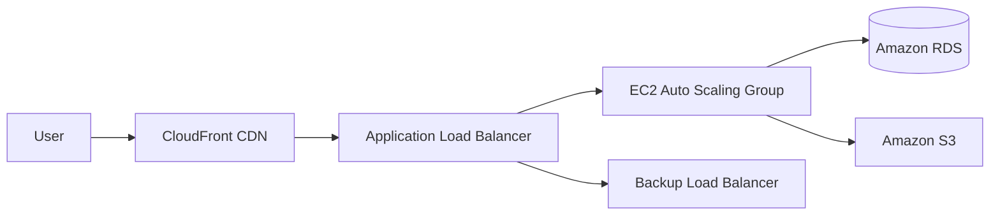

## Executive Summary

Since its commercial launch in 2006, Amazon Web Services (AWS) has remained one of the world's leading cloud providers. AWS offers more than 200 on-demand cloud services, including **compute**, **storage**, **databases**, **analytics**, **networking**, **developer tools**, **security**, **machine learning and artificial intelligence**, and **Internet of Things services**. Customers pay according to usage and can rapidly scale resources as demand changes ([AWS Overview](https://docs.aws.amazon.com/whitepapers/latest/aws-overview/introduction.html)).

AWS supports hundreds of thousands of organizations across more than 190 countries, including companies such as Netflix and Expedia. Its mature service portfolio and global infrastructure provide a highly reliable, scalable, and cost-effective platform ([AWS Overview](https://docs.aws.amazon.com/whitepapers/latest/aws-overview/introduction.html); [BMC: AWS vs. Azure vs. GCP](https://www.bmc.com/blogs/aws-vs-azure-vs-google-cloud-platforms/)).

This guide covers AWS core services and use cases, architectural patterns, pricing and cost optimization, security and compliance, migration strategies and tools, operational best practices, performance and scalability, quotas and troubleshooting, learning and certification resources, and a comparison with Microsoft Azure and Google Cloud Platform.

## Core AWS Services

### Compute

AWS provides several compute models.

Traditionally, **Amazon Elastic Compute Cloud (EC2)** serves as the foundation. It provides secure, resizable virtual servers that can be provisioned quickly. **EC2 Auto Scaling** can automatically add or remove instances according to workload demand ([AWS Compute Services](https://docs.aws.amazon.com/whitepapers/latest/aws-overview/compute-services.html)).

For serverless computing, **AWS Lambda** runs code without requiring users to manage servers. It automatically scales and charges according to actual usage ([AWS Lambda documentation](https://docs.aws.amazon.com/lambda/latest/dg/welcome.html)).

Container services include:

* **Amazon Elastic Container Service (ECS)** for managed container orchestration.
* **Amazon Elastic Kubernetes Service (EKS)** for managed Kubernetes.
* **AWS Fargate** for running containers without managing the underlying compute infrastructure.

These services allow developers to focus on containerized applications rather than infrastructure management ([Amazon ECS documentation](https://docs.aws.amazon.com/AmazonECS/latest/developerguide/Welcome.html); [AWS Fargate introduction](https://aws.amazon.com/fargate/)).

Typical use cases include microservices, batch processing, web applications, API backends, and event-driven workloads.

### Storage

**Amazon Simple Storage Service (S3)** is an object-storage service designed for scalability, availability, security, durability, and performance. It can support data lakes, website assets, mobile application data, backups, archives, enterprise applications, IoT data, and analytics workloads ([Amazon S3 documentation](https://docs.aws.amazon.com/AmazonS3/latest/userguide/Welcome.html)).

AWS also offers block, file, and archival storage:

| Storage category  | Example services                    | Typical use cases                                                        |
| ----------------- | ----------------------------------- | ------------------------------------------------------------------------ |
| Object storage    | Amazon S3                           | Static websites, backup and recovery, media files, and data lakes        |
| Block storage     | Amazon EBS (`gp3`, `io2`)           | EC2 system disks, application data disks, and high-performance databases |
| File storage      | Amazon EFS                          | Shared files across multiple EC2 instances and containers                |
| Long-term archive | S3 Glacier, S3 Glacier Deep Archive | Regulatory archives and large datasets that are rarely accessed          |

**Amazon Elastic Block Store (EBS)** provides persistent block storage for EC2. **Amazon Elastic File System (EFS)** provides managed shared file storage. **S3 Glacier** storage classes provide low-cost long-term archival storage.

### Databases and Caching

For relational databases, **Amazon Relational Database Service (RDS)** provides managed database engines such as MySQL, PostgreSQL, Oracle Database, and Microsoft SQL Server. It supports automated provisioning, configuration, backup, patching, scaling, and Multi-AZ deployment ([Amazon RDS](https://aws.amazon.com/rds/)).

For high-performance distributed NoSQL workloads, **Amazon DynamoDB** is a serverless, fully managed key-value and document database designed to deliver consistent single-digit-millisecond performance at any scale ([Amazon DynamoDB documentation](https://docs.aws.amazon.com/amazondynamodb/latest/developerguide/Introduction.html)).

Other important services include:

* **Amazon Aurora**, a high-performance relational database compatible with MySQL and PostgreSQL.
* **Amazon ElastiCache**, which provides managed Redis- and Memcached-compatible in-memory caching.

These services are commonly used for transaction systems, game data, session storage, IoT platforms, web applications, and large-scale event processing.

### Networking and Content Delivery

**Amazon Virtual Private Cloud (VPC)** allows customers to launch AWS resources inside a logically isolated virtual network that resembles a traditional data-center network ([Amazon VPC documentation](https://docs.aws.amazon.com/vpc/latest/userguide/what-is-amazon-vpc.html)).

Important networking services include:

* **Elastic Load Balancing**, which distributes traffic across multiple resources.
* **Amazon Route 53**, a highly available and scalable DNS service supporting domain registration, DNS routing, and health checks ([Amazon Route 53 documentation](https://docs.aws.amazon.com/Route53/latest/DeveloperGuide/Welcome.html)).
* **Amazon CloudFront**, a content delivery network that caches content at global edge locations to reduce latency.
* **AWS Direct Connect**, which provides dedicated connectivity between on-premises environments and AWS.
* **AWS Global Accelerator**, which improves global application availability and performance.

Common use cases include hybrid-cloud connectivity, cross-Region networking, game distribution, global web application acceleration, private application networks, and low-latency content delivery.

### Identity and Access Management

**AWS Identity and Access Management (IAM)** provides centralized control over how users, workloads, and services access AWS resources. It supports users, groups, roles, policies, multi-factor authentication, temporary credentials, and conditional access.

Related security services include:

* **AWS Key Management Service (KMS)** for encryption-key management.
* **AWS Web Application Firewall (WAF)** for filtering web traffic.
* **AWS Shield** for distributed-denial-of-service protection.
* **AWS Secrets Manager** for storing and rotating secrets.
* **Amazon GuardDuty** for threat detection.
* **AWS Security Hub** for centralized security posture management.

These services support encryption, identity governance, threat detection, and access control.

### Analytics and Machine Learning

AWS provides data and analytics services such as:

* **Amazon Redshift** for cloud data warehousing.
* **Amazon Athena** for serverless SQL queries over data in S3.
* **Amazon EMR** for Hadoop- and Spark-based big-data processing.
* **Amazon Kinesis** for real-time data streaming.
* **AWS Glue** for data integration, cataloging, and extract-transform-load workflows.

Machine-learning and artificial-intelligence services include:

* **Amazon SageMaker** for building, training, and deploying machine-learning models.
* **Amazon Rekognition** for image and video analysis.
* **Amazon Comprehend** for natural-language processing.
* **Amazon Translate** for machine translation.
* **Amazon Lex** for conversational interfaces.

These services support applications involving speech, images, natural language, recommendation systems, data analysis, and large-scale model development.

### Development and Deployment Tools

AWS development and deployment tools include:

* **AWS CodeCommit**, **CodeBuild**, **CodePipeline**, and **CodeDeploy** for continuous integration and continuous delivery.
* **AWS CloudFormation** and the **AWS Cloud Development Kit (CDK)** for infrastructure as code.
* **Amazon CloudWatch** for metrics, logs, dashboards, and alarms.
* **AWS X-Ray** for distributed tracing.

Together, these services support automated testing, repeatable infrastructure deployment, environment consistency, version-controlled infrastructure, and continuous delivery.

## Architecture Patterns and Reference Architectures

AWS supports many cloud-architecture patterns.

Common designs include:

1. **Multi-tier web applications**
   CloudFront and a load balancer form the front layer, EC2 Auto Scaling groups provide the application layer, and RDS or DynamoDB provides the data layer.

2. **Microservices and serverless systems**
   Lambda, Amazon Simple Notification Service (SNS), Amazon Simple Queue Service (SQS), and Amazon EventBridge enable event-driven and loosely coupled services.

3. **Data-processing pipelines**
   Kinesis, AWS Glue, S3, Athena, EMR, and Redshift can form ingestion, transformation, storage, and analytics pipelines.

4. **Hybrid-cloud architectures**
   On-premises systems connect to AWS through Direct Connect or virtual private networks.

The following diagram illustrates a typical multi-tier web architecture. User traffic passes through CloudFront and an Application Load Balancer, reaches an EC2 Auto Scaling group, and then accesses RDS and S3.

AWS reference architectures also cover e-commerce, mobile games, over-the-top video streaming, data warehousing, large-scale analytics, service meshes, event routing, global applications, security boundaries, observability, and disaster recovery.

## Pricing Models and Cost Optimization

AWS generally follows a pay-as-you-go model with no required upfront infrastructure purchase. Different pricing options balance cost savings against flexibility.

### On-Demand

On-Demand pricing charges for resources as they are consumed without a long-term commitment. It is suitable for short-term, experimental, variable, or unpredictable workloads.

### Reserved Instances and Savings Plans

Reserved Instances and Savings Plans offer discounts in exchange for a one-year or three-year usage commitment. They can reduce costs substantially and are most appropriate for stable, continuously running workloads.

### Spot Instances

EC2 Spot Instances use spare AWS compute capacity and can provide discounts of up to 90% for interruption-tolerant workloads such as batch processing, distributed computing, rendering, simulation, and temporary environments ([AWS Compute Services](https://docs.aws.amazon.com/whitepapers/latest/aws-overview/compute-services.html)).

### Free Tier

New customers and selected services may receive limited free usage for a defined period or within service-specific usage limits.

### Illustrative EC2 Cost Calculation

For example, if an EC2 `t3.medium` instance costs approximately USD 0.0416 per hour and runs for 720 hours:

$$
0.0416 \times 720 \approx 29.95
$$

The approximate monthly compute cost is therefore USD 30.

If a one-year commitment reduces the effective hourly price to approximately USD 0.025:

$$
0.025 \times 720 = 18
$$

The approximate monthly compute cost becomes USD 18.

These figures are illustrative only. Actual prices depend on Region, operating system, tenancy, purchase model, data transfer, attached storage, and other configuration choices.

Organizations can use the [AWS Pricing Calculator](https://calculator.aws/) and [AWS Cost Explorer](https://aws.amazon.com/aws-cost-management/aws-cost-explorer/) to model alternatives. [AWS Budgets](https://aws.amazon.com/aws-cost-management/aws-budgets/) can generate alerts when spending or usage reaches defined thresholds.

Cost-optimization practices include:

* Shutting down idle resources.
* Rightsizing overprovisioned instances.
* Using Auto Scaling to match capacity to demand.
* Reviewing Savings Plans and Reserved Instance coverage.
* Using suitable S3 storage classes, such as S3 Standard-Infrequent Access and S3 Glacier.
* Monitoring data-transfer charges.
* Tagging resources consistently.
* Deleting unused snapshots, disks, IP addresses, load balancers, and databases.
* Using managed and serverless services when their operational savings justify their unit price.

The [AWS Well-Architected Cost Optimization Pillar](https://docs.aws.amazon.com/wellarchitected/latest/cost-optimization-pillar/welcome.html) provides guidance for designing, delivering, and maintaining systems that achieve business outcomes at the lowest appropriate cost.

The following table compares illustrative monthly costs:

| Use case                      |       On-Demand cost |              One-year commitment |                       Spot cost |
| ----------------------------- | -------------------: | -------------------------------: | ------------------------------: |
| EC2 `t3.medium`, 720 hours    | Approximately USD 30 | Approximately USD 18, saving 40% | Approximately USD 7, saving 77% |
| RDS `db.t3.medium`, 720 hours | Approximately USD 70 | Approximately USD 40, saving 43% |                  Not applicable |

## Security and Compliance

AWS uses a **shared responsibility model**.

AWS is responsible for **security of the cloud**, including the physical facilities, hardware, networking, host operating systems, and virtualization layer. Customers are responsible for **security in the cloud**, including guest operating systems, application configuration, identity permissions, data classification, encryption choices, and network controls ([AWS Shared Responsibility Model](https://docs.aws.amazon.com/wellarchitected/latest/security-pillar/shared-responsibility.html)).

For infrastructure-as-a-service products such as EC2, customers manage the guest operating system, patches, installed software, and security-group configuration. For more abstract managed services such as S3 and DynamoDB, AWS manages more of the underlying platform, while customers remain responsible for their data, encryption choices, and IAM permissions.

Recommended practices include:

* Apply the principle of least privilege.
* Enable multi-factor authentication.
* Avoid routine use of the root account.
* Prefer temporary role credentials over long-lived access keys.
* Encrypt sensitive data at rest and in transit.
* Use AWS KMS to manage encryption keys.
* Enable **AWS CloudTrail** to record API activity.
* Use **AWS Config**, **Amazon GuardDuty**, and **AWS Security Hub** for continuous monitoring.
* Centralize logs and retain them according to compliance requirements.
* Establish incident-response procedures, alarms, runbooks, and escalation paths.
* Use CloudWatch Logs and X-Ray to investigate operational and security incidents.
* Regularly review public access, security groups, network access-control lists, and resource policies.

AWS supports many compliance programs and certifications, including ISO, SOC, PCI DSS, HIPAA-related workloads, and GDPR-related controls. The detailed allocation of responsibilities depends on the services used, the workload design, and the applicable legal and regulatory requirements.

## Migration Strategies and Tools

AWS supports several migration strategies:

* **Rehost**, also known as lift-and-shift.
* **Replatform**, which makes limited platform changes without fully redesigning the application.
* **Refactor or rearchitect**, which redesigns the application to use cloud-native capabilities.

A migration usually includes assessment, planning, implementation, validation, cutover, and ongoing optimization ([AWS migration decision guide](https://docs.aws.amazon.com/decision-guides/latest/migration-on-aws-how-to-choose/migration-on-aws-how-to-choose.html)).

### Assessment and Planning

* **AWS Application Discovery Service** and third-party tools inventory existing servers and applications.
* **AWS Migration Acceleration Program (MAP)** provides methodology, expert support, and possible funding assistance.
* **AWS Migration Hub** centralizes migration tracking.

### Data Transfer

* **AWS Database Migration Service (DMS)** migrates relational databases and can support low-downtime replication.
* **AWS DataSync** transfers files and object data.
* **AWS Storage Gateway** connects on-premises storage environments with AWS.
* **AWS Snow Family** devices support large-scale offline data transfer.
* **AWS Transfer Family** provides managed file-transfer endpoints.

### Application Migration

* **AWS Application Migration Service (MGN)** migrates physical, virtual, and cloud servers to EC2 through continuous replication.
* **AWS Serverless Application Model (SAM)** supports serverless application development.
* Containers and serverless services can be used when modernizing applications for the cloud.

### Hybrid Cloud and Validation

A landing zone built with **AWS Control Tower** or **AWS Organizations** can establish a secure multi-account foundation before migration. After workloads are moved, teams validate functionality, performance, resilience, security, and cost.

Migration benefits are not automatic. Continuous monitoring, rightsizing, architecture improvement, and cost optimization remain necessary after cutover.

### Migration Checklist

| Stage                       | Description                                                                                          | Relevant AWS tools                                |
| --------------------------- | ---------------------------------------------------------------------------------------------------- | ------------------------------------------------- |
| Assessment and inventory    | Build an inventory and evaluate dependencies, performance, risk, and cost                            | Application Discovery Service, MAP, Migration Hub |
| Planning and foundation     | Design the target architecture and security controls; establish account structure and a landing zone | Control Tower, Organizations                      |
| Server migration            | Move physical or virtual servers to AWS                                                              | Application Migration Service                     |
| Database migration          | Replicate or convert databases to RDS or other AWS database services                                 | Database Migration Service                        |
| Data transfer               | Move large quantities of files and datasets into AWS                                                 | DataSync, Snow Family, Transfer Family            |
| Validation and testing      | Confirm functionality, performance, resilience, and security                                         | CloudWatch, X-Ray, AWS Config                     |
| Production cutover          | Redirect production traffic to the migrated environment                                              | Route 53 health checks and routing policies       |
| Optimization and automation | Improve cost, security, scaling, and delivery processes                                              | Cost Explorer, Auto Scaling, CodePipeline         |

## Operational and Maintenance Best Practices

### Continuous Integration, Continuous Delivery, and Infrastructure as Code

Automate application and infrastructure deployment. Store application code and infrastructure definitions in version control.

CodeBuild, CodePipeline, and CodeDeploy can form a continuous-delivery workflow. CloudFormation, AWS CDK, or Terraform can manage infrastructure versions and improve consistency across development, testing, staging, and production environments.

### Monitoring and Observability

Collect metrics, logs, traces, and events centrally.

* Use **Amazon CloudWatch** for infrastructure and application monitoring.
* Configure alarms and notifications.
* Use **AWS X-Ray** for distributed tracing and performance diagnosis.
* Use **AWS CloudTrail** for audit trails and API-call investigation.
* Automate routine operational actions and establish clear incident-response procedures.

### Backup and Disaster Recovery

Create snapshots and backups for critical resources such as EC2, RDS, and DynamoDB.

**AWS Backup** can centrally manage backup policies. Multi-AZ and Multi-Region designs can reduce recovery time and potential data loss.

Two important disaster-recovery objectives are:

* **Recovery Time Objective (RTO):** the maximum acceptable time required to restore service.
* **Recovery Point Objective (RPO):** the maximum acceptable amount of data loss measured in time.

Route 53 health checks and failover routing can redirect traffic during failures. Critical failover procedures should be tested rather than assumed to work.

### Resource Management and Tagging

Use consistent resource tags and account structures to support ownership, cost allocation, automation, security, and governance.

Regularly use **AWS Trusted Advisor** to review cost, performance, security, fault tolerance, and service-limit findings. Review **Service Quotas** and request increases before planned growth or major launches.

## Performance and Scalability Patterns

Horizontal scaling is a common AWS design pattern.

Applications should be stateless where practical. Auto Scaling can add or remove EC2 instances or container replicas according to demand, while Elastic Load Balancing distributes traffic across healthy resources.

For latency-sensitive or read-heavy systems, use caching services such as CloudFront and ElastiCache.

For global applications, replication and partitioning can reduce latency. Examples include **Aurora Global Database** and **DynamoDB Global Tables**.

Most AWS services have default quotas. Common constraints include:

* EC2 vCPU quotas.
* API request-rate quotas.
* Database connection limits.
* EBS throughput and snapshot limits.
* Lambda concurrency limits.
* NAT Gateway throughput and cost.
* Load-balancer and networking quotas.

Quotas can often be reviewed and increased through **Service Quotas** or an AWS Support request.

Performance bottlenecks commonly occur in network connections, database connection pools, storage throughput, memory utilization, or downstream APIs. Metrics and traces should guide scaling decisions. Common remedies include:

* Decoupling services with SQS.
* Adding caching.
* Increasing instance size.
* Scaling horizontally.
* Partitioning data.
* Using connection pooling or managed database proxies.
* Moving long-running tasks to asynchronous workers.

Common pitfalls include:

* Incorrect IAM policies causing unexpected access failures.
* Publicly exposed storage or databases.
* Ignoring cross-Region latency and transfer costs.
* Failing to centralize logs.
* Creating single points of failure.
* Overprovisioning resources.
* Leaving temporary resources running.
* Treating Multi-AZ as equivalent to a tested disaster-recovery strategy.

CloudWatch Logs Insights, CloudWatch metrics, and X-Ray traces can help identify and resolve these issues.

## Learning Resources and Certification Paths

AWS provides a broad range of learning resources:

* Official [AWS whitepapers](https://aws.amazon.com/whitepapers/).
* The [AWS Architecture Center](https://aws.amazon.com/architecture/).
* The [AWS Blog](https://aws.amazon.com/blogs/aws/).
* [AWS Training and Certification](https://aws.amazon.com/training/).
* [AWS Skill Builder](https://skillbuilder.aws/).
* Hands-on workshops and guided labs.
* AWS documentation, community forums, and technical events.

Beginners can start with foundational cloud concepts and the AWS Certified Cloud Practitioner learning path. The AWS Certified Solutions Architect – Associate path provides a broader introduction to practical AWS architecture.

More advanced learners can pursue architecture, development, DevOps, security, networking, data, or machine-learning certifications. Third-party learning platforms such as Coursera and Udemy also offer courses and hands-on exercises.

## AWS Compared with Azure and Google Cloud

AWS, Microsoft Azure, and Google Cloud Platform each have strengths and trade-offs.

AWS is generally regarded as the most mature platform and offers one of the broadest service portfolios. Its advantages include ecosystem depth, extensive third-party integration, a large developer community, and wide global adoption. Its disadvantages include a steep learning curve and substantial cost-management complexity ([BMC: AWS vs. Azure vs. GCP](https://www.bmc.com/blogs/aws-vs-azure-vs-google-cloud-platforms/)).

Azure is deeply integrated with Microsoft products such as Windows Server, SQL Server, Microsoft 365, and Microsoft Entra ID. It is often attractive to organizations whose existing technology stack is centered on Microsoft products.

Google Cloud is particularly strong in data analytics, machine learning, open-source technologies, Kubernetes, and global networking. BigQuery and Google's machine-learning ecosystem are major differentiators.

| Comparison area              | AWS                                                                                   | Microsoft Azure                                                                   | Google Cloud Platform                                                                         |
| ---------------------------- | ------------------------------------------------------------------------------------- | --------------------------------------------------------------------------------- | --------------------------------------------------------------------------------------------- |
| Market position and maturity | Mature market leader with a broad service portfolio and widespread adoption           | Major enterprise cloud with strong Microsoft ecosystem integration                | Major cloud provider with strong growth in data and AI                                        |
| Primary strengths            | Broad services, mature ecosystem, third-party integrations, and global infrastructure | Microsoft product integration, enterprise adoption, and hybrid-cloud capabilities | Global network, analytics, machine learning, Kubernetes, and open-source alignment            |
| Main considerations          | Complexity, governance overhead, and cost-management discipline                       | Complexity across identity, licensing, and hybrid environments                    | Smaller service portfolio in some categories and lower enterprise penetration in some markets |

Platform selection should depend on business requirements, existing technology, staff expertise, regulatory constraints, data residency, commercial agreements, and workload characteristics.

AWS is a widely adopted general-purpose choice. Azure is often suitable for Microsoft-centered enterprises. Google Cloud can be especially attractive for data-intensive, machine-learning, Kubernetes, and open-source-oriented workloads.

## Conclusion

AWS provides a comprehensive cloud platform spanning compute, storage, networking, databases, security, analytics, artificial intelligence, migration, and operations.

Its largest advantages are service breadth, maturity, global reach, ecosystem depth, and architectural flexibility. These same strengths also create complexity. Successful AWS adoption therefore requires deliberate governance, least-privilege security, infrastructure automation, observability, resilience testing, and continuous cost optimization.

The most effective learning path is practical: begin with a small, well-scoped workload, deploy it through infrastructure as code, monitor its behavior and cost, deliberately test failure scenarios, and then expand into multi-account governance, advanced networking, containers, serverless systems, data platforms, and machine learning.
