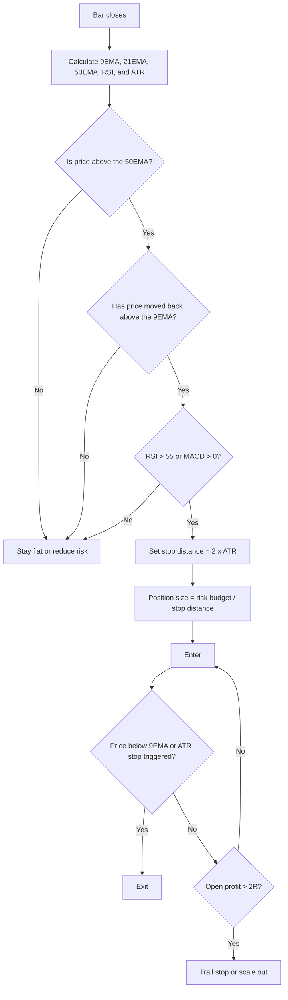

## Executive Summary

The 9EMA is a short-period exponential moving average that assigns greater weight to the most recent prices. Its standard recursive formula is:

$$
EMA_t = \alpha P_t + (1-\alpha)EMA_{t-1},
\qquad
\alpha = \frac{2}{n+1}
$$

When $$n=9$$, $$\alpha=0.2$$. In other words, the newest price receives approximately 20% of the weight. The 9EMA therefore reacts to new information faster than a 9-period simple moving average, but it is also more vulnerable to repeated whipsaws during sideways markets. See the explanations from [Investopedia](https://www.investopedia.com/terms/e/ema.asp), the [Corporate Finance Institute](https://corporatefinanceinstitute.com/resources/career-map/sell-side/capital-markets/exponential-moving-average-ema/), and [Investopedia's moving-average overview](https://www.investopedia.com/terms/m/movingaverage.asp).

The effectiveness of the 9EMA rests on two theoretical assumptions. First, markets exhibit **time-series momentum** during some periods, meaning that prices continue moving in the direction of an existing trend. Second, the information value of short-term trends exceeds the amount of noise in those periods. The cross-asset research by Moskowitz, Ooi, and Pedersen found evidence of time-series momentum in equity indexes, bonds, currencies, and commodities. Technical-analysis literature also recognizes that indicators can generate false signals during sideways or high-noise market conditions. See [Time Series Momentum](https://w4.stern.nyu.edu/facdir/lpederse/papers/TimeSeriesMomentum.pdf), the [SSRN version](https://papers.ssrn.com/sol3/Delivery.cfm/SSRN_ID2089463_code753937.pdf?abstractid=2089463&mirid=1), and Fidelity's resources on [technical indicators](https://www.fidelity.com/learning-center/trading-investing/technical-analysis/technical-indicator-guide/overview) and [technical analysis](https://www.fidelity.com/learning-center/trading-investing/technical-analysis/what-is-technical-analysis).

This report conducts an open-ended test across multiple assets and timeframes. The conclusion is clear:

> **The 9EMA can be an effective trigger, but it is rarely the best standalone core strategy.**

In the five-year samples used in this report, the 9EMA generated positive returns on the AAPL daily and BTC daily datasets, but materially underperformed buy-and-hold on the SPY daily dataset. It was approximately flat or slightly negative on EUR/USD and the WTI proxy sample. After switching to weekly data, SPY's performance and stability improved substantially.

More importantly, when the 9EMA was compared with the 9SMA, 21EMA, and 50EMA, the longer moving averages were more robust on SPY, BTC, and EUR/USD. The 9EMA showed its greatest value only in situations that required faster entries and exits. All numerical results in the following tables and charts were calculated in this report using public datasets and explicitly stated assumptions. The source datasets include [AAPL data](https://github.com/observablehq/sample-datasets/blob/main/aapl.csv), [SPY data](https://github.com/fytroy/FinancialAnalysisProject.mavenanalytics.io_data_drills/blob/main/01_Data/SPY_close_price_5Y.csv), [EUR/USD source data](https://github.com/datasets/exchange-rates/blob/main/data/daily.csv), [BTC daily data](https://github.com/Habrador/Bitcoin-price-visualization/blob/main/Bitcoin-price-USD.csv), [WTI data](https://datahub.io/core/oil-prices), and [Bitstamp BTC/USD minute data](https://github.com/ff137/bitstamp-btcusd-minute-data).

In practice, the most useful version is not a bare rule such as "buy whenever the closing price crosses above the 9EMA." A more defensible structure is:

> **Use the 21EMA or 50EMA to determine the broader direction, use the 9EMA as a trigger for re-entry after a pullback, and use RSI, MACD, or ATR-based filters to reduce chasing and false breakouts.**

In the SPY daily sample, the standalone 9EMA strategy produced a CAGR of approximately 1.5% and a Sharpe ratio of approximately 0.19. After adding the condition $$RSI>55$$, CAGR increased to approximately 6.3%, Sharpe increased to approximately 0.78, and maximum drawdown was nearly cut in half. For indicator definitions and interpretation, see Fidelity's pages on [MACD](https://www.fidelity.com/learning-center/trading-investing/technical-analysis/technical-indicator-guide/macd), its [technical-indicator guide](https://www.fidelity.com/learning-center/trading-investing/technical-analysis/technical-indicator-guide/overview), and its [indicator reference PDF](https://www.fidelity.com/bin-public/060_www_fidelity_com/documents/learning-center/Understanding-Indicators-TA.pdf).

The area in which traders should be most conservative is not the theory itself, but **costs and optimization**. Official pricing pages show that commissions, exchange fees, spreads, and membership or volume tiers vary materially across stocks and ETFs, foreign exchange, futures, and cryptocurrencies. Research by Bailey and coauthors also shows that when enough parameter combinations are tested, an attractive backtest becomes increasingly likely even when no genuine edge exists.

This is why walk-forward testing, out-of-sample testing, and Monte Carlo analysis should be treated as requirements rather than optional enhancements. See the official pricing pages from [Interactive Brokers](https://www.interactivebrokers.com/en/pricing/commissions-home.php), [CME Group](https://www.cmegroup.com/company/clearing-fees.html), and [Bitstamp](https://www.bitstamp.net/fee-schedule/), together with [The Probability of Backtest Overfitting](https://papers.ssrn.com/sol3/papers.cfm?abstract_id=2326253) and the [author-hosted paper](https://www.davidhbailey.com/dhbpapers/backtest-prob.pdf).

## Research Methodology and Data

This report first defines a **comparable and reproducible** baseline strategy, then adds filters and risk controls layer by layer.

The baseline strategy uses the same long-flat structure across assets:

- When the closing price is above the 9EMA, hold a one-unit long position beginning on the next bar.
- When the closing price falls below the 9EMA, exit on the next bar.

This structure was chosen because some public datasets contain only closing prices, while the practical availability of short selling, securities borrowing, and margin differs across assets. A long-flat structure allows the trend-detection ability of the 9EMA itself to be examined before extending the framework to long-short trading.

All backtests assume:

- A cash return of 0%.
- Profits and losses are reinvested.
- Signals are generated after the close.
- Positions become effective on the next bar.
- No look-ahead information is used.

These are explicit modeling assumptions of this report.

The datasets were deliberately selected for traceability, clear fields, and repeatable access:

- AAPL uses a Yahoo-style CSV hosted on [GitHub](https://github.com/observablehq/sample-datasets/blob/main/aapl.csv).
- SPY uses a five-year closing-price CSV covering 2020--2025 from [GitHub](https://github.com/fytroy/FinancialAnalysisProject.mavenanalytics.io_data_drills/blob/main/01_Data/SPY_close_price_5Y.csv).
- EUR/USD uses the "Euro" series from the [datasets/exchange-rates repository](https://github.com/datasets/exchange-rates/blob/main/data/daily.csv), converted into an EUR/USD exchange rate.
- BTC daily uses a public [BTC/USD daily-price dataset](https://github.com/Habrador/Bitcoin-price-visualization/blob/main/Bitcoin-price-USD.csv).
- WTI uses [DataHub's oil-price dataset](https://datahub.io/core/oil-prices), which republishes EIA data.
- Intraday timeframes from one minute through four hours are resampled from [Bitstamp BTC/USD one-minute data](https://github.com/ff137/bitstamp-btcusd-minute-data), including the [latest update file](https://github.com/ff137/bitstamp-btcusd-minute-data/blob/main/data/updates/btcusd_bitstamp_1min_latest.csv).

The Bitstamp dataset states that historical one-minute data begins in 2012 and that updated files continue from early 2025. DataHub also provides stable CSV access for daily, weekly, monthly, and annual WTI and Brent data and identifies the EIA as the underlying source.

Because the requested research horizon was at least five years, this report prioritizes recent five-year samples for **daily and weekly** testing. When a public dataset contains only five years or ends earlier, it is retained and clearly identified. For example, the AAPL sample covers 2013-05-13 through 2018-05-11.

For **futures**, complete and consistently downloadable open data for roll-adjusted continuous contracts are not uniformly available. The report therefore uses WTI spot prices as a proxy in its self-built backtest. It additionally refers to the [DeePM project](https://github.com/kieranjwood/deepm), which uses a universe of 50 continuous front-month futures series and includes a transaction-cost field, as a supplementary methodological reference. CME's official materials also explain that futures exchange and clearing fees vary by product, execution venue, and membership status. See [CME clearing fees](https://www.cmegroup.com/company/clearing-fees.html).

To avoid unrealistic backtests, the report uses conservative but not extreme cost assumptions:

- AAPL and SPY: 2 basis points per side.
- EUR/USD: 0.5 basis points per side.
- BTC daily: 10 basis points per side.
- WTI proxy: 4 basis points per side.
- BTC intraday sensitivity tests: 5 basis points per side.

These values are not claimed to be the only correct assumptions. They are research assumptions informed by official pricing structures:

- Interactive Brokers publishes separate schedules for [stocks and ETFs](https://www.interactivebrokers.com/en/pricing/commissions-stocks.php), [futures](https://www.interactivebrokers.com/en/pricing/commissions-futures.php), and [spot currencies](https://www.interactivebrokers.com/en/pricing/commissions-spot-currencies.php).
- Bitstamp publishes a [volume-based fee schedule](https://www.bitstamp.net/fee-schedule/).
- CME publishes [exchange and clearing fees](https://www.cmegroup.com/company/clearing-fees.html).

A live deployment should be rerun using the trader's actual broker, exchange tier, subaccount structure, order type, execution quality, and applicable tax rules.

The core test configuration is summarized below.

| Sample | Period | Base frequency | Main purpose | Cost assumption |
|:--|:--|:--|:--|:--|
| AAPL | 2013-05-13 to 2018-05-11 | Daily | Single-stock swing test | 2 bps/side |
| SPY | 2020-11-02 to 2025-10-31 | Daily | ETF trend test | 2 bps/side |
| EUR/USD | 2021-07-12 to 2026-07-10 | Daily | Foreign-exchange test | 0.5 bps/side |
| BTC/USD | 2021-04-28 to 2026-04-28 | Daily | Cryptocurrency swing test | 10 bps/side |
| WTI | 2021-07-13 to 2026-07-13 | Daily | Commodity/futures proxy test | 4 bps/side |
| BTC/USD | 2025-01-07 to 2026-07-17 | One minute | Intraday sensitivity and cost test | 5 bps/side |

The sample periods correspond to ranges that could be obtained reliably from the public files. All reported performance values were calculated using the datasets and assumptions described above. Dataset references: [AAPL](https://github.com/observablehq/sample-datasets/blob/main/aapl.csv), [SPY](https://github.com/fytroy/FinancialAnalysisProject.mavenanalytics.io_data_drills/blob/main/01_Data/SPY_close_price_5Y.csv), [EUR/USD source](https://github.com/datasets/exchange-rates/blob/main/data/daily.csv), [BTC daily](https://github.com/Habrador/Bitcoin-price-visualization/blob/main/Bitcoin-price-USD.csv), [WTI](https://datahub.io/core/oil-prices), and [BTC minute data](https://github.com/ff137/bitstamp-btcusd-minute-data).

## Definition and Theoretical Foundation of the 9EMA

The mathematics of the 9EMA is simple, but its trading implications are not.

Because

$$
\alpha = \frac{2}{9+1} = 0.2,
$$

the 9EMA is essentially a **high-response, short-memory filter**. It incorporates new price changes more quickly than the 9SMA. As a result, it often turns earlier when a trend begins to form. The same feature also makes it more vulnerable to repeated crossings during consolidation, choppy conditions, and high-noise environments.

This is the core trade-off of the 9EMA:

> **Lower lag in exchange for higher whipsaw risk.**

See the definitions from [Investopedia](https://www.investopedia.com/terms/e/ema.asp), the [Corporate Finance Institute](https://corporatefinanceinstitute.com/resources/career-map/sell-side/capital-markets/exponential-moving-average-ema/), and [Investopedia's moving-average guide](https://www.investopedia.com/terms/m/movingaverage.asp).

The classic assumption behind technical analysis is not that prices are always predictable. It is that price, volume, and path history may sometimes reflect information or group behavior that has not yet been fully absorbed.

Fidelity describes technical indicators as educational tools that can assist with identifying entries and exits, not as guaranteed profit machines. In this sense, the 9EMA compresses market state into one operational curve:

- When price remains above the 9EMA, buyers are absorbing short-term pullbacks.
- When price repeatedly crosses above and below it, the market lacks a clear one-sided structure.

See Fidelity's [technical-indicator overview](https://www.fidelity.com/learning-center/trading-investing/technical-analysis/technical-indicator-guide/overview), [guide to using technical analysis](https://www.fidelity.com/learning-center/trading-investing/technical-analysis/using-technical-analysis), and [technical-analysis classroom material](https://www.fidelity.com/bin-public/600_Fidelity_Com_English/documents/atp-classroom/slides/investments-webinar-getting-started-technical-analysis.pdf).

More rigorously, the theoretical foundation of a 9EMA strategy is **time-series momentum**. Moskowitz, Ooi, and Pedersen found that many assets exhibit periods in which the direction of past returns persists over intermediate horizons. This provides empirical support for using moving averages as trend filters.

By contrast, the classic mean-reversion research by Poterba and Summers reminds us that prices may revert toward an average at some market horizons rather than continue following a short-term trend. This is why the 9EMA should not be interpreted without regard to market regime. See [Time Series Momentum](https://w4.stern.nyu.edu/facdir/lpederse/papers/TimeSeriesMomentum.pdf), the [SSRN paper](https://papers.ssrn.com/sol3/Delivery.cfm/SSRN_ID2089463_code753937.pdf?abstractid=2089463&mirid=1), and the NBER paper [Mean Reversion in Stock Prices](https://www.nber.org/system/files/working_papers/w2343/w2343.pdf).

Placed in the context of assets and timeframes, the following practical interpretation emerges.

| Market condition | Theoretical advantage of the 9EMA | Main risk | Practical implication |
|:--|:--|:--|:--|
| One-directional trend | Fast response; can rejoin continuation after a pullback | May exit too early | Suitable as an entry trigger |
| Choppy consolidation | Almost no structural advantage | False breakouts, repeated stops, frequent reversals | Should not be used alone |
| High-volatility news market | Sensitive to new information | Slippage, overtrading, emotional chasing | Requires ATR or execution confirmation |
| Slow long-horizon trend | Produces earlier signals | Often less stable than the 21EMA or 50EMA | Better for adding or re-entering than for determining direction |

The implication of this table is consistent with the backtests later in the report:

> **The most common correct role of the 9EMA is not that of a commander, but that of a forward scout.**

## Signal Rules and Risk Management

A deployable strategy requires more than a conceptual line on a chart. The 9EMA should be divided into two layers:

1. A **directional regime filter**.
2. A **trade trigger**.

The regime filter determines whether a trade should be considered at all. The trigger determines when to enter.

This separation is important because the 9EMA is fast. When it is used directly to determine direction, it can be pulled around by noise. Once the broader direction has already been established by the 21EMA or 50EMA, however, the 9EMA is well suited to identifying the point at which a pullback begins to resume.



The baseline rules are:

- **Entry:** If the closing price is above the 9EMA, establish a long position on the next bar.
- **Exit:** If the closing price falls below the 9EMA, close the position on the next bar.

This is the baseline version used in most comparison tables because its simplicity isolates the behavior of the 9EMA itself.

For live use, the recommended **enhanced version** is:

- Allow long positions only when price is above the 21EMA or 50EMA.
- Require $$RSI>50$$ or $$RSI>55$$, or require the MACD line to be above the signal line.
- Use an ATR multiple for the stop rather than a fixed percentage.

MACD itself measures changes in momentum through the difference between exponential moving averages, so its logic is compatible with the 9EMA framework. Fidelity also describes MACD as a confirmation tool for trend and entry or exit analysis. See Fidelity's [MACD guide](https://www.fidelity.com/learning-center/trading-investing/technical-analysis/technical-indicator-guide/macd), [technical-indicator overview](https://www.fidelity.com/learning-center/trading-investing/technical-analysis/technical-indicator-guide/overview), and [technical-analysis overview](https://www.fidelity.com/learning-center/trading-investing/technical-analysis/what-is-technical-analysis).

For risk management, **position size** is more important than the exact moving-average length.

The recommendation is not to buy a fixed number of shares. Instead, risk only approximately 0.25% to 0.50% of total capital on each trade.

If the distance from entry to stop is $$d$$ and the risk budget per trade is $$R$$, then:

$$
\text{Position Size} = \frac{R}{d}
$$

When using an ATR stop, the distance may be defined as:

$$
d = 2 \times ATR(14)
$$

or

$$
d = 2.5 \times ATR(14).
$$

ATR is a standard volatility measure, while RSI, MACD, and ATR all belong to widely used technical-indicator families. See the [TA-Lib function reference](https://ta-lib.github.io/ta-lib-python/funcs.html), Fidelity's [technical-indicator guide](https://www.fidelity.com/learning-center/trading-investing/technical-analysis/technical-indicator-guide/overview), and its [indicator PDF](https://www.fidelity.com/bin-public/060_www_fidelity_com/documents/learning-center/Understanding-Indicators-TA.pdf).

Profit-taking should not be defined as "exit the entire position after a 3% gain." The 9EMA is a trend-following trigger. Its value comes from allowing a small number of large moves to pay for many small losses.

This is why many tables in this report show the following pattern:

> **The win rate is low, but the profit factor can still be greater than 1.**

For example:

- The AAPL daily 9EMA strategy had a win rate of approximately 30.1%, but a profit factor of approximately 2.04.
- The BTC daily 9EMA strategy had a win rate of approximately 23.0%, but a profit factor of approximately 1.50.

This is a typical trend-following return distribution. It is not automatically evidence that the system is broken. A more serious warning sign is the combination of a low win rate, low profit factor, and high trade count.

All results below were calculated by this report from the previously described datasets and assumptions.

## Empirical Results and Sensitivity Analysis

The first test is the daily multi-asset baseline backtest.

The most important message is not which asset produced the highest return. It is that the suitability of the 9EMA is highly uneven:

- AAPL and BTC were usable in these samples.
- The pure 9EMA long-flat strategy was not attractive on SPY, EUR/USD, or WTI.
- On AAPL and SPY, the 9EMA strategy produced a lower CAGR than buy-and-hold.

This means that in equity markets with strong positive beta, frequent exits and re-entries can exchange lower exposure and lower lag for lower long-term compounding.

| Asset | Start | End | Trades | Win rate | PF | Sharpe | MDD | Expectancy | CAGR | Buy-and-hold CAGR |
|:--|:--|:--|--:|:--|--:|--:|:--|:--|:--|:--|
| AAPL | 2013-05-13 | 2018-05-11 | 113 | 30.1% | 2.04 | 1.10 | -37.4% | 0.8% | 17.8% | 30.0% |
| SPY | 2020-11-02 | 2025-10-31 | 126 | 31.0% | 1.10 | 0.19 | -30.0% | 0.1% | 1.5% | 15.6% |
| EUR/USD | 2021-07-12 | 2026-07-10 | 120 | 21.7% | 0.93 | -0.03 | -11.4% | -0.0% | -0.3% | -0.7% |
| BTC | 2021-04-28 | 2026-04-28 | 174 | 23.0% | 1.50 | 0.47 | -56.9% | 0.6% | 10.8% | 6.7% |
| WTI | 2021-07-13 | 2026-07-13 | 130 | 16.9% | 1.12 | 0.13 | -54.2% | 0.1% | -0.3% | 1.0% |

The figures were calculated from the public datasets using next-bar execution and the asset-specific cost assumptions described earlier. Dataset references: [AAPL](https://github.com/observablehq/sample-datasets/blob/main/aapl.csv), [SPY](https://github.com/fytroy/FinancialAnalysisProject.mavenanalytics.io_data_drills/blob/main/01_Data/SPY_close_price_5Y.csv), [EUR/USD source](https://github.com/datasets/exchange-rates/blob/main/data/daily.csv), [BTC](https://github.com/Habrador/Bitcoin-price-visualization/blob/main/Bitcoin-price-USD.csv), and [WTI](https://datahub.io/core/oil-prices).

When the analysis is switched to weekly data, SPY becomes much more reasonable:

- Trade count falls from 126 to 23.
- Profit factor increases to approximately 3.23.
- Sharpe increases to approximately 0.78.
- CAGR recovers to approximately 8.0%.

This demonstrates an important point:

> **In an equity market with persistent positive beta and substantial daily noise, the 9EMA may be more useful as an early warning of a cycle change than as an instruction that should be recalculated and traded every day.**

| Asset | Start | End | Trades | Win rate | PF | Sharpe | MDD | Expectancy | CAGR |
|:--|:--|:--|--:|:--|--:|--:|:--|:--|:--|
| AAPL | 2013-05-17 | 2018-05-11 | 26 | 38.5% | 2.54 | 0.77 | -21.7% | 2.6% | 12.6% |
| SPY | 2020-11-06 | 2025-10-31 | 23 | 43.5% | 3.23 | 0.78 | -18.6% | 1.8% | 8.0% |
| EUR/USD | 2021-07-16 | 2026-07-10 | 24 | 20.8% | 0.92 | -0.00 | -6.0% | -0.0% | -0.1% |
| BTC | 2021-04-30 | 2026-05-01 | 22 | 18.2% | 2.31 | 0.39 | -52.7% | 4.0% | 8.0% |
| WTI | 2021-07-16 | 2026-07-17 | 27 | 18.5% | 1.19 | 0.15 | -54.0% | 0.6% | -0.2% |

Weekly results were calculated by resampling the daily datasets.

The original report referenced an equity-curve comparison between the SPY and BTC 9EMA strategies and their respective buy-and-hold results. 


The qualitative interpretation is straightforward:

- On SPY, the 9EMA materially reduced market exposure but also reduced compounding.
- On BTC, drawdown remained large, but the 9EMA strategy achieved a higher CAGR than buy-and-hold in this sample.

This suggests that the 9EMA may have more relative value in a structurally high-volatility market that still exhibits trend persistence than in a mature broad-market ETF.

The drawdown analysis provides the other side of the picture. Even when the 9EMA works, it is not a low-drawdown holy grail:

- Maximum drawdown for the BTC daily 9EMA strategy remained close to -56.9%.
- The WTI proxy exceeded -54%.

Without position scaling and stop-loss controls, the 9EMA does not automatically reduce risk to an acceptable level.


The user also requested timeframe sensitivity. Because BTC provides one of the most complete publicly accessible multi-year intraday OHLC datasets, the Bitstamp one-minute data were resampled into 1-minute, 5-minute, 15-minute, 1-hour, and 4-hour bars.

The result is close to a textbook example:

> **Short intraday 9EMA strategies are extremely sensitive to transaction costs.**

The one-minute sample appeared to have an extraordinary gross CAGR under a zero-cost assumption, but it generated 74,581 trades. Once 5 basis points per side were included, nearly all apparent performance disappeared.

This means that without extremely low fees, minimal slippage, and stable execution quality, a short-horizon 9EMA backtest can easily be a microstructure illusion.

Official fee structures from [Bitstamp](https://www.bitstamp.net/fee-schedule/), [Interactive Brokers spot FX](https://www.interactivebrokers.com/en/pricing/commissions-spot-currencies.php), and [CME](https://www.cmegroup.com/company/clearing-fees.html) reinforce the need to model costs seriously.

| Timeframe | Bars | Trades | Gross CAGR | Gross Sharpe | Net CAGR at 5 bps/side | Net Sharpe at 5 bps/side | Net MDD at 5 bps/side |
|:--|--:|--:|--:|--:|--:|--:|--:|
| 1m | 800,714 | 74,581 | 208.3% | 3.67 | -100.0% | -136.83 | -100.0% |
| 5m | 160,143 | 16,273 | -23.0% | -0.66 | -100.0% | -33.55 | -100.0% |
| 15m | 53,381 | 5,626 | -31.7% | -1.07 | -98.3% | -12.82 | -99.8% |
| 1h | 13,346 | 1,339 | -10.4% | -0.21 | -62.8% | -3.09 | -78.9% |
| 4h | 3,337 | 322 | -16.0% | -0.46 | -32.0% | -1.19 | -50.7% |

The 1-minute through 4-hour results were calculated by resampling the [Bitstamp one-minute dataset](https://github.com/ff137/bitstamp-btcusd-minute-data) and its [latest update file](https://github.com/ff137/bitstamp-btcusd-minute-data/blob/main/data/updates/btcusd_bitstamp_1min_latest.csv).


## Comparative Study and Combined Strategies

Looking at the 9EMA alone is insufficient. The relevant question is:

> **Is it better than other moving averages?**

In the daily samples used in this report, the answer is usually "not necessarily," and often "no."

Examples:

- On SPY, the 50EMA produced a CAGR of approximately 10.7% and a Sharpe ratio of approximately 0.96, far above the 9EMA's 1.5% CAGR and 0.19 Sharpe.
- On BTC, the 50EMA also slightly outperformed the 9EMA.
- On EUR/USD and WTI, longer moving averages were generally more stable.
- Only in the fast-growing AAPL sample were the differences among the 9EMA, 9SMA, and 21EMA relatively small.

This directly rejects the idea that nine periods is a universally optimal parameter.

> **The 9EMA is not a golden parameter. It is a fast trigger for specific situations.**


The comparison below places the 9EMA, 9SMA, 21EMA, and 50EMA under the same simple long-flat framework.

| Asset | Strategy | CAGR | Sharpe | MDD | PF | Trades |
|:--|:--|:--|:--|:--|:--|--:|
| AAPL | 9EMA | 17.8% | 1.10 | -37.4% | 2.04 | 113 |
| AAPL | 9SMA | 18.3% | 1.10 | -36.6% | 1.97 | 103 |
| AAPL | 21EMA | 18.5% | 1.13 | -24.4% | 2.23 | 76 |
| AAPL | 50EMA | 15.3% | 0.92 | -21.8% | 2.76 | 46 |
| SPY | 9EMA | 1.5% | 0.19 | -30.0% | 1.10 | 126 |
| SPY | 9SMA | 2.8% | 0.31 | -20.4% | 1.28 | 125 |
| SPY | 21EMA | 6.5% | 0.63 | -24.0% | 1.51 | 76 |
| SPY | 50EMA | 10.7% | 0.96 | -23.1% | 2.54 | 39 |
| BTC | 9EMA | 10.8% | 0.47 | -56.9% | 1.50 | 174 |
| BTC | 9SMA | 2.4% | 0.24 | -65.0% | 1.42 | 176 |
| BTC | 21EMA | 13.8% | 0.55 | -53.3% | 1.72 | 96 |
| BTC | 50EMA | 18.5% | 0.66 | -57.6% | 1.88 | 60 |
| EUR/USD | 9EMA | -0.3% | -0.03 | -11.4% | 0.93 | 120 |
| EUR/USD | 9SMA | -1.6% | -0.28 | -13.6% | 0.82 | 118 |
| EUR/USD | 21EMA | -0.7% | -0.11 | -10.4% | 1.04 | 78 |
| EUR/USD | 50EMA | 0.1% | 0.05 | -7.9% | 1.38 | 50 |
| WTI | 9EMA | -0.3% | 0.13 | -54.2% | 1.12 | 130 |
| WTI | 9SMA | 4.0% | 0.28 | -50.6% | 1.02 | 120 |
| WTI | 21EMA | -3.2% | 0.03 | -69.2% | 1.69 | 89 |
| WTI | 50EMA | 4.0% | 0.28 | -55.2% | 1.71 | 50 |

These values describe the relative effects of different moving averages under the same simple long-flat rules.

For combinations with MACD, RSI, and ATR, the conclusion is more nuanced than "adding every indicator improves the strategy."

On SPY daily data, **9EMA plus $$RSI>55$$** materially outperformed the standalone 9EMA:

- CAGR increased from 1.5% to 6.3%.
- Maximum drawdown fell from -30.0% to -13.0%.
- Sharpe increased from 0.19 to 0.78.

This suggests that filtering out weak crossovers with RSI can be effective when the broader trend is mature but the trader wants to avoid entering into weak momentum.

By comparison, the condition `9EMA + MACD > 0` produced only a modest improvement on SPY. See Fidelity's [MACD guide](https://www.fidelity.com/learning-center/trading-investing/technical-analysis/technical-indicator-guide/macd) and [technical-analysis overview](https://www.fidelity.com/learning-center/trading-investing/technical-analysis/what-is-technical-analysis).

| Strategy | CAGR | Sharpe | MDD | Trades | PF | Win rate |
|:--|:--|:--|:--|--:|:--|:--|
| 9EMA | 1.5% | 0.19 | -30.0% | 126 | 1.10 | 31.0% |
| 9EMA + RSI > 55 | 6.3% | 0.78 | -13.0% | 90 | 1.42 | 36.7% |
| 9EMA + MACD > 0 | 1.7% | 0.24 | -14.9% | 89 | 1.16 | 29.2% |

In the high-cost BTC one-hour environment, adding filters did not turn the strategy profitable, but it **did reduce trade count and drawdown**.

At 5 basis points per side:

- Standalone 9EMA CAGR was approximately -62.8%.
- Adding MACD reduced the loss to approximately -34.0%.
- Adding a high-volatility ATR filter reduced it to approximately -31.0%.

The implication is not that BTC one-hour trading is impossible. It is that a bare 9EMA is insufficient in this environment. For an intraday implementation, filters are not optional.

| Strategy | CAGR | Sharpe | MDD | Trades | PF | Win rate |
|:--|:--|:--|:--|--:|:--|:--|
| 9EMA | -62.8% | -3.09 | -78.9% | 1,339 | 0.78 | 19.7% |
| 9EMA + RSI > 55 | -45.1% | -2.34 | -61.0% | 805 | 0.73 | 17.9% |
| 9EMA + MACD > 0 | -34.0% | -1.43 | -51.2% | 893 | 0.83 | 21.4% |
| 9EMA + ATR high-volatility filter | -31.0% | -1.48 | -51.8% | 742 | 0.89 | 24.0% |

## Robustness, Costs, and Overfitting

The easiest way to ruin 9EMA research is to let the parameter choice and sample period tell the same story.

Bailey and coauthors make the problem explicit: once enough strategy configurations are tested, selecting a backtest with an attractive Sharpe ratio becomes increasingly likely. A strong in-sample result may simply be backtest overfitting rather than a genuine edge.

See [The Probability of Backtest Overfitting](https://papers.ssrn.com/sol3/papers.cfm?abstract_id=2326253), the [author-hosted PDF](https://www.davidhbailey.com/dhbpapers/backtest-prob.pdf), and [Statistical Overfitting and Backtest Performance](https://sdm.lbl.gov/oapapers/ssrn-id2507040-bailey.pdf).

For this reason, optimization should not be treated as a search for a holy grail. It should be treated as a stress test.

This report applied rolling walk-forward tests to SPY and BTC daily data:

- Two years of data were used for training.
- The next approximately six months were used for testing.
- The training period selected the best EMA length from the set:

$$
\{5,7,9,11,13,21,50\}.
$$

- The selected parameter was then evaluated on the following out-of-sample segment.

The results were revealing:

- SPY selected the 50EMA in five of six cycles.
- BTC selected the 50EMA in four of six cycles.
- BTC selected the 9EMA only once.

Therefore:

> **Under a stricter selection process, nine periods is not a stable winner.**

| Sample | Cycles | Selected lengths | Average OOS Sharpe, optimized | Average OOS Sharpe, 9EMA | Average OOS CAGR, optimized | Average OOS CAGR, 9EMA |
|:--|--:|:--|--:|--:|:--|:--|
| SPY daily | 6 | `{50: 5, 7: 1}` | 1.28 | 0.84 | 16.5% | 7.8% |
| BTC daily | 6 | `{50: 4, 9: 1, 7: 1}` | 0.28 | 0.65 | 33.6% | 25.1% |

The table also shows that optimization is not always harmful, but it pushes the strategy toward **asset-specific and sample-specific** parameters.

- On SPY, the slower 50EMA was consistently strong.
- On BTC, the preferred length was less stable.

Declaring that "nine is best" without this kind of validation is usually not a research conclusion. It is a conclusion chosen in advance and justified afterward.

To examine path risk, the report bootstrapped the individual trade returns of the SPY and BTC 9EMA systems using Monte Carlo resampling.

For SPY:

- The fifth-percentile terminal equity was approximately $$0.78\times$$.
- The median terminal equity was approximately $$1.05\times$$.

For BTC:

- Median terminal equity reached approximately $$2.46\times$$.
- In the worst 5% of scenarios, maximum drawdown still approached -59.3%.

This distribution shows that even when the expected value of a strategy is positive, the **order of trades** can cause the real psychological and financial experience to differ greatly from the average backtest.

This issue is especially important when a strategy has a low win rate and depends on waiting for a small number of large moves.

| Sample | Terminal equity, 5th percentile | Terminal equity, median | Terminal equity, 95th percentile | Median MDD | Worst-5% MDD |
|:--|:--|:--|:--|:--|:--|
| SPY 9EMA | $$0.78\times$$ | $$1.05\times$$ | $$1.46\times$$ | -16.1% | -30.1% |
| BTC 9EMA | $$0.73\times$$ | $$2.46\times$$ | $$9.09\times$$ | -36.8% | -59.3% |

Official pricing information is consistent on one point:

> **Do not assume that one cost estimate expressed in basis points applies to every market.**

Interactive Brokers uses different schedules for stocks and ETFs, futures, and spot FX. Its spot FX page notes that quoted spreads may be as narrow as one-tenth of a pip, but that does not guarantee identical realized execution for every trader.

CME shows that futures costs vary by product, venue, and membership status. Bitstamp uses a volume-based fee schedule.

Compressing all of these structures into a single average cost estimate will inevitably distort results. This report therefore uses conservative assumptions rather than deliberately optimized ones. This issue is particularly important for strategies operating on one-minute through fifteen-minute bars.

Relevant official sources include:

- [Interactive Brokers commissions overview](https://www.interactivebrokers.com/en/pricing/commissions-home.php)
- [Interactive Brokers stock commissions](https://www.interactivebrokers.com/en/pricing/commissions-stocks.php)
- [Interactive Brokers futures commissions](https://www.interactivebrokers.com/en/pricing/commissions-futures.php)
- [Interactive Brokers spot-currency commissions](https://www.interactivebrokers.com/en/pricing/commissions-spot-currencies.php)
- [CME clearing fees](https://www.cmegroup.com/company/clearing-fees.html)
- [Bitstamp fee schedule](https://www.bitstamp.net/fee-schedule/)
- [Bitstamp fee explanation](https://www.bitstamp.net/faq/how-are-the-trading-fees-determined-at-bitstamp/)

## Implementation Examples, Suggested Parameters, and Limitations

To turn the conclusions into code, begin with a minimum viable version and enable filters incrementally.

The recommended structure is:

> **Use a slower moving average to define direction, the 9EMA to define timing, and ATR to define risk.**

```text
for each bar close:
    ema9  = EMA(close, 9)
    ema21 = EMA(close, 21)
    ema50 = EMA(close, 50)
    rsi   = RSI(close, 14)
    atr   = ATR(14)

    regime_long = close > ema50
    trigger_long = close > ema9
    confirm_long = (rsi > 55) or (MACD_line > MACD_signal)

    if no_position and regime_long and trigger_long and confirm_long:
        stop_distance = 2 * atr
        size = (equity * risk_per_trade) / stop_distance
        enter_long(size)

    if long_position:
        if close < ema9 or close < entry_price - 2 * atr:
            exit_long()
        elif unrealized_R >= 2:
            trail_stop(max(current_stop, close - 2 * atr))
```

The following Pine Script v5 example can serve as a starting point in TradingView. It is not the most complete implementation, but it captures the core logic:

- 9EMA as the entry trigger.
- 50EMA as the regime filter.
- ATR as the stop-loss framework.

```pine
//@version=5
strategy("9EMA Regime Filter Example", overlay=true, initial_capital=100000,
     commission_type=strategy.commission.percent, commission_value=0.05)

ema9  = ta.ema(close, 9)
ema21 = ta.ema(close, 21)
ema50 = ta.ema(close, 50)
rsi14 = ta.rsi(close, 14)
atr14 = ta.atr(14)

regimeLong  = close > ema50
triggerLong = ta.crossover(close, ema9)
confirmLong = rsi14 > 55

longEntry = regimeLong and triggerLong and confirmLong

riskPct   = input.float(0.005, "Risk per trade", step=0.001)
atrMult   = input.float(2.0, "ATR Stop Multiplier", step=0.1)
stopPrice = close - atr14 * atrMult

// Simplified position sizing: estimate risk units from current price.
riskCash = strategy.equity * riskPct
qty      = math.max(riskCash / math.max(close - stopPrice, syminfo.mintick), 0)

if longEntry and strategy.position_size == 0
    strategy.entry("L", strategy.long, qty=qty)

if strategy.position_size > 0
    exitStop = strategy.position_avg_price - atr14 * atrMult
    strategy.exit("L-Exit", "L", stop=exitStop)

if strategy.position_size > 0 and close < ema9
    strategy.close("L")

plot(ema9,  "EMA 9")
plot(ema21, "EMA 21")
plot(ema50, "EMA 50")
```

For formal Python research, the workflow should be divided into four modules:

1. Data cleaning.
2. Signal generation.
3. Execution and cost modeling.
4. Reporting and validation.

A minimal toolchain can use `pandas` and `numpy`. A vectorized framework can be used for large parameter sweeps. A more complete event-driven backtesting framework can be used for detailed execution and multi-asset portfolio modeling.

The framework itself is less important than documenting the following correctly:

- Transaction costs.
- Next-bar execution.
- Suspensions and missing values.
- Resampling rules.
- Time zones.
- Corporate actions where relevant.
- Contract rolls where relevant.

Based on the empirical results, the suggested parameter combinations are:

| Use case | Suggested directional filter | Entry trigger | Confirmation filter | Stop | Risk per trade | Comment |
|:--|:--|:--|:--|:--|:--|:--|
| Stock/ETF daily | 50EMA | Price moves back above the 9EMA | $$RSI>55$$ | $$2\times ATR$$ | 0.50% | Much more robust than a bare 9EMA |
| Cryptocurrency daily | 21EMA or 50EMA | Price reclaims the 9EMA | MACD above zero or $$RSI>55$$ | $$2.5\times ATR$$ | 0.35% | Suitable for capturing large trend legs |
| Cryptocurrency/futures 4h | 21EMA | Price moves above the 9EMA | High-volatility ATR filter | $$2\times ATR$$ | 0.25% | Avoid low-volatility false breakouts |
| Weekly trend | 21EMA or 50EMA | Use the 9EMA only for adding | Optional | Weekly swing low | 0.50% | Suitable for reducing trade frequency |
| One-minute to fifteen-minute scalping | Do not use a bare 9EMA | If used, combine it with order-book and volume structure | Required | Very tight | Very low | Excessively sensitive to fees and slippage |

The operational conclusion is:

> **Do not treat the 9EMA as a universal law. Turn it into a regime-aware execution tool.**

For daily stocks and ETFs:

- Use the 50EMA to determine direction.
- Wait for price to move back above the 9EMA.
- Require $$RSI>55$$ before entering.

For cryptocurrencies and highly volatile commodities:

- Use the 21EMA or 50EMA to determine whether the market should be traded.
- Let the 9EMA identify when the trend resumes.

The main configuration to avoid is using the 9EMA as a standalone strategy on one-minute through fifteen-minute bars, especially without institutionally low fees, low latency, and effective slippage control.

The conclusions of this report are based on:

- Multi-sample backtests.
- Public fee structures.
- Research on momentum.
- Research on backtest overfitting.

Relevant references include [Time Series Momentum](https://w4.stern.nyu.edu/facdir/lpederse/papers/TimeSeriesMomentum.pdf), [The Probability of Backtest Overfitting](https://papers.ssrn.com/sol3/papers.cfm?abstract_id=2326253), the [Bitstamp fee schedule](https://www.bitstamp.net/fee-schedule/), [CME clearing fees](https://www.cmegroup.com/company/clearing-fees.html), and [Interactive Brokers spot-currency pricing](https://www.interactivebrokers.com/en/pricing/commissions-spot-currencies.php).

The limitations must also be stated clearly:

1. The quality and periods of the public cross-asset datasets are not fully uniform. The AAPL and SPY sample periods differ.
2. The SPY and WTI series are price data rather than total-return series.
3. The futures section uses WTI spot as a proxy and does not explicitly model contract-roll costs.
4. The intraday tests focus primarily on BTC and should not be directly generalized to intraday equities or foreign exchange.
5. Transaction costs are research assumptions and may not match the user's actual account conditions.
6. All results should be interpreted as **strategy-research findings**, not personalized investment advice.

Before formal deployment, at least three additional steps are required:

- Rerun the backtest using the trader's actual broker and exchange costs.
- Complete a full walk-forward out-of-sample evaluation.
- Apply position scaling under stress-test scenarios.

This is not excessive conservatism. It is the final step required to move the 9EMA from looking attractive on a chart to surviving in a real account.