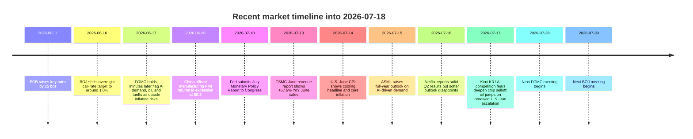

# Market Summary, Prediction, and Outlook

## Executive summary

As of **2026-07-18**, the market regime is best described as a **two-speed reset rather than a full risk-off breakdown**. The user-provided [CNN article](https://edition.cnn.com/2026/07/17/investing/us-stocks-asia) frames Asia’s rally through the lens of **record highs in Taiwan, South Korea, and Japan after the March drawdown**, while the user-provided [Yahoo Finance article](https://finance.yahoo.com/markets/stocks/articles/kimi-k3-just-triggered-deepseek-175532711.html) reframes the latest selloff as a **Kimi K3 / “DeepSeek-flashback” valuation shock** to crowded AI trades. The combination implies a key shift: the **medium-term AI upcycle is still intact**, but **near-term positioning, valuation, and capex payback assumptions are being repriced more aggressively**. citeturn28search0turn0search34turn24view1

The most important cross-asset message is internally consistent. U.S. equities rolled over led by semiconductors; Asia followed, with Taiwan and Japan hit hardest; oil rose sharply on renewed U.S.-Iran escalation; Treasury yields eased from their highs even as some Fed officials sounded hawkish; the dollar finished the week broadly steady to weaker; and gold stabilized on the day but remained down over the past month. This is a **growth/valuation shock plus geopolitical inflation hedge**, not yet a disorderly macro panic. VIX closed at **18.77**, materially higher on the day but still below classic crisis levels. citeturn24view1turn23view0turn17search0turn17search2turn16search7

The policy backdrop remains mixed rather than uniformly restrictive. U.S. June CPI cooled to **3.5% YoY** and **2.6% core**, while the June FOMC minutes showed many participants still viewed the labor market as **not currently a source of inflationary pressure**; however, the same minutes also made clear that **AI demand, energy shocks, and tariffs** could justify renewed tightening if inflation stays sticky. Outside the U.S., the ECB **raised rates by 25 bps in June**, and the BOJ in June shifted the overnight call-rate target to around **1.0%**, keeping the global rates backdrop less supportive than in a typical mid-cycle dip-buying phase. citeturn14view4turn15view1turn14view2turn14view3

My base interpretation is unchanged from the earlier Chinese report: **the AI fundamental story has not broken, but the market has entered a more fragile second stage** in which leadership broadens, index upside slows, and crowded AI-beta becomes more sensitive to earnings quality, oil, and central-bank communication. TSMC and ASML both reported strong Q2 results and constructive outlooks, which argues against a collapse in real semiconductor demand; the current drawdown is more consistent with **multiple compression and positioning stress** than with a hard demand recession. citeturn27view1turn27view2turn24view2

## Synthesis of the user links and source triangulation

The accessible public teaser for the [CNN piece](https://edition.cnn.com/2026/07/17/investing/us-stocks-asia) emphasizes that **Taiwan, South Korea, and Japan had recently set fresh highs after bouncing back from March weakness**. That framing is directionally important because it shows the present drawdown is coming **after** an exceptionally strong Asia-led AI rally, not from depressed positioning. In other words, the market entered July with momentum, crowded winners, and elevated expectations. citeturn28search0turn24view3

The [Yahoo Finance article](https://finance.yahoo.com/markets/stocks/articles/kimi-k3-just-triggered-deepseek-175532711.html) adds the second leg of the story: **Moonshot AI’s Kimi K3** revived investor fears that AI economics may become more competitive, more open-weight, and harder to monetize at the margin. Reuters corroborates that Kimi K3 was presented as a **very large open-weight system** with performance close to Anthropic’s frontier model, and that the launch intensified an already ongoing semiconductor-led selloff. This matters less as a single-product event than as a trigger for **re-rating the scarcity premium** embedded in AI infrastructure and software winners. citeturn0search34turn24view1

When triangulated with primary and official sources, the picture becomes clearer. TSMC reported **Q2 revenue up 36.0% YoY**, net income up **77.4%**, and described Q3 as supported by **continued strong demand** for leading-edge nodes. ASML reported **€9.3 billion** in Q2 sales, raised its **2026 sales outlook to €43–45 billion**, and explicitly tied stronger visibility to ongoing AI-related investment. Those releases do **not** support the thesis of immediate demand destruction; they support the thesis of a market that had become too one-sided and too valuation-dependent. citeturn27view1turn27view2

At the macro layer, the market is being forced to reconcile three facts at once: cooling headline inflation in the U.S., lingering upside inflation risk from oil and conflict, and a still-firm AI capex cycle. The June U.S. CPI release showed the largest monthly all-items decline since April 2020, largely because energy fell sharply month on month, but the Fed minutes still warned that strong AI demand, Middle East conflict, or tariffs could keep inflation elevated. That combination explains why bond yields slipped modestly while equities still sold off: investors de-risked **equity duration** more than **macro recession**. citeturn14view4turn15view1turn24view1

Liquidity and positioning also matter. Reuters reported that foreign investors sold **$137.36 billion** of Asian equities in the first half of 2026, the fastest such six-month outflow in at least 16 years, with South Korea and Taiwan accounting for the largest amounts. That does not mean a structural rejection of Asia, but it does mean that **profit-taking and crowding** were already powerful before this latest July downdraft. citeturn24view3

## Key market moves

All market levels below are **as of 2026-07-17 close** unless noted. One-month comparisons use the nearest cited close around **2026-06-18**. citeturn33search1turn34search3turn35search0turn40view0turn40view1turn38search0

### Major indices

| Market | Close | 5D move | ~1M move | Volume / turnover | Volatility note |
|---|---:|---:|---:|---:|---|
| S&P 500 | 7,457.69 | -1.55% | -0.57% | 5.30B shares | VIX at 18.77, +12.19% on the day |
| Dow Jones | 52,146.42 | -0.93% | +1.13% | 549.69M shares | More resilient than Nasdaq |
| Nasdaq Composite | 25,520.24 | -2.90% | -3.76% | 1.58B shares | SOX entered bear-market territory |
| TAIEX | 42,671.27 | n/a | -8.17% | NT$1.21tn trade value | Electronics led downside |
| Hang Seng | 24,562.24 | +1.60% | +2.66% | 3.75B shares | China-tech rotation cushioned prior week |
| Nikkei 225 | 64,141.12 | -6.44% | -9.73% | n/a | 11.3% below Jun. 25 record |
| Shanghai Composite | 3,764.15 | n/a | -7.98% | 65.05B shares | Weak tape despite PMI re-expansion |

**Sources and calculation basis:** S&P 500, Dow, Nasdaq historical data and volumes; Hang Seng and Nikkei historical data; TWSE weekly press release and official homepage statistics; Shanghai historical data and current volume; VIX from MarketWatch. One-month returns are calculated from the cited June 18 and July 17 closes. citeturn21search12turn33search0turn25view3turn40view0turn40view1turn35search0turn19search6turn38search0turn38search4turn23view0

*Generated chart from the cited July 17 closes and referenced 5D/1M comparison points. Underlying market levels are sourced from Investing.com, TWSE, FRED/MarketWatch, and Reuters-linked market summaries. citeturn33search1turn33search0turn25view3turn40view0turn40view1turn19search6turn38search4turn23view0*

### FX and commodities

| Asset | Latest | 1W / 5D signal | ~1M move | Read-through |
|---|---:|---:|---:|---|
| DXY | 100.76 | -0.2% for the week | -0.09% | Dollar firm intraday, softer on cooling CPI |
| EUR/USD | 1.1437 | +0.2% for the week | -0.16% | ECB hawkishness offset by U.S. risk-off demand |
| USD/JPY | 162.43 | broadly firmer USD | +0.64% | Weak yen keeps Japan inflation/rates debate alive |
| USD/TWD | 32.4090 | higher on the day | +2.48% | TWD weakened with tech and offshore risk reduction |
| Brent | $88.10/bbl | sharply higher on the week | +10.32% | Geopolitics reintroduced inflation risk |
| Gold | $4,009–4,017/oz | rose on the day | -4.59% | Still pressured by higher real-rate fears |

**Sources:** Reuters FX/commodity wrap, Trading Economics, MarketWatch, Bank of Taiwan / Taiwan FX references. citeturn24view1turn29news24turn16search0turn16search1turn29search1turn17search0turn17search2turn16search7

### Sector leaders, laggards, and heat

On **July 17**, **Energy was the only S&P 500 sector in the green**, while tech and AI-linked names carried the downside. MarketWatch’s same-day leaderboard showed **Travelers (+9.22%)**, **Seagate (+5.66%)**, and **Centene (+3.99%)** among the top gainers, while **Intuitive Surgical (-14.15%)**, **Cadence (-9.47%)**, **Synopsys (-7.85%)**, and **Netflix (-7.26%)** were among the worst performers. That pattern is consistent with a **rotation away from expensive growth duration and AI beta toward defensives, insurers, and energy-linked exposure**. citeturn23view0turn22news24

*Generated heatmap of the latest directional move profile across major indices and major cross-asset channels, based on the cited daily and recent-period market data. citeturn23view0turn24view1turn17search0turn17search2turn16search0turn16search1turn29search1*

## Drivers and causal map

The macro driver set is led by **rates and inflation uncertainty**, not by a collapse in activity. U.S. June CPI slowed to **3.5% YoY** and core CPI to **2.6%**, helped by a **5.7%** monthly drop in energy, but the Fed’s June minutes still highlighted upside inflation risks from **AI-related demand**, **Middle East conflict**, and **tariffs**. Reuters further reported that some Fed officials publicly reopened the possibility of additional tightening, while futures markets still priced only about a **15% chance of a July hike** and around **65% by September**, underscoring a divided rates narrative rather than a settled hiking cycle. citeturn14view4turn15view1turn24view0

Outside the U.S., monetary policy is not uniformly easing. The ECB on **June 11** raised its three key policy rates by **25 bps**, taking the deposit facility to **2.25%**, explicitly citing Middle East-related inflation pressures. The BOJ on **June 16** shifted its operating target to keep the uncollateralized overnight call rate around **1.0%**, and its next meeting is scheduled for **July 30–31**. That means the market is trying to de-risk AI valuations in an environment where neither Europe nor Japan is delivering an obvious fresh liquidity impulse. citeturn14view2turn14view3turn30search1turn31view1

The activity data are mixed but not recessionary. China’s official June manufacturing PMI returned to expansion at **50.3**, with the composite PMI output index at **50.6**, suggesting stabilization in production and new orders. Yet Shanghai equities still fell nearly **8%** over the past month, which implies equity investors remain more concerned with valuation, policy credibility, and the external growth mix than with a single PMI print. citeturn9search0turn9search3turn38search5

Earnings have been a buffer, but not enough to offset multiple compression. TSMC and ASML both reinforced the **durability of leading-edge and AI-infrastructure demand**, while Reuters noted earlier in the week that large U.S. banks such as **JPMorgan, Goldman Sachs, Bank of America, and Citigroup** beat expectations, aided by trading and deal-making revenues. At the same time, Netflix’s Q2 report showed that even solid operating results can be punished if forward growth guidance fails to clear the market’s higher bar. This asymmetry is typical of a late-stage momentum unwind. citeturn27view1turn27view2turn24view4turn27view3

Geopolitics and liquidity are the final accelerants. Reuters reported renewed U.S.-Iran escalation, disruption around Hormuz-sensitive infrastructure, and a sharp rise in oil prices; separately, Reuters’ Asia flow data showed large first-half foreign selling in Taiwan and Korea. Together, these forces amplify drawdowns in crowded AI beneficiaries because they hit both **discount rates** and **positioning liquidity** at once. citeturn24view1turn24view3

*Generated risk dashboard using the cited VIX, oil, FX, and equity drawdown data. The main signal is that volatility has risen materially, but not yet into full panic territory. citeturn23view0turn17search0turn17search2turn16search0turn29search1turn24view1*

## Scenario outlook

The scenario framework below is judgmental rather than model-implied. In notation, a probability-weighted market view can be written as

$$
E[R] = \sum_{i=1}^{n} p_i \cdot r_i
$$

where $p_i$ is scenario probability and $r_i$ is the market outcome under that scenario.

### Short-term horizon

| Scenario | Probability | Core view | Key triggers | Main risks |
|---|---:|---|---|---|
| Base case | 50% | Consolidation, then partial stabilization | SOX stops making new lows; Brent fails to extend far above high-80s; Fed on Jul. 28–29 and BOJ on Jul. 30–31 avoid a fresh hawkish shock | Another AI de-rating wave, oil spike, hot inflation re-pricing |
| Downside case | 25% | Broader de-risking and further multiple compression | More hawkish Fed rhetoric; oil remains elevated; weak AI/software guidance | Nasdaq and Asia underperform sharply |
| Upside case | 25% | Oversold rebound led by quality AI infra and financials | Strong earnings from bellwethers; geopolitical cooling; lower rate-volatility | Rebound fades if leadership stays too narrow |

This remains the same conclusion as the earlier Chinese report: the **most likely** short-term path is not an immediate return to new highs, but a **fragile stabilization window** in which fundamentals and policy communication determine whether July’s drawdown becomes a correction or a trend break. citeturn24view1turn24view0turn27view1turn27view2turn31view1turn30search1

### Medium-term horizon

| Scenario | Probability | Core view | Key triggers | Main risks |
|---|---:|---|---|---|
| Base case | 45% | Range-up after digestion; leadership broadens beyond semis | AI capex stays real; breadth improves; oil stops climbing | Valuation ceiling remains lower than in H1 |
| Bull case | 35% | AI cycle re-accelerates and Asia selectively recovers | TSMC/ASML follow-through, softer oil, stable CPI/PMI | Crowding returns too quickly |
| Bear case | 20% | Inflation and geopolitics dominate; policy stays tighter for longer | Sustained Brent strength, sticky inflation, more explicit Fed/BOJ repricing | Deeper earnings de-rating, weaker liquidity |

The core medium-term message is still constructive but more selective: if AI capex remains backed by cash flow and orders, the market can recover; but the **multiple investors are willing to pay** is likely lower than during the earlier “everything AI” phase. citeturn27view1turn27view2turn14view4turn15view1turn17search0

## Positioning implications

For **non-personalized positioning**, the earlier report’s conclusion still holds: favor a **barbell** over a one-way AI momentum chase. That means a relative tilt toward **cash-flow-generative quality**, **select energy exposure**, and **defensive compounders**, while being more cautious on the most crowded AI-beta names until earnings and policy events reduce uncertainty. The rationale is straightforward: TSMC and ASML still validate the underlying capex cycle, but oil, rates, and competition headlines have shortened the market’s tolerance for expensive duration. citeturn27view1turn27view2turn24view1turn24view0

For regional allocation, the implication is **selective Asia rather than broad Asia beta**. Taiwan and Japan remain the most sensitive to the semiconductor complex and therefore may continue to show greater near-term volatility; Hong Kong/China could outperform at the margin if investor rotation continues from AI hardware into cheaper China-tech and internet exposure, but China macro stabilization still looks only tentative. citeturn24view3turn40view0turn40view1turn9search0turn38search5

For hedges, the cleanest framework remains the same: use **oil sensitivity**, **broad-equity downside protection**, or **FX expressions tied to policy divergence** rather than relying solely on bond duration. That is because the current shock mix includes both growth scares and inflation-sensitive energy risk. In practical watchlist terms, the highest-signal assets over the next two weeks are **Brent**, **VIX**, **USD/JPY**, **TAIEX**, **Nikkei**, **SOX**, and the earnings/guidance cadence from **TSMC, ASML, major U.S. banks, and additional AI bellwethers**. citeturn24view1turn23view0turn16search0turn17search0turn27view1turn27view2turn24view4

## Sources

### User-provided links

- [CNN: US stocks and Asia market article](https://edition.cnn.com/2026/07/17/investing/us-stocks-asia)
- [Yahoo Finance: Kimi K3 just triggered DeepSeek flashbacks in the stock market](https://finance.yahoo.com/markets/stocks/articles/kimi-k3-just-triggered-deepseek-175532711.html)

### Primary and official sources

- [Federal Reserve: FOMC meeting calendars and information](https://www.federalreserve.gov/monetarypolicy/fomccalendars.htm)
- [Federal Reserve: FOMC minutes, June 16–17, 2026](https://www.federalreserve.gov/monetarypolicy/fomcminutes20260617.htm)
- [Federal Reserve: Monetary Policy Report, July 2026](https://www.federalreserve.gov/monetarypolicy/files/20260710_mprfullreport.pdf)
- [U.S. BLS: Consumer Price Index, June 2026](https://www.bls.gov/news.release/pdf/cpi.pdf)
- [ECB: Monetary policy decisions, June 11, 2026](https://www.ecb.europa.eu/press/pr/date/2026/html/ecb.mp260611~4d41bd5e83.en.html)
- [BOJ: Change in the Guideline for Money Market Operations, June 16, 2026](https://www.boj.or.jp/en/mopo/mpmdeci/mpr_2026/k260616a.pdf)
- [BOJ: Monetary Policy Meetings schedule](https://www.boj.or.jp/en/mopo/mpmsche_minu/index.htm)
- [China National Bureau of Statistics: June 2026 PMI](https://www.stats.gov.cn/sj/zxfb/202606/t20260630_1964032.html)
- [China NBS interpretation of June 2026 PMI](https://www.stats.gov.cn/sj/sjjd/202606/t20260630_1964033.html)
- [TSMC: June 2026 Revenue Report](https://pr.tsmc.com/english/news/3323)
- [TSMC Investor Relations: 2Q26 Earnings Release](https://investor.tsmc.com/english/encrypt/files/encrypt_file/reports/2026-07/a80d7933be643644081584087731f73b22ea5a2c/2Q26%20EarningsRelease.pdf)
- [ASML: Q2 2026 financial results](https://www.asml.com/en/news/press-releases/2026/q2-2026-financial-results)
- [Netflix IR: Q2 2026 Shareholder Letter](https://ir.netflix.net/files/doc_financials/2026/q2/FINAL-Q2-26-Shareholder-Letter.pdf)
- [TWSE official homepage](https://www.twse.com.tw/en/)
- [TWSE weekly press release with June 18 close reference](https://www.twse.com.tw/en/about/news/news/content.html?8a8216d69e6379f4019eda5140630294=)
- [Hang Seng Indexes homepage](https://www.hsi.com.hk/)
- [Shanghai Stock Exchange English site](https://english.sse.com.cn/)
- [FRED: Dow Jones Industrial Average](https://fred.stlouisfed.org/series/DJIA)
- [FRED: NASDAQ Composite](https://fred.stlouisfed.org/series/NASDAQCOM)

### Reputable news and market-data sources used for triangulation

- [Reuters: World stocks fall in semiconductor rout; oil rises on Middle East escalation](https://www.reuters.com/world/china/global-markets-global-markets-2026-07-17/)
- [Reuters: Analysts react to Asian shares sinking on tech selloff](https://www.reuters.com/world/china/global-markets-selloff-quotes-pix-2026-07-17/)
- [Reuters: Fed rate-hike voices swell before July decision](https://www.reuters.com/business/fed-rate-hike-voices-swell-before-july-decision-rates-still-seen-hold-2026-07-17/)
- [Reuters: Foreigners dump Asia stocks at record pace as AI winners get crowded](https://www.reuters.com/world/asia-pacific/foreigners-dump-asia-stocks-record-pace-ai-winners-get-crowded-2026-07-01/)
- [Reuters: Stocks gain on softer inflation, bank results while oil rises](https://www.reuters.com/world/china/global-markets-global-markets-2026-07-14/)
- [Reuters: Japan’s Nikkei slides into correction zone on tech selloff and Middle East conflict](https://www.reuters.com/world/asia-pacific/japans-nikkei-slides-into-correction-zone-tech-selloff-middle-east-conflict-2026-07-17/)
- [Reuters: Dollar holds steady on safe-haven demand, ends down on the week](https://www.reuters.com/world/asia-pacific/dollar-set-weekly-drop-traders-cut-wagers-rate-hikes-2026-07-17/)
- [MarketWatch: S&P 500 index overview and movers](https://www.marketwatch.com/investing/index/spx)
- [MarketWatch: Energy stocks are the only sector higher](https://www.marketwatch.com/livecoverage/stock-market-today-dow-s-p-500-nasdaq-strikes-iran-sixth-night-tech-sell-off/card/energy-stocks-are-the-only-sector-higher-as-rotation-trade-swings-into-reverse-jzN72FmGztJDpOFBdmEH)
- [Trading Economics: Brent crude oil](https://tradingeconomics.com/commodity/brent-crude-oil)
- [Trading Economics: Gold](https://tradingeconomics.com/commodity/gold)
- [Trading Economics: Japanese yen](https://tradingeconomics.com/japan/currency)
- [Trading Economics: Euro area currency](https://tradingeconomics.com/euro-area/currency)
- [Trading Economics: Taiwan stock market](https://tradingeconomics.com/taiwan/stock-market)
- [Trading Economics: China stock market](https://tradingeconomics.com/china/stock-market)
- [Investing.com: Nasdaq historical data](https://www.investing.com/indices/nasdaq-composite-historical-data)
- [Investing.com: Dow historical data](https://www.investing.com/indices/us-30-historical-data)
- [Investing.com: S&P 500 historical data](https://www.investing.com/indices/us-spx-500-historical-data)
- [Investing.com: Hang Seng historical data](https://www.investing.com/indices/hang-sen-40-historical-data)
- [Investing.com: Nikkei 225 historical data](https://www.investing.com/indices/japan-ni225-historical-data)
- [Investing.com: Shanghai Composite historical data](https://www.investing.com/indices/shanghai-composite-historical-data)
- [Bank of Taiwan: historical USD/TWD board rates](https://rate.bot.com.tw/xrt/quote/day/USD)