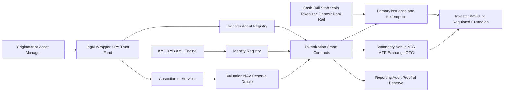
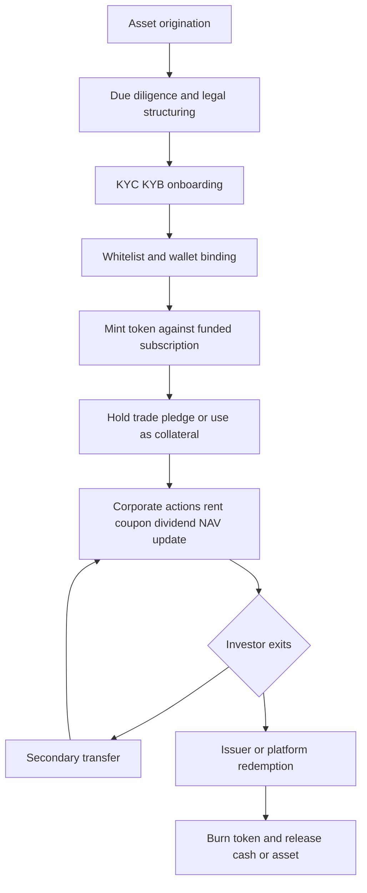
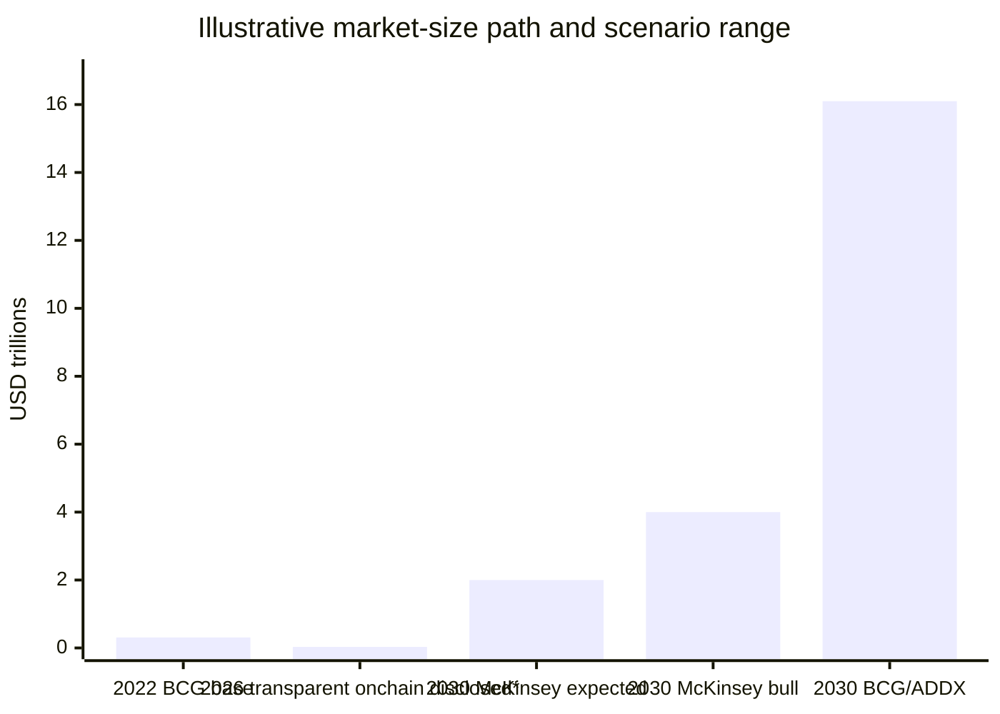
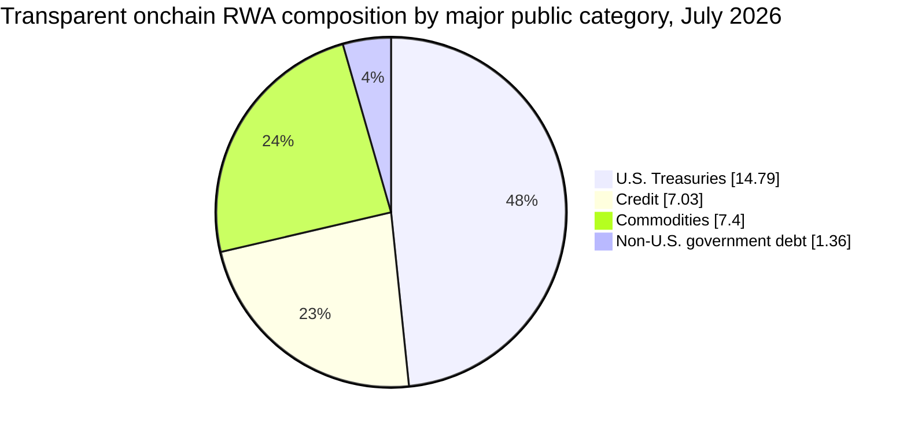

# Real World Asset Tokenization and the RWA Ecosystem

## Executive summary

Real World Asset (RWA) tokenization is best understood as the creation of blockchain-based tokens that represent claims on offchain assets, cash flows, or legal rights. In practice, the market is no longer a single category: it now spans issuer-native tokenized securities, third-party tokenized entitlements, synthetic wrappers, tokenized fund shares, commodity-backed tokens, private credit structures, and experimentally tokenized alternatives such as real estate and art. The most important analytical distinction is not only *what* asset is referenced, but *how* the claim is legally enforced, where the official record of ownership sits, and whether token holders have direct property rights, beneficial interests, or only contractual exposure. The [SEC’s 2026 staff statement](https://www.sec.gov/newsroom/speeches-statements/corp-fin-statement-tokenized-securities-012826-statement-tokenized-securities) is especially useful here because it separates issuer-sponsored tokenized securities from third-party custodial and synthetic models, while [RWA.xyz](https://app.rwa.xyz/) now also distinguishes between “distributed” and “represented” tokenized assets. The market is growing quickly, but unevenly. Transparent onchain categories with the strongest public data are tokenized U.S. Treasuries, non-U.S. government debt, tokenized credit, and commodities. On July 18–19, 2026, [RWA.xyz](https://app.rwa.xyz/) showed about $14.79 billion in tokenized U.S. Treasuries, $1.36 billion in tokenized non-U.S. government debt, $7.03 billion in distributed tokenized credit with $35.69 billion represented value, and $7.40 billion in tokenized commodities. By contrast, real estate and art remain strategically interesting but operationally fragmented and far less transparent at the aggregate level. At the forecast level, [McKinsey](https://www.mckinsey.com/industries/financial-services/our-insights/from-ripples-to-waves-the-transformational-power-of-tokenizing-assets) places 2030 tokenized financial assets around a roughly $2 trillion expected case and up to roughly $4 trillion in a bullish case, while [BCG/ADDX](https://addx.co/files/bcg_ADDX_report_Asset_tokenization_trillion_opportunity_by_2030_de2aaa41a4.pdf) estimate up to $16.1 trillion by 2030 under a much broader scope that includes large pools of illiquid assets. Technically, the winning architectures are converging on a few design principles. First, tokenization works best when the legal wrapper and master record are explicit: SPV, trust, fund, or directly issued security. Second, identity and transfer controls are increasingly embedded at the token layer through permissioned standards such as [ERC-3643](https://eips.ethereum.org/EIPS/eip-3643), while generalized fungibility and composability still rely on [ERC-20](https://eips.ethereum.org/EIPS/eip-20), [ERC-721](https://eips.ethereum.org/EIPS/eip-721), and [ERC-1155](https://eips.ethereum.org/EIPS/eip-1155). Third, custody, oracles, transfer agents, and cross-chain interoperability are no longer “add-ons”; they are the core control surface of the system. That is why current institutional pilots in [Singapore](https://www.mas.gov.sg/-/media/mas/sectors/guidance/guide-on-the-tokenisation-of-capital-markets-products.pdf) and [Hong Kong](https://www.hkma.gov.hk/eng/key-functions/international-financial-centre/fintech/central-bank-digital-currency/) increasingly focus on delivery-versus-payment, tokenized deposits, transfer-agent automation, and cross-ledger orchestration rather than on token issuance alone. The strongest conclusion for a new entrant is therefore architectural, not merely commercial. A credible RWA platform should avoid “token first, legal second” designs. It should instead begin with legal enforceability, bankruptcy remoteness, clearly specified investor rights, regulated custody where appropriate, identity-linked transfer control, independent valuation and reserve attestation, and an explicit liquidity plan across primary issuance, secondary transfer, and redemption. Jurisdiction choice then becomes a product decision: the United States offers deep capital markets but legal fragmentation; the EU is clearer on the split between MiCA and traditional securities law; the UK emphasizes sandboxed market-infrastructure reform; Singapore is highly orchestration-oriented; and Hong Kong is moving quickly on tokenized funds and tokenized-money settlement rails.

## Definitions and taxonomy

A precise working definition is: **RWA tokenization is the issuance of a digital token on a distributed ledger that represents an economic or legal claim on a real-world asset, financial instrument, or enforceable offchain arrangement**. [McKinsey](https://www.mckinsey.com/featured-insights/mckinsey-explainers/what-is-tokenization) defines tokenization as the creation of a digital representation of a real thing, while the [SEC staff statement](https://www.sec.gov/newsroom/speeches-statements/corp-fin-statement-tokenized-securities-012826-statement-tokenized-securities) defines a tokenized security as a financial instrument already within the securities-law definition of “security,” but formatted or represented as a crypto asset whose ownership record is maintained wholly or partly through one or more crypto networks. The most useful taxonomy has at least five dimensions. The first is **asset class**: government debt, private credit and receivables, commodities, real estate, fund shares, equities/private equity, art and collectibles, and specialty finance. [RWA.xyz](https://app.rwa.xyz/asset-screener) now exposes these categories directly in its public screener, including U.S. Treasuries, non-U.S. government debt, credit subtypes, commodities, and real estate. The second is **claim type**: direct ownership, beneficial interest through an SPV or fund, secured claim, unsecured claim, or synthetic performance exposure. The third is **record model**: issuer-native onchain register, transfer-agent-mediated register, or third-party entitlement model. The fourth is **distribution model**: permissionless bearer-like tokens, permissioned whitelisted tokens, or hybrid structures. The fifth is **redemption model**: closed-end trading only, periodic redemption, continuous mint/redeem, or physical delivery. The [SEC’s 2026 taxonomy](https://www.sec.gov/newsroom/speeches-statements/corp-fin-statement-tokenized-securities-012826-statement-tokenized-securities) provides a particularly rigorous legal lens. It distinguishes **issuer-sponsored tokenized securities**, in which the issuer integrates DLT into the master securityholder file, from **third-party tokenized securities**, which split between **custodial tokenized securities** (a crypto asset representing a security entitlement or indirect interest in the underlying security held in custody) and **synthetic tokenized securities** such as linked securities or tokenized security-based swaps. That distinction matters because “tokenization” can describe very different risk bundles: direct legal rights, indirect custodial entitlements, or purely synthetic exposure. A second important analytical distinction comes from [RWA.xyz](https://app.rwa.xyz/blog/a-new-framework-for-tokenized-assets-distributed-and-represented), which separates **distributed** assets from **represented** assets. In plain English, some tokenized assets *are* the primary digital unit used to distribute the exposure to investors, while others merely *represent* an offchain or alternative primary record. This is a helpful refinement because it separates “economic tokenization” from “reference tokenization,” which often have very different liquidity and enforceability properties. For professional analysis, this leads to a compact taxonomy matrix.

| Dimension | Main categories | Why it matters |
|---|---|---|
| Asset class | Debt, credit/receivables, commodities, real estate, art, funds, equity | Determines valuation model, servicing needs, and settlement design |
| Legal claim | Direct title, beneficial interest, receivable claim, security entitlement, synthetic exposure | Determines bankruptcy treatment and investor remedies |
| Token form | Fungible, non-fungible, partitioned/multi-class, permissioned | Determines transferability, portfolio construction, and compliance controls |
| Registry model | Onchain master register, transfer-agent-linked register, external entitlement ledger | Determines the “source of truth” for ownership |
| Redemption model | None, periodic, instant stablecoin redemption, physical delivery | Determines liquidity quality and token economics |
| Compliance model | KYC at onboarding, whitelist at transfer, geo-fencing, investor-class restrictions | Determines addressability and secondary-market design |

The table above synthesizes the [SEC’s tokenized-securities taxonomy](https://www.sec.gov/newsroom/speeches-statements/corp-fin-statement-tokenized-securities-012826-statement-tokenized-securities), Ethereum token standards, and the public classification work now visible in [RWA.xyz](https://app.rwa.xyz/).

## Technical architecture for tokenization

At the contract layer, the standard design choice follows the economic nature of the asset. [ERC-20](https://eips.ethereum.org/EIPS/eip-20) remains the default for fungible claims such as fund shares, gold-backed tokens, and income-distributing debt tokens. [ERC-721](https://eips.ethereum.org/EIPS/eip-721) is better aligned with individually identifiable assets such as a unique title, deed, or artwork. [ERC-1155](https://eips.ethereum.org/EIPS/eip-1155) is useful when a platform needs mixed fungible and non-fungible units in a single contract system. For regulated transfers, [ERC-3643](https://eips.ethereum.org/EIPS/eip-3643) goes further by defining identity registry, compliance, trusted issuer, and claim-topic interfaces for permissioned security-token flows. The legally robust architecture is usually **hybrid**, not purely onchain. The [SEC’s issuer-sponsored model](https://www.sec.gov/newsroom/speeches-statements/corp-fin-statement-tokenized-securities-012826-statement-tokenized-securities) makes clear that even when transfers occur onchain, the issuer or its agent typically associates wallet-level onchain data with offchain information such as the holder’s name and address, and updates a master securityholder file accordingly. In other words, smart contracts are usually the *transaction logic*, not the sole legal record. This is why institutional tokenization stacks typically include: a legal wrapper, an identity layer, a regulated or clearly appointed transfer agent, a custody and safekeeping arrangement for underlying assets when needed, a valuation and reserve-attestation process, and a token contract with compliance hooks. Third-party tokenization adds another layer of complexity. When a third party issues a token backed by securities in custody, the investor may own a **security entitlement** rather than a direct claim against the original issuer. When the third party instead issues a linked token or security-based swap, the investor may have only synthetic exposure. This is the central technical-legal reason to distinguish *native tokenization* from *wrapping*. Two tokens can look operationally similar in a wallet while conferring radically different rights in court. Oracles and cross-chain messaging are now part of production architecture. [Chainlink](https://chain.link/use-cases/tokenized-assets) explicitly frames the tokenized-asset lifecycle as requiring reliable data feeds, automated compliance, and cross-chain interoperability. Its 2026 materials also describe how the Cross-Chain Interoperability Protocol (CCIP) and a Digital Transfer Agent pattern can process subscriptions, redemptions, and other fund-lifecycle events across ledgers. This matches regulatory experimentation in Singapore, where [MAS Project Guardian](https://www.sgpc.gov.sg/api/file/getfile/MAS%20Media%20Release_MAS%20Announces%20Plans%20to%20Support%20Commercialisation%20of%20Asset%20Tokenisation.pdf?path=%2Fsgpcmedia%2Fmedia_releases%2Fmas%2Fpress_release%2FP-20241104-2%2Fattachment%2FMAS+Media+Release_MAS+Announces+Plans+to+Support+Commercialisation+of+Asset+Tokenisation.pdf) papers describe operational frameworks for tokenized funds and fixed income, and in Hong Kong, where [Project Ensemble](https://www.hkma.gov.hk/eng/key-functions/international-financial-centre/fintech/central-bank-digital-currency/) focuses on tokenized-money rails for PvP and DvP settlement.

The lifecycle is best modeled as a controlled state machine rather than a simple mint-and-trade loop.

The practical platform comparison below synthesizes public product descriptions and, where available, public market data.

| Platform or protocol | Core role | Compliance approach | Custody / legal posture | Liquidity approach | Notes |
|---|---|---|---|---|---|
| [Securitize](https://securitize.io/) | End-to-end issuance stack for tokenized securities and funds | Transfer-agent and regulated-market tooling; issuer onboarding and investor controls | Public materials state that Securitize LLC is an SEC-registered transfer agent and Securitize Markets operates an ATS | Primary issuance plus ATS-based secondary trading where eligible | Strongest current footprint in institutional tokenized funds |
| [Ondo](https://ondo.finance/) | Tokenized Treasury products such as OUSG | Investor eligibility controls; qualified-access product design | Exposure delivered through fund/legal wrappers, with 24/7 mint/redeem UX | Fast primary liquidity via stablecoin conversions; venue expansion in Europe | Strong product-market fit for cash-equivalent onchain demand |
| [Centrifuge](https://app.rwa.xyz/platforms/centrifuge) | Onchain credit and fund structuring | Pool- and asset-level rules, underwriting, servicing and investor gating | Typically SPV- and servicer-based credit structures | Institutional credit pools, DeFi integration, structured-fund flows | One of the largest tokenized credit rails by disclosed value |
| [Archax](https://archax.com/) | Regulated digital-asset infrastructure in the UK/EU | AML/KYC and securities-regulation-first design | Positions itself as infrastructure for tokenising, trading, and safekeeping RWAs | Exchange, broker, custodian, tokenisation engine | Best viewed as regulated market infrastructure rather than pure protocol |
| [Taurus](https://www.taurushq.com/) | Enterprise custody, tokenization, and trading software for financial institutions | Enterprise and bank-grade controls | Emphasizes custody plus tokenization modules for institutional deployment | Enables bank and custodian distribution rather than direct retail liquidity | Important enabling stack for banks and fund administrators |
| [Tokeny](https://tokeny.com/the-catalyst-for-institutional-asset-tokenization-prosperity/) / [ERC-3643](https://eips.ethereum.org/EIPS/eip-3643) | Permissioned token framework and operating system | Wallet- and identity-linked transfer restrictions encoded at token level | Strong focus on regulated exchanges and identity-based ownership control | Secondary trading through integrated permissioned venues and partners | Particularly important for Europe-style compliant secondary transfers |

This comparison is based on official product pages, public statements about regulated status, the [ERC-3643](https://eips.ethereum.org/EIPS/eip-3643) specification, and current public RWA analytics.

## Market size and ecosystem structure

The current market is best read as **two overlapping realities**. The first is the **transparent onchain market**, which is easiest to measure and presently dominated by government debt, credit, and commodities. The second is the **broader tokenization opportunity**, which includes many private, permissioned, or quasi-onchain structures that are not visible in fully comparable public datasets. That is why current market snapshots and 2030 forecasts differ so widely in scale. Using the most transparent public categories on [RWA.xyz](https://app.rwa.xyz/), tokenized U.S. Treasuries were about $14.79 billion, non-U.S. government debt about $1.36 billion, tokenized credit about $7.03 billion distributed and $35.69 billion represented, and tokenized commodities about $7.40 billion on July 18–19, 2026. Real estate is present as a listed public category in the RWA screener, but public aggregate value is much less cleanly exposed than in rates, credit, and commodities. Art is even more fragmented and generally lacks a transparent canonical market benchmark.

\*The 2026 bar sums the most transparent public categories available in the cited [RWA.xyz](https://app.rwa.xyz/) pages and therefore **understates** the full market. It does not include stablecoins and does not attempt to estimate opaque or non-comparable private deployments.

Several implications follow from that composition. First, **cash-equivalent and short-duration products** are the clearest early winners because they have simple valuation, strong collateral quality, recurring yield, and low servicing complexity. Second, **credit** can become large, but only when underwriting, servicing, reporting, and workout capacity are institutionalized. Third, **commodities** work when reserve attestations and redemption mechanics are trusted. Fourth, **real estate and art** face a harder path because the token is not enough: investors also need credible asset management, maintenance, insurance, valuation, and dispute-resolution systems. The core asset-class comparison is therefore less about “can this be tokenized?” and more about “what must remain offchain, and at what cost?”

| Asset class | Typical token form | Primary valuation anchor | Operational bottleneck | Current transparent public signal |
|---|---|---|---|---|
| Government debt and MMFs | Fungible fund/share token | NAV, duration, money-market yield | Transfer-agent integration, cash settlement, investor eligibility | Strongest current public category; U.S. Treasuries lead |
| Credit and receivables | Fungible tranche/pool token | DCF, expected loss, collateral quality, servicing performance | Underwriting, servicing, workouts, reporting cadence | Large and growing, but heterogeneous |
| Commodities | Fungible warehouse-backed token | Spot price minus fees and basis | Reserve attestation, storage, redemption logistics | Large, with gold-backed tokens dominating |
| Real estate | Fractional ownership/share token | NOI, cap rate, asset value less costs | Property management, taxes, local law, maintenance | Listed publicly, but aggregate data are less standardized |
| Art and collectibles | Fractional ownership NFT or fund/share structure | Appraisal, auction comps, provenance | Title, authenticity, custody, thin secondary markets | Strategically interesting, still niche and fragmented |
| Public/private equity and fund shares | Fund/share or SPV token | NAV, fund terms, market price, discount to NAV | Securities law, transfer restrictions, cap-table synchronization | Growing fast in institutional channels |

The table synthesizes public analytics, official product materials, and regulator-facing structuring patterns.

## Regulatory and legal frameworks

The **United States** remains the deepest capital market but the most fragmented legally. The strongest current anchor is the [SEC staff statement from January 28, 2026](https://www.sec.gov/newsroom/speeches-statements/corp-fin-statement-tokenized-securities-012826-statement-tokenized-securities), which says tokenized securities are still securities and lays out issuer-sponsored, custodial, and synthetic models. That is helpful because it confirms that tokenization does not erase the underlying legal category. In practice, however, compliance may still touch securities issuance rules, broker-dealer and ATS rules, transfer-agent functions, custody constraints, and AML/KYC obligations. The result is a jurisdiction with enormous commercial upside, but high legal design cost and powerful consequences for getting the wrapper wrong. The **European Union** is more structured conceptually. [MiCA](https://eur-lex.europa.eu/eli/reg/2023/1114/oj/eng) explicitly excludes crypto-assets that qualify as financial instruments, which means many tokenized securities fall **outside MiCA** and remain under the traditional securities regime. At the same time, the [DLT Pilot Regime](https://eur-lex.europa.eu/eli/reg/2022/858/oj/eng) was created to permit certain market infrastructures for trading and settlement of DLT-based financial instruments with targeted exemptions from some legacy rules. The key European difference is thus a clean legal split: crypto-assets under MiCA versus tokenized securities under MiFID-style financial law, with the DLT Pilot acting as an experimentation bridge. The **United Kingdom** sits between experimentation and perimeter clarity. The [FCA](https://www.fca.org.uk/publications/policy-statements/ps19-22-guidance-cryptoassets) has long treated security tokens as likely being inside the regulatory perimeter when they amount to specified investments, and the [Bank of England’s Digital Securities Sandbox](https://www.bankofengland.co.uk/financial-stability/digital-securities-sandbox) now explicitly facilitates the use of distributed-ledger technology in the issuance, trading, and settlement of securities. The UK’s distinctive move is therefore not a separate token law for securities, but a controlled infrastructure sandbox for market transformation. **Singapore** has become one of the most important orchestration jurisdictions. [MAS](https://www.mas.gov.sg/-/media/mas/sectors/guidance/guide-on-the-tokenisation-of-capital-markets-products.pdf) has issued a Guide on the Tokenisation of Capital Markets Products, clarifying the application of securities law to tokenized capital-markets products, while [Project Guardian](https://www.sgpc.gov.sg/api/file/getfile/MAS%20Media%20Release_MAS%20Announces%20Plans%20to%20Support%20Commercialisation%20of%20Asset%20Tokenisation.pdf?path=%2Fsgpcmedia%2Fmedia_releases%2Fmas%2Fpress_release%2FP-20241104-2%2Fattachment%2FMAS+Media+Release_MAS+Announces+Plans+to+Support+Commercialisation+of+Asset+Tokenisation.pdf) has expanded from pilots toward frameworks for tokenized funds, fixed income, tokenized bank liabilities, and settlement architecture. In other words, Singapore’s comparative strength is not merely permissiveness; it is structured public-private experimentation around operational standards. **Hong Kong** has moved quickly on both product authorization and settlement rails. The [SFC’s 2023 circular](https://apps.sfc.hk/edistributionWeb/gateway/EN/circular/doc?refNo=23EC52) on intermediaries engaging in tokenized securities-related activities emphasized the need to manage the new risks of tokenization in a healthy and sustainable way, and the [SFC’s April 2026 package](https://apps.sfc.hk/edistributionWeb/gateway/EN/circular/doc?refNo=26EC23) created a framework aimed at facilitating secondary trading of tokenized SFC-authorized open-ended funds on licensed virtual-asset trading platforms. In parallel, the [HKMA’s Project Ensemble Sandbox](https://www.hkma.gov.hk/eng/news-and-media/press-releases/2024/08/20240828-3/) is explicitly about tokenized-money settlement for tokenized-asset transactions, including PvP and DvP experiments. Hong Kong’s distinctive feature is therefore the pairing of **product-level authorization** with **tokenized-settlement infrastructure**. The jurisdictional comparison below is the practical takeaway.

| Jurisdiction | What tokenized securities are treated as | Main live policy instrument | Distinctive advantage | Main challenge |
|---|---|---|---|---|
| United States | Securities remain securities; multiple tokenization models recognized | Existing securities laws, transfer-agent/ATS/custody path, evolving staff guidance | Deep capital markets and institutional demand | Fragmented implementation and high legal complexity |
| European Union | Financial instruments are outside MiCA; traditional securities law still applies | MiCA plus DLT Pilot Regime | Cleaner boundary between crypto-assets and tokenized financial instruments | Cross-regime coordination and infrastructure scaling |
| United Kingdom | Security tokens generally fall inside perimeter if they are specified investments | Digital Securities Sandbox | Infrastructure reform in a controlled environment | Transition from sandbox to mainstream market structure |
| Singapore | Tokenized capital-markets products fall under existing securities law, with detailed guidance | MAS tokenization guide and Project Guardian | Strong public-private orchestration and settlement innovation | Scaling from pilots to broad cross-border interoperability |
| Hong Kong | Tokenized securities and tokenized investment products addressed through specific SFC circulars | SFC product guidance plus HKMA Project Ensemble | Fast movement on tokenized funds and tokenized-money settlement | Need to prove durable secondary-market depth |

This table synthesizes official regulator and central-bank materials cited above.

## Economics, settlement, interoperability, and risk

The economic design of an RWA token should match the cash-flow structure of the underlying asset. A Treasury or money-market product is naturally a **NAV-based pass-through**. A gold-backed token is a **storage-and-redemption instrument** whose economics track spot gold minus fees, spreads, and operational friction. A receivables pool is fundamentally a **credit product**, so token economics depend on expected loss, servicing quality, and tranche design. Real estate tokens are fundamentally claims on **NOI, appreciation, and residual asset value**, not merely digital coupons. This seems obvious, but it is the source of many mispricings: projects often market fractionalization benefits while under-specifying servicing costs, legal haircuts, or redemption constraints. A practical valuation toolkit looks like this:

$$
P_{\text{bond}}=\sum_{t=1}^{T}\frac{C_t}{(1+y)^t}+\frac{F}{(1+y)^T}
$$

$$
V_{\text{real estate}}=\frac{NOI}{\text{cap rate}}, \qquad
P_{\text{token}}=\frac{V_{\text{real estate}}-D-C}{N}
$$

$$
V_{\text{credit}}=\sum_{t=1}^{T}\frac{\mathbb{E}[CF_t]-\mathbb{E}[Loss_t]}{(1+r+s)^t}
$$

$$
P_{\text{secondary}} \approx NAV \times \left(1-d_{\text{liq}}-d_{\text{legal}}-d_{\text{custody}}-d_{\text{oracle}}\right)
$$

Here, $d$ terms are the discount rates the market applies for frictions specific to tokenized distribution. Those haircuts matter because the token can trade at a discount or premium to economic NAV if redemption is gated, transfer eligibility is narrow, or legal certainty is weak. That is why some products prefer stable-$1 NAV forms with separate yield distribution, while others let token price accrete. Settlement quality is now a differentiator. Hong Kong’s [Project Ensemble](https://www.hkma.gov.hk/eng/key-functions/international-financial-centre/fintech/central-bank-digital-currency/) is explicitly testing interbank tokenized-money rails for PvP and DvP. Singapore’s [Project Guardian](https://www.sgpc.gov.sg/api/file/getfile/MAS%20Media%20Release_MAS%20Announces%20Plans%20to%20Support%20Commercialisation%20of%20Asset%20Tokenisation.pdf?path=%2Fsgpcmedia%2Fmedia_releases%2Fmas%2Fpress_release%2FP-20241104-2%2Fattachment%2FMAS+Media+Release_MAS+Announces+Plans+to+Support+Commercialisation+of+Asset+Tokenisation.pdf) work, together with Chainlink’s [Digital Transfer Agent and CCIP](https://chain.link/use-cases/tokenized-assets) materials, is pushing tokenized funds and commercial paper toward lifecycle automation across ledgers. [BIS](https://www.bis.org/cpmi/publ/d225.htm) has also emphasized that tokenization can create fragmentation and incentive problems around interoperability, and that central banks may need to respond if markets develop in splintered ways. In short, issuance alone is not enough; the next battleground is synchronized cash-and-asset settlement across multiple ledgers and legacy systems. The risk surface is correspondingly multi-layered. The [FSB’s 2024 report](https://www.fsb.org/2024/10/the-financial-stability-implications-of-tokenisation/) is clear that tokenization may bring efficiency and transparency benefits but can also amplify familiar financial-system vulnerabilities, even if current scale is still too small to pose a material systemic threat. The biggest risks today are not exotic cryptography failures; they are the old risks of finance refracted through new infrastructure: weak legal claims, poor underwriting, bad servicing, concentrated custodians, oracle failures, operational outages, sanctions/AML breaches, and shallow secondary liquidity.

| Risk | How it appears in RWA tokenization | Typical controls |
|---|---|---|
| Legal enforceability | Token holders may own a wrapper claim, not the asset itself | Clear legal opinions, SPV/trust structure, investor-rights disclosure, bankruptcy remoteness |
| Counterparty risk | Servicer, issuer, custodian, platform, or transfer-agent failure | Segregation of roles, reserve attestations, independent administrators, replacement rights |
| Custody risk | Loss of private keys or breakdown in safekeeping of underlying assets | Qualified custodians, MPC/HSM controls, asset segregation, audited key management |
| Oracle / data risk | Wrong NAV, reserve, collateral, or event data drive bad token behavior | Independent valuation agents, redundant feeds, manual fallbacks, proof-of-reserve regimes |
| Market / liquidity risk | Wide discounts to NAV due to transfer restrictions or gated redemptions | Market makers, redemption windows, venue strategy, transparent fees and liquidity terms |
| AML/KYC / sanctions risk | Permissionless transfers may violate jurisdictional or investor-class rules | Identity registry, whitelist transfers, geo-fencing, monitoring and travel-rule compliance |
| Smart-contract / operational risk | Bugs, key compromise, bridge failures, upgrade governance mistakes | Audits, formal verification where justified, limited upgradeability, pause and incident plans |

The table above summarizes the risks emphasized by securities regulators, the [FSB](https://www.fsb.org/2024/10/the-financial-stability-implications-of-tokenisation/), and institutional tokenization infrastructure providers.

## Case studies

The current ecosystem is rich enough to illustrate multiple tokenization archetypes, but these case studies also show that success depends far more on legal and operational design than on the token itself.

| Project | Asset class | Structure | Observable outcome | Main lesson |
|---|---|---|---|---|
| [BlackRock BUIDL](https://securitize.io/blackrock/buidl) | Government debt / money-market exposure | Tokenized fund issued through Securitize infrastructure | One of the largest tokenized funds, with public asset value around $2.60B on [RWA.xyz](https://app.rwa.xyz/assets/BUIDL) | Institutional scale comes when wrapper, transfer agent, and distribution are all regulated |
| [Ondo OUSG](https://ondo.finance/ousg) | Short-duration U.S. Treasuries | Qualified-access tokenized Treasury product with 24/7 mint/redeem UX | Strong adoption through stablecoin-linked subscriptions, redemptions, and venue expansion | Onchain demand is strongest for cash-equivalent products with clear redemption mechanics |
| [PAX Gold](https://www.paxos.com/pax-gold) | Commodity-backed gold | Allocated gold-backed fungible token | Long-running large-scale commodity token with monthly transparency reporting and gold lookup tooling | Commodity tokenization works when reserve verification and redemption trust are credible |
| [Centrifuge](https://app.rwa.xyz/platforms/centrifuge) | Credit / asset-backed private credit | SPV- and servicer-based tokenized credit and fund structures | One of the largest tokenized credit platforms in public analytics, with major treasury/credit products listed | Credit can scale onchain, but only with institutional underwriting, servicing, and reporting |
| [RealT](https://realt.co/) | Real estate | Fractional tokenized property interests linked to legal entities and rental income | Durable retail adoption, but major property-management and habitability controversy in Detroit | Real estate tokenization fails if offchain asset management and local compliance fail |
| [Particle](https://www.particle.art/) / [Particle Collection](https://www.particlecollection.com/) | Art | Fractionalized ownership/community model around artworks placed into a nonprofit collection structure | Strong symbolic visibility, but limited public evidence of deep institution-grade secondary liquidity | Art tokenization lives or dies on rights clarity, provenance, custody, and actual buyer depth |

The [BlackRock BUIDL](https://securitize.io/blackrock/buidl) case is highly instructive because it demonstrates what “institutionalized tokenization” looks like. The public materials position Securitize as the tokenization and transfer-agent infrastructure, and [RWA.xyz](https://app.rwa.xyz/assets/BUIDL) shows BUIDL as one of the largest tokenized Treasury products, at roughly $2.60 billion in total asset value. The lesson is that scale came not from decentralization maximalism, but from regulated distribution, a simple underlying asset, and clean economic design. [Ondo OUSG](https://ondo.finance/ousg) shows another successful pattern: a tokenized Treasury sleeve adapted to onchain investors. Ondo’s own product materials emphasize qualified-investor access and 24/7 minting and redemption, while its documentation highlights instant mint/redeem mechanics using stablecoins. The lesson is that liquidity convenience can be a genuine product edge when it is layered on top of a familiar short-duration underlying. [PAX Gold](https://www.paxos.com/pax-gold) is a commodity-tokenization benchmark because Paxos has consistently tied the token to allocated gold, publishes transparency reports, and provides tooling to verify linked gold-bar information. This structure solves the hardest trust problem in commodity tokenization: not price discovery, but proof that the token actually maps to warehouse-controlled assets under a credible operator. [Centrifuge](https://app.rwa.xyz/platforms/centrifuge) illustrates the promise and complexity of private credit. Public analytics show it among the largest tokenized-credit platforms, and its associated products range from treasury-like funds to CLO and credit structures. The lesson is twofold: first, credit can indeed migrate onchain; second, successful migration depends far more on underwriting, collateral perfection, servicer quality, and reporting discipline than on token transferability alone. [RealT](https://realt.co/) is the most useful cautionary real-estate case. The platform’s own proposition is straightforward fractional tokenized real estate with blockchain-based passive income. But a 2026 [WIRED](https://www.wired.com/story/crypto-bros-built-a-real-estate-empire-then-the-homes-started-to-fall-apart) reporting package described severe property-condition problems, Detroit litigation, and stress around halted rental payouts and investor confidence. The lesson is blunt: tokenization does not repair weak property maintenance, local-law noncompliance, or poor servicing. It can actually scale those failures outward to a global investor base. The [Particle](https://www.particle.art/) / [Particle Collection](https://www.particlecollection.com/) case shows why art tokenization remains experimental. The original launch split artwork-related interests into 10,000 NFTs and placed the physical work under a nonprofit collection arrangement; later materials continue to emphasize cultural exhibition and collection stewardship. That is conceptually interesting, but it also shows the core challenge of art tokenization: token design can be elegant even when liquidity, rights scope, and valuation comparables remain narrow.

## Recommended architecture and outlook

For a new RWA platform built for general professional markets, the recommended architecture is **legal-wrapper first, token second**. The preferred design is: originator or asset manager → bankruptcy-remote SPV, trust, or regulated fund → independent custodian or servicer → transfer-agent-linked token issuance → identity-bound compliance at transfer → independent valuation/oracle and reporting → venue strategy for both primary subscription and secondary transfer → deterministic redemption policy. This pattern aligns with the [SEC’s treatment of issuer-sponsored securities](https://www.sec.gov/newsroom/speeches-statements/corp-fin-statement-tokenized-securities-012826-statement-tokenized-securities), the operational direction of [MAS Project Guardian](https://www.sgpc.gov.sg/api/file/getfile/MAS%20Media%20Release_MAS%20Announces%20Plans%20to%20Support%20Commercialisation%20of%20Asset%20Tokenisation.pdf?path=%2Fsgpcmedia%2Fmedia_releases%2Fmas%2Fpress_release%2FP-20241104-2%2Fattachment%2FMAS+Media+Release_MAS+Announces+Plans+to+Support+Commercialisation+of+Asset+Tokenisation.pdf), and the settlement focus of [HKMA’s Project Ensemble](https://www.hkma.gov.hk/eng/key-functions/international-financial-centre/fintech/central-bank-digital-currency/). A high-confidence implementation stack would therefore look like this: [ERC-20](https://eips.ethereum.org/EIPS/eip-20) for fungible fund, debt, and commodity claims; [ERC-3643](https://eips.ethereum.org/EIPS/eip-3643) when regulated transfer controls are integral; a transfer-agent or authoritative registry that binds wallet addresses to verified investor identities; clearly separated custody of underlying assets and custody of private keys; an onchain compliance engine that blocks ineligible transfers; and an interoperability layer for subscriptions, redemptions, and reporting across chains or legacy rails. Where cross-chain functionality is required, treat it as a settlement problem, not only a bridge problem: the bar should be synchronized ownership change plus synchronized cash settlement, preferably under DvP logic. Open research questions remain substantial. The most important are: how to achieve legally final settlement across multiple ledgers; how to standardize tokenized identity and investor portability without leaking sensitive data; how to preserve composability while enforcing securities-law transfer restrictions; how to generate robust secondary liquidity for inherently illiquid assets; how to align tokenized-money rails with regulated deposits, stablecoins, and central-bank money; and how to avoid new concentration risks in custodians, transfer agents, oracle providers, and interoperability layers. [BIS](https://www.bis.org/cpmi/publ/d225.htm) and the [FSB](https://www.fsb.org/2024/10/the-financial-stability-implications-of-tokenisation/) both point to interoperability, concentration, and familiar financial vulnerabilities reappearing in tokenized form. The medium-term outlook is positive, but narrower than “everything will be tokenized.” The most likely durable winners are products where tokenization solves an actual coordination problem: Treasury and money-market distribution, repo and collateral mobility, fund-transfer automation, cross-border settlement, and certain classes of private credit. Real estate and art will remain part of the narrative, but they will not scale institutionally unless offchain asset operations become as programmable and verifiable as the token itself. The realistic future is therefore a layered one: fewer purely speculative wrappers, more regulated tokenized cash and securities, and growing convergence between transfer agents, custodians, market infrastructures, and programmable settlement rails. If one sentence has to summarize the field, it is this: **RWA tokenization is not mainly about putting assets onchain; it is about redesigning the legal, operational, and settlement stack so that the token becomes a reliable control point for rights, cash flows, and market access.** That is why the strongest projects today are not those with the flashiest tokenomics, but those with the cleanest legal wrapper, the best custody and servicing, and the shortest path from token transfer to legally final economic settlement.
