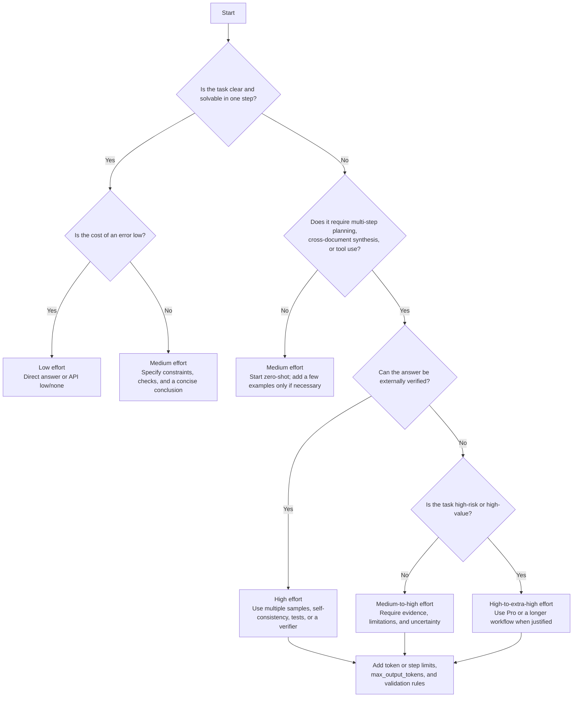

---

layout: post
title: "How Think Effort Works in OpenAI ChatGPT and GPT-5.6 Sol"
date: 2026-07-20
category: AI
---

## Executive Summary

This article maps what the user calls **“ChatGPT (SOL)”** to OpenAI's current **GPT-5.6 Sol** model and its higher-capability ChatGPT option, **GPT-5.6 Sol Pro**. According to OpenAI's current documentation, the **Medium, High, and Extra High** reasoning levels in ChatGPT are powered by GPT-5.6 Sol, while **Pro** is powered by GPT-5.6 Sol Pro. On eligible paid plans, ChatGPT can also automatically switch a complex request from Instant to Medium reasoning. Therefore, “think effort” is not merely an abstract idea in the current OpenAI product: it is an adjustable level of **reasoning investment** and **test-time compute** ([OpenAI, “GPT-5.6 in ChatGPT”](https://help.openai.com/en/articles/20001354-gpt-56-in-chatgpt/)).

Technically, OpenAI does not describe “think effort” as consciousness or genuine human thought. It refers to the amount of internal reasoning computation that a model performs before producing its visible answer. In the API, `reasoning.effort` controls how much reasoning work the model performs. Higher settings usually improve quality on difficult tasks, but also increase latency and token usage. GPT-5.6 supports `none`, `low`, `medium`, `high`, `xhigh`, and `max`; it also provides a separate `reasoning.mode` control for `standard` and `pro` execution ([OpenAI model guidance](https://developers.openai.com/api/docs/guides/latest-model)).

OpenAI does not expose the model's raw internal chain of thought. A product or API may provide a model-generated reasoning summary, but this is not the complete internal reasoning trace. OpenAI has explained that raw chain-of-thought is kept hidden partly because it may be useful for model monitoring and because an unfiltered internal trace should not be treated as a user-facing explanation ([OpenAI, “Learning to reason with LLMs”](https://openai.com/index/learning-to-reason-with-llms/)).

From the perspective of research history, modern reasoning capability does not come from one isolated technique. It is built from multiple layers:

* Pretraining provides broad knowledge, language patterns, and latent problem-solving capabilities.
* Instruction tuning and reinforcement learning from human feedback make the model more likely to follow human intent.
* Chain-of-thought prompting, scratchpads, self-consistency, verifiers, and process supervision improve reasoning by eliciting, searching, checking, or selecting intermediate solutions.
* OpenAI's o1 work went further by training models with large-scale reinforcement learning to perform productive internal reasoning before answering. OpenAI reported that performance improved both with more reinforcement-learning compute during training and with more thinking time during inference ([OpenAI, “Learning to reason with LLMs”](https://openai.com/index/learning-to-reason-with-llms/)).

For practical users, the most important conclusion is that **higher think effort is not always better**. It should be matched to the task's error cost, number of dependent steps, ambiguity, and verifiability. Mathematics, planning, software architecture, and multi-document analysis often justify more reasoning. Classification, rewriting, formatting conversion, and simple factual questions usually do not.

A further practical difference separates early chain-of-thought research from current OpenAI reasoning models. For earlier or non-reasoning models, prompting the model to “think step by step” could materially improve performance. For current reasoning models, OpenAI recommends lean, outcome-focused prompts and says that users do not need to ask the model to “think harder” or expose its full chain of thought. A better prompt states the objective, relevant context, hard constraints, required evidence, success criteria, and output format ([OpenAI model guidance](https://developers.openai.com/api/docs/guides/latest-model)).

Higher reasoning effort also has cost and context implications. Reasoning work contributes to output-token usage and consumes part of the available generation budget. A single request may use relatively few internal reasoning tokens or a very large number, depending on difficulty and configuration. Higher effort may improve correctness, search quality, verification, and robustness in many settings, but it is **not a guarantee of calibration** and cannot replace external verification.

The cost and latency estimates later in this report use the following assumptions: the user has not specified a fixed model size, budget, or tool workflow. The cost examples therefore use OpenAI's current public API prices for GPT-5.6 Sol, Terra, and Luna, and treat reasoning work as output-side usage. Latency ranges are planning estimates rather than OpenAI service-level guarantees ([OpenAI GPT-5.6 launch](https://openai.com/index/gpt-5-6/)).

## Concepts and Classification

### How ChatGPT and Sol Currently Correspond

OpenAI positions GPT-5.6 Sol as its flagship model for complex professional work, including complex reasoning and coding. In ChatGPT, users see a simplified set of reasoning choices:

* **Medium**: standard reasoning effort.
* **High**: extended reasoning effort.
* **Extra High**: the highest reasoning effort available through GPT-5.6 Sol in ChatGPT.
* **Pro**: GPT-5.6 Sol Pro, intended for more difficult tasks and longer-running workflows.

The important product-design point is that the user selects a reasoning level in the interface, while the system translates that choice into differences in model execution and test-time compute. Eligible paid plans may also automatically switch an Instant request to Medium when the request requires more reasoning ([OpenAI, “GPT-5.6 in ChatGPT”](https://help.openai.com/en/articles/20001354-gpt-56-in-chatgpt/)).

The API exposes more granular controls. Across OpenAI model generations, supported effort values can include `none`, `minimal`, `low`, `medium`, `high`, `xhigh`, and `max`, depending on the model. GPT-5.6 specifically supports:

```text
none, low, medium, high, xhigh, max
```

GPT-5.6 also separates two controls:

* `reasoning.effort`: how much reasoning work to perform.
* `reasoning.mode`: whether to use `standard` or `pro` execution.

These are independent controls. One determines the depth of reasoning within the selected execution mode; the other determines whether the request uses the standard or more compute-intensive Pro process. In the API, Pro mode is enabled on the same GPT-5.6 model with `reasoning.mode: "pro"`; it is not selected through a separate API model slug ([OpenAI model guidance](https://developers.openai.com/api/docs/guides/latest-model)).

### Chain of Thought, Step-by-Step Reasoning, Scratchpads, and Internal Versus External Reasoning

**Chain of thought (CoT)** is defined in the research literature as a sequence of intermediate reasoning steps produced to solve a problem. The classic paper by Wei et al. showed that providing demonstrations containing intermediate reasoning can substantially improve performance on arithmetic, commonsense, and symbolic-reasoning tasks ([Wei et al., 2022](https://arxiv.org/abs/2201.11903)). The key idea is not merely to make the answer longer; it is to create an intermediate computational trajectory before the final answer.

**Step-by-step reasoning** is a broader description. It refers to any method that decomposes a problem into intermediate stages. Those stages may be expressed as natural-language CoT, a structured scratchpad, symbolic transformations, code execution, or another form of intermediate computation. Kojima et al. showed that, for earlier large language models, adding a simple phrase such as “Let's think step by step” could substantially improve zero-shot performance on several reasoning benchmarks ([Kojima et al., 2022](https://arxiv.org/abs/2205.11916)).

A **scratchpad** overlaps with CoT but is not exactly the same. It acts more like a temporary workspace. The model may write intermediate arithmetic, partial results, program-execution state, or symbolic transformations. Nye et al. showed that scratchpads substantially improve performance on tasks requiring unbounded multi-step computation, such as long addition and program execution ([Nye et al., 2021](https://arxiv.org/abs/2112.00114)). In this sense, a scratchpad emphasizes the externalization of intermediate computational state, whereas natural-language CoT emphasizes a verbal reasoning narrative.

For modern OpenAI reasoning models, it is essential to distinguish **external CoT** from **internal CoT**:

* **External CoT** is a visible explanation, scratchpad, worked example, or sequence of reasoning steps shown to the user.
* **Internal CoT** is the model's hidden reasoning process before it produces the visible response.

OpenAI has stated that it does not show users the raw internal chain of thought. Instead, it may provide a model-generated summary containing useful ideas from the reasoning process ([OpenAI, “Learning to reason with LLMs”](https://openai.com/index/learning-to-reason-with-llms/)). A reasoning summary is therefore not the raw internal trace and should not be interpreted as a complete audit log.

This distinction creates an important practical difference. External CoT prompting is a useful historical and research technique, especially for earlier or non-reasoning models. Current OpenAI reasoning models already perform internal reasoning. OpenAI's present guidance therefore favors lean, outcome-focused prompts rather than repeatedly instructing the model to “think step by step,” “think harder,” or reveal its complete reasoning. The modern product mechanism is primarily **internal reasoning**, not a requirement to print a visible CoT ([OpenAI model guidance](https://developers.openai.com/api/docs/guides/latest-model)).

## Training and the Formation of Reasoning Ability

### Pretraining, Instruction Tuning, and RLHF

The first layer of reasoning ability still comes from **pretraining**. OpenAI's o1 system documentation describes training data drawn from publicly available data, proprietary data obtained through partnerships, and internally developed datasets, including reasoning-oriented data and scientific literature ([OpenAI o1 System Card](https://openai.com/index/openai-o1-system-card/)). A reasoning model is therefore not created by adding a small rule layer to an otherwise empty system. It first learns a compressed representation of language, knowledge, and recurring structures from large-scale data, and then receives additional alignment and reasoning training.

Pretraining alone does not ensure that a model will reliably follow human instructions. The InstructGPT work systematized **supervised instruction tuning** and **reinforcement learning from human feedback (RLHF)**. OpenAI first collected human-written demonstrations for supervised fine-tuning, then collected rankings of candidate model outputs to train a reward model, and finally optimized the policy using reinforcement learning. OpenAI described this process as making capabilities that were already latent in the pretrained model easier to elicit and control, rather than necessarily teaching every capability from zero ([OpenAI, “Aligning language models to follow instructions”](https://openai.com/index/instruction-following/); [Ouyang et al., 2022](https://arxiv.org/abs/2203.02155)).

OpenAI's reasoning-model work extends this approach. The o1 family was described as being trained with a **large-scale reinforcement-learning algorithm** that teaches the model to reason productively using its internal chain of thought. During this process, the model learns to refine its strategy, recognize and correct mistakes, decompose difficult steps, and try another approach when its current approach is not working. OpenAI reported that o1 performance improved smoothly with both additional training-time reinforcement-learning compute and additional test-time reasoning compute ([OpenAI, “Learning to reason with LLMs”](https://openai.com/index/learning-to-reason-with-llms/)).

### CoT Prompting, Self-Consistency, Verifiers, and Process Supervision

In the history of reasoning research, **few-shot CoT prompting** was one of the first techniques to unlock large gains in multi-step reasoning. **Zero-shot CoT** then showed that some of the capability was already present but underused: a very small prompt change could elicit a more structured reasoning process from earlier models ([Wei et al., 2022](https://arxiv.org/abs/2201.11903); [Kojima et al., 2022](https://arxiv.org/abs/2205.11916)). The deeper lesson was not merely that a particular phrase was magical. It was that the model could contain reasoning capability that needed an appropriate external structure to become reliable.

The next improvement came from **searching and selecting among multiple paths**. Self-consistency does not accept only one greedy reasoning trajectory. It samples multiple diverse reasoning paths and selects the answer that receives the most consistent support. Wang et al. reported substantial improvements on GSM8K, SVAMP, AQuA, StrategyQA, and ARC-Challenge ([Wang et al., 2022](https://arxiv.org/abs/2203.11171)). The intuition is straightforward: a difficult problem may admit several plausible reasoning routes, and relying only on the first route is fragile.

A related approach uses a **verifier or reranker**. OpenAI's GSM8K work generated many candidate solutions at test time, evaluated them with a trained verifier, and selected the highest-ranked candidate. Verification improved performance substantially and scaled more effectively with additional data than a simple fine-tuning baseline ([Cobbe et al., 2021](https://arxiv.org/abs/2110.14168); [OpenAI, “Solving math word problems”](https://openai.com/index/solving-math-word-problems/)).

These approaches share a general pattern:

```text
generate multiple candidates
→ evaluate or test the candidates
→ select the best-supported answer
```

The gain does not come solely from producing more text. It comes from applying more computational search and stronger selection pressure at inference time.

### Rationale Supervision, Process Supervision, and Self-Improvement

If a system must learn not only to select a correct final answer but also to follow a more reliable process, it needs feedback on intermediate steps. **Process supervision** assigns feedback to individual reasoning steps rather than rewarding only the final outcome. OpenAI's mathematical-reasoning research reported that process supervision outperformed outcome supervision in the studied setting and could improve both capability and alignment by directly rewarding reasoning steps that humans considered valid ([OpenAI, “Improving mathematical reasoning with process supervision”](https://openai.com/index/improving-mathematical-reasoning-with-process-supervision/)).

**STaR**, or Self-Taught Reasoner, provides a more scalable form of rationale supervision. It begins with a small number of rationale examples, asks the model to generate rationales for additional problems, and retains rationales that lead to correct answers. When an answer is initially wrong, the method can condition on the correct answer to regenerate a more useful rationale. The resulting rationales are added to the training set and the process is repeated. In this way, the model bootstraps improved reasoning ability from its own successful reasoning traces ([Zelikman et al., 2022](https://arxiv.org/abs/2203.14465)).

### Implicit and Latent Reasoning

Recent research has proposed that the best form of reasoning may not always be written in human language. **Implicit Chain of Thought Reasoning via Knowledge Distillation** distills explicit CoT from a teacher model into hidden-state computation in a student model. Instead of reasoning horizontally by producing words one at a time, the model performs part of the computation vertically across hidden layers. The authors reported that the method solved tasks that could not be solved without explicit CoT while running at a speed closer to no-CoT inference ([Deng et al., 2023](https://arxiv.org/abs/2311.01460)).

**Coconut**, or Chain of Continuous Thought, goes further. It treats the model's final hidden state as a continuous reasoning state and feeds it back as the next input embedding instead of decoding it immediately into a word. The authors reported that this latent reasoning representation can preserve multiple possible next steps and display a breadth-first-search-like behavior. On some logical planning tasks requiring substantial backtracking, Coconut achieved a better accuracy-efficiency tradeoff than textual CoT ([Hao et al., 2024](https://arxiv.org/abs/2412.06769)).

This remains a research frontier, but it reinforces a central distinction: **a visible step-by-step explanation is not necessarily identical to the underlying computation that produced the answer**.

### Comparison of Methods and Tradeoffs

| Method                   | Core approach                                                           | Best-suited situations                                | Main advantages                                    | Main costs and risks                                           |
| ------------------------ | ----------------------------------------------------------------------- | ----------------------------------------------------- | -------------------------------------------------- | -------------------------------------------------------------- |
| Direct answer            | Produce one answer without requiring intermediate steps                 | Simple Q&A, classification, rewriting                 | Fastest and cheapest                               | Fragile on multi-step problems                                 |
| Zero-shot CoT            | Use a short instruction to elicit stepwise reasoning                    | Earlier or non-reasoning models                       | Easy and inexpensive to deploy                     | May be redundant or harmful for modern reasoning models        |
| Few-shot CoT             | Provide demonstrations containing reasoning steps                       | Stable tasks with representative examples             | A classic and effective elicitation technique      | Longer prompts and risk of overfitting to examples             |
| Scratchpad               | Write intermediate computational state                                  | Arithmetic, program execution, state-transition tasks | Especially useful for multi-step computation       | Longer output and possible interference with final formatting  |
| Self-consistency         | Sample multiple reasoning paths and select the consensus answer         | Tasks with a unique, verifiable answer                | Can substantially improve accuracy                 | Cost and latency multiply with sample count                    |
| Verifier / reranker      | Generate multiple candidates, then score and reorder them               | Mathematics, code, and testable tasks                 | More robust than a single trajectory               | Requires a verifier or external testing system                 |
| Process supervision      | Give feedback or rewards to intermediate steps                          | High-risk reasoning and mathematics                   | Can improve capability and alignment together      | Expensive annotation and uncertain cross-domain generalization |
| Large-scale reasoning RL | Train the model to perform longer and more effective internal reasoning | Frontier reasoning models                             | Converts test-time compute into higher performance | Latency, cost, interpretability, and monitoring challenges     |
| Implicit / latent CoT    | Reason in hidden states rather than textual steps                       | Experimental efficient reasoning                      | May reduce token use and improve search            | Harder to supervise, interpret, and audit                      |

The comparison above synthesizes the findings of CoT prompting, zero-shot CoT, STaR, scratchpads, self-consistency, process supervision, OpenAI's reasoning documentation, and latent-reasoning research. The recommendation against forcing explicit CoT from modern OpenAI reasoning models follows OpenAI's current prompting guidance rather than the assumptions of early CoT research ([OpenAI model guidance](https://developers.openai.com/api/docs/guides/latest-model)).

## Why Higher Think Effort Can Improve Performance

### The Core Mechanism Is a Reallocation of Test-Time Compute

The most direct technical interpretation of think effort is not that the model suddenly gains a deeper architecture or a mysterious mind. It is that the system allocates more inference-time computation and more internal reasoning capacity to the same task.

With more reasoning work, a model has more opportunity to:

* decompose the prompt;
* form a plan;
* compare alternative approaches;
* call and interpret tools;
* recover from ambiguity;
* review assumptions;
* detect contradictions;
* verify a candidate result;
* complete a long sequence of dependent steps.

From a research perspective, this converts a one-pass decision into a longer process that can search, revise, and validate. Snell et al. showed that adaptively allocating test-time compute according to problem difficulty can be substantially more efficient than simple best-of-N sampling. Under compute-matched conditions, a smaller model with an effective test-time compute strategy could outperform a model fourteen times larger on some problems for which the smaller model had a non-zero chance of success ([Snell et al., 2024](https://arxiv.org/abs/2408.03314)).

### Higher Effort Usually Produces Gains Through Three Paths

#### 1. More Complete Decomposition and Review

Additional reasoning capacity gives the model a greater chance of constructing a stable intermediate representation of the problem and reviewing earlier assumptions. This is particularly useful when requirements are ambiguous, evidence is distributed across documents, or later steps depend on earlier conclusions.

#### 2. Multi-Path Search and Consensus

OpenAI's o1 results on AIME illustrated the value of multiple samples and selection. On the 2024 AIME evaluation, OpenAI reported approximately 74% average `pass@1`, 83% consensus accuracy with 64 samples, and 93% when reranking 1,000 samples with a learned scoring function ([OpenAI, “Learning to reason with LLMs”](https://openai.com/index/learning-to-reason-with-llms/)).

This gap does not merely show that longer text is better. It demonstrates the value of exploring multiple candidate paths and applying a stronger selection mechanism.

#### 3. External Verification and Executable Testing

Tasks that can be checked benefit greatly from a generate-test-select loop. In code generation, the HumanEval work found that repeated sampling dramatically increased the probability of producing at least one correct program: the reported result increased from 28.8% at `pass@1` to 70.2% at `pass@100` for the relevant model configuration ([Chen et al., 2021](https://arxiv.org/abs/2107.03374)).

The same general principle appears in GSM8K verifiers and process-supervised mathematical reasoning: when answers can be tested, increased reasoning is most useful when it is connected to an external criterion that can reject incorrect candidates.

### Safety, Robustness, and Monitorability Are Two-Sided

Higher inference-time compute can improve robustness in some adversarial settings because the model has more opportunity to apply safety rules, inspect the request, and avoid a shallow failure mode. OpenAI's deliberative-alignment work explicitly trains reasoning models to reason over safety specifications before answering, improving their ability to apply policies in difficult cases ([OpenAI, “Deliberative alignment”](https://openai.com/index/deliberative-alignment/)).

However, higher reasoning effort does not automatically produce explainability. OpenAI keeps raw CoT hidden partly because it may be valuable for detecting model misbehavior, while an externally optimized or filtered CoT may become less useful as a monitoring signal ([OpenAI, “Detecting misbehavior in frontier reasoning models”](https://openai.com/index/chain-of-thought-monitoring/)).

OpenAI has also reported that current frontier reasoning models are relatively poor at deliberately controlling their chain of thought to satisfy arbitrary concealment constraints, although this remains an open question as models become more capable ([OpenAI, “Reasoning models struggle to control their chains of thought, and that's good”](https://openai.com/index/reasoning-models-chain-of-thought-controllability/)).

The best current interpretation is therefore:

> More think effort often improves capability and can improve some aspects of robustness, but the question of what the model is internally computing and how reliably that process can be monitored remains open.

## How to Choose and Control Reasoning Effort

### Decision Process for Selecting an Effort Level



This decision flow combines OpenAI's current guidance for `none`, `low`, `medium`, `high`, `xhigh`, and `max` with research techniques such as self-consistency, verifiers, and executable tests ([OpenAI model guidance](https://developers.openai.com/api/docs/guides/latest-model)).

### Practical Choices by Task Type

For **short factual answers, annotation, classification, transcription, rewriting, and format conversion**, high reasoning effort is usually unnecessary. The main requirement is stable language understanding and output control rather than deep planning. `none` or `low` is appropriate when latency and volume matter and the task does not benefit from extended reasoning.

For **general data analysis, short programs, ordinary customer support, and search-result summarization**, `low` to `medium` is a reasonable starting point. Low effort can support efficient tool use, planning, search, and short multi-step decisions. Medium is OpenAI's balanced default for most workloads ([OpenAI model guidance](https://developers.openai.com/api/docs/guides/latest-model)).

For **mathematical proofs, competition problems, multi-file code understanding, system design, long-horizon planning, and cross-document synthesis**, `high` or a higher setting should be considered. These tasks require more branching, error correction, and consistency checking. When the answer can be tested, higher effort should be combined with unit tests, independent calculations, source checks, or a verifier.

For **commonsense reasoning and multi-step question answering**, the correct level depends on whether the problem contains genuine dependent inference. A long question whose answer is retrieved from memory may not need high effort. A problem involving conflicting evidence, missing information, document comparison, or a long inference chain is much more likely to benefit.

### Effective Ways to Control Think Effort

For current OpenAI reasoning models, the best starting prompt is usually short, clear, and direct. State:

* the objective;
* the relevant context;
* the hard constraints;
* the allowed tools or actions;
* the evidence required;
* the success criteria;
* the requested output format.

OpenAI's current guidance specifically recommends leaner prompts and says that Pro mode does not require instructions such as “use Pro mode,” “think harder,” or “generate several candidate answers” ([OpenAI model guidance](https://developers.openai.com/api/docs/guides/latest-model)).

In the API, reasoning depth can be controlled directly:

```json
{
  "model": "gpt-5.6-sol",
  "reasoning": {
    "effort": "high",
    "mode": "standard"
  }
}
```

For a quality-first request using Pro execution:

```json
{
  "model": "gpt-5.6-sol",
  "reasoning": {
    "effort": "high",
    "mode": "pro"
  }
}
```

`reasoning.effort` and `reasoning.mode` should be evaluated independently. OpenAI recommends using `medium` as a balanced starting point, `low` for latency-sensitive work, `high` or `xhigh` only when evaluation shows a quality gain, and `max` for the hardest quality-first workloads. Pro mode should be used selectively when a marginal reliability improvement materially affects the outcome ([OpenAI model guidance](https://developers.openai.com/api/docs/guides/latest-model)).

To limit cost and total generation, use `max_output_tokens`. The model's internal reasoning work and visible answer share the request's generation budget. If the budget is too small, the request can terminate before a complete visible answer is produced.

When building an external workflow that simulates higher effort, the most effective techniques are usually not instructions demanding a very long explanation. Better options include:

* sampling several independent candidates;
* self-consistency voting;
* reranking candidates;
* unit tests or executable checks;
* retrieval and citation verification;
* cross-model or independent review;
* explicit stopping rules and validation criteria.

### Prompt Templates for Low, Medium, and High Effort

The following templates preserve the original Traditional Chinese use case. They intentionally follow OpenAI's current guidance for reasoning models: they request quality controls and concise reviewable summaries without asking for the complete internal chain of thought.

#### Low Effort

```text
Please give me the final answer directly in Traditional Chinese.
If the problem does not require multi-step reasoning, do not provide a lengthy explanation.

Output format:
1. Conclusion
2. One-sentence reason
```

#### Medium Effort

```text
Please answer in Traditional Chinese.
Goal: balance accuracy and speed.

Requirements:
- Determine which key steps are needed to solve the problem.
- Output only the necessary summary-level steps; do not expose complete internal reasoning.
- Clearly mark any uncertainty.
- End with a concise conclusion and recommendation.

Output format:
1. Problem breakdown
2. Key judgments
3. Final answer
4. Uncertainty
```

#### High Effort

```text
Please complete this task in Traditional Chinese, prioritizing accuracy over speed.
Reason and check thoroughly internally before producing the result. Do not expose complete internal reasoning; provide only a high-level summary that I can review.

Task requirements:
- Proactively identify ambiguities, counterexamples, failure modes, and boundary conditions.
- If several approaches are feasible, compare their tradeoffs.
- If the answer is verifiable, include a verification method or test checklist.
- If information is insufficient, identify the gap and state the minimum additional information required.

Output format:
1. Restatement of the problem
2. Comparison of approaches
3. Recommended approach
4. Validation checklist
5. Risks and assumptions
```

For older or non-reasoning models, few-shot CoT or zero-shot CoT may still improve reasoning. For current OpenAI reasoning models, it is generally better to adjust `reasoning.effort`, improve task specifications, add external verification, and increase candidate or test coverage rather than force the model to print its full CoT.

### Recommended Best Practices

The most robust default is to begin with `medium`, or ChatGPT's Medium setting, and increase effort only when the task has one or more of the following properties:

* a high cost of error;
* several dependent reasoning steps;
* meaningful ambiguity;
* cross-document synthesis;
* complex tool use;
* a verifiable result where additional search or testing can improve selection;
* high value that justifies greater latency and cost.

This is consistent with OpenAI's recommendation to use `medium` as a balanced starting point, reserve `high` and `xhigh` for workloads showing a measured quality gain, and reserve `max` for the hardest quality-first cases ([OpenAI model guidance](https://developers.openai.com/api/docs/guides/latest-model)).

Second, **do not interpret think effort as a confidence score**. More effort may raise average accuracy, but a model can still be confidently wrong. Benchmark work has repeatedly shown that capability and calibration do not improve at the same rate. For high-risk work, increased effort should be coupled with retrieval, citations, independent checking, or executable tests.

Third, use **test-driven reasoning** whenever possible:

* test generated code with unit tests;
* check mathematics with an independent calculation;
* verify document claims against quoted source passages;
* validate structured data against a schema;
* compare a recommendation against explicit acceptance criteria.

This is more controllable than simply asking a model to “think more,” because it converts additional reasoning into decisions that can be accepted or rejected by an external criterion.

Fourth, reasoning summaries and persisted reasoning can improve multi-turn continuity, but they must not be mistaken for raw CoT. GPT-5.6 can make prior reasoning items available across turns through `reasoning.context`, but these are system-managed reasoning artifacts rather than a complete user-auditable transcript ([OpenAI model guidance](https://developers.openai.com/api/docs/guides/latest-model)).

## Evaluation, Cost, and Limitations

### Evaluation Metrics and Benchmarks

Reasoning quality should not be evaluated only by whether an answer sounds plausible. The correct metric depends on the task.

For mathematics and short-answer tasks, common metrics include **exact-match accuracy** and `pass@1`. For multi-sample reasoning, OpenAI has reported `cons@64`, which measures the answer selected through consensus among 64 samples. The difference among `pass@1`, `cons@64`, and large-scale reranking is a direct way to measure the marginal value of additional test-time compute ([OpenAI, “Learning to reason with LLMs”](https://openai.com/index/learning-to-reason-with-llms/)).

Important benchmarks include:

* **GSM8K**: 8,500 grade-school mathematics word problems designed to evaluate multi-step arithmetic reasoning ([Cobbe et al., 2021](https://arxiv.org/abs/2110.14168)).
* **MATH**: 12,500 competition-level mathematics problems with full step-by-step solutions ([Hendrycks et al., 2021](https://arxiv.org/abs/2103.03874)).
* **BIG-bench**: 204 diverse tasks intended to probe a broad range of language-model capabilities ([Srivastava et al., 2022](https://arxiv.org/abs/2206.04615)).
* **MMLU**: 57 subjects covering broad knowledge and problem solving ([Hendrycks et al., 2020](https://arxiv.org/abs/2009.03300)).
* **HumanEval**: 164 hand-written Python programming tasks evaluated with unit tests ([Chen et al., 2021](https://arxiv.org/abs/2107.03374)).

These benchmarks measure different aspects of performance and should not be collapsed into one universal reasoning score.

Benchmarks also lose discriminating power over time. OpenAI noted that frontier models had become very strong on GSM8K and MATH and therefore used harder evaluations such as AIME to distinguish newer reasoning models ([OpenAI, “Learning to reason with LLMs”](https://openai.com/index/learning-to-reason-with-llms/)). Benchmark labels can also be imperfect. The MMLU-Redux study estimated that a meaningful fraction of MMLU questions contain errors and demonstrated that correcting them can change measured model performance ([Gema et al., 2024](https://arxiv.org/abs/2406.04127)).

A product team should therefore build an evaluation suite that resembles its real workload rather than relying only on a public leaderboard.

### Cost and Latency Estimates

OpenAI's current public API prices are:

| Model         | Input per 1M tokens | Output per 1M tokens |
| ------------- | ------------------: | -------------------: |
| GPT-5.6 Sol   |               $5.00 |               $30.00 |
| GPT-5.6 Terra |               $2.50 |               $15.00 |
| GPT-5.6 Luna  |               $1.00 |                $6.00 |

These prices are published in OpenAI's GPT-5.6 launch materials and model documentation ([OpenAI GPT-5.6 launch](https://openai.com/index/gpt-5-6/); [GPT-5.6 Sol model page](https://developers.openai.com/api/docs/models/gpt-5.6-sol)).

A useful cost approximation is:

$$
C_{\text{total}}
\approx
T_{\text{input}}R_{\text{input}}
+
\left(T_{\text{visible}}+T_{\text{reasoning}}\right)R_{\text{output}}
+
C_{\text{tools}}.
$$

where:

* $$T_{\text{input}}$$ is the number of input tokens;
* $$R_{\text{input}}$$ is the input-token rate;
* $$T_{\text{visible}}$$ is the visible answer-token count;
* $$T_{\text{reasoning}}$$ is the reasoning-work token count reported or billed on the output side;
* $$R_{\text{output}}$$ is the output-token rate;
* $$C_{\text{tools}}$$ is the cost of search, code execution, computer use, or other tool calls.

OpenAI does not publish a fixed mapping from each effort level to a specific number of reasoning tokens. The following table is therefore a **non-official planning estimate**, preserving the assumptions of the original report. It assumes that visible answer length is approximately constant and that the main incremental cost comes from reasoning usage without additional tool calls.

| Reasoning effort  | Estimated reasoning tokens | Additional Sol cost per request | Additional Terra cost per request | Additional Luna cost per request | Relative latency  |
| ----------------- | -------------------------: | ------------------------------: | --------------------------------: | -------------------------------: | ----------------- |
| Low               |                  500–2,000 |              about $0.015–$0.06 |               about $0.0075–$0.03 |              about $0.003–$0.012 | Low to medium     |
| Medium            |                2,000–8,000 |               about $0.06–$0.24 |                 about $0.03–$0.12 |              about $0.012–$0.048 | Medium            |
| High              |               8,000–20,000 |               about $0.24–$0.60 |                 about $0.12–$0.30 |               about $0.048–$0.12 | Medium to high    |
| Extra High or Max |              20,000–60,000 |               about $0.60–$1.80 |                 about $0.30–$0.90 |                about $0.12–$0.36 | High to very high |

This table is not an OpenAI guarantee. It is derived from two known relationships: higher effort generally performs more model work, and the additional work is reflected in token usage billed at the selected model's standard rates.

For ChatGPT Business and Enterprise/Edu flexible pricing, OpenAI's current rate card states that Medium, High, and Extra High all use GPT-5.6 Sol and have the same per-message credit rate. Selecting a higher reasoning effort does not increase that per-message credit rate, although it can still increase waiting time and internal compute. Pro uses GPT-5.6 Sol Pro and carries a higher per-message credit rate ([OpenAI ChatGPT Rate Card](https://help.openai.com/en/articles/11481834-chatgpt-rate-card-business-enterprise-edu)).

The most reliable latency conclusion is qualitative rather than a fixed number of seconds:

* higher effort is generally slower;
* Pro mode is generally slower than standard mode;
* multiple samples and verification increase latency and cost;
* a generation budget that is too small can prevent the model from producing a complete visible answer;
* latency should be measured on representative production requests rather than inferred from benchmark averages.

OpenAI recommends comparing model, effort, and mode configurations on the same representative tasks and measuring task success, completeness, required evidence, total tokens, latency, and cost. The highest effort should not be assumed to be the best configuration without evaluation ([OpenAI model guidance](https://developers.openai.com/api/docs/guides/latest-model)).

### Main Limitations and Open Research Questions

#### 1. Faithfulness

A visible explanation is not necessarily a faithful causal account of the internal computation that produced the answer. A model can provide a plausible rationale after reaching an answer through a different internal process. OpenAI's choice not to expose raw CoT and to provide summaries instead reinforces this distinction. A user-facing explanation can be useful, but it should not be treated as a complete record of the model's internal mechanism.

#### 2. Higher Effort Does Not Guarantee Calibration or Eliminate Hallucinations

A reasoning model may hallucinate less on some evaluations while remaining wrong or overconfident on others. Higher effort can reduce some classes of error, but it cannot replace retrieval, citation, or independent verification. It should be viewed as a resource allocation choice, not a guarantee of truth.

#### 3. Benchmarks Age and Contain Errors

As models improve, established benchmarks can saturate and lose discriminating power. Public datasets can also contain ambiguous questions or incorrect labels. Evaluation of reasoning depth therefore requires task-specific tests, not only a single public leaderboard ([Gema et al., 2024](https://arxiv.org/abs/2406.04127)).

#### 4. Monitorability and Controllability Are in Tension

A hidden chain of thought may be useful for detecting misbehavior, but direct optimization of that chain for presentation or compliance could make it less faithful as a monitoring signal. OpenAI's research suggests that present reasoning models still struggle to deliberately control or conceal their CoT under arbitrary instructions, but it remains unknown how this property will change as capability increases ([OpenAI, “Evaluating chain-of-thought monitorability”](https://openai.com/index/evaluating-chain-of-thought-monitorability/); [OpenAI, “Reasoning models struggle to control their chains of thought”](https://openai.com/index/reasoning-models-chain-of-thought-controllability/)).

#### 5. Latent Reasoning May Be More Efficient but Harder to Audit

Implicit CoT and Coconut suggest that hidden-state or continuous reasoning may improve efficiency and planning. At the same time, moving reasoning farther away from language makes supervision, interpretation, safety review, and auditing more difficult. The long-term balance between stronger internal reasoning and sufficient external monitorability remains unresolved.

## Conclusion

Think effort is best understood as an adjustable allocation of reasoning resources at inference time, supported by training methods that teach a model to use those resources productively. It is not a direct measure of consciousness, certainty, or truth.

The practical default is:

1. Use **Medium** for most non-trivial work.
2. Use **Low** or `none` for simple, latency-sensitive, high-volume tasks.
3. Increase to **High** or `xhigh` when the task has several dependent steps and evaluation shows a measurable quality gain.
4. Reserve **Extra High**, `max`, or **Pro** for difficult, high-value, quality-first tasks where additional reliability justifies higher latency and cost.
5. Pair higher effort with **external verification** whenever the answer can be checked.
6. Do not force current reasoning models to reveal a complete chain of thought; request a concise, reviewable explanation, evidence, assumptions, and validation steps instead.

The strongest workflow is not simply “make the model think longer.” It is:

```text
clear task specification
+ appropriate reasoning effort
+ multiple candidates when useful
+ external tests or evidence
+ task-specific evaluation
```

That combination turns think effort from a vague quality setting into a controlled engineering decision.

## References

* [OpenAI: GPT-5.6 in ChatGPT](https://help.openai.com/en/articles/20001354-gpt-56-in-chatgpt/)
* [OpenAI: GPT-5.6 — Frontier intelligence that scales with your ambition](https://openai.com/index/gpt-5-6/)
* [OpenAI API: GPT-5.6 model guidance](https://developers.openai.com/api/docs/guides/latest-model)
* [OpenAI API: GPT-5.6 Sol model](https://developers.openai.com/api/docs/models/gpt-5.6-sol)
* [OpenAI: Learning to reason with LLMs](https://openai.com/index/learning-to-reason-with-llms/)
* [OpenAI: OpenAI o1 System Card](https://openai.com/index/openai-o1-system-card/)
* [OpenAI: Aligning language models to follow instructions](https://openai.com/index/instruction-following/)
* [OpenAI: Improving mathematical reasoning with process supervision](https://openai.com/index/improving-mathematical-reasoning-with-process-supervision/)
* [OpenAI: Deliberative alignment](https://openai.com/index/deliberative-alignment/)
* [OpenAI: Detecting misbehavior in frontier reasoning models](https://openai.com/index/chain-of-thought-monitoring/)
* [OpenAI: Evaluating chain-of-thought monitorability](https://openai.com/index/evaluating-chain-of-thought-monitorability/)
* [OpenAI: Reasoning models struggle to control their chains of thought](https://openai.com/index/reasoning-models-chain-of-thought-controllability/)
* [OpenAI: ChatGPT Rate Card for Business and Enterprise/Edu](https://help.openai.com/en/articles/11481834-chatgpt-rate-card-business-enterprise-edu)
* [Wei et al.: Chain-of-Thought Prompting Elicits Reasoning in Large Language Models](https://arxiv.org/abs/2201.11903)
* [Kojima et al.: Large Language Models are Zero-Shot Reasoners](https://arxiv.org/abs/2205.11916)
* [Nye et al.: Show Your Work — Scratchpads for Intermediate Computation with Language Models](https://arxiv.org/abs/2112.00114)
* [Wang et al.: Self-Consistency Improves Chain of Thought Reasoning in Language Models](https://arxiv.org/abs/2203.11171)
* [Cobbe et al.: Training Verifiers to Solve Math Word Problems](https://arxiv.org/abs/2110.14168)
* [Zelikman et al.: STaR — Bootstrapping Reasoning With Reasoning](https://arxiv.org/abs/2203.14465)
* [Ouyang et al.: Training Language Models to Follow Instructions with Human Feedback](https://arxiv.org/abs/2203.02155)
* [Snell et al.: Scaling LLM Test-Time Compute Optimally Can Be More Effective Than Scaling Model Parameters](https://arxiv.org/abs/2408.03314)
* [Deng et al.: Implicit Chain of Thought Reasoning via Knowledge Distillation](https://arxiv.org/abs/2311.01460)
* [Hao et al.: Training Large Language Models to Reason in a Continuous Latent Space](https://arxiv.org/abs/2412.06769)
* [Chen et al.: Evaluating Large Language Models Trained on Code](https://arxiv.org/abs/2107.03374)
* [Hendrycks et al.: Measuring Mathematical Problem Solving With the MATH Dataset](https://arxiv.org/abs/2103.03874)
* [Srivastava et al.: Beyond the Imitation Game — BIG-bench](https://arxiv.org/abs/2206.04615)
* [Hendrycks et al.: Measuring Massive Multitask Language Understanding](https://arxiv.org/abs/2009.03300)
* [Gema et al.: Are We Done with MMLU?](https://arxiv.org/abs/2406.04127)
