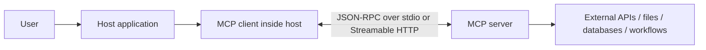
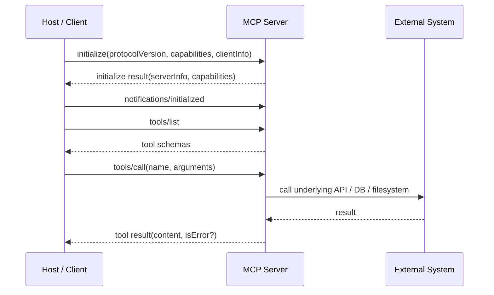

## Executive summary

As of **2026-07-21** in Asia/Taipei, the **latest stable MCP specification** published on the official site is **version `2025-11-25`**, while a **`2026-07-28` release candidate** is publicly available but not yet final until **2026-07-28**. MCP was introduced by Anthropic on **2024-11-25** as an open standard for connecting AI assistants to external systems, and Anthropic later announced that it was donating MCP to the **Linux Foundation’s Agentic AI Foundation** in **December 2025** so the project could remain neutral and community-driven. In practice, MCP standardizes the **boundary between an AI host and external context/tool providers**, not the model inference API itself. Its core promise is interoperability: one host can speak to many servers, and one server can serve many hosts, using a shared protocol surface. [Anthropic launch post](https://www.anthropic.com/news/model-context-protocol), [stable spec](https://modelcontextprotocol.io/specification/2025-11-25), [RC announcement](https://blog.modelcontextprotocol.io/posts/2026-07-28-release-candidate/), and [AAIF donation post](https://www.anthropic.com/news/donating-the-model-context-protocol-and-establishing-of-the-agentic-ai-foundation).

Analytically, MCP’s importance comes from three design choices. First, it uses **JSON-RPC 2.0** as a neutral message envelope, which keeps transports and language runtimes decoupled from the protocol’s semantics. Second, it separates **server primitives** such as **tools**, **resources**, and **prompts** from **client capabilities** such as **sampling**, **roots**, and **elicitation**, giving MCP a clearer interoperability boundary than ad hoc function-calling schemes. Third, it is evolving from a **stateful, initialization-based protocol** in the stable `2025-11-25` release toward a **stateless, per-request versioned protocol** in the upcoming `2026-07-28` revision. That shift matters operationally because it changes how remote MCP systems scale, authenticate, and negotiate capabilities. [Architecture overview](https://modelcontextprotocol.io/docs/learn/architecture), [stable lifecycle](https://modelcontextprotocol.io/specification/2025-11-25/basic/lifecycle), and [draft versioning](https://modelcontextprotocol.io/specification/draft/basic/versioning).

The strongest current evidence suggests that MCP is becoming a **cross-vendor interoperability layer** rather than merely an Anthropic feature. The official docs say MCP is supported across clients and servers including **Claude**, **ChatGPT**, **Visual Studio Code**, **Cursor**, and others; OpenAI’s official API docs now document **remote MCP servers** and **connectors** as first-class tool surfaces; and the official MCP project now has a **registry**, **official SDK tiers**, and **official extensions** for areas like apps, tasks, and supplementary authorization. At the same time, crucial parts of the system remain intentionally **unspecified** or implementation-defined: approval UX, host-side model policy for when to use tools, many trust and discovery decisions, and the details of custom transports. [MCP intro](https://modelcontextprotocol.io/docs/getting-started/intro), [OpenAI MCP docs](https://developers.openai.com/api/docs/guides/tools-connectors-mcp), [SDKs](https://modelcontextprotocol.io/docs/sdk), [extensions overview](https://modelcontextprotocol.io/extensions/overview), and [registry overview](https://modelcontextprotocol.io/registry/about).

## What MCP is

The official definition is consistent across the project’s main sources: MCP is an **open protocol** or **open-source standard** for connecting AI applications to external systems. Anthropic’s launch post frames this as a way to replace fragmented, one-off integrations with a universal protocol for giving AI systems access to data and actions. The official MCP docs frame it more generally as a standard for connecting AI applications such as Claude or ChatGPT to **data sources**, **tools**, and **workflows**. The specification then narrows the scope further: MCP standardizes how hosts, clients, and servers exchange **contextual information**, **capabilities**, and **workflow primitives** over a shared protocol. [Anthropic launch post](https://www.anthropic.com/news/model-context-protocol), [What is MCP?](https://modelcontextprotocol.io/docs/getting-started/intro), and [stable spec overview](https://modelcontextprotocol.io/specification/2025-11-25).

The most useful terminology, in the protocol’s own vocabulary, is the following.

| Term | Meaning in MCP |
|---|---|
| **Host** | The LLM application that initiates connections and owns the user-facing experience. |
| **Client** | A connector inside the host that speaks MCP to servers. |
| **Server** | A local or remote service that exposes context or capabilities. |
| **Tools** | Executable functions that the model can invoke. |
| **Resources** | Context-bearing data objects identified by URIs. |
| **Prompts** | Reusable templates or workflow scaffolds for interactions. |
| **Sampling** | A client capability that lets a server ask the client/host to call an LLM. |
| **Roots** | A client feature for exposing relevant filesystem or URI boundaries; informational, not strong access control. |
| **Elicitation** | A client feature for obtaining additional user input during a workflow. |
| **Tasks** | A mechanism for long-running or deferred operations; in the stable spec they are in utilities, while the upcoming revision moves them into an extension model. |
| **Extensions** | Optional, vendor-prefixed protocol additions negotiated by capabilities. |

This terminology is drawn from the official [architecture overview](https://modelcontextprotocol.io/docs/learn/architecture), [stable spec](https://modelcontextprotocol.io/specification/2025-11-25), [tools](https://modelcontextprotocol.io/specification/2025-11-25/server/tools), [resources](https://modelcontextprotocol.io/specification/2025-11-25/server/resources), [prompts](https://modelcontextprotocol.io/specification/2025-11-25/server/prompts), [sampling](https://modelcontextprotocol.io/specification/draft/client/sampling), [roots](https://modelcontextprotocol.io/specification/draft/client/roots), and [extensions overview](https://modelcontextprotocol.io/extensions/overview).

It is equally important to say what MCP **is not**. MCP is **not** a model-serving API like the [OpenAI Responses API](https://developers.openai.com/api/docs), which is used to ask a model to generate text, structured output, or call tools in a product-specific environment. It is **not** a generic HTTP API description format like [OpenAPI](https://spec.openapis.org/oas/v3.2.0.html), which describes service interfaces for humans and machines. And it is **not** primarily an **agent-to-agent collaboration protocol** like [A2A](https://github.com/a2aproject/A2A/blob/main/docs/specification.md), whose core problem is interoperability between independent agent systems rather than the narrower host-to-context/tool boundary. MCP sits between those layers: it standardizes **tool-and-context interoperability for AI applications**. [OpenAI API docs](https://developers.openai.com/api/docs), [OpenAPI spec](https://spec.openapis.org/oas/v3.2.0.html), and [A2A protocol spec](https://github.com/a2aproject/A2A/blob/main/docs/specification.md).

For primary source work, the most authoritative MCP source map is straightforward: start with the official [documentation site](https://modelcontextprotocol.io/), the [stable specification](https://modelcontextprotocol.io/specification/2025-11-25), the evolving [draft specification](https://modelcontextprotocol.io/specification/draft), the canonical [specification/schema repository](https://github.com/modelcontextprotocol/modelcontextprotocol), the official [SDK index](https://modelcontextprotocol.io/docs/sdk), and the official extension and registry pages. For historical origin and governance context, use Anthropic’s [launch announcement](https://www.anthropic.com/news/model-context-protocol) and [AAIF donation announcement](https://www.anthropic.com/news/donating-the-model-context-protocol-and-establishing-of-the-agentic-ai-foundation).

## Protocol architecture

At a high level, MCP has a **transport layer** and a **data layer**. The transport layer handles communication channels, framing, and authentication concerns; the data layer defines the semantics of the exchange using **JSON-RPC 2.0**. The architecture docs also distinguish **lifecycle management**, **server features**, **client features**, and **utilities**, which is a useful way to reason about what is core versus optional. In the current stable release, all implementations must support the **base protocol** and **lifecycle management**; other components are optional depending on the application. [Architecture overview](https://modelcontextprotocol.io/docs/learn/architecture) and [base protocol overview](https://modelcontextprotocol.io/specification/2025-11-25/basic).



The stable `2025-11-25` specification defines four core JSON-RPC message forms: **requests**, **result responses**, **error responses**, and **notifications**. Requests must have a non-null string or integer `id`; notifications must not have an `id`; responses must correlate back to the original request `id`; and the protocol’s envelopes always use JSON-RPC `2.0`. MCP also reserves a general `_meta` field for additional metadata and uses **JSON Schema** for validation throughout the protocol. By default, schemas without an explicit `$$$schema$$$` field are interpreted as **JSON Schema 2020-12**. [Base protocol overview](https://modelcontextprotocol.io/specification/2025-11-25/basic) and [schema reference](https://modelcontextprotocol.io/specification/2025-11-25/schema).

A simplified, representative request/response pair for tool discovery and invocation looks like this:

```json
{
  "jsonrpc": "2.0",
  "id": 1,
  "method": "tools/list",
  "params": {}
}
```

```json
{
  "jsonrpc": "2.0",
  "id": 1,
  "result": {
    "tools": [
      {
        "name": "get_weather",
        "description": "Get current weather information",
        "inputSchema": {
          "type": "object",
          "properties": {
            "location": { "type": "string" }
          },
          "required": ["location"]
        }
      }
    ]
  }
}
```

```json
{
  "jsonrpc": "2.0",
  "id": 2,
  "method": "tools/call",
  "params": {
    "name": "get_weather",
    "arguments": {
      "location": "Taipei"
    }
  }
}
```

```json
{
  "jsonrpc": "2.0",
  "id": 2,
  "result": {
    "content": [
      {
        "type": "text",
        "text": "Current weather in Taipei: ..."
      }
    ],
    "isError": false
  }
}
```

Those shapes are representative of the official [tools specification](https://modelcontextprotocol.io/specification/2025-11-25/server/tools), which defines `tools/list`, `tools/call`, and `notifications/tools/list_changed`, and of the [schema reference](https://modelcontextprotocol.io/specification/2025-11-25/schema), which clarifies that **tool execution failures should usually be surfaced inside the tool result with `isError: true`**, while protocol-level failures such as “unknown tool” should be surfaced as MCP/JSON-RPC errors.

The **server data model** revolves around three primitives. **Tools** are callable functions with schemas, content blocks, and optional structured output. **Resources** are URI-addressable context objects such as files, database records, or API results. **Prompts** are reusable templates and workflow scaffolds that can include embedded resources. On the client side, MCP defines **sampling**, **roots**, and **elicitation** as opt-in capabilities. This division is one of MCP’s strongest design choices because it separates passive context, active actions, and user-interaction loops into distinct protocol surfaces instead of collapsing everything into “tool calls.” [Stable spec features](https://modelcontextprotocol.io/specification/2025-11-25), [resources](https://modelcontextprotocol.io/specification/2025-11-25/server/resources), [prompts](https://modelcontextprotocol.io/specification/2025-11-25/server/prompts), [tools](https://modelcontextprotocol.io/specification/2025-11-25/server/tools), and [architecture overview](https://modelcontextprotocol.io/docs/learn/architecture).

In the **stable protocol**, lifecycle is explicit and stateful. A session begins with an `initialize` request from the client, where the client declares its protocol version, capabilities, and implementation identity. The server answers with its own capabilities and identity, and the client then sends `notifications/initialized`. On HTTP transports, later requests also carry the `MCP-Protocol-Version` header, and servers may create an `MCP-Session-Id` for streamable HTTP sessions. This stateful design is the current stable baseline. [Stable lifecycle](https://modelcontextprotocol.io/specification/2025-11-25/basic/lifecycle) and [stable transports](https://modelcontextprotocol.io/specification/2025-11-25/basic/transports).



The two **standard transports** in the stable release are **stdio** and **Streamable HTTP**. In stdio, the client launches the server as a subprocess and exchanges newline-delimited JSON-RPC over `stdin`/`stdout`; critically, the server must not write non-protocol data to `stdout`, which is why the official tutorials repeatedly warn implementers to log to `stderr` instead. In Streamable HTTP, every client-to-server JSON-RPC message is sent as an HTTP `POST`; the server may answer either with a single JSON response or an SSE stream, and servers are expected to validate `Origin`, prefer localhost binding for local use, and implement authentication if exposed remotely. [Stable transports](https://modelcontextprotocol.io/specification/2025-11-25/basic/transports) and [build-server tutorial](https://modelcontextprotocol.io/docs/develop/build-server).

For **security**, the core rule is that MCP itself is only partially prescriptive. The stable spec says authorization is **optional**, but HTTP-based implementations **should** follow the authorization spec and stdio implementations **should not** use that HTTP auth flow. The official authorization spec is an OAuth-oriented framework built around **OAuth 2.1**, **Protected Resource Metadata**, **authorization-server metadata discovery**, and **client registration approaches** such as **Client ID Metadata Documents** and, for backward compatibility, **Dynamic Client Registration**. It also requires **PKCE**, requires bearer tokens in the `Authorization` header rather than URI query strings, and emphasizes audience binding when validating access tokens. [Stable authorization](https://modelcontextprotocol.io/specification/2025-11-25/basic/authorization) and [security best practices](https://modelcontextprotocol.io/docs/tutorials/security/security_best_practices).

A rigorous reading of the documents also shows several things that are intentionally **unspecified**. The protocol does **not** standardize the host UI for approvals, how exactly prompts/resources are rendered to users, or the host/model policy for when a model should call a tool. The tools spec explicitly says implementations are free to expose tools through whatever interaction pattern suits them, and the architecture docs make similar points for prompts and elicitation. Custom transports are also allowed, but their concrete connection-establishment and message-exchange patterns are left to implementers to define and document. Where the specification is silent, the appropriate label is **unspecified**, not “forbidden.” [Tools](https://modelcontextprotocol.io/specification/2025-11-25/server/tools), [elicitation](https://modelcontextprotocol.io/specification/2025-11-25/client/elicitation), and [stable transports](https://modelcontextprotocol.io/specification/2025-11-25/basic/transports).

The most significant architectural change on the horizon is the shift from the stable, **legacy** handshake/session model to the **modern**, stateless model in the `2026-07-28` release candidate. In the draft/RC world, there is **no initialization handshake**; every request carries its protocol version in `_meta` and, on HTTP, also in the `MCP-Protocol-Version` header. A new `server/discover` method replaces the need to negotiate everything up front, and the protocol-level `Mcp-Session-Id` disappears. That change is not yet the stable release as of 2026-07-21, but it is the direction of travel and will matter for future implementations. [Draft versioning](https://modelcontextprotocol.io/specification/draft/basic/versioning), [draft changelog](https://modelcontextprotocol.io/specification/draft/changelog), and [RC announcement](https://blog.modelcontextprotocol.io/posts/2026-07-28-release-candidate/).

## Practical usage

In real deployments, MCP appears in two broad shapes. The first is a **local stdio server** launched by a desktop or IDE host; this is the pattern emphasized in the official introductory tutorials and is especially common for filesystem access, local developer tools, or machine-local workflows. The second is a **remote HTTP MCP server** with standardized auth, which is better suited for organization-wide services, SaaS integrations, and shared workflows. Both are official patterns; the difference is primarily operational, not conceptual. [Build an MCP server](https://modelcontextprotocol.io/docs/develop/build-server), [build an MCP client](https://modelcontextprotocol.io/docs/develop/build-client), and [stable transports](https://modelcontextprotocol.io/specification/2025-11-25/basic/transports).

A typical **local workflow** is: the host starts an MCP server over stdio, the model sees the exposed tools/resources/prompts, the user asks for something that requires external context, the host decides to invoke the server, and the server performs the real work against an API, local filesystem, or database. A typical **remote workflow** is the same at the protocol level, but the client talks to a network endpoint and may need OAuth-based authorization. The protocol itself remains the same JSON-RPC surface across those transports. [Architecture overview](https://modelcontextprotocol.io/docs/learn/architecture) and [stable transports](https://modelcontextprotocol.io/specification/2025-11-25/basic/transports).

The following **JavaScript** example is a deliberately minimal stdio server using the official `@modelcontextprotocol/server` package. It follows the same `McpServer` + `registerTool` + `serveStdio` pattern used in the official TypeScript “first server” tutorial, but simplified to an `echo` tool so the protocol mechanics are easy to see. The official tutorial itself is written in TypeScript; using the SDK from plain ESM JavaScript is an implementation choice, not a spec difference. [TypeScript first-server tutorial](https://github.com/modelcontextprotocol/typescript-sdk/blob/main/docs/get-started/first-server.md) and [TypeScript SDK repo](https://github.com/modelcontextprotocol/typescript-sdk).

```javascript
import { McpServer } from "@modelcontextprotocol/server";
import { serveStdio } from "@modelcontextprotocol/server/stdio";
import * as z from "zod/v4";

function createServer() {
  const server = new McpServer({ name: "hello", version: "1.0.0" });

  server.registerTool(
    "echo",
    {
      description: "Echo text back to the caller",
      inputSchema: z.object({
        text: z.string().describe("Text to echo")
      })
    },
    async ({ text }) => {
      return {
        content: [{ type: "text", text }],
        isError: false
      };
    }
  );

  return server;
}

void serveStdio(createServer);
console.error("hello MCP server running on stdio");
```

That small snippet illustrates three important architectural facts. The **tool schema** is expressed once in user code and exposed to the client as JSON Schema; the **handler** returns typed content blocks rather than a raw string protocol frame; and `stdout` remains reserved for the wire protocol, which is why the banner goes to `stderr`. If you expose the same logical server over HTTP instead of stdio, the protocol semantics remain the same while the transport changes. [TypeScript first-server tutorial](https://github.com/modelcontextprotocol/typescript-sdk/blob/main/docs/get-started/first-server.md) and [stable transports](https://modelcontextprotocol.io/specification/2025-11-25/basic/transports).

The following **Python** example uses the official `FastMCP` helper from the Python tutorial. Again, the code is simplified to a minimal `echo` tool, but it follows the exact tutorial style: instantiate `FastMCP`, decorate a function with `@mcp.tool()`, and run the server with `transport="stdio"`. [Python build-server tutorial](https://modelcontextprotocol.io/docs/develop/build-server) and [Python SDK repo](https://github.com/modelcontextprotocol/python-sdk).

```python
from mcp.server.fastmcp import FastMCP

mcp = FastMCP("hello")


@mcp.tool()
async def echo(text: str) -> str:
    """Echo text back to the caller."""
    return text


if __name__ == "__main__":
    mcp.run(transport="stdio")
```

If you want a **host-side consumption** example, OpenAI now documents MCP as a built-in tool type for the Responses API and Realtime API. In that model, your application does **not** reimplement the MCP wire protocol itself; instead, you configure a tool of `type: "mcp"` with a `server_url` or `connector_id`, and the OpenAI runtime talks to the remote MCP server for you. This is a product integration layer built on top of MCP, not MCP’s own specification. [OpenAI MCP and Connectors](https://developers.openai.com/api/docs/guides/tools-connectors-mcp), [OpenAI Using tools](https://developers.openai.com/api/docs/guides/tools), and [Realtime MCP](https://developers.openai.com/api/docs/guides/realtime-mcp).

```python
from openai import OpenAI

client = OpenAI()

response = client.responses.create(
    model="gpt-5.6",
    tools=[
        {
            "type": "mcp",
            "server_label": "docs",
            "server_url": "https://developers.openai.com/mcp",
            "require_approval": "never",
        }
    ],
    input="Look up the request schema for Responses API tools."
)

print(response.output_text)
```

Two practical implementation notes are worth emphasizing. First, the official quickstarts and reference repositories are intentionally minimal; the project explicitly warns that if you expose MCP servers over a network, you should add **authentication**, **request limits**, **timeouts**, **rate limiting**, and **log redaction**. Second, for local stdio servers, writing accidental output to `stdout` is a common failure mode because it corrupts the JSON-RPC stream. Those are not theoretical concerns; they are front-and-center in the official tutorials and security notes. [Quickstart resources repo](https://github.com/modelcontextprotocol/quickstart-resources), [build-server tutorial](https://modelcontextprotocol.io/docs/develop/build-server), and [security best practices](https://modelcontextprotocol.io/docs/tutorials/security/security_best_practices).

## Comparison with related protocols

MCP is best understood by contrast. It is **closer to LSP** than to a model API because it standardizes a reusable protocol between a host and an external capability provider. It is **closer to OpenAPI** than to an ad hoc SDK in the sense that it cares about schema and discoverability, but unlike OpenAPI it is also a runtime interaction protocol rather than only an interface description. And it is **complementary to A2A** rather than a substitute: A2A is about agent-to-agent collaboration, while MCP is about giving an agent or host access to tools, resources, and promptable workflows. OpenAI’s own docs reinforce this distinction by treating MCP as one tool surface among several in the Responses and Realtime APIs. [MCP stable spec](https://modelcontextprotocol.io/specification/2025-11-25), [LSP overview](https://microsoft.github.io/language-server-protocol/), [OpenAPI spec](https://spec.openapis.org/oas/v3.2.0.html), [A2A spec](https://github.com/a2aproject/A2A/blob/main/docs/specification.md), and [OpenAI tools guide](https://developers.openai.com/api/docs/guides/tools).

| Protocol / standard | Scope | Transport | Auth model | Data model | Extensibility | Current maturity | Official links |
|---|---|---|---|---|---|---|---|
| **MCP** | Host/client/server interoperability for tools, resources, prompts, and related capabilities | `stdio`, Streamable HTTP; custom transports allowed | OAuth-oriented framework for HTTP; stdio auth handled outside the HTTP auth spec | JSON-RPC 2.0 + JSON Schema; capability negotiation | Capabilities, `_meta`, experimental fields, and official/vendor extensions | Launched 2024; latest stable spec `2025-11-25`; `2026-07-28` RC pending final | [Spec](https://modelcontextprotocol.io/specification/2025-11-25), [Docs](https://modelcontextprotocol.io/), [Repo](https://github.com/modelcontextprotocol/modelcontextprotocol) |
| **OpenAI Responses API** | Model inference API with built-in tools, remote MCP, programmatic tool calling, etc. | HTTPS API | OpenAI API authentication | Product-specific request/response objects | OpenAI product features and hosted tools | Current production API for OpenAI platform | [API docs](https://developers.openai.com/api/docs), [Tools guide](https://developers.openai.com/api/docs/guides/tools), [MCP + Connectors](https://developers.openai.com/api/docs/guides/tools-connectors-mcp) |
| **LSP** | Editor/IDE ↔ language-server interoperability | JSON-RPC over protocol framing with headers/content | Implementation-specific | JSON-RPC + language-service schemas/capabilities | Capability flags and evolving spec versions | Long-standing, widely implemented; latest site says 3.18 | [Overview](https://microsoft.github.io/language-server-protocol/), [Spec](https://microsoft.github.io/language-server-protocol/specifications/lsp/3.17/specification/) |
| **OpenAPI** | Description format for HTTP APIs | HTTP APIs are described, not run by OpenAPI itself | Described in spec documents; not a protocol-level runtime auth flow | Structured API description documents | Vendor extensions and schema composition | Mature standard; current referenced page is 3.2.0 | [OAS 3.2.0](https://spec.openapis.org/oas/v3.2.0.html) |
| **A2A** | Agent-to-agent interoperability and collaboration | JSON-RPC 2.0 over HTTP(S), plus streaming/task patterns | Enterprise-ready auth at the protocol/system level | Agent cards, tasks, artifacts, messages, modalities | Protocol evolution through its own spec and SDKs | Latest released version marked 1.0.0 | [Spec](https://github.com/a2aproject/A2A/blob/main/docs/specification.md), [Repo](https://github.com/a2aproject/A2A) |

The most important analytical takeaway from this table is that MCP occupies a **middle layer**. If you are choosing between MCP and the OpenAI API, you are usually comparing different layers of the stack: the OpenAI API is about **asking a model to do work**, while MCP is about **standardizing the external capability boundary** that the model or host can use. If you are choosing between MCP and A2A, the question is generally whether you need **tool/context interoperability** or **multi-agent collaboration**. And if you are comparing MCP to LSP, the analogy is architectural rather than domain-specific: both standardize a reusable protocol so many clients can work with many providers. [OpenAI API docs](https://developers.openai.com/api/docs), [OpenAI tools guide](https://developers.openai.com/api/docs/guides/tools), [A2A announcement](https://developers.googleblog.com/en/a2a-a-new-era-of-agent-interoperability/), and [MCP spec](https://modelcontextprotocol.io/specification/2025-11-25).

## Adoption, ecosystem, and governance

The official MCP docs now describe a substantial ecosystem surface. The project’s own introductory page says MCP is supported across a wide range of clients and servers, explicitly naming **Claude**, **ChatGPT**, **Visual Studio Code**, **Cursor**, and others. OpenAI’s official docs go further than mere acknowledgment: they document how to **consume remote MCP servers** in the Responses API, Realtime API, Codex/ChatGPT-adjacent surfaces, and the Apps SDK. That does not mean every client supports every extension or feature, but it does mean MCP has crossed from a single-vendor experiment to a real interoperability surface. [MCP intro](https://modelcontextprotocol.io/docs/getting-started/intro), [OpenAI MCP and Connectors](https://developers.openai.com/api/docs/guides/tools-connectors-mcp), [OpenAI Apps SDK](https://developers.openai.com/apps-sdk), and [OpenAI MCP guide for apps/integrations](https://developers.openai.com/api/docs/mcp).

The **SDK ecosystem** is unusually formalized for a young protocol. The official SDK directory publishes a tiered list: **TypeScript, Python, C#, and Go** are **Tier 1**; **Java** and **Rust** are **Tier 2**; and **Swift, Ruby, PHP, and Kotlin** are **Tier 3**. The docs also state that all official SDKs support the same broad functionality categories: building servers, building clients, local and remote transports, and protocol compliance with type safety. This is a strong sign of deliberate ecosystem engineering rather than loose documentation alone. [Official SDK index](https://modelcontextprotocol.io/docs/sdk).

The **reference server ecosystem** is also fairly mature. The official examples page lists current reference servers such as **Everything**, **Fetch**, **Filesystem**, **Git**, and **Memory**, and points to a broader official integrations section in the servers repository. The quickstart resources repository hosts tutorial code for building both servers and clients, and the main servers repository explicitly says those implementations are intended as **reference implementations** and **educational examples**, not production-ready deployments. That distinction matters: many “MCP servers” on the internet are demonstrations or wrappers, not hardened infrastructure. [Example servers](https://modelcontextprotocol.io/examples), [servers repository](https://github.com/modelcontextprotocol/servers), and [quickstart-resources](https://github.com/modelcontextprotocol/quickstart-resources).

The **registry story** is now official but still unfinished. The MCP Registry is described as the official centralized metadata repository for publicly accessible MCP servers, with a standardized `server.json` format, namespace verification, and a REST/API/OpenAPI surface intended primarily for downstream aggregators rather than direct host consumption. But the same page also says the registry is **in preview**, and that breaking changes or data resets may still occur before general availability. It is backed by trusted ecosystem contributors including **Anthropic, GitHub, PulseMCP, and Microsoft**, but its security model intentionally delegates most code scanning to underlying package registries and downstream marketplaces. [Registry overview](https://modelcontextprotocol.io/registry/about) and [registry preview announcement](https://blog.modelcontextprotocol.io/posts/2025-09-08-mcp-registry-preview/).

Governance has also changed in a meaningful way. Anthropic’s December 2025 announcement says it is donating MCP to the **Linux Foundation’s Agentic AI Foundation** while keeping the project’s governance model aimed at community input and transparent decision-making. That move does not eliminate Anthropic’s influence, but it does move the governance story from “vendor-origin open source” toward “foundation-hosted standard with cross-industry stewardship.” For a protocol intended to span hosts, SDKs, registries, and extensions, that governance neutralization is strategically important. [AAIF donation post](https://www.anthropic.com/news/donating-the-model-context-protocol-and-establishing-of-the-agentic-ai-foundation) and [Anthropic transparency note](https://www.anthropic.com/transparency/voluntary-commitments).

Finally, the ecosystem’s **extension model** is becoming central. The official extensions overview defines MCP extensions as optional additions to the specification, identified by vendor-prefixed names such as `io.modelcontextprotocol/...`. The currently highlighted official surfaces include **authorization extensions**, **MCP Apps**, and **Tasks**. The extension support matrix also makes an important interoperability point: extensions are **opt-in**, and whether they work depends on both client and server support. In other words, “supports MCP” is increasingly not a binary statement; practical interoperability depends on which subset of MCP and which extensions a given client actually implements. [Extensions overview](https://modelcontextprotocol.io/extensions/overview), [MCP Apps](https://modelcontextprotocol.io/extensions/apps/overview), [Tasks](https://modelcontextprotocol.io/extensions/tasks/overview), and [extension support matrix](https://modelcontextprotocol.io/extensions/client-matrix).

## Limitations and further reading

MCP’s biggest **technical limitation** is not that it lacks features; it is that the protocol intentionally leaves several safety-critical and UX-critical behaviors to hosts and deployers. The tools and elicitation specs repeatedly say that interaction models are implementation-defined. The stable specification also says MCP cannot itself enforce many of its security principles and instead recommends that implementers build consent, access controls, documentation, and privacy protections around it. That means real-world MCP safety is only partly on the wire; much of it lives in host UX, deployment architecture, and operator discipline. Where those controls are absent, the protocol alone will not save the system. [Tools](https://modelcontextprotocol.io/specification/2025-11-25/server/tools), [elicitation](https://modelcontextprotocol.io/specification/2025-11-25/client/elicitation), [stable spec security guidance](https://modelcontextprotocol.io/specification/2025-11-25), and [security best practices](https://modelcontextprotocol.io/docs/tutorials/security/security_best_practices).

A second limitation is **transition risk**. As of the current date, the stable spec is still the stateful `2025-11-25` release, while the next revision is a major, breaking shift toward stateless per-request metadata, extension-first evolution, and deprecation of some previously core features. That future may be architecturally cleaner, but it creates migration work for SDKs, hosts, server operators, and documentation. The project is trying to manage that risk with release candidates, conformance requirements, and a formal deprecation policy, but the transition is still real. [RC announcement](https://blog.modelcontextprotocol.io/posts/2026-07-28-release-candidate/), [draft changelog](https://modelcontextprotocol.io/specification/draft/changelog), and [conformance SEP](https://modelcontextprotocol.io/seps/2484-conformance-tests-required-for-final-seps).

A third limitation is **trust and discovery quality**. The registry helps, but the official registry is still preview-only, does not directly serve as the sole host-facing marketplace, and delegates actual code scanning to package registries and downstream aggregators. OpenAI’s own MCP documentation warns developers to prefer official servers hosted by the actual service provider and to be cautious with third-party MCP servers. This is an unusually honest signal that ecosystem trust is still forming. In security terms, the hard problem is no longer just “can I call a tool?” but “which server should I trust to expose the tool?” [Registry overview](https://modelcontextprotocol.io/registry/about), [registry preview post](https://blog.modelcontextprotocol.io/posts/2025-09-08-mcp-registry-preview/), and [OpenAI MCP safety guidance](https://developers.openai.com/api/docs/mcp).

The open research questions follow naturally from those constraints. How should hosts represent trust, permissioning, and provenance to users without overwhelming them? How should tool catalogs scale when there are hundreds or thousands of possible actions? How far should MCP extend into UI, long-running workflows, and enterprise identity before it becomes too broad? And what is the clean division of labor between **MCP** for host-to-tool/context interoperability and **A2A** for agent-to-agent collaboration? The public roadmap, draft extensions, and support matrices suggest these questions are active rather than settled. [MCP roadmap](https://blog.modelcontextprotocol.io/posts/2026-mcp-roadmap/), [extensions overview](https://modelcontextprotocol.io/extensions/overview), [extension support matrix](https://modelcontextprotocol.io/extensions/client-matrix), and [A2A announcement](https://developers.googleblog.com/en/a2a-a-new-era-of-agent-interoperability/).

For prioritized further reading, official sources should come first:

- [Stable MCP specification `2025-11-25`](https://modelcontextprotocol.io/specification/2025-11-25) — the current source of truth for stable behavior.
- [Draft MCP specification](https://modelcontextprotocol.io/specification/draft) and the [draft changelog](https://modelcontextprotocol.io/specification/draft/changelog) — essential if you are planning for the post-`2025-11-25` transition.
- [What is MCP?](https://modelcontextprotocol.io/docs/getting-started/intro) and [Architecture overview](https://modelcontextprotocol.io/docs/learn/architecture) — the best conceptual orientation.
- [Authorization](https://modelcontextprotocol.io/specification/2025-11-25/basic/authorization) and [Security Best Practices](https://modelcontextprotocol.io/docs/tutorials/security/security_best_practices) — mandatory reading for remote deployments.
- [Schema/spec repository](https://github.com/modelcontextprotocol/modelcontextprotocol) — canonical home for the spec and schema sources.
- [Official SDK index](https://modelcontextprotocol.io/docs/sdk), plus the [TypeScript SDK](https://github.com/modelcontextprotocol/typescript-sdk) and [Python SDK](https://github.com/modelcontextprotocol/python-sdk) repos.
- [Registry overview](https://modelcontextprotocol.io/registry/about) and [Example servers](https://modelcontextprotocol.io/examples) — best for ecosystem reconnaissance.
- [Extensions overview](https://modelcontextprotocol.io/extensions/overview), [MCP Apps](https://modelcontextprotocol.io/extensions/apps/overview), and [Tasks](https://modelcontextprotocol.io/extensions/tasks/overview) — best for understanding where MCP is expanding.
- [Anthropic’s original launch post](https://www.anthropic.com/news/model-context-protocol) and [AAIF donation post](https://www.anthropic.com/news/donating-the-model-context-protocol-and-establishing-of-the-agentic-ai-foundation) — best for origin and governance context.
- For comparison, read the [OpenAI MCP and Connectors guide](https://developers.openai.com/api/docs/guides/tools-connectors-mcp), the [LSP overview](https://microsoft.github.io/language-server-protocol/), the [OpenAPI spec](https://spec.openapis.org/oas/v3.2.0.html), and the [A2A protocol spec](https://github.com/a2aproject/A2A/blob/main/docs/specification.md).