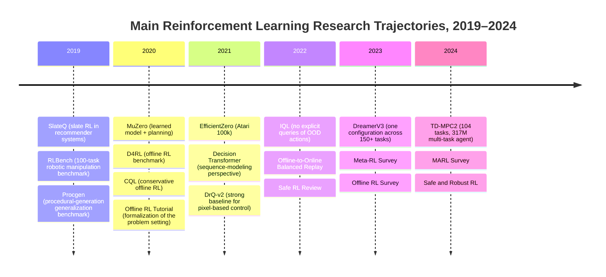
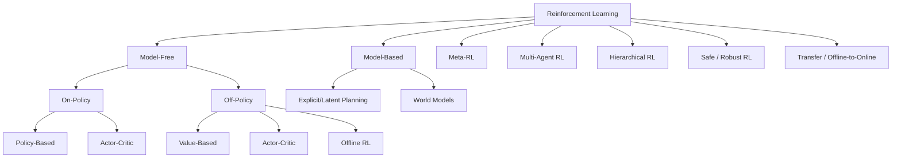

## Executive Summary

The main trajectory of reinforcement learning (Reinforcement Learning, RL) from 2019 to 2024 has clearly shifted away from “pursuing higher scores on a single benchmark” toward three directions that are more closely aligned with the real world. The first is highly sample-efficient methods centered on world models, planning, and latent dynamics, such as [MuZero](https://www.nature.com/articles/s41586-020-03051-4), [EfficientZero](https://arxiv.org/abs/2111.00210), [DreamerV3](https://arxiv.org/abs/2301.04104), and [TD-MPC2](https://arxiv.org/abs/2310.16828). The second is static-data-driven offline RL and offline-to-online fine-tuning, such as [CQL](https://arxiv.org/abs/2006.04779), [IQL](https://arxiv.org/abs/2110.06169), and [Balanced Replay/Pessimistic Q-Ensemble](https://proceedings.mlr.press/v164/lee22d.html). The third is placing RL inside more complex structures, such as safety constraints, multi-agent systems, hierarchical control, and cross-task adaptation. These directions do not replace one another; instead, they are gradually layered together. Modern RL systems often simultaneously possess multiple properties, including model-based learning, actor-critic optimization, offline pretraining, safety constraints, and transfer fine-tuning. ([Model-Based RL Survey](https://www.jmlr.org/papers/v24/22-1347.html), [Offline RL Tutorial](https://arxiv.org/abs/2005.01643), [Safe RL Review](https://arxiv.org/abs/2205.10330), [Meta-RL Survey](https://arxiv.org/abs/2301.08028), [MARL Survey](https://arxiv.org/abs/2312.10256))

Looking only at the most representative achievements of the past five years, in the low-data Atari 100k regime, [EfficientZero](https://arxiv.org/abs/2111.00210) reported 194.3% mean human performance and 109.0% median human performance using only two hours of gameplay data, while claiming performance close to DQN trained on 200 million frames with roughly 500 times less data. [DreamerV3](https://arxiv.org/abs/2301.04104) emphasized using a single set of hyperparameters across more than 150 tasks. [TD-MPC2](https://arxiv.org/abs/2310.16828) achieved consistently strong results on 104 online RL tasks using one hyperparameter configuration and trained a single 317M-parameter agent to perform 80 tasks. These results show that the frontier of RL competition is no longer only final score, but also “generality, data efficiency, stability, and scalability.”

However, from the perspective of reproducibility, the situation is less optimistic than it appears. Early evaluation methods in the [Arcade Learning Environment](https://jair.org/index.php/jair/article/view/11182) already suffered from protocol drift, sticky actions, human normalization, and inconsistent reporting practices. A statistical study at NeurIPS 2021 further pointed out that deep RL benchmark rankings can easily be distorted by using only a small number of seeds, reporting only the best run, and selecting inappropriate aggregate metrics. The community therefore began promoting more reliable evaluation using the interquartile mean (IQM), performance profiles, stratified-bootstrap confidence intervals, and public reporting of all runs. In other words, the “state of the art” in RL must be accompanied by the “state of evaluation.” ([Deep RL at the Edge of the Statistical Precipice](https://arxiv.org/abs/2108.13264), [rliable](https://github.com/google-research/rliable))

For industrial applications, mature cases that are public and auditable remain concentrated mainly in robotics and recommender systems. In multi-task robot learning, Google reported training with more than 800,000 episodes and 9,600 robot hours of real-robot data, with [MT-Opt](https://arxiv.org/abs/2104.08212) delivering an average improvement of approximately three times over the baseline. Its office recycling-sorting deployment reduced contamination by weight by 40–50% across three real deployments in 2021–2022. In recommender systems, Google’s [SlateQ](https://arxiv.org/abs/1905.12767) validated scalable slate RL in a YouTube context, while [RL4RS](https://arxiv.org/abs/2110.11073) directly acknowledged that existing RL recommendation research has a substantial reality gap and requires real-world datasets, simulators, and counterfactual evaluation. By contrast, although autonomous driving, finance, and healthcare have many papers and high potential, public, auditable, long-term online deployments remain much rarer than in robotics and recommendation, mainly because safety, regulation, offline evaluation, distribution shift, and accountability problems are more severe. ([Google MT-Opt](https://research.google/blog/multi-task-robotic-reinforcement-learning-at-scale/), [Google Waste-Sorting Robots](https://www.research.google/blog/robotic-deep-rl-at-scale-sorting-waste-and-recyclables-with-a-fleet-of-robots/), [RL4RS](https://github.com/fuxiAIlab/RL4RS), [AI Clinician](https://www.nature.com/articles/s41591-018-0213-5))

The overall judgment is that RL has not entered a stage in which “one algorithm dominates every scenario.” Instead, it increasingly resembles an engineering discipline for decision learning. If a task has abundant simulation, long-term returns, and tolerable online exploration, off-policy actor-critic or model-based RL remains strong. If data are expensive or risk cannot be tolerated, offline RL and offline-to-online learning are more reasonable entry points. If a problem involves multi-step planning, multi-agent cooperation, constraints, or long-horizon skills, structured designs such as world models, hierarchy, centralized training with decentralized execution (CTDE), constrained Markov decision processes (CMDPs), and uncertainty-aware transfer are required. The key challenge over the next five years is not merely to make RL stronger, but to make it more provable, evaluable, transferable, and deployable. ([Model-Based RL Survey](https://www.jmlr.org/papers/v24/22-1347.html), [Offline RL Tutorial](https://arxiv.org/abs/2005.01643), [Safe RL Review](https://arxiv.org/abs/2205.10330), [TD-MPC2](https://arxiv.org/abs/2310.16828))

## Recent Literature Map

The RL literature from 2019 to 2024 can be broadly divided into three layers. The first is “algorithmic breakthroughs,” such as [MuZero](https://www.nature.com/articles/s41586-020-03051-4), [EfficientZero](https://arxiv.org/abs/2111.00210), [Decision Transformer](https://arxiv.org/abs/2106.01345), [IQL](https://arxiv.org/abs/2110.06169), and [TD-MPC2](https://arxiv.org/abs/2310.16828). The second is “expansion of problem settings,” such as offline RL, offline-to-online learning, meta-RL, multi-agent RL (MARL), and safe/robust RL. The third is “governance of benchmarks and methodology,” such as [D4RL](https://arxiv.org/abs/2004.07219), [Procgen](https://arxiv.org/abs/1912.01588), [RLBench](https://arxiv.org/abs/1909.12271), and reliable evaluation tools. As a result, recent RL is no longer simply about making DQN, PPO, or SAC deeper; it incorporates data sources, planning, evaluation, and deployment conditions into the problem definition itself.

The following figure is a conceptual timeline of the main literature trajectories over the past five years. ([SlateQ](https://arxiv.org/abs/1905.12767), [D4RL](https://arxiv.org/abs/2004.07219), [EfficientZero](https://arxiv.org/abs/2111.00210), [Decision Transformer](https://arxiv.org/abs/2106.01345), [IQL](https://arxiv.org/abs/2110.06169), [DreamerV3](https://arxiv.org/abs/2301.04104), [TD-MPC2](https://arxiv.org/abs/2310.16828))



### Overview of Representative Papers and Surveys

| Title | Authors | Year | Conference/Journal | Key contribution | Link |
|---|---|---:|---|---|---|
| SlateQ: A Tractable Decomposition for Reinforcement Learning with Recommendation Sets | Eugene Ie, Vihan Jain, Jing Wang, Sanmit Narvekar, Ritesh Agarwal, Rui Wu, Heng-Tze Cheng, Tushar Chandra, Craig Boutilier | 2019 | IJCAI | Decomposes slate actions in recommender systems into tractable item-wise long-term values and validates scalability in a YouTube setting. | [Paper page](https://arxiv.org/abs/1905.12767) |
| RLBench: The Robot Learning Benchmark & Learning Environment | Stephen James, Zicong Ma, David Rovick Arrojo, Andrew J. Davison | 2019/2020 | RA-L / ICRA | Proposes a robotic-manipulation benchmark with 100 hand-designed tasks and unlimited demonstrations to support imitation, few-shot, and RL research. | [Paper page](https://arxiv.org/abs/1909.12271) |
| D4RL: Datasets for Deep Data-Driven Reinforcement Learning | Justin Fu, Aviral Kumar, Ofir Nachum, George Tucker, Sergey Levine | 2020 | NeurIPS Datasets/Benchmarks (white paper/benchmark) | Systematically designs offline RL benchmarks covering human demonstrations, mixed policies, multi-task data, and complex data distributions. | [Paper page](https://arxiv.org/abs/2004.07219) |
| Conservative Q-Learning for Offline Reinforcement Learning | Aviral Kumar et al. | 2020 | NeurIPS | Uses conservative Q regularization to suppress overly optimistic estimates for out-of-distribution actions, often reporting returns two to five times higher than prior offline RL methods. | [Paper page](https://arxiv.org/abs/2006.04779) |
| Offline Reinforcement Learning: Tutorial, Review, and Perspectives on Open Problems | Sergey Levine, Aviral Kumar, George Tucker, Justin Fu | 2020 | arXiv Tutorial | Establishes the challenge framework for offline RL: distribution shift, extrapolation error, off-policy evaluation (OPE), and dataset coverage. | [Paper page](https://arxiv.org/abs/2005.01643) |
| Model-based Reinforcement Learning: A Survey | Thomas M. Moerland, Joost Broekens, Aske Plaat, Catholijn M. Jonker | 2020/2023 | JMLR | Systematically organizes dynamics learning, planning-learning integration, implicit MBRL, and its relationship with hierarchy and transfer. | [Paper page](https://www.jmlr.org/papers/v24/22-1347.html) |
| Mastering Atari Games with Limited Data | Weirui Ye, Shaohuai Liu, Thanard Kurutach, Pieter Abbeel, Yang Gao | 2021 | NeurIPS | EfficientZero reaches 194.3% mean and 109.0% median human-normalized score on Atari 100k, emphasizing extremely high sample efficiency. | [Paper page](https://arxiv.org/abs/2111.00210) |
| Decision Transformer: Reinforcement Learning via Sequence Modeling | Lili Chen, Kevin Lu, Aravind Rajeswaran, Kimin Lee, Aditya Grover, Michael Laskin, Pieter Abbeel, Aravind Srinivas, Igor Mordatch | 2021 | NeurIPS | Treats RL as conditional sequence modeling and directly outputs actions with a Transformer, matching or exceeding state-of-the-art model-free offline RL on Atari, Gym, and Key-to-Door. | [Paper page](https://arxiv.org/abs/2106.01345) |
| Mastering Visual Continuous Control: Improved Data-Augmented Reinforcement Learning | Denis Yarats, Rob Fergus, Alessandro Lazaric, Lerrel Pinto | 2021/2022 | ICLR (OpenReview) | Provides a robust, strong baseline for pixel control using a simple off-policy actor-critic plus data augmentation. | [Paper page](https://arxiv.org/abs/2107.09645) |
| Offline Reinforcement Learning with Implicit Q-Learning | Ilya Kostrikov, Ashvin Nair, Sergey Levine | 2021/2022 | ICLR (OpenReview) | Avoids directly evaluating actions outside the dataset, yet achieves state-of-the-art results on D4RL and is highly suitable for offline-to-online fine-tuning. | [Paper page](https://arxiv.org/abs/2110.06169) |
| A Review of Safe Reinforcement Learning: Methods, Theory and Applications | Shangding Gu, Long Yang, Yali Du, Guang Chen, Florian Walter, Jun Wang, Alois Knoll | 2022 | arXiv Review | Reviews safe RL from methodological, theoretical, and application perspectives and organizes key issues through a “2H3W” framework. | [Paper page](https://arxiv.org/abs/2205.10330) |
| Offline-to-Online Reinforcement Learning via Balanced Replay and Pessimistic Q-Ensemble | Seunghyun Lee, Younggyo Seo, Kimin Lee, Pieter Abbeel, Jinwoo Shin | 2022 | CoRL | Uses balanced replay and a pessimistic ensemble to improve the stability and efficiency of online fine-tuning after offline pretraining. | [Paper page](https://proceedings.mlr.press/v164/lee22d.html) |
| Leveraging Factored Action Spaces for Efficient Offline Reinforcement Learning in Healthcare | Shengpu Tang, Maggie Makar, Michael Sjoding, Finale Doshi-Velez, Jenna Wiens | 2022 | NeurIPS | Proposes factorized Q decomposition for combinatorial healthcare action spaces, improving sample efficiency and the bias-variance trade-off under low-coverage data. | [Paper page](https://proceedings.neurips.cc/paper_files/paper/2022/hash/dda7f9378a210c25e470e19304cce85d-Abstract-Conference.html) |
| A Survey of Meta-Reinforcement Learning | Jacob Beck, Risto Vuorio, Evan Zheran Liu, Zheng Xiong, Luisa Zintgraf, Chelsea Finn, Shimon Whiteson | 2023 | arXiv Survey | Organizes task distributions, adaptation budgets, meta-RL applications, and open problems. | [Paper page](https://arxiv.org/abs/2301.08028) |
| Mastering Diverse Domains through World Models | Danijar Hafner et al. | 2023 | arXiv | DreamerV3 performs strongly across more than 150 tasks using a single configuration, significantly improving the generality of MBRL. | [Paper page](https://arxiv.org/abs/2301.04104) |
| A Survey on Offline Reinforcement Learning: Taxonomy, Review, and Open Problems | Rafael F. Prudencio, Marcos Maximo, Esther Colombini | 2023 | IEEE TNNLS | Proposes a unified taxonomy for offline RL and organizes benchmarks, data properties, and open problems. | [Paper page](https://arxiv.org/abs/2203.01387) |
| Multi-agent Reinforcement Learning: A Comprehensive Survey | Dom Huh, Prasant Mohapatra | 2024 | arXiv Survey | Systematically organizes the key concepts and challenges of MARL from the perspectives of game theory, learning mechanisms, and applications. | [Paper page](https://arxiv.org/abs/2312.10256) |
| Safe and Robust Reinforcement Learning | Taku Yamagata et al. | 2024 | arXiv Review | Integrates safety and robustness into a unified analytical framework covering algorithms, ethics, and practical deployment. | [Paper page](https://arxiv.org/abs/2403.18539) |
| TD-MPC2: Scalable, Robust World Models for Continuous Control | Nicklas Hansen, Hao Su, Xiaolong Wang | 2024 | ICLR | Improves latent world models and trajectory optimization, achieves strong results on 104 online RL tasks with one hyperparameter configuration, and trains a 317M-parameter multi-task agent. | [Paper page](https://arxiv.org/abs/2310.16828) |

Two clear trends can be seen from this table. First, offline RL, world models, and generalist designs are the central directions of recent years. Second, survey papers have increased significantly, indicating that RL has entered a stage in which its knowledge structure and deployment boundaries need to be reorganized, rather than merely producing another method with the best score on a single point. ([Offline RL Tutorial](https://arxiv.org/abs/2005.01643), [Offline RL Survey](https://arxiv.org/abs/2203.01387), [Model-Based RL Survey](https://www.jmlr.org/papers/v24/22-1347.html), [Meta-RL Survey](https://arxiv.org/abs/2301.08028), [MARL Survey](https://arxiv.org/abs/2312.10256), [Safe RL Review](https://arxiv.org/abs/2205.10330))

## Algorithm Taxonomy and Mathematical Framework

### Shared Mathematical Foundations

Most RL problems can be written as discounted Markov decision processes (MDPs):

$$
\mathcal M=(\mathcal S,\mathcal A,P,r,\gamma,\rho_0),
$$

where the objective is to find a policy $$\pi(a\mid s)$$ that maximizes

$$
J(\pi)=\mathbb E_{\pi,P}\left[\sum_{t=0}^{\infty}\gamma^t r(s_t,a_t)\right].
$$

The corresponding value functions are

$$
V^\pi(s)=\mathbb E_\pi\left[\sum_{t=0}^{\infty}\gamma^t r_t\mid s_0=s\right],\quad
Q^\pi(s,a)=\mathbb E_\pi\left[\sum_{t=0}^{\infty}\gamma^t r_t\mid s_0=s,a_0=a\right].
$$

The Bellman relationship is

$$
Q^\pi(s,a)=r(s,a)+\gamma \mathbb E_{s'\sim P,\,a'\sim \pi}[Q^\pi(s',a')].
$$

These fundamental quantities are approximated or optimized in different ways by value-based, policy-based, and actor-critic methods. ([Model-Based RL Survey](https://www.jmlr.org/papers/v24/22-1347.html), [Offline RL Tutorial](https://arxiv.org/abs/2005.01643))

Crucially, the taxonomy of RL is not a single tree but an overlap of multiple axes. For example, [SAC](https://arxiv.org/abs/1801.01290) is simultaneously model-free, off-policy, actor-critic, maximum-entropy, and usually used for online continuous control. [IQL](https://arxiv.org/abs/2110.06169) is offline, off-policy, and implicit actor-critic. [DreamerV3](https://arxiv.org/abs/2301.04104) is simultaneously model-based, a latent world model, and actor-critic. This is why there is usually no single answer to the question “Which category of algorithm is best?”

The following figure places commonly used classification axes within one framework. ([Model-Based RL Survey](https://www.jmlr.org/papers/v24/22-1347.html), [Offline RL Survey](https://arxiv.org/abs/2203.01387), [Meta-RL Survey](https://arxiv.org/abs/2301.08028), [MARL Survey](https://arxiv.org/abs/2312.10256), [Safe RL Review](https://arxiv.org/abs/2205.10330))



### Representative Objective Functions

The classic update for **value-based learning / Q-learning** can be written as

$$
y_t=r_t+\gamma \max_{a'}Q_{\bar \theta}(s_{t+1},a'),\qquad
\min_\theta \mathbb E[(Q_\theta(s_t,a_t)-y_t)^2].
$$

These methods are particularly natural for discrete actions, and [DQN](https://www.nature.com/articles/nature14236) and its extensions belong to this category.

**Policy gradient / PPO** directly maximizes a policy objective. [PPO](https://arxiv.org/abs/1707.06347) commonly uses the clipped surrogate:

$$
L^{\text{clip}}(\theta)=
\mathbb E\left[\min\left(r_t(\theta)\hat A_t,\;
\text{clip}(r_t(\theta),1-\epsilon,1+\epsilon)\hat A_t\right)\right],
$$

where

$$
r_t(\theta)=\frac{\pi_\theta(a_t\mid s_t)}{\pi_{\theta_{\text{old}}}(a_t\mid s_t)}.
$$

PPO’s advantages are stability, simplicity of implementation, and frequent use as an engineering baseline, but its sample efficiency is usually lower than that of off-policy methods.

**Actor-critic / SAC** jointly uses a policy and a value function and optimizes under a maximum-entropy framework:

$$
J(\pi)=\mathbb E\left[\sum_t \gamma^t \big(r_t+\alpha \mathcal H(\pi(\cdot\mid s_t))\big)\right].
$$

Its critic target is commonly written as

$$
y=r+\gamma \mathbb E_{a'\sim \pi}\left[Q_{\bar\phi}(s',a')-\alpha \log \pi(a'|s')\right].
$$

For continuous-control problems, [SAC](https://arxiv.org/abs/1801.01290) has long been a strong baseline. [DrQ-v2](https://arxiv.org/abs/2107.09645), within the same broader family, adds data augmentation and more efficient implementation for pixel-based control.

**Model-based RL** additionally learns an environment model:

$$
\hat P_\psi(s_{t+1}\mid s_t,a_t),\quad \hat r_\psi(s_t,a_t),
$$

or a latent-state formulation:

$$
z_{t+1}=f_\psi(z_t,a_t),\quad \hat r_t=g_\psi(z_t,a_t),
$$

and then performs planning or imagination rollouts inside the model:

$$
a_{t:t+H}^\star=\arg\max_{a_{t:t+H}}
\sum_{k=0}^{H}\gamma^k \hat r(z_{t+k},a_{t+k}).
$$

[MuZero](https://www.nature.com/articles/s41586-020-03051-4), [Dreamer](https://arxiv.org/abs/2301.04104), and [TD-MPC2](https://arxiv.org/abs/2310.16828) respectively represent three influential branches: learned planning, latent imagination, and latent trajectory optimization.

The core of **offline RL** is not that “learning can no longer continue,” but that “learning can only use a fixed dataset $$\mathcal D$$.” Therefore, standard objectives usually add a conservative or behavioral constraint:

$$
\max_\pi \; \mathbb E_{(s,a)\sim \mathcal D}[Q^\pi(s,a)]-\lambda\,\Omega(\pi,\mathcal D).
$$

A representative [CQL](https://arxiv.org/abs/2006.04779) regularizer can be written as

$$
\alpha \left(\mathbb E_s\log\sum_a e^{Q(s,a)}-\mathbb E_{(s,a)\sim \mathcal D}Q(s,a)\right),
$$

with the goal of systematically lowering Q-values for actions outside the dataset. [IQL](https://arxiv.org/abs/2110.06169), by contrast, attempts to avoid directly querying out-of-dataset actions altogether.

**Meta-RL** can commonly be written as bi-level learning over a task distribution:

$$
\min_\theta \mathbb E_{\mathcal T\sim p(\mathcal T)}
\Big[\mathcal L_{\mathcal T}\big(U(\theta,\mathcal D_{\mathcal T}^{\text{train}}),\mathcal D_{\mathcal T}^{\text{test}}\big)\Big],
$$

where $$U$$ denotes task-specific adaptation. The purpose of meta-RL is not to optimize a single task, but to allow an agent to adapt rapidly to a new task using very little data. ([Meta-RL Survey](https://arxiv.org/abs/2301.08028))

**MARL** is commonly expressed through a decentralized partially observable Markov decision process (Dec-POMDP), in which local observations $$o_i$$, local policies $$\pi_i(a_i\mid o_i)$$, joint actions $$\mathbf a$$, and shared or joint returns coexist. Recent mainstream implementations often use CTDE (centralized training, decentralized execution): global information is used during training, while only local policies remain during execution. ([MARL Survey](https://arxiv.org/abs/2312.10256))

**HRL** introduces temporal abstraction through options or skills. A typical option can be written as

$$
o=(I_o,\pi_o,\beta_o),
$$

representing the initiation set, sub-policy, and termination probability, respectively. A high-level policy $$\mu(o\mid s)$$ is responsible for selecting the option. HRL is most suitable for long-horizon, sparse-reward problems that require reusable skills. ([Between MDPs and Semi-MDPs: A Framework for Temporal Abstraction in Reinforcement Learning](https://www.sciencedirect.com/science/article/pii/S0004370299000521))

**Safe RL** is commonly formulated as a constrained MDP (CMDP):

$$
\max_\pi J_r(\pi)\quad \text{s.t.}\quad J_c(\pi)\le d,
$$

where $$J_c$$ is accumulated risk or cost. **Robust RL** is commonly expressed as a min-max problem over an uncertainty set of transition models:

$$
\max_\pi \min_{P\in \mathcal U(P)} J(\pi;P).
$$

In real systems, the two usually need to be addressed together. ([Safe RL Review](https://arxiv.org/abs/2205.10330), [Safe and Robust RL](https://arxiv.org/abs/2403.18539))

### Representative Pseudocode

The following pseudocode intentionally avoids platform-specific details and instead abstractly expresses the workflows of the major algorithm families. ([DQN](https://www.nature.com/articles/nature14236), [PPO](https://arxiv.org/abs/1707.06347), [SAC](https://arxiv.org/abs/1801.01290), [DreamerV3](https://arxiv.org/abs/2301.04104), [TD-MPC2](https://arxiv.org/abs/2310.16828), [CQL](https://arxiv.org/abs/2006.04779), [IQL](https://arxiv.org/abs/2110.06169))

```text
Algorithm A: Off-Policy Value Learning
initialize Qθ, target Qθ̄, replay buffer D
for each environment step do
    observe state s
    choose action a by ε-greedy or exploration policy
    execute a, receive r, s'
    store (s, a, r, s') in D
    sample minibatch from D
    y ← r + γ max_a' Qθ̄(s', a')
    update θ by minimizing (Qθ(s,a) - y)^2
    periodically update θ̄ ← θ
end for
```

```text
Algorithm B: PPO
initialize policy πθ and value Vφ
repeat
    collect on-policy trajectories with current πθ
    estimate returns and advantages Ât
    for K epochs do
        update θ with clipped surrogate objective
        update φ with value regression loss
    end for
until convergence
```

```text
Algorithm C: World-Model RL
initialize latent dynamics model fψ, reward model gψ, policy πθ, value/Q
repeat
    collect transitions from environment
    update world model on observed transitions
    imagine rollouts in latent space using fψ
    optimize policy/value on imagined rollouts and/or real data
    if planning-based:
        optimize action sequence in latent space before acting
until convergence
```

```text
Algorithm D: Offline RL
input: static dataset 𝒟
initialize critic/value/policy networks
repeat
    sample minibatch from 𝒟 only
    update critic with Bellman-style target + conservatism / in-distribution constraint
    update policy by behavior cloning, advantage-weighted regression, or conservative improvement
until convergence
(optional) switch to online fine-tuning with balanced replay / pessimistic ensemble
```

### Multi-Axis Classification Comparison

| Category | Typical representatives | Main assumptions | Sample efficiency | Stability | Computational cost | Typical use cases | Representative sources |
|---|---|---|---|---|---|---|---|
| Model-free, on-policy, policy-based | REINFORCE, PPO | Continuous interaction with the environment is possible; data must be collected by the current policy | Low to medium | Medium to high | Medium | PPO remains commonly used as an engineering baseline and for fine-tuning large systems | [PPO](https://arxiv.org/abs/1707.06347), [Spinning Up](https://spinningup.openai.com/) |
| Model-free, off-policy, value-based | DQN, Rainbow | Usually discrete actions; replay data can be reused | Medium | Medium | Low to medium | Atari, discrete control, ranking/action selection | [DQN](https://www.nature.com/articles/nature14236), [ALE](https://jair.org/index.php/jair/article/view/11182) |
| Model-free, off-policy, actor-critic | DDPG, TD3, SAC, DrQ-v2 | Continuous actions are common; stable critic learning is required | Medium to high | Medium | Medium | Continuous control, robot control, pixel-based control | [SAC](https://arxiv.org/abs/1801.01290), [DrQ-v2](https://arxiv.org/abs/2107.09645) |
| Model-based | MuZero, DreamerV3, TD-MPC2 | A usable model can be learned; planning/rollout error is controllable | High | Medium | High | Expensive samples, planning-intensive problems, long-horizon decision-making | [MuZero](https://www.nature.com/articles/s41586-020-03051-4), [DreamerV3](https://arxiv.org/abs/2301.04104), [TD-MPC2](https://arxiv.org/abs/2310.16828), [Model-Based RL Survey](https://www.jmlr.org/papers/v24/22-1347.html) |
| Offline RL | CQL, IQL, Decision Transformer | A fixed dataset sufficiently covers important behavior; distribution shift must be handled | High, if the data are good | Medium | Medium | Healthcare, recommendation, historical robot data, education | [CQL](https://arxiv.org/abs/2006.04779), [IQL](https://arxiv.org/abs/2110.06169), [Decision Transformer](https://arxiv.org/abs/2106.01345), [Offline RL Tutorial](https://arxiv.org/abs/2005.01643) |
| Meta-RL | MAML-style, context-based meta-RL | A task distribution exists; new tasks belong to the same family as training tasks | Medium | Medium | High | Few-shot rapid adaptation, personalized control | [Meta-RL Survey](https://arxiv.org/abs/2301.08028) |
| Multi-agent RL | QMIX, MADDPG, CTDE families | Multiple agents interact; non-stationarity and partial observations may exist | Depends on cooperative structure | Low to medium | High | Games, transportation, communications, collaborative robots | [MARL Survey](https://arxiv.org/abs/2312.10256), [PettingZoo](https://pettingzoo.farama.org/) |
| Hierarchical RL | Options, skills, manager-worker | The task contains reusable sub-skills or temporal abstraction | Higher than flat RL for long-horizon problems | Medium | High | Long-horizon planning, sparse rewards, interpretable skill libraries | [Options Framework](https://www.sciencedirect.com/science/article/pii/S0004370299000521) |
| Safe / Robust RL | CMDP, shielding, robust RL | Explicit costs/risks or uncertainty sets must be defined | Medium | Depends on the constraint method | High | Autonomous driving, healthcare, industrial control, physical robotics | [Safe RL Review](https://arxiv.org/abs/2205.10330), [Safe and Robust RL](https://arxiv.org/abs/2403.18539) |
| Offline-to-online transfer | IQL fine-tuning, Balanced Replay/PQE | Offline data are available first, followed by controlled online exploration | Very high | Medium to high | Medium to high | Real robots, expensive experimental platforms, cold-start control | [Balanced Replay/PQE](https://proceedings.mlr.press/v164/lee22d.html), [IQL](https://arxiv.org/abs/2110.06169) |

An important practical conclusion is that when a task can be simulated at scale and the reward is clearly specified, model-based methods and off-policy actor-critic methods often provide the best cost-effectiveness. If online exploration is impossible, offline RL is a necessary condition. If a task is long, sparse, and decomposable into skills, flat RL is often inferior to HRL. If human safety, regulation, or out-of-policy data are involved, safe/robust methods and OPE are almost mandatory rather than optional enhancements. ([Model-Based RL Survey](https://www.jmlr.org/papers/v24/22-1347.html), [Offline RL Tutorial](https://arxiv.org/abs/2005.01643), [Options Framework](https://www.sciencedirect.com/science/article/pii/S0004370299000521), [Safe RL Review](https://arxiv.org/abs/2205.10330))

## Benchmarks, Empirical Results, and Reproducibility

### Division of Roles among Major Benchmarks

Atari ALE, MuJoCo / DMControl, Procgen, OpenAI Gym / Gymnasium, D4RL, and RLBench each measure different aspects of RL. [ALE](https://jair.org/index.php/jair/article/view/11182) represents discrete-action capability from pixels to control across many games. [MuJoCo](https://mujoco.org/) and [DeepMind Control Suite](https://github.com/google-deepmind/dm_control) emphasize continuous control and physical simulation. [Procgen](https://arxiv.org/abs/1912.01588) is specifically designed to measure generalization under procedural generation. [OpenAI Gym](https://arxiv.org/abs/1606.01540) and its successor [Gymnasium](https://gymnasium.farama.org/) function more as API standards and general entry points to environments. [D4RL](https://arxiv.org/abs/2004.07219) is a representative offline RL benchmark. [RLBench](https://arxiv.org/abs/1909.12271) shifts the perspective toward high-dimensional visual robotic manipulation, long horizons, and demonstration-rich settings. Combining them into a single leaderboard is usually misleading.

### Representative Empirical Results

| Benchmark | Common metrics | Representative recent result | What can be inferred from the result | Source |
|---|---|---|---|---|
| Atari 57 / Atari 100k | Human-normalized score, number of data steps | EfficientZero reaches 194.3% mean and 109.0% median human performance on Atari 100k using only two hours of data. Its performance is close to DQN trained on 200 million frames while using roughly 500 times less data. | In low-data regimes, planning and model learning substantially change the competitive landscape. | [EfficientZero](https://arxiv.org/abs/2111.00210) |
| Procgen | Generalization from training levels to test levels | Procgen contains 16 procedurally generated environments and is explicitly designed to measure whether an agent learns “generalizable skills” rather than memorizing fixed levels. The official paper also notes that training on a fixed sequence of levels can conceal generalization deficiencies. | Training return alone cannot determine generalization; Procgen is especially sensitive to representation and regularization. | [Procgen](https://arxiv.org/abs/1912.01588) |
| Visual continuous control | Final return, learning curve, wall-clock time | DrQ-v2 provides state-of-the-art results on the DeepMind Control Suite and can solve complex humanoid locomotion directly from pixels. Most tasks finish in approximately eight hours on a single GPU. | A strong engineering route for pixel control is often “strong actor-critic + augmentation” and does not necessarily require a heavyweight generative model. | [DrQ-v2](https://arxiv.org/abs/2107.09645) |
| Cross-domain continuous control | Average task score, generality under a single configuration | DreamerV3 emphasizes one configuration across more than 150 tasks. TD-MPC2 achieves consistently strong results on 104 online RL tasks using one hyperparameter configuration and trains a 317M-parameter multi-task agent to handle 80 tasks. | The true value is not only single-benchmark state of the art, but also configuration robustness and task scaling. | [DreamerV3](https://arxiv.org/abs/2301.04104), [TD-MPC2](https://arxiv.org/abs/2310.16828) |
| D4RL | Normalized score, difficulty of the data distribution | CQL often reports final returns two to five times higher than prior methods in discrete and continuous control. IQL reaches state-of-the-art performance on D4RL. Decision Transformer matches or exceeds model-free offline baselines on Atari, Gym, and Key-to-Door. | No single method dominates offline RL, but three lines have all proved effective: conservative value estimation, avoiding queries of OOD actions, and sequence modeling. | [CQL](https://arxiv.org/abs/2006.04779), [IQL](https://arxiv.org/abs/2110.06169), [Decision Transformer](https://arxiv.org/abs/2106.01345) |
| RLBench | Success rate, multi-task/few-shot generalization | RLBench provides 100 tasks and unlimited demonstrations, allowing imitation, few-shot, and RL methods to be compared on tasks resembling real robotic manipulation. | For long-horizon manipulation, pure RL is often not the only or even the best entry point; demonstrations and multi-task design are important. | [RLBench](https://arxiv.org/abs/1909.12271) |
| OpenAI Gym / Gymnasium | Not a single leaderboard; mainly an API/general entry point | Gym established a shared environment interface, while Gymnasium continues as the maintained standard interface. | For this class of tools, ecosystem interoperability is often more important than a single performance number. | [OpenAI Gym](https://arxiv.org/abs/1606.01540), [Gymnasium](https://gymnasium.farama.org/) |

If the typical trade-off between “sample efficiency” and “final performance” is summarized, the recent conclusions are approximately as follows. In pixel-based and low-data regimes, the advantage of model-based methods is most apparent. In medium- to high-data continuous-control regimes, strong off-policy actor-critic methods remain highly competitive. In offline-data settings, the key issue is not whether the network is larger, but how distribution shift and the evaluation of OOD actions are controlled. ([EfficientZero](https://arxiv.org/abs/2111.00210), [DrQ-v2](https://arxiv.org/abs/2107.09645), [DreamerV3](https://arxiv.org/abs/2301.04104), [TD-MPC2](https://arxiv.org/abs/2310.16828), [CQL](https://arxiv.org/abs/2006.04779), [IQL](https://arxiv.org/abs/2110.06169))

### Reproducibility and Evaluation Pitfalls

A classic problem with ALE is that its protocol has a long history, causing sticky actions, frame skip, treatment of life loss, evaluation episodes, and human normalization to influence rankings. Machado et al. therefore argued that protocols should be made explicit and results should be reported using more consistent procedures. ([Revisiting the Arcade Learning Environment](https://jair.org/index.php/jair/article/view/11182))

The more fundamental issue is statistical. Agarwal et al. pointed out at NeurIPS 2021 that deep RL benchmarks often compare aggregate performance using only a small number of seeds, making algorithm rankings excessively sensitive to randomness. Google’s subsequent release of [rliable](https://github.com/google-research/rliable) further promoted the interquartile mean (IQM), optimality gap, performance profiles, and stratified-bootstrap confidence intervals. The goal was to make comparisons under a small number of runs less fragile. These recommendations have effectively become basic experimental hygiene for RL. ([Deep RL at the Edge of the Statistical Precipice](https://arxiv.org/abs/2108.13264))

For offline RL, reproducibility has an additional layer: dataset version, reward normalization, trajectory filtering, dataset coverage, and OPE protocol. The importance of [D4RL](https://arxiv.org/abs/2004.07219) lies not only in providing data, but also in treating the properties of the data themselves as part of benchmark difficulty. [RL4RS](https://arxiv.org/abs/2110.11073) likewise explicitly notes that the offline-to-simulation gap and the difficulty of pre-deployment validation in recommender systems are central reasons why academic results are difficult to transfer into industrial systems.

Therefore, my analytical conclusion about the current empirical RL literature is that reading only the highest score in a table is far from sufficient. One must simultaneously examine the number of seeds, confidence intervals, wall-clock time, data budget, hyperparameter-search range, whether one configuration is used across tasks, and whether the benchmark truly reflects deployment conditions. Otherwise, what appears to be “decision-learning capability” may actually be “over-tuning capability.” Compared with other subfields of machine learning, this is an especially important warning for modern RL. ([Deep RL at the Edge of the Statistical Precipice](https://arxiv.org/abs/2108.13264), [DreamerV3](https://arxiv.org/abs/2301.04104), [TD-MPC2](https://arxiv.org/abs/2310.16828))

## Applications and Industrial Deployment

### Robotics

Robotics is one of the most convincing industrial deployment domains for RL because it simultaneously demonstrates the value of long-term returns, closed-loop control, and online adaptation. In Google’s public multi-task robot RL case, [MT-Opt](https://arxiv.org/abs/2104.08212) used automated data collection and multi-task Q-learning, accumulated more than 800,000 episodes and 9,600 robot hours, and reported an average improvement of approximately three times. The benefits of multi-task learning were especially clear for rare tasks with less data. ([Google Research: Multi-Task Robotic Reinforcement Learning at Scale](https://research.google/blog/multi-task-robotic-reinforcement-learning-at-scale/))

A case closer to actual “deployment” is Google’s office trash-and-recycling sorting system. The official blog states that across three real deployments in 2021–2022, the RL system reduced contamination in waste bins by 40–50% by weight. This demonstrates that combining offline and online experience, supplemented by controlled “classroom”-style bootstrapping, can allow RL robots to continue improving in real environments. ([Google Research: Robotic Deep RL at Scale](https://www.research.google/blog/robotic-deep-rl-at-scale-sorting-waste-and-recyclables-with-a-fleet-of-robots/), [Project page](https://rl-at-scale.github.io/))

However, robot RL also exposes real costs most clearly: data collection is expensive, sensor and scene drift are severe, reward labeling often requires a separately constructed success detector, and data reuse across different robot arms remains an open problem. This also explains why the mainstream direction of robot RL in recent years is no longer “pure online learning from scratch,” but a combination of multi-task data reuse, offline RL, goal conditioning, and world-model/cloud training. ([MT-Opt](https://arxiv.org/abs/2104.08212), [Transferring Policies from Simulation to Reality](https://www.nature.com/articles/s42256-022-00573-6), [TD-MPC2](https://arxiv.org/abs/2310.16828))

### Autonomous Driving

Autonomous driving is one of the most frequently cited fields for RL, but it is also one of the most constrained in deployment. Wayve’s early public demonstration, [Learning to Drive in a Day](https://arxiv.org/abs/1807.00412), presented deep RL on board an autonomous car and argued that driving policies could improve rapidly through trial and error. This was an important milestone for real-world RL driving. ([Wayve project page](https://wayve.ai/thinking/learning-to-drive-in-a-day/))

Nevertheless, the gap from research to large-scale deployment remains enormous. The central difficulties of autonomous-driving RL include the near impossibility of safe exploration, the inability of a single data distribution to cover long-tail scenarios, a substantial sim-to-real gap, the need for planning and control to satisfy verifiability requirements, and high regulatory and accountability demands. Surveys and sim-to-real studies repeatedly identify safety, efficiency, and generalization as primary obstacles. This is why, in real autonomous-driving stacks, RL more often serves as a simulation agent, a decision/planning module, or a policy-improvement tool rather than completely replacing the entire rule-based and verifiable control system. This is a practical reality, not a failure of RL. ([Autonomous-Driving Sim-to-Real Survey](https://arxiv.org/abs/2305.01263), [Safe RL Review](https://arxiv.org/abs/2205.10330), [Safe and Robust RL](https://arxiv.org/abs/2403.18539), [Sim-to-Lab-to-Real](https://www.sciencedirect.com/science/article/pii/S0004370222001515))

### Recommender Systems

Recommender systems are another domain well suited to RL because recommendation is fundamentally sequential decision-making, and the objective is often long-term engagement rather than a single click. Google’s [SlateQ](https://arxiv.org/abs/1905.12767) directly designed a decomposition method for the combinatorial action space of “recommending a set of content at once” and validated its scalability in a YouTube context. This is a classic case of RL entering the design of a large-scale recommendation product.

However, the practical problem of recommender systems is similar to healthcare: high-risk exploration cannot be performed casually, and a policy is difficult to validate completely before deployment. [RL4RS](https://arxiv.org/abs/2110.11073) therefore states directly that academic RL recommendation research has a large reality gap and proposes a systematic evaluation framework consisting of real-world data, simulated environments, counterfactual policy evaluation, and environments constructed from the test set. This is valuable in itself because it tells us that success or failure of RL in recommender systems depends not only on the algorithm, but on the entire evaluation stack. ([RL4RS repository](https://github.com/fuxiAIlab/RL4RS))

### Finance and Healthcare

The appeal of RL in finance lies in long-term returns, dynamic allocation, and sequential execution. However, in the public literature, genuinely auditable, long-term online deployment cases remain relatively rare. J.P. Morgan publicly identifies reinforcement learning as one of the areas of expertise within its machine-learning organization, while recent surveys of financial RL continue to emphasize overfitting, non-stationarity, backtest bias, and robustness as major issues. In other words, industrial use of RL in finance is not nonexistent, but public transparency is far below the volume of academic papers. Consequently, financial RL research often looks more like a “method demonstration” than a “verifiable production-system manual.” ([J.P. Morgan Machine Learning Center of Excellence](https://www.jpmorganchase.com/about/technology/research/machine-learning), [FinRL](https://github.com/AI4Finance-Foundation/FinRL))

Healthcare is even more explicit. The 2018 [AI Clinician](https://www.nature.com/articles/s41591-018-0213-5) and the 2024 *Communications Medicine* study [Deep Reinforcement Learning Extracts the Optimal Sepsis Treatment Policy from Treatment Records](https://www.nature.com/articles/s43856-024-00665-x) both show that extracting potentially optimal policies from large-scale historical medical records is feasible. The former even reported that, in a large independent validation cohort, mortality was lower when actual clinical doses were closer to the AI’s recommendations. However, the latter also explicitly acknowledged that its results were not yet directly applicable to clinical practice and should only be regarded as guidance for further research. This pattern of “visible effects, cautious deployment” is likely to persist for a long time.

Considering finance and healthcare together, my analysis is that they are best suited to a combination of offline RL, safe RL, OPE, and uncertainty quantification, rather than unprotected online policy search. Whether deployment is truly possible often depends on causal identification, data governance, risk limits, and the ability of human experts to intervene, rather than on a single state-of-the-art score. ([Offline RL Tutorial](https://arxiv.org/abs/2005.01643), [Safe RL Review](https://arxiv.org/abs/2205.10330), [Safe and Robust RL](https://arxiv.org/abs/2403.18539), [AI Clinician](https://www.nature.com/articles/s41591-018-0213-5))

## Open Problems, Research Gaps, and Future Directions

The most fundamental research gap remains **exploration and credit assignment**. [DreamerV3](https://arxiv.org/abs/2301.04104) can improve stability across a broad range of tasks and even achieve breakthroughs in sparse-reward worlds such as Minecraft, but this does not mean that exploration has been solved. It means that a more effective combination of representation, normalization, and imagination learning has been found. For long-horizon, partially observable, sparse-reward tasks, the real challenge remains how to decompose delayed credit into learnable signals. This is also why HRL, world models, goal-conditioned policies, and self-supervised representation learning repeatedly converge. ([Options Framework](https://www.sciencedirect.com/science/article/pii/S0004370299000521), [Model-Based RL Survey](https://www.jmlr.org/papers/v24/22-1347.html))

The second gap is **deployable safety**. The [Safe RL Review](https://arxiv.org/abs/2205.10330) and the 2024 review [Safe and Robust Reinforcement Learning](https://arxiv.org/abs/2403.18539) both point out that although existing methods have made substantial progress in CMDPs, shielding, risk-sensitive RL, and robust RL, applying these methods to autonomous driving, healthcare, or physical robots still encounters constraint specification, distribution shift, unknown unknowns, and vulnerability under adversarial perturbations. An important future direction is not merely adding a cost head, but building an integrated structure of “verifiable constraints + calibrated uncertainty + fallback controller.”

The third gap is **sim-to-real transfer and data efficiency**. Wayve, autonomous-driving sim-to-real surveys, and robot world-model work repeatedly demonstrate that a policy performing well in simulation may fail in the real world. Future research should advance in three directions. First, world models themselves must possess uncertainty calibration rather than merely producing attractive rollouts within the training distribution. Second, offline-to-online learning should become the default paradigm for more physical systems. Third, data sources should become more heterogeneous, combining multiple robots, multiple tasks, video data, and demonstration data. These directions are fully consistent with current work on world models and MT-Opt. ([Learning to Drive in a Day](https://arxiv.org/abs/1807.00412), [Autonomous-Driving Sim-to-Real Survey](https://arxiv.org/abs/2305.01263), [Balanced Replay/PQE](https://proceedings.mlr.press/v164/lee22d.html), [MT-Opt](https://arxiv.org/abs/2104.08212), [TD-MPC2](https://arxiv.org/abs/2310.16828))

The fourth gap is **evaluation and interpretability**. The work on [rliable](https://github.com/google-research/rliable) and the [statistical precipice](https://arxiv.org/abs/2108.13264) has already made it clear that if evaluation methods are unstable, the entire state-of-the-art narrative becomes contaminated. In high-risk settings such as recommendation, finance, and healthcare, a high-scoring policy that cannot be interpreted or whose uncertainty cannot be estimated is difficult to adopt in practice. Future priorities include more robust OPE, counterfactual analysis, causal RL, policy explanation, visualization of state abstractions, and standardized benchmark-reporting formats. These topics may be less attention-grabbing than winning a single benchmark, but they are more important for making RL a reliable technology. ([RL4RS](https://arxiv.org/abs/2110.11073), [AI Clinician](https://www.nature.com/articles/s41591-018-0213-5))

The fifth gap is **scaling and generalization**. [DreamerV3](https://arxiv.org/abs/2301.04104) and [TD-MPC2](https://arxiv.org/abs/2310.16828) show that RL is indeed moving toward more generalist systems. However, this path also brings higher computational cost, more complex data engineering, and failure modes that are more difficult to define. Rather than expanding models without limit, a more valuable goal is to determine “which inductive biases most effectively improve cross-task reuse,” such as latent planning, skills, factored actions, CTDE, memory, or using LLMs/VLMs to provide high-level structure. RL is unlikely to solve everything alone; in the era of large foundation models, it will likely become a learning component of the “decision layer.” This is already a common direction across many recent surveys. ([Meta-RL Survey](https://arxiv.org/abs/2301.08028), [MARL Survey](https://arxiv.org/abs/2312.10256), [Options Framework](https://www.sciencedirect.com/science/article/pii/S0004370299000521))

In summary, I believe that five concrete directions have the greatest research value in the future. First, **uncertainty-aware world models**, which directly incorporate model uncertainty into planning and safety boundaries. Second, **offline-to-online with guarantees**, which gives offline pretraining and controlled online exploration clearer risk boundaries. Third, **causal/off-policy evaluation for high-stakes RL**, especially in healthcare and recommendation. Fourth, **hierarchical and multi-agent composition**, for long-horizon and multi-role tasks. Fifth, **benchmark governance**, which institutionalizes statistical reporting, dataset versions, and the relationship between benchmarks and deployment. Only when these five lines are combined can RL truly be transformed from research results into engineering capability. ([TD-MPC2](https://arxiv.org/abs/2310.16828), [Balanced Replay/PQE](https://proceedings.mlr.press/v164/lee22d.html), [Safe RL Review](https://arxiv.org/abs/2205.10330), [MARL Survey](https://arxiv.org/abs/2312.10256), [rliable](https://github.com/google-research/rliable))

## Resource Index

### Libraries, Benchmarks, Data, and Tutorials

| Category | Resource | Suitable use | Source |
|---|---|---|---|
| RL library | Stable-Baselines3 | Quickly building reliable baselines and easily comparing common algorithms | [Documentation](https://stable-baselines3.readthedocs.io/) |
| RL library | CleanRL | Reading single-file implementations close to paper details, with strong support for reproduction and ablation | [Documentation](https://docs.cleanrl.dev/), [GitHub](https://github.com/vwxyzjn/cleanrl) |
| Distributed RL | RLlib | Large-scale, distributed, multi-GPU, and industrial workloads | [Documentation](https://docs.ray.io/en/latest/rllib/) |
| Research framework | Acme | DeepMind-style modular and research-oriented reference implementations | [GitHub](https://github.com/google-deepmind/acme) |
| Single-agent environment API | Gymnasium | Mainstream modern API standard for RL environments | [Documentation](https://gymnasium.farama.org/) |
| Multi-agent API | PettingZoo | MARL environments and standardized interfaces | [Documentation](https://pettingzoo.farama.org/) |
| Offline dataset API | Minari | Collecting, downloading, and organizing offline RL datasets | [Documentation](https://minari.farama.org/) |
| Atari benchmark | ALE / Arcade Learning Environment | Discrete actions, pixel control, and cross-game benchmarking | [Paper](https://jair.org/index.php/jair/article/view/11182), [Documentation](https://ale.farama.org/) |
| Continuous-control simulation | MuJoCo | Robotics and continuous-control physics simulation | [Official site](https://mujoco.org/) |
| Offline RL benchmark | D4RL | Standard offline RL datasets and environments | [Paper](https://arxiv.org/abs/2004.07219), [GitHub](https://github.com/Farama-Foundation/D4RL) |
| Robotics benchmark | RLBench | Visual manipulation, multi-task learning, and few-shot/demonstration-rich settings | [Paper](https://arxiv.org/abs/1909.12271), [GitHub](https://github.com/stepjam/RLBench) |
| Recommendation simulation | RecSim / RecSim NG | Interactive simulation for recommender systems and RL | [RecSim](https://github.com/google-research/recsim), [RecSim NG](https://github.com/google-research/recsim_ng) |
| Financial RL | FinRL | RL ecosystem for financial trading and investment research/education | [GitHub](https://github.com/AI4Finance-Foundation/FinRL) |
| Evaluation tool | rliable | RL statistical reporting, confidence intervals, IQM, and performance profiles | [Paper](https://arxiv.org/abs/2108.13264), [GitHub](https://github.com/google-research/rliable) |
| Introductory tutorial | OpenAI Spinning Up | A systematic introduction from theory and implementation to key papers | [Official site](https://spinningup.openai.com/) |

To build a practical learning path, I recommend a five-stage progression: “theory—baselines—data—evaluation—applications.” First use [Spinning Up](https://spinningup.openai.com/) to establish a shared language for PPO, SAC, and DQN. Then reproduce classic experiments with [Stable-Baselines3](https://stable-baselines3.readthedocs.io/) or [CleanRL](https://docs.cleanrl.dev/). Next, move to environments such as [Gymnasium](https://gymnasium.farama.org/), [ALE](https://ale.farama.org/), [MuJoCo](https://mujoco.org/), [D4RL](https://github.com/Farama-Foundation/D4RL), and [RLBench](https://github.com/stepjam/RLBench). Finally, compare results using the statistical tools in [rliable](https://github.com/google-research/rliable). The advantage of this path is that it teaches not only algorithm names, but the entire RL research workflow.

For researchers, the papers most worth prioritizing in recent years are CQL, IQL, Decision Transformer, DreamerV3, TD-MPC2, Offline-to-Online Balanced Replay, and the safe RL/robust RL reviews. For engineers, attention should instead focus on the data pipeline, evaluation protocol, logging, and OPE rather than only on the newest network architecture. For industrial deployment, the true dividing line is whether experimental reports, risk constraints, data coverage, and fallback mechanisms can be delivered together. This is also the central message that this entire report aims to emphasize. ([CQL](https://arxiv.org/abs/2006.04779), [IQL](https://arxiv.org/abs/2110.06169), [Decision Transformer](https://arxiv.org/abs/2106.01345), [DreamerV3](https://arxiv.org/abs/2301.04104), [TD-MPC2](https://arxiv.org/abs/2310.16828), [Balanced Replay/PQE](https://proceedings.mlr.press/v164/lee22d.html), [Safe RL Review](https://arxiv.org/abs/2205.10330), [Safe and Robust RL](https://arxiv.org/abs/2403.18539), [Deep RL at the Edge of the Statistical Precipice](https://arxiv.org/abs/2108.13264))
