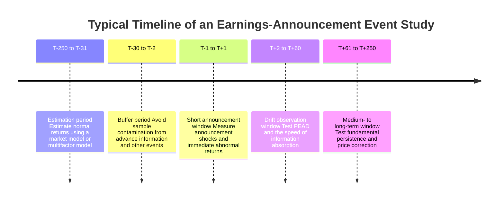
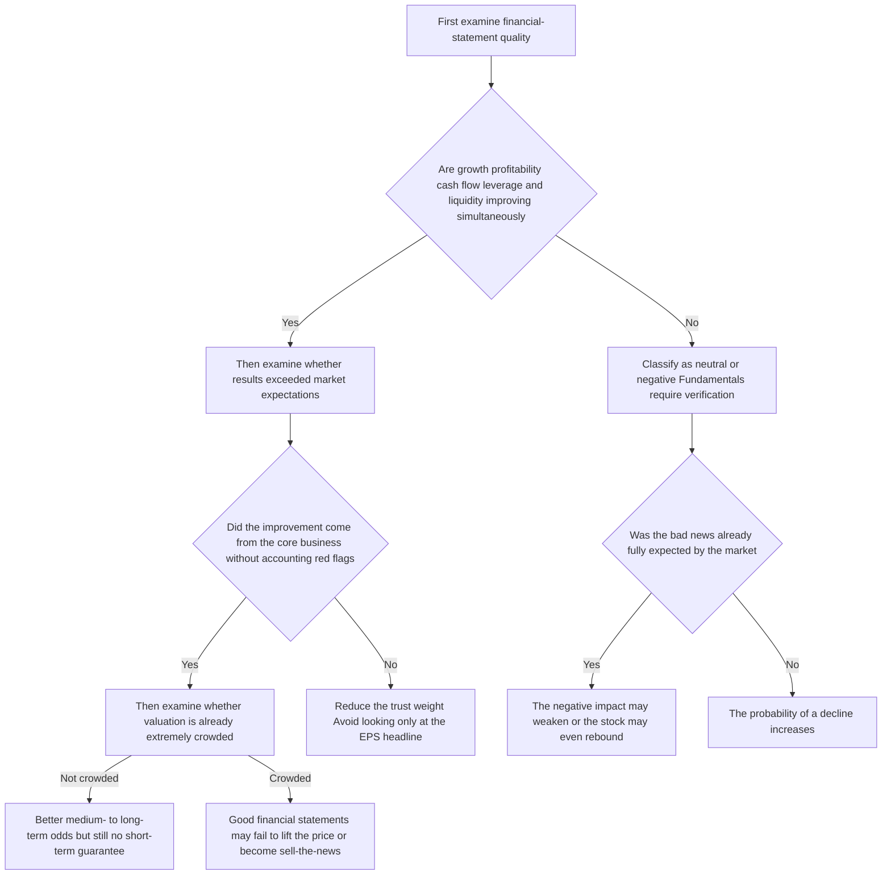

## Executive Summary

The conclusion first: **“Good financial statements” do not mean that the stock price will definitely rise, and “bad financial statements” do not mean that the stock price will definitely fall.** What stock prices reflect is not the financial statement figures themselves, but the market’s post-announcement updates regarding **future cash flows, growth paths, capital allocation, risk premiums, and management credibility**; more importantly, these updates must be evaluated relative to the **expectations that were already reflected in the price**. From the perspective of valuation theory, a stock price is fundamentally the discounted value of future cash flows; from the perspective of accounting-based valuation models, market value is systematically related to current and future earnings, book value, and dividends; from the efficient-market literature, if public information has already been anticipated, the incremental price reaction on the announcement date may be limited. [Damodaran’s discounted-cash-flow framework](https://pages.stern.nyu.edu/~adamodar/New_Home_Page/lectures/val.html), [Ohlson (1995)](https://onlinelibrary.wiley.com/doi/10.1111/j.1911-3846.1995.tb00461.x), [Fama (1970)](https://onlinelibrary.wiley.com/doi/10.1111/j.1540-6261.1970.tb00518.x)

Academic evidence supports a more precise proposition: **financial indicators have statistical relationships with future returns, but these relationships are usually conditional, average-based, and portfolio-level rather than mechanical causal relationships in which one company, one announcement, and one direction are guaranteed.** For example, the classic study by Ball and Brown and its retrospective review indicate that most price adjustments related to annual earnings had already occurred before the formal annual-report announcement; Bernard and Thomas found that drift continues after earnings announcements, showing that the market does not always absorb information immediately and completely; studies by Sloan, Piotroski, Novy-Marx, and Fama–French indicate that accrual quality, financial strength, profitability, investment intensity, and value characteristics help explain average medium- and long-term returns. [Ball and Brown (1968)](https://www.jstor.org/stable/2490232), [Ball and Brown (2014)](https://papers.ssrn.com/sol3/papers.cfm?abstract_id=2304409), [Bernard and Thomas (1989)](https://econpapers.repec.org/article/blajoares/v_3a27_3ay_3a1989_3ai_3a_3ap_3a1-36.htm), [Sloan (1996)](https://papers.ssrn.com/sol3/papers.cfm?abstract_id=2598), [Piotroski (2000)](https://econpapers.repec.org/article/blajoares/v_3a38_3ay_3a2000_3ai_3a_3ap_3a1-41.htm), [Novy-Marx (2013)](https://www.nber.org/papers/w15940), [Fama and French (2015)](https://www.aea.ru/data/pdf/fama2015.pdf)

Therefore, for “good financial statements” to push a stock price upward, several conditions usually need to be satisfied simultaneously: the figures themselves must be good, they must **exceed market expectations**, the quality must be high rather than cosmetically improved by one-off items, forward guidance must not be a drag, the valuation must not be excessively crowded, and macro interest rates and risk appetite must not deteriorate. Conversely, if the market had already been sufficiently pessimistic about “bad financial statements,” the actual result was merely “not as bad,” and the company provided a better future narrative or capital-allocation commitment, the stock price could rise. This phenomenon exists not only in theory, but also repeatedly appears during actual earnings seasons for large technology and growth companies. [Alphabet case](https://www.reuters.com/technology/alphabet-falls-expenses-overshadow-quarterly-results-beat-2024-07-24/), [Meta case](https://www.reuters.com/technology/meta-raises-2024-expenses-forecast-support-ai-development-2024-04-24/), [Tesla 2024 case](https://www.reuters.com/business/autos-transportation/teslas-quarterly-revenue-falls-first-time-since-2020-2024-04-23/), [Tesla 2025 case](https://www.reuters.com/business/autos-transportation/tesla-shares-rise-65-musk-says-cut-back-doge-work-2025-04-23/)

The practical implication for investors is: **do not equate financial-statement quality with the short-term direction of the stock price.** A more reasonable method is to divide financial-statement analysis into three levels: the first level examines fundamental quality; the second examines the gap relative to market expectations; and the third examines current valuation, industry position, and the macro environment. If one looks only at “revenue growth, EPS growth, and a very high ROE” and directly concludes that “the stock price should rise,” the judgment is almost certainly oversimplified. [TWSE Financial Comparison e-Point](https://mopsfin.twse.com.tw/), [TWSE investor education](https://shl.twse.com.tw/newsArticle/library/list/2c9680828c679ec5018c67bdb6d90012), [Fama (1970)](https://onlinelibrary.wiley.com/doi/10.1111/j.1540-6261.1970.tb00518.x), [DellaVigna and Pollet (2009)](https://onlinelibrary.wiley.com/doi/10.1111/j.1540-6261.2009.01447.x), [Hong and Stein (1999)](https://onlinelibrary.wiley.com/doi/10.1111/0022-1082.00184)

## Core Proposition and Evaluation Criteria

If the question is condensed into one sentence, the answer of this study is: **financial statements affect stock prices, but what they affect is the market’s distribution of expectations about the company’s future, not a guarantee of the post-announcement price direction.** The accounting and valuation literature has long pointed out that market value is connected to earnings, book value, dividends, future cash flows, and discount rates. Therefore, financial statements are certainly important to stock prices, but they are only one part of the valuation inputs, and they produce a significant revaluation only when they change the market’s view of the future. [Damodaran’s valuation framework](https://pages.stern.nyu.edu/~adamodar/New_Home_Page/lectures/val.html), [Ohlson (1995)](https://onlinelibrary.wiley.com/doi/10.1111/j.1911-3846.1995.tb00461.x)

Two types of “good” and “bad” must first be distinguished. **The first is good or bad in absolute level**, such as year-over-year revenue growth, positive EPS growth, high ROE, and stable cash flow. **The second is good or bad relative to expectations**, meaning whether the result is above or below the consensus and implied expectations that the market had already embedded. For stock prices, the second type is usually more important than the first. The retrospective by Ball and Brown indicates that most price adjustments related to annual earnings had already occurred before the formal announcement. This is core evidence that “the financial statement figures themselves” differ from “the new information brought by the financial statement announcement.” [Ball and Brown (1968)](https://www.jstor.org/stable/2490232), [Ball and Brown (2014)](https://papers.ssrn.com/sol3/papers.cfm?abstract_id=2304409)

The semi-strong form of the efficient-market hypothesis holds that public information should be rapidly reflected in prices; however, later research also shows that the market does not absorb information immediately, fully, and without bias under all circumstances. Fama’s framework provides a benchmark; Bernard–Thomas’s PEAD, DellaVigna–Pollet’s limited attention, Hong–Stein’s gradual information diffusion, and Jegadeesh–Titman’s momentum all show that financial-statement information may enter prices in incomplete, delayed, and even sentiment- and attention-dependent ways over the short to medium term. [Fama (1970)](https://onlinelibrary.wiley.com/doi/10.1111/j.1540-6261.1970.tb00518.x), [Bernard and Thomas (1989)](https://econpapers.repec.org/article/blajoares/v_3a27_3ay_3a1989_3ai_3a_3ap_3a1-36.htm), [DellaVigna and Pollet (2009)](https://onlinelibrary.wiley.com/doi/10.1111/j.1540-6261.2009.01447.x), [Hong and Stein (1999)](https://onlinelibrary.wiley.com/doi/10.1111/0022-1082.00184), [Jegadeesh and Titman (1993)](https://onlinelibrary.wiley.com/doi/10.1111/j.1540-6261.1993.tb04702.x)

Therefore, the most rigorous criterion adopted in this article is not “good financial statements = rise, bad financial statements = fall,” but the following two statements: **good financial statements increase the probability of a stock-price rise, but do not guarantee a rise; bad financial statements increase the probability of a stock-price decline, but do not guarantee a decline.** This criterion is simultaneously consistent with valuation theory, event-study methodology, cross-sectional studies of company returns, and practical earnings-season experience. [MacKinlay (1997)](https://www.bu.edu/econ/files/2011/01/MacKinlay-1996-Event-Studies-in-Economics-and-Finance.pdf), [Fama and French (2015)](https://www.aea.ru/data/pdf/fama2015.pdf), [Sloan (1996)](https://papers.ssrn.com/sol3/papers.cfm?abstract_id=2598), [Novy-Marx (2013)](https://www.nber.org/papers/w15940)

## Measurable Indicators of Good and Bad Financial Statements

The Taiwan Stock Exchange’s “Financial Comparison e-Point” divides comparable financial information for listed companies into categories including the three major financial statements, financial structure, solvency, operating capability, profitability, cash flow, and growth capability. This classification is highly suitable as a practical framework for “good financial statements/bad financial statements.” It must be emphasized that **every indicator should be compared with the company’s history, peer averages, industry structure, and position in the business cycle rather than being judged by a single universal threshold.** The TWSE also explicitly emphasizes that the platform can compare an individual company, an average of selected companies, and an industry average. [TWSE Financial Comparison e-Point](https://mopsfin.twse.com.tw/), [TWSE investor education](https://shl.twse.com.tw/page/library/tips/2.html)

| Indicator dimension | Common quantitative indicators | Signals closer to “good” | Signals closer to “bad” | Key points for practical interpretation |
|---|---|---|---|---|
| Growth | Year-over-year revenue growth, core-business year-over-year growth, order/subscription/backlog growth | Above peers or the company’s historical median, with sustainable sources of growth | Decline, clear deceleration, or superficial growth supported by non-core businesses | Growth must distinguish between volume and price, one-off effects, and sustainability |
| Earnings per share | GAAP EPS, diluted EPS, adjusted EPS | EPS growth with a low proportion of one-off items | EPS decline, or EPS supported by reclassification or non-recurring gains | The “quality” of EPS is more important than a single EPS point estimate |
| Profitability | Gross margin, operating margin, net margin, ROA, ROE | Stable improvement in margins and high ROE not artificially supported by leverage | Deteriorating margins, low ROE, or passively high ROE caused by shrinking equity | High ROE must be evaluated together with debt and cash flow |
| Cash flow | Operating cash flow, free cash flow, CFO/Net Income | Positive CFO that matches earnings and stable free cash flow | Consecutive negative CFO, or earnings growth accompanied by repeatedly negative cash flow | Divergence between earnings and cash flow is often a quality warning |
| Leverage and solvency | Debt ratio, net debt/EBITDA, interest-coverage ratio | Controllable leverage and improving interest coverage | Rising leverage and weakening coverage | Whether high leverage is dangerous depends heavily on industry characteristics |
| Liquidity | Current ratio, quick ratio, cash position, short-term debt ratio | Low short-term repayment pressure and abundant liquidity | Dependence on short-term debt refinancing and deteriorating current and quick ratios | Liquidity is more valuable during economic downturns |
| Accounting red flags | Accounts-receivable growth vs. revenue, inventory days, abnormal payables, restatements, non-GAAP add-backs, related-party transactions, auditor changes | Stable accounting policies, transparent notes, and explainable gaps between non-GAAP and GAAP | Abnormal expansion of receivables/inventory, recurring large adjustments, restatements, and revenue-recognition disputes | A “red flag” does not necessarily equal fraud, but it always warrants a higher discount rate or a lower trust weight |

The classifications in the table follow the TWSE’s public framework of comparable indicators. “Accounting red flags” must be listed as a separate category because the SEC has long warned investors not to allow excessively polished non-GAAP/pro forma indicators to obscure GAAP results. The AICPA’s *Journal of Accountancy* also lists several classic red flags, including **gross margins significantly above industry peers, earnings growth accompanied by recurring negative operating cash flow, and abnormal days payable or liability recognition**. Sloan further provides capital-market evidence: earnings with high accruals are usually less persistent than earnings with high cash-flow components, and the market gradually corrects this misjudgment in subsequent periods. [TWSE Financial Comparison e-Point](https://mopsfin.twse.com.tw/), [SEC pro forma investor guidance](https://www.sec.gov/about/reports-publications/investorpubsproforma08-11htm), [SEC cautionary advice](https://www.sec.gov/rules-regulations/2001/12/cautionary-advice-regarding-use-pro-forma-financial-information-earnings-releases), [Journal of Accountancy fraud red flags](https://www.journalofaccountancy.com/issues/2010/jan/20092091/), [Sloan (1996)](https://papers.ssrn.com/sol3/papers.cfm?abstract_id=2598)

If “good financial statements” are to be written as a stricter research definition, I would recommend a **multi-indicator, relativized, quality-weighted** approach rather than examining a single ratio. Piotroski’s F-score framework is a classic example: it puts profitability, cash flow, leverage/liquidity, and operating efficiency into one scoring system, and distinguishes financially stronger and weaker companies among stocks with high book-to-market ratios. This method is important precisely because looking only at “cheapness” or only at “growth” is too crude. [Piotroski (2000)](https://econpapers.repec.org/article/blajoares/v_3a38_3ay_3a2000_3ai_3a_3ap_3a1-41.htm)

## Empirical Evidence and Time Horizons

When examining only the **very short term**, the strongest causal identification usually comes from event-study methodology: use the announcement date as the center, estimate abnormal returns, and observe whether the market revalues the new public information within a very short window. MacKinlay defines event studies as a core tool for measuring “the effect of an economic event on the value of a firm.” This design is especially important in financial-statement research because it is closer to causal identification than long-horizon return regressions. [MacKinlay (1997)](https://www.bu.edu/econ/files/2011/01/MacKinlay-1996-Event-Studies-in-Economics-and-Finance.pdf)

The timeline above is a typical practical event-study design: first use the estimation period to construct a normal-return model, then use a short announcement window to measure the immediate reaction, and finally observe whether post-announcement drift exists. A short window helps capture “new information”; a longer observation window is more easily affected by other company events, industry news, and macro variables, so its identification power is usually weaker. This is why “the short term is closer to causality, while the long term is closer to prediction” is an important principle when studying financial statements and stock prices. [MacKinlay (1997)](https://www.bu.edu/econ/files/2011/01/MacKinlay-1996-Event-Studies-in-Economics-and-Finance.pdf), [Fama (1970)](https://onlinelibrary.wiley.com/doi/10.1111/j.1540-6261.1970.tb00518.x)

For the **short term through several weeks**, the classic evidence has two levels. First, earnings information does contain pricing information; second, the market may not react completely in one step. The later review by Ball and Brown indicates that approximately **85%–90%** of the price adjustment related to annual earnings occurs before the announcement month. This means that the market continuously adjusts prices through other public or semi-public signals in advance; however, Bernard and Thomas also found continuing drift after announcements. Chinese-language research on the Taiwan market likewise shows that **the higher the financial-report announcement frequency, the weaker the PEAD**, supporting the proposition that more frequent information arrival reduces delayed reactions. [Ball and Brown retrospective](https://papers.ssrn.com/sol3/papers.cfm?abstract_id=2304409), [Bernard and Thomas (1989)](https://econpapers.repec.org/article/blajoares/v_3a27_3ay_3a1989_3ai_3a_3ap_3a1-36.htm), [Taiwan PEAD study](https://www.airitilibrary.com/Article/Detail/U0017-0610201511223509)

For the **medium term of several months**, the relationship between financial-statement signals and subsequent returns most commonly appears in three lines of evidence. The first is **PEAD**: later research repeatedly summarizes Bernard–Thomas as showing that portfolios with extremely positive or negative earnings surprises continue to exhibit significant drift for 60 days after the announcement; later reviews even describe the annualized abnormal returns of such strategies as being in a double-digit range. The second is the **accrual anomaly**: Sloan found that the lowest-accrual portfolio had approximately **4.9%** abnormal returns in the first year after formation, while the highest-accrual portfolio had approximately **-5.5%**, producing a long–short hedge return of approximately **10.4%**; moreover, more than approximately **40%** of the predictable returns were concentrated around subsequent quarterly earnings announcements. The third is **limited attention**: DellaVigna and Pollet found that earnings announced on Fridays had an immediate reaction approximately **15%** lower, a delayed reaction **70%** higher, and lower trading volume, showing that the speed of information absorption is constrained by attention. [Bernard and Thomas (1989)](https://econpapers.repec.org/article/blajoares/v_3a27_3ay_3a1989_3ai_3a_3ap_3a1-36.htm), [Sloan (1996)](https://papers.ssrn.com/sol3/papers.cfm?abstract_id=2598), [DellaVigna and Pollet (2009)](https://onlinelibrary.wiley.com/doi/10.1111/j.1540-6261.2009.01447.x)

For the **long term of one to several years**, the research focus is no longer “will this earnings report cause a sharp rise tomorrow?” but “which financial characteristics, on average, help explain future returns?” Piotroski found that among high book-to-market stocks, financial-strength screening increased average annual returns by at least **7.5 percentage points**; Novy-Marx found that profitability measured by **gross profit/assets** had roughly as much power as book-to-market in predicting the cross-section of average returns; the Fama–French five-factor model directly incorporated **profitability** and **investment intensity** into the framework for describing average returns and found that the five-factor model explained these return patterns better than the three-factor model. All of this evidence supports the proposition that “fundamentals ultimately matter,” while also reminding us that these are usually **portfolio-average effects**, not short-term guarantees for an individual stock. [Piotroski (2000)](https://econpapers.repec.org/article/blajoares/v_3a38_3ay_3a2000_3ai_3a_3ap_3a1-41.htm), [Novy-Marx (2013)](https://www.nber.org/papers/w15940), [Fama and French (2015)](https://www.aea.ru/data/pdf/fama2015.pdf)

The table below condenses the research conclusions across different time horizons into an actionable interpretation framework.

| Time horizon | What stock prices most commonly reflect | Stronger research evidence | Implications for investors |
|---|---|---|---|
| Intraday to one week | Earnings surprises, guidance, capital expenditure, management tone, non-GAAP/GAAP gaps | Event studies, abnormal returns in announcement windows | If good figures were already expected, the result may even become a sell-the-news event |
| One to six months | Speed of information diffusion, limited attention, momentum, PEAD | Bernard–Thomas, DellaVigna–Pollet, Jegadeesh–Titman | Financial-statement signals may take time to develop rather than being fully reflected on the announcement day |
| One to three years | Profitability, investment efficiency, accrual quality, value, and financial health | Sloan, Piotroski, Novy-Marx, Fama–French | Fundamentals have greater influence on average returns, but still do not guarantee the outcome of an individual stock |

The conclusions in the table correspond respectively to the semi-strong efficiency and event-study frameworks, PEAD and limited attention, momentum, the accrual anomaly, and value and profitability factors. [Fama (1970)](https://onlinelibrary.wiley.com/doi/10.1111/j.1540-6261.1970.tb00518.x), [MacKinlay (1997)](https://www.bu.edu/econ/files/2011/01/MacKinlay-1996-Event-Studies-in-Economics-and-Finance.pdf), [DellaVigna and Pollet (2009)](https://onlinelibrary.wiley.com/doi/10.1111/j.1540-6261.2009.01447.x), [Jegadeesh and Titman (1993)](https://onlinelibrary.wiley.com/doi/10.1111/j.1540-6261.1993.tb04702.x), [Sloan (1996)](https://papers.ssrn.com/sol3/papers.cfm?abstract_id=2598), [Piotroski (2000)](https://econpapers.repec.org/article/blajoares/v_3a38_3ay_3a2000_3ai_3a_3ap_3a1-41.htm), [Novy-Marx (2013)](https://www.nber.org/papers/w15940), [Fama and French (2015)](https://www.aea.ru/data/pdf/fama2015.pdf)

## Why Good Financial Statements May Not Lead to a Rise and Bad Financial Statements May Not Lead to a Fall

The most important reason is that **stock prices react to the gap relative to expectations rather than to absolute good or bad results**. If the market had already bet on extremely high growth and the company merely delivered results that were “very good but not impressive enough,” the stock price could still fall. Conversely, if the market had already become extremely pessimistic, even very poor results could trigger a rebound as long as they were “slightly better than the worst-case scenario.” This logic is consistent with Fama’s information-efficiency framework, Ball–Brown’s finding of pre-announcement price adjustments, and La Porta’s research on systematic biases in investor expectations. [Fama (1970)](https://onlinelibrary.wiley.com/doi/10.1111/j.1540-6261.1970.tb00518.x), [Ball and Brown (2014)](https://papers.ssrn.com/sol3/papers.cfm?abstract_id=2304409), [La Porta (1996)](https://onlinelibrary.wiley.com/doi/10.1111/j.1540-6261.1996.tb05223.x)

The second reason is that financial statements update not only cash flows, but also **discount rates** and **investment requirements**. A company may achieve growth in both revenue and EPS, but if it simultaneously announces substantially higher capital expenditure, weaker free cash flow, intensifying competition, or pressure on future gross margins, the market may lower its valuation multiple. Alphabet’s second quarter of 2024 is a typical example: the official financial report showed year-over-year revenue growth of **14%**, operating income increasing from **$21.838 billion** to **$27.425 billion**, net income increasing from **$18.368 billion** to **$23.619 billion**, and diluted EPS increasing from **$1.44** to **$1.89**; however, Reuters reported that its stock still fell more than **3%** the next day, mainly because AI-infrastructure capital expenditure was above expectations and investors were concerned about margin pressure. [Alphabet Q2 2024 earnings release](https://abc.xyz/assets/19/e4/3dc1d4d6439c81206370167db1bd/2024q2-alphabet-earnings-release.pdf), [Reuters market reaction](https://www.reuters.com/technology/alphabet-falls-expenses-overshadow-quarterly-results-beat-2024-07-24/)

Meta’s first quarter of 2024 made this phenomenon even more pronounced. The official report showed revenue of **$36.455 billion**, up **27%** year over year; operating income of **$13.818 billion**, up **91%**; net income of **$12.369 billion**, up **117%**; and free cash flow of **$12.53 billion**. However, Reuters reported on the same day that the stock plunged approximately **15%** in after-hours trading because of higher expected AI spending and a weaker revenue outlook. In other words, **“things are very good now” is not enough to guarantee “a higher valuation of the future.”** [Meta Q1 2024 results](https://investor.atmeta.com/investor-news/press-release-details/2024/Meta-Reports-First-Quarter-2024-Results/default.aspx), [Reuters market reaction](https://www.reuters.com/technology/meta-raises-2024-expenses-forecast-support-ai-development-2024-04-24/)

The third reason is that so-called “bad financial statements” sometimes trigger **a decline in uncertainty** or **an improved narrative**. In Tesla’s official first-quarter 2024 update, total revenue fell **9%** year over year, operating income fell **56%**, GAAP net income fell **55%**, and free cash flow turned to **-$2.531 billion**; based on the financial statements alone, the result was clearly weak. However, Reuters reported that the market treated plans for cheaper vehicle models and increased production as more important new information than the poor quarterly figures, and the stock surged by approximately **12%** that day. A similar phenomenon occurred in Tesla’s first quarter of 2025: its SEC Form 10-Q showed total revenue declining to **$19.335 billion**, down **9%** year over year; automotive revenue down **20%**; and net income attributable to common shareholders falling from **$1.390 billion** to **$409 million**. However, Reuters reported that the stock still rose nearly **8%** because Musk promised to devote more attention to Tesla. [Tesla Q1 2024 Reuters report](https://www.reuters.com/business/autos-transportation/teslas-quarterly-revenue-falls-first-time-since-2020-2024-04-23/), [Tesla Q1 2024 follow-up](https://www.reuters.com/technology/tesla-jumps-musks-promise-more-affordable-cars-eases-growth-fears-2024-04-24/), [Tesla Q1 2025 Form 10-Q](https://www.sec.gov/Archives/edgar/data/1318605/000162828025018911/tsla-20250331.htm), [Reuters market reaction](https://www.reuters.com/business/autos-transportation/tesla-shares-rise-65-musk-says-cut-back-doge-work-2025-04-23/)

The fourth reason is that **if bad accounting news has already been disclosed in advance, the formal announcement may even become positive because it clears uncertainty.** In tracking the market impact of restatements, the GAO noted that the adjusted market capitalizations of Tyco and AOL increased by approximately **$4.5 billion** in total over the three trading days surrounding the restatement announcements. The GAO’s explanation was that concerns about revenue-recognition issues at these companies had already been absorbed by the market weeks or months earlier, so the formal restatement announcements did not constitute new bad news. This is the most direct and easily overlooked official evidence that “bad financial statements do not necessarily cause a decline.” [GAO-06-678](https://www.gao.gov/assets/gao-06-678.pdf)

## Industry, Macro Environment, and Cases

The same financial indicator has different meanings across industries. The TWSE financial-comparison platform emphasizes comparisons between a company and its industry average not merely as an interface-design choice, but because **financial-statement indicators are highly industry-specific**: high R&D expenses and low current net income at SaaS/platform companies do not necessarily mean the same thing as low net income at mature manufacturers; the leverage levels of banks and insurers also cannot be directly compared with those of general industrial companies. Directly comparing ROE, gross margin, current ratio, and debt ratio across industries often leads to incorrect conclusions. [TWSE Financial Comparison e-Point](https://mopsfin.twse.com.tw/), [TWSE investor education](https://shl.twse.com.tw/newsArticle/library/list/2c9680828c679ec5018c67bdb6d90012)

The macro environment mainly changes the market’s pricing of good financial statements through **discount rates and risk premiums**. From the discounted-cash-flow perspective, asset value is the value of future cash flows discounted at a risk-adjusted rate. Therefore, even if a company’s fundamentals are sound, its valuation multiple may still contract when real interest rates rise, the equity risk premium widens, or overall market risk appetite declines. This is the common mechanism behind many high-growth companies experiencing “financial statements that are not bad, but stock-price pullbacks.” [Damodaran’s discounted-cash-flow framework](https://pages.stern.nyu.edu/~adamodar/New_Home_Page/lectures/val.html)

The table below summarizes several cases that directly answer the original question.

| Type | Company and period | Financial-statement highlights | Stock-price performance | Key explanation |
|---|---|---|---|---|
| Good financial statements but stock price fell | Alphabet, 2024 Q2 | Revenue +14%; operating income and EPS both grew significantly | Fell more than 3% after the announcement | The market cared more about AI capex and margin pressure |
| Good financial statements but stock price plunged | Meta, 2024 Q1 | Revenue +27%; net income +117%; strong FCF | Fell approximately 15% after hours | Higher AI spending and a lighter revenue outlook compressed the valuation |
| Bad financial statements but stock price rose | Tesla, 2024 Q1 | Revenue -9%; operating income -56%; negative FCF | Rose approximately 12% that day | The future product and production-capacity narrative outweighed the weak quarterly figures |
| Bad financial statements but stock price rose | Tesla, 2025 Q1 | Revenue -9%; automotive revenue -20%; net income fell from $1.39 billion to $409 million | Rose nearly 8% that day | The market bet on improved governance and narrative |
| Bad accounting news but stock price rose | Tyco and AOL restatement cases | The restatements themselves were serious negative information | GAO recorded a combined three-day market-cap increase of approximately $4.5 billion | The news had been anticipated before the formal announcement, and the restatements cleared uncertainty |

The financial figures in these cases come from official financial reports/SEC filings, while the price reactions come from Reuters or GAO market tracking. Together, they show that **stock prices react to the direction and information content of new information and to the repricing of future valuation, not to whether accounting figures look good or bad on the surface.** [Alphabet Q2 2024 earnings release](https://abc.xyz/assets/19/e4/3dc1d4d6439c81206370167db1bd/2024q2-alphabet-earnings-release.pdf), [Alphabet Reuters reaction](https://www.reuters.com/technology/alphabet-falls-expenses-overshadow-quarterly-results-beat-2024-07-24/), [Meta Q1 2024 results](https://investor.atmeta.com/investor-news/press-release-details/2024/Meta-Reports-First-Quarter-2024-Results/default.aspx), [Meta Reuters reaction](https://www.reuters.com/technology/meta-raises-2024-expenses-forecast-support-ai-development-2024-04-24/), [Tesla 2024 Reuters report](https://www.reuters.com/business/autos-transportation/teslas-quarterly-revenue-falls-first-time-since-2020-2024-04-23/), [Tesla Q1 2025 Form 10-Q](https://www.sec.gov/Archives/edgar/data/1318605/000162828025018911/tsla-20250331.htm), [Tesla 2025 Reuters reaction](https://www.reuters.com/business/autos-transportation/tesla-shares-rise-65-musk-says-cut-back-doge-work-2025-04-23/), [GAO-06-678](https://www.gao.gov/assets/gao-06-678.pdf)

Another easily overlooked moderating factor is **investor attention and the speed of information diffusion**. DellaVigna and Pollet found that earnings announced on Fridays produced slower reactions; Hong and Stein theoretically showed that if information diffuses gradually among investors, the short term may first exhibit underreaction, followed by momentum, and eventually even overreaction over a longer horizon. This means that “how long it takes for good/bad financial statements to be fully reflected” is itself a conditional question rather than one with a fixed answer. [DellaVigna and Pollet (2009)](https://onlinelibrary.wiley.com/doi/10.1111/j.1540-6261.2009.01447.x), [Hong and Stein (1999)](https://onlinelibrary.wiley.com/doi/10.1111/0022-1082.00184)

## Methodological Limitations, Investment Guidance, and Decision Framework

One of the most common errors in research on “financial statements and stock prices” is treating **correlation as certain causality**. Within a short window around the announcement date, event studies are closer to causal identification; however, when the horizon extends to months or years, numerous covariates in addition to financial statements enter the analysis, including interest rates, industry competition, regulation, mergers and acquisitions, buybacks, exchange rates, commodity prices, and risk appetite. Therefore, long-term research is often better interpreted as “conditional predictive power” rather than “single-driver causality.” [MacKinlay (1997)](https://www.bu.edu/econ/files/2011/01/MacKinlay-1996-Event-Studies-in-Economics-and-Finance.pdf), [Fama (1970)](https://onlinelibrary.wiley.com/doi/10.1111/j.1540-6261.1970.tb00518.x)

The second methodological problem is **survivorship bias and delisting bias**. Piotroski specifically examined the real-time Compustat coverage dates in the sample, emphasizing that financial information had to exist at the time the portfolios were formed rather than being added to the database only afterward; he also examined performance-related delistings over the subsequent two years. These treatments are important because looking back only at “companies that still remain in the database today” usually overstates the feasibility of fundamental strategies. [Piotroski (2000)](https://econpapers.repec.org/article/blajoares/v_3a38_3ay_3a2000_3ai_3a_3ap_3a1-41.htm)

The third problem is **look-ahead bias and announcement-timing bias**. Many factor studies deliberately use accounting data with a lag to ensure that the information was observable to the market at the time. Piotroski’s definition of “financial statements for the year before the formation period” and Novy-Marx’s treatment of variable timing both reflect this principle. If researchers mistakenly use figures that had not yet been announced or were not yet available as investment-decision inputs, backtest performance will be artificially inflated. [Piotroski (2000)](https://econpapers.repec.org/article/blajoares/v_3a38_3ay_3a2000_3ai_3a_3ap_3a1-41.htm), [Novy-Marx (2013)](https://www.nber.org/papers/w15940)

The third problem is **differences in accounting quality and data definitions**. Sloan shows that accruals and cash flow have different implications for the persistence of future earnings; the SEC also warns that non-GAAP indicators may mislead investors under certain circumstances. This means that even if two companies both report “EPS growth,” if one company’s growth is supported by cash flow while the other’s is supported by large accruals, accelerated revenue recognition, or recurring adjustment items, the market may ultimately assign them different valuations. [Sloan (1996)](https://papers.ssrn.com/sol3/papers.cfm?abstract_id=2598), [SEC pro forma investor guidance](https://www.sec.gov/about/reports-publications/investorpubsproforma08-11htm), [SEC cautionary advice](https://www.sec.gov/rules-regulations/2001/12/cautionary-advice-regarding-use-pro-forma-financial-information-earnings-releases)

For investors, I recommend the following practical sequence rather than trading directly from a financial-statement headline.

Translated into one simpler investment rule, the process is: **first examine “quality,” then examine the “gap,” and finally examine the “price.”** “Quality” means financial-statement quality and accounting credibility; the “gap” means the difference between actual results and expectations; and the “price” means the valuation level and the macro discount rate. Without these three layers of judgment, discussing whether “good financial statements will cause the stock to rise” is fundamentally an incomplete proposition. [TWSE Financial Comparison e-Point](https://mopsfin.twse.com.tw/), [SEC pro forma investor guidance](https://www.sec.gov/about/reports-publications/investorpubsproforma08-11htm), [Sloan (1996)](https://papers.ssrn.com/sol3/papers.cfm?abstract_id=2598), [Fama (1970)](https://onlinelibrary.wiley.com/doi/10.1111/j.1540-6261.1970.tb00518.x)

## Priority Reference Sources

The table below prioritizes sources according to their “research and practical interpretation value.” Original papers, official financial statements, official institutions, and Chinese-language sources are given priority. If you later extend this into an investment memorandum, event study, or factor backtest, it is recommended to start with these sources rather than secondary commentary. [TWSE investor education](https://shl.twse.com.tw/page/library/tips/2.html)

| Priority level | Source | Why it matters |
|---|---|---|
| High | [Ball and Brown, *An Empirical Evaluation of Accounting Income Numbers*](https://www.jstor.org/stable/2490232), and the [Ball and Brown (2014) retrospective](https://papers.ssrn.com/sol3/papers.cfm?abstract_id=2304409) | Establishes the classic foundation that earnings contain information, but most price adjustment occurs before the formal announcement |
| High | [Bernard and Thomas, *Post-Earnings-Announcement Drift*](https://econpapers.repec.org/article/blajoares/v_3a27_3ay_3a1989_3ai_3a_3ap_3a1-36.htm) | The foundational original study of delayed price reactions after earnings announcements |
| High | [Sloan, *Do Stock Prices Fully Reflect Information in Accruals and Cash Flows About Future Earnings?*](https://papers.ssrn.com/sol3/papers.cfm?abstract_id=2598) | A representative study of accrual quality, cash-flow quality, and subsequent returns |
| High | [Piotroski, *Value Investing: The Use of Historical Financial Statement Information to Separate Winners from Losers*](https://econpapers.repec.org/article/blajoares/v_3a38_3ay_3a2000_3ai_3a_3ap_3a1-41.htm) | A classic paper that converts financial-statement signals into an actionable classification of financial strength |
| High | [Novy-Marx, *The Other Side of Value: The Gross Profitability Premium*](https://www.nber.org/papers/w15940) | Demonstrates that profitability has strong explanatory power for average returns |
| High | [Fama and French, *A Five-Factor Asset Pricing Model*](https://www.aea.ru/data/pdf/fama2015.pdf) | Incorporates profitability and investment intensity into the average-return framework |
| High | [MacKinlay, *Event Studies in Economics and Finance*](https://www.bu.edu/econ/files/2011/01/MacKinlay-1996-Event-Studies-in-Economics-and-Finance.pdf) | The core methodology for earnings-announcement event studies |
| High | SEC investor warnings on [non-GAAP/pro forma information](https://www.sec.gov/about/reports-publications/investorpubsproforma08-11htm) and [cautionary advice](https://www.sec.gov/rules-regulations/2001/12/cautionary-advice-regarding-use-pro-forma-financial-information-earnings-releases) | Official basis for evaluating whether “attractive financial statements” have been cosmetically improved through accounting adjustments |
| High | [GAO report on financial restatements and market reactions](https://www.gao.gov/assets/gao-06-678.pdf) | Provides official evidence on red flags and cases in which bad news did not necessarily cause a decline |
| High | The TWSE [Financial Comparison e-Point](https://mopsfin.twse.com.tw/) and [investor-education pages](https://shl.twse.com.tw/newsArticle/library/list/2c9680828c679ec5018c67bdb6d90012) | Chinese-language, official, and directly applicable to comparisons of Taiwan-listed companies |
| Medium | Taiwan PEAD research comparing [semiannual, quarterly, and monthly revenue announcements](https://www.airitilibrary.com/Article/Detail/U0017-0610201511223509) | Provides Taiwan-market context and explains the relationship between reporting frequency and delayed reactions |
| Medium | Representative official company reports and SEC filings: [Alphabet 2024 Q2](https://abc.xyz/assets/19/e4/3dc1d4d6439c81206370167db1bd/2024q2-alphabet-earnings-release.pdf), [Meta 2024 Q1](https://investor.atmeta.com/investor-news/press-release-details/2024/Meta-Reports-First-Quarter-2024-Results/default.aspx), [Tesla 2024 Q1](https://www.sec.gov/Archives/edgar/data/1318605/000162828024017503/tsla-20240331.htm), [Tesla 2025 Q1](https://www.sec.gov/Archives/edgar/data/1318605/000162828025018911/tsla-20250331.htm) | Uses real cases to validate that good financial statements do not necessarily lead to a rise and bad financial statements do not necessarily lead to a fall |
| Medium | Reuters reports on the post-announcement reactions of [Alphabet](https://www.reuters.com/technology/alphabet-falls-expenses-overshadow-quarterly-results-beat-2024-07-24/), [Meta](https://www.reuters.com/technology/meta-raises-2024-expenses-forecast-support-ai-development-2024-04-24/), [Tesla 2024](https://www.reuters.com/business/autos-transportation/teslas-quarterly-revenue-falls-first-time-since-2020-2024-04-23/), and [Tesla 2025](https://www.reuters.com/business/autos-transportation/tesla-shares-rise-65-musk-says-cut-back-doge-work-2025-04-23/) | Connects official financial statements to immediate market pricing |

Overall, the most rigorous answer is not a binary one, but a conditional proposition: **the better the quality of the financial statements, the higher the probability that the company will become a good long-term investment; however, whether the stock price rises “right now” mainly depends on whether the result exceeds expectations, whether it is sustainable, whether it is credible, and how much valuation the market is willing to assign at that time.** Similarly, **bad financial statements do increase downside risk, but if the bad news was already reflected in the price, or if the announcement clears uncertainty and is accompanied by a better forward-looking narrative, the stock price may not fall and may even rise.** This is not an exception; it is the market-pricing mechanism itself. [Damodaran’s valuation framework](https://pages.stern.nyu.edu/~adamodar/New_Home_Page/lectures/val.html), [Fama (1970)](https://onlinelibrary.wiley.com/doi/10.1111/j.1540-6261.1970.tb00518.x), [Ball and Brown retrospective](https://papers.ssrn.com/sol3/papers.cfm?abstract_id=2304409), [Alphabet case](https://www.reuters.com/technology/alphabet-falls-expenses-overshadow-quarterly-results-beat-2024-07-24/), [Meta case](https://www.reuters.com/technology/meta-raises-2024-expenses-forecast-support-ai-development-2024-04-24/), [Tesla 2024 case](https://www.reuters.com/business/autos-transportation/teslas-quarterly-revenue-falls-first-time-since-2020-2024-04-23/), [Tesla 2025 case](https://www.reuters.com/business/autos-transportation/tesla-shares-rise-65-musk-says-cut-back-doge-work-2025-04-23/), [GAO restatement evidence](https://www.gao.gov/assets/gao-06-678.pdf)
