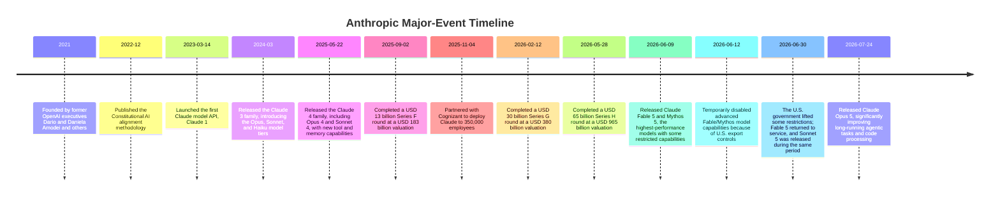

## Executive Summary

- **Company overview:** Anthropic was founded in 2021 by former OpenAI personnel, including Dario Amodei and Daniela Amodei, and is a **public benefit corporation** focused on AI safety. As of mid-2026, it had completed several enormous funding rounds. Its latest Series H round raised **USD 65 billion**, valuing the company at **USD 965 billion** ([Anthropic Series H announcement](https://www.anthropic.com/news/series-h)). The company is headquartered in San Francisco, United States; Dario Amodei is its CEO, and its board includes Netflix co-founder Reed Hastings and others ([Anthropic company overview](https://www.anthropic.com/company)). Its mission-driven culture is emphasized throughout the organization, and its several thousand employees are primarily concentrated in the United States ([Revelio Labs employee data](https://www.reveliolabs.com/companies/anthropic-pbc/employees)).

- **Core products and models:** Anthropic's primary products are the Claude family of large language models, which include several performance tiers: **Haiku** for lower-resource use, **Sonnet** for the middle tier, **Opus** for the high tier, and **Fable/Mythos** for the most advanced capabilities under strict safety controls ([Anthropic company overview](https://www.anthropic.com/company), [Claude Fable 5 and Claude Mythos 5](https://www.anthropic.com/news/claude-fable-5-mythos-5)). Claude models use a GPT-like Transformer architecture, support extremely long contexts of up to one million tokens, and are strong at tasks such as conversational generation and code editing. The latest versions, including the Claude 5 family—Haiku 4.5, Sonnet 5, Opus 5, Fable 5, and Mythos 5—were released progressively ([Introducing Claude Sonnet 5](https://www.anthropic.com/news/claude-sonnet-5), [Claude Fable 5 and Claude Mythos 5](https://www.anthropic.com/news/claude-fable-5-mythos-5)). They can be accessed through the web, mobile applications, and APIs, and are integrated with cloud platforms including AWS, Google Cloud, and Azure ([Claude Haiku](https://www.anthropic.com/claude/haiku)). Pricing varies by model. For example, Haiku 4.5 costs **USD 1 per million input tokens** and **USD 5 per million output tokens** ([Claude Haiku](https://www.anthropic.com/claude/haiku)); Sonnet 5 costs **USD 2 for input** and **USD 10 for output** under introductory pricing ([Introducing Claude Sonnet 5](https://www.anthropic.com/news/claude-sonnet-5)); Opus 4 costs **USD 15 / USD 75** ([Introducing Claude 4](https://www.anthropic.com/news/claude-4)); and Fable/Mythos 5 costs **USD 10 / USD 50** ([Claude Fable 5 and Claude Mythos 5](https://www.anthropic.com/news/claude-fable-5-mythos-5)).

- **Research contributions:** Anthropic has introduced several innovations in AI alignment and safety. Its 2022 **Constitutional AI** method enables a model to critique and improve itself according to a set of principles, reducing harmful outputs ([Constitutional AI: Harmlessness from AI Feedback](https://arxiv.org/abs/2212.08073)). Its 2024 interpretability study, **“Mapping the Mind of a Large Language Model,”** revealed millions of semantic features inside Claude, allowing people to “look inside” the operation of a production-grade large language model for the first time ([Mapping the Mind of a Large Language Model](https://www.anthropic.com/research/mapping-mind-language-model)). The company also emphasizes tool use, long-term memory, and multi-stage “dynamic workflows,” while continuing to improve model accuracy and reliability ([Introducing Claude 4](https://www.anthropic.com/news/claude-4)). Anthropic has published a detailed **Claude Constitution** that discloses the model's values and safety principles ([Claude's Constitution](https://www.anthropic.com/constitution)).

- **Partners and customers:** Anthropic works with major organizations across technology, finance, and government. Important partnerships include Cognizant, which announced in 2025 that Claude and its code-generation tools would be made available to 350,000 employees ([Cognizant partnership announcement](https://www.anthropic.com/news/cognizant-partnership)), and Palantir and AWS, which worked with Anthropic in 2024 to bring Claude to U.S. defense and intelligence agencies ([Axios report on Anthropic, Palantir, and AWS](https://www.axios.com/2024/11/08/anthropic-palantir-amazon-claude-defense-ai)). Claude has also been used by NASA for Mars mission route planning, Norway's sovereign wealth fund for ESG risk analysis, the Williams F1 team, Bluesky's Attie social-platform bot, the California state government, and many other customers ([Claude overview](https://en.wikipedia.org/wiki/Claude_(AI))). By the end of 2025, Anthropic reportedly served more than 300,000 enterprise customers ([TechCrunch report on Anthropic's Series F](https://techcrunch.com/2025/09/02/anthropic-raises-13b-series-f-at-183b-valuation/)), and more than 80% of the Fortune 10 were Claude customers ([Anthropic Series G announcement](https://www.anthropic.com/news/anthropic-raises-30-billion-series-g-funding-380-billion-post-money-valuation)). Its primary cloud partners include AWS, Google Cloud, and Microsoft Azure, enabling Claude to be used through Bedrock, Vertex AI, Foundry, and related platforms ([Anthropic Series H announcement](https://www.anthropic.com/news/series-h), [Anthropic Series G announcement](https://www.anthropic.com/news/anthropic-raises-30-billion-series-g-funding-380-billion-post-money-valuation)).

- **Business strategy and market positioning:** Anthropic positions itself as an enterprise-focused AI platform emphasizing **safety and trustworthiness**, differentiating itself from competitors that lean more heavily toward consumer or open-source strategies. Compared with OpenAI, Anthropic emphasizes “safety first” and long-term alignment research, keeps its model weights closed ([Built In overview of Claude](https://builtin.com/articles/claude-ai)), and applies stricter limits to model use ([MindStudio discussion of Anthropic's alignment philosophy](https://www.mindstudio.ai/blog/anthropic-ai-alignment-philosophy-pentagon-refusal)); OpenAI, by contrast, moved more quickly into the mass market through ChatGPT and is deeply integrated with Microsoft Azure. Google DeepMind's Gemini benefits from extensive research resources and built-in search integration, while Anthropic claims advantages in safety and controllability. Meta's LLaMA family follows an open-source path and does not include comprehensive built-in safeguards; Anthropic instead focuses on **paid enterprise services** and customized solutions. The table below compares Anthropic with its major competitors.

| Attribute | **Anthropic (Claude)** | **OpenAI (ChatGPT/GPT)** | **Google DeepMind (Gemini)** | **Meta (LLaMA)** |
|---|---|---|---|---|
| **Representative models** | Claude 5 family: Haiku, Sonnet, Opus, and Fable/Mythos | GPT-4 / ChatGPT-4 and GPT-3.5 | Gemini, including 1.5 Pro, internally code-named Bakemono | LLaMA 2, recently open-sourced |
| **Performance capabilities** | **Leading coding capabilities**, including top SWE-bench results ([Introducing Claude 4](https://www.anthropic.com/news/claude-4)); maximum input context of up to one million tokens; emphasis on multi-step reasoning and agentic tasks. | Strong general-purpose performance; GPT-4.0 Turbo supports a one-million-token context; includes reinforcement learning and fine-tuning; slightly behind Claude 4/5 on some benchmarks. | High-performance multimodal capabilities, very large internal parameter counts, and integration with search information; context windows reaching tens of thousands of tokens. | Open parameters and continuous community optimization; weaker baseline safety, requiring users to perform their own fine-tuning or use external frameworks. |
| **Safety alignment** | Emphasizes **Constitutional AI** training and customized principles, with a written **Claude Constitution** governing behavior ([Constitutional AI: Harmlessness from AI Feedback](https://arxiv.org/abs/2212.08073), [Claude's Constitution](https://www.anthropic.com/constitution)); strict red-team testing; voluntary restrictions on military uses ([MindStudio discussion of Anthropic's alignment philosophy](https://www.mindstudio.ai/blog/anthropic-ai-alignment-philosophy-pentagon-refusal)). | Uses RLHF, red teaming, and content filtering; has repeatedly corrected safety failures; regularly adjusts its policies. | Internal safety mechanisms emphasize compliance with Google policies, as seen in Bard demonstrations, but fewer implementation details are public. | Primarily relies on user controls and community oversight; lacks strict company-level safety policies. |
| **Pricing and deployment** | **API-based pricing**, ranging from Haiku at USD 1 / USD 5 per million tokens ([Claude Haiku](https://www.anthropic.com/claude/haiku)) to Mythos at USD 10 / USD 50 ([Claude Fable 5 and Claude Mythos 5](https://www.anthropic.com/news/claude-fable-5-mythos-5)); provides developer APIs and free/paid application plans. Available through AWS Bedrock, Google Vertex AI, and Azure Foundry ([Claude Haiku](https://www.anthropic.com/claude/haiku)). | API and commercial plans, including paid ChatGPT subscriptions; pricing examples include approximately USD 5 / USD 30 per million tokens for ChatGPT-4 ([OpenAI API pricing](https://developers.openai.com/api/docs/pricing)); deeply integrated with Azure. | Accessed through the Google Cloud AI platform, Bard, and related applications; specific API pricing has not been publicly disclosed and is handled through enterprise negotiation or internal services. | Model weights are freely available and can be self-hosted; there is no official paid API as an enterprise product, so costs are limited to computing resources. |

- **Regulatory, ethical, and safety controversies:** Anthropic presents itself as “safety first,” but it also faces regulatory challenges. In June 2026, the U.S. Department of Commerce ordered restrictions on providing certain frontier models, including Mythos and Fable, to foreign persons, and Anthropic temporarily suspended related services until the restrictions were lifted ([Claude Fable 5 and Claude Mythos 5](https://www.anthropic.com/news/claude-fable-5-mythos-5)). The company reportedly entered a public dispute with the U.S. Department of Defense after refusing to remove restrictions related to autonomous weapons for Pentagon use ([MindStudio discussion of Anthropic's alignment philosophy](https://www.mindstudio.ai/blog/anthropic-ai-alignment-philosophy-pentagon-refusal), [Claude overview](https://en.wikipedia.org/wiki/Claude_(AI))). At the same time, Anthropic proactively discussed safety evaluations for its most powerful model, Mythos, with the U.S. government and participated in Vatican discussions about AI regulation ([AP report on Anthropic's valuation and Mythos](https://apnews.com/article/anthropic-ai-claude-openai-valuation-86c432fa375548fd4f111f8164d6ffc1)). It has publicly called for stronger AI regulation rather than broad deregulation ([The Guardian report on Anthropic](https://www.theguardian.com/technology/2026/may/28/anthropic-ai-valuation), [Anthropic's position on open-weight models](https://www.anthropic.com/news/position-open-weights-models)). In intellectual property matters, Anthropic accidentally exposed part of the **Claude Code** source code in 2026, leading to 8,100 DMCA takedown requests ([IPKat report on the Claude Code leak](https://ipkitten.blogspot.com/2026/04/the-claude-code-leak-that-spurred-8100.html)), demonstrating the company's strict approach to protecting its core code. Overall, the company has not been involved in a major ethical scandal, but its rapidly expanding valuation and losses have raised market concerns ([AP report on Anthropic's valuation](https://apnews.com/article/anthropic-ai-claude-openai-valuation-86c432fa375548fd4f111f8164d6ffc1)).

- **Intellectual property and licensing:** Claude models and related software are not open source and can be accessed only through APIs and enterprise partnerships ([Built In overview of Claude](https://builtin.com/articles/claude-ai)). Anthropic protects its software through copyright. In 2026, it filed large numbers of DMCA complaints over leaked Claude Code source code ([IPKat report on the Claude Code leak](https://ipkitten.blogspot.com/2026/04/the-claude-code-leak-that-spurred-8100.html)). By comparison, Meta makes LLaMA weights available for research; OpenAI has open-sourced more of some models, such as GPT-3.5, but its most advanced GPT-4 models remain closed; Google has not released Gemini's weights. Anthropic has also presented a regulatory position on “open weights,” arguing that all powerful models should undergo safety testing rather than imposing a blanket prohibition on open models ([Anthropic's position on open-weight models](https://www.anthropic.com/news/position-open-weights-models)).

- **Talent and hiring trends:** The company is rapidly expanding its workforce. Its employee count reached several thousand by the end of 2025 and approximately 3,800 in the first quarter of 2026 ([Revelio Labs employee data](https://www.reveliolabs.com/companies/anthropic-pbc/employees)), with the large majority—73%—working in the United States ([Revelio Labs employee data](https://www.reveliolabs.com/companies/anthropic-pbc/employees)). Public job openings increased sharply: the company had only dozens of job postings in 2024, but more than 1,000 in the first half of 2026 ([Revelio Labs job-posting data](https://www.reveliolabs.com/companies/anthropic-pbc/employees)). Many new employees came from major AI and technology companies, including former OpenAI and Google team members. CEO Dario Amodei has said that the company's sense of mission encourages unusually high employee commitment and reduces attrition.

- **Financial and revenue model:** As a private company, Anthropic does not publish financial statements, but its fundraising and public statements provide a broad outline. In a little more than three years, its funding and valuation rose dramatically: from a valuation of approximately **USD 61.5 billion** in early 2025 to **USD 183 billion** at the end of that year ([Anthropic Series F announcement](https://www.anthropic.com/news/anthropic-raises-series-f-at-usd183b-post-money-valuation)), then to **USD 380 billion** in the 2026 Series G round ([Anthropic Series G announcement](https://www.anthropic.com/news/anthropic-raises-30-billion-series-g-funding-380-billion-post-money-valuation)), and finally to **USD 965 billion** in the Series H round ([Anthropic Series H announcement](https://www.anthropic.com/news/series-h)). The company says demand has grown rapidly. Annual recurring revenue increased from approximately **USD 1 billion** at the beginning of 2025 to **USD 5 billion** in August 2025 ([Anthropic Series F announcement](https://www.anthropic.com/news/anthropic-raises-series-f-at-usd183b-post-money-valuation)), then to **USD 14 billion** in early 2026 ([Anthropic Series G announcement](https://www.anthropic.com/news/anthropic-raises-30-billion-series-g-funding-380-billion-post-money-valuation)). In 2026, the company further stated that its annualized revenue had reached **USD 47 billion** ([Anthropic Series H announcement](https://www.anthropic.com/news/series-h)). Its main revenue sources are Claude API usage fees, enterprise licensing, and dedicated deployments. For example, the code-generation product **Claude Code** generated more than **USD 500 million** in run-rate revenue in 2025 ([Anthropic Series F announcement](https://www.anthropic.com/news/anthropic-raises-series-f-at-usd183b-post-money-valuation)) and reached **USD 2.5 billion** in 2026 ([Anthropic Series G announcement](https://www.anthropic.com/news/anthropic-raises-30-billion-series-g-funding-380-billion-post-money-valuation)). However, heavy investment and rapid expansion also imply growing losses. Market analysis has described Anthropic, together with OpenAI and SpaceX, as companies that “spend more than they earn” ([AP report on Anthropic's valuation](https://apnews.com/article/anthropic-ai-claude-openai-valuation-86c432fa375548fd4f111f8164d6ffc1)), and investors are concerned about a valuation bubble. Overall, Anthropic operates primarily as a **paid enterprise subscription and API platform**, while its profitability remains unclear.

Timeline references: [Dario Amodei overview](https://en.wikipedia.org/wiki/Dario_Amodei); [Constitutional AI paper](https://arxiv.org/abs/2212.08073); [Claude model release timeline](https://hidekazu-konishi.com/entry/anthropic_claude_model_release_timeline.html); [Introducing Claude 4](https://www.anthropic.com/news/claude-4); [Anthropic Series F announcement](https://www.anthropic.com/news/anthropic-raises-series-f-at-usd183b-post-money-valuation); [Cognizant partnership announcement](https://www.anthropic.com/news/cognizant-partnership); [Anthropic Series G announcement](https://www.anthropic.com/news/anthropic-raises-30-billion-series-g-funding-380-billion-post-money-valuation); [Anthropic Series H announcement](https://www.anthropic.com/news/series-h); [Claude Fable 5 and Claude Mythos 5](https://www.anthropic.com/news/claude-fable-5-mythos-5); and [Introducing Claude Sonnet 5](https://www.anthropic.com/news/claude-sonnet-5).

## Key Conclusions and Recommendations

- **Leadership in safety and reliability:** Anthropic's safety-driven approach is its core advantage. Constitutional alignment, self-review, and related methods significantly reduce the risk of model misuse. Future research should examine the effectiveness of its training strategies more deeply and compare them with technologies such as OpenAI's RLHF.

- **Enterprise market focus:** The company primarily targets enterprise customers and works closely with major consulting firms and government agencies, creating stable revenue sources. Evaluations of its business model should examine enterprise adoption rates, sensitivity to competitive pricing, and the maturity of its developer ecosystem.

- **Financial sustainability:** Although Anthropic's fundraising and valuation are unprecedented in scale, it has not yet demonstrated the robustness of its business model. Revenue and loss figures should continue to be monitored, together with the effects that a potential IPO or other financing events may have on its valuation.

- **Technology roadmap:** Beyond the released Claude 5 family, future Claude 6 models and other multimodal systems should be monitored, as should Anthropic's response to the next round of hardware competition, including possible in-house chip development. It is also important to observe how Anthropic expands model applications into areas such as education, scientific research, and other new businesses and partnerships.

- **Regulatory developments:** Anthropic's registration and compliance position generally favors stronger regulation. Developments in U.S. and European AI law should be monitored, together with Anthropic's participation in lobbying and standards development.

- **Follow-up research tasks:** Conduct deeper analysis of Claude's real-world performance across code generation, question answering, multimodal tasks, and other use cases; compare enterprise adoption cases between Anthropic, OpenAI, and other platforms; monitor personnel changes and financial-reporting developments; and study Anthropic's long-term strategy, including patent positioning and global expansion plans, to assess the durability of its competitive position and market influence.

**Sources:** The cited materials include Anthropic's official documents, announcements, and research reports ([Claude Fable 5 and Claude Mythos 5](https://www.anthropic.com/news/claude-fable-5-mythos-5), [Introducing Claude Sonnet 5](https://www.anthropic.com/news/claude-sonnet-5), [Constitutional AI: Harmlessness from AI Feedback](https://arxiv.org/abs/2212.08073), [Anthropic Series H announcement](https://www.anthropic.com/news/series-h)), as well as technology-media reporting ([TechCrunch report on Claude](https://techcrunch.com/2023/01/09/anthropics-claude-improves-on-chatgpt-but-still-suffers-from-limitations/), [AP report on Anthropic's valuation](https://apnews.com/article/anthropic-ai-claude-openai-valuation-86c432fa375548fd4f111f8164d6ffc1), [Axios report on Anthropic, Palantir, and AWS](https://www.axios.com/2024/11/08/anthropic-palantir-amazon-claude-defense-ai)). All information above was drawn from announcements and third-party reports; places where information could not be found were explicitly identified. The content was assembled through careful analysis and citation to provide a complete assessment and actionable recommendations.
