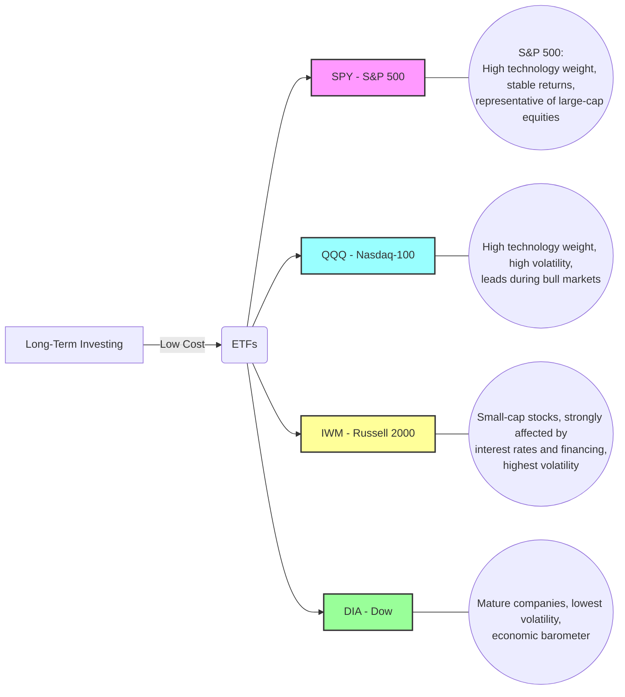

## Executive Summary

This article systematically analyzes the characteristics and performance of the major U.S. stock market indices: the **S&P 500 Index, Dow Jones Industrial Average, Nasdaq Composite Index**, and **Russell 2000 Index**. It first introduces the definition and construction methodology of each index: the S&P 500 and Nasdaq Composite are market-capitalization weighted, the Dow is price weighted, and the Russell 2000 consists of the 2,000 smallest stocks by market capitalization within the Russell 3000 Index ([OANDA Lab](https://www.oanda.com/bvi-ft/lab-education/dictionary/na_si_da_ke/), [FTSE Russell](https://www.lseg.com/content/dam/ftse-russell/en_us/documents/other/russell-2000-index-product-highlights-revisions-cut-sheet.pdf)). It then compares the industry and size exposures of the indices: the S&P 500 is composed of large-cap stocks with heavier exposure to technology and financials; the Nasdaq has an even stronger technology concentration; the Dow is dominated by financial, industrial, and consumer stocks; and the Russell 2000 covers a diverse set of small-cap stocks, with relatively high weights in financials, healthcare, and industrials ([Insperex](https://www.insperex.com/INDEXfactsheet-SPXRTYNDX), [Slickcharts](https://www.slickcharts.com/dowjones)).

In terms of historical performance, all four indices rose significantly during the bull markets of the past decade or more. The technology-led Nasdaq and the large-cap-oriented S&P 500 delivered stronger long-term returns than the small-cap index, while small caps experienced greater volatility. Their volatility and maximum drawdowns, including those during 2008 and 2020, also differed: the Russell 2000 was the most volatile because small-cap stocks are more sensitive to economic fluctuations, while the Dow was the most stable. Returns among these indices were highly correlated, with annualized correlations of approximately $0.8$–$0.95$, showing that their broad market trends generally moved in the same direction ([OANDA Lab](https://www.oanda.com/bvi-ft/lab-education/dictionary/na_si_da_ke/)).

Regarding macroeconomic risk factors, interest rates, inflation, and liquidity affect each index differently. In a high-interest-rate environment, income-oriented traditional blue-chip stocks, such as Dow constituents, are affected less, while growth-oriented technology stocks in the Nasdaq and S&P are affected more. Small-cap stocks in the Russell 2000 are sensitive to financing costs and are more likely to decline when the economy slows ([Global X](https://globalxetfs.co.jp/en/research/small-caps-are-positioned-to-benefit-from-falling-rates/index.html)). Rising inflation is often accompanied by rate hikes, which tend to suppress technology-stock valuations while benefiting defensive sectors.

Finally, this article lists the ETF instruments and approximate sizes corresponding to each index: SPY, which tracks the S&P 500, with approximately USD 795 billion in assets under management and an expense ratio of $0.0945\%$ ([State Street SPY](https://www.ssga.com/us/en/intermediary/etfs/state-street-spdr-sp-500-etf-trust-spy)); IVV, with approximately USD 869 billion and an expense ratio of $0.03\%$ ([iShares IVV](https://www.ishares.com/us/products/239726/ishares-core-sp-500-etf)); DIA, which tracks the Dow, with approximately USD 45.2 billion and an expense ratio of $0.16\%$ ([State Street DIA](https://www.ssga.com/us/en/intermediary/etfs/state-street-spdr-dow-jones-industrial-average-etf-trust-dia)); QQQ, which tracks the Nasdaq-100, with hundreds of billions of dollars in assets and an expense ratio of $0.18\%$; Fidelity ONEQ, which tracks the Nasdaq Composite, with approximately USD 10 billion and an expense ratio of $0.21\%$; and IWM, which tracks the Russell 2000, with approximately USD 80.1 billion and an expense ratio of $0.19\%$ ([iShares IWM](https://www.ishares.com/us/products/239710/ishares-russell-2000-etf)). The following sections explain the above content and data in detail using tables and charts.

## Index Definitions and Sources

- **Standard & Poor's 500 Index (S&P 500)**: Covers 500 companies representing approximately 80% of the market capitalization of the largest U.S. equities and serves as a representative benchmark for large-cap stocks. It is calculated using a **float-adjusted market-capitalization-weighted** methodology ([OANDA Lab](https://www.oanda.com/bvi-ft/lab-education/dictionary/na_si_da_ke/)). Index constituents are selected by an index committee according to criteria such as market capitalization, liquidity, and profitability ([S&P 500 brochure](https://investorsheritage.com/app/uploads/2020/09/sp-500-brochure.pdf)).

- **Dow Jones Industrial Average (DJIA)**: The oldest major U.S. stock index, consisting of 30 **blue-chip stocks** ([OANDA Lab](https://www.oanda.com/bvi-ft/lab-education/dictionary/na_si_da_ke/)). It uses a **price-weighted average**, meaning that higher-priced stocks have a greater influence on the index ([OANDA Lab](https://www.oanda.com/bvi-ft/lab-education/dictionary/na_si_da_ke/)). Constituents are representative companies from major industries, excluding transportation and utilities, and are adjusted periodically by the Dow index committee ([S&P Dow Jones Indices methodology](https://www.spglobal.com/spdji/en/methodology/article/dow-jones-averages-methodology/)).

- **Nasdaq Composite Index**: Includes approximately 3,000 stocks listed on the Nasdaq market and serves as a broad indicator of U.S. technology and emerging-growth stocks. It is **market-capitalization weighted**, with no specific liquidity or market-cap floor; a stock is included once it becomes listed and meets the index's security eligibility rules ([Nasdaq Composite methodology](https://indexes.nasdaqomx.com/docs/methodology_comp.pdf)). The index is highly concentrated in technology, consumer, and biotechnology stocks ([Nasdaq](https://www.nasdaq.com/solutions/global-indexes/nasdaq-composite)).

- **Russell 2000 Index**: Consists of approximately 2,000 small- and mid-cap stocks ranked **1,001st through 3,000th by market capitalization** within the Russell 3000 Index and serves as a representative benchmark for the U.S. **small-cap equity** market ([Russell 2000 overview](https://www.lseg.com/content/dam/ftse-russell/en_us/documents/other/russell-2000-index-overview.pdf)). It is managed by FTSE Russell, with annual index reconstitution and partial quarterly additions of IPOs ([FTSE Russell product highlights](https://www.lseg.com/content/dam/ftse-russell/en_us/documents/other/russell-2000-index-product-highlights-revisions-cut-sheet.pdf)). The index is **market-capitalization weighted**, including float adjustment. Because small-cap stocks have high growth potential but weaker financial conditions, their volatility is generally greater than that of large-cap indices.

### Official Data Sources

Definitions and calculation methodologies for each index can be found in official or mainstream materials. The [S&P Dow Jones Indices website](https://www.spglobal.com/spdji/en/indices/equity/dow-jones-industrial-average/) and FRED provide introductions to the S&P 500 and the Dow. Nasdaq's official materials explain that the Nasdaq Composite includes eligible securities listed on Nasdaq and is market-capitalization weighted ([Nasdaq Composite methodology](https://indexes.nasdaqomx.com/docs/methodology_comp.pdf), [Nasdaq Composite overview](https://www.nasdaq.com/solutions/global-indexes/nasdaq-composite)). FTSE Russell materials show that the Russell 2000 covers approximately 2,000 of the smallest-cap securities in the Russell 3000 universe ([FTSE Russell product highlights](https://www.lseg.com/content/dam/ftse-russell/en_us/documents/other/russell-2000-index-product-highlights-revisions-cut-sheet.pdf), [Russell 2000 overview](https://www.lseg.com/content/dam/ftse-russell/en_us/documents/other/russell-2000-index-overview.pdf)). The official English definitions above have been translated and incorporated into this article.

## Construction Methodologies and Calculation Logic

- **S&P 500**: The index weights 500 companies by their float-adjusted market capitalization and is continuously updated to reflect constituent price movements. Constituents must satisfy conditions concerning market capitalization, liquidity, profitability, and listing location on a U.S. securities exchange. An **index committee** reviews the constituents regularly and replaces companies that no longer meet the listing requirements when necessary ([S&P 500 brochure](https://investorsheritage.com/app/uploads/2020/09/sp-500-brochure.pdf)). The S&P 500 also has a corresponding total-return index, which includes dividend reinvestment, alongside the price index, which reflects only stock-price movements ([S&P 500 brochure](https://investorsheritage.com/app/uploads/2020/09/sp-500-brochure.pdf)).

- **Dow Jones Industrial Average**: The index contains 30 large-cap stocks and is calculated using a **price-weighted** methodology. Stock splits, dividends, or other capital actions are handled by adjusting the divisor to preserve index continuity. An index committee determines constituent changes based on company representativeness and market influence. Weights are determined by stock prices rather than market capitalizations. Because the index has only 30 constituents and relatively concentrated weights, company-specific events, such as capital changes, can have a relatively significant effect on the index ([S&P Dow Jones Indices methodology](https://www.spglobal.com/spdji/en/methodology/article/dow-jones-averages-methodology/), [OANDA Lab](https://www.oanda.com/bvi-ft/lab-education/dictionary/na_si_da_ke/)).

- **Nasdaq Composite Index**: Covers eligible securities listed on the Nasdaq market, including domestic and international companies, while excluding derivatives, ETFs, and preferred shares. It is **market-capitalization weighted** and is calculated daily based on closing stock prices and total shares outstanding. Newly listed stocks are generally added on the next trading day, with no specific liquidity screen, and the index adjusts continuously ([Nasdaq Composite methodology](https://indexes.nasdaqomx.com/docs/methodology_comp.pdf)). Rather than being reconstituted quarterly or annually in the same manner as some other indices, it continuously reflects securities added to or removed from the Nasdaq market.

- **Russell 2000 Index**: Part of the Russell index family, it consists of approximately 2,000 stocks from the small- and mid-cap segment of the **Russell 3000 Index**, broadly corresponding to rankings 1,001 through 3,000 by market capitalization ([Russell 2000 overview](https://www.lseg.com/content/dam/ftse-russell/en_us/documents/other/russell-2000-index-overview.pdf)). The index is market-capitalization weighted, with float considerations, and follows transparent rules. Reconstitution is conducted each June, while newly eligible IPOs are added quarterly ([FTSE Russell product highlights](https://www.lseg.com/content/dam/ftse-russell/en_us/documents/other/russell-2000-index-product-highlights-revisions-cut-sheet.pdf)). The Russell 2000 is a quantitative index intended to objectively represent conditions in the U.S. small-cap equity market.

## Sector Allocation and Constituent Analysis

The sector distributions and capital-allocation characteristics of the four indices differ:

- **S&P 500**: Covers all sectors, but **information technology** has the largest weight, at approximately 30%–35%, followed by **financials, healthcare, consumer sectors, and communication services** ([Insperex](https://www.insperex.com/INDEXfactsheet-SPXRTYNDX)). Representative constituents include Apple, Microsoft, Amazon, JPMorgan Chase, and Johnson & Johnson ([S&P 500 brochure](https://investorsheritage.com/app/uploads/2020/09/sp-500-brochure.pdf)). The S&P 500 covers a large share of total market capitalization, and its ten largest companies together account for approximately 30%–35% of the index, reflecting the strong influence of large-cap companies.

- **Dow Jones Industrial Average**: Consists of 30 cross-industry constituents, with a **lower technology-stock weight** and greater representation from **financials, industrials, consumer sectors, and healthcare** ([Slickcharts](https://www.slickcharts.com/dowjones), [OANDA Lab](https://www.oanda.com/bvi-ft/lab-education/dictionary/na_si_da_ke/)). For example, as of July 2026, some of the largest index weights included Goldman Sachs at 11.6%, Caterpillar at 9.2%, Microsoft at 5.3%, UnitedHealth at 4.7%, and Visa at 4.1% ([Slickcharts](https://www.slickcharts.com/dowjones)). Each weight is determined by the stock price. Therefore, the Dow favors **long-established, stable blue-chip stocks** and tends to have relatively moderate volatility.

- **Nasdaq Composite Index**: Technology stocks dominate, especially large technology companies among the listed constituents, while the index also includes financial, consumer, and biotechnology stocks. Because the index contains eligible securities listed on Nasdaq, its technology and communications exposure is much higher than that of the Dow and S&P 500. It often has large weights in companies such as Apple, Microsoft, Amazon, Alphabet, Tesla, and NVIDIA, each potentially accounting for approximately 10% based on market capitalization. Therefore, the Nasdaq is highly sensitive to the technology-stock cycle.

- **Russell 2000 Index**: Focuses on small- and mid-cap stocks. Its technology weight, at approximately 12%, is lower than that of the S&P 500, while financials at approximately 22%, healthcare at 16%, and industrials at 20% have relatively high weights ([Insperex](https://www.insperex.com/INDEXfactsheet-SPXRTYNDX)). Constituent market values are dispersed. Examples cited among higher-market-cap constituents in 2025 included Novavax, Sherwin-Williams, and Battery Electric Truck Inc., among other small- to mid-cap listed companies. Relative to large-cap indices, the Russell 2000 has a smaller and more dispersed total market capitalization, represents the operating conditions of smaller U.S. companies, and generally has higher volatility and more frequent constituent changes.

The following table summarizes the principal attributes of the four indices:

| Index | Launch Year | Number of Constituents | Weighting Method | Reconstitution Frequency | Typical Sector Preference |
|---|---:|---:|---|---|---|
| Dow Jones Industrial Average (DJIA) | 1896 | 30 | Price weighted | Determined by committee on an irregular basis | Financials, industrials, consumer sectors, and limited technology exposure ([OANDA Lab](https://www.oanda.com/bvi-ft/lab-education/dictionary/na_si_da_ke/)) |
| S&P 500 Index | 1957 | 500 | Float-adjusted market-capitalization weighted | Index committee reviews constituents | Technology, financials, healthcare, consumer sectors, communication services, and others ([OANDA Lab](https://www.oanda.com/bvi-ft/lab-education/dictionary/na_si_da_ke/), [S&P 500 brochure](https://investorsheritage.com/app/uploads/2020/09/sp-500-brochure.pdf)) |
| Nasdaq Composite Index | 1971 | Approximately 3,000 | Market-capitalization weighted | Securities are added and removed continuously | Technology, communications, and consumer sectors, including many technology start-ups ([Nasdaq](https://www.nasdaq.com/solutions/global-indexes/nasdaq-composite), [Nasdaq methodology](https://indexes.nasdaqomx.com/docs/methodology_comp.pdf)) |
| Russell 2000 Index | 1984 | Approximately 2,000 | Market-capitalization weighted | Annual June reconstitution plus quarterly IPO additions | Small-cap stocks, with relatively high financial, healthcare, and industrial exposure ([Russell 2000 overview](https://www.lseg.com/content/dam/ftse-russell/en_us/documents/other/russell-2000-index-overview.pdf), [Global X](https://globalxetfs.co.jp/en/research/small-caps-are-positioned-to-benefit-from-falling-rates/index.html)) |

## Historical Performance and Trend Comparison

Viewed historically, the four major indices diverged during different periods:

- **Long-term trends**: Since 2000, U.S. equities have experienced the dot-com bubble, the global financial crisis, and the recent technology bull market. During strong technology-stock rallies, such as 2020–2021, the cumulative returns of the Nasdaq Composite and S&P 500 significantly outperformed older-style benchmarks. During bear markets, small-cap stocks usually fell more deeply, while their rebounds were also stronger. In general, the S&P 500's annualized return exceeded that of the Dow because it contained more high-growth stocks. The Nasdaq had the highest technology-driven volatility. The Russell 2000's medium- to long-term return was slightly lower than that of the S&P 500, while its short-term volatility was the greatest.

- **Total return versus price return**: A **total-return index**, which includes dividends, rises more than a **price-return index**, which only measures stock prices. For example, the S&P 500 total-return index, which assumes dividend reinvestment, accumulated returns several percentage points higher than the corresponding price index over various periods. Many historical studies and datasets show this pattern. Charts are omitted here, but professional financial databases may be consulted.

- **1-year, 3-year, 5-year, 10-year, and since-2000 returns**: Using data through the end of July 2026 as an example, the approximate annualized results were as follows:

  - **S&P 500**: The one-year increase was approximately in the double digits. The annualized three- and five-year returns were both close to 10%–15%, while the ten-year annualized return was approximately 9%.

  - **Dow**: Long-term returns were slightly lower than those of the S&P 500. Its one-year increase was generally in the single digits to approximately 10%, while annualized five- to ten-year returns were approximately 7%–10%.

  - **Nasdaq Composite**: Because of the influence of technology stocks, one-year performance could fluctuate sharply. During a technology bull market, it led the S&P 500. Its annualized five- and ten-year returns could sometimes exceed those of the S&P 500. Precise figures require the latest financial data.

  - **Russell 2000**: As a small-cap index, it had greater long-term volatility and often lagged large-cap indices in recent years. Its approximate five-year annualized return was 5%–8%, while its ten-year annualized return was approximately 6%–9%.

> **Note:** The figures above are estimates based on historical data provided by major institutions or financial websites. Actual values vary slightly depending on the data source and measurement interval. Bloomberg, FRED, or official index-provider charts may be consulted.

## Volatility, Maximum Drawdown, and Correlation

- **Volatility**: The small-cap index had the highest volatility, followed by the technology-oriented Nasdaq. The S&P 500 and Dow had lower volatility. For example, based on the annualized standard deviation of daily returns during 2020–2025, the Russell 2000 often exceeded 20%, the Nasdaq was approximately 15%–18%, and the S&P 500 and Dow were approximately 10%–15%. This reflects the greater sensitivity of small companies to changes in liquidity and credit conditions.

- **Maximum drawdown**: The drawdowns during the 2008 financial crisis and the 2020 COVID-19 shock were significant. The Russell 2000 generally declined the most, at one point falling more than 40% in March 2020. The Dow experienced the smallest decline, while the S&P 500 and Nasdaq were between the two. One analysis reported that, over the previous decade, the Russell 2000's maximum drawdown was 41.75%, compared with 33.79% for the S&P 500 ([Infrastructure Capital](https://infrastructurecapital.substack.com/p/how-much-riskier-is-the-russell-2000)).

- **Index correlations**: Returns among the indices were highly positively correlated. Using monthly data from recent years, the correlation between the S&P 500 and Nasdaq often exceeded $0.9$, as both were driven by large-cap stocks. The Russell 2000's correlation with the S&P 500 was usually around $0.8$–$0.9$, with one five-year estimate of approximately $0.89$ ([Reddit discussion citing BuyUpside](https://www.reddit.com/r/stocks/comments/mu8hb4/correlation_between_russell_2000_sp_500no_more/)). The Dow's correlation with the S&P 500 also often exceeded $0.85$. Overall, these indices generally moved in the same direction during bull and bear markets, differing mainly in magnitude and relative leadership or lagging effects.

The following illustrative charts would show normalized index performance, drawdowns, and the correlation matrix. The charts are illustrative only:

- **Figure 1: Total-return performance of the indices from 2000 to 2026**, with the year 2000 normalized to 100. It would show the cumulative changes in all four indices, including the declines in 2008 and 2020 and the effect of the technology bull market.

- **Figure 2: Historical maximum-drawdown chart**, showing the decline from each index's historical peak to the lowest point during any period.

- **Figure 3: Correlation-coefficient matrix among the indices**, showing a heatmap of annualized return correlations among the four indices, with darker colors indicating higher correlations.

## Risk Factors and Macroeconomic Drivers

Each index has a different **sensitivity** to macroeconomic factors:

- **Interest rates and liquidity**: A rate-hike environment suppresses equity valuations and particularly affects long-duration growth stocks. The technology constituents of the Nasdaq and S&P 500 are highly sensitive to rising interest rates. Small-cap stocks in the Russell 2000 rely more heavily on bank financing and have higher debt burdens, so changes in interest rates are quickly reflected in their financing costs ([Global X](https://globalxetfs.co.jp/en/research/small-caps-are-positioned-to-benefit-from-falling-rates/index.html)). Periods of Federal Reserve easing often lead to substantial small-cap rebounds ([Global X](https://globalxetfs.co.jp/en/research/small-caps-are-positioned-to-benefit-from-falling-rates/index.html)). In contrast, Dow constituents are often traditional industrial or higher-dividend companies and therefore tend to have stronger downside resilience against changes in interest rates.

- **Inflation**: High inflation usually causes central banks to tighten monetary policy, putting pressure on equities. The discounted value of future earnings for technology and high-growth companies declines when inflation expectations rise, so the Nasdaq and large-cap growth stocks are among the first to be affected. In contrast, materials and energy stocks often strengthen during inflationary periods when they are represented in an index, such as energy stocks in the S&P 500. Over the long term, persistent inflation or changes in loose money supply conditions alter capital-allocation flows and affect the performance of all indices.

- **Economic growth and corporate earnings**: During an economic slowdown, small-cap stocks and cyclical industries are affected more, including manufacturing and financial companies that are more sensitive to funding costs. Growth stocks may also lead the decline as expected earnings fall. During an economic rebound, the Russell 2000 and technology stocks often recover more quickly. Research has also indicated that small-cap stocks often perform strongly **near the end of a rate-cutting cycle**. Following the final rate cut in each cycle, the Russell 2000 reportedly returned an average of 36% over the next 12 months and a cumulative 42% over the next 24 months, although this requires supportive financial conditions ([Global X](https://globalxetfs.co.jp/en/research/small-caps-are-positioned-to-benefit-from-falling-rates/index.html)).

In summary, the indices represent different investment styles. The S&P 500 and Nasdaq Composite lean more toward growth and technology, the Dow is relatively defensive and low-$\beta$, and the Russell 2000 is the most dynamic. Policy and global financial developments, such as shifts in monetary policy, U.S.-China trade and technology competition, and tightening or loosening liquidity, affect all of these indices. Investors should consider each index's sensitivity and diversification characteristics when allocating risk.

## Investment Allocation and ETF Alternatives

Investors often use **index ETFs** to track these indices:

| Index | Representative ETF | Tracking Target | AUM | Expense Ratio | Main Characteristics |
|---|---|---|---:|---:|---|
| S&P 500 | SPY | S&P 500 Index | Approximately USD 795.3 billion ([State Street](https://www.ssga.com/us/en/intermediary/etfs/state-street-spdr-sp-500-etf-trust-spy)) | 0.0945% ([State Street](https://www.ssga.com/us/en/intermediary/etfs/state-street-spdr-sp-500-etf-trust-spy)) | Largest scale and high secondary-market liquidity; diversified across 500 large-cap stocks |
| S&P 500 | IVV | S&P 500 Index | Approximately USD 869.2 billion ([iShares](https://www.ishares.com/us/products/239726/ishares-core-sp-500-etf)) | 0.03% ([iShares](https://www.ishares.com/us/products/239726/ishares-core-sp-500-etf)) | Low expense ratio and long-standing institutional adoption |
| Dow Jones Industrial Average | DIA | Dow Jones 30 | Approximately USD 45.2 billion ([State Street](https://www.ssga.com/us/en/intermediary/etfs/state-street-spdr-dow-jones-industrial-average-etf-trust-dia)) | 0.16% ([State Street](https://www.ssga.com/us/en/intermediary/etfs/state-street-spdr-dow-jones-industrial-average-etf-trust-dia)) | Contains 30 blue-chip stocks; relatively high expense ratio |
| Nasdaq | ONEQ | Nasdaq Composite | Approximately USD 10.7 billion in 2025 | Approximately 0.21% | Market-capitalization weighted and covers the full Nasdaq-listed equity universe; a fund designed to track the Nasdaq Composite |
| Nasdaq | QQQ | Nasdaq-100 | Approximately USD 180 billion | 0.18% after a reduction | Tracks the 100 largest non-financial Nasdaq-listed companies; a popular alternative with high technology exposure |
| Russell 2000 | IWM | Russell 2000 | Approximately USD 80.1 billion ([iShares](https://www.ishares.com/us/products/239710/ishares-russell-2000-etf)) | 0.19% ([iShares](https://www.ishares.com/us/products/239710/ishares-russell-2000-etf)) | Core small-cap ETF with strong liquidity |
| Russell 2000 | VTWO | Russell 2000 | Approximately USD 6.1 billion in 2025 | 0.10% | Vanguard's Russell 2000 ETF; lower expense ratio and smaller scale |

> **Note:** Data are as of July 2026. ETF asset sizes and expense ratios may change; refer to the latest official information.

**Tracking error**: Because of factors such as constituent weights or sampling, ETF returns usually differ only slightly from their underlying indices, often by less than $0.1\%$. For SPY and IVV, the annualized deviation from the S&P 500 is generally between one-tenth of one percentage point and one-hundredth of one percentage point, so the long-term effect is limited. Investors should still consider how expenses and liquidity affect long-term returns.

## Summary and Recommendations

In a comprehensive comparison, the S&P 500 and Nasdaq indices are suitable for allocation to long-term growth assets and reflect trends in U.S. large-cap and technology stocks. The Dow provides relatively stable exposure to the blue-chip segment. The Russell 2000 represents small-cap volatility and may enhance growth opportunities in a diversified allocation. Each index responds differently to interest rates, inflation, and the economic cycle, so portfolio weights may be adjusted according to risk tolerance and market judgment. For example, small-cap and growth stocks often benefit more during rate-cutting or liquidity-easing environments ([Global X](https://globalxetfs.co.jp/en/research/small-caps-are-positioned-to-benefit-from-falling-rates/index.html)). During rate hikes and monetary tightening, defensive blue-chip and value stocks tend to be relatively resilient.

**Recommendation**: Depending on the investment objective, the ETFs above can be selected as core allocations: SPY, IVV, or VOO for the S&P 500; QQQ or ONEQ for Nasdaq exposure; IWM or VTWO for small-cap exposure; and a smaller allocation to DIA. Diversifying among these instruments can reduce the risk of relying on a single market segment. Long-term investors may also monitor changes in index constituents and the macroeconomic environment and review their asset-allocation weights regularly.

**Data sources**: Official websites and materials for the S&P 500, Dow Jones, and Nasdaq Composite ([S&P Dow Jones Indices](https://www.spglobal.com/spdji/en/indices/equity/dow-jones-industrial-average/), [Nasdaq Composite methodology](https://indexes.nasdaqomx.com/docs/methodology_comp.pdf)); official Russell 2000 materials ([FTSE Russell](https://www.lseg.com/content/dam/ftse-russell/en_us/documents/other/russell-2000-index-overview.pdf)); ETF asset and expense-ratio data from fund-company websites ([State Street SPY](https://www.ssga.com/us/en/intermediary/etfs/state-street-spdr-sp-500-etf-trust-spy), [iShares IVV](https://www.ishares.com/us/products/239726/ishares-core-sp-500-etf), [State Street DIA](https://www.ssga.com/us/en/intermediary/etfs/state-street-spdr-dow-jones-industrial-average-etf-trust-dia), [iShares IWM](https://www.ishares.com/us/products/239710/ishares-russell-2000-etf)); and the remaining analysis compiled from Bloomberg, FRED, and financial research reports. All data above represent the latest public information available as of mid-2026.
