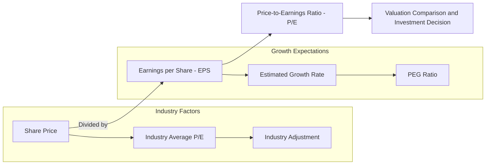

## Executive Summary

- **Definition of the price-to-earnings ratio:** The price-to-earnings ratio, or P/E ratio, is the ratio of a stock’s price to its earnings per share. It measures how much investors are paying for each unit of earnings. Common forms include the **trailing 12-month (TTM) P/E ratio** and the **forward P/E ratio** ([Investopedia](https://www.investopedia.com/terms/p/price-earningsratio.asp), [Charles Schwab](https://www.schwab.com/learn/story/stock-analysis-using-pe-ratio)). It may also be calculated using **normalized earnings** or a cyclical average, such as the well-known Shiller CAPE, to reduce the effects of earnings volatility ([CFA Institute](https://www.cfainstitute.org/insights/professional-learning/refresher-readings/2026/market-based-valuation-price-enterprise-value-multiples), [Cyclically Adjusted Price-to-Earnings Ratio](https://en.wikipedia.org/wiki/Cyclically_adjusted_price-to-earnings_ratio)).

- **Economic meaning:** The P/E ratio reflects the market’s expectations regarding a company’s future growth and risk. A high P/E may mean that the market expects rapid growth, but it may also indicate that the stock price is too high. A low P/E may suggest low expectations or undervaluation, but it may also reflect pressure on earnings ([Charles Schwab](https://www.schwab.com/learn/story/stock-analysis-using-pe-ratio), [ScreenerHero](https://www.screenerhero.com/blog/pe-ratio-stock-screening)). P/E is positively related to expected growth and inversely related to the required rate of return ([CFA Institute](https://www.cfainstitute.org/insights/professional-learning/refresher-readings/2026/market-based-valuation-price-enterprise-value-multiples)). Intuitively, P/E can also be viewed as a “payback period.” For example, a P/E of 15 implies that, assuming annual earnings remain unchanged, it would take 15 years to recover the investment ([GuruFocus](https://www.gurufocus.com/term/pettm/TSLA)).

- **Calculation and examples:** Divide the current stock price by the corresponding EPS. For example, if a stock trades at USD 20 and its TTM EPS is USD 2, then its P/E is 10 ([Charles Schwab](https://www.schwab.com/learn/story/stock-analysis-using-pe-ratio)). In a real-world case, on August 5, 2026, Tesla’s stock price was approximately USD 327 and its TTM EPS was approximately USD 1.08, producing a P/E of approximately 303 ([GuruFocus](https://www.gurufocus.com/term/pettm/TSLA)). Apple at approximately USD 180 with EPS of approximately USD 5 would have a P/E of approximately 36, while an energy stock such as Exxon Mobil at approximately USD 110 with EPS of approximately USD 4 would have a P/E of approximately 27. These last two figures are illustrative. When calculating P/E, EPS should be based on net income after preferred dividends and should correspond to the current share price.

## Definition and Formula

The P/E ratio is calculated as follows ([Investopedia](https://www.investopedia.com/terms/p/price-earningsratio.asp)):

$$
\text{P/E Ratio}
=
\frac{\text{Market Price per Share}}{\text{Earnings per Share}}
$$

EPS is commonly measured using reported earnings from the previous 12 months, or TTM earnings, to calculate the **trailing P/E ratio**. Alternatively, estimated future earnings are used to calculate the **forward P/E ratio** ([Investopedia](https://www.investopedia.com/terms/p/price-earningsratio.asp), [Charles Schwab](https://www.schwab.com/learn/story/stock-analysis-using-pe-ratio)).

The CFA Institute notes that the P/E ratio depends on earnings as its valuation basis. EPS may therefore be distorted by seasonality, business cycles, or accounting methods ([CFA Institute](https://www.cfainstitute.org/insights/professional-learning/refresher-readings/2026/market-based-valuation-price-enterprise-value-multiples), [Investopedia](https://www.investopedia.com/terms/p/price-earningsratio.asp)).

To address cyclical volatility, analysts may calculate **normalized EPS**, such as average earnings over a complete business cycle of five to ten years, or earnings estimated by applying a stable return on equity to average shareholders’ equity ([CFA Institute](https://www.cfainstitute.org/insights/professional-learning/refresher-readings/2026/market-based-valuation-price-enterprise-value-multiples), [Cyclically Adjusted Price-to-Earnings Ratio](https://en.wikipedia.org/wiki/Cyclically_adjusted_price-to-earnings_ratio)).

Another variation is the **cyclically adjusted price-to-earnings ratio**, or CAPE. It divides the stock price by the average inflation-adjusted earnings of the previous ten years:

$$
\text{CAPE}
=
\frac{\text{Current Price}}
{\text{Average Inflation-Adjusted EPS over 10 Years}}
$$

This approach smooths the effect of business cycles on the P/E ratio ([Cyclically Adjusted Price-to-Earnings Ratio](https://en.wikipedia.org/wiki/Cyclically_adjusted_price-to-earnings_ratio)).

## Interpretation and Economic Meaning

The P/E ratio reflects the market’s expectations regarding a company’s earnings growth and risk. The traditional interpretation is:

- **High P/E = high growth expectations or an expensive valuation**
- **Low P/E = low growth expectations or a potentially inexpensive valuation**

However, neither interpretation is definitive ([Charles Schwab](https://www.schwab.com/learn/story/stock-analysis-using-pe-ratio), [ScreenerHero](https://www.screenerhero.com/blog/pe-ratio-stock-screening)).

For example, high-technology companies often trade at higher P/E ratios than energy or financial companies because their expected growth rates are higher. In contrast, a cyclical company may show a low P/E at the peak of its earnings cycle, creating the false impression that the stock is undervalued ([ScreenerHero](https://www.screenerhero.com/blog/pe-ratio-stock-screening)).

From an economic perspective, the dividend discount model implies that a justified P/E ratio is related to the expected growth rate, $$g$$, and the investor’s required rate of return, $$r$$. In general, P/E is positively related to $$g$$ and inversely related to $$r$$ ([CFA Institute](https://www.cfainstitute.org/insights/professional-learning/refresher-readings/2026/market-based-valuation-price-enterprise-value-multiples), [Marshall & Stevens](https://marshall-stevens.com/insights-center/the-sp-500-p-e-ratio-a-historical-perspective/)).

More specifically, the P/E ratio can be interpreted as the number of years of current earnings required to “earn back” the current share price. For example, if EPS is USD 2, the stock price is USD 30, and the P/E ratio is 15, the company would need 15 years of USD 2 annual EPS to earn back the purchase price, assuming earnings remain unchanged ([GuruFocus](https://www.gurufocus.com/term/pettm/TSLA)).

### Industry and Peer Comparisons

Different industries have substantially different business structures. Therefore, P/E comparisons are most meaningful among companies in the **same industry or with similar business models** ([Investopedia](https://www.investopedia.com/terms/p/price-earningsratio.asp), [ScreenerHero](https://www.screenerhero.com/blog/pe-ratio-stock-screening)).

For example, stable-growth consumer staples and technology companies often have relatively high P/E ratios, while capital-intensive, slow-growth energy and industrial companies often have lower P/E ratios ([ScreenerHero](https://www.screenerhero.com/blog/pe-ratio-stock-screening)).

A company’s current P/E can also be compared with its own historical range. A stock trading near the low end of its historical P/E range may be undervalued. A stock trading above its historical average requires further analysis to determine whether its growth opportunities have already been fully reflected in the price or whether it is overvalued ([Charles Schwab](https://www.schwab.com/learn/story/stock-analysis-using-pe-ratio), [Investopedia](https://www.investopedia.com/terms/p/price-earningsratio.asp)).

### Market-Level Valuation

The P/E ratio may also be used to evaluate the overall stock market, such as through the average P/E or CAPE of the S&P 500.

Historically, the S&P 500’s average P/E has been approximately 17 to 19 times ([Marshall & Stevens](https://marshall-stevens.com/insights-center/the-sp-500-p-e-ratio-a-historical-perspective/)). By the end of 2025, however, it had risen to approximately 29.3 times ([Investopedia](https://www.investopedia.com/terms/p/price-earningsratio.asp)).

An unusually high market P/E often implies the possibility of lower future returns. Shiller’s research, for example, found that when the average CAPE was approximately 15, the subsequent 20-year real annualized return was approximately 6.6% ([Cyclically Adjusted Price-to-Earnings Ratio](https://en.wikipedia.org/wiki/Cyclically_adjusted_price-to-earnings_ratio)).

## Calculation Steps and Examples

The general procedure for calculating P/E is as follows:

1. **Obtain the stock price:** Find the latest stock price, $$P$$, from a reliable financial website such as Yahoo Finance.
2. **Confirm the EPS measure:** Decide whether to use **TTM EPS** or **estimated EPS**. TTM EPS is the sum of EPS from the previous four quarters. If the company is an emerging business with negative current earnings, analysts may consider estimated EPS for the next 12 months.
3. **Calculate P/E:** Divide the stock price by EPS. For example, if the market price is USD 20 and TTM EPS is USD 2, the P/E ratio is 10 ([Charles Schwab](https://www.schwab.com/learn/story/stock-analysis-using-pe-ratio)).
4. **Interpret the result in context:** Compare the calculated P/E with the company’s history, industry peers, expected growth, risk, and earnings quality.

### Example 1: Basic P/E Calculation

Assume that a company’s stock price is USD 20 and its TTM EPS is USD 2:

$$
\text{P/E}
=
\frac{\$20}{\$2}
=
10
$$

Investors are paying USD 10 for every USD 1 of trailing annual earnings.

### Example 2: High-P/E Technology Stock

Assume that a technology stock was priced at USD 327.35 in August 2026 and had TTM EPS of USD 1.08:

$$
\text{P/E}
=
\frac{\$327.35}{\$1.08}
\approx
303
$$

In other words, if future annual EPS remained at USD 1.08, it would take approximately 303 years of earnings to recover the purchase price. The data in this example are based on GuruFocus ([GuruFocus](https://www.gurufocus.com/term/pettm/TSLA)).

### Example 3: Illustrative Apple Valuation

Assume that an Apple-related company trades at approximately USD 180 and has TTM EPS of approximately USD 5:

$$
\text{P/E}
=
\frac{\$180}{\$5}
=
36
$$

This is an illustrative value.

### Example 4: Illustrative Energy Company Valuation

Assume that an energy company trades at USD 110 and has EPS of USD 4:

$$
\text{P/E}
=
\frac{\$110}{\$4}
=
27.5
\approx
27
$$

These examples demonstrate the calculation process and show how different P/E ratios reflect differences in market valuation.

> **Note:** If EPS is negative or close to zero, the P/E ratio becomes meaningless. In that case, an investor may use the **earnings yield** or another valuation metric.

$$
\text{Earnings Yield}
=
\frac{1}{\text{P/E}}
=
\frac{\text{EPS}}{\text{Share Price}}
$$

## Variations of the P/E Ratio

In addition to the standard P/E ratio, common variations include the following.

### Forward P/E

The **forward P/E ratio** uses estimated EPS for the next 12 months and reflects expectations for future profitability ([Investopedia](https://www.investopedia.com/terms/p/price-earningsratio.asp)):

$$
\text{Forward P/E}
=
\frac{\text{Current Share Price}}
{\text{Estimated EPS over the Next 12 Months}}
$$

It is useful for evaluating growth companies, but it depends on the accuracy of analyst forecasts and may become misleading when expectations are not realized.

### Normalized P/E

The **normalized P/E ratio** uses adjusted EPS, such as earnings excluding one-time items or an estimate of mid-cycle earnings, to reduce interference from cyclical or exceptional events ([CFA Institute](https://www.cfainstitute.org/insights/professional-learning/refresher-readings/2026/market-based-valuation-price-enterprise-value-multiples), [ScreenerHero](https://www.screenerhero.com/blog/pe-ratio-stock-screening)):

$$
\text{Normalized P/E}
=
\frac{\text{Current Share Price}}
{\text{Normalized EPS}}
$$

It is suitable for cyclical companies or companies with highly volatile earnings, although the normalization method is subjective.

### CAPE

The **CAPE ratio**, also called the Shiller P/E, uses ten-year average inflation-adjusted earnings ([Cyclically Adjusted Price-to-Earnings Ratio](https://en.wikipedia.org/wiki/Cyclically_adjusted_price-to-earnings_ratio)):

$$
\text{CAPE}
=
\frac{\text{Current Price}}
{\text{10-Year Average Real EPS}}
$$

It is mainly used for long-term market-level valuation. It is not well suited to short-term analysis or the valuation of a single company.

### PEG Ratio

The **PEG ratio** divides P/E by the expected earnings growth rate to incorporate growth into the valuation ([Investopedia](https://www.investopedia.com/terms/p/pegratio.asp)):

$$
\text{PEG}
=
\frac{\text{P/E}}
{\text{Expected Annual Earnings Growth Rate (\%)}}
$$

A PEG below 1 is often viewed as indicating a relatively inexpensive valuation. It is useful for comparing high-growth companies, but it depends heavily on growth forecasts and may not be comparable across industries.

### Industry-Adjusted P/E

An **industry-adjusted P/E** compares a company’s P/E with the average P/E of companies in the same industry or risk group. This approach reduces the effect of structural valuation differences across industries ([Investopedia](https://www.investopedia.com/terms/p/price-earningsratio.asp), [ScreenerHero](https://www.screenerhero.com/blog/pe-ratio-stock-screening)).

One simple expression is:

$$
\text{Relative P/E}
=
\frac{\text{Company P/E}}
{\text{Industry Average P/E}}
$$

This helps investors judge whether a stock is relatively expensive or inexpensive within its industry.

## Comparison of Common P/E Types

| P/E Type | Definition and Formula | Primary Use | Limitations and Suitable Context |
|---|---|---|---|
| **Trailing P/E (TTM)** | Current price divided by EPS from the previous 12 months | Uses realized historical earnings to value mature companies and relatively lower-risk businesses | Backward-looking; may be distorted by temporary earnings peaks, troughs, or nonrecurring items |
| **Forward P/E** | Current price divided by estimated EPS for the next 12 months | Evaluates growth or transforming companies and reflects market expectations | Entirely dependent on earnings forecasts; sensitive to forecast error and differences in company guidance |
| **Normalized P/E** | Current price divided by adjusted EPS after removing cyclical or one-time effects | Estimates sustainable earnings power by removing business-cycle and one-time distortions | Adjustment methodology is subjective and sensitive to long-term trends, impairments, and other events |
| **CAPE** | Price divided by ten-year average real EPS | Long-term market valuation and estimation of average returns over long horizons | Emphasizes long-term averages; unsuitable for a single quarter or individual company; cross-market comparisons require caution |
| **PEG Ratio** | P/E divided by the annual earnings growth rate in percentage terms | Compares growth characteristics and gives more weight to growth when P/E ratios are similar | Growth-rate sources vary; industry standards differ; difficult to compare across industries |
| **Industry-Adjusted P/E** | Comparison of a company’s P/E with the average P/E of its industry or index | Relative valuation within an industry while balancing differences in growth and risk | Industry classifications differ and may overlook company-specific fundamentals |

## Advantages and Limitations

### Advantages

The P/E ratio is simple, intuitive, and widely used. It is one of the primary measures of company valuation ([CFA Institute](https://www.cfainstitute.org/insights/professional-learning/refresher-readings/2026/market-based-valuation-price-enterprise-value-multiples), [Investopedia](https://www.investopedia.com/terms/p/price-earningsratio.asp)).

It emphasizes the idea that earnings per share are a major driver of investment value. In peer comparisons, P/E can quickly reveal how a company’s valuation differs from those of its peers or from its own historical levels, making it useful for relative valuation ([Investopedia](https://www.investopedia.com/terms/p/price-earningsratio.asp), [Charles Schwab](https://www.schwab.com/learn/story/stock-analysis-using-pe-ratio)).

### Limitations

#### Negative or Zero Earnings

If a company has no earnings, negative earnings, or approximately break-even earnings, P/E is not meaningful. Most databases report the P/E as N/A until the company becomes profitable ([Investopedia](https://www.investopedia.com/terms/p/price-earningsratio.asp)).

In such cases, investors may consider the earnings yield, revenue multiples, cash-flow multiples, or other valuation measures.

#### Accounting Manipulation and One-Time Items

P/E depends on company-reported earnings. If earnings include nonrecurring income or expenses, such as asset sales, restructuring costs, or impairment losses, or if the financial statements contain accounting errors or manipulation, the P/E ratio may be distorted ([Investopedia](https://www.investopedia.com/terms/p/price-earningsratio.asp), [ScreenerHero](https://www.screenerhero.com/blog/pe-ratio-stock-screening)).

For example, a large one-time expense can cause EPS to collapse and mechanically raise the trailing P/E, potentially misleading the valuation analysis.

#### Differences Across Industries

Industries have different growth rates, capital structures, and earnings patterns. This creates systematic differences in P/E levels. Directly comparing companies from unrelated industries may lead to incorrect conclusions ([Investopedia](https://www.investopedia.com/terms/p/price-earningsratio.asp), [ScreenerHero](https://www.screenerhero.com/blog/pe-ratio-stock-screening)).

P/E should therefore be compared primarily within similar industries or adjusted for industry differences.

#### Leverage Effects

Differences in capital structure affect EPS. For example, two companies may have similar operations, but the company with more debt may have a lower P/E because debt changes both earnings and equity value. A lower P/E does not necessarily imply a lower total capital cost or lower risk ([Investopedia](https://www.investopedia.com/terms/p/price-earningsratio.asp), [ScreenerHero](https://www.screenerhero.com/blog/pe-ratio-stock-screening)).

Metrics such as **enterprise value to EBITDA**, or EV/EBITDA, can help account for differences in leverage.

#### Limited Treatment of the Future

Traditional P/E uses either historical EPS or forecast EPS but does not directly incorporate all changes in future growth momentum or risk. In high-growth or highly cyclical situations, P/E alone may produce misleading conclusions ([Investopedia](https://www.investopedia.com/terms/p/price-earningsratio.asp), [ScreenerHero](https://www.screenerhero.com/blog/pe-ratio-stock-screening)).

P/E should therefore be used together with PEG, PEG, or fundamental analysis.

## Practical Applications and Adjustments

### Selecting the Right Comparison Benchmark

Investors often compare P/E with:

- **Peers in the same industry**
- **The company’s own historical P/E range**
- **An industry or market index**
- **A broader market benchmark**

These comparisons help determine whether a stock is relatively undervalued or overvalued ([Charles Schwab](https://www.schwab.com/learn/story/stock-analysis-using-pe-ratio), [Investopedia](https://www.investopedia.com/terms/p/price-earningsratio.asp)).

For example, if a stock’s P/E is significantly below its ten-year historical average, but the industry’s P/E has also declined during the same period, further analysis is required to determine whether the entire industry’s outlook has weakened.

### Comparable-Company Valuation

In a comparable-company valuation, analysts multiply a target company’s EPS by the average or median P/E of similar companies to estimate a valuation range.

$$
\text{Estimated Share Price}
=
\text{Selected Comparable P/E}
\times
\text{Target Company EPS}
$$

The CFA Institute explains that the economic foundation of the comparable-company method is the **law of one price**: assets with similar fundamentals, such as growth and profitability, should have similar valuation multiples ([CFA Institute](https://www.cfainstitute.org/insights/professional-learning/refresher-readings/2026/market-based-valuation-price-enterprise-value-multiples)).

### Example: Estimating Fair Value from a Peer P/E

Assume that comparable companies trade at an average forward P/E of 20 and the target company is expected to earn USD 6 per share next year:

$$
\text{Estimated Share Price}
=
20
\times
\$6
=
\$120
$$

The estimated value is USD 120 per share before adjusting for company-specific differences in growth, risk, leverage, and earnings quality.

### Terminal Value in a DCF Model

In a multistage discounted cash-flow model, the terminal value may be estimated using an industry or comparable-company P/E as an exit multiple ([CFA Institute](https://www.cfainstitute.org/insights/professional-learning/refresher-readings/2026/market-based-valuation-price-enterprise-value-multiples)):

$$
\text{Terminal Equity Value at Year } n
=
\text{EPS}_{n}
\times
\text{Terminal P/E}
$$

This terminal value must then be discounted back to the present.

### Earnings Normalization

For cyclical or seasonal companies, analysts may use multi-year average EPS to reduce the effects of earnings peaks and troughs ([CFA Institute](https://www.cfainstitute.org/insights/professional-learning/refresher-readings/2026/market-based-valuation-price-enterprise-value-multiples), [ScreenerHero](https://www.screenerhero.com/blog/pe-ratio-stock-screening)).

They may also exclude one-time income or expenses and use recurring operating earnings or recurring EPS.

### Changes in Share Count

Large share repurchases or new share issuance change the denominator used to calculate EPS and therefore affect P/E.

Analysts may use share-count-adjusted EPS or calculate the ratio using total market capitalization and total earnings:

$$
\text{P/E}
=
\frac{\text{Market Capitalization}}
{\text{Total Net Earnings Available to Common Shareholders}}
$$

This formulation avoids inconsistencies caused by mismatched per-share figures.

### Non-GAAP Earnings

Some companies, especially technology startups, report adjusted earnings that exclude restructuring costs, stock-based compensation, or other items.

Investors may calculate P/E using recurring or adjusted earnings, but comparisons must be made carefully because a P/E based on non-GAAP earnings is not directly comparable with one based on GAAP earnings.

### Decision Rules and Risks

A simplified rule of thumb is that a P/E below the industry average may indicate a buying opportunity, provided that deterioration in the underlying business has been ruled out ([ScreenerHero](https://www.screenerhero.com/blog/pe-ratio-stock-screening), [GuruFocus](https://www.gurufocus.com/term/pettm/TSLA)).

However, a low P/E combined with recession exposure, declining earnings, or high leverage may represent a value trap ([ScreenerHero](https://www.screenerhero.com/blog/pe-ratio-stock-screening)).

P/E may also be cross-checked with EV/EBITDA. If a stock’s P/E is far below the industry average but its EV/EBITDA is not low, the apparently low P/E may be caused by high debt rather than a genuinely inexpensive enterprise valuation ([ScreenerHero](https://www.screenerhero.com/blog/pe-ratio-stock-screening)).

During economic downturns or periods of rising interest rates, market P/E ratios often decline and high-P/E stocks face increased valuation risk. Investors should therefore consider the effect of macroeconomic risk on valuation ([Marshall & Stevens](https://marshall-stevens.com/insights-center/the-sp-500-p-e-ratio-a-historical-perspective/)).

## Common Pitfalls and Recommendations

### Do Not Use P/E in Isolation

P/E reflects only one dimension of earnings-based valuation. It ignores debt, growth, and financial quality.

It should be evaluated together with revenue growth, gross margin, net margin, cash flow, leverage, and other measures of business quality ([Investopedia](https://www.investopedia.com/terms/p/price-earningsratio.asp), [ScreenerHero](https://www.screenerhero.com/blog/pe-ratio-stock-screening)).

### Avoid Misreading Cyclical Peaks

A cyclical company may show an unusually low P/E at the peak of its earnings cycle, even though its risk is increasing. At the bottom of the cycle, its P/E may become extremely high, even though the stock may be approaching an attractive entry point ([ScreenerHero](https://www.screenerhero.com/blog/pe-ratio-stock-screening)).

To address this issue, analysts may calibrate P/E using average earnings across the cycle ([CFA Institute](https://www.cfainstitute.org/insights/professional-learning/refresher-readings/2026/market-based-valuation-price-enterprise-value-multiples), [Cyclically Adjusted Price-to-Earnings Ratio](https://en.wikipedia.org/wiki/Cyclically_adjusted_price-to-earnings_ratio)).

### Growth and Valuation May Become Disconnected

When a high-growth company has zero or extremely low short-term EPS, P/E cannot measure its value reasonably. PEG or other valuation metrics may be more appropriate ([ScreenerHero](https://www.screenerhero.com/blog/pe-ratio-stock-screening), [GuruFocus](https://www.gurufocus.com/term/pettm/TSLA)).

### Accounting-Policy Differences

Industries and companies may apply different policies for depreciation, inventory, research-and-development capitalization, and other accounting items. Direct P/E comparisons may therefore be misleading.

### Use the Appropriate Timing Window

P/E is most useful after financial results have been released and EPS is known, or after earnings forecasts have stabilized.

Immediately before an earnings release, or during a highly volatile earnings season, changes in trailing P/E may be heavily affected by information shocks.

## P/E Calculation and Application Flow

**Figure:** Relationship among P/E calculation, industry adjustment, growth expectations, and investment decisions.

## Sources

This report is based on materials from [Investopedia](https://www.investopedia.com/terms/p/price-earningsratio.asp), [CFA Institute](https://www.cfainstitute.org/insights/professional-learning/refresher-readings/2026/market-based-valuation-price-enterprise-value-multiples), [Charles Schwab](https://www.schwab.com/learn/story/stock-analysis-using-pe-ratio), [ScreenerHero](https://www.screenerhero.com/blog/pe-ratio-stock-screening), [GuruFocus](https://www.gurufocus.com/term/pettm/TSLA), [Investopedia’s PEG Ratio guide](https://www.investopedia.com/terms/p/pegratio.asp), [Marshall & Stevens](https://marshall-stevens.com/insights-center/the-sp-500-p-e-ratio-a-historical-perspective/), and the reference page on the [cyclically adjusted price-to-earnings ratio](https://en.wikipedia.org/wiki/Cyclically_adjusted_price-to-earnings_ratio).

According to the selected example, Tesla’s TTM P/E reached approximately 303 on August 5, 2026 ([GuruFocus](https://www.gurufocus.com/term/pettm/TSLA)).
