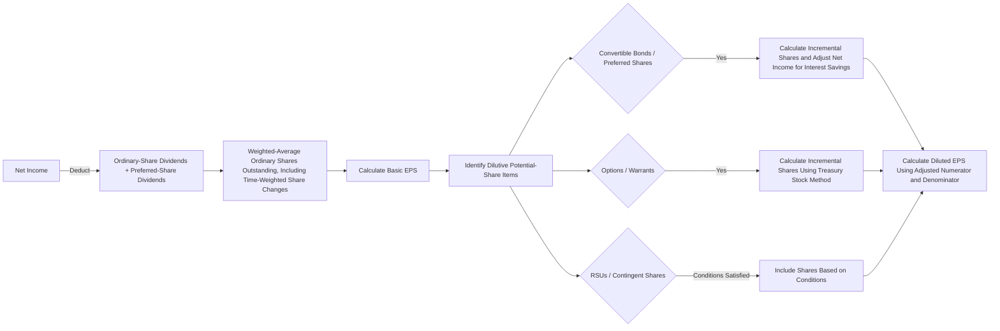

## Executive Summary

Earnings per share (EPS) is an important metric for measuring a company’s profit-generating efficiency. Basic EPS and diluted EPS must be presented with equal prominence in the statement of comprehensive income ([IFRS Foundation — IAS 33 Earnings per Share](https://www.ifrs.org/issued-standards/list-of-standards/ias-33-earnings-per-share/#standard)).

Basic EPS is calculated by dividing net income attributable to ordinary shareholders, after deducting preferred-stock dividends, by the weighted-average number of ordinary shares outstanding ([Profit Vision Lab — Income Statement: From Revenue to EPS](https://profitvisionlab.com/income-statement-deep/)). Diluted EPS assumes that all potential ordinary shares—such as convertible bonds, options, and restricted shares—have been converted, and then calculates EPS using the enlarged share base to reflect the effect of equity dilution ([Profit Vision Lab — Income Statement: From Revenue to EPS](https://profitvisionlab.com/income-statement-deep/)).

The calculation must account for changes in share count caused by treasury-share repurchases, new issuances, stock dividends, and stock splits. Accounting standards also require prior-period data to be adjusted retrospectively when appropriate ([RSM — Earnings Per Share](https://rsmus.com/content/dam/rsm/insights/financial-reporting/1pdf/financial-reporting-insights-earnings-per-share-202311.pdf); [Taiwan Stock Exchange — IAS 33](https://www.twse.com.tw/staticFiles/listed/ifrsCriteria/%7BF47070B5-2640-6C06-C9B0-8981B7EE2396%7D.pdf)).

In addition, IFRS under IAS 33 and U.S. GAAP under ASC 260 differ in areas such as convertible instruments, contingently issuable shares, and the two-class method for preferred shares ([RSM — U.S. GAAP vs. IFRS: Earnings Per Share](https://rsmus.com/content/dam/rsm/insights/financial-reporting/us-gaap-vs-ifrs-comparisons/us_gaap_ifrs_earnings_per_share.pdf.pdf)).

Corporate financial strategies—including treasury-share repurchases, dividend policies, mergers and acquisitions, and tax planning—can materially influence both short-term and long-term EPS trends. These strategies may raise short-term EPS while also creating potential effects on corporate value and risk. The following report examines EPS calculation mechanics, accounting-treatment differences, strategic effects, and industry cases, and concludes with best-practice recommendations and risk-monitoring indicators.

## Basic EPS Formula and Weighted-Average Shares

- **Basic EPS formula:** Basic EPS is calculated by dividing net income attributable to ordinary shareholders, after deducting all preferred-stock dividends, by the weighted-average number of ordinary shares outstanding ([Profit Vision Lab — Income Statement: From Revenue to EPS](https://profitvisionlab.com/income-statement-deep/)).

$$
\text{Basic EPS}
=
\frac{
\text{Net Income}
-
\text{Preferred-Stock Dividends}
}{
\text{Weighted-Average Ordinary Shares Outstanding}
}
$$

The numerator is net income for the reporting period after preferred-stock dividends have been deducted. The denominator is the time-weighted average number of ordinary shares actually outstanding during the period ([Taiwan Stock Exchange — IAS 33](https://www.twse.com.tw/staticFiles/listed/ifrsCriteria/%7BF47070B5-2640-6C06-C9B0-8981B7EE2396%7D.pdf); [RSM — Earnings Per Share](https://rsmus.com/content/dam/rsm/insights/financial-reporting/1pdf/financial-reporting-insights-earnings-per-share-202311.pdf)). Basic EPS includes only ordinary shares that have actually been issued and are outstanding.

The **weighted-average share count** must reflect the time weighting of shares issued or repurchased during the year. For example, if one million shares are issued on July 1, only six months of outstanding time are included in that year’s calculation, equivalent to 500,000 full-year weighted shares ([Profit Vision Lab — Income Statement: From Revenue to EPS](https://profitvisionlab.com/income-statement-deep/)).

For stock dividends or stock splits, because the capital structure is treated as having changed from the beginning of the period, EPS must be retrospectively adjusted for prior periods ([RSM — Earnings Per Share](https://rsmus.com/content/dam/rsm/insights/financial-reporting/1pdf/financial-reporting-insights-earnings-per-share-202311.pdf); [Taiwan Stock Exchange — IAS 33](https://www.twse.com.tw/staticFiles/listed/ifrsCriteria/%7BF47070B5-2640-6C06-C9B0-8981B7EE2396%7D.pdf)). For example, in a two-for-one stock dividend in which two new shares are issued for every existing share, the original share count must be multiplied by three, or $$1+2$$, to establish the new base.

- **Treatment of the Basic EPS numerator:** The numerator of Basic EPS is net income attributable to ordinary shareholders, including operating net income less preferred-stock dividends. If a company has cumulative preferred shares, the required preferred dividend must be deducted from net income even if it has not actually been paid ([RSM — Earnings Per Share](https://rsmus.com/content/dam/rsm/insights/financial-reporting/1pdf/financial-reporting-insights-earnings-per-share-202311.pdf)).

  In consolidated financial statements, the portion of earnings attributable to noncontrolling interests in less-than-wholly-owned subsidiaries must also be excluded ([RSM — Earnings Per Share](https://rsmus.com/content/dam/rsm/insights/financial-reporting/1pdf/financial-reporting-insights-earnings-per-share-202311.pdf)).

- **Prior-period restatement:** If prior-period financial statements must be restated because of an error, the prior-period EPS figures must also be recalculated retrospectively ([RSM — Earnings Per Share](https://rsmus.com/content/dam/rsm/insights/financial-reporting/1pdf/financial-reporting-insights-earnings-per-share-202311.pdf)).

  For example, if revised prior-period net income changes, the weighted-average share count and EPS must be recalculated, and the difference before and after adjustment must be disclosed in the notes ([RSM — Earnings Per Share](https://rsmus.com/content/dam/rsm/insights/financial-reporting/1pdf/financial-reporting-insights-earnings-per-share-202311.pdf)).

## Diluted EPS and the Treatment of Potential Ordinary Shares

- **Concept of Diluted EPS:** Diluted EPS assumes that all dilutive potential ordinary shares were converted into ordinary shares during the reporting period, and then recalculates earnings per share ([RSM — Earnings Per Share](https://rsmus.com/content/dam/rsm/insights/financial-reporting/1pdf/financial-reporting-insights-earnings-per-share-202311.pdf); [Profit Vision Lab — Income Statement: From Revenue to EPS](https://profitvisionlab.com/income-statement-deep/)).

Potential ordinary shares include convertible corporate bonds or convertible preferred shares, exercisable employee stock options and warrants, restricted shares such as RSUs and PSUs, and contingently issuable shares.

The calculation principle is to increase the denominator by the number of potential shares while also adjusting net income for related effects, such as interest expense that would have been avoided. The result is a potentially lower earnings-per-share figure ([RSM — Earnings Per Share](https://rsmus.com/content/dam/rsm/insights/financial-reporting/1pdf/financial-reporting-insights-earnings-per-share-202311.pdf)).

Specific calculation treatments are as follows:

1. **Convertible instruments — If-Converted Method:** For convertible bonds or convertible preferred shares, assume that the instruments were fully converted into ordinary shares. The denominator increases by the corresponding number of shares, while the numerator increases by the after-tax interest expense or preferred dividends that would have been avoided.

   For example, after adjusting convertible-bond interest for the applicable tax rate, the after-tax interest saving is added back to earnings to reflect the incremental after-tax benefit of conversion.

2. **Options and warrants — Treasury Stock Method:** For employee stock options or warrants, assume that all instruments were exercised and that the exercise proceeds were then used to repurchase shares at the market price. Dilution is based on the net incremental number of shares.

   For example, suppose there are one million options with an exercise price of $1 and the market price at exercise is $10. Exercise would generate $1 million in proceeds, which could repurchase 100,000 shares at $10 per share. The net dilutive increase would therefore be 900,000 shares.

3. **Restricted shares — RSUs and PSUs:** Unvested or unissued restricted shares are treated as potential shares when the applicable conditions are sufficiently established, such as when employees have obtained vesting rights.

   If uncertainty remains, such as an unmet service condition, IFRS includes the shares only when the relevant conditions have been satisfied ([Taiwan Stock Exchange — IAS 33](https://www.twse.com.tw/staticFiles/listed/ifrsCriteria/%7BF47070B5-2640-6C06-C9B0-8981B7EE2396%7D.pdf)).

4. **Options or warrants:** Their treatment is similar to employee options and also uses the treasury stock method to determine the per-share dilution effect.

### EPS Calculation Example

Assume that a company reports annual net income of $100 million and has no preferred shares. It begins the year with 10 million shares outstanding, repurchases one million shares midyear at a market price of $5, and also distributes two million shares through a stock dividend described as a one-for-two split. The average number of shares outstanding is approximately 10.5 million.

$$
\text{Basic EPS}
\approx
\frac{\$100{,}000{,}000}{10{,}500{,}000}
\approx
\$0.95
$$

If the company also has $10 million in face-value convertible bonds that can be converted into one million shares, and the after-tax interest saving would increase net income by $1 million, diluted EPS would be approximately $0.83.

Under the same circumstances, the Excel formula can be expressed as:

```text
= (Net Income - Preferred-Stock Dividends + After-Tax Interest Savings)
  / (Weighted-Average Shares
     + Convertible Shares
     + Incremental Shares After Option Exercise)
```

The detailed process is shown in the following flowchart.



## Accounting-Treatment Differences Between IFRS and U.S. GAAP

- **Scope of application:** Both frameworks require Basic EPS and Diluted EPS to be presented with equal prominence in the statement of comprehensive income ([IFRS Foundation — IAS 33 Earnings per Share](https://www.ifrs.org/issued-standards/list-of-standards/ias-33-earnings-per-share/#standard)). Most differences arise in detailed application.

  - **Settlement-method assumptions:** For contracts that may be settled in shares or cash at the issuer’s election, U.S. GAAP assumes share settlement unless there is a clear basis for expecting cash settlement. IFRS consistently assumes ordinary-share settlement and includes the instrument in diluted EPS whenever it is dilutive ([RSM — U.S. GAAP vs. IFRS: Earnings Per Share](https://rsmus.com/content/dam/rsm/insights/financial-reporting/us-gaap-vs-ifrs-comparisons/us_gaap_ifrs_earnings_per_share.pdf.pdf)).

  - **Year-to-date calculation method:** In annual diluted EPS calculations, U.S. GAAP uses year-to-date weighted-average incremental shares, meaning the incremental shares from each quarterly diluted-EPS computation are accumulated on a weighted basis. IFRS calculates each period separately, with quarterly and annual reports computed independently, and the annual report calculating the annual weighted-average share count once ([RSM — U.S. GAAP vs. IFRS: Earnings Per Share](https://rsmus.com/content/dam/rsm/insights/financial-reporting/us-gaap-vs-ifrs-comparisons/us_gaap_ifrs_earnings_per_share.pdf.pdf)).

  - **Contingently convertible instruments:** If a debt instrument contains a condition such as conversion only after the share price reaches a threshold, U.S. GAAP includes the potential shares whenever the instrument is dilutive, even if the trigger has not been met. IFRS includes the potential shares in diluted EPS only when the condition has been achieved ([RSM — U.S. GAAP vs. IFRS: Earnings Per Share](https://rsmus.com/content/dam/rsm/insights/financial-reporting/us-gaap-vs-ifrs-comparisons/us_gaap_ifrs_earnings_per_share.pdf.pdf)).

  - **Two-Class Method:** When a company has participating securities, such as preferred shares with participation rights in earnings distributions, U.S. GAAP applies the two-class method to participating debt or equity instruments. IFRS applies the method only to participating securities classified as equity instruments ([RSM — U.S. GAAP vs. IFRS: Earnings Per Share](https://rsmus.com/content/dam/rsm/insights/financial-reporting/us-gaap-vs-ifrs-comparisons/us_gaap_ifrs_earnings_per_share.pdf.pdf)).

  - **Stock dividends and stock splits:** Both frameworks require retrospective adjustment of prior-period EPS for stock dividends, stock splits, and reverse stock splits that change the number of ordinary shares outstanding ([RSM — Earnings Per Share](https://rsmus.com/content/dam/rsm/insights/financial-reporting/1pdf/financial-reporting-insights-earnings-per-share-202311.pdf); [Taiwan Stock Exchange — IAS 33](https://www.twse.com.tw/staticFiles/listed/ifrsCriteria/%7BF47070B5-2640-6C06-C9B0-8981B7EE2396%7D.pdf)).

  - **Other differences:** IFRS prohibits LIFO inventory accounting and permits reversals of inventory write-downs. U.S. GAAP once permitted the classification of extraordinary gains and losses, but the extraordinary-items concept was eliminated in 2015, while IFRS never provided such a presentation category ([Profit Vision Lab — Income Statement: From Revenue to EPS](https://profitvisionlab.com/income-statement-deep/)).

    IFRS and U.S. GAAP also differ in the timing of expense recognition for employee share-based compensation. IFRS generally front-loads expense recognition for graded vesting, while U.S. GAAP may permit straight-line recognition. These differences can affect net income and EPS ([Profit Vision Lab — Income Statement: From Revenue to EPS](https://profitvisionlab.com/income-statement-deep/)).

## Effects of Corporate Financial Strategies on EPS

- **Treasury-share repurchases:** When a company repurchases shares, the number of shares outstanding declines, directly raising EPS even when net income is unchanged.

  Statistical and practical examples show that repurchasing 10% of outstanding equity can raise EPS from $0.50 to approximately $0.56 ([Investopedia — The Impact of Share Repurchases](https://www.investopedia.com/articles/investing/112013/impact-share-repurchases.asp)).

  However, a short-term EPS increase may be accompanied by long-term risk. McKinsey research notes that debt-financed repurchases can raise EPS while also increasing leverage and risk, without necessarily increasing total shareholder value ([McKinsey — How Share Repurchases Boost Earnings Without Improving Returns](https://www.mckinsey.com/~/media/McKinsey/Business%20Functions/Strategy%20and%20Corporate%20Finance/Our%20Insights/How%20share%20repurchases%20boost%20earnings%20without%20improving%20returns/How%20share%20repurchases%20boost%20earnings%20without%20improving%20returns.pdf)).

  A practical example is Coca-Cola. After $1.1 billion of net share repurchases in 2024, EPS still declined slightly to $2.46 from approximately $2.48 in the prior year ([The Coca-Cola Company — Fourth Quarter and Full Year 2024 Results](https://investors.coca-colacompany.com/news-events/press-releases/detail/1128/coca-cola-reports-fourth-quarter-and-full-year-2024-results)).

  Apple, by contrast, used large-scale repurchases to reduce its share count from approximately 16.22 billion shares in 2022 to approximately 15.34 billion shares in 2024, helping keep EPS near $6.1 ([Apple — 2024 Form 10-K](https://s2.q4cdn.com/470004039/files/doc_earnings/2024/q4/filing/10-Q4-2024-As-Filed.pdf)).

- **Dividend policy:** Cash dividends do not change current-period EPS, because the numerator has already been adjusted for preferred-stock dividends ([RSM — Earnings Per Share](https://rsmus.com/content/dam/rsm/insights/financial-reporting/1pdf/financial-reporting-insights-earnings-per-share-202311.pdf)).

  If a company instead uses stock dividends or stock distributions, the effect is equivalent to a stock split and requires retrospective adjustment of EPS.

  The balance between dividends and repurchases also carries signaling implications. Cash dividends favor stable cash-flow distribution, while repurchases are often interpreted as a positive signal that management believes the shares are undervalued. Both can affect investors’ assessments of the company’s outlook.

- **Changes in capital structure:** Additional debt can release cash for investment or repurchases, but higher interest expense suppresses net income. If leverage is used effectively, it can increase shareholder returns.

  Issuing new shares directly dilutes EPS. For example, if stock is used as acquisition consideration, the increase in share count can reduce EPS even when the acquisition may improve long-term profitability.

- **Mergers and acquisitions:** Acquisitions can expand operating scale and the revenue base, but the acquisition cost—whether paid in cash or equity—must be evaluated for its effect on the financial structure.

  If an acquisition is funded by issuing new shares, post-acquisition EPS often declines. If the transaction is funded with debt or cash, the direct share-count effect is smaller, but interest expense and integration costs can suppress profit.

- **Earnings management:** Companies may sometimes adjust the timing of revenue or expense recognition to stabilize EPS, such as delaying expense recognition or accelerating revenue recognition.

  These practices may help Basic EPS meet expectations while potentially damaging long-term earnings quality.

  Many companies also disclose non-GAAP adjusted EPS that excludes nonrecurring costs such as share-based compensation and restructuring charges ([Profit Vision Lab — Income Statement: From Revenue to EPS](https://profitvisionlab.com/income-statement-deep/)).

  Investors should carefully examine the reconciliation. Adding back real dilution costs such as employee equity compensation is a common valuation risk in technology stocks ([Profit Vision Lab — Income Statement: From Revenue to EPS](https://profitvisionlab.com/income-statement-deep/)).

- **Tax planning:** Effective tax arrangements can reduce income-tax expense and increase net income and EPS.

  However, one-time tax events, such as large refunds or tax deposits, can also create substantial short-term EPS volatility.

  For example, Coca-Cola paid $6 billion in disputed IRS tax amounts in 2024. Although the payment primarily affected cash flow, it could also influence current-period net-income allocation ([The Coca-Cola Company — Fourth Quarter and Full Year 2024 Results](https://investors.coca-colacompany.com/news-events/press-releases/detail/1128/coca-cola-reports-fourth-quarter-and-full-year-2024-results)).

## Industry Case Comparison

| Company and Industry | Period | Core Data | EPS Change |
|---|---:|---|---|
| **Apple — Technology Hardware** | 2022 | Net income of approximately $99.803 billion; weighted-average basic shares of 16.216 billion ([Apple — 2024 Form 10-K](https://s2.q4cdn.com/470004039/files/doc_earnings/2024/q4/filing/10-Q4-2024-As-Filed.pdf)) | Basic EPS moved from $6.15 in 2022 to $6.11 in 2024. Share count declined by approximately 5.4%, helping stabilize EPS. |
| **Apple — Technology Hardware** | 2024 | Net income of approximately $93.736 billion; weighted-average basic shares of 15.344 billion ([Apple — 2024 Form 10-K](https://s2.q4cdn.com/470004039/files/doc_earnings/2024/q4/filing/10-Q4-2024-As-Filed.pdf)) |  |
| **Coca-Cola — Fast-Moving Consumer Goods** | 2023 | — | GAAP EPS was approximately $2.48 in the prior year. In 2024, it declined slightly to $2.46. Coca-Cola completed $1.1 billion of net share repurchases in 2024, but EPS did not rise because of foreign-exchange effects and other factors ([The Coca-Cola Company — Fourth Quarter and Full Year 2024 Results](https://investors.coca-colacompany.com/news-events/press-releases/detail/1128/coca-cola-reports-fourth-quarter-and-full-year-2024-results)). |
| **Coca-Cola — Fast-Moving Consumer Goods** | 2024 | — |  |
| **NVIDIA — Semiconductors** | Q1 FY2026 | GAAP diluted EPS of $0.76; net income of $18.775 billion ([NVIDIA — First Quarter Fiscal 2027 Results](https://nvidianews.nvidia.com/news/nvidia-announces-financial-results-for-first-quarter-fiscal-2027)) | GAAP diluted EPS surged to $2.39, an increase of 214%. Net income reached $58.321 billion, an increase of 211%. The company also announced an additional $80 billion share-repurchase authorization. |
| **NVIDIA — Semiconductors** | Q1 FY2027 | GAAP diluted EPS of $2.39; net income of $58.321 billion ([NVIDIA — First Quarter Fiscal 2027 Results](https://nvidianews.nvidia.com/news/nvidia-announces-financial-results-for-first-quarter-fiscal-2027)) |  |

These cases show that **treasury-share repurchases** can materially reduce share count and raise short-term EPS, as seen in the large repurchase programs of Apple and NVIDIA.

At the same time, **operating performance**, such as the surge in AI-related demand experienced by NVIDIA, can sharply increase net income and create a multiple effect on EPS. Investors should therefore examine changes in both net income and share count.

## Ethical, Regulatory, and Investor-Relations Risks; Best Practices and KPIs

- **Risk and regulation:** Excessive focus on EPS can encourage management to manipulate earnings, such as by overstating non-operating income or understating expenses.

  If a company does not adequately disclose non-GAAP adjustments, it may violate SEC requirements governing the presentation of non-GAAP information.

  Analysts and investors who focus only on the EPS figure while ignoring operating quality may also misjudge the company.

  In 2024, IFRS introduced IFRS 18, which limits the numerators that may be used for additional per-share measures. An entity may use only an amount attributable to ordinary equity holders of the parent from a total or subtotal defined by IFRS 18, or from a management-defined performance measure under IFRS 18 ([IFRS Foundation — IAS 33 Earnings per Share](https://www.ifrs.org/issued-standards/list-of-standards/ias-33-earnings-per-share/#standard)).

- **Investor relations:** Companies must preserve credibility by clearly disclosing EPS assumptions and adjustments. They should avoid misleading language or presenting only adjusted EPS while downplaying GAAP figures.

  Management should also avoid tying compensation solely to EPS growth, because doing so can bias decision-making.

- **Best practices:** Companies should use a diversified set of performance indicators.

  In addition to reporting Basic EPS and Diluted EPS, companies may use operating margin, free cash flow, and return on equity as complementary indicators to provide a fuller view of profitability and financial structure.

  Financial-statement notes should clearly present the issuance status and inclusion timing of each category of potential ordinary shares and disclose the drivers of share-count changes.

  Repurchase programs should be reviewed by the board of directors, with regular evaluation of purchase price and capital-allocation efficiency.

- **Key monitoring indicators:** Investors and corporate managers may track the difference between Basic EPS and Diluted EPS, which reflects the complexity of the capital structure ([Profit Vision Lab — Income Statement: From Revenue to EPS](https://profitvisionlab.com/income-statement-deep/)).

  They may also track the rate of change in weighted-average ordinary shares outstanding to identify repurchases and new issuances; net margin and free cash flow per share to evaluate earnings quality; and return on equity and the debt ratio to avoid focusing on EPS while overlooking financial resilience.

  The best practice is to treat EPS as one metric among several and to periodically review how changes in accounting policies affect EPS, thereby preserving investor confidence.

## References

- [IFRS Foundation — IAS 33 Earnings per Share](https://www.ifrs.org/issued-standards/list-of-standards/ias-33-earnings-per-share/#standard)
- [RSM — Earnings Per Share](https://rsmus.com/content/dam/rsm/insights/financial-reporting/1pdf/financial-reporting-insights-earnings-per-share-202311.pdf)
- [RSM — U.S. GAAP vs. IFRS: Earnings Per Share](https://rsmus.com/content/dam/rsm/insights/financial-reporting/us-gaap-vs-ifrs-comparisons/us_gaap_ifrs_earnings_per_share.pdf.pdf)
- [Taiwan Stock Exchange — IAS 33](https://www.twse.com.tw/staticFiles/listed/ifrsCriteria/%7BF47070B5-2640-6C06-C9B0-8981B7EE2396%7D.pdf)
- [Profit Vision Lab — Income Statement: From Revenue to EPS](https://profitvisionlab.com/income-statement-deep/)
- [Investopedia — The Impact of Share Repurchases](https://www.investopedia.com/articles/investing/112013/impact-share-repurchases.asp)
- [McKinsey — How Share Repurchases Boost Earnings Without Improving Returns](https://www.mckinsey.com/~/media/McKinsey/Business%20Functions/Strategy%20and%20Corporate%20Finance/Our%20Insights/How%20share%20repurchases%20boost%20earnings%20without%20improving%20returns/How%20share%20repurchases%20boost%20earnings%20without%20improving%20returns.pdf)
- [Apple — 2024 Form 10-K](https://s2.q4cdn.com/470004039/files/doc_earnings/2024/q4/filing/10-Q4-2024-As-Filed.pdf)
- [The Coca-Cola Company — Fourth Quarter and Full Year 2024 Results](https://investors.coca-colacompany.com/news-events/press-releases/detail/1128/coca-cola-reports-fourth-quarter-and-full-year-2024-results)
- [NVIDIA — First Quarter Fiscal 2027 Results](https://nvidianews.nvidia.com/news/nvidia-announces-financial-results-for-first-quarter-fiscal-2027)
