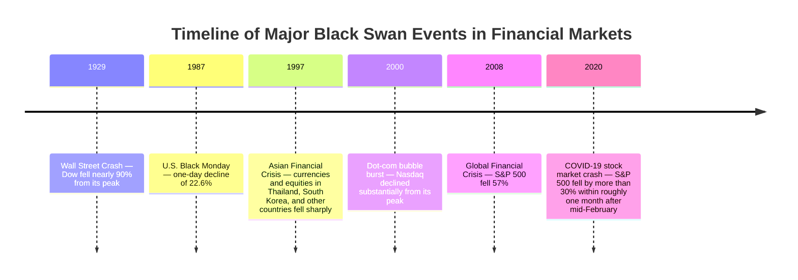

## Executive Summary

A [black swan event](https://www.investopedia.com/terms/b/blackswan.asp) refers to a catastrophic event in financial markets that is extremely rare, difficult to predict beforehand, and subsequently capable of being “rationalized” after the fact. The concept was introduced by Nassim Nicholas Taleb and emphasizes that financial return distributions have **fat tails**, meaning that extreme losses occur far more frequently than would be expected under a normal-distribution assumption ([Investopedia: Tail Risk](https://www.investopedia.com/terms/t/tailrisk.asp); [Heavy-Tailed Distribution and Financial Risk](http://www.scienpress.com/download.asp?ID=1578335)). Such events originate in cognitive blind spots and uncertainty—unobserved unknowns—and are often explained afterward through hindsight-based narratives. Academic research divides uncertainty into two categories: aleatory uncertainty and epistemic uncertainty. Black swan events usually belong to extreme random phenomena arising under epistemic uncertainty ([On the Meaning of a Black Swan in a Risk Context](https://www.academia.edu/98037940/On_the_meaning_of_a_black_swan_in_a_risk_context); [BIS: Expected Shortfall and Value-at-Risk Under Market Stress](https://www.bis.org/cgfs/conf/mar02p.pdf)). Because of heavy-tailed distributions and unpredictability, traditional risk models—such as VaR models based on normal-distribution assumptions—often severely underestimate tail risk.

This article synthesizes academic papers, financial-institution reports, and professional media to examine black swan theory and its mathematical foundations, major cases—including 1929, 1987, 1997, 2008, and 2020—and their market effects, risk-management responses, controversies, and directions for future research.

## Definition and Theoretical Foundations

The term “black swan” describes an extremely rare event with enormous impact. Taleb argues that a black swan event has three defining characteristics:

1. It is extremely rare, to the point that conventional knowledge cannot foresee it.
2. It has an enormous impact.
3. After it occurs, retrospective analysis often makes it appear predictable.

In other words, a black swan belongs to the category of “unknown unknowns” that cannot be observed within the existing framework of knowledge. The black swan perspective emphasizes that market return distributions are not normal but instead follow **fat-tailed distributions**: extreme gains or losses occur much more often than a normal curve predicts ([Investopedia: Tail Risk](https://www.investopedia.com/terms/t/tailrisk.asp); [Statistics How To: Heavy-Tailed Distribution](https://www.statisticshowto.com/heavy-tailed-distribution/)). This heavy-tailed property means that **extreme risk**, or tail risk, is far more important than generally expected.

In the classification of uncertainty, academic research distinguishes between aleatory uncertainty—randomness that cannot be eliminated with more information—and epistemic uncertainty—uncertainty caused by a lack of knowledge. Taleb argues that many major crises arise from epistemic uncertainty because people do not know that certain extreme situations can occur and therefore fail to measure them. In other words, traditional statistical models ignore cognitive blind spots and consequently underestimate real-world tail risk ([On the Meaning of a Black Swan in a Risk Context](https://www.academia.edu/98037940/On_the_meaning_of_a_black_swan_in_a_risk_context); [BIS: Expected Shortfall and Value-at-Risk Under Market Stress](https://www.bis.org/cgfs/conf/mar02p.pdf)). Some scholars point out that the “unpredictability” of a black swan event is often defined by the observer’s limited knowledge, adding subjectivity to the debate ([On the Meaning of a Black Swan in a Risk Context](https://www.academia.edu/98037940/On_the_meaning_of_a_black_swan_in_a_risk_context)).

## Mathematical and Statistical Foundations

The mathematical foundation behind the black swan concept lies in **fat-tailed or heavy-tailed distributions** and extreme value theory. A heavy-tailed distribution is a probability distribution whose tails are thicker than those of a normal distribution and decay according to a power law ([Wikipedia: Heavy-Tailed Distribution](https://en.wikipedia.org/wiki/Heavy-tailed_distribution); [Statistics How To: Heavy-Tailed Distribution](https://www.statisticshowto.com/heavy-tailed-distribution/)). Common heavy-tailed models include the Cauchy distribution, Pareto distribution, and stable distributions. Under these distributions, third- and fourth-order moments—or higher moments—may not exist, and random samples often contain a small number of extreme values, or outliers, that materially affect the mean and volatility ([Statistics How To: Heavy-Tailed Distribution](https://www.statisticshowto.com/heavy-tailed-distribution/)). In practice, financial asset returns frequently display both **fat tails** and **high peaks**: they may appear approximately normal during ordinary periods, but the frequency of tail events rises sharply during episodes of extreme market volatility ([Investopedia: Tail Risk](https://www.investopedia.com/terms/t/tailrisk.asp); [Statistics How To: Heavy-Tailed Distribution](https://www.statisticshowto.com/heavy-tailed-distribution/)).

This leads to an important difference in risk measurement. Traditional measures such as **Value at Risk (VaR)** calculate only the maximum loss at a specified confidence level and do not account for more extreme losses deeper in the tail. By contrast, **Conditional Value at Risk (CVaR), or Expected Shortfall**, estimates the average loss when losses exceed the VaR threshold and is therefore better able to capture tail risk ([Investopedia: Conditional Value at Risk](https://www.investopedia.com/terms/c/conditional_value_at_risk.asp)). Research indicates that in heavy-tailed environments, VaR may severely underestimate risk and may even rank assets with fatter tails as less risky because intersecting distributions can produce a lower VaR for the higher-risk asset ([BIS: Comparative Analyses of Expected Shortfall and Value-at-Risk Under Market Stress](https://www.bis.org/cgfs/conf/mar02p.pdf)). In comparison, because CVaR considers losses beyond the threshold, it has subadditive properties and produces a more conservative risk estimate, making it a better tail-risk measure ([BIS: Comparative Analyses of Expected Shortfall and Value-at-Risk Under Market Stress](https://www.bis.org/cgfs/conf/mar02p.pdf); [Investopedia: Conditional Value at Risk](https://www.investopedia.com/terms/c/conditional_value_at_risk.asp)). For example, research shows that at high confidence levels, VaR may incorrectly rank two distributions with different tail indices, whereas CVaR is more likely to reflect their relative tail thickness correctly ([BIS: Comparative Analyses of Expected Shortfall and Value-at-Risk Under Market Stress](https://www.bis.org/cgfs/conf/mar02p.pdf)).

In addition, traditional models based on normal-distribution assumptions—such as Markowitz portfolio theory and the Black–Scholes model—cannot accurately represent risk in heavy-tailed markets ([Investopedia: Tail Risk](https://www.investopedia.com/terms/t/tailrisk.asp)). Statistically, heavy-tailed distributions imply that events beyond $$3\sigma$$ occur far more frequently in reality than a normal model estimates. Under a normal distribution, the probability of an event outside $$3\sigma$$ is approximately $$0.3\%$$, whereas under a heavy-tailed distribution it is significantly higher ([Heavy-Tailed Distribution and Financial Risk](http://www.scienpress.com/download.asp?ID=1578335); [Investopedia: Tail Risk](https://www.investopedia.com/terms/t/tailrisk.asp)). As early as 1963, statistician Benoit Mandelbrot pointed out that autocorrelation and heavy tails in financial data create substantial errors under normal-distribution assumptions ([Heavy-Tailed Distribution and Financial Risk](http://www.scienpress.com/download.asp?ID=1578335)). Figure 2 illustrates the difference between a normal distribution and a fat-tailed distribution: the tails of the fat-tailed distribution are “thicker,” indicating a greater probability of extreme values ([Investopedia: Tail Risk](https://www.investopedia.com/terms/t/tailrisk.asp)).

**Figure 2:** Illustration of a normal distribution and a heavy-tailed distribution. The tails indicated by the arrows are thicker than those of the normal distribution, meaning that extreme events are more common ([Investopedia: Tail Risk](https://www.investopedia.com/terms/t/tailrisk.asp)).

## Historical Case Analysis

The following table lists several financial events that are frequently regarded as black swans or extreme events and summarizes their timing, triggers, market impact, contagion effects, and recovery.

| Event | Triggering Factors | Market Impact | Contagion Effects | Recovery Time |
|---|---|---|---|---|
| **1929 Wall Street Crash** (October 1929) | Excessive speculation in the U.S. stock market; rising household leverage; Federal Reserve tightening; and the later failure of securities-industry rescue efforts ([Federal Reserve History: Stock Market Crash of 1929](https://www.federalreservehistory.org/essays/stock-market-crash-of-1929)) | The Dow plunged from its September 1929 high of 381 points. It fell $$13\%$$ on Black Monday, October 28, and another $$12\%$$ on Black Tuesday, October 29. By July 1932, it had fallen to 41.22, or $$89\%$$ below its peak ([Federal Reserve History: Stock Market Crash of 1929](https://www.federalreservehistory.org/essays/stock-market-crash-of-1929)) | Triggered the global Great Depression, with deflation and unemployment surging; European financial markets also collapsed | After bottoming in 1932, the Dow did not return to its 1929 high until approximately 1954 ([Federal Reserve History: Stock Market Crash of 1929](https://www.federalreservehistory.org/essays/stock-market-crash-of-1929)) |
| **1987 Stock Market Crash—Black Monday** (October 19, 1987) | Intensifying global market linkages; U.S. stock-option and futures expirations associated with “triple witching”; and “portfolio insurance” strategies that used derivatives to trigger automatic selling ([Federal Reserve History: Stock Market Crash of 1987](https://www.federalreservehistory.org/essays/stock-market-crash-of-1987)) | The Dow fell 508 points, or $$22.6\%$$, in a single day, the largest one-day decline in its history ([Federal Reserve History: Stock Market Crash of 1987](https://www.federalreservehistory.org/essays/stock-market-crash-of-1987)) | Global stock markets plunged simultaneously, including major markets in Japan and Europe. Panic intensified cross-country interaction, although the crash did not immediately cause an economic recession | Markets rebounded rapidly. In only two trading days, the Dow recovered more than half of its losses, and within two years it exceeded its pre-crash high. Circuit breakers and synchronized futures-and-options settlement reforms were introduced afterward ([Federal Reserve History: Stock Market Crash of 1987](https://www.federalreservehistory.org/essays/stock-market-crash-of-1987)) |
| **1997 Asian Financial Crisis** (July 1997–1998) | Thailand allowed its currency to float and abandoned the baht’s peg; exchange-rate and banking systems dependent on high leverage were fragile ([Federal Reserve History: Asian Financial Crisis](https://www.federalreservehistory.org/essays/asian-financial-crisis); [Wikipedia: 1997 Asian Financial Crisis](https://en.wikipedia.org/wiki/1997_Asian_financial_crisis)) | Equity and currency markets fell sharply across Southeast Asia. The Thai baht, South Korean won, and Indonesian rupiah depreciated substantially, stock markets fell by tens of percent, and economies including Indonesia and South Korea entered recession | Created panic spillovers across emerging markets. Capital withdrew from Asia on a large scale, European and U.S. equities fell in the short term, and financial-institution losses expanded | With international rescue programs and domestic structural reforms, Thailand, South Korea, and Indonesia received large rescue packages from institutions including the IMF. Economies recovered rapidly during 1998–1999 ([Federal Reserve History: Asian Financial Crisis](https://www.federalreservehistory.org/essays/asian-financial-crisis); [Wikipedia: 1997 Asian Financial Crisis](https://en.wikipedia.org/wiki/1997_Asian_financial_crisis)) |
| **2008 Global Financial Crisis** (2007–March 2009) | The U.S. subprime-mortgage crisis erupted, while financial leverage and derivative risk moved out of control ([Federal Reserve History: The Great Recession and Its Aftermath](https://www.federalreservehistory.org/essays/great-recession-and-its-aftermath); [Federal Reserve History: The Great Recession](https://www.federalreservehistory.org/essays/great-recession-of-200709)) | The S&P 500 fell $$57\%$$ from its October 2007 peak to its March 2009 trough. Average U.S. home prices fell by approximately $$30\%$$. International credit markets contracted, and many banks and investment banks failed or were acquired ([Federal Reserve History: The Great Recession](https://www.federalreservehistory.org/essays/great-recession-of-200709)) | The global economy entered a synchronized recession. Equity markets in Europe, the United States, and Asia fell sharply, while money and credit markets stalled. Emergency rescue measures and central-bank easing were activated simultaneously ([Federal Reserve History: The Great Recession](https://www.federalreservehistory.org/essays/great-recession-of-200709)) | The U.S. economy officially emerged from recession in June 2009, followed by a slow recovery. After bottoming in March 2009, equities returned to pre-crisis levels within two years as quantitative easing and fiscal stimulus took effect. The crisis led global regulators to introduce stricter capital rules and stress tests ([Federal Reserve History: The Great Recession](https://www.federalreservehistory.org/essays/great-recession-of-200709); [Federal Reserve History: The Great Recession and Its Aftermath](https://www.federalreservehistory.org/essays/great-recession-and-its-aftermath)) |
| **2020 COVID-19 Stock Market Crash** (February–March 2020) | The global COVID-19 outbreak and lockdown measures in the United States and other countries abruptly froze economic activity | After peaking on February 19, 2020, the S&P 500 fell to $$66\%$$ of its previous peak by March 23, a decline of approximately $$34\%$$. Global stock markets experienced multiple circuit breakers in mid-March, most indices fell by more than $$30\%$$, and oil prices collapsed ([Federal Reserve Bank of St. Louis: How COVID-19 Has Impacted Stock Performance by Industry](https://www.stlouisfed.org/on-the-economy/2021/march/covid19-impacted-stock-performance-industry)) | Global markets fell sharply in synchronization, producing extreme risk aversion. Central banks and governments introduced unprecedented rescue programs and fiscal stimulus | The S&P 500 completed a trough-to-recovery move in approximately three months and returned to, then exceeded, its pre-pandemic level before the end of 2020. Recovery varied by industry: technology performed strongly, while travel and energy lagged ([Federal Reserve Bank of St. Louis: How COVID-19 Has Impacted Stock Performance by Industry](https://www.stlouisfed.org/on-the-economy/2021/march/covid19-impacted-stock-performance-industry)) |

Other noteworthy financial collapses include the 1998 failure of Long-Term Capital Management (LTCM) and the bursting of the dot-com bubble in 2000. Although they are not included in the table above, both illustrate the high complexity of the financial system and the contagion effects produced by globalization.

The following timeline shows the five major black swan events described above and the periods in which they occurred:

## Empirical Frequency and Predictability

Financial-market return data generally display fat tails and volatility clustering: extreme movements occur far more frequently than normal-distribution models predict ([Investopedia: Tail Risk](https://www.investopedia.com/terms/t/tailrisk.asp); [Statistics How To: Heavy-Tailed Distribution](https://www.statisticshowto.com/heavy-tailed-distribution/)). Academic studies using Extreme Value Theory also find that market crises and gap events occur repeatedly across different periods and display statistical self-similarity, showing that conventional models cannot capture the full structure of tail risk. Empirically, under a normal-distribution assumption, events outside $$3\sigma$$ should occur with a probability of only about $$0.3\%$$, yet historical market crashes have occurred far more often than that estimate implies ([Investopedia: Tail Risk](https://www.investopedia.com/terms/t/tailrisk.asp); [Heavy-Tailed Distribution and Financial Risk](http://www.scienpress.com/download.asp?ID=1578335)).

In terms of predictability, black swan events are generally considered difficult to warn against beforehand because they inherently involve unknown risks and may be produced by sudden effects arising from systemic coupling. Even when some fundamental or technical indicators are available, traditional models often cannot accurately predict the timing or scale of a crash. Post-mortem analysis also tends to involve strong hindsight bias and spurious causal linkage. In other words, although statistical modeling can estimate tail probabilities, the specific trigger and contagion path of each crash often involve multiple complex factors beyond ordinary historical experience. Current research continues to focus on more sensitive risk-monitoring indicators and simulations such as Monte Carlo methods in an effort to quantify tail risk, but no reliable method can precisely forecast the occurrence of a black swan event.

## Risk Management and Mitigation Strategies

When confronting black swan events, investors and institutions should adopt strategies emphasizing **resilience** and **tail-risk hedging**. Specifically, portfolios may consider a “barbell strategy” that combines defensive and aggressive assets: allocate most assets to instruments with very high safety but lower returns—such as money-market instruments, short-term government bonds, and gold—while retaining a small allocation to high-risk, high-volatility investments. The objective is to earn ordinary returns in normal markets without allowing the entire portfolio to collapse during an extreme downturn ([Investopedia: Conditional Value at Risk](https://www.investopedia.com/terms/c/conditional_value_at_risk.asp); [Federal Reserve Bank of St. Louis: How COVID-19 Has Impacted Stock Performance by Industry](https://www.stlouisfed.org/on-the-economy/2021/march/covid19-impacted-stock-performance-industry)).

At the same time, explicit **tail-risk hedging** through derivatives is common, including the purchase of out-of-the-money equity put options, volatility-linked options, or exchange-traded funds. Although this tail protection may impose costs during stable periods, it can effectively limit potential losses during extreme declines. Investors should also recognize the limits of diversification. During black swan events, correlations typically rise and traditional within-equity diversification becomes less effective. Portfolios may therefore also include genuinely uncorrelated assets, including alternative and real assets.

For financial institutions, **stress testing** and **scenario analysis** are important risk-management tools. The Federal Reserve’s annual severely adverse scenarios, for example, specify extreme shocks that go far beyond historical experience to test whether banks hold sufficient capital and liquidity. In macroprudential policy, regulators have strengthened **countercyclical capital buffers**, stress testing, and liquidity coverage ratio requirements, asking banks to accumulate more capital during bull markets so they can withstand potential collapses.

In addition, moving risk measurement from VaR toward CVaR, or Expected Shortfall, has become a regulatory trend intended to quantify tail losses more completely. Federal Reserve historical materials show that regulators introduced numerous reforms after prior crises, including circuit breakers and more unified central clearing after 1987, and the Dodd–Frank Act and Basel III after 2008 ([Federal Reserve History: The Great Recession and Its Aftermath](https://www.federalreservehistory.org/essays/great-recession-and-its-aftermath)). These systems aim to strengthen systemic resilience, improve liquidity-support mechanisms, and reduce chain contagion during future black swan events.

## Regulatory and Market-Structure Effects

Each financial black swan event has prompted adjustments to market structure and regulation. After the 1987 crash, U.S. exchanges established automatic trading halts, or **circuit breakers**, pausing trading when the index falls by $$7\%$$, $$13\%$$, or $$20\%$$ in a single day ([Federal Reserve History: Stock Market Crash of 1987](https://www.federalreservehistory.org/essays/stock-market-crash-of-1987)). Clearing and settlement systems were also reformed and synchronized.

After the 2008 crisis, central banks around the world broadly strengthened bank regulation, including stricter capital-adequacy requirements, resilience-related requirements such as CCAR stress tests, and tighter oversight of derivatives through centralized exchange clearing. Market-participant structure also evolved. High-frequency trading and algorithmic trading began playing larger roles in different return-model dynamics, increasing concern about market-liquidity mechanisms and potential structural risks.

At the regulatory level, authorities also began focusing on **market-level tail risk**. Institutions such as the Financial Stability Board and the Bank for International Settlements promoted macroprudential dialogue concerning cross-border capital flows and systemic risk. Overall, black swan events exposed the reality of **non-normality** and **systemic correlation** in financial markets, forcing regulation and market structure to move toward greater transparency, stronger liquidity support, and larger risk buffers ([Federal Reserve History: Stock Market Crash of 1987](https://www.federalreservehistory.org/essays/stock-market-crash-of-1987); [Federal Reserve History: The Great Recession and Its Aftermath](https://www.federalreservehistory.org/essays/great-recession-and-its-aftermath)).

## Criticism and Alternative Views

Although black swan theory has had a profound influence, it has also been criticized. Some statisticians and economists argue that Taleb’s interpretation of probability is overly subjective. Dennis Lindley, for example, criticized Taleb’s argument in 2008 as “nonsense,” maintaining that the probability of any event can theoretically be quantified even when it has not yet been observed ([On the Meaning of a Black Swan in a Risk Context](https://www.academia.edu/98037940/On_the_meaning_of_a_black_swan_in_a_risk_context)).

Other scholars argue that the black swan definition is too broad and too dependent on hindsight, allowing almost any major recession to be labeled a black swan after the fact. This criticism has encouraged the alternative concept of the **gray swan**: a rare event whose possibility is not completely unknown but whose risk has been underestimated. For example, before the 2008 subprime crisis, academics had already warned about the potential risks of a housing bubble, meaning the event was not entirely without visible signs.

Critics also argue that Taleb’s distinction between “unknown unknowns” and “known unknowns” is unclear. In reality, some extreme events fail to trigger warnings because information is incomplete rather than because basic laws have failed. Other scholars approach the problem from the perspective of complex systems, treating risk as contagion within a system network rather than as a problem of isolated extreme values. This view emphasizes the influence of network connections and capital flows on financial markets.

In summary, black swan theory reminds people to pay attention to extreme risk, but practical analysis also needs to combine traditional statistics, complex-systems analysis, and other perspectives.

## Practical Recommendations

### For Investors

Investors should recognize the limitations of traditional normal-distribution models and build diversified portfolios that combine defensive and aggressive components. Holding highly liquid assets and safe-haven instruments—such as gold, cash, and short-term bonds—while allocating an appropriate amount to hedging tools such as deep out-of-the-money put options and volatility options can reduce potential losses under extreme events.

Taleb himself advocates a two-ended **barbell strategy**: place most capital in safe investments while using a small portion to pursue high returns ([Investopedia: Conditional Value at Risk](https://www.investopedia.com/terms/c/conditional_value_at_risk.asp)). Investors should also monitor market valuations and leverage. When signs of an asset bubble emerge, they should increase their level of caution.

### For Policymakers and Regulators

Policymakers and regulators should continue strengthening supervisory tools and early-warning systems. Regular stress testing should be expanded to incorporate nonlinear shocks, including extreme financial, climate, and political-risk scenarios. Monitoring of cross-market and cross-border capital flows should be strengthened to prevent the transmission of systemic risk.

Financial institutions should be encouraged to establish contingency plans and adequate liquidity buffers, such as standing target ratios for liquid assets. At the macroprudential level, countercyclical capital buffers and leverage limits can be used to restrain excessive leverage during bull markets. Overall, policy should shift from post-event rescue toward pre-event prevention and improve the resilience of the financial system against black swan events.

## Topics Requiring Further Research

- **Methods for estimating extreme risk:** How can tail-distribution parameters be estimated more precisely and extreme events forecast with limited data? Can combining Extreme Value Theory with machine learning produce a breakthrough?
- **Dynamic risk-contagion mechanisms:** In a highly interconnected global financial network, how does a crisis spread rapidly from one location to another? How can network theory incorporate contagion paths and provide warnings of cascading collapse?
- **Antifragility design:** How can investment strategies or financial structures be designed to remain robust in normal periods and benefit—or at least avoid collapse—during crises? How can Taleb’s theory of antifragility be quantified in practice?
- **Evaluation of regulatory-policy effectiveness:** To what extent do current macroprudential tools, including countercyclical buffers, reduce the impact of black swans? Are there new stress-testing or capital-calculation models that are more effective?
- **Cross-domain factors:** How might exogenous risks such as climate change and cybersecurity become the next financial black swan? Cross-domain risk analysis requires further development.

These questions identify future directions for financial science and policymaking and also show that black swan research remains full of challenges and unknowns.

**Figure 1:** Dow Jones Industrial Average, 1920–1954. The 1929 crash caused a severe decline, and the index did not recover to its 1929 high until approximately 25 years later ([Federal Reserve History: Stock Market Crash of 1929](https://www.federalreservehistory.org/essays/stock-market-crash-of-1929)).

**Figure 2:** Normal distribution and heavy-tailed distribution. The tails of the heavy-tailed distribution are visibly thicker than those of the normal curve, meaning that extreme events have a higher probability of occurring ([Investopedia: Tail Risk](https://www.investopedia.com/terms/t/tailrisk.asp)).

## References

- [Investopedia: Black Swan](https://www.investopedia.com/terms/b/blackswan.asp)
- [Investopedia: Tail Risk and Portfolio Protection](https://www.investopedia.com/terms/t/tailrisk.asp)
- [Investopedia: Conditional Value at Risk](https://www.investopedia.com/terms/c/conditional_value_at_risk.asp)
- [Federal Reserve History: Stock Market Crash of 1929](https://www.federalreservehistory.org/essays/stock-market-crash-of-1929)
- [Federal Reserve History: Stock Market Crash of 1987](https://www.federalreservehistory.org/essays/stock-market-crash-of-1987)
- [Federal Reserve History: Asian Financial Crisis](https://www.federalreservehistory.org/essays/asian-financial-crisis)
- [Federal Reserve History: The Great Recession](https://www.federalreservehistory.org/essays/great-recession-of-200709)
- [Federal Reserve History: The Great Recession and Its Aftermath](https://www.federalreservehistory.org/essays/great-recession-and-its-aftermath)
- [Federal Reserve Bank of St. Louis: How COVID-19 Has Impacted Stock Performance by Industry](https://www.stlouisfed.org/on-the-economy/2021/march/covid19-impacted-stock-performance-industry)
- [BIS: Comparative Analyses of Expected Shortfall and Value-at-Risk Under Market Stress](https://www.bis.org/cgfs/conf/mar02p.pdf)
- [On the Meaning of a Black Swan in a Risk Context](https://www.academia.edu/98037940/On_the_meaning_of_a_black_swan_in_a_risk_context)
- [Heavy-Tailed Distribution and Financial Risk](http://www.scienpress.com/download.asp?ID=1578335)
- [Wikipedia: Heavy-Tailed Distribution](https://en.wikipedia.org/wiki/Heavy-tailed_distribution)
- [Wikipedia: 1997 Asian Financial Crisis](https://en.wikipedia.org/wiki/1997_Asian_financial_crisis)
- [Statistics How To: Heavy-Tailed Distribution](https://www.statisticshowto.com/heavy-tailed-distribution/)
