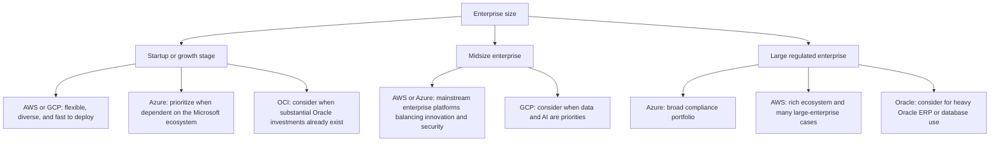

## Executive Summary

Enterprises choosing a public cloud platform must evaluate multiple factors. AWS leads in market share and breadth of services; Azure integrates deeply with the Microsoft ecosystem and is suitable for organizations that already rely on Windows and SQL Server; GCP is strong in big data, machine learning, and high-performance computing; and OCI, or Oracle Cloud Infrastructure, emphasizes cost efficiency and optimized support for Oracle database applications.

This article compares AWS, Azure, GCP, and Oracle across **compute, storage, networking, databases, security and compliance, governance and cost management, performance and SLAs, global infrastructure, hybrid and multi-cloud support, enterprise support, and ecosystem depth**. It also examines pricing, strengths and weaknesses, typical use cases, and recommended strategies for **startups and growth-stage companies, midsize enterprises, and large highly regulated organizations**.

The overall conclusion is that startups and growth-stage companies can prioritize the agility and cost flexibility of AWS or GCP; midsize enterprises can choose AWS or Azure according to their hybrid-cloud requirements; and large regulated enterprises can prioritize Azure or AWS for compliance and global reach while considering OCI when reducing Oracle licensing costs is important. [Public Sector Network cloud-platform comparison](https://publicsectornetwork.com/insight/aws-vs-microsoft-azure-vs-google-cloud-vs-oracle-cloud-infrastructure-a-comprehensive-comparison) [AWS 2025 Gartner Magic Quadrant announcement](https://aws.amazon.com/blogs/aws/aws-named-as-a-leader-in-2025-gartner-magic-quadrant-for-strategic-cloud-platform-services-for-15-years-in-a-row/)

## Compute

- **AWS:** Amazon EC2 provides a broad range of instance families, including general-purpose M-series instances, compute-optimized C-series instances, memory-optimized R-series instances, storage-optimized D-series instances, accelerated-computing instances such as P- and G-series GPUs and Inf1 inference chips, and H-series HPC instances. It supports Auto Scaling, Elastic Load Balancing, and serverless architectures through AWS Lambda. Spot Instances, Reserved Instances, and Savings Plans are available to reduce costs. Bare-metal instance options, such as `i3en.metal`, are also available. [AWS EC2 instance types](https://aws.amazon.com/ec2/instance-types/) [Amazon EC2 instance-type documentation](https://docs.aws.amazon.com/AWSEC2/latest/UserGuide/instance-types.html) [AWS Savings Plans and Reserved Instances](https://docs.aws.amazon.com/savingsplans/latest/userguide/sp-ris.html)

- **Azure:** Azure Virtual Machines are organized into clear categories, including general-purpose D-, B-, and Av2-series machines; compute-optimized F-series machines; memory-optimized E- and M-series machines; storage-optimized Lsv2 machines with large SSD capacity; GPU-oriented NC, NV, and ND series; and HPC-oriented HB and HC series. Azure provides VM Scale Sets for automatic scaling and Azure Functions for serverless workloads. It also supports availability-zone deployments and cross-zone VM Scale Set configurations to improve reliability. [Azure VM and managed-disk types](https://learn.microsoft.com/en-us/azure/virtual-machines/disks-types)

- **GCP:** Compute Engine supports machine types with customizable CPU and memory configurations, including configurations of 1–96 vCPUs and up to 8 GB of memory per vCPU, and offers families such as N1, N2, C2 for compute optimization, and M2 for memory optimization. Managed Instance Groups provide automatic resource scaling, while Google’s global load balancing distributes traffic across regions. Sustained Use Discounts and Committed Use Discounts can reduce costs by approximately 30% to 70%, while Spot VMs can reduce costs by 60% to 91%. GCP also supports Live Migration, Shielded VM, and Cloud TPU clusters for deep-learning acceleration. [Google Compute Engine](https://cloud.google.com/products/compute) [Google Cloud sustained-use discounts](https://docs.cloud.google.com/compute/docs/sustained-use-discounts)

- **Oracle Cloud Infrastructure:** OCI Compute provides both bare-metal instances and virtual machines running on shared hardware. Predefined shapes include Standard shapes for balanced general-purpose workloads, DenseIO shapes with substantial local NVMe storage, GPU instances, and HPC instances. Flexible shapes allow users to configure CPU or OCPU and memory independently. Instances run inside isolated customer tenancies, can be distributed across availability domains, and can use OCI autoscaling groups. OCI pricing is based on CPU resources and supports AMD, Intel, and Arm architectures without requiring users to overselect cores. [OCI Compute overview](https://docs.oracle.com/en-us/iaas/Content/Compute/Concepts/computeoverview.htm)

Overall, **AWS** is known for service diversity and ecosystem breadth, **Azure** emphasizes integration with Microsoft technologies, **GCP** stands out for flexible customization and data services, and **OCI** emphasizes price-performance and Oracle integration.

| Platform | General-purpose instances | Compute-optimized | Memory-optimized | GPU/HPC acceleration |
|---|---|---|---|---|
| **AWS** | M series | C series | R/X series | P/G series for GPU; H series for HPC |
| **Azure** | D/B series | F/Lsv2 series | E/M series | N series for GPU; HB/HC series for HPC |
| **GCP** | N1/N2 series | C2 series | M1/M2 series | A2 series for GPU/TPU |
| **OCI** | `VM.Standard` series | `VM.DenseIO` series | High-memory `VM.Standard` shapes | GPU and bare-metal instances |

## Storage

- **AWS:** Amazon S3 provides object-storage classes including Standard, Standard-Infrequent Access, One Zone-Infrequent Access, Intelligent-Tiering, Glacier Instant Retrieval, Glacier Flexible Retrieval, and Deep Archive. Lifecycle policies can automatically move objects between tiers. Amazon EBS provides multiple block-storage types, including general-purpose `gp3` SSD volumes with independently adjustable IOPS and throughput, high-performance `io2` and `io2 Block Express` SSD volumes, and high-capacity `st1` and `sc1` HDD volumes. File-system services include EFS for NFS and FSx for Windows SMB, Lustre, and NetApp ONTAP. [Amazon S3 storage classes](https://aws.amazon.com/s3/storage-classes/) [Amazon EBS volume types](https://aws.amazon.com/ebs/volume-types/)

- **Azure:** Azure Blob Storage supports Hot, Cool, and Archive access tiers. The Hot tier offers the lowest access latency, the Cool tier lowers storage cost for infrequently accessed data, and the Archive tier is offline cold storage that must be rehydrated before access and is generally intended for retention periods of at least 180 days. Azure Disk Storage provides Ultra Disk, Premium SSD, Standard SSD, and Standard HDD options. Azure Files supports SMB and NFS and offers Standard and Premium file shares, with Premium intended for enterprise and high-performance workloads. Storage accounts can be configured with redundancy options such as LRS, ZRS, and GRS. [Azure Blob access tiers](https://learn.microsoft.com/en-us/azure/storage/blobs/access-tiers-overview) [Azure managed-disk options](https://www.infoq.com/news/2021/09/azure-disk-storage-zrs-ga/) [Azure Storage account overview](https://learn.microsoft.com/en-us/azure/storage/common/storage-account-overview)

- **GCP:** Cloud Storage provides Standard, Nearline, Coldline, and Archive classes. All classes provide 99.999999999% durability, while the colder classes have minimum storage durations of 30, 90, or 365 days. Persistent Disk options include Balanced Persistent Disk, performance-oriented SSD Persistent Disk, Standard Persistent Disk on HDD, and Extreme Persistent Disk for provisioned high IOPS and latency-sensitive databases. Filestore provides managed NFS storage and can scale to petabyte-level workloads. [Google Cloud Storage classes](https://docs.cloud.google.com/storage/docs/storage-classes) [Google Persistent Disk performance](https://docs.cloud.google.com/compute/docs/disks/performance) [Google Cloud Filestore](https://cloud.google.com/filestore)

- **Oracle Cloud Infrastructure:** OCI Object Storage offers Standard, Infrequent Access, and Archive tiers. Archive is the lowest-cost tier but requires restoration before retrieval and has a minimum retention period of 90 days. OCI Block Volumes can scale to as much as 300,000 IOPS per volume and 1 PB of capacity, with dynamically adjustable performance. OCI File Storage is a fully managed NFS service that automatically scales to exabyte-level capacity and supports asynchronous replication, snapshots, and other enterprise features. OCI applies consistent pricing across public-cloud and dedicated-region deployments and does not charge for data movement within the same region. [OCI Object Storage tiers](https://docs.oracle.com/en-us/iaas/Content/Object/Concepts/understandingstoragetiers.htm) [OCI Block Volumes](https://www.oracle.com/cloud/storage/block-volumes/) [OCI File Storage](https://www.oracle.com/cloud/storage/file-storage/) [OCI Virtual Cloud Network pricing characteristics](https://www.oracle.com/cloud/networking/virtual-cloud-network/)

## Networking

- **AWS:** Amazon Virtual Private Cloud provides isolated networks with configurable subnets, route tables, security groups, and network ACLs. VPCs can be connected through VPC Peering or through AWS Transit Gateway, which provides a centralized networking hub and supports encrypted inter-Region connectivity. On-premises data centers can connect through AWS Direct Connect or AWS VPN. Load-balancing options include Application Load Balancer, Network Load Balancer, and AWS Global Accelerator, which uses global anycast IP addresses to reduce cross-region latency and support failover. AWS also provides Route 53, CloudFront, and PrivateLink. [AWS Transit Gateway](https://docs.aws.amazon.com/vpc/latest/tgw/what-is-transit-gateway.html) [AWS Global Accelerator](https://aws.amazon.com/global-accelerator/)

- **Azure:** Azure Virtual Network is the core networking unit and supports regional and cross-region VNet Peering. Multiple VNets can connect to VPN Gateway or ExpressRoute for secure hybrid networking, while Azure Virtual WAN supports globally distributed hub-and-spoke architectures. Traffic-management services include Azure Load Balancer, Application Gateway with WAF, and Azure Front Door for global routing, high availability, and edge protection. Front Door performs global routing optimization and high-availability processing at Azure edge locations and can be combined with security protection comparable to Cloudflare. Azure also provides Azure DNS, Traffic Manager, Azure Firewall, DDoS Protection, and WAF. [Azure networking services overview](https://learn.microsoft.com/en-us/azure/networking/networking-overview)

- **GCP:** Google Cloud VPC is a global resource, allowing connected subnets across regions. It supports VPC Peering, Shared VPC, and Private Service Connect. Hybrid connectivity is available through Cloud VPN or Cloud Interconnect. Google Cloud Load Balancing provides HTTP(S), TCP/SSL, UDP, and other Layer 4 and Layer 7 load-balancing modes and can use a single anycast IP address to route traffic to the nearest region. It integrates with Cloud CDN and Cloud Armor for DDoS and WAF protection. Internal load balancing also supports cross-region delivery. GCP also provides Cloud NAT, firewall services, and Cloud DNS. [Google Cloud VPC](https://docs.cloud.google.com/vpc/docs/vpc) [Google Cloud Load Balancing](https://cloud.google.com/load-balancing)

- **Oracle Cloud Infrastructure:** OCI Virtual Cloud Network is a regional private network with configurable subnets, routes, Internet and NAT gateways, security lists, and network security groups. VCNs can peer with other VCNs or connect to on-premises environments through a Dynamic Routing Gateway. Oracle FastConnect provides dedicated private connectivity with higher bandwidth and more consistent performance than Internet-based connectivity. OCI Flexible Load Balancer supports public and private load-balancing configurations. OCI does not charge for data transfers within the same region and provides an Azure Interconnect option for low-latency connectivity between Azure and OCI. [OCI Virtual Cloud Network](https://www.oracle.com/cloud/networking/virtual-cloud-network/) [OCI FastConnect](https://docs.oracle.com/en-us/iaas/Content/Network/Concepts/fastconnectoverview.htm) [OCI Flexible Load Balancer FAQ](https://www.oracle.com/cloud/networking/flexible-load-balancer/faq/) [Oracle cloud-service comparison](https://www.oracle.com/cloud/service-comparison/)

## Databases

- **AWS:** AWS provides Amazon RDS for MySQL, PostgreSQL, MariaDB, Oracle Database, SQL Server, and the AWS-developed Aurora engine; DynamoDB for NoSQL; ElastiCache for Redis and Memcached; Redshift for data warehousing; DocumentDB with MongoDB-compatible APIs; Neptune for graph workloads; and QLDB for ledger-style databases. AWS Database Migration Service assists with migration to AWS. [AWS database services](https://aws.amazon.com/products/databases/)

- **Azure:** Azure SQL Database, including single databases, elastic pools, and Managed Instance, provides SQL Server capabilities as a managed service. Azure also provides Cosmos DB for multimodel NoSQL, Azure Database for MySQL and PostgreSQL, Azure Database for MariaDB, Azure Synapse Analytics for data warehousing, managed Redis services, and database-migration tooling for moving on-premises or other-cloud databases to Azure. [Azure database products](https://azure.microsoft.com/en-us/products/category/databases/)

- **GCP:** GCP provides Cloud SQL for MySQL, PostgreSQL, and SQL Server; Cloud Spanner for globally distributed relational workloads; Cloud Bigtable for time-series and wide-column NoSQL; Firestore for application-oriented NoSQL; BigQuery for serverless analytical data warehousing; and Memorystore for Redis and Memcached. Google Cloud Database Migration Service supports migrations of MySQL, PostgreSQL, and SQL Server workloads. Spanner’s horizontal scaling is particularly suitable for global OLTP systems. [Google Cloud databases](https://cloud.google.com/products/databases)

- **Oracle Cloud Infrastructure:** OCI’s relational-database portfolio focuses on the Oracle ecosystem, including Autonomous Database, Autonomous Transaction Processing, Autonomous Data Warehouse, Exadata Cloud Service, Database Cloud Service, bare-metal database systems, and VM database systems. OCI also provides MySQL HeatWave and a NoSQL Database service. Migration tools include Data Pump and GoldenGate for real-time replication. OCI is optimized for Oracle RAC and physically isolated environments, making it suitable for high-availability and high-performance requirements. [Oracle Cloud database services](https://www.oracle.com/database/cloud/)

## Security and Compliance

All four platforms provide granular **identity and access management**, encryption, and audit capabilities.

- **AWS:** AWS IAM supports fine-grained permissions, roles, and temporary credentials, while IAM Identity Center provides single sign-on. AWS Key Management Service manages encryption keys with FIPS-validated options, and services such as EBS and S3 support server-side encryption. CloudTrail records API activity, while CloudWatch Logs and VPC Flow Logs support operational and network auditing. GuardDuty detects threats, Inspector scans for vulnerabilities, and WAF and Shield provide application and DDoS protection. AWS also offers CloudHSM for hardware-backed key management. AWS maintains certifications and attestations including ISO 27001, ISO 27017, ISO 27018, SOC 1, SOC 2, SOC 3, PCI DSS, HIPAA, and FedRAMP. [AWS compliance programs](https://aws.amazon.com/compliance/programs/)

- **Azure:** Microsoft Entra ID, formerly Azure Active Directory, integrates multifactor authentication and conditional access. Azure RBAC and Privileged Identity Management provide role-based and just-in-time privileged access. Key Vault stores keys and credentials using HSM-backed protection. Azure Monitor and Microsoft Sentinel provide observability and SIEM capabilities, while Defender for Cloud supports cloud-security posture management. Azure also provides WAF and DDoS Protection. Its compliance portfolio includes ISO 27001, ISO 27018, SOC 1, SOC 2, SOC 3, FedRAMP, HIPAA/HITRUST, MTCS, IRAP, ENS, and MITRE ATT&CK-related security coverage. [Azure compliance portfolio](https://azure.microsoft.com/en-us/explore/trusted-cloud/compliance)

- **GCP:** Cloud IAM uses a resource hierarchy for permissions, while Workload Identity supports workload authentication. Cloud KMS offers software- and hardware-backed key management. Cloud Audit Logs records administrative and data-access events, and Security Command Center provides centralized security visibility. Binary Authorization and Shielded VM strengthen container and VM security. Google Cloud maintains certifications and attestations including ISO/IEC 27001, 27017, 27018, 27701, and 42001; PCI DSS; and SOC 1, SOC 2, and SOC 3. It also supports regulatory requirements such as HIPAA, FedRAMP, GLBA, and PCI. [Google Cloud compliance resources](https://cloud.google.com/compliance)

- **Oracle Cloud Infrastructure:** OCI IAM uses declarative policies to control access for users and groups. OCI Vault and Key Management use FIPS 140-2 Level 3-certified HSMs to protect encryption keys. OCI Audit, Logging, Monitoring, Cloud Guard with AI-driven risk detection, and WAF provide auditability, monitoring, risk detection, and application protection. OCI has certifications and attestations including SOC 1, SOC 2, SOC 3, ISO 27001, ISO 27017, PCI DSS, and HIPAA, as well as support for requirements such as FedRAMP, GDPR, and Germany’s BSI C5. [OCI Vault and Key Management](https://docs.oracle.com/en-us/iaas/Content/KeyManagement/Concepts/keyoverview.htm) [OCI certification practices](https://www.ateam-oracle.com/ciso-perspectives-oci-certification-best-practices)

Overall, all four cloud providers offer enterprise-grade **encryption for data in transit and at rest, key management, audit logging, and identity governance**, and all support strict international regulations and industry standards. Selection must still account for the cloud shared-responsibility model, under which customers remain responsible for areas such as operating-system security and workload configuration. [Azure compliance portfolio](https://azure.microsoft.com/en-us/explore/trusted-cloud/compliance) [Google Cloud compliance resources](https://cloud.google.com/compliance) [OCI certification practices](https://www.ateam-oracle.com/ciso-perspectives-oci-certification-best-practices)

## Governance and Cost Management

All four platforms provide cost visibility, budgeting, reporting, and FinOps tools.

- **AWS:** AWS Organizations supports multi-account management and consolidated billing. Cost Explorer, the Cost and Usage Report, tagging, and Cost Categories support cost allocation and analysis. AWS Budgets provides cost and usage alerts, while AWS Billing Conductor supports complex billing allocation. Reserved Instances and Savings Plans can reduce costs by as much as 66% to 72%, and Spot Instances can offer discounts of approximately 90%. AWS Cost Anomaly Detection supports automated FinOps monitoring. [AWS Savings Plans and Reserved Instances](https://docs.aws.amazon.com/savingsplans/latest/userguide/sp-ris.html) [AWS Cloud Financial Management](https://aws.amazon.com/aws-cost-management/)

- **Azure:** Azure Cost Management and Billing is provided without an additional charge and supports cost reporting and analysis across subscriptions and tenants, with filtering by tags and resource groups. Budgets and alerts can be configured through the Azure portal, while Azure Advisor provides optimization recommendations. Azure Reserved Virtual Machine Instances and Savings Plans can reduce costs by as much as 72%. Azure Hybrid Benefit and Spot VMs can further lower spending. Azure Policy can enforce tags, quotas, and security or compliance requirements. [Azure Reserved VM Instances](https://azure.microsoft.com/en-us/pricing/offers/reservations/vm-instances)

- **GCP:** Cloud Billing supports consolidated billing, cost exports, and chargeback reporting. Budgets and alerts can be configured, and Recommender provides machine-learning-based optimization advice, such as stopping idle resources or adopting committed-use plans. Sustained Use Discounts are applied automatically and can reduce eligible VM costs by as much as 20% to 30%. One- and three-year Committed Use Discounts can reduce costs by approximately 57% to 70%, while Spot VMs can reduce costs by roughly 80% to 90%. Cloud Asset Inventory and resource labels support inventory and allocation. [Google Cloud sustained-use discounts](https://docs.cloud.google.com/compute/docs/sustained-use-discounts) [Google Compute Engine pricing benefits](https://cloud.google.com/products/compute)

- **Oracle Cloud Infrastructure:** OCI uses unified metering and usage-based billing. Universal Credits support pay-as-you-go consumption, while annual commitments can provide discounts. OCI promotes globally consistent pricing without regional price differences. It provides the first 10 TB of monthly outbound data transfer free and prices additional egress below many competing services. OCI Cost Analysis, budgets, and reporting tools provide usage visualization and forecasting. Oracle also states that base OCI service fees include enterprise-ready technical support without a separate production-support charge. Enterprises should still use resource tags for cost-center and project allocation and periodically review usage to optimize resources and expenses. [Oracle Cloud pricing](https://www.oracle.com/cloud/pricing/)

## Performance and SLA

- All four cloud platforms commit to high availability. Multi-zone deployment can generally support availability of 99.99% or higher, although the exact SLA depends on the specific service. Examples in the completed research include EC2 deployed across multiple Availability Zones, EBS at 99.9%, and S3 ranging from 99.9% to 99.999% depending on the storage class. Azure VMs deployed across zones can provide a 99.99% commitment, while storage and SQL services commonly provide at least 99.9%. GCP Compute Engine VM SLAs were described as approximately 99.95% for general machine types and 99.99% for high-memory machine types. OCI bare-metal and VM services were described as providing SLAs of 99.5% or higher. OCI's lack of charges for same-region data transfer can also reduce cost and latency.

- **Third-party performance:** Independent research has found meaningful price-performance differences among the platforms. In one benchmark of comparable general-purpose compute instances, OCI delivered the lowest cost per unit of performance. Using OCI pricing as the reference, the study reported that on-demand AWS was 81.9% higher, Azure 70.3% higher, and GCP approximately 155% higher. Under one-year commitment pricing, the reported differences narrowed to 12.5% for AWS and 16.9% for Azure, while GCP remained 60.6% higher. Across the study’s tests, OCI achieved the strongest measured price-performance result, particularly for flexible E4 and bare-metal configurations. Actual results will still vary according to CPU, memory, network configuration, virtualization, and application type. [Cost-Performance Evaluation of General Compute Instances](https://arxiv.org/html/2412.03037v1)

## Global Regions and Availability Zones

- **AWS:** AWS currently has approximately 25 regions, more than 80 availability zones, and hundreds of edge locations serving more than 240 countries and territories. Its global network is widely used for low-latency and highly available enterprise deployments. [Public Sector Network cloud-platform comparison](https://publicsectornetwork.com/insight/aws-vs-microsoft-azure-vs-google-cloud-vs-oracle-cloud-infrastructure-a-comprehensive-comparison)

- **Azure:** Azure operates in more than 60 geographic regions, giving it the broadest regional coverage among the four platforms. Regions commonly contain multiple availability zones, and Microsoft also operates government and sovereign-cloud environments. This makes Azure attractive to organizations with data-sovereignty and regional-compliance requirements. [Public Sector Network cloud-platform comparison](https://publicsectornetwork.com/insight/aws-vs-microsoft-azure-vs-google-cloud-vs-oracle-cloud-infrastructure-a-comprehensive-comparison)

- **GCP:** Google Cloud has approximately 27 regions and 82 availability zones and continuing to expand in key markets. Its global backbone, Cloud CDN, and global load balancing provide strong cross-region performance, although the number of regions was described as lower than AWS and Azure. [Public Sector Network cloud-platform comparison](https://publicsectornetwork.com/insight/aws-vs-microsoft-azure-vs-google-cloud-vs-oracle-cloud-infrastructure-a-comprehensive-comparison)

- **Oracle Cloud Infrastructure:** Oracle Cloud Infrastructure has approximately 38 public-cloud regions, including sovereign and government regions, and 58 availability domains. OCI regions are distributed across the Americas, Europe, and Asia and are designed around enterprise workloads. OCI supports cross-region disaster recovery and distributed-cloud deployment models that extend OCI services into customer data centers or other public clouds. [Public Sector Network cloud-platform comparison](https://publicsectornetwork.com/insight/aws-vs-microsoft-azure-vs-google-cloud-vs-oracle-cloud-infrastructure-a-comprehensive-comparison) [Oracle distributed-cloud positioning](https://www.oracle.com/cloud/gartner-mq-strategic-cloud-platform-services-leader/)

> **Table 1: Overview of regions and availability zones** — based on the source material and vendor websites used in the completed research.

| Platform | Regions | Availability zones or domains | Global-network characteristics |
|---|---:|---:|---|
| **AWS** | Approximately 25 in the cited source | More than 80 | Broad edge footprint and Global Accelerator |
| **Azure** | More than 60 | Multiple per region | Broadest regional coverage, sovereign clouds, and Front Door |
| **GCP** | 27 | 82 | Google backbone, anycast load balancing, and Cloud CDN |
| **OCI** | 38 | 58 | Consistent public and dedicated-region pricing and free outbound allowance |

## Hybrid and Multi-Cloud Support

- **AWS:** AWS Outposts brings native AWS services into customer data centers, while AWS Wavelength supports edge-computing deployments in telecommunications networks. Transit Gateway, AWS VPN, and Direct Connect support hybrid and cross-cloud connectivity. EKS Anywhere allows Kubernetes deployment on premises or in other clouds, and Systems Manager can manage hybrid resources.

- **Azure:** Azure Arc extends Azure management to on-premises and other-cloud environments, including Kubernetes clusters, SQL services, and servers, and integrates them with Azure Policy, monitoring, and update management. Azure Stack HCI and related edge offerings bring Azure services into customer environments. Virtual machines can operate across Azure, AWS, and GCP environments in coordinated architectures. Azure has also promoted cooperation with Anthos for some Google Cloud cross-cloud scenarios, emphasizing multi-cloud operations.

- **GCP:** Google Kubernetes Engine supports containerized architectures, while Google Distributed Cloud, Anthos-related capabilities, VMware Engine, Migrate to Virtual Machines, and Database Migration Service support hybrid and migration scenarios. Cloud VPN and Cloud Interconnect connect GCP with on-premises and other public clouds. Google’s approach emphasizes Kubernetes and open standards.

- **Oracle Cloud Infrastructure:** OCI emphasizes Cloud@Customer and distributed-cloud strategies. Oracle Cloud@Customer, including Exadata Cloud@Customer, places OCI-managed environments inside customer data centers. OCI FastConnect and Azure Interconnect support private cross-cloud connectivity. OCI also provides Oracle Kubernetes Engine, container, and DevOps services. Oracle’s alliances with Microsoft and Google support Oracle Database services across clouds. [Oracle cloud-service comparison](https://www.oracle.com/cloud/service-comparison/)

## Support and Service Levels

- **AWS:** AWS Support is divided into Basic, Developer, Business, and Enterprise tiers. Enterprise plans provide 24/7 support and a Technical Account Manager. AWS also has an extensive AWS Partner Network and global managed-service ecosystem.

- **Azure:** Azure support tiers include Developer, Standard, Professional Direct, and enterprise-level arrangements, with different response-time commitments. Azure services commonly provide SLAs ranging from 99.9% to 99.99%, depending on the service and architecture. [AWS 2025 Gartner Magic Quadrant announcement](https://aws.amazon.com/blogs/aws/aws-named-as-a-leader-in-2025-gartner-magic-quadrant-for-strategic-cloud-platform-services-for-15-years-in-a-row/)

- **GCP:** Google Cloud support tiers include Basic, Development, Production, and Premium, with different response times and levels of expert assistance. GCP service SLAs commonly fall in the 99.9% to 99.95% range, depending on the service.

- **Oracle Cloud Infrastructure:** Oracle states that **base enterprise support is included with OCI services** without a separate production-workload support fee. OCI service SLAs vary by service, and Oracle maintains a large enterprise and government customer network supporting Oracle application and database migrations. [Oracle Cloud pricing](https://www.oracle.com/cloud/pricing/)

## Ecosystem and Marketplace

- **AWS:** AWS has the largest cloud ecosystem and partner network among the platforms discussed, with thousands of independent software vendors and a broad range of managed third-party applications and machine images in AWS Marketplace.

- **Azure:** Azure is deeply integrated with the Microsoft ecosystem, including Microsoft 365, Dynamics, Windows Server, and SQL Server. Azure Marketplace contains a broad selection of enterprise-software solutions, and Microsoft licensing benefits can make Azure especially attractive to existing Microsoft customers.

- **GCP:** Google Cloud Marketplace provides container and VM applications and is closely connected to open-source communities. Google’s leading role in Kubernetes and its data and analytics services have made the platform popular with DevOps teams, data engineers, and machine-learning practitioners.

- **Oracle Cloud Infrastructure:** Oracle PartnerNetwork includes system integrators and independent software vendors, while Oracle Cloud Marketplace provides software images and SaaS solutions, especially for Oracle application suites.

## Overall Comparison and Pricing Example

- **Compute and storage pricing example:** The completed source material uses a representative workload of 4 vCPUs, 16 GB of RAM, 1 TB of SSD storage, and outbound network traffic. Based on Oracle’s late-2024 published comparison, OCI pricing was approximately \$54 per month for the VM and \$43 for 1 TB of SSD storage, while 50 TB of outbound traffic was listed at \$340. The same comparison described AWS and Azure VM pricing as approximately 2.1 to 2.3 times the OCI amount and GCP as approximately 2.1 times the OCI amount. It described 1 TB of SSD storage as approximately five times the OCI price on AWS and Azure and approximately four times the OCI price on GCP. For 1 TB of outbound transfer, the derived figures were approximately \$6.80 on OCI, \$88 on AWS, and \$68 on Azure or GCP. [Oracle Cloud pricing comparison](https://www.oracle.com/cloud/pricing/)

| Feature or indicator | AWS | Azure | GCP | Oracle Cloud Infrastructure |
|---|---|---|---|---|
| **VM types** | Broadest range across general-purpose, compute, memory, GPU, HPC, and specialized workloads | Comprehensive general-purpose, compute, memory, GPU, and HPC portfolio | Customizable VMs plus N-, C-, M-, and other families | VMs and bare metal with flexible CPU and memory configuration |
| **Automatic scaling** | Auto Scaling Groups and AWS Lambda | VM Scale Sets and Azure Functions | Managed Instance Groups and GKE autoscaling | Autoscaling Groups and OCI Functions |
| **Block storage** | `gp3`, `io2`, `st1`, and `sc1` | Ultra Disk, Premium SSD, Standard SSD, and Standard HDD | `pd-balanced`, `pd-ssd`, `pd-standard`, and `pd-extreme` | Block Volumes with performance scaling and high IOPS |
| **Object storage** | S3 Standard, IA, Intelligent-Tiering, and Glacier tiers | Blob Hot, Cool, and Archive tiers | Standard, Nearline, Coldline, and Archive | Standard, Infrequent Access, and Archive |
| **File storage** | EFS and FSx | Azure Files with SMB/NFS | Filestore with NFS | OCI File Storage with NFS and automatic scaling |
| **Outbound traffic example** | Approximately \$88 per 1 TB in the cited vendor comparison | Approximately \$68 per 1 TB | Approximately \$68 per 1 TB | Approximately \$6.80 per 1 TB in the cited vendor comparison |
| **Support model** | Free Basic tier plus paid Developer, Business, and Enterprise plans | Developer, Standard, Professional Direct, and enterprise plans | Basic, Development, Production, and Premium plans | Enterprise-ready support included in base service pricing, with additional enhanced services available |

> **Note:** Pricing and features vary by region, discount, architecture, and contract. The figures above preserve the late-2024 examples contained in the completed research and are for reference only. [Oracle Cloud pricing comparison](https://www.oracle.com/cloud/pricing/) [AWS Savings Plans and Reserved Instances](https://docs.aws.amazon.com/savingsplans/latest/userguide/sp-ris.html)

## Real-World Cases and Third-Party Benchmarks

- **Real-world cases:** The completed research identifies well-known organizations using different platforms. Examples include Netflix, Airbnb, and Expedia on AWS; BMW, McKesson, and NATO on Azure; Spotify, Snap, and Twitter on GCP; and Zoom, Audi, and parts of Dropbox using OCI or multi-cloud architectures. The appropriate interpretation of each case depends on the specific workloads and deployment scope.

- **Third-party reports:** The completed research states that the 2025 Gartner Magic Quadrant for Strategic Cloud Platform Services placed AWS, Azure, GCP, and OCI among the leaders. AWS stated that it had been named a Leader for the fifteenth consecutive year, while Oracle stated that OCI had been named a Leader for the third consecutive year. Vendor summaries emphasize different advantages: AWS highlights scale and ecosystem breadth, Azure emphasizes compliance and enterprise integration, GCP emphasizes data and AI, and Oracle emphasizes enterprise performance and distributed cloud. [AWS 2025 Gartner Magic Quadrant announcement](https://aws.amazon.com/blogs/aws/aws-named-as-a-leader-in-2025-gartner-magic-quadrant-for-strategic-cloud-platform-services-for-15-years-in-a-row/) [Oracle Gartner Magic Quadrant announcement](https://www.oracle.com/cloud/gartner-mq-strategic-cloud-platform-services-leader/)

- **Performance benchmark:** As described above, the cited independent study found OCI to have the strongest price-performance result for the tested general-purpose compute configurations. For comparable four-core, 16 GB VM configurations, the study reported that AWS, Azure, and GCP required approximately 1.7 times, 1.7 times, and 2.55 times the spending, respectively, for the same measured performance level. These findings suggest that OCI can provide greater compute performance for the same expenditure, especially with AMD- and Arm-based configurations. Actual results remain dependent on workload type, network architecture, virtualization, and configuration, so organizations should conduct their own proof of concept and benchmark testing. [Cost-Performance Evaluation of General Compute Instances](https://arxiv.org/html/2412.03037v1)

## Recommended Approaches by Enterprise Profile

### 1. Startup or Growth-Stage Company

- **Recommendation:** Prioritize public-cloud platforms with strong cost flexibility and developer productivity. **AWS or GCP** are suitable for agile development because of usage-based pricing, discount mechanisms, and broad developer ecosystems. Startups often use AWS free-tier resources and startup programs, while GCP is attractive for big-data and machine-learning workloads. Companies that depend heavily on Microsoft technologies can consider **Azure** to take advantage of existing Windows Server and SQL Server investments and hybrid licensing benefits. **Oracle Cloud** is generally not the first choice unless the company already has substantial Oracle licensing commitments or specifically needs OCI’s cost advantages. At this stage, the organization should prioritize pay-for-use economics and deployment automation and avoid premature dependence on a single provider. [Public Sector Network cloud-platform comparison](https://publicsectornetwork.com/insight/aws-vs-microsoft-azure-vs-google-cloud-vs-oracle-cloud-infrastructure-a-comprehensive-comparison)

### 2. Midsize Enterprise

- **Recommendation:** Most midsize enterprises can plan around the mainstream enterprise platforms. **AWS and Azure** lead in service completeness, global support, and third-party integration and are suitable for companies with diverse workloads and hybrid-cloud requirements. **GCP** is well suited to organizations that need large-scale analytics, machine-learning acceleration, or containerized architectures. A multi-cloud approach can be considered to distribute risk. Cost controls should use commitment and reservation mechanisms such as AWS Reserved Instances or Savings Plans, Azure Reservations, and GCP Committed Use Discounts, which can typically reduce eligible spending by 50% to 70%. The organization should also establish consistent cost governance and resource-tagging practices.

### 3. Large or Highly Regulated Enterprise

- **Recommendation:** These organizations prioritize **compliance certifications, data sovereignty, and operational stability**. **Azure** is often selected by government and financial institutions because of its broad compliance portfolio and geographic coverage. **AWS** also supports extensive regulatory requirements and has a large enterprise customer base and ecosystem. Organizations with substantial Oracle application estates can evaluate **OCI** as a primary data platform to reduce Oracle licensing costs and use high-performance services for workloads such as ERP and financial systems. Large enterprises often use multi-cloud architectures, placing core or sensitive workloads on the most trusted platform, such as Azure or AWS, and distributing other workloads to a second cloud. They should establish strict governance mechanisms for tags, policies, and audit; federated identity using standards such as SAML or OIDC; and centralized security monitoring to maintain consistent cross-cloud security and visibility. [Azure compliance portfolio](https://azure.microsoft.com/en-us/explore/trusted-cloud/compliance)

## Conclusion

Regardless of the selected cloud platform, enterprises should perform a careful evaluation based on their own requirements. The strengths and weaknesses summarized above, together with third-party benchmarks, can inform the decision, but organizations should also run a proof of concept to validate performance and cost.

These recommendations are for reference. The final decision must account for the existing system and technology stack, project budget, operational capabilities, compliance obligations, and long-term development strategy. [Public Sector Network cloud-platform comparison](https://publicsectornetwork.com/insight/aws-vs-microsoft-azure-vs-google-cloud-vs-oracle-cloud-infrastructure-a-comprehensive-comparison) [Oracle Cloud pricing comparison](https://www.oracle.com/cloud/pricing/) [AWS 2025 Gartner Magic Quadrant announcement](https://aws.amazon.com/blogs/aws/aws-named-as-a-leader-in-2025-gartner-magic-quadrant-for-strategic-cloud-platform-services-for-15-years-in-a-row/) [Cost-Performance Evaluation of General Compute Instances](https://arxiv.org/html/2412.03037v1)
