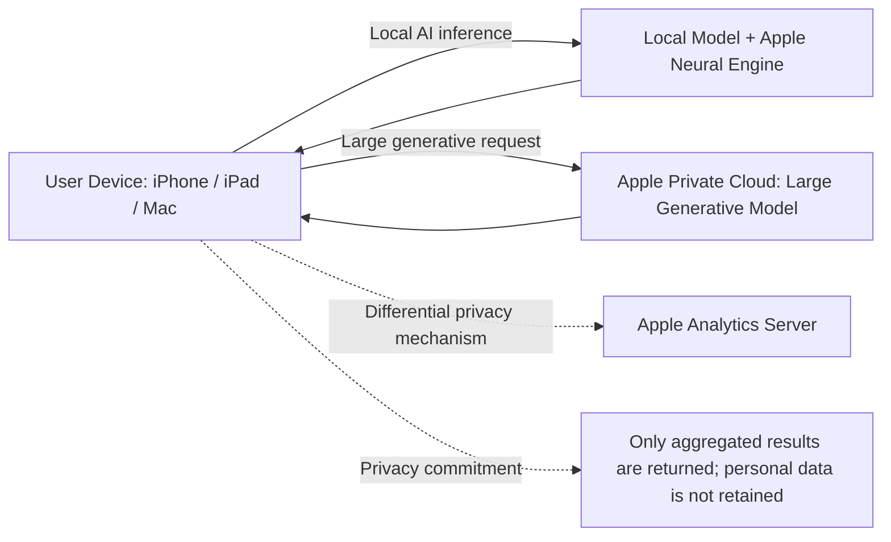

## Executive Summary

Apple is known for its tightly integrated ecosystem. Hardware platforms such as the iPhone, Mac, and iPad are paired with operating systems including iOS, macOS, watchOS, and visionOS, as well as services such as iCloud, the App Store, Apple Pay, Apple Music, Fitness+, Health, HomeKit, and CarPlay. Together, these form powerful network effects and lock-in mechanisms ([The CDO Times](https://cdotimes.com/2024/11/21/case-study-apples-ecosystem-strategy-building-loyalty-and-revenue-through-integration-and-innovation/); [Forrester](https://www.forrester.com/blogs/apple-sales-and-profits-analysis-for-fy-2023-top-10-insights/)). Hardware sales remain stable—combined 2024 revenue from the iPhone, Mac, and iPad was approximately $257.9 billion—while Services revenue is growing rapidly, reaching approximately $96.2 billion in 2024 and accounting for 25% of total revenue ([Apple FY2024 Form 10-K](https://www.sec.gov/Archives/edgar/data/320193/000032019324000123/aapl-20240928.htm); [The CDO Times](https://cdotimes.com/2024/11/21/case-study-apples-ecosystem-strategy-building-loyalty-and-revenue-through-integration-and-innovation/)). Average revenue per user (ARPU) in Apple’s ecosystem is far higher than that of competitors—approximately $140 versus $55 for Google and $40 for Samsung—demonstrating the strength of Apple’s premium-pricing strategy and user stickiness ([The CDO Times](https://cdotimes.com/2024/11/21/case-study-apples-ecosystem-strategy-building-loyalty-and-revenue-through-integration-and-innovation/)).

In intelligence, Apple focuses on a “localized intelligence” strategy. It uses a privacy-first AI architecture in which most computation and machine-learning (ML) models run on-device through the Apple Neural Engine and local models. When necessary, more demanding workloads are routed to large models through Private Cloud Compute ([Apple Newsroom](https://www.apple.com/newsroom/2026/06/apple-intelligence-brings-powerful-ai-capabilities-into-everyday-experiences/); [Apple Privacy](https://www.apple.com/tw/privacy/features/)). Personal data is not stored in the cloud, and parties outside Apple can inspect the system to verify its privacy commitments ([Apple Newsroom](https://www.apple.com/newsroom/2026/06/apple-intelligence-brings-powerful-ai-capabilities-into-everyday-experiences/); [Apple Privacy](https://www.apple.com/tw/privacy/features/)). Apple Intelligence supports multiple languages, including Simplified and Traditional Chinese, languages used across the European Union, and localized English for Singapore and India ([Apple Newsroom](https://www.apple.com/newsroom/2026/06/apple-intelligence-brings-powerful-ai-capabilities-into-everyday-experiences/); [Apple China Newsroom](https://www.apple.com.cn/newsroom/2025/02/apple-intelligence-expands-to-more-languages-and-regions-in-april/)). To comply with Chinese regulatory requirements, Apple has partnered with local AI suppliers including Alibaba (“Wenxin Yiyan”) and Baidu (“Wenxin ERNIE”) ([Reuters](https://www.reuters.com/technology/apple-intelligence-ai-service-registered-with-chinas-cyberspace-regulator-2026-07-15/)). It has also completed registration with the Cyberspace Administration of China and must wait for regulatory approval before launching the service in mainland China ([Reuters](https://www.reuters.com/technology/apple-intelligence-ai-service-registered-with-chinas-cyberspace-regulator-2026-07-15/); [Apple China Newsroom](https://www.apple.com.cn/newsroom/2025/02/apple-intelligence-expands-to-more-languages-and-regions-in-april/)).

From a valuation perspective, the market remains divided on how Apple should be classified. The bullish case emphasizes the company’s strong cash flow, the growth potential of Services and its AI platform, and its brand advantage. The bearish case warns of slower smartphone-market growth, supply-chain risks, and policy and regulatory uncertainty, including App Store economics and the European Union’s Digital Markets Act. Morgan Stanley analysts have argued that it is still difficult to conclude that AI will provide Apple with a measurable revenue tailwind ([Reuters](https://www.reuters.com/business/retail-consumer/apple-slides-supply-snags-cloud-outlook-putting-iphone-demand-focus-2026-07-31/)). As of mid-2026, Apple traded at approximately 30–35 times earnings, close to Microsoft at approximately 29 times and Meta at approximately 30 times, but far above Samsung Electronics at approximately 22 times ([CompaniesMarketCap](https://companiesmarketcap.com/samsung/pe-ratio/); [Macrotrends](https://www.macrotrends.net/stocks/charts/MSFT/microsoft/pe-ratio)). A discounted cash flow analysis based on a ten-year forecast assumes, in the base case, 5% annual revenue growth, an approximately 24% net margin, and an 8% discount rate, producing an estimated enterprise value of approximately $2.0 trillion. A bullish case, using a lower discount rate and higher growth, produces an estimated value of approximately $3.2 trillion. A bearish case, assuming only 2% annual growth and a 9% discount rate, produces an estimated value of approximately $1.8 trillion. As the table below shows, even when the base-case valuation is near the current market value, modest changes in assumptions produce very different outcomes, reflecting investor uncertainty and divergent expectations regarding Apple’s future growth.

Overall, Apple’s core advantage lies in its closed-loop ecosystem and high-barrier product integration. However, it must address the risks created by slower hardware-upgrade cycles, regulation, and intensifying competition, including App Store investigations, privacy rules, and tight supplies of critical components ([The CDO Times](https://cdotimes.com/2024/11/21/case-study-apples-ecosystem-strategy-building-loyalty-and-revenue-through-integration-and-innovation/); [Apple China Newsroom](https://www.apple.com.cn/newsroom/2025/02/apple-intelligence-expands-to-more-languages-and-regions-in-april/)). Strategically, Apple may continue to invest in AI, health, and AR/VR products such as the Vision Pro headset ([The CDO Times](https://cdotimes.com/2024/11/21/case-study-apples-ecosystem-strategy-building-loyalty-and-revenue-through-integration-and-innovation/)), while strengthening its technology through smaller acquisitions, as it previously did with AI and AR/VR startups ([Wikipedia: List of Mergers and Acquisitions by Apple](https://en.wikipedia.org/wiki/List_of_mergers_and_acquisitions_by_Apple)). Apple must preserve the advantages of its existing ecosystem while responding flexibly to changes in regulation and market demand in order to maintain long-term competitiveness.

## Apple’s Ecosystem: Integrating Products and Services

Apple’s ecosystem includes hardware devices such as the iPhone, Mac, iPad, Apple Watch, AirPods, and HomePod; software platforms such as iOS, macOS, watchOS, and visionOS; and cloud services and content such as iCloud, the App Store, Apple Pay, Apple Music, Fitness+, Health, HomeKit, and CarPlay. These products are tightly integrated and work together across devices. Features such as Handoff, AirDrop, and Sidecar allow files and user experiences to move seamlessly, while an Apple ID links all services to a single account, increasing user stickiness ([The CDO Times](https://cdotimes.com/2024/11/21/case-study-apples-ecosystem-strategy-building-loyalty-and-revenue-through-integration-and-innovation/)). Internal development tools such as Xcode, Swift, and Core ML also encourage innovation and app interoperability within the ecosystem. Overall, the system-level value effect and application-network effect are clear: the more users adopt Apple products, the more prosperous the app ecosystem and cloud services become, reinforcing lock-in and raising the cost of switching to another brand ([The CDO Times](https://cdotimes.com/2024/11/21/case-study-apples-ecosystem-strategy-building-loyalty-and-revenue-through-integration-and-innovation/)).

The table below compares the revenue weighting, margins, recent growth trends, and strategic role of Apple’s major business categories. Data sources include Apple’s 2024 Form 10-K and market-research reports.

| **Business Category** | **Share of 2024 Revenue** | **Gross Margin / Net Margin** | **Recent Growth Trend** | **Strategic Role** |
|---|---:|---:|---|---|
| **Hardware (Products)**   (iPhone, Mac, iPad, etc.) | Approximately **66%** ([Apple FY2024 Form 10-K](https://www.sec.gov/Archives/edgar/data/320193/000032019324000123/aapl-20240928.htm)) | Approximately **37%** gross margin ([Forrester](https://www.forrester.com/blogs/apple-sales-and-profits-analysis-for-fy-2023-top-10-insights/)); net margin approximately 24% | Nearly flat or slightly positive in recent years: iPhone revenue rose slightly in 2024, Mac grew modestly, and iPad declined slightly ([Apple FY2024 Form 10-K](https://www.sec.gov/Archives/edgar/data/320193/000032019324000123/aapl-20240928.htm)) | The core revenue source and foundation of the brand. Hardware operates in a highly competitive market with limited customization, so Apple must rely on innovation—such as internally designed chips and form-factor upgrades—to remain attractive ([The CDO Times](https://cdotimes.com/2024/11/21/case-study-apples-ecosystem-strategy-building-loyalty-and-revenue-through-integration-and-innovation/)). Hardware sales drive Services usage, including apps and cloud services, and are the prerequisite for entering the ecosystem. |
| **Services**   (App Store, iCloud, Apple Pay, Apple Music, etc.) | Approximately **25%** ([Apple FY2024 Form 10-K](https://www.sec.gov/Archives/edgar/data/320193/000032019324000123/aapl-20240928.htm)) | Approximately **73–74%** gross margin ([Forrester](https://www.forrester.com/blogs/apple-sales-and-profits-analysis-for-fy-2023-top-10-insights/)); higher net margin | Sustained rapid growth: approximately 15% compound annual growth in recent years and 13% growth in 2024 ([Apple FY2024 Form 10-K](https://www.sec.gov/Archives/edgar/data/320193/000032019324000123/aapl-20240928.htm); [The CDO Times](https://cdotimes.com/2024/11/21/case-study-apples-ecosystem-strategy-building-loyalty-and-revenue-through-integration-and-innovation/)) | A high-margin and fast-growing business. It raises ARPU, stabilizes cash flow, and deepens ecosystem lock-in. App Store commissions, advertising, subscriptions, and financial-payment services all belong to this category ([The Guardian](https://www.theguardian.com/technology/2019/oct/30/apple-earnings-revenue-stocks-wearables-services); [Forrester](https://www.forrester.com/blogs/apple-sales-and-profits-analysis-for-fy-2023-top-10-insights/)). Future goals include expanding subscriptions, cloud services, advertising revenue, and related categories. |
| **Wearables**   (Apple Watch, health devices, and future AR/VR devices) | Approximately **4–5%** | Possibly slightly below the gross margin of general products; specific figures are not disclosed, with an estimated range of 30–40% | Slowing growth: health-device sales are approaching saturation, while newer AR/VR hardware such as Vision Pro remains at an early stage | An innovation and value-added category that includes health monitoring and augmented reality. The current Apple Watch and future AR/VR devices extend the ecosystem, support differentiation, and reinforce Apple’s positioning around premium health and innovative technology. Shipments declined slightly in 2024, but long-term demand remains viewed positively. |
| **Accessories**   (AirPods, HomePod, and other accessories) | Approximately **5–6%** | High gross margin, estimated above 40%; products such as AirPods and Beats are considered profitable | Stable or slightly declining, as AirPods retains a high market share but the market has matured | Complementary products that strengthen ecosystem completeness, including wireless earphones, smart speakers, phone cases, and other accessories. They provide additional hardware revenue and improve the user experience—for example, AirPods can switch automatically among Apple devices. Accessories also serve as points of attraction when new technologies are introduced. |

**Note:** Revenue-share data comes from Apple’s official financial statements ([Apple FY2024 Form 10-K](https://www.sec.gov/Archives/edgar/data/320193/000032019324000123/aapl-20240928.htm)). Gross-margin and growth estimates reference Forrester and analyst reports ([Forrester](https://www.forrester.com/blogs/apple-sales-and-profits-analysis-for-fy-2023-top-10-insights/); [Apple FY2024 Form 10-K](https://www.sec.gov/Archives/edgar/data/320193/000032019324000123/aapl-20240928.htm)). Hardware includes all non-Service products. Wearables includes the Apple Watch and related devices. Accessories includes AirPods and other non-wearable accessories.

The ecosystem’s lock-in effect comes from seamless integration and convenience. AirPods, for example, can switch automatically among a user’s devices ([The CDO Times](https://cdotimes.com/2024/11/21/case-study-apples-ecosystem-strategy-building-loyalty-and-revenue-through-integration-and-innovation/)). Apple Watch and Health data can synchronize across devices. Buying Apple devices often requires investment in the wider Apple ecosystem—such as iMessage, App Store purchase histories, and household-device management—which makes migration difficult. Apple can therefore sustain a relatively high ARPU through premium pricing ([The CDO Times](https://cdotimes.com/2024/11/21/case-study-apples-ecosystem-strategy-building-loyalty-and-revenue-through-integration-and-innovation/)). However, Apple also faces criticism of its premium-pricing strategy and closed ecosystem. To justify that premium, it must continue to innovate ([The CDO Times](https://cdotimes.com/2024/11/21/case-study-apples-ecosystem-strategy-building-loyalty-and-revenue-through-integration-and-innovation/)).

## Localized Intelligence and Apple’s AI/ML Strategy

**Definition:** “Localized intelligence” means that AI capabilities must not only be technically advanced, but must also conform to the language, culture, and regulatory conditions of users in each market. Apple applies a privacy-first architecture and design, processing personal data on-device whenever possible and using confidential private-cloud infrastructure only when complex computation requires it ([Apple Newsroom](https://www.apple.com/newsroom/2026/06/apple-intelligence-brings-powerful-ai-capabilities-into-everyday-experiences/); [Apple Privacy](https://www.apple.com/tw/privacy/features/)). Apple Intelligence uses the user’s context and needs to provide localized Siri assistance and translation, image generation, and writing support while protecting privacy. Apple uses fine-tuned “Apple Foundation Models” and some models developed in cooperation with Google Gemini, and runs them on newer hardware, including the latest iPhone, Apple Watch, Vision devices, and M-series Macs ([Apple Newsroom](https://www.apple.com/newsroom/2026/06/apple-intelligence-brings-powerful-ai-capabilities-into-everyday-experiences/); [Apple Privacy](https://www.apple.com/tw/privacy/features/)).

**AI/ML Technologies and Tools:** Apple has invested in machine-learning research and development for years. It offers tools such as Core ML and Turi Create to developers and includes a dedicated Neural Engine in A-series and M-series chips to accelerate ML inference. Since WWDC 2024, Siri has undergone a broad upgrade, introducing “Siri AI,” combining ChatGPT-like generative capabilities with greater personalization and stronger multi-turn conversational ability ([Apple Newsroom](https://www.apple.com/newsroom/2026/06/apple-intelligence-brings-powerful-ai-capabilities-into-everyday-experiences/)). Under the Apple Intelligence brand, Apple combines multiple AI capabilities, including image editing, Safari webpage organization, intelligent image enhancement, and smart summaries for mail and notes. Many functions use on-device models, while others call Private Cloud Compute to run large generative models and return the results to the device ([Apple Newsroom](https://www.apple.com/newsroom/2026/06/apple-intelligence-brings-powerful-ai-capabilities-into-everyday-experiences/); [Apple Privacy](https://www.apple.com/tw/privacy/features/)). These processes emphasize technologies such as differential privacy to avoid the direct collection of sensitive personal data.

**Language and Regional Support:** Apple Intelligence was planned to expand to additional languages and regions throughout 2025 and 2026. Apple stated that the release of iOS 18.4 and corresponding macOS updates in April 2025 added French, German, Italian, Brazilian Portuguese, Spanish, Japanese, Korean, Simplified Chinese, and localized English for Singapore and India ([Apple China Newsroom](https://www.apple.com.cn/newsroom/2025/02/apple-intelligence-expands-to-more-languages-and-regions-in-april/)). At the same time, users in the European Union would receive Apple Intelligence for the first time, while the launch in mainland China would depend on regulatory approval ([Apple China Newsroom](https://www.apple.com.cn/newsroom/2025/02/apple-intelligence-expands-to-more-languages-and-regions-in-april/)). Apple also stated during its fourth-quarter 2024 earnings discussion that it had developed localized English versions for the United Kingdom, Australia, Canada, and other markets, and would continue rolling out localized Siri and intelligent writing tools ([StatementDog](https://statementdog.com/analysis/AAPL/earnings_calls/279516)). These strategies imply working with third-party partners—for example, alliances with Alibaba and Baidu in 2026 to provide generative models for the mainland-China version ([Reuters](https://www.reuters.com/technology/apple-intelligence-ai-service-registered-with-chinas-cyberspace-regulator-2026-07-15/))—while complying with local data and security rules in Europe and other markets.

**Privacy and Regulatory Considerations:** Under privacy regulations such as the GDPR, the California Consumer Privacy Act, and the European Union’s Data Governance Act, Apple promotes data minimization. Its AI features use end-to-end encryption and differential privacy ([Apple Privacy](https://www.apple.com/tw/privacy/features/)). Apple’s privacy materials state that when users send complex requests through Apple Intelligence, Private Cloud Compute extends device-level privacy into the cloud. User data is not stored on servers and is used only to fulfill the request ([Apple Privacy](https://www.apple.com/tw/privacy/features/)). This design addresses strict regulatory requirements in multiple jurisdictions and creates a meaningful point of differentiation from competitors such as Google and Meta.

*Case:* After the launch of Apple Intelligence, some analysts predicted that the new features would encourage existing users to upgrade. Wedbush expected up to 15% of the installed base to upgrade because of the new capabilities ([Reuters analysis republished by Investing.com](https://www.investing.com/news/stock-market-news/analysisapples-ai-push-could-reinvigorate-iphone-sales-as-customers-look-to-upgrade-3478623)). Others argued that the features were limited to flagship devices and that competitors were following quickly, meaning the near-term effect on overall demand could be limited ([Reuters analysis republished by Investing.com](https://www.investing.com/news/stock-market-news/analysisapples-ai-push-could-reinvigorate-iphone-sales-as-customers-look-to-upgrade-3478623); [Reuters](https://www.reuters.com/business/retail-consumer/apple-slides-supply-snags-cloud-outlook-putting-iphone-demand-focus-2026-07-31/)).

The diagram below illustrates the Apple Intelligence data-processing flow. Local models run on the device through the Apple Neural Engine and handle private personal context. When a request requires a larger model, the device sends it to Apple’s private cloud for computation, after which the result is returned. Differential privacy and encryption protect the data throughout the process ([Apple Newsroom](https://www.apple.com/newsroom/2026/06/apple-intelligence-brings-powerful-ai-capabilities-into-everyday-experiences/); [Apple Privacy](https://www.apple.com/tw/privacy/features/)).

## The Valuation Divide

The market has two opposing views of Apple’s valuation.

**The bullish case** argues that Apple has a large and loyal installed base of more than 3 billion active devices, a highly profitable Services business, strong cash flow, and an aggressive share-repurchase strategy. Combined with the additional growth potential from AI and new health technologies, these qualities support a higher valuation. Analysts including Dan Ives and researchers at Oppenheimer have expected AI capabilities to stimulate replacement cycles and willingness to upgrade ([Reuters analysis republished by Investing.com](https://www.investing.com/news/stock-market-news/analysisapples-ai-push-could-reinvigorate-iphone-sales-as-customers-look-to-upgrade-3478623)).

**The bearish case** emphasizes that the smartphone market is approaching saturation and that iPhone unit growth may be reaching a ceiling. It remains uncertain whether Services growth can remain strong enough to offset hardware weakness. Apple also faces supply-chain constraints, rising costs, and global economic volatility. Morgan Stanley has argued that the near-term operating effect of AI remains unclear and that declining App Store revenue could indicate a shift in user behavior toward other forms of entertainment ([Reuters](https://www.reuters.com/business/retail-consumer/apple-slides-supply-snags-cloud-outlook-putting-iphone-demand-focus-2026-07-31/)). A weaker-than-expected outlook in the second half of 2026 intensified concerns about growth and led some investment banks to reduce their price targets, while others raised theirs. The median Wall Street target was approximately $330, slightly below the closing price of approximately $333 at the time, reflecting the divided outlook ([Reuters](https://www.reuters.com/business/retail-consumer/apple-slides-supply-snags-cloud-outlook-putting-iphone-demand-focus-2026-07-31/)).

A comparison of Apple and peer valuations shows that, as of mid-2026, Apple traded at close to 36 times earnings ([CompaniesMarketCap](https://companiesmarketcap.com/samsung/pe-ratio/)), roughly comparable with Microsoft at approximately 29 times ([Macrotrends](https://www.macrotrends.net/stocks/charts/MSFT/microsoft/pe-ratio)) and Meta at approximately 30 times. Google, at approximately 25 times, and Amazon, whose multiple fluctuated because of unstable earnings, appeared relatively cheaper. Samsung Electronics, whose businesses are concentrated in semiconductors and home appliances, traded at only approximately 22 times earnings ([CompaniesMarketCap](https://companiesmarketcap.com/samsung/pe-ratio/)), with a forward multiple of only approximately 5–6 times because of the industry’s high cyclicality.

A simplified discounted cash flow (DCF) model was constructed to simulate enterprise value under different scenarios. The forecast period is ten years, and the terminal growth rate is 2%.

- **Base Case:** Annual revenue growth of 5%, a 24% net margin, and an 8% discount rate produce an estimated enterprise value of approximately $2.4 trillion, broadly comparable with the current market capitalization of approximately $2.7 trillion.
- **Bull Case:** Annual revenue growth of 8%, a 25% net margin, and a 7% discount rate produce an estimated value of approximately $3.2 trillion.
- **Bear Case:** Annual revenue growth of 2%, a 22% net margin, and a 9% discount rate produce an estimated value of approximately $1.8 trillion.

| Scenario | Average Annual Revenue Growth (10 Years) | Net Margin | Discount Rate | Terminal Growth Rate | Estimated Enterprise Value (USD) |
|---|---:|---:|---:|---:|---:|
| **Base** | 5% | 24% | 8% | 2% | ~$240 billion |
| **Bull** | 8% | 25% | 7% | 2% | ~$320 billion |
| **Bear** | 2% | 22% | 9% | 2% | ~$180 billion |

*Assumptions: The model extrapolates current operating conditions over ten years and uses a 2% terminal growth rate. Actual values depend on the final assumptions; the table is provided only as a sensitivity reference.*

The valuation results show that small changes in assumptions can lead to significant differences. This reflects investors’ sensitivity to future growth and the stability of profitability. If Apple breaks through the hardware ceiling and continues to expand Services and AI, growth may justify a premium. If growth stalls or regulation becomes more restrictive, the valuation could contract sharply.

## Strategic Implications and Risks

1. **Opportunities:** Apple can pursue growth through continued ecosystem expansion and innovation. In the near term, AI features and AR/VR devices such as Vision Pro are expected to serve as points of attraction ([The CDO Times](https://cdotimes.com/2024/11/21/case-study-apples-ecosystem-strategy-building-loyalty-and-revenue-through-integration-and-innovation/); [Reuters analysis republished by Investing.com](https://www.investing.com/news/stock-market-news/analysisapples-ai-push-could-reinvigorate-iphone-sales-as-customers-look-to-upgrade-3478623)). Health management—including Apple Watch electrocardiograms, blood-oxygen monitoring, and sleep tracking—represents another growth engine. Services can expand further into financial payments through Apple Card, advertising through App Store Search Ads, content subscriptions through Apple TV+ and Apple Arcade, and enterprise applications through the commercialization of Apple Pay. Apple has also used acquisitions to accelerate its strategy, including Xnor.ai to strengthen on-device AI and NextVR to support Vision Pro content ([Wikipedia: List of Mergers and Acquisitions by Apple](https://en.wikipedia.org/wiki/List_of_mergers_and_acquisitions_by_Apple)). Future major projects such as Apple Car, smart-home integration, or health-insurance partnerships could also become potential acquisition or partnership directions.

2. **Risks:** Apple must address several challenges. The first is **regulatory risk**. Regulators around the world have investigated or legislated the operation of the App Store and digital privacy. Future rules may require Apple to open third-party app stores or reduce commissions, affecting Services profitability ([The CDO Times](https://cdotimes.com/2024/11/21/case-study-apples-ecosystem-strategy-building-loyalty-and-revenue-through-integration-and-innovation/)). The second is **market risk**. In emerging markets, the iPhone competes with lower-priced Android devices. Supply shortages and rising costs may also compress margins. As shown by a recent weaker-than-expected outlook, changes in growth expectations can create short-term share-price volatility ([Reuters](https://www.reuters.com/business/retail-consumer/apple-slides-supply-snags-cloud-outlook-putting-iphone-demand-focus-2026-07-31/)). Apple also depends heavily on China for both its supply chain and market access, and must manage uncertainty created by U.S.–China technology tensions and local Chinese requirements, such as the use of domestic AI models ([Reuters](https://www.reuters.com/technology/apple-intelligence-ai-service-registered-with-chinas-cyberspace-regulator-2026-07-15/); [Apple China Newsroom](https://www.apple.com.cn/newsroom/2025/02/apple-intelligence-expands-to-more-languages-and-regions-in-april/)).

3. **Products and Road Map:** Apple may continue to build on its strengths in custom silicon, software services, and ecosystem integration. Examples include more products based on M-series chips, such as M4 Macs; deeper integration of health-data platforms, including research-grade sleep and heart-rate analysis; and virtual-currency or metaverse applications through a broader visionOS app ecosystem. If the rumored Apple Car makes concrete progress, it could become another core device within the ecosystem. Overall, Apple must balance the closed nature of its ecosystem—which preserves its competitive advantage—with growing pressure for openness, such as requirements under European Union law to allow third-party app stores.

4. **Policy and Regulation:** Future regulations such as the European Union’s Digital Markets Act may force Apple to lower platform barriers. U.S. antitrust actions may also affect the App Store or require separation of payment systems. Apple’s privacy commitments, including end-to-end encryption and differential privacy, align with global trends, but may still face scrutiny under AI regulation, including the European Union’s AI legislation. Rising consumer awareness of privacy also requires Apple to remain transparent and cautious when managing user data for personalized AI services.

## Conclusion

Through its highly integrated ecosystem and leading hardware technologies, Apple has built a competitive position that is difficult to dislodge. Maintaining this advantage requires a precise balance between innovation—in AI, health, AR/VR, and related areas—and compliance with antitrust and privacy requirements. Investors and management should closely monitor Services growth, the effectiveness of AI applications, and changes in the regulatory environment, while adjusting strategy to preserve stable long-term growth in revenue and cash flow.

**Sources:** This report primarily references Apple’s official materials, including its 2024 Form 10-K, earnings-call transcripts, and press releases; reports from major financial institutions and analysts; academic and industry research; financial news; and market data. All data and analysis are linked at the relevant points in the text.
