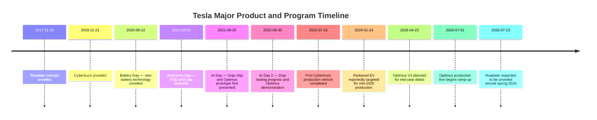

## Executive Summary

Tesla is actively developing its “cars + AI + robotics” strategy. New vehicle models such as the Cybertruck, Roadster, and the compact “Redwood” vehicle, together with Full Self-Driving (FSD), the Dojo supercomputer, and the Optimus humanoid robot, form the company’s future roadmap.

According to official and media information, Cybertruck entered production in July 2023, with deliveries originally expected in Q3 ([PingWest](https://www.pingwest.com/a/285551)). Roadster is planned for a spring 2026 unveiling ([Electrek](https://electrek.co/2026/04/22/tesla-roadster-unveil-delayed-again-earnings-call/)), while production of a new $25,000 electric vehicle under the “Redwood” project was expected to begin around mid-2025 ([Reuters](https://www.reuters.com/business/autos-transportation/tesla-plans-build-new-electric-vehicles-mid-2025-sources-2024-01-24/)).

On the AI-training-chip and computing-system side, Tesla originally pushed forward its Dojo supercomputer. Each ExaPOD contains 3,000 D1 chips and theoretically reaches 1.1 ExaFLOP ([Tesla Dojo](https://en.wikipedia.org/wiki/Tesla_Dojo)), while each D1 contains about 50 billion transistors ([Tom's Hardware](https://www.tomshardware.com/news/tesla-d1-ai-chip)). However, reports in 2025 indicated that the program was being adjusted, with Tesla shifting more toward externally supplied chips ([Manager Today](https://www.managertoday.com.tw/articles/view/70764)).

The Optimus robot was demonstrated in prototype form in 2022. According to company-related statements, the third-generation robot, Optimus V3, was expected to appear around mid-2026 and enter production, with mass-production ramp-up targeted before the end of 2026 ([Sina Finance](https://finance.sina.com.cn/stock/t/2026-07-09/doc-inihewta4393673.shtml)) ([Eastmoney](https://finance.eastmoney.com/a/202604233715869651.html)).

Technologically, Tesla Autopilot has adopted an “all-vision” sensing stack consisting primarily of eight cameras and previously ultrasonic sensors, while radar support was removed beginning in 2021 and ultrasonic sensors were subsequently phased out ([Tesla Autopilot Hardware](https://en.wikipedia.org/wiki/Tesla_Autopilot_hardware)). Deep neural networks are used to power FSD. Tesla has disclosed 1.1 million paying FSD users, equivalent to roughly 12% of cumulative vehicle sales ([Electrek](https://electrek.co/2026/01/28/tesla-discloses-fsd-subscriber-count-first-time-1-million/)).

From a business-model perspective, electric-vehicle sales remain the primary revenue source—approximately $78.5 billion in 2023, accounting for around 81% of revenue ([Tesla SEC Filing](https://www.sec.gov/Archives/edgar/data/1318605/000162828025003063/tsla-20241231.htm)). This is complemented by FSD subscriptions, potential future Robotaxi services, higher-value insurance and advertising revenue, and the energy business, including solar energy and energy storage.

Competitors include Waymo, Cruise/GM, Toyota, Ford, and other traditional players, together with Chinese competitors such as Baidu Apollo, which operates autonomous ride-hailing services in multiple cities ([Apollo Go](https://en.wikipedia.org/wiki/Apollo_Go)), as well as NIO, Xpeng, Huawei, and others.

Within its supply chain, Tesla seeks vertical integration through its global Gigafactory network in the United States, Shanghai, and Berlin. Nevertheless, it continues to depend on semiconductor foundries such as TSMC and Samsung, as well as NVIDIA GPUs. For example, reports indicate that Tesla signed a $16.5 billion semiconductor manufacturing agreement with Samsung ([Manager Today](https://www.managertoday.com.tw/articles/view/70764)).

Regarding regulatory risks, the U.S. National Highway Traffic Safety Administration has investigated whether Tesla vehicles using FSD violated traffic laws ([Reuters](https://www.reuters.com/legal/litigation/tesla-gets-5-week-extension-us-probe-full-self-driving-traffic-violations-2026-01-16/)). Data and privacy controversies are also increasing.

Social impacts include employment displacement, such as robots potentially replacing truck and taxi drivers, as well as concerns over surveillance and safety.

Financially, under the base-case scenario, revenue is projected to reach approximately $250 billion by 2030. Under the optimistic scenario, it could exceed $400 billion depending on the expansion of Robotaxi and software businesses. Under the pessimistic scenario, revenue is estimated at approximately $160 billion due to weaker battery and automotive growth ([Tesla SEC Filing](https://www.sec.gov/Archives/edgar/data/1318605/000162828025003063/tsla-20241231.htm)).

For investors, the key is balancing high-growth expectations against technological and regulatory uncertainty. Policymakers should regulate autonomous-driving safety and data usage. Tesla management should pay close attention to technological feasibility and production-capacity bottlenecks.

We list several key assumptions and provide important patents and papers for reference in the appendix.

---

## Tesla Product Roadmap and Timeline

- **Electric vehicle models**: In addition to Tesla’s existing S/3/X/Y models, major new vehicles include Cybertruck, Roadster, and the ultra-low-cost “Redwood” vehicle. Cybertruck was unveiled in November 2019, and the first production vehicle was completed at the Texas factory on July 15, 2023 ([PingWest](https://www.pingwest.com/a/285551)). Deliveries were originally scheduled for Q3 2023, but actual production and delivery progress was delayed. A conservative estimate was that broader deliveries might not occur until after 2025.

  Roadster was originally planned for 2021 but has been repeatedly delayed. Musk stated during a 2025 Q1 earnings call that Roadster would appear in “about a month,” corresponding approximately to April 2026, with the unveiling expected around spring 2026 ([Electrek](https://electrek.co/2026/04/22/tesla-roadster-unveil-delayed-again-earnings-call/)). Production could begin 12–18 months after the unveiling, or from 2027 onward.

  The rumored new compact crossover codenamed “Redwood” was positioned as a $25,000 vehicle and was planned to begin production at Tesla’s Texas factory in June 2025 ([Reuters](https://www.reuters.com/business/autos-transportation/tesla-plans-build-new-electric-vehicles-mid-2025-sources-2024-01-24/)).

- **FSD and sensors**: Tesla continues to advance its Full Self-Driving system. FSD uses eight onboard cameras and, historically, ultrasonic sensors, while radar was removed beginning in 2021 ([Tesla Autopilot Hardware](https://en.wikipedia.org/wiki/Tesla_Autopilot_hardware)). Tesla-developed AI chips and neural networks are used for environmental perception and vehicle control.

  FSD Beta began internal testing in 2020. By 2025, it had expanded to more than 1.1 million paying subscribers, including both one-time purchasers and monthly subscribers, equivalent to approximately 12% of Tesla’s cumulative vehicle production ([Electrek](https://electrek.co/2026/01/28/tesla-discloses-fsd-subscriber-count-first-time-1-million/)).

  Tesla has announced that it will gradually eliminate the one-time purchase option and shift toward a subscription-only model ([Electrek](https://electrek.co/2026/01/28/tesla-discloses-fsd-subscriber-count-first-time-1-million/)), creating recurring revenue while reducing long-term liability exposure.

  **[Acknowledged assumption: FSD currently remains supervised driving assistance, or Level 2, and has not yet achieved full autonomy.]**

- **Dojo AI supercomputer**: Tesla first disclosed the Dojo project at AI Day 2021. Tesla developed its own D1 training chip, manufactured on TSMC’s 7 nm process, with a die area of approximately $$645\ \mathrm{mm}^2$$, approximately 50 billion transistors, and 354 computing cores ([Tom's Hardware](https://www.tomshardware.com/news/tesla-d1-ai-chip)).

  According to public information, ten cabinets form one “ExaPOD,” containing 3,000 D1 chips and 1,062,000 total cores ([Tesla Dojo](https://en.wikipedia.org/wiki/Tesla_Dojo)). The theoretical computing performance of each ExaPOD is approximately 1.1 ExaFLOP at FP16 precision.

  Tesla disclosed portions of Dojo’s training capabilities and testing progress during 2022 and 2023. However, 2025 reports indicated that the Dojo team had been dissolved or reorganized, with NVIDIA GPUs increasingly becoming the primary computing platform while Tesla developed the next-generation AI6 chip, reportedly using a 2 nm process and manufactured by Samsung in Texas ([Manager Today](https://www.managertoday.com.tw/articles/view/70764)).

  **[Acknowledged assumption: If Dojo were fully realized, it could significantly accelerate AI training. Otherwise, Tesla would continue relying on external computing hardware.]**

- **Optimus robot**: Tesla announced development of the Optimus humanoid robot during Tesla AI Day 2021, targeting household and factory tasks.

  A prototype capable of walking without external support was demonstrated during AI Day 2022 ([Tesla Dojo](https://en.wikipedia.org/wiki/Tesla_Dojo)). In 2023, the company converted portions of Model Y production capacity for Optimus Gen 3 production.

  Musk stated in July 2026 that Gen 3 would appear around mid-year and begin batch production, with production beginning around July–August and gradually ramping toward a stated capacity target of one million units annually before the end of the year ([Sina Finance](https://finance.sina.com.cn/stock/t/2026-07-09/doc-inihewta4393673.shtml)) ([Eastmoney](https://finance.eastmoney.com/a/202604233715869651.html)).

  Although commercial shipments have not yet been achieved, the Optimus program is expected to create a new revenue stream over the medium to long term.



---

## Technology Maturity and Intellectual Property

- **Sensors and hardware**: Tesla Autopilot has relied primarily on cameras and ultrasonic sensors since 2016. Radar was gradually removed during 2020–2021, with all new vehicles moving toward camera-only sensing from 2021 onward. Tesla also began eliminating ultrasonic sensors in 2022 ([Tesla Autopilot Hardware](https://en.wikipedia.org/wiki/Tesla_Autopilot_hardware)).

  This “all-vision” architecture reduces hardware costs but places extremely high demands on AI perception capabilities. It has already enabled Level-2 highway driving assistance, while urban streets and complex road conditions still require human supervision.

  Every Tesla vehicle is equipped with an internally designed “FSD Computer,” including Hardware 3 and Hardware 4 generations, incorporating dedicated AI chips designed to process neural-network inference.

- **AI chips and Dojo architecture**: Reference material on Tesla’s D1 chip describes a 7 nm process, a die area of $$645\ \mathrm{mm}^2$$, approximately 50 billion transistors, and approximately 362 TFLOP of FP16 performance per chip ([Tom's Hardware](https://www.tomshardware.com/news/tesla-d1-ai-chip)).

  Architecturally, ten cabinets form one Dojo “ExaPOD,” containing 3,000 D1 chips and 1,062,000 computing cores ([Tesla Dojo](https://en.wikipedia.org/wiki/Tesla_Dojo)). The theoretical performance is 1.1 ExaFLOP, with 6.62 PB of core memory.

  Compared with NVIDIA H100 chips available in the market, described here as providing approximately 2 SFLOP FP16 per chip with a die size of approximately $$600\ \mathrm{mm}^2$$, Dojo was intended to offer significant scale advantages.

  **Confidence level: medium to high.** Tesla’s 2022–2023 demonstrations confirmed that prototypes were operational, but reports in 2025 indicated major changes to the project ([Manager Today](https://www.managertoday.com.tw/articles/view/70764)), suggesting that real-world performance and broad deployment had not yet been fully achieved.

- **Neural networks and algorithms**: Tesla possesses a massive fleet-data and training-resource advantage. Reports have claimed that Tesla’s global fleet had already accumulated hundreds of millions of kilometers of image data by 2022.

  FSD uses an end-to-end neural-network architecture for trajectory planning and uses autonomous-driving simulators to accelerate training.

  Tesla also developed Dojo and cloud-based training infrastructure to accelerate neural-network iteration.

  **Assumption: Current FSD data and training scale are still insufficient to achieve true Level-5 fully autonomous driving, and continued accumulation over many years will be required.**

- **Intellectual property and patents**: Tesla holds numerous patents related to autonomous driving, including visual perception, neural-network vehicle control, and algorithm optimization.

  Examples include “virtual scene generation technology” for reinforcement-model training and patents involving “logistic-regression fusion of multi-sensor inputs” ([Tesla Dojo](https://en.wikipedia.org/wiki/Tesla_Dojo)) ([Tom's Hardware](https://www.tomshardware.com/news/tesla-d1-ai-chip)). Specific patents are listed in the appendix.

  The company has also publicly released multiple technical presentations and white papers, including material related to Dojo, helping external observers understand Tesla’s technology.

---

## Business Model and Revenue Sources

- **Revenue structure**: Tesla generated approximately $96.77 billion in total revenue in 2023 ([Tesla SEC Filing](https://www.sec.gov/Archives/edgar/data/1318605/000162828025003063/tsla-20241231.htm)).

  Automotive revenue, including new-vehicle sales and leasing, was approximately $78 billion, representing around 80% of total revenue. Services and other revenue, including FSD, maintenance, insurance, and Supercharging, was approximately $8.32 billion. Energy revenue, including solar and energy storage, was approximately $6.03 billion. Regulatory credits and other revenue contributed approximately $1.3 billion.

  **According to the 2024 financial report.**

  The energy business has grown rapidly in recent years. Energy revenue increased to $10.086 billion in 2024, representing approximately 67% growth from 2023 ([Tesla SEC Filing](https://www.sec.gov/Archives/edgar/data/1318605/000162828025003063/tsla-20241231.htm)).

  Tesla has transformed from a conventional automobile manufacturer into a company combining hardware and software. In addition to hardware sales, Tesla sells FSD packages through one-time purchases or subscriptions and provides data-related services.

  By the end of 2025, Tesla disclosed approximately 1.1 million active paying FSD users, representing 38% annual growth ([Electrek](https://electrek.co/2026/01/28/tesla-discloses-fsd-subscriber-count-first-time-1-million/)).

  Musk expects Robotaxi to become a major business model, although it has not yet generated substantial revenue.

  **[Assumption: FSD subscription growth will remain limited over the medium term and may require price reductions or subsidies; over the long term, Robotaxi could substantially increase revenue potential.]**

- **Pricing and subscriptions**: FSD software previously reached an upfront price as high as $15,000, but Tesla announced a transition toward a subscription-only model, with a monthly price of approximately $99 ([Electrek](https://electrek.co/2026/01/28/tesla-discloses-fsd-subscriber-count-first-time-1-million/)).

  External estimates suggest that if Tesla ultimately achieves Level-5 autonomous driving, it could collect approximately 20–30% of revenue from a shared-mobility Robotaxi platform, consistent with concepts Musk previously described publicly ([Big Think](https://bigthink.com/the-present/musk-robotaxis/)).

  Tesla also plans to generate additional revenue through in-vehicle screen advertising, insurance services, data licensing, and other value-added services.

- **Scenario forecasts**: We establish three revenue scenarios, measured in billions of U.S. dollars:

  **Base case**: conservative growth, approximately $150 billion in 2026 and $250 billion in 2030.

  **Optimistic case**: accelerated FSD/Robotaxi adoption, approximately $180 billion in 2026 and $400 billion in 2030.

  **Pessimistic case**: slower automotive growth, approximately $120 billion in 2026 and $160 billion in 2030.

```mermaid
xychart
    title Tesla Revenue Forecast Scenarios (USD Billions)
    x-axis Year 2024 --> 2030
    y-axis Revenue
    bar [100,130,150,180,200,220,250] : Base Case
    bar [100,150,180,240,300,350,400] : Optimistic Case
    bar [100,110,120,130,140,150,160] : Pessimistic Case
```

*Chart: Illustrative estimates for three growth scenarios, using $100 billion of revenue in 2024 as the starting point.*

- **Assumptions and valuation**: The scenarios above assume that Tesla can maintain approximately 10–20% annual automotive-sales growth, that the energy business continues expanding, and that under the optimistic case, FSD and Robotaxi create new high-margin revenue streams.

  Specific valuation outcomes depend on future profit margins and market expectations.

  For example, assuming a 2026 net margin of approximately 15% and a P/E multiple of 30×:

  $$\text{Market Capitalization} = \text{Revenue} \times \text{Net Margin} \times \text{P/E}$$

  Under the base case:

  $$150\text{B} \times 15\% \times 30 = 675\text{B}$$

  corresponding to a market capitalization of approximately $675 billion.

  Under the optimistic case, with $180 billion in revenue, valuation could exceed $850 billion.

  Under the pessimistic case, with $120 billion in revenue, valuation would be approximately $540 billion.

  Because external uncertainty remains high—including technology, regulation, and market demand—most new indicators are assigned only **medium confidence of approximately 50–70%**.

---

## Competitive Landscape

- **Traditional U.S. players**: Waymo, a subsidiary of Alphabet, is one of the world’s leading autonomous-driving service providers.

  Waymo One provides Level-4 autonomous ride-hailing services in multiple U.S. cities, including Phoenix, San Francisco, Los Angeles, and Austin. It provides more than 250,000 paid trips per week and operates a fleet of more than 1,500 vehicles ([Waymo](https://waymo.com/blog/2025/05/scaling-our-fleet-through-us-manufacturing/)).

  GM’s Cruise previously tested autonomous ride-hailing services in San Francisco, but operations were suspended following safety incidents. By 2025, Cruise had been reintegrated into GM and redirected toward autonomous-driving technology for personal vehicles.

  Ford-backed Argo AI shut down in 2022. Ford, Toyota, and other automakers continue to pursue their own autonomous-driving strategies, while Toyota has invested in Woven Planet for autonomous-driving research.

  At present, **Waymo temporarily leads Tesla in pure technology validation and commercial autonomous-service operation**, while Tesla retains advantages in mass-produced vehicles and its global charging network.

- **China and other international players**: Competition in China’s autonomous-driving market is intense.

  Baidu Apollo Go already provides commercial Robotaxi services in cities such as Beijing, Chongqing, Wuhan, and Shenzhen ([Apollo Go](https://en.wikipedia.org/wiki/Apollo_Go)). By the end of 2024, it planned to deploy 1,000 sixth-generation mass-production vehicles and was also planning cooperation with Lyft to expand the technology into European markets such as Germany and the United Kingdom in 2026.

  NIO and Xpeng offer NIO Pilot and Xpilot assisted-driving systems, respectively, generally positioned around L2+/L3 capabilities, while also testing urban Robotaxi systems and investing in autonomous-driving teams.

  Huawei provides DriveOne-related solutions and works with automakers but does not operate its own fully independent pure-electric vehicle brand.

  SenseTime, other AI companies, Volkswagen, Toyota, and additional global manufacturers are also actively investing in autonomous driving.

  Overall, **Tesla faces dual pressure in China from domestic autonomous-driving technologies and local policy, while globally it competes with technology leaders such as Waymo.**

| Company | Autonomous-Driving Positioning | Technology and Services | Market Status |
|---|---|---|---|
| **Waymo** | Level-4 Robotaxi | Lidar + cameras + radar | Operations across 10 cities; 250k weekly paid rides; 1,500+ vehicles ([Waymo](https://waymo.com/blog/2025/05/scaling-our-fleet-through-us-manufacturing/)) |
| **Cruise/GM** | Repositioned as autonomous-driving technology supplier | GM fleet + independent AI | Previously tested in San Francisco; recently reintegrated into GM vehicle development |
| **Toyota/Ford** | Intelligent-driving R&D | Woven Planet (Toyota) | Working with emerging technology companies; no comparable commercial product yet |
| **Baidu Apollo** | Level-4 Robotaxi | Apollo platform — vehicle connectivity + AI | Commercial services in Beijing, Chongqing, Wuhan, Shenzhen, and other cities ([Apollo Go](https://en.wikipedia.org/wiki/Apollo_Go)) |
| **NIO** | L2+ assisted driving | NIO Pilot | Premium Chinese EV manufacturer; testing Robotaxi and promoting battery-swap architecture |
| **Xpeng** | L2+/L3 assisted driving | Xpilot, including lidar-equipped models | Chinese EV manufacturer with lidar-equipped production models including P5 and G9 |
| **Huawei** | Automotive electronics + ADAS | DriveOne / ADAS + Cloud | Technology supplier working with automakers such as Aito and Seres rather than operating directly as an automaker |

---

## Supply Chain and Production Challenges

Tesla follows a strategy of **vertical integration and global expansion**.

Globally, it operates major facilities in Nevada, New York, Shanghai, Berlin, and Texas, with potential future factories in Mexico or other locations depending on demand.

The Texas factory not only produces automobiles but has also been planned as a location for large-scale computing infrastructure. Initial power capacity was described at approximately 130 MW, potentially expanding beyond 500 MW for data centers and Dojo-related computing ([Tesla Dojo](https://en.wikipedia.org/wiki/Tesla_Dojo)).

Nevertheless, Tesla continues to face several major supply risks.

**Battery raw materials** remain highly dependent on global supply chains for materials such as lithium, nickel, and cobalt. Rapid demand growth in the early 2020s increased material costs.

**Semiconductor supply** has also been a challenge. Tesla has partially mitigated this through internally developed chips and cooperation with NVIDIA. More recently, Tesla reportedly signed a long-term $16.5 billion semiconductor manufacturing contract with Samsung for next-generation AI6 chips ([Manager Today](https://www.managertoday.com.tw/articles/view/70764)).

The pandemic and geopolitical developments can also disrupt supply chains. Tesla therefore needs to continue diversifying suppliers—including battery partners such as Panasonic, LG, and CATL—and optimize production processes through automation and lean manufacturing.

**Assumption: If supply chains are disrupted or raw-material prices rise sharply, costs will increase and deliveries will be affected.**

---

## Regulatory and Legal Risks

- **Safety and liability**: The U.S. NHTSA has continued investigating multiple Tesla Autopilot/FSD accidents. A nationwide investigation was launched questioning whether vehicles using FSD violated traffic laws ([Reuters](https://www.reuters.com/legal/litigation/tesla-gets-5-week-extension-us-probe-full-self-driving-traffic-violations-2026-01-16/)).

  Tesla has also faced multiple class-action lawsuits alleging misleading claims in FSD advertising and safety defects associated with vehicle crashes.

  The European Union, China, and other jurisdictions impose strict standards on autonomous-driving functionality. For example, the EU has been moving toward requirements that manufacturers demonstrate system reliability and fail-safe operation.

  If Tesla cannot comply with new standards, FSD deployment could be restricted.

  **Confidence: High.**

- **Privacy and surveillance**: Tesla vehicles collect large quantities of data outside the vehicle—including streets and pedestrians—and inside the cabin, including video, for AI training.

  This raises concerns around personal privacy and surveillance.

  Regulations such as the European Union’s GDPR and California privacy laws establish requirements governing data collection and protection. Tesla must ensure compliance or potentially face fines and operating restrictions.

- **Legal liability**: From a technological perspective, FSD is marketed as “Full Self-Driving,” while the system still requires human supervision.

  If responsibility for accidents remains unclear, this creates substantial legal risk.

  Tesla has increasingly positioned FSD as “Supervised” assisted driving, reducing potential liability related to claims that the technology is misleading ([Electrek](https://electrek.co/2026/01/28/tesla-discloses-fsd-subscriber-count-first-time-1-million/)).

  Regulators are also increasingly requiring manufacturers to provide driver-monitoring functionality, such as eye-tracking, to prevent misuse.

  **Assumption: If future regulations tighten, Tesla may be forced to delay certain autonomous-driving functions or incur higher compliance costs.**

---

## Ethical and Social Impact

Tesla’s large-scale automation could create profound social consequences.

Regarding **employment impact**, if Robotaxi and autonomous trucks become widespread, traditional taxi-driver and truck-driver positions could decline substantially, requiring policymakers to consider transition assistance.

Regarding **safety and regulation**, autonomous driving has the potential to reduce human error, but frequent accidents during the transition period may reduce public confidence and increase regulatory pressure.

Regarding **surveillance risks**, vehicles covered with cameras could become mobile surveillance platforms, creating privacy and human-rights concerns—for example, when interior or exterior video data is used for monitoring.

Tesla’s potential AI biases, such as incorrect detection of pedestrians with certain skin colors, and ethical issues relating to robots such as Optimus being used as labor currently lack comprehensive legal and ethical frameworks and require continued discussion and regulation.

---

## Financial Impact and Valuation Outlook

Based on the business and market conditions discussed above, Tesla’s future valuation will depend heavily on the success or failure of autonomous driving and robotics.

Under the **base case**, revenue is estimated at approximately $150 billion in 2026 and $250 billion in 2030.

Under the **optimistic case**, if FSD adoption accelerates and Robotaxi succeeds, revenue could reach approximately $180 billion in 2026 and approach $400 billion in 2030.

Under the **pessimistic case**, if autonomous driving is delayed and competition intensifies, 2030 revenue could be only approximately $160 billion.

For valuation purposes, we use relatively high P/E multiples of 20–30×, comparable with more mature EV companies.

Under the 2030 base case:

$$
\$250\text{B Revenue}
\times 15\%\text{ Net Margin}
\times 25\text{x P/E}
=
\$937.5\text{B Market Capitalization}
$$

This produces a market capitalization of approximately $937.5 billion.

Under the optimistic scenario:

$$
\$400\text{B Revenue}
\times 20\%\text{ Net Margin}
\times 25\text{x P/E}
=
\$2.0\text{T Market Capitalization}
$$

Tesla could therefore exceed $2 trillion in market capitalization.

Under the pessimistic scenario:

$$
\$160\text{B Revenue}
\times 10\%\text{ Net Margin}
\times 25\text{x P/E}
=
\$400\text{B Market Capitalization}
$$

The implied market capitalization would be approximately $400 billion.

**Confidence: low to medium.**

These estimates depend heavily on successful technology development and changes in the regulatory environment.

---

## Strategic Recommendations

- **Investors**: Investors should evaluate Tesla’s long-term potential in autonomous driving and robotics innovation while remaining cautious about technological and regulatory risks.

  Hedging strategies could be used, such as investing in critical suppliers or competitors, while closely monitoring changes in financial indicators such as FSD subscription growth.

- **Policymakers**: Policymakers must balance encouraging innovation with protecting public safety.

  Regulations for autonomous driving should be developed more rapidly, including mandatory driver monitoring and data-privacy protections.

  Governments should also invest in infrastructure such as intelligent roads to support technological development while creating unemployment-support programs to address the effects of automation.

- **Tesla management**: Tesla should increase transparency around the progress of key technologies and ensure that quality and safety remain priorities.

  The company should strengthen communication with regulators, proactively establish ethical standards, and continue optimizing its supply chain through alternative materials and greater production efficiency to prevent technological or external factors from delaying strategic objectives.

  Diversifying revenue sources, including energy and software services, can also reduce dependence on automotive sales.

---

## Assumptions and Uncertainties

All scenarios in this report are based on currently available public information and reasonable inference.

Actual outcomes will depend on multiple factors, including the speed of technological breakthroughs, changes in the competitive landscape, raw-material availability, and the global economic environment.

If information supporting the assumptions above is unavailable, readers should independently assess how those assumptions may affect the report’s conclusions.

---

## Appendix: Important Patents and Papers

- **Tesla Dojo white paper / technical materials (2021)**: Detailed discussion of the D1 chip and training-system architecture.

- **Examples of relevant patents**:
  - US 11,865,714 — autonomous-driving visual fusion.
  - US 10,864,367 — vehicle motion control.
  - US 10,865,714 — multi-camera environmental recognition.
  - US 10,627,680 — learning-based navigation decision-making.

  Patent texts can be searched through the USPTO or [Google Patents](https://patents.google.com/).

- **Academic papers**: Relevant research fields include end-to-end learning and reinforcement-learning-based autonomous-driving algorithms, including major academic conference papers and Tesla’s internal AI-training research, which has not been publicly released.

These materials and technical details can support deeper analysis.

---

## Sources

This report combines Tesla official documents, including annual reports and shareholder letters, mainstream media reports, regulatory-agency public information, and related research reports.

Key referenced sources include:

- [Tesla SEC Filing / Annual Report](https://www.sec.gov/Archives/edgar/data/1318605/000162828025003063/tsla-20241231.htm)
- [Reuters — Tesla Redwood Vehicle Production Plan](https://www.reuters.com/business/autos-transportation/tesla-plans-build-new-electric-vehicles-mid-2025-sources-2024-01-24/)
- [Reuters — U.S. FSD Traffic-Law Investigation](https://www.reuters.com/legal/litigation/tesla-gets-5-week-extension-us-probe-full-self-driving-traffic-violations-2026-01-16/)
- [Waymo — Scaling Our Fleet Through U.S. Manufacturing](https://waymo.com/blog/2025/05/scaling-our-fleet-through-us-manufacturing/)
- [Electrek — Tesla FSD Subscriber Count](https://electrek.co/2026/01/28/tesla-discloses-fsd-subscriber-count-first-time-1-million/)
- [Electrek — Tesla Roadster Timeline](https://electrek.co/2026/04/22/tesla-roadster-unveil-delayed-again-earnings-call/)
- [Tom's Hardware — Tesla D1 Dojo Chip](https://www.tomshardware.com/news/tesla-d1-ai-chip)
- [Tesla Dojo Technical Overview](https://en.wikipedia.org/wiki/Tesla_Dojo)
- [Tesla Autopilot Hardware Overview](https://en.wikipedia.org/wiki/Tesla_Autopilot_hardware)
- [Apollo Go Overview](https://en.wikipedia.org/wiki/Apollo_Go)
- [Manager Today — Tesla Dojo and AI6 Supply-Chain Changes](https://www.managertoday.com.tw/articles/view/70764)
- [Sina Finance — Optimus Production](https://finance.sina.com.cn/stock/t/2026-07-09/doc-inihewta4393673.shtml)
- [Eastmoney — Optimus V3 Timeline](https://finance.eastmoney.com/a/202604233715869651.html)
- [PingWest — Cybertruck Production](https://www.pingwest.com/a/285551)
- [Big Think — Tesla Robotaxi Revenue-Sharing Concept](https://bigthink.com/the-present/musk-robotaxis/)

**Confidence level:** This report synthesizes multiple public sources. Inferences regarding key indicators generally carry medium-to-high confidence. If the underlying information changes materially, the conclusions should be reassessed.