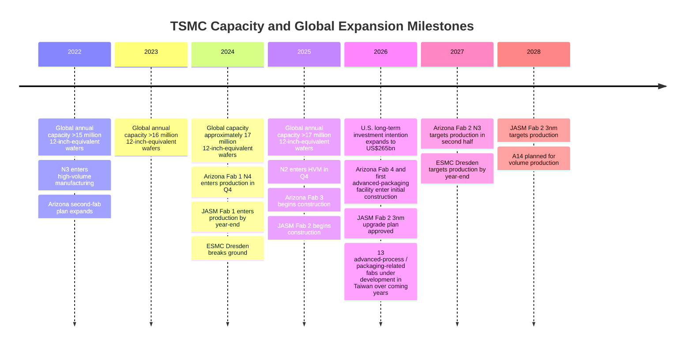
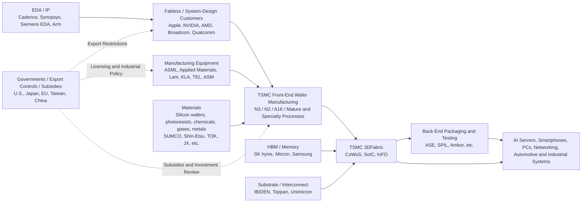

## Executive Summary

As of **August 11, 2026**, TSMC's strategic importance extends far beyond being merely the "world's largest semiconductor foundry." It is one of the few nodes in the global advanced-computing supply chain that simultaneously possesses **leading-edge logic-process technology, ultra-large-scale mass-production capability, advanced-packaging integration capability, and a cross-customer ecosystem**. TrendForce statistics show that in the first quarter of 2026, TSMC held approximately **72% of global foundry revenue**, far ahead of Samsung Foundry at 6.5% and SMIC at 5.1%. TSMC itself disclosed that the global manufacturing capacity it managed in 2025 exceeded **17 million 12-inch-equivalent wafers per year**. [TrendForce](https://www.trendforce.com/presscenter/news/20260612-13095.html) [TSMC Investor Relations](https://investor.tsmc.com/english)

Technologically, TSMC's moat has expanded from simple "process-node leadership" into **joint leadership across process technology, packaging, and ecosystem integration**. N2 entered high-volume manufacturing in the fourth quarter of 2025 using nanosheet GAA transistors; A16 introduces the Super Power Rail backside power-delivery concept; A14 is planned for volume production in 2028; meanwhile, CoWoS, SoIC, and 3DFabric mean that chip-performance gains no longer depend solely on transistor scaling. TSMC's 2026 technology roadmap further pushes CoWoS toward approximately **14× reticle size**, enabling the integration of multiple large compute dies and more HBM. [TSMC 2025 Annual Report](https://investor.tsmc.com/static/annualReports/2025/english/index.html) [TSMC A16](https://www.tsmc.com/english/dedicatedFoundry/technology/logic/l_A16) [TSMC A14](https://pr.tsmc.com/english/news/3228) [TSMC 3DFabric](https://3dfabric.tsmc.com/english/dedicatedFoundry/technology/3DFabric.htm)

However, the true source of the "silicon shield" is not any single semiconductor fab. It is a **system of interdependence that is extremely difficult to replicate quickly**: U.S. fabless chip designers, Dutch lithography supplier ASML, Japanese materials companies, U.S. and Japanese semiconductor-equipment vendors, EDA/IP providers, Korean memory suppliers, and Taiwan's packaging, substrate, and engineering-talent ecosystem together form an intensely specialized network. ASML describes EUV as a technology unique to the company, while TSMC's published supplier and 3DFabric Alliance lists include ASML, Applied Materials, Lam Research, KLA, Tokyo Electron, Shin-Etsu, SUMCO, Cadence, Synopsys, Arm, Micron, Samsung, SK hynix, ASE, Amkor, IBIDEN, Unimicron, and others. This means that even controlling the physical assets of a fab would not be equivalent to independently sustaining advanced semiconductor manufacturing. [ASML](https://www.asml.com/technology/lithography-principles/light-and-lasers) [TSMC Supplier Awards](https://pr.tsmc.com/english/news/3192) [TSMC 3DFabric Alliance](https://www.tsmc.com/english/dedicatedFoundry/oip/3dfabric_alliance)

Geographic diversification is changing the nature of the silicon shield, but it has not eliminated Taiwan's centrality. In 2026, TSMC stated that it was simultaneously building **13 advanced-process and advanced-packaging-related fabs in Taiwan over the coming years**. At the same time, its long-term investment intention in Arizona has expanded to **US$265 billion**, the second Kumamoto fab in Japan has been upgraded to 3 nm, and the Dresden fab in Germany is focused on 12/16 nm and 22/28 nm processes. [TSMC Q2 2026 Transcript](https://investor.tsmc.com/chinese/encrypt/files/encrypt_file/reports/2026-07/547d1696765e05ce3adb81c108ce1c8c1682b80c/TSMC%202Q26%20Transcript.pdf) [Japan METI](https://www.meti.go.jp/english/speeches/press_conferences/2026/0403001.html) [TSMC ESMC](https://pr.tsmc.com/english/news/3169)

This creates a central policy paradox: **overseas diversification can reduce the global risk of a "single-island disruption," yet it can also reduce the economic deterrence incentive other countries derive from being highly dependent on Taiwan.**

Accordingly, the core conclusion of this report is: **the silicon shield is a valuable deterrence premium, not a security guarantee.** RAND's semiconductor supply-chain wargaming finds that losing Taiwan's advanced semiconductor supply would be difficult to replace in the short term and would impose lasting economic costs on the United States and its allies. However, a 2025 peer-reviewed study examining blockade and isolation scenarios concludes that Taiwan's semiconductor ecosystem remains highly vulnerable until comprehensive substitute capacity is established. Other international-relations research likewise indicates that the credibility of U.S. security commitments depends primarily on alignment of interests and domestic political factors, rather than on any single economic asset automatically translating into military intervention. [RAND](https://www.rand.org/pubs/research_reports/RRA2354-1.html) [Telecommunications Policy](https://ideas.repec.org/a/eee/telpol/v49y2025i4s0308596125000485.html) [International Relations of the Asia-Pacific](https://academic.oup.com/irap/advance-article-pdf/doi/10.1093/irap/lcae017/61023981/lcae017.pdf)

For Taiwan, therefore, the optimal strategy is neither to "lock all semiconductor manufacturing inside Taiwan" nor to allow the most advanced capabilities to migrate abroad without limits. Instead, it is to establish **"distributed indispensability"**: build complementary capacity among allies sufficient to withstand localized disruptions, while Taiwan continues to control the first wave of R&D, production ramp-up, critical advanced packaging, process-integration talent, and the largest-scale manufacturing cluster. For the United States, Japan, and Europe, the goal should likewise shift from unrealistic semiconductor "self-sufficiency" toward **redundancy and interoperability within a trusted alliance network**. For TSMC's customers, supply-chain resilience must be elevated from a procurement issue into a chip-architecture and packaging-design issue. These are analytical inferences derived from the supply-chain and risk evidence discussed below. [RAND](https://www.rand.org/pubs/research_reports/RRA2354-1.html) [CSIS](https://www.csis.org/analysis/silicon-island-assessing-taiwans-importance-us-economic-growth-and-security) [Semiconductor Supply-Chain Resilience Review](https://www.tandfonline.com/doi/full/10.1080/00207543.2024.2387074)

---

## Technology Leadership, Capacity, and the Global Manufacturing Footprint

TSMC's leadership is not determined simply by the statement that "2 nm is smaller than 3 nm." Its competitive advantage can be divided into four layers: **process architecture, EUV patterning, yield and mass-production scale, and 3D/advanced packaging**. N7+ was among TSMC's first processes to introduce EUV into volume production; N5 substantially expanded EUV usage to reduce the complexity of multi-patterning; N3 entered high-volume manufacturing in 2022; and N2 entered HVM in the fourth quarter of 2025, formally transitioning TSMC from FinFETs to nanosheet GAA. [TSMC Advanced Technology](https://www.tsmc.com/english/dedicatedFoundry/technology/platform_smartphone_tech_advancedTech) [TSMC 5nm](https://www.tsmc.com/english/dedicatedFoundry/technology/logic/l_5nm) [TSMC 2025 Annual Report](https://investor.tsmc.com/static/annualReports/2025/english/index.html)

| Technology Generation | TSMC Public Status / Timeline | Strategic Significance |
|---|---|---|
| N7+ | Introduced EUV into volume production | EUV transitioned from an R&D tool into a commercial mass-production platform, beginning to reduce multi-patterning complexity in advanced layers. [TSMC](https://www.tsmc.com/english/dedicatedFoundry/technology/platform_smartphone_tech_advancedTech) |
| N5 | Entered volume production in 2020; more extensive EUV adoption | Established the mass-production foundation for advanced smartphone and HPC nodes. [TSMC 5nm](https://www.tsmc.com/english/dedicatedFoundry/technology/logic/l_5nm) |
| N3 | HVM in 2022; still accounted for 24% of full-year wafer revenue in 2025 | Demonstrates that advanced nodes are not merely technically manufacturable, but can generate extremely large-scale commercial revenue. [TSMC 2025 Annual Report](https://investor.tsmc.com/static/annualReports/2025/english/index.html) |
| N2 | Entered HVM in Q4 2025; nanosheet GAA | TSMC's first mass-produced GAA platform, extending into N2P and A16. [TSMC 2025 Annual Report](https://investor.tsmc.com/static/annualReports/2025/english/index.html) |
| A16 | Nanosheet paired with Super Power Rail backside power delivery | Separates the power-delivery network from front-side signal interconnects, especially targeting the performance and power-delivery requirements of HPC and AI. [TSMC A16](https://www.tsmc.com/english/dedicatedFoundry/technology/logic/l_A16) |
| A14 | Expected volume production in 2028; second-generation nanosheet | TSMC publicly estimates approximately 10–15% speed improvement or approximately 25–30% power reduction versus N2, together with greater logic density; actual product performance will still depend on design. [TSMC A14](https://pr.tsmc.com/english/news/3228) |
| 3DFabric / CoWoS / SoIC | Already core integration platforms for HPC and AI; 14-reticle-class CoWoS planned for 2028 | "Moore's Law" increasingly shifts from single-die scaling toward multi-die integration, HBM, chiplets, and 3D integration. [TSMC 3DFabric](https://3dfabric.tsmc.com/english/dedicatedFoundry/technology/3DFabric.htm) [TSMC](https://pr.tsmc.com/english/news/3302) |

The **complementary relationship between EUV and packaging** deserves particular emphasis. ASML's NXE systems already support advanced logic nodes such as 7 nm, 5 nm, and 3 nm; its EXE High-NA EUV platform targets generations below 2 nm. ASML also states that DUV and EUV will coexist for a long time. TSMC's equipment dependence therefore does not consist of merely "one EUV machine," but of hundreds of tightly coupled lithography, etching, thin-film, metrology, cleaning, and process-control steps. [ASML EUV](https://www.asml.com/products/euv-lithography-systems) [ASML DUV](https://www.asml.com/products/duv-lithography-systems)

In packaging, CoWoS derives its strategic importance for AI from the ability to place multiple logic dies and HBM within extremely large interposer/RDL structures; SoIC, meanwhile, pushes vertical die integration toward higher densities. This moves TSMC from being a "wafer-foundry supplier" toward becoming a **system-level manufacturing platform**, while also increasing customers' switching costs. Moving to another foundry no longer means merely reimplementing a PDK for a given process node; it may involve revalidating chiplets, HBM, substrates, thermal design, testing, and packaging architecture. [TSMC CoWoS](https://3dfabric.tsmc.com/english/dedicatedFoundry/technology/cowos.htm) [TSMC 3DFabric Alliance](https://www.tsmc.com/english/dedicatedFoundry/oip/3dfabric_alliance)

### Comparison of Major Manufacturing Locations

| Region / Major Site | Public Process and Status | Public Capacity Indicator | Expansion Direction |
|---|---|---|---|
| **Taiwan: Fab 12, 14, 15, 18, 20, 22, etc.** | From mature nodes through N3/N2; multi-phase N2 sites in Hsinchu and Kaohsiung | Six Taiwan 12-inch GIGAFABs together exceeded **13 million 12-inch-equivalent wafers/year** in 2025; global company capacity exceeded 17 million wafers. [TSMC GIGAFAB](https://www.tsmc.com/english/dedicatedFoundry/manufacturing/gigafab) [TSMC Investor Relations](https://investor.tsmc.com/english) | In 2026, the company stated it was building **13 advanced-process / advanced-packaging-related fabs** in Taiwan over the coming years; Taiwan remains the core of the largest-scale production and newest nodes. [TSMC Q2 2026 Transcript](https://investor.tsmc.com/chinese/encrypt/files/encrypt_file/reports/2026-07/547d1696765e05ce3adb81c108ce1c8c1682b80c/TSMC%202Q26%20Transcript.pdf) |
| **Arizona Fab 1** | N4; HVM in 2024 Q4 | Latest official pages do not disclose separate monthly capacity | Already in volume production; TSMC's first advanced-node mass-production base in the United States. [TSMC Arizona](https://www.tsmc.com/static/abouttsmcaz/index.htm) |
| **Arizona Fab 2** | N3 | Not separately disclosed | Fab structure completed in 2025; targeted for production in **the second half of 2027**. [TSMC Arizona](https://www.tsmc.com/static/abouttsmcaz/index.htm) |
| **Arizona Fab 3** | N2, A16 | Not separately disclosed | Construction began in 2025, with production targeted toward the end of the decade. [TSMC Arizona](https://www.tsmc.com/static/abouttsmcaz/index.htm) |
| **Subsequent Arizona fabs** | 2 nm and below; advanced packaging | Comparable monthly-capacity numbers have not yet been published | A fourth fab and the first advanced-packaging facility entered initial construction in early 2026; total long-term U.S. investment intention has expanded to approximately **US$265bn**. [TSMC Arizona](https://www.tsmc.com/static/abouttsmcaz/index.htm) [TSMC Q2 2026 Transcript](https://investor.tsmc.com/chinese/encrypt/files/encrypt_file/reports/2026-07/547d1696765e05ce3adb81c108ce1c8c1682b80c/TSMC%202Q26%20Transcript.pdf) |
| **JASM Kumamoto Fab 1** | 40 nm, 22/28 nm, 12/16 nm, etc.; volume production by end-2024 | Original 2024 two-fab plan called for combined capacity of **>100,000 12-inch wafers/month** | Forms a localized supply chain with Sony, Denso, and other Japanese ecosystem participants. Total two-fab capacity should be reassessed after redesign of Fab 2. [TSMC JASM](https://pr.tsmc.com/english/news/3105) |
| **JASM Kumamoto Fab 2** | Planned upgrade to **3 nm** in 2026 | Final comparable monthly capacity under the new plan has not yet been announced | Taiwan's competent authority approved the related upgrade on March 31, 2026; Japan's METI has indicated a 2028 production target. [Japan METI](https://www.meti.go.jp/english/speeches/press_conferences/2026/0403001.html) |
| **ESMC Dresden** | 28/22 nm planar; 16/12 nm FinFET | **40,000 300mm wafers/month**, or approximately 480,000/year | Production targeted for late 2027 and full capacity around 2029; TSMC owns 70%, while Bosch, Infineon, and NXP each own 10%. [TSMC ESMC](https://pr.tsmc.com/english/news/3169) [European Commission](https://digital-strategy.ec.europa.eu/en/news/commission-approves-eu5-billion-german-state-aid-measure-support-esmc-setting-new-semiconductor) |
| **Nanjing** | TSMC wholly owned 12-inch fab | Company does not separate the latest monthly capacity on its current global-capacity page | Remains a manufacturing base in mainland China, but equipment upgrades and capacity expansion face an increasingly complex U.S. export-license environment. [TSMC Company Profile](https://www.tsmc.com/english/aboutTSMC/company_profile) [U.S. BIS](https://www.bis.gov/press-release/bis-updated-public-information-page-export-controls-imposed-advanced-computing-semiconductor) |

TSMC also operates more mature-generation manufacturing locations in Shanghai and Washington/Camas in the United States. From the perspective of the "silicon shield," however, the principal variables determining the vulnerability of global advanced computing remain Taiwan's GIGAFAB cluster, Arizona's advanced nodes, and the pace of domestic advanced-packaging expansion in Taiwan. [TSMC Fabs](https://www.tsmc.com/english/aboutTSMC/TSMC_Fabs) [TSMC Company Profile](https://www.tsmc.com/english/aboutTSMC/company_profile)

The timeline below places "aggregate capacity growth" and major overseas fab expansion on the same scale. Historical global annual-capacity figures are TSMC's disclosed 12-inch-equivalent capacity and do not imply that all such capacity consists of advanced nodes. [TSMC 2022 Annual Report](https://investor.tsmc.com/static/annualReports/2022/english/index.html) [TSMC 2023 Annual Report](https://investor.tsmc.com/static/annualReports/2023/english/index.html) [TSMC 2024 Annual Report](https://investor.tsmc.com/static/annualReports/2024/english/index.html) [TSMC Investor Relations](https://investor.tsmc.com/english)

This footprint reveals a fact easily overlooked by the narrative that "building fabs in the United States equals hollowing out Taiwan": **the absolute dollar value of overseas expansion is enormous, but Taiwan's installed scale, R&D density, and simultaneously expanding advanced capacity are even larger.** In 2025, Taiwan's six 12-inch GIGAFABs alone exceeded 13 million wafers of equivalent annual capacity, while the ultimate individual monthly capacities of Arizona's advanced fabs have not all been publicly disclosed. Therefore, at least within this decade, a more reasonable interpretation of overseas fabs is "critical redundancy and local customer service," not full replication of Taiwan's ecosystem. This is an inference based on publicly available capacity and construction progress. [TSMC GIGAFAB](https://www.tsmc.com/english/dedicatedFoundry/manufacturing/gigafab) [TSMC Arizona](https://www.tsmc.com/static/abouttsmcaz/index.htm) [TSMC Q2 2026 Transcript](https://investor.tsmc.com/chinese/encrypt/files/encrypt_file/reports/2026-07/547d1696765e05ce3adb81c108ce1c8c1682b80c/TSMC%202Q26%20Transcript.pdf)

---

## Customers, Competitors, and Supply-Chain Dependencies

TSMC's business model is itself a strategic asset. Unlike IDMs such as Intel and Samsung, which also operate their own semiconductor-product businesses, TSMC centers its strategy on a pure-play foundry model in which it **does not compete with its customers**. In 2025, TSMC manufactured 12,682 products for **534 customers** using 305 process technologies. [TSMC Q2 2026 Earnings Release](https://investor.tsmc.com/english/encrypt/files/encrypt_file/reports/2026-07/a80d7933be643644081584087731f73b22ea5a2c/2Q26%20EarningsRelease.pdf)

This scale generates two reinforcing feedback loops: the more customers TSMC serves, the richer its process learning and IP/EDA ecosystem become; the richer the ecosystem becomes, the lower the risk and time required to onboard additional customers.

TSMC does not publish a complete "customer revenue ranking," so treating specific customer-revenue shares or process-node allocations as exact facts would not be rigorous. In its 2025 Arizona expansion announcement, the company explicitly listed **Apple, NVIDIA, AMD, Broadcom, and Qualcomm** as representative leading U.S. customers. These five companies span mobile computing, CPUs/GPUs, AI acceleration, networking, and custom computing, reflecting TSMC's high exposure to the U.S. fabless and system-design ecosystem. [TSMC](https://pr.tsmc.com/english/news/3210)

| Customer / Demand Side | Publicly Confirmable Information | Strategic Implication for TSMC |
|---|---|---|
| Apple, NVIDIA, AMD, Broadcom, Qualcomm | Directly identified by TSMC as major U.S. customers in its 2025 Arizona investment announcement. [TSMC](https://pr.tsmc.com/english/news/3210) | High-end smart-device and AI/HPC customers jointly drive capital-intensive capabilities such as N3/N2 and CoWoS, while also increasing the influence of U.S. customer and policy cycles on TSMC. |
| Other global customers | TSMC served 534 customers and produced 12,682 products in 2025. [TSMC Q2 2026 Earnings Release](https://investor.tsmc.com/english/encrypt/files/encrypt_file/reports/2026-07/a80d7933be643644081584087731f73b22ea5a2c/2Q26%20EarningsRelease.pdf) | The long tail of mature- and specialty-process customers reduces dependence on any single end market and demonstrates that TSMC is not merely "an AI-chip factory." |

### Major Competitors

TrendForce's 2026 Q1 figures are particularly useful for illustrating the competitive structure: TSMC 72%, Samsung 6.5%, SMIC 5.1%, UMC 3.9%, and GlobalFoundries 3.3%. The gap among the top three is no longer the structure of a conventional market in which "first place narrowly beats second." Rather, TSMC has established a substantial discontinuity in revenue, advanced-node capability, and customer scale. [TrendForce](https://www.trendforce.com/presscenter/news/20260612-13095.html)

| Company | 2026 Q1 Foundry Revenue Share* | Technology Position | Main Advantages / Constraints Relative to TSMC |
|---|---:|---|---|
| **TSMC** | **72.0%** | N2 entered HVM in Q4 2025; A16/A14 follow; deeply integrated CoWoS and SoIC | Strongest scale, customer neutrality, ecosystem, and mass-production learning curve; weaknesses are geographic concentration in Taiwan and higher overseas-manufacturing cost. [TrendForce](https://www.trendforce.com/presscenter/news/20260612-13095.html) [TSMC 2025 Annual Report](https://investor.tsmc.com/static/annualReports/2025/english/index.html) |
| **Samsung Foundry** | **6.5%** | Samsung introduced 3 nm GAA in 2022; its official roadmap continues toward GAA platforms such as SF2 | Advantages include memory, logic, and packaging within the same group; however, foundry market share and external-customer scale remain far below TSMC. Samsung's published node roadmap cannot be equated with actual production yield or sellable capacity. [TrendForce](https://www.trendforce.com/presscenter/news/20260612-13095.html) [Samsung](https://news.samsung.com/global/samsung-showcases-ai-era-vision-and-latest-foundry-technologies-at-sff-2024) |
| **SMIC** | **5.1%** | Important base in China's domestic market and mature / relatively mature process scale | Domestic Chinese demand, policy support, and high utilization are advantages, but access to advanced manufacturing equipment is constrained by the U.S. and allied export-control environment. [TrendForce](https://www.trendforce.com/presscenter/news/20260612-13095.html) [U.S. BIS](https://www.bis.gov/press-release/bis-updated-public-information-page-export-controls-imposed-advanced-computing-semiconductor) |
| **Intel Foundry** | Not directly comparable with TrendForce pure-foundry market share | Intel 18A entered production in 2025 using RibbonFET + PowerVia; 18A-P entered risk-production stage in 2026 | U.S.-based advanced manufacturing, backside power, and advanced logic technologies have strategic value, but Intel remains an IDM, so financial reporting across internal product manufacturing and external foundry business differs from pure-play foundries. [Intel 18A](https://www.intel.com/content/www/us/en/foundry/process/18a.html) [Intel](https://newsroom.intel.com/intel-foundry/intel-foundry-details-process-milestones-future-innovation-at-vlsi-symposium) |

\* Market share is estimated by TrendForce based on foundry revenue. It is **not** a measure of all global semiconductor manufacturing capacity and therefore must not be interpreted as meaning that "TSMC produces 72% of all chips in the world." [TrendForce](https://www.trendforce.com/presscenter/news/20260612-13095.html)

### Supply-Chain Dependencies

TSMC's greatest vulnerability and greatest moat are the same thing: **highly specialized international division of labor**. TSMC's own published supplier awards and alliance materials are sufficient to demonstrate that no single country fully vertically integrates the most advanced semiconductor-manufacturing stack.

Representative equipment suppliers include ASML, Applied Materials, ASM, Lam Research, KLA, and Tokyo Electron. Materials suppliers include Shin-Etsu Chemical, SUMCO, Tokyo Ohka, and JX Advanced Metals. The 3DFabric ecosystem additionally brings Cadence, Synopsys, Siemens EDA, Arm, Micron, Samsung, SK hynix, ASE, SPIL, Amkor, IBIDEN, Toppan, Unimicron, and others into the same ecosystem. [TSMC Supplier Awards](https://pr.tsmc.com/english/news/3192) [TSMC 3DFabric Alliance](https://www.tsmc.com/english/dedicatedFoundry/oip/3dfabric_alliance)

This diagram also explains why "logistics" cannot be understood simply as shipping finished chips out of Taiwan. Actual logistics include importing ultra-high-value equipment and spare parts; maintaining stable supplies of specialty chemicals and wafer materials; moving wafers, chiplets, HBM, and substrates between different manufacturing stages; and enabling equipment-vendor engineers to provide cross-border service.

TSMC itself lists **supply-chain disruption, geopolitics, water shortages, electricity shortages, critical-facility failures, and cyberattacks** among the significant risks that could interrupt operations. [TSMC Risk Management](https://investor.tsmc.com/english/risk-management)

The most obvious single-point dependency is EUV. ASML states that EUV lithography is proprietary to the company; its NXE systems are important production platforms for advanced layers at 7/5/3 nm, while High-NA EXE extends toward generations below 2 nm. In other words, an advanced fab is not an "ordinary factory" capable of operating indefinitely without original-equipment-manufacturer service, light sources, optics, metrology software, and spare parts. [ASML](https://www.asml.com/technology/lithography-principles/light-and-lasers) [ASML EUV](https://www.asml.com/products/euv-lithography-systems)

This also exposes the fundamental flaw in the simplified argument that "militarily occupying Taiwan would mean acquiring TSMC": **physical control of a fab is not equivalent to sustainable advanced-process production capability.** If global EDA/IP, equipment spare parts, materials, HBM, engineering services, and export-license chains are simultaneously severed, operating capability would rapidly become constrained. This conclusion is derived from the supply-chain structure above rather than from any claim about a specific wartime "remote shutdown" mechanism. [TSMC 3DFabric Alliance](https://www.tsmc.com/english/dedicatedFoundry/oip/3dfabric_alliance) [ASML](https://www.asml.com/technology/lithography-principles/light-and-lasers) [U.S. BIS](https://www.bis.gov/press-release/bis-updated-public-information-page-export-controls-imposed-advanced-computing-semiconductor)

---

## Geopolitics and the Effective Limits of the "Silicon Shield"

The basic logic of the **silicon shield** has two layers.

The first is **cost deterrence**: any conflict that causes a prolonged interruption of Taiwan's advanced semiconductor supply would damage China, the United States, Japan, Europe, and the global electronics industry, thereby increasing the economic cost of using military force.

The second is **interest alignment**: because the United States and its allies depend heavily on Taiwan, in theory this increases their incentive to preserve peace across the Taiwan Strait.

Relevant research generally recognizes Taiwan's global indispensability in advanced semiconductors but strongly disagrees over whether this is sufficient to generate reliable military deterrence. [RAND](https://www.rand.org/pubs/research_reports/RRA2354-1.html) [Aoyama](https://www.degruyterbrill.com/document/doi/10.1515/zfw-2024-0046/html?srsltid=AfmBOoox-Qwgz7czUsewYX-aVVosIz9Ju8Bo2jgiX8NkB0OF4yu53rZX)

A 2023 RAND tabletop study of the advanced-semiconductor supply chain found that if Taiwan's supply were lost, the United States and its allies would require considerable time and cost to establish replacement capacity. It recommended allied cooperation and partial geographic diversification to reduce concentration risk. [RAND](https://www.rand.org/pubs/research_reports/RRA2354-1.html)

On the other hand, a 2025 study published in *Telecommunications Policy* argues that if Beijing chose an economic or maritime "quarantine" rather than an immediate full-scale invasion, Taiwan's semiconductor ecosystem could be particularly vulnerable before adequate substitute capacity and inventory buffers had been established. [ScienceDirect](https://www.sciencedirect.com/science/article/abs/pii/S0308596125000485) [IDEAS/RePEc](https://ideas.repec.org/a/eee/telpol/v49y2025i4s0308596125000485.html)

This suggests that the silicon shield may be most effective at increasing the cost of **full-scale destructive warfare**, but not necessarily equally effective against gray-zone pressure, isolation, blockade, cyberattacks, or limited coercion.

More importantly, economic importance and military commitment are not synonymous. A 2025 empirical study in *International Relations of the Asia-Pacific* shows that, in the Taiwan case, perceptions of the credibility of U.S. commitments depend substantially on **alignment of interests, formal security arrangements, U.S. military deployments, and U.S. domestic politics**. Therefore, there is insufficient evidence to treat TSMC itself as an "insurance policy" that automatically triggers U.S. military intervention. [International Relations of the Asia-Pacific](https://academic.oup.com/irap/advance-article-pdf/doi/10.1093/irap/lcae017/61023981/lcae017.pdf)

### U.S. Policy: Subsidies and Controls Operating Simultaneously

The U.S. semiconductor strategy effectively operates along two parallel axes.

The first is the **positive supply-side policy** of the CHIPS Act, using subsidies, loans, and tax incentives to encourage advanced manufacturing in the United States. TSMC's original Arizona package received up to approximately **US$6.6 billion in direct grants** and up to approximately **US$5 billion in loan support**. [U.S. Department of Commerce](https://www.commerce.gov/news/press-releases/2024/11/biden-harris-administration-announces-chips-incentives-award-tsmc)

During 2025–2026, TSMC further increased its long-term U.S. investment intention, and by 2026 the official Arizona roadmap included N4, N3, N2/A16, and advanced packaging. [TSMC Arizona](https://www.tsmc.com/static/abouttsmcaz/index.htm) [TSMC Q2 2026 Transcript](https://investor.tsmc.com/chinese/encrypt/files/encrypt_file/reports/2026-07/547d1696765e05ce3adb81c108ce1c8c1682b80c/TSMC%202Q26%20Transcript.pdf)

The second axis is a **technology-denial policy** toward China. Since 2022, the U.S. Department of Commerce's Bureau of Industry and Security has tightened export controls covering advanced-computing chips, semiconductor-manufacturing equipment, and certain support activities by U.S. persons. Between 2023 and 2025, it continued expanding equipment restrictions, Entity List coverage, and foundry due-diligence requirements. [U.S. BIS](https://www.bis.gov/press-release/bis-updated-public-information-page-export-controls-imposed-advanced-computing-semiconductor) [U.S. BIS Foundry Due Diligence](https://www.bis.gov/press-release/commerce-strengthens-restrictions-advanced-computing-semiconductors-enhance-foundry-due-diligence-prevent) [U.S. BIS](https://www.bis.gov/press-release/commerce-further-restricts-chinas-artificial-intelligence-advanced-computing-capabilities)

In 2026, licensing for some AI accelerators to China shifted again toward "case-by-case" review when conditions were met, illustrating that U.S. policy is not a one-directional, permanently fixed embargo, but a regime adjusted according to security, commercial, and diplomatic objectives. [U.S. BIS](https://www.bis.gov/press-release/department-commerce-revises-license-review-policy-semiconductors-exported-china)

For TSMC, this produces a dual effect. On one hand, limiting China's ability to catch up in advanced processes can prolong TSMC's relative technological advantage. On the other, TSMC must bear increasing burdens related to customer screening, end use, ECCN classification, equipment licensing, and operational risks at its China facilities.

TSMC's 2025 annual report explains that its export-compliance controls include procedures such as **"No ECCN, No Shipment,"** demonstrating how export controls have moved from government foreign policy directly into the daily order-acceptance processes of a semiconductor foundry. [TSMC 2025 Annual Report](https://investor.tsmc.com/static/annualReports/2025/english/pdf/2025_tsmc_ar_e_ch3.pdf)

### Chinese Policy and Countermeasure Capacity

China's strategy in the global semiconductor value chain simultaneously has the characteristics of **domestic substitution and asymmetric countermeasures**.

Research by Grimes and Du in 2024 argues that the global semiconductor value chain features highly asymmetric interdependence: the United States occupies upstream advantages in design, IP, and parts of the equipment industry; China has rapidly expanded in electronics manufacturing, market scale, and some mature segments; while advanced manufacturing and equipment bottlenecks remain highly concentrated. [Area Development and Policy](https://www.tandfonline.com/doi/full/10.1080/23792949.2024.2397973)

SMIC already accounted for approximately 5.1% of global foundry revenue in 2026 Q1, ranking third. This shows that the proposition that "China has been completely excluded from the semiconductor supply chain" does not match reality. The real competitive issue is the **speed of access to advanced nodes, advanced equipment, and high-end AI computing capabilities**. [TrendForce](https://www.trendforce.com/presscenter/news/20260612-13095.html)

Beijing has also used control over upstream materials as a countermeasure. Since 2023, China's Ministry of Commerce has implemented export licensing on gallium- and germanium-related items, demonstrating that the United States is not the only country capable of "weaponizing" supply chains.

These materials are not equivalent to single critical raw materials for TSMC's silicon-based advanced logic processes, but they are strategically significant for compound semiconductors, optoelectronics, radio frequency, and the broader electronics industry. Their policy significance therefore lies in China's ability to raise external supply-chain costs from the materials side as well. [China Ministry of Commerce](https://exportcontrol.mofcom.gov.cn/article/zjsj/202307/869.html) [MOFCOM](https://www.mofcom.gov.cn/xwfbzt/2023/swbzklxxwfbh2023n7y6rfb/index.html)

### The "Silicon Shield Paradox"

TSMC's investments in the United States, Japan, and Europe produce two apparently contradictory but actually coexisting outcomes.

**Global supply-chain resilience increases.** If Taiwan experiences an earthquake, blockade, or another localized disruption, the United States, Japan, and Europe have more alternative capacity. Overseas fabs can also encourage localization of equipment, materials, and engineering services. RAND's recommendations and U.S., Japanese, and European policies all explicitly move in this direction. [RAND](https://www.rand.org/pubs/research_reports/RRA2354-1.html) [European Commission](https://digital-strategy.ec.europa.eu/en/news/commission-approves-eu5-billion-german-state-aid-measure-support-esmc-setting-new-semiconductor) [TSMC Arizona](https://www.tsmc.com/static/abouttsmcaz/index.htm)

**Taiwan's "monopolistic indispensability" declines somewhat.** Arizona will ultimately possess N2/A16 and potentially even more advanced capabilities, while Japan will also host 3 nm manufacturing. Therefore, U.S. and Japanese companies may have a larger buffer against short-term disruptions in Taiwan than they did in the early 2020s. [TSMC Arizona](https://www.tsmc.com/static/abouttsmcaz/index.htm) [Japan METI](https://www.meti.go.jp/english/speeches/press_conferences/2026/0403001.html)

But this does not mean the silicon shield disappears.

Advanced-process manufacturing cannot be replicated merely by copying buildings and equipment. R&D, first-wave production ramp-up, engineer learning curves, materials tuning, advanced packaging, supplier density, and hundreds of customers jointly create Taiwan's clustering advantage. A 2025 CSIS assessment similarly argues that even as Western countries pursue reshoring, completely reconstructing Taiwan's current density of talent, infrastructure, and capital equipment is unrealistic in the short term. [CSIS](https://www.csis.org/analysis/silicon-island-assessing-taiwans-importance-us-economic-growth-and-security)

A more precise description is therefore:

**The silicon shield is transforming from "the world can obtain advanced chips only from Taiwan" into "the world still depends on a Taiwan-led transnational semiconductor network."**

The physical concentration of the former is decreasing. The institutional, human-capital, and ecosystem centrality of the latter remains extremely high in the near term.

---

## Economic Impact on Taiwan and the Global Reorganization of Investment

TSMC's impact on Taiwan's economy first appears through **scale and the investment cycle**.

In 2025, TSMC's consolidated revenue reached **NT$3.809 trillion**, net income was approximately **NT$1.715 trillion**, and its global workforce exceeded **90,000 employees** at year-end. [TSMC 2025 Annual Report](https://investor.tsmc.com/static/annualReports/2025/english/index.html)

However, one point must be emphasized: **TSMC's revenue cannot simply be divided by Taiwan's GDP and then labeled "TSMC's contribution to GDP."**

GDP measures domestic value added, while corporate revenue includes materials, depreciation, intermediate inputs, and activities of overseas subsidiaries. The accounting concepts are different. Rigorous analysis should estimate the contribution using industrial value added, input-output tables, and national-income accounts rather than a revenue/GDP ratio.

Even without making this incorrect calculation, official macroeconomic statistics clearly show that semiconductors and AI manufacturing are currently key drivers of Taiwan's business cycle.

Taiwan's Directorate-General of Budget, Accounting and Statistics revised 2025 real GDP growth to **8.76%**, while its May 2026 full-year forecast for 2026 was **9.64%**. Taiwan's real GDP grew **14.55% year over year in the first quarter of 2026**, while real exports of goods and services grew 35.76%. Official statistics explicitly identified external demand for AI and related infrastructure as a major driver. [Taiwan DGBAS](https://www.stat.gov.tw/Point.aspx?n=3580&sid=t.1&sms=11480) [DGBAS English](https://eng.stat.gov.tw/News_Content.aspx?n=2317&s=236299)

Manufacturing growth over the same period was also driven mainly by semiconductors, computers, electronics, and optical products. [DGBAS](https://eng.stat.gov.tw/News_Content.aspx?n=2317&s=236299)

The investment effect may be even more structurally important than direct output.

TSMC increased its 2026 capital-expenditure budget to **US$60–64 billion**, of which approximately 70–80% is allocated to advanced process technologies, approximately 10% to specialty technologies, and approximately 10–20% to advanced packaging, testing, mask-making, and related areas. [TSMC Q2 2026 Transcript](https://investor.tsmc.com/chinese/encrypt/files/encrypt_file/reports/2026-07/547d1696765e05ce3adb81c108ce1c8c1682b80c/TSMC%202Q26%20Transcript.pdf)

This level of capital intensity stimulates domestic investment in fab engineering, equipment, specialty gases, chemicals, substrates, packaging and testing, electricity, and water-treatment infrastructure. TSMC's economic influence therefore extends far beyond its number of direct employees.

At the same time, overseas expansion is gradually "globalizing" capital formation that was previously highly concentrated in Taiwan. The major policy-oriented investments can currently be summarized as follows:

| Investment Location | Corporate Investment / Plan Scale | Public-Policy Support | Economic Significance |
|---|---:|---|---|
| **Taiwan** | Of TSMC's 2026 global CapEx of US$60–64bn, most advanced-process investment remains closely connected to Taiwan expansion; 13 advanced-process / packaging-related fabs are planned over the coming years. [TSMC Q2 2026 Transcript](https://investor.tsmc.com/chinese/encrypt/files/encrypt_file/reports/2026-07/547d1696765e05ce3adb81c108ce1c8c1682b80c/TSMC%202Q26%20Transcript.pdf) | Science parks, water and power infrastructure, talent, and R&D ecosystem | Preserves the R&D and largest-scale manufacturing cluster and remains the economic and strategic center. |
| **United States** | Long-term Arizona investment intention approximately **US$265bn**; this is a multi-year announced/planned total, not completed 2026 FDI. [TSMC Q2 2026 Transcript](https://investor.tsmc.com/chinese/encrypt/files/encrypt_file/reports/2026-07/547d1696765e05ce3adb81c108ce1c8c1682b80c/TSMC%202Q26%20Transcript.pdf) | Original package included up to US$6.6bn in CHIPS grants and up to US$5bn in loans. [U.S. Department of Commerce](https://www.commerce.gov/news/press-releases/2024/11/biden-harris-administration-announces-chips-incentives-award-tsmc) | Gives the United States advanced-logic plus advanced-packaging redundancy; places TSMC closer to its largest group of high-end customers. |
| **Japan** | Two Kumamoto fabs; original 2024 plan called for total monthly capacity >100,000 wafers, while Fab 2 was later changed to 3 nm. [TSMC JASM](https://pr.tsmc.com/english/news/3105) [Japan METI](https://www.meti.go.jp/english/speeches/press_conferences/2026/0403001.html) | Japan's government had established a support framework of up to approximately **¥732bn** for the second fab. [Japan METI](https://www.meti.go.jp/english/speeches/press_conferences/2026/0210001.html) | Integrates with Japan's materials, equipment, automotive, and image-sensor ecosystems. |
| **Germany** | ESMC total investment exceeds **€10bn**, with 40,000 300mm wafers/month. [TSMC ESMC](https://pr.tsmc.com/english/news/3169) | EU approved up to **€5bn** in German state aid. [European Commission](https://digital-strategy.ec.europa.eu/en/news/commission-approves-eu5-billion-german-state-aid-measure-support-esmc-setting-new-semiconductor) | Focus is not on the smallest process node, but on strengthening Europe's automotive and industrial semiconductor supply. |

This wave of reshoring and friend-shoring is not free.

TSMC management estimated in 2026 that overseas fabs would initially dilute gross margin by approximately 2–3 percentage points, potentially increasing later to approximately **3–4 percentage points**. [TSMC Q2 2026 Transcript](https://investor.tsmc.com/chinese/encrypt/files/encrypt_file/reports/2026-07/547d1696765e05ce3adb81c108ce1c8c1682b80c/TSMC%202Q26%20Transcript.pdf)

In other words, globalized fab construction is fundamentally a form of **buying geopolitical insurance at a higher unit cost**. If the value added of AI/HPC remains sufficiently high, that insurance may be worth paying for. But if the industry cycle reverses or utilization falls, the higher overseas cost structure will more visibly erode profitability.

In employment terms, TSMC directly employed more than 90,000 people globally at the end of 2025, while official Arizona materials indicate that the first three fabs alone are planned to create approximately 6,000 direct high-tech jobs. [TSMC 2025 Annual Report](https://investor.tsmc.com/static/annualReports/2025/english/index.html) [TSMC Arizona](https://www.tsmc.com/static/abouttsmcaz/index.htm)

However, the latest official public sources gathered for this research do not break out **TSMC's Taiwan-based employee count at the end of 2025 using a directly comparable definition**. It would therefore be inappropriate to fabricate a precise number for "TSMC employment in Taiwan."

Even more difficult to quantify is indirect employment generated through equipment suppliers, construction, materials, logistics, and induced consumption. Estimating that would require an up-to-date input-output model, and currently available public sources do not provide a directly comparable TSMC-specific 2026 multiplier.

---

## Risk Scenarios, Resilience, and Stakeholder Recommendations

The "relative likelihood" rankings below are analytical scenario rankings used in this report. **They are not numerical probability forecasts of cross-Strait conflict or natural disasters.**

| Risk Scenario | Relative Likelihood | Systemic Impact | Key Transmission Mechanism | Priority Resilience Measures |
|---|---|---|---|---|
| **Earthquake, water shortage, power shortage, critical-infrastructure failure** | Medium-high | Medium to high | Fab-utility disruption, scrapping of wafers in process, equipment recalibration. TSMC itself identifies earthquakes, water/power shortages, and critical-equipment failures as major operational risks. The January 21, 2025 earthquake caused no structural fab damage but still resulted in some wafer scrap. [TSMC Risk Management](https://investor.tsmc.com/english/risk-management) [TSMC](https://pr.tsmc.com/english/news/3204) | Strengthen diversified power sources, water storage and reclaimed water, automatic post-earthquake calibration, critical spare parts, and cross-fab restart drills. |
| **Maritime quarantine / blockade-type Taiwan Strait crisis** | Medium-low but non-negligible | **Extremely high** | Even if fabs are physically intact, materials, equipment parts, engineers, outbound logistics, and customer receipts may be disrupted. A 2025 peer-reviewed study specifically identifies quarantine as an important coercion scenario. [Telecommunications Policy](https://ideas.repec.org/a/eee/telpol/v49y2025i4s0308596125000485.html) | Allied coordination of sea/air logistics, inventories of critical raw materials and spare parts, cross-border BCP, and overseas "minimum viable" advanced manufacturing and packaging capacity. |
| **Full-scale military conflict** | Relatively lower, maximum consequence | **Catastrophic** | Electricity, water, logistics, talent, equipment maintenance, and international supply chains fail simultaneously; this cannot be solved simply by stockpiling. RAND concludes that replacing Taiwan's advanced supply would require years and enormous cost. [RAND](https://www.rand.org/pubs/research_reports/RRA2354-1.html) | Deterrence and crisis management take priority over post-conflict recovery; overseas capacity can reduce the global impact but cannot fully replace Taiwan in the short term. |
| **Export controls / further fragmentation of technology blocs** | **High, and already occurring** | Medium-high | Customer eligibility, Nanjing equipment licenses, EDA/IP, and AI-chip end use can all be affected by rule changes. [U.S. BIS](https://www.bis.gov/press-release/bis-updated-public-information-page-export-controls-imposed-advanced-computing-semiconductor) [U.S. BIS Foundry Due Diligence](https://www.bis.gov/press-release/commerce-strengthens-restrictions-advanced-computing-semiconductors-enhance-foundry-due-diligence-prevent) | Multinational compliance teams, real-time end-use screening, policy scenario stress testing, and greater coordination of rules among allies to reduce sudden policy-driven supply disruptions. |
| **EUV / equipment / materials single-point supply interruption** | Medium-low | High for advanced nodes | EUV technology is highly concentrated at ASML; other equipment categories are also dominated by a small number of U.S., Japanese, and European suppliers. [ASML](https://www.asml.com/technology/lithography-principles/light-and-lasers) [TSMC Supplier Awards](https://pr.tsmc.com/english/news/3192) | Critical-parts inventory, geographically distributed service teams, qualification of alternative suppliers, and supplier localization rather than simply stockpiling finished chips. |
| **Overseas fab execution and cost overruns** | Medium-high | Medium | Differences in cross-border talent, regulation, construction, and supplier maturity increase costs; TSMC already expects overseas fabs to pressure gross margin by roughly 3–4 percentage points. [TSMC Q2 2026 Transcript](https://investor.tsmc.com/chinese/encrypt/files/encrypt_file/reports/2026-07/547d1696765e05ce3adb81c108ce1c8c1682b80c/TSMC%202Q26%20Transcript.pdf) | Trigger expansion based on customer commitments and demand, co-locate suppliers, standardize processes, and build local talent pipelines. |

**For the Taiwan government, the policy objective should shift from "preserving the silicon shield" to "maintaining indispensability while reducing single-point vulnerability."**

The most important domestic investments are not additional slogans, but grid resilience, fuel and backup power, water resources, communications and undersea cables, port and airport contingency capacity, cybersecurity, science and engineering talent, and land availability in science parks. TSMC's own risk register demonstrates that infrastructure risks and geopolitical risks are tightly coupled. [TSMC Risk Management](https://investor.tsmc.com/english/risk-management)

For overseas investment, Taiwan should follow a principle under which first-wave R&D/HVM and the densest process-integration capabilities remain in Taiwan while allies obtain usable redundancy, rather than simply blocking all advanced-node migration. Taiwan's approval of Japan's 3 nm project in 2026 also demonstrates that practical policy has already moved toward case-by-case management rather than complete prohibition. [Japan METI](https://www.meti.go.jp/english/speeches/press_conferences/2026/0403001.html)

**For TSMC, the next stage of its moat should evolve from process-node leadership into "portable ecosystem leadership."**

Arizona, Kumamoto, and Dresden all require local equipment maintenance, chemicals, gases, spare parts, engineers, and packaging partners—not merely replicated cleanrooms.

At the same time, TSMC should make same-generation processes as cross-fab design-compatible as possible, allowing some products to migrate during major disruptions, while protecting core process recipes through tiered access controls and trade-secret controls.

TSMC has already established broad collaboration frameworks through its supplier ecosystem and 3DFabric Alliance, meaning this would be an extension of its existing model rather than a completely new approach. [TSMC Supplier Awards](https://pr.tsmc.com/english/news/3192) [TSMC 3DFabric Alliance](https://www.tsmc.com/english/dedicatedFoundry/oip/3dfabric_alliance)

**For the United States, Japan, and the European Union, the rational objective is "alliance resilience," not national semiconductor self-sufficiency.**

EUV is centered in the Netherlands, EDA/IP primarily in the United States, many materials and equipment capabilities in Japan, advanced foundry manufacturing remains centered on Taiwan, while HBM depends heavily on Korean and U.S. suppliers.

Attempting to replicate every stage inside a single country would be both expensive and destructive to economies of scale. [ASML](https://www.asml.com/technology/lithography-principles/light-and-lasers) [TSMC 3DFabric Alliance](https://www.tsmc.com/english/dedicatedFoundry/oip/3dfabric_alliance) [Area Development and Policy](https://www.tandfonline.com/doi/full/10.1080/23792949.2024.2397973)

Public subsidies should therefore be tied more strongly to supplier clusters, talent, packaging, equipment services, and cross-border mutual recognition, rather than subsidizing only fab construction.

Export-control policy should also increase ex-ante coordination among allies and improve the predictability of long-term licensing, so that policy itself does not create supply-chain shocks.

**For customers such as Apple, NVIDIA, AMD, Broadcom, and Qualcomm, supply-chain resilience must enter the architecture-design stage.**

For I/O, power, and analog chiplets that can use mature nodes, companies should evaluate second sourcing or fabs in different regions.

For irreplaceable leading-edge logic, risk should instead be reduced through longer-term capacity reservations, critical inventory, and cross-regional packaging qualification. [TSMC](https://pr.tsmc.com/english/news/3210) [TSMC 3DFabric Alliance](https://www.tsmc.com/english/dedicatedFoundry/oip/3dfabric_alliance)

AI systems in particular should not treat "having GPU inventory" as a complete BCP. Shortages of HBM, substrates, CoWoS, networking ASICs, or power-management components can each prevent an entire AI server from being shipped.

**For ASML, Applied Materials, Lam, KLA, TEL, materials suppliers, and OSAT providers, the most effective resilience investment is to diversify service capacity and critical spare parts rather than trying to nationalize all equipment manufacturing.**

Each major overseas TSMC manufacturing base should possess enough high-failure-rate spare parts, local field-service capacity, and cybersecurity isolation capability to sustain operations for weeks to months.

Rather than stockpiling large volumes of cutting-edge AI chips that become obsolete quickly, governments and companies may often gain more resilience by identifying low-volume equipment modules, precision components, and chemicals for which "one missing part stops the line."

This is a resilience inference derived from ASML's technological concentration, TSMC's supplier concentration, and the company's disclosed supply-chain interruption risks. [ASML EUV](https://www.asml.com/products/euv-lithography-systems) [TSMC Supplier Awards](https://pr.tsmc.com/english/news/3192) [TSMC Risk Management](https://investor.tsmc.com/english/risk-management)

Overall, the two policy extremes that should be avoided are:

**"The silicon shield exists only if all advanced capacity remains in Taiwan."**

This would leave natural-disaster and military risks concentrated at an unacceptable single point.

And:

**"Once the United States, Japan, and Europe each build several fabs, they can replace Taiwan."**

This ignores the manufacturing scale, supplier density, engineer learning curves, EDA/IP integration, and advanced-packaging ecosystem that TSMC has accumulated over decades.

RAND, CSIS, and recent supply-chain resilience research generally support **selective diversification plus allied interdependence**, rather than complete decoupling. [RAND](https://www.rand.org/pubs/research_reports/RRA2354-1.html) [CSIS](https://www.csis.org/analysis/silicon-island-assessing-taiwans-importance-us-economic-growth-and-security) [Supply-Chain Resilience Review](https://www.tandfonline.com/doi/full/10.1080/00207543.2024.2387074)

---

## Assumptions, Data Gaps, and Key References

This report uses **August 11, 2026** as the data cutoff.

The first important limitation concerns the definition of "capacity." TSMC's disclosed **12-inch-equivalent wafers/year** include conversions across different process nodes and wafer sizes and must not be interpreted as N2/N3 advanced-process capacity.

The company also does not publish the latest monthly capacity of every individual fab. Therefore, any attempt to allocate total global capacity directly among individual fabs would constitute an estimate; this report does not do so. [TSMC Investor Relations](https://investor.tsmc.com/english) [TSMC GIGAFAB](https://www.tsmc.com/english/dedicatedFoundry/manufacturing/gigafab)

Second, Arizona's **US$265bn** figure is the latest publicly announced long-term investment intention / planned scale. It is not completed capital expenditure, nor can it be directly converted into monthly wafer capacity.

Similarly, Japan's 2024 statement that the two fabs would provide **>100,000 wafers/month** represented the original plan **before** Fab 2 was subsequently upgraded to 3 nm. This report therefore treats that figure as a baseline rather than the final 2028 capacity. [TSMC Q2 2026 Transcript](https://investor.tsmc.com/chinese/encrypt/files/encrypt_file/reports/2026-07/547d1696765e05ce3adb81c108ce1c8c1682b80c/TSMC%202Q26%20Transcript.pdf) [TSMC JASM](https://pr.tsmc.com/english/news/3105) [Japan METI](https://www.meti.go.jp/english/speeches/press_conferences/2026/0403001.html)

Third, foundry market share follows TrendForce's **foundry revenue** definition.

Because Intel combines an IDM model with internal and external manufacturing, its figures should not be directly compared with pure-play foundries using the same metric.

TSMC's 72% share also does not mean that it manufactures 72% of every semiconductor produced globally. [TrendForce](https://www.trendforce.com/presscenter/news/20260612-13095.html)

Fourth, customer information includes only representative customers explicitly disclosed by TSMC.

The names Apple, NVIDIA, AMD, Broadcom, and Qualcomm do not constitute a revenue ranking, and TSMC has not disclosed each company's actual 2025/2026 revenue share in the latest public materials cited here. [TSMC](https://pr.tsmc.com/english/news/3210)

Fifth, this report does not provide a figure such as "TSMC represents X% of Taiwan's GDP," because such a number would appear precise but would be conceptually incorrect.

Corporate revenue and GDP value added are not directly comparable. In addition, the latest 2025 company materials obtained in this research consistently disclose only that global employment exceeded 90,000, rather than providing an exact year-end Taiwan-based workforce figure on the same basis.

Employment impact is therefore presented using verifiable direct figures and qualitative multiplier effects. [TSMC 2025 Annual Report](https://investor.tsmc.com/static/annualReports/2025/english/index.html) [Taiwan DGBAS](https://eng.stat.gov.tw/News_Content.aspx?n=2317&s=236299)

Finally, the proposition that "the silicon shield actually reduces the probability of China using military force" is not a causal proposition that can be directly validated from foundry market share.

This report therefore treats it as a **deterrence theory and supply-chain interdependence hypothesis**, not an established fact. The relative-likelihood assessments in the risk table are likewise scenario-planning tools rather than intelligence forecasts.

Recent research demonstrates, on one hand, that Taiwan's semiconductor supply is difficult to replace quickly and, on the other, that economic interdependence does not by itself guarantee military deterrence. This is the most important analytical boundary of the "silicon shield" concept. [RAND](https://www.rand.org/pubs/research_reports/RRA2354-1.html) [Telecommunications Policy](https://ideas.repec.org/a/eee/telpol/v49y2025i4s0308596125000485.html) [International Relations of the Asia-Pacific](https://academic.oup.com/irap/advance-article-pdf/doi/10.1093/irap/lcae017/61023981/lcae017.pdf)

| Key Reference | Year | Use in This Report |
|---|---:|---|
| [**TSMC, 2025 Annual Report / Annual Report Website**](https://investor.tsmc.com/static/annualReports/2025/english/index.html) | Published 2026 | 2025 revenue, profitability, overseas-fab progress, global employment, N3 revenue contribution |
| [**TSMC, Q2 2026 Earnings / Transcript**](https://investor.tsmc.com/chinese/encrypt/files/encrypt_file/reports/2026-07/547d1696765e05ce3adb81c108ce1c8c1682b80c/TSMC%202Q26%20Transcript.pdf) | 2026 | Latest CapEx, Arizona US$265bn plan, Taiwan expansion, node revenue |
| [**TSMC Arizona Official Site**](https://www.tsmc.com/static/abouttsmcaz/index.htm) | 2026 | Arizona Fabs 1–4, packaging facility, processes, production timelines |
| [**TSMC Technology Symposium / A14 / 3DFabric Materials**](https://pr.tsmc.com/english/news/3228) | 2025–2026 | A14, A16, CoWoS, SoIC, and advanced-packaging roadmap |
| [**TSMC JASM Expansion**](https://pr.tsmc.com/english/news/3105) | 2024 | Original capacity and node plan for two Kumamoto fabs |
| [**Japan METI — JASM 3nm Materials**](https://www.meti.go.jp/english/speeches/press_conferences/2026/0403001.html) | 2026 | Kumamoto Fab 2 3nm upgrade, Taiwan approval, and Japanese policy support |
| [**TSMC / ESMC and European Commission**](https://pr.tsmc.com/english/news/3169) | 2024–2026 | Dresden processes, 40k wafers/month, JV structure, €5bn state aid |
| [**ASML EUV / High-NA Official Materials**](https://www.asml.com/products/euv-lithography-systems) | 2024–2026 | EUV concentration, NXE/EXE platforms, advanced-node equipment dependence |
| [**TSMC Supplier Awards / 3DFabric Alliance**](https://www.tsmc.com/english/dedicatedFoundry/oip/3dfabric_alliance) | Recent years | Equipment, materials, EDA, IP, HBM, substrates, and OSAT ecosystem |
| [**TrendForce Foundry Market, 1Q26**](https://www.trendforce.com/presscenter/news/20260612-13095.html) | 2026 | Latest comparable market shares for TSMC, Samsung, SMIC, UMC, and GF |
| [**Samsung Foundry and Intel Foundry Official Technology Materials**](https://www.intel.com/content/www/us/en/foundry/process/18a.html) | 2024–2026 | GAA, SF2, Intel 18A, PowerVia, and competing process technologies |
| [**U.S. BIS Semiconductor Export-Control Documents**](https://www.bis.gov/press-release/bis-updated-public-information-page-export-controls-imposed-advanced-computing-semiconductor) | 2022–2026 | China advanced-computing/equipment controls, foundry due diligence, 2026 licensing adjustments |
| [**Taiwan Directorate-General of Budget, Accounting and Statistics GDP Data**](https://www.stat.gov.tw/Point.aspx?n=3580&sid=t.1&sms=11480) | 2026 | 2025 GDP growth, 2026 forecast, and AI-driven export/investment growth |
| [**RAND, _Supply Chain Interdependence and Geopolitical Vulnerability_**](https://www.rand.org/pubs/research_reports/RRA2354-1.html) | 2023 | Taiwan advanced-semiconductor disruption scenarios, substitution costs, and allied resilience policy |
| [**Liu et al., _Telecommunications Policy_, "Taiwan's semiconductor industry and geopolitical challenges"**](https://www.sciencedirect.com/science/article/abs/pii/S0308596125000485) | 2025 | Quarantine/blockade scenarios and Taiwan semiconductor resilience |
| [**Grimes & Du, _Area Development and Policy_, "China's interdependent positioning in the semiconductor global value chain"**](https://www.tandfonline.com/doi/full/10.1080/23792949.2024.2397973) | 2024 | Asymmetric U.S.-China semiconductor value-chain interdependence and China's position |
| [**Aoyama, Geopolitical/Geospatial Semiconductor Strategy Research**](https://www.degruyterbrill.com/document/doi/10.1515/zfw-2024-0046/html?srsltid=AfmBOoox-Qwgz7czUsewYX-aVVosIz9Ju8Bo2jgiX8NkB0OF4yu53rZX) | 2024 | "Silicon shield / double shield" and semiconductor-geopolitics analysis |
| [**Fu, _International Relations of the Asia-Pacific_**](https://academic.oup.com/irap/advance-article-pdf/doi/10.1093/irap/lcae017/61023981/lcae017.pdf) | 2025 | Credibility of U.S. commitment to Taiwan, alignment of interests, and domestic politics |
| [**Xiong et al., Semiconductor Supply-Chain Resilience Review**](https://www.tandfonline.com/doi/full/10.1080/00207543.2024.2387074) | 2025 | Review of semiconductor disruptions, supply-chain resilience, and diversification |

## Final Assessment

The part of TSMC's "silicon shield" that is truly worth protecting is not a single fab or a particular nanometer number. It is a highly interdependent network formed by **Taiwan's ultra-large-scale manufacturing, global equipment and materials oligopolies, U.S. chip design, Korean memory, Japanese materials and equipment, Taiwan's advanced packaging, and hundreds of customers**. [TSMC Investor Relations](https://investor.tsmc.com/english) [TSMC Supplier Awards](https://pr.tsmc.com/english/news/3192) [TSMC 3DFabric Alliance](https://www.tsmc.com/english/dedicatedFoundry/oip/3dfabric_alliance) [TrendForce](https://www.trendforce.com/presscenter/news/20260612-13095.html)

Geographic diversification reduces the risk of Taiwan functioning as a single point of failure, while also somewhat weakening the deterrence logic that rests solely on the premise that "other countries cannot afford to lose Taiwan's chips."

But as long as Taiwan continues to control the first wave of process R&D, the largest-scale production ramp-up, advanced packaging, and the clustering of engineering talent, TSMC's strategic role will not disappear simply because several overseas fabs are constructed. [TSMC Q2 2026 Transcript](https://investor.tsmc.com/chinese/encrypt/files/encrypt_file/reports/2026-07/547d1696765e05ce3adb81c108ce1c8c1682b80c/TSMC%202Q26%20Transcript.pdf) [CSIS](https://www.csis.org/analysis/silicon-island-assessing-taiwans-importance-us-economic-growth-and-security)

The most robust policy direction is therefore not to pursue a fragile **"concentrated silicon shield,"** but to transform it into a **distributed silicon shield centered on Taiwan, redundant across allies, yet still so deeply interdependent that no single country can independently replicate it.**