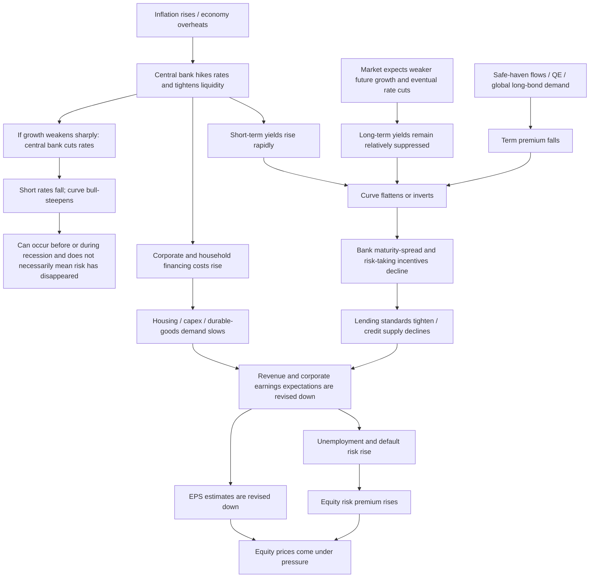

## Executive Summary

**Core conclusion: yield-curve inversion is a valuable “recession-probability signal,” but it is not a reliable “stock-market sell-timing signal.”** Postwar U.S. data show that the **10-year minus 3-month spread (10y–3m)** in particular has long contained significant information for predicting recessions roughly 2–6 quarters ahead. Estrella and Mishkin’s New York Fed research found that it outperformed many other financial and macroeconomic indicators for medium-horizon recession forecasting, and subsequent Federal Reserve research has broadly continued to support that conclusion. ([Estrella & Mishkin, 1996 — New York Fed](https://www.newyorkfed.org/research/current_issues/ci2-7.html))

But “predicting a recession” and “predicting negative stock returns” are two different things. A Nasdaq Dorsey Wright event study of seven **first 2y–10y inversions** from 1978–2005 found that the S&P 500’s average total returns after inversion were **+4.4% after 6 months, +14.3% after 12 months, +20.7% after 18 months, and +22.7% after 24 months**. The 95% Student-t confidence intervals calculated in this report from the event-by-event data show that only the 12-month and 24-month average-return intervals were clearly above zero. In other words, stocks can continue rising for a long time after inversion. ([Nasdaq Dorsey Wright, 2019](https://www.nasdaq.com/articles/yield-curve-inversion-and-momentum-return-2019-09-12))

On the other hand, **once an inversion ultimately does correspond to a recession, stock-market losses can be large**. Fidelity statistics for recessions from 1960–2020 show that the S&P 500’s average peak-to-trough drawdown was about **33%**, with an average drawdown duration of about 340 days; the stock market usually bottomed before the officially dated recession had ended. The curve is therefore better viewed as a warning light that “the risk regime is changing” rather than a timer saying “the stock market tops tomorrow.” ([Fidelity AART, 2020 — cited recession drawdown statistics](https://www.readkong.com/page/quarterly-market-update-fidelity-institutional-asset-4355691))

The historical hit rate is high, but it is not mythically perfect. Fidelity’s 2022 review of the 10y–3m record showed that all eight U.S. recessions in its sample had previously been preceded by inversion, while 1966 and 1998 were two false signals; recessions began roughly **4–21 months after inversion, averaging about one year**. Under that particular event definition, this corresponds to 8/8 recession coverage but only 8/10 signal precision, or 80%. More importantly, another exceptionally long inversion occurred in 2022–2024, and as of August 2026 the NBER still lists February–April 2020 as the latest U.S. recession; if 2022–24 is also treated as a false signal, the historical “signal precision” falls further. ([NBER U.S. Business Cycle Expansions and Contractions](https://www.nber.org/research/data/us-business-cycle-expansions-and-contractions))

Across different spreads, **10y–3m is the best simple benchmark, but there is no single curve that is optimal at every forecasting horizon.** Federal Reserve out-of-sample research shows that when identifying whether the economy will “transition from expansion into recession” over the next 12 months, the 10y–3m AUROC is about **0.93**, versus about **0.92** for the Near-Term Forward Spread (NTFS), essentially a tie; combining yield-curve information with credit indicators such as the Excess Bond Premium can improve some broader recession-classification tasks. ([Pike, 2019 — Federal Reserve](https://www.federalreserve.gov/econres/notes/feds-notes/out-of-sample-performance-of-recession-probability-models-20191213.html))

As of **August 14, 2026**, the U.S. 10y–3m spread had returned to roughly **+82 basis points**, while the 10y–2y spread was about **+51 basis points**, meaning the curve had returned to a positive slope. ([FRED 10y–3m](https://fred.stlouisfed.org/series/T10Y3M), [FRED 10y–2y](https://fred.stlouisfed.org/series/T10Y2Y)) The New York Fed’s 10y–3m-based model, using an average July 2026 spread of roughly +78 basis points, estimated the **12-month recession probability around July 2027 at about 15.2%**. This is a historical-model estimate, not an official economic forecast of the New York Fed. ([New York Fed — The Yield Curve as a Leading Indicator](https://www.newyorkfed.org/research/capital_markets/ycfaq.htm))

**The practical implication for investors is: do not liquidate the portfolio simply because the curve first inverts; treat inversion as the starting point for more intensive risk management.** The most useful approach is to interpret the yield curve together with credit spreads, bank lending standards, employment, corporate earnings, inflation, and the reason the curve is “re-steepening.” Inversion by itself is usually too early; when credit and earnings are also deteriorating, the signal deserves greater weight. ([Federal Reserve](https://www.federalreserve.gov/econres/notes/feds-notes/out-of-sample-performance-of-recession-probability-models-20191213.html), [J.P. Morgan Asset Management](https://am.jpmorgan.com/us/en/asset-management/liq/insights/market-insights/portfolio-considerations-for-investors-concerned-about-a-downturn/))

## Definition, Mechanism, and the Yield Curve’s Actual Signal

The yield curve is the ordering of bond yields across different maturities for the same credit issuer. For U.S. Treasuries, the normal condition is usually that long-term yields exceed short-term yields. An “inversion” means that long-term yields fall below short-term yields, for example:

$$
S_{10y-3m}=y_{10y}-y_{3m}<0
$$

or

$$
S_{10y-2y}=y_{10y}-y_{2y}<0.
$$

FRED defines these spreads exactly as “long-term yield minus short-term yield,” with a negative value indicating inversion. ([FRED 10y–3m](https://fred.stlouisfed.org/series/T10Y3M), [FRED 10y–2y](https://fred.stlouisfed.org/series/T10Y2Y))

The key to understanding inversion is to decompose the long-term yield into “expected future short rates” and the “term premium”:

$$
y_t^{(n)}
\approx
\frac{1}{n}\sum_{j=0}^{n-1}E_t(i_{t+j})
+TP_t^{(n)}.
$$

The first term reflects where the market expects future policy rates to go, while the second term, $$TP$$, is the term premium investors demand for bearing long-horizon interest-rate, inflation, and supply-demand risk. Research from the New York Fed and Federal Reserve indicates that much of the yield curve’s forecasting power comes from expectations about future policy and economic activity rather than from inversion possessing any “mysterious causal power” by itself. ([Estrella & Mishkin, 1996](https://www.newyorkfed.org/research/current_issues/ci2-7.html), [Engstrom & Sharpe, 2018](https://www.federalreserve.gov/econres/feds/the-near-term-forward-yield-spread-as-a-leading-indicator-a-less-distorted-mirror.htm))

A typical inversion process looks like this: the central bank raises rates quickly to bring inflation down, so 3-month, 1-year, or 2-year yields rise with the policy rate. But if the bond market believes that such tightening cannot be sustained and that future growth and inflation will weaken, it begins to expect eventual rate cuts, so the 10-year yield does not rise as much and may even decline. Short rates therefore move above long rates. This is why “very high short-term yields and relatively lower long-term yields” often convey two messages simultaneously: **policy is tight today, and the market expects future easing because the economy will weaken.** ([Estrella & Mishkin, 1996 — New York Fed](https://www.newyorkfed.org/research/current_issues/ci2-7.html))

However, the curve can also invert because the term premium is compressed. Quantitative easing, long-bond demand from banks and pension funds, and global safe-haven flows into Treasuries can all lower long-term yields. Federal Reserve-related research therefore warns that a low term premium can sometimes increase the probability of an inversion occurring **without genuine recession risk**. In practice, it is therefore useful to distinguish whether the curve is inverting because **the short end is being pushed up by monetary policy** or because **the long end is being pulled down by term-premium/global-flow effects**. ([BIS, 2019](https://www.bis.org/publ/qtrpdf/r_qt1909v.htm))

Another often-overlooked concept is that “the end of inversion” does not necessarily mean the danger has passed. If the curve re-steepens because the Federal Reserve cuts rates sharply and short yields collapse—a **bull steepening**—that may instead mean the economy has deteriorated enough that the central bank must respond aggressively. If the curve steepens because long-term inflation, fiscal supply, or the term premium rises—a **bear steepening**—that can still be unfavorable for equity valuations and long-duration bonds. IMF research on recent curve re-steepening similarly emphasizes that investors must separate expected short rates from term-premium changes rather than looking only at whether the slope is positive or negative. ([IMF Global Financial Stability Report, October 2024](https://www.elibrary.imf.org/display/book/9798400277573/CH001.xml))

## Historical Record: The United States and Major Economies

The United States offers the longest, most consistent, and most extensively studied dataset. The table below uses QTC’s Refinitiv-based compilation of **first/repeated 2y–10y inversion dates** as the backbone and updates recession dates using the NBER chronology. One important caveat is that “touching below zero for one day” and “remaining inverted on a monthly-average basis” produce different event lists, so exact dates should never be used without the accompanying data definition. ([Anthonisz, 2022 — QTC](https://www.qtc.com.au/institutional-investors/news-and-publications/research/assessing-us-recession-risks/), [NBER](https://www.nber.org/research/data/us-business-cycle-expansions-and-contractions))

| U.S. 2s10s inversion date | Subsequent outcome | Approx. time to recession | Background and interpretation |
|---|---:|---:|---|
| 1973-02-26 | 1973–75 recession | 9 months | Great Inflation era, around the first oil shock; policy conditions were tight |
| 1975-08-12 | **No recession** | — | QTC identifies this as a false signal; the spread remained negative for only 1 day |
| 1978-08-02 | 1980 recession | 17 months | High inflation and tightening monetary policy |
| 1980-08-22 | 1981–82 recession | 11 months | Volcker anti-inflation tightening period |
| 1981-12-21 | Already in recession | — | Not a valid leading signal |
| 1989-01-06 | 1990–91 recession | 18 months | Late-1980s policy tightening |
| 1990-03-20 | Repeated signal for the same recession | 4 months | Should not be counted as a separate independent “hit” |
| 2000-02-08 | 2001 recession | 13 months | Late technology-bubble period and Fed tightening |
| 2006-02-03 | 2007–09 Great Recession | 22 months | End stage of the housing and leverage cycle |
| 2019-08-14 | 2020 recession | 6 months | Statistically a hit, but the actual recession was triggered by the exogenous COVID-19 shock, so causal interpretation requires great caution |
| 2022-04-01 | **No NBER recession as of 2026-08** | > 4 years | The initial inversion was brief, then became persistent from mid-2022 onward; one of the most important modern false-signal cases |

The dates, duration of negative spreads, and months to recession in the first ten rows come from QTC’s 2y–10y event table. ([QTC](https://www.qtc.com.au/institutional-investors/news-and-publications/research/assessing-us-recession-risks/)) The NBER still lists February 2020 as the latest business-cycle peak and April 2020 as the latest trough, meaning there has been no new officially dated U.S. recession since 2022. ([NBER](https://www.nber.org/research/business-cycle-dating)) The 2s10s inversion that began in 2022 later persisted until roughly September 2024; Hartford market data show that during this prolonged inversion the S&P 500 instead accumulated a gain of about **46.4%**, providing a vivid example of why “inversion does not equal an immediate sell signal for stocks.” ([Hartford Funds](https://www.hartfordfunds.com/insights/market-perspectives/fixed-income/what-the-shape-shifting-yield-curve-is-telling-us-about-markets.html))

*Figure: Compiled in this report from QTC 2s10s event dates and NBER recession intervals; gray shading represents NBER recessions. 1975 is a clear false signal; the 1981 and 1990 signals occurred during an existing recession or duplicated the same cycle, so they should not be treated as independent forecasts when calculating hit rates.* ([QTC](https://www.qtc.com.au/institutional-investors/news-and-publications/research/assessing-us-recession-risks/), [NBER](https://www.nber.org/research/data/us-business-cycle-expansions-and-contractions))  
[Download timeline PNG](/assets/yield_curve_inversion_recession_timeline_zhTW.png)

**1998 is especially useful for showing that an “inversion date” is not an entirely objective, unique event.** Fidelity’s 10y–3m definition counts 1998 as a false signal that was not followed by recession; Nasdaq Dorsey Wright’s 2s10s event study counts June 1998 as an inversion; QTC’s 2s10s filtering table does not list it as a separate event. These differences can result from the choice of spread, intraday versus daily-close versus monthly-average data, minimum duration, and event de-duplication rules. Any claim of a “100% hit rate” therefore has to state the event definition first. ([Nasdaq Dorsey Wright, 2019](https://www.nasdaq.com/articles/yield-curve-inversion-and-momentum-return-2019-09-12), [QTC, 2022](https://www.qtc.com.au/institutional-investors/news-and-publications/research/assessing-us-recession-risks/))

Cross-country data are even harder to compare directly. In Estrella and Mishkin’s European research, the short-end benchmark differs by country: France uses the long-term government-bond yield minus the 3-month Paris interbank rate, Germany uses the 10-year Bund minus a 3-month rate, while Italy and the United Kingdom use their own domestic short-term Treasury-bill benchmarks. There is therefore no single dataset that allows a clean comparison of “the first inversion date” across countries over fifty years. ([Estrella & Mishkin — New York Fed reference](https://www.newyorkfed.org/research/outside_journals/1996), [BIS](https://www.bis.org/))

| Major-economy period | Consistently verifiable historical evidence | Implication |
|---|---|---|
| 1970s–1990s | A BIS study of eight countries found that term spreads contained recession information in every country and could lead recessions by as much as about two years; forecasting power was **strongest in Germany, followed by the United States and Canada, and weakest in Japan**. ([Bernard & Gerlach, 1996 — BIS](https://www.bis.org/publ/work37.htm)) | The United States is not the only useful case, but cross-country signal strength varies substantially |
| 1974–1995 European study | Germany’s forecasting results were close to, and in some specifications better than, those of the United States; the United Kingdom was reasonably strong; France and Italy were materially weaker and generated more false signals. ([Estrella & Mishkin](https://www.newyorkfed.org/research/outside_journals/1996), [BIS](https://www.bis.org/publ/work37.htm)) | Institutions, interest-rate markets, and recession definitions affect hit rates |
| August 2019 | BIS documented **yield-curve inversions in multiple countries**, alongside global growth and trade concerns, exceptionally low term premia, and safe-haven demand. ([BIS Quarterly Review, 2019](https://www.bis.org/publ/qtrpdf/r_qt1909v.htm)) | Global common factors can depress long-term bond yields simultaneously |
| 2022–2023 | By 2023, BIS noted that **yield curves were strongly inverted across major advanced economies**; a central background factor was rapid policy tightening after the inflation surge. ([BIS Quarterly Review, 2023](https://www.bis.org/publ/qtrpdf/r_qt2309a.htm)) | This was a classic cluster of inversions generated by synchronized global policy tightening |

The most robust cross-country conclusion is therefore not that “one specific spread perfectly predicts recession in every country,” but that **the term structure contains information about future economic activity in many advanced economies, with historically stronger signals in markets such as the United States and Germany and much less stable signals elsewhere.** ([Bernard & Gerlach, 1996 — BIS](https://www.bis.org/publ/work37.htm))

## Empirical Evidence: Strong for Recession Forecasting, Much Weaker for Stock-Market Timing

The first step is to separate two statistics that are often conflated when discussing “hit rates.”

**Recession coverage (sensitivity)** asks: “Of the recessions that occurred, how many were preceded by an inversion?” **Signal precision (positive predictive value)** asks: “Of all inversion signals, how many were actually followed by recession?” A high value for the first does not imply a 100% value for the second.

In Fidelity’s 2022 statistics, before including the latest inversion episode, 10y–3m had inverted before all eight U.S. recessions in the sample, giving **8/8 = 100% recession coverage**; but there were also the 1966 and 1998 episodes without subsequent recession, giving **8/10 = 80% signal precision** under that event definition. The recession lead time was roughly **4–21 months, averaging about one year**. If the 2022–24 inversion is also classified as a false signal after exceeding the conventional 24-month forecasting window without an NBER recession, the crude signal-precision ratio falls to **8/11, about 73%**. That is a simple event-count update calculated in this report, not a Federal Reserve model estimate. ([NBER](https://www.nber.org/research/business-cycle-dating))

QTC’s 2s10s event table yields a similar but slightly different result. After excluding signals that appeared only after recession had already begun and repeated signals from the same cycle, seven of the eight major initial signals between 1973 and 2019 were followed by a recession within roughly 6–22 months, while one—the 1975 case—was a false signal. This gives signal precision of about **87.5%**, with an average lead time of approximately **13.7 months** across the seven hits. If 2022 is added and there is still no recession by 2026, the simple ratio becomes about **7/9 = 77.8%**. Again, the apparent “hit rate” changes materially with the event definition. ([Anthonisz, 2022 — QTC](https://www.qtc.com.au/institutional-investors/news-and-publications/research/assessing-us-recession-risks/))

A comparison of different spreads follows:

| Indicator | Empirical performance | Typical forecast window | Assessment |
|---|---|---|---|
| **10y–3m** | Estrella–Mishkin find significant forecasting power at 2–6 quarters, with around 4 quarters especially practical; Federal Reserve out-of-sample AUROC for “transition into recession during the next 12 months” is about **0.93**. ([New York Fed](https://www.newyorkfed.org/research/current_issues/ci2-7.html), [Federal Reserve](https://www.federalreserve.gov/econres/notes/feds-notes/out-of-sample-performance-of-recession-probability-models-20191213.html)) | Roughly 6–18 months, broadly up to 2 years | **Best simple benchmark** |
| **10y–2y** | The most commonly cited market spread; QTC’s major 1973–2019 initial events led recession by roughly 6–22 months. ([QTC](https://www.qtc.com.au/institutional-investors/news-and-publications/research/assessing-us-recession-risks/)) | Roughly 6–24 months | Very useful, but not clearly superior to 10y–3m |
| **10y–1y** | Bauer & Mertens’ research summary indicates that from 1955 onward it could lead recession by roughly 6–24 months, with only one false signal in the traditional sample; its predictive ability is very close to that of 10y–3m. ([Federal Reserve discussion and references](https://www.federalreserve.gov/econres/notes/feds-notes/dont-fear-the-yield-curve-20180628.html)) | 6–24 months | Effective alternative indicator |
| **Near-Term Forward Spread** | Engstrom–Sharpe’s original work argued that it dominates some traditional spreads; however, subsequent Federal Reserve out-of-sample testing finds a recession-transition AUROC of about **0.92**, nearly identical to the 10y–3m result of 0.93. ([Engstrom & Sharpe](https://www.federalreserve.gov/econres/feds/the-near-term-forward-yield-spread-as-a-leading-indicator-a-less-distorted-mirror.htm), [Federal Reserve](https://www.federalreserve.gov/econres/notes/feds-notes/out-of-sample-performance-of-recession-probability-models-20191213.html)) | Roughly the next 6 quarters of policy expectations | Theoretically elegant, but **not overwhelmingly superior out of sample** |
| **Yield curve + credit risk** | In Pike’s research, 10y–3m plus the Excess Bond Premium can reach AUROC of about **0.88** for a broader “recession at any time in the next 12 months” classification, versus about 0.70 for 10y–3m alone under that broader classification. ([Federal Reserve](https://www.federalreserve.gov/econres/notes/feds-notes/out-of-sample-performance-of-recession-probability-models-20191213.html)) | 0–12 months | More useful in practice than a single spread |
| **Multi-maturity / principal-component models** | Miller finds no single spread is best across every forecast horizon; different combinations of short, medium, and long maturities work best at different horizons. ([Miller, 2019 — Federal Reserve](https://www.federalreserve.gov/econres/notes/feds-notes/there-is-no-single-best-predictor-of-recessions-20190521.html)) | Model-dependent | Better suited to professional modeling than to a single trading rule |

An AUROC of 0.5 is roughly equivalent to random classification, while 1.0 represents perfect ranking, so a value above 0.9 can be regarded as a very strong classification signal. But even that does not mean “every inversion must be followed by recession,” and it certainly does not mean the exact month of recession can be forecast precisely. ([Pike, 2019 — Federal Reserve](https://www.federalreserve.gov/econres/notes/feds-notes/out-of-sample-performance-of-recession-probability-models-20191213.html))

The stock-market result is materially weaker. Across Nasdaq Dorsey Wright’s seven 2s10s inversion events, the S&P 500 produced positive total returns **4/7, 6/7, 5/7, and 6/7** times at horizons of **6, 12, 18, and 24 months**, respectively; the average 12-month return was +14.3% and the average 24-month return was +22.7%. ([Nasdaq Dorsey Wright, 2019](https://www.nasdaq.com/articles/yield-curve-inversion-and-momentum-return-2019-09-12))

*Figure: S&P 500 Total Return data from seven Nasdaq Dorsey Wright events; this report calculates the mean and Student-t 95% confidence interval from each event’s return. 6 months: +4.4% [−2.9%, +11.8%]; 12 months: +14.3% [+2.6%, +26.0%]; 18 months: +20.7% [−1.2%, +42.6%]; 24 months: +22.7% [+1.2%, +44.2%]. The sample size, n=7, is extremely small and the confidence intervals are wide, so these figures should not be treated as precise forecasts of future returns.* ([Nasdaq Dorsey Wright, 2019](https://www.nasdaq.com/articles/yield-curve-inversion-and-momentum-return-2019-09-12))  
[Download average-return and confidence-interval PNG](/assets/sp500_returns_after_inversion_ci_zhTW.png)

Cross-market evidence also does not support the claim that “inversion means stocks must fall.” Dimensional examined 14 inversion cases across five markets and found that **10/14, or about 71%**, had positive equity returns over the subsequent three years; across the same markets, the probability of a positive three-year return starting from any month was about **77%**. Thus, the long-term equity win rate after inversion was slightly below normal periods, but far from implying that investors should immediately exit equities. ([Dimensional](https://www.dimensional.com/gb-en/insights/is-a-yield-curve-inversion-bad-for-stock-returns)) MSCI, using another set of historical inversion episodes, found that in four of six comparable cases, stocks were still above their inversion-date level one year later and explicitly concluded that the small sample did not produce a robust directional equity-market signal. ([Bequillard, 2019 — MSCI](https://www.msci.com/research-and-insights/blog-post/what-yield-curve-inversions-have-meant-for-markets))

The more dangerous phase is once recession actually forms. Fidelity’s S&P 500 statistics across recessions from 1960–2020 show an average total drawdown of about **−33%**. This is not inconsistent with “stocks can rise on average after inversion,” because equities can continue making new highs after the curve first inverts and only later decline as growth and earnings deteriorate. ([Fidelity AART, 2020](https://www.readkong.com/page/quarterly-market-update-fidelity-institutional-asset-4355691)) J.P. Morgan also notes that historical stock-market peaks have occurred anywhere from **0–13 months before the official start of recession**, so cutting equity exposure too aggressively immediately after inversion can forfeit a substantial portion of the late-cycle rally. ([J.P. Morgan Asset Management](https://am.jpmorgan.com/us/en/asset-management/liq/insights/market-insights/portfolio-considerations-for-investors-concerned-about-a-downturn/))

## Transmission Mechanism, Monetary Policy, and Global Capital Flows

The most reasonable explanation for why inversion can forecast recession is not that “a line turning negative causes recession,” but that the line compresses information about **the degree of monetary tightening, market expectations for future rate cuts, the term premium, and the growth outlook**. Estrella–Mishkin and later Federal Reserve research both identify current monetary policy and expected future short rates as important sources of yield-curve information. ([Estrella & Mishkin](https://www.newyorkfed.org/research/current_issues/ci2-7.html), [Federal Reserve](https://www.federalreserve.gov/econres/feds/the-near-term-forward-yield-spread-as-a-leading-indicator-a-less-distorted-mirror.htm))

The banking channel is one mechanism, but it should not be oversimplified into “inversion automatically causes banks to stop lending.” Bank asset-liability duration, deposit costs, interest-rate hedging, and non-interest income all affect the outcome. The more important point is that when high policy rates, funding costs, and risk aversion rise simultaneously, banks are more likely to raise lending rates and tighten credit standards. Fidelity’s 2023 cycle analysis similarly observed that bank lending standards tightened materially during the Fed’s tightening and inversion period. ([Fidelity Business Cycle Update](https://institutional.fidelity.com/app/item/RD_13569_40890/business-cycle-update.html))

For companies, rising rates first increase the cost of new borrowing and refinancing and raise investment hurdle rates; the effect then propagates through housing, durable goods, capital spending, and employment. For equities, two channels can work in opposite directions: on one hand, weaker growth reduces EPS estimates and raises credit and equity risk premia; on the other hand, if long-term yields fall because of expectations of future rate cuts, lower discount rates can support the valuation of long-duration equities. This is precisely why inversion’s short- and medium-term net effect on stock prices is much less stable than its effect on recession probabilities. ([Federal Reserve](https://www.federalreserve.gov/econres/feds/the-near-term-forward-yield-spread-as-a-leading-indicator-a-less-distorted-mirror.htm), [J.P. Morgan Asset Management](https://am.jpmorgan.com/us/en/asset-management/liq/insights/market-insights/portfolio-considerations-for-investors-concerned-about-a-downturn/))

The inflation environment is especially important. In a typical “falling inflation, slowing growth” cycle, the central bank has room to cut rates aggressively, and long-duration government bonds often provide better hedging against equity risk. But if recession risk coexists with high inflation, the central bank has less room to ease and both stocks and bonds can come under pressure. Recent research also shows that long-term yields can rise even after central banks begin cutting rates because of higher term premia, inflation risk, and greater bond supply. Therefore, “rate cuts mean all long-duration bonds must rally” is not a law either. ([IMF, 2024](https://www.elibrary.imf.org/display/book/9798400277573/CH001.xml), [BIS, 2024](https://www.bis.org/publ/qtrpdf/r_qt2412a.htm))

Global capital flows can alter the “purity of the signal” embedded in the curve. When global investors purchase large amounts of U.S., German, or other safe long-duration sovereign bonds because of hedging, regulation, or asset-allocation demand, the term premium can decline and the curve can flatten more than domestic fundamentals alone would imply. The synchronized inversions across multiple countries in 2019 are an important example: global growth concerns and exceptionally low long-bond yields existed at the same time. ([BIS Quarterly Review, 2019](https://www.bis.org/publ/qtrpdf/r_qt1909v.htm)) In practice, investors should therefore monitor credit spreads, term-premium models, central-bank expectations, and cross-country interest rates together rather than treating −1 basis point and −100 basis points as economically identical signals.

## Equity Sectors and Factors: Who Is Usually More Fragile, and Who Is Relatively Defensive?

**The distinction between cyclical and defensive equities is more stable than a simple growth/value split.** Fidelity’s long-run business-cycle sector research shows that as the economy moves into late cycle and recession, less economically sensitive sectors such as consumer staples, health care, and utilities have tended to perform relatively better, while cyclical sectors that depend heavily on capital spending, consumer demand, and credit conditions are more vulnerable. ([Fidelity](https://www.fidelity.com/learning-center/trading-investing/markets-sectors/business-cycle-investing-implications))

Banks are a special case. Traditional banks fund longer-duration assets with shorter-duration liabilities, so a steeper curve is generally more favorable for spread income, while inversion can compress the net interest margin of some banks. If the curve re-steepens and credit losses remain under control, bank profitability can improve. Fidelity’s bank-sector commentary similarly argues that the return to a positive curve in 2024–26 improved the profitability of the traditional borrow-short/lend-long business model for some banks. ([Fidelity, 2026](https://institutional.fidelity.com/advisors/insights/topics/portfolio-manager-insights/a-new-dawn-for-regional-banks)) However, in an actual recession, defaults, commercial-real-estate exposure, and loan losses can matter more than the slope of the curve itself, so “inversion means short all banks” is not a reliable rule.

**Small-cap stocks are usually more fragile than large-cap stocks, but not at every horizon.** In Nasdaq Dorsey Wright’s seven-event averages, the Russell 2000 returned roughly **+2.1%, +11.6%, and +16.5%** at 6, 12, and 24 months after inversion, respectively, below the S&P 500’s **+4.4%, +14.3%, and +22.7%**; the two were much closer at 18 months. This is consistent with the fact that smaller firms are generally more dependent on banks and refinancing and have more volatile earnings, but seven events are far from enough to define a stable trading rule. ([Nasdaq Dorsey Wright, 2019](https://www.nasdaq.com/articles/yield-curve-inversion-and-momentum-return-2019-09-12))

**Growth does not have a fixed advantage or disadvantage relative to value.** If inversion is driven by a rapid decline in long-term yields, the discount rate applied to high-growth, long-duration future cash flows falls, potentially supporting growth valuations. If the economy then enters recession and earnings and risk appetite collapse, highly valued growth stocks may instead suffer severe multiple compression. Conversely, “value” does not mean “defensive”: many value-heavy sectors such as financials, energy, and materials are highly cyclical. Capital Group statistics even show that the Russell 1000 Value Index underperformed the S&P 500 in five of the seven most recent major market declines, by an average of about 221 basis points. ([Capital Group](https://www.capitalgroup.com/advisor/investments/value.html))

A more economically meaningful ordering is therefore usually:

| Characteristic | Typical sensitivity after inversion if the economy continues deteriorating | Key reason |
|---|---|---|
| Highly leveraged, small-cap, weak balance sheet | Higher | Sensitive to refinancing and credit availability |
| Consumer cyclicals, industrials, materials | Higher | Earnings are highly correlated with aggregate demand |
| Banks | Mixed | Net interest margins can be compressed, but outcomes depend heavily on deposit costs and credit losses |
| Consumer staples, health care, utilities | Lower | Revenue is less sensitive to the business cycle ([Fidelity](https://www.fidelity.com/learning-center/trading-investing/markets-sectors/business-cycle-investing-implications)) |
| Quality / low volatility | Usually lower | More stable cash flow and lower leverage; historical style research also finds quality and defensive exposures more resilient when growth slows |
| Growth vs. value | **Uncertain** | Depends on whether the valuation benefit from lower rates or the fundamental damage from falling earnings dominates |

The same seven-event Nasdaq sample contains another interesting but non-generalizable result: high-momentum portfolios returned roughly **+16.6% and +38.7%** on average at 12 and 24 months after inversion, compared with about **+11.9% and +8.3%** for low-momentum portfolios. This suggests that “immediately short the market leaders after inversion” has not historically been a stable rule either; the 2000 technology bubble is one inversion cycle, not the template for every cycle. ([Nasdaq Dorsey Wright, 2019](https://www.nasdaq.com/articles/yield-curve-inversion-and-momentum-return-2019-09-12))

## Investment Practice: Asset Allocation, Hedging, Timing, and Risk Management

The most reasonable investment framework is not “inversion → sell stocks,” but to treat inversion as a **state variable that gradually raises the level of risk alertness**. Historical data argue against one-time liquidation because stocks can continue rising for more than a year after the first inversion; J.P. Morgan data even show that market peaks can occur only 0–13 months before the recession actually starts. ([J.P. Morgan Asset Management](https://am.jpmorgan.com/us/en/asset-management/liq/insights/market-insights/portfolio-considerations-for-investors-concerned-about-a-downturn/))

| Investment horizon | Recommended risk-management focus | What not to do |
|---|---|---|
| **Short term: 0–6 months** | Maintain strategic equity exposure; increase liquidity; reduce unnecessary leverage; review single-stock and sector concentration; if the portfolio already has large downside exposure that cannot be tolerated, use limited-cost structures such as put spreads to manage tail risk. Inversion alone does not justify a full exit because the seven-event sample still shows a +4.4% average 6-month return. ([Nasdaq Dorsey Wright](https://www.nasdaq.com/articles/yield-curve-inversion-and-momentum-return-2019-09-12)) | Do not move entirely to cash simply because a spread has just crossed below zero; do not treat a one-day inversion as equivalent to a deep inversion lasting for months |
| **Medium term: 6–24 months** | Track the curve together with credit spreads, lending standards, unemployment, and earnings estimates. If multiple signals deteriorate together, gradually increase exposure to quality, defensive equities, and high-quality fixed income while reducing exposure to weak balance sheets and high refinancing needs. If re-steepening is a growth-driven bull steepening, high-quality duration can provide some hedge; if re-steepening is driven by inflation or the term premium, long duration may not work. ([Federal Reserve](https://www.federalreserve.gov/econres/notes/feds-notes/out-of-sample-performance-of-recession-probability-models-20191213.html), [IMF](https://www.elibrary.imf.org/display/book/9798400277573/CH001.xml)) | Do not declare the risk over merely because the curve turns positive, and do not mechanically bet on all long-duration bonds |
| **Long term: more than 2 years** | Maintain target asset allocation and rebalance regularly; during large drawdowns, systematically restore risk assets that have fallen below target weights; make sure equities, high-quality bonds, and liquid assets can withstand a full business cycle. | Avoid holding excessive cash for years while waiting for the “perfect entry point”; market reversals usually precede macroeconomic data and formal NBER recession declarations |

The last point is especially important. Schwab calculates that from 2006–2025, the S&P 500’s annualized return was about **11.0%**; if an investor missed only the ten best trading days during that 20-year period, the annualized return fell to **6.6%**. This does not prove that risk should never be adjusted, but it clearly illustrates the timing cost of “selling is easy; getting back in is hard.” ([Schwab, 2025/2026](https://www.schwab.com/learn/story/ups-and-downs-stock-market-volatility))

A more practical approach is to grade the inversion signal:

When **only the curve is inverted**, treat it as a “yellow alert.” When **inversion + wider credit spreads + tighter bank lending + downward earnings revisions** appear together, the environment moves closer to an “orange alert.” If this is then joined by **worsening unemployment, rising corporate defaults, and a collapse in front-end yields because the market is pricing rapid rate cuts**, risk is materially higher. This multi-indicator approach is consistent with Federal Reserve research showing that term-spread information combined with the Excess Bond Premium can outperform a single yield-curve measure in broader recession classification. ([Pike, 2019 — Federal Reserve](https://www.federalreserve.gov/econres/notes/feds-notes/out-of-sample-performance-of-recession-probability-models-20191213.html))

This research also has several limitations that cannot be ignored. First, the United States has had only a single-digit to low-double-digit number of genuinely independent inversion cycles since the 1970s, so the statistical sample is very small; the equity event study in this report has only seven events, producing extremely wide confidence intervals. Second, different studies treat “first cross below zero,” “persistent inversion,” “monthly-average inversion,” and repeated signals differently, with 1998 being an obvious example. Third, COVID-19 makes the 2019 inversion look like a “correct forecast” statistically, but it is not reasonable to claim that the yield curve foresaw a viral pandemic; this can make traditional hit-rate statistics overstate the structural forecasting power of the curve. ([Nasdaq Dorsey Wright](https://www.nasdaq.com/articles/yield-curve-inversion-and-momentum-return-2019-09-12), [QTC](https://www.qtc.com.au/institutional-investors/news-and-publications/research/assessing-us-recession-risks/))

Fourth, QE, global demand for long-term bonds, low neutral interest rates, and changes in the term-premium regime can all alter the shape of the curve. Even if the historical relationship has not disappeared, model coefficients should not be treated as permanently fixed. ([BIS](https://www.bis.org/publ/qtrpdf/r_qt1909v.htm), [Miller, 2019 — Federal Reserve](https://www.federalreserve.gov/econres/notes/feds-notes/there-is-no-single-best-predictor-of-recessions-20190521.html)) Fifth—and most importantly for the present cycle—**after the prolonged 2022–24 inversion, the United States still had no newly dated NBER recession by August 2026, while the stock market had risen sharply over the same period.** This does not prove that the yield curve has “stopped working,” but it is enough to reject the overly certain claim that inversion must produce a recession or bear market within a fixed period. ([NBER](https://www.nber.org/research/business-cycle-dating), [Hartford Funds](https://www.hartfordfunds.com/insights/market-perspectives/fixed-income/what-the-shape-shifting-yield-curve-is-telling-us-about-markets.html))

The most rigorous conclusion is therefore not that “the yield curve predicts stock-market crashes,” but rather:

**The yield curve—especially 10y–3m—is one of the few market indicators that has historically contained strong, real-time, unrevised information about medium-term U.S. recession risk; however, its ability to predict the direction of stock returns is far weaker than its ability to predict the state of the economy.** The information that matters for investors is that inversion says “financial conditions and cyclical risk have entered a zone that requires greater vigilance,” not that it identifies a specific day on which stocks should be sold. The most reasonable use is to combine it with credit, employment, bank lending, corporate earnings, inflation, and the term premium rather than treating zero spread as a magical market boundary. ([Estrella & Mishkin, 1996](https://www.newyorkfed.org/research/current_issues/ci2-7.html), [Miller, 2019](https://www.federalreserve.gov/econres/notes/feds-notes/there-is-no-single-best-predictor-of-recessions-20190521.html), [Pike, 2019](https://www.federalreserve.gov/econres/notes/feds-notes/out-of-sample-performance-of-recession-probability-models-20191213.html))
