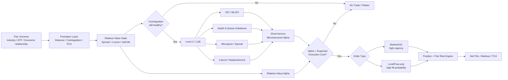
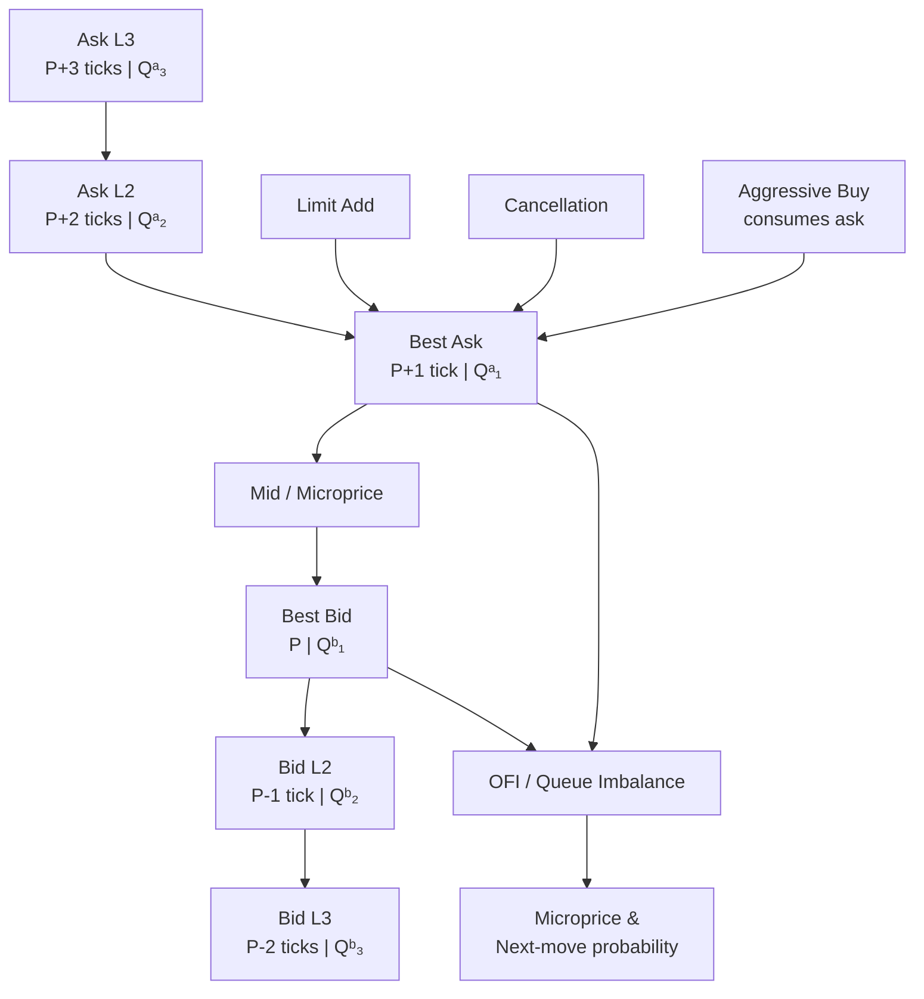
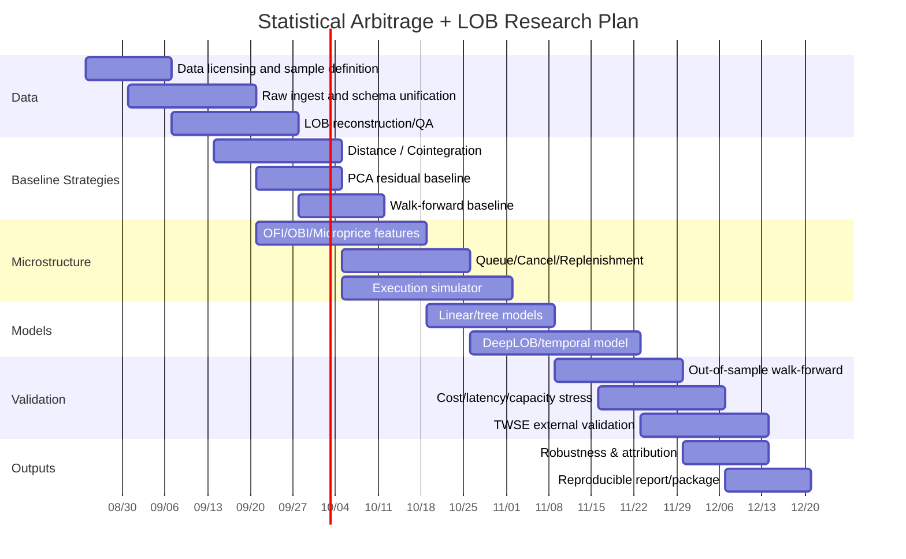

## Executive Summary

Statistical Arbitrage is not risk-free arbitrage. Instead, it exploits large numbers of repeated, quantifiable relative-value deviations to build approximately market-neutral long-short positions, relying on the statistical reversion of price relationships to generate positive expected value. Pairs Trading is its most intuitive form: first identify two assets with a stable economic or statistical linkage, then trade their spread or cointegration residual. The Engle–Granger theory of cointegration provides the formal foundation for the idea that “two price series that are individually non-stationary may have a stationary linear combination,” while the Johansen method extends the concept to multivariate systems. [Engle & Granger (1987)](https://doi.org/10.2307/1913236) [Johansen (1988)](https://doi.org/10.1016/0165-1889(88)90041-3)

The most important empirical conclusion is not a binary statement that “pairs trading works” or “pairs trading does not work.” Rather: **the simple, low-cost, low-frequency pairs-trading edge has clearly decayed, but economic value may still remain under better pair screening, cost control, liquidity conditions, and regime filtering.** Gatev, Goetzmann, and Rouwenhorst used U.S. daily equity data from 1962–2002 and minimum normalized-price distance pairing, obtaining annualized excess returns of up to about 11%. However, after Do–Faff incorporated commissions, market impact, and short-selling costs into a 1963–2009 sample, returns declined materially, and they found that traditional contrarian/pairs strategies were largely unprofitable after 2002. Rad, Low, and Faff compared distance, cointegration, and copula methods across the entire U.S. equity market from 1962–2014; after costs, average monthly excess returns were approximately 38, 33, and 5 bps, respectively, and the frequency of distance- and cointegration-based opportunities fell sharply after 2009. [Gatev, Goetzmann & Rouwenhorst](https://www.nber.org/papers/w7032) [Do & Faff (2012)](https://doi.org/10.1111/j.1475-6803.2012.01317.x) [Rad, Low & Faff (2016)](https://doi.org/10.1080/14697688.2016.1164337)

Therefore, at target frequencies ranging from high-frequency to intraday, **the alpha model and execution model must be treated as the same problem**. A theoretical spread of 5–15 bps does not imply 5–15 bps of tradable alpha: market orders pay spread, impact, and latency loss; limit orders may earn spread but bear queueing, non-fill, and adverse-selection risk. Cont, Kukanov, and Stoikov, using NYSE TAQ data for 50 U.S. stocks, show a robust approximately linear relationship between short-horizon price changes and Order Flow Imbalance (OFI) at the best bid/ask, with the price-impact slope inversely related to market depth. [Cont, Kukanov & Stoikov](https://arxiv.org/abs/1011.6402) The Queue-Reactive model goes further: a limit order book should be viewed as a stochastic queueing system whose dynamics depend on the current queue state; therefore, “where my order sits in the queue” is itself a strategy state variable. [Huang, Lehalle & Rosenbaum](https://arxiv.org/abs/1312.0563)

For Level 2, the highest-priority signals are not a simple “difference between five bid levels and five ask levels,” but rather **OFI/MLOFI, queue imbalance, microprice, spread, depth slope, cancellation/replenishment intensity, trade aggressor flow, and the conditional interaction of these signals with the pair spread**. A 2025 National Taiwan University study using five-level high-frequency data from the Taiwan Stock Exchange is especially relevant for local researchers: levels two through five contribute approximately 30% of its measured price discovery, while the remaining roughly 70% comes from the best bid/ask quotes and executed prices; order-book supply-demand imbalance is also significantly related to future short-term returns. This implies that Taiwan equity research should not preserve only the top of book. [Informational Content of High-Frequency Limit Order Books: Evidence from the Top Five Quotes in the Taiwan Stock Market](https://tdr.lib.ntu.edu.tw/handle/123456789/101183?mode=full)

My core recommendation is to build a **two-layer research architecture**:

> **Slow layer (relative value)** determines “which pair, which direction, and the appropriate holding period”;  
> **Fast layer (microstructure)** determines “whether to enter now, whether to use market or limit, which level to quote, how much to trade, and when to cancel.”

This is easier to diagnose and risk-control than using an LSTM or Transformer to predict the next tick directly from all prices, and it makes it easier to answer the most important practical question: **after accounting for fill probability, spread, slippage, borrow cost, market impact, and latency, is the predictive edge still positive?** DeepLOB-type methods show that CNN/LSTM models can learn short-term price signals from the spatial and temporal structure of the LOB; more recent Deep Order Flow Imbalance work combines OFI with multi-horizon prediction, but any improvement in classification accuracy must still be validated using execution-aware PnL. [DeepLOB](https://arxiv.org/abs/1808.03668) [Deep Order Flow Imbalance](https://doi.org/10.1111/mafi.12413)

For research, I would prioritize **NASDAQ/LOBSTER for method development + TWSE order/disclosure data for external validation in Taiwan**. LOBSTER provides event-by-event message files synchronized with order-book files; events distinguish submission, partial cancellation, deletion, visible/hidden execution, and include order ID, size, price, direction, and timestamps ranging from millisecond to nanosecond precision. The TWSE Data E-Shop currently lists monthly full-market prices of NT$5,000 for five-level disclosure data, NT$10,000 for transaction data, and NT$10,000 for order-book logs. [LOBSTER Data Structure](https://data.lobsterdata.com/info/DataStructure.php) [TWSE Data E-Shop](https://eshop.twse.com.tw/en/category/sub/42)

## Theoretical Foundations, Academic Context, and Profitability Decay

Statistical arbitrage is best understood through a three-layer structure:

$$
\text{Economic relationship}
\rightarrow
\text{Statistical equilibrium}
\rightarrow
\text{Execution opportunity}
$$

The first layer asks why two assets should share common drivers—for example, stocks in the same industry, common/preferred shares, an ETF and its constituents, or near/far futures contracts. The second layer asks whether the relationship can be stably captured by distance, cointegration, factor residuals, or another model. Only the third layer asks whether the deviation is large enough to pay trading costs.

A typical two-asset spread can be written as

$$
s_t=\log P_{A,t}-\alpha-\beta\log P_{B,t}.
$$

If $$P_A,P_B$$ are each $$I(1)$$ but $$s_t$$ is $$I(0)$$, then the two prices are cointegrated. Engle–Granger established the relationship among cointegration, error-correction models, estimation, and testing; Johansen derived maximum-likelihood estimation of the cointegrating space and rank tests from a non-stationary VAR. [Engle & Granger (1987)](https://doi.org/10.2307/1913236) [Johansen (1988)](https://doi.org/10.1016/0165-1889(88)90041-3)

In trading models, the spread is often further approximated as an Ornstein–Uhlenbeck mean-reverting process:

$$
ds_t=\kappa(\mu-s_t)dt+\sigma dW_t,
$$

where $$\kappa>0$$ is the reversion speed, and its theoretical half-life is

$$
t_{1/2}=\frac{\ln 2}{\kappa}.
$$

In practice, one may use

$$
z_t = \frac{s_t-\hat{\mu}_t}{\hat{\sigma}_t}
$$

as an entry/exit signal, but **a z-score is only a standardization and does not prove that a spread must mean-revert**. A spread with a trend, structural break, or regime shift can also temporarily exhibit an extreme z-score. Therefore, stationarity, cointegration stability, half-life, hedge-ratio drift, and economic linkage should be treated jointly as eligibility filters. This is more rigorous than “high correlation means the pair is tradable.” [Engle & Granger (1987)](https://doi.org/10.2307/1913236) [Johansen (1988)](https://doi.org/10.1016/0165-1889(88)90041-3)

The distance method does not require formal cointegration. The classic approach of Gatev et al. normalizes historical prices and selects the most similar stocks using the squared distance between their normalized price paths; tests over 1962–2002 produced annualized excess returns of up to about 11%, and the authors reported that returns exceeded their conservative transaction-cost estimates. [Gatev, Goetzmann & Rouwenhorst](https://www.nber.org/papers/w7032) However, subsequent research shows clear decay: after Do–Faff included commission, market impact, and short-selling fees, well-matched pairs within refined industry groups generated about 30 bps/month of risk-adjusted return, while the alpha for the largest 30% of stocks was about 24 bps/month, but the strategy was largely unprofitable after 2002. [Do & Faff (2012)](https://doi.org/10.1111/j.1475-6803.2012.01317.x) Rad–Low–Faff extended the sample to 2014; after costs, distance, cointegration, and copula produced about 38, 33, and 5 bps/month respectively, and the opportunity frequency for the first two methods declined materially after 2009. [Rad, Low & Faff (2016)](https://doi.org/10.1080/14697688.2016.1164337)

Taken together, these results imply—this is an inference from the literature—that strategy decay is more likely due to **easy opportunities being competed away, rather than the mean-reversion mechanism disappearing completely**: daily-data distance signals are easy to replicate; as information and execution speed improve, deviations are arbitraged faster; the remaining alpha becomes more dependent on regime, microstructure, short-sale constraints, specific industry structures, and execution efficiency. Avellaneda–Lee show a similar time pattern: their PCA strategy from 1997–2007 had an average annualized Sharpe ratio of about 1.44 after costs, but this fell to about 0.9 in 2003–2007; ETF-residual strategies also deteriorated after 2002. [Avellaneda & Lee](https://math.nyu.edu/inmemoriam/avellaneda/AvellanedaLeeStatArb20090616.pdf)

For Taiwan, there are already graduate studies that directly use Engle–Granger cointegration to build Taiwan equity pairs, as well as research that adds neural networks to forecast cointegrating residuals and combines them with Bollinger-band trading. The study abstract reports that ML filtering can reduce the number of trades, improve win rate, and reduce maximum drawdown, but does not necessarily improve total return—an explicit local example of “forecast accuracy ≠ trading profitability.” [Applications of Pairs Trading and Machine Learning in Taiwan Stock Market](https://ndltd.ncl.edu.tw/handle/r2d8xw) [NCCU Academic Hub](https://ah.lib.nccu.edu.tw/item?item_id=137048&locale=en)

**Comparison of twelve core papers:**

| Paper | Year / Authors | Core Contribution | Data / Setting | Key Result | Reference |
|---|---|---|---|---|---|
| *Bid, Ask and Transaction Prices in a Specialist Market with Heterogeneously Informed Traders* | 1985, Glosten & Milgrom | Links the bid–ask spread to adverse selection and informed trading | Theoretical sequential-trade model | Even with a risk-neutral market maker earning zero expected profit, informed traders can generate a positive spread; trades themselves convey information | [Glosten & Milgrom (1985)](https://doi.org/10.1016/0304-405X(85)90044-3) |
| *Continuous Auctions and Insider Trading* | 1985, Albert Kyle | Builds a dynamic price-impact framework with informed traders, noise traders, and market makers | Theoretical continuous/sequential auction | Kyle $$\lambda$$ becomes a benchmark concept for order-flow price impact and market depth | [Kyle (1985)](https://people.stern.nyu.edu/lpederse/courses/LAP/papers/Information%2CFundamental/Kyle85.pdf) |
| *Co-Integration and Error Correction: Representation, Estimation, and Testing* | 1987, Engle & Granger | Formal representation, estimation, and testing of cointegration and ECM | Econometric theory and empirical examples | Non-stationary variables may have a stationary linear combination; foundation for cointegration pairs trading | [Engle & Granger (1987)](https://doi.org/10.2307/1913236) |
| *Statistical Analysis of Cointegration Vectors* | 1988, Søren Johansen | ML testing of multivariate cointegration rank and vectors | $$I(1)$$ Gaussian VAR | Extends the two-variable idea to a multi-asset cointegrating space | [Johansen (1988)](https://doi.org/10.1016/0165-1889(88)90041-3) |
| *Pairs Trading: Performance of a Relative-Value Arbitrage Rule* | 2006, Gatev, Goetzmann & Rouwenhorst | Classic large-sample empirical test of distance pairs trading | U.S. daily equity data, 1962–2002 | Normalized-price minimum-distance strategy produced annualized excess returns of up to about 11% | [Gatev, Goetzmann & Rouwenhorst](https://www.nber.org/papers/w7032) |
| *Statistical Arbitrage in the U.S. Equities Market* | 2010, Avellaneda & Lee | PCA / sector-ETF factor-residual mean reversion | U.S. equities, 1997–2007 | PCA post-cost Sharpe about 1.44; about 0.9 in 2003–07, showing strategy decay | [Avellaneda & Lee](https://math.nyu.edu/inmemoriam/avellaneda/AvellanedaLeeStatArb20090616.pdf) |
| *Are Pairs Trading Profits Robust to Trading Costs?* | 2012, Do & Faff | Systematically incorporates commission, impact, and shorting cost | U.S. equities, 1963–2009 | Refined-industry pairs about 30 bps/month risk-adjusted; largely unprofitable after 2002 | [Do & Faff (2012)](https://doi.org/10.1111/j.1475-6803.2012.01317.x) |
| *The Price Impact of Order Book Events* | 2014, Cont, Kukanov & Stoikov | Establishes the relationship between OFI and short-horizon price impact | NYSE TAQ, 50 U.S. stocks | $$\Delta P$$ is approximately linear in OFI; impact coefficient is inversely related to depth | [Cont, Kukanov & Stoikov](https://arxiv.org/abs/1011.6402) |
| *Simulating and Analyzing Order Book Data: The Queue-Reactive Model* | 2015, Huang, Lehalle & Rosenbaum | Models the LOB as a state-dependent Markov queue system | Ultra-high-frequency LOB updates | Arrival/cancel/market-order intensity depends on book state; useful for market simulation/TCA | [Huang, Lehalle & Rosenbaum](https://arxiv.org/abs/1312.0563) |
| *The Profitability of Pairs Trading Strategies: Distance, Cointegration and Copula Methods* | 2016, Rad, Low & Faff | Long-sample direct comparison of three major pairs methods | Entire U.S. equity market, 1962–2014 | After costs: 38/33/5 bps/month; distance/cointegration opportunities decline after 2009 | [Rad, Low & Faff (2016)](https://doi.org/10.1080/14697688.2016.1164337) |
| *DeepLOB: Deep Convolutional Neural Networks for Limit Order Books* | 2019, Zhang, Zohren & Roberts | CNN captures LOB spatial structure; LSTM captures temporal dependence | Benchmark LOB + real stock LOB | Deep architecture improves short-horizon mid-price movement prediction and shows cross-stock generalization | [DeepLOB](https://arxiv.org/abs/1808.03668) |
| *Deep Order Flow Imbalance: Extracting Alpha at Multiple Horizons from the Limit Order Book* | 2023, Kolm, Turiel & Westray | Combines deep learning with OFI and multi-horizon alpha | Multi-asset U.S. high-frequency LOB/order flow | Shows that structured order-flow features and multi-scale prediction are more research-useful than raw snapshots alone | [Kolm, Turiel & Westray (2023)](https://doi.org/10.1111/mafi.12413) |

Two additional papers should be treated as required supplementary reading: the stochastic LOB model of Cont–Stoikov–Talreja treats each price level as a continuous-time queue while balancing calibratability and analytical tractability; Elliott–van der Hoek–Malcolm provide another formal framework for pairs trading using a hidden mean-reverting spread in a Gaussian state-space setting. [Cont, Stoikov & Talreja](https://citeseerx.ist.psu.edu/document?doi=5d023643ed13303e578025d6dccd16283cec53a2&repid=rep1&type=pdf) [Elliott, van der Hoek & Malcolm](https://doi.org/10.1080/14697680500149370)

## Pair Selection, Mean Reversion, and Level 2 Signals

For a truly deployable pairs strategy, I do not recommend running one Engle–Granger test across all $$N(N-1)/2$$ stock combinations and then selecting the lowest p-value. This creates severe multiple-testing/data-mining problems and can select pairs that are “statistically similar by chance but economically unrelated.” A more robust pipeline is:

$$
\text{Economic universe}
\rightarrow
\text{liquidity/borrow filter}
\rightarrow
\text{similarity screening}
\rightarrow
\text{cointegration}
\rightarrow
\text{mean-reversion quality}
\rightarrow
\text{cost-adjusted ranking}.
$$

The **Distance method** is suitable as a baseline. Let normalized price be $$\tilde P_{i,t}$$; one may use

$$
D_{ij}=\sum_{t\in \mathcal F}
(\tilde P_{i,t}-\tilde P_{j,t})^2
$$

to rank pairs in the formation window. It is fast, transparent, and exactly the classic Gatev method, but its weakness is that it does not guarantee residual stationarity. [Gatev, Goetzmann & Rouwenhorst](https://www.nber.org/papers/w7032)

**Engle–Granger** is suitable for two assets:

$$
\log P_A = \alpha+\beta\log P_B+\varepsilon_t,
$$

and then one tests whether $$\varepsilon_t$$ is $$I(0)$$. The `coint` function in statsmodels implements the augmented Engle–Granger two-step cointegration test, whose null hypothesis is “no cointegration.” In practice, the integration order of the original price series should still be confirmed first; one should not blindly feed every stationary price-like series into the test. [statsmodels `coint`](https://www.statsmodels.org/stable/api.html) [Engle & Granger (1987)](https://doi.org/10.2307/1913236)

**Johansen** is more suitable for ETF baskets, triangular arbitrage, or multi-stock synthetic spreads because it directly estimates the cointegration rank and multiple cointegrating vectors; statsmodels also provides a Johansen cointegration-rank test. [statsmodels `coint_johansen`](https://www.statsmodels.org/stable/_modules/statsmodels/tsa/vector_ar/vecm.html) [Johansen (1988)](https://doi.org/10.1016/0165-1889(88)90041-3)

**Factor/PCA residuals** elevate the question from “which two stocks?” to “which idiosyncratic residual mean-reverts?” Avellaneda–Lee remove common factors using PCA eigenportfolios or sector-ETF regressions and then build contrarian signals on the residuals. This usually controls market/industry beta more naturally than arbitrary pair-by-pair matching. [Avellaneda & Lee](https://math.nyu.edu/inmemoriam/avellaneda/AvellanedaLeeStatArb20090616.pdf)

**Machine learning** is best used for two tasks rather than to replace cointegration entirely. The first is pair-candidate generation: use clustering, factor exposure, representation learning, or graph similarity to reduce the $$O(N^2)$$ search space. The second is a conditional trade filter: estimate “the probability that this 2σ divergence reverts within horizon $$H$$ and remains profitable after costs.” A Taiwan graduate study has already attempted to use neural networks to predict cointegrating residuals; the results show that ML can improve some risk/win-rate metrics but does not guarantee higher total return. [Applications of Pairs Trading and Machine Learning in Taiwan Stock Market](https://ndltd.ncl.edu.tw/handle/r2d8xw)

For high-frequency to intraday strategies, I would define pair alpha as

$$
A_t =
-\operatorname{sign}(z_t)\,
g(|z_t|)
\times
P(\text{convergence}\mid X_t)
\times
H_t,
$$

where $$H_t$$ is the cointegration-health score; then use the LOB state as an execution gate:

$$
A_t^{exec}
=
A_t
-
E[\text{spread}+\text{impact}+\text{adverse selection}+\text{latency loss}].
$$

Enter only when $$A_t^{exec}>0$$.

The most useful Level 2 / LOB features are as follows. Top-$$K$$ depth imbalance:

$$
OBI_K=
\frac{
\sum_{k=1}^{K}Q^b_k-\sum_{k=1}^{K}Q^a_k
}{
\sum_{k=1}^{K}Q^b_k+\sum_{k=1}^{K}Q^a_k
}.
$$

Top-level microprice can be written as

$$
p_\mu =
\frac{
p^a Q^b+p^b Q^a
}{
Q^b+Q^a
},
$$

with the intuition that when the bid queue is much larger than the ask queue, the microprice shifts toward the ask.

More important is **OFI**. Cont et al. treat new limit orders, market executions, and cancellations all as changes in supply/demand rather than looking only at executed volume. In their 50-stock NYSE TAQ sample, OFI explains short-horizon price changes more robustly than trade volume alone. [Cont, Kukanov & Stoikov](https://arxiv.org/abs/1011.6402) Multi-Level OFI extends the same concept to deeper levels; related research shows that information from multiple depths can improve the explanatory power of the LOB. [Multi-Level Order-Flow Imbalance in a Limit Order Book](https://arxiv.org/abs/1907.06230)

A practical feature vector can be:

$$
X_t =
[
z_t,
\Delta z_t,
H_t,
spread,
OBI_{1,5,10},
OFI,
MLOFI,
microprice-mid,
depth,
depth\ slope,
cancel\ intensity,
replenishment,
trade\ imbalance,
queue\ age,
volatility
].
$$

Cancellations require particular care. Heavy cancellation may be a signal, but it may also be normal liquidity management; “many cancellations” should not be treated directly as manipulation. The CFTC’s core definition of spoofing is placing an order with the intent to cancel it before execution; intent and behavioral pattern are therefore the regulatory keys. [CFTC spoofing definition](https://www.whistleblower.gov/aboutcftc) [CFTC enforcement example](https://www.cftc.gov/PressRoom/PressReleases/8015-19)

Hidden/iceberg liquidity cannot be fully observed from a single L2 snapshot. A probabilistic hidden-liquidity score can be built from replenishment patterns such as “rapid refill at the same price after execution” or “displayed depth far smaller than cumulative executions at the level.” Academic research shows that iceberg orders hide true quantity and, once detected by the market, may affect aggressive orders and liquidity search. [The Impact of Hidden Liquidity in Limit Order Books](https://conference.nber.org/confer/2008/mms08/sandas.pdf) Precise order lifecycle and queue reconstruction are more naturally Level 3 / Market-by-Order tasks. If only Market-by-Price L2 is available, a queue model must be used to estimate fill priority. HftBacktest’s official documentation explicitly treats a queue-position model as important when MBO data is unavailable. [HftBacktest Order Fill](https://hft.readthedocs.io/en/latest/order_fill.html)

Three major market-microstructure theories translate directly into strategy design:

| Theory | Core Mechanism | Practical Meaning for Statistical Arbitrage |
|---|---|---|
| Glosten–Milgrom | Liquidity providers face informed traders; the spread compensates for adverse selection | Chasing strong OFI with a market order may mean paying the highest adverse-selection cost; a passive limit order may only fill when price is about to move against it. [Glosten & Milgrom (1985)](https://doi.org/10.1016/0304-405X(85)90044-3) |
| Kyle | Signed flow generates price impact; $$\lambda$$ reflects market depth | Position size should not depend only on z-score; marginal alpha should exceed marginal impact, and size should be reduced in low-depth regimes. [Kyle (1985)](https://people.stern.nyu.edu/lpederse/courses/LAP/papers/Information%2CFundamental/Kyle85.pdf) |
| Queue/LOB models | Add/cancel/execute events form queue dynamics, and event intensity depends on book state | The true state of a limit-order strategy includes queue ahead, fill probability, cancel intensity, and next-price-move probability. [Cont, Stoikov & Talreja](https://citeseerx.ist.psu.edu/document?doi=5d023643ed13303e578025d6dccd16283cec53a2&repid=rep1&type=pdf) [Queue-Reactive Model](https://arxiv.org/abs/1312.0563) |

The overall signal architecture can be expressed as:



A typical book-state change can be understood as:



The Taiwan five-level study provides an important validation: looking only at the best quote loses measurable information. Levels two through five account for about 30% of the study’s price-discovery measure, while depth imbalance is also significantly related to short-horizon future returns. [NTU five-level order-book study](https://tdr.lib.ntu.edu.tw/handle/123456789/101183?mode=full)

## Data, Execution, and Realistic Backtesting Engineering

When researching pairs strategies, daily data can answer whether a spread exists, but it cannot answer whether that spread can actually be traded. High-frequency/intraday research requires at least two data sets at different scales.

The **relative-value layer** requires adjusted prices, corporate actions, symbol mapping, sector/industry, ETF constituent history, borrowability, short fees, and the necessary fundamental classifications. If the formation window uses index constituents that were only known in the future or a survivorship-biased stock universe, the backtest will introduce look-ahead bias.

The ideal event schema for the **microstructure layer** is:

```text
exchange_timestamp
local_receive_timestamp
sequence_number
venue
symbol
order_id              # available with MBO/L3
event_type            # add/cancel/delete/execute/replace
side
price
size
trade_id
trade_condition
bid_px_1 ... bid_px_K
bid_sz_1 ... bid_sz_K
ask_px_1 ... ask_px_K
ask_sz_1 ... ask_sz_K
auction/halt/status
```

LOBSTER's official output is very close to the research requirements above: each ticker/day has a message file and an orderbook file; the message file contains timestamp, event type, order ID, size, price, and direction, while event types distinguish new limit orders, partial cancellations, full deletions, visible executions, hidden executions, cross/auction events, and halts. The orderbook file synchronously stores bid/ask price/size at the requested depth, with timestamp precision ranging from milliseconds to nanoseconds depending on the period. [LOBSTER data structure](https://data.lobsterdata.com/info/DataStructure.php) Nasdaq TotalView-ITCH is closer to a raw exchange-by-order feed; the official description covers every quote/order at every price level, while Historical TotalView-ITCH also provides historical order/trade transactions. [Nasdaq market-data products](https://www.nasdaq.com/products/data/equities/nasdaq) [Nasdaq Trader market-data reports](https://www.nasdaqtrader.com/Trader.aspx?id=MDReports)

The main data sources are listed below. Prices reflect information visible on official pages as of August 2026; services without publicly fixed price lists should not have their costs forcibly estimated.

| Data source | Market / granularity | Suitable use | Cost / access method | Assessment and link |
|---|---|---|---|---|
| **TWSE Data E-Shop** | Taiwan equities; historical disclosure, transaction, and order data | Taiwan pairs + LOB/order-event empirical research | Disclosure file NT$5,000/month; transaction file NT$10,000/month; order file NT$10,000/month; intraday odd-lot disclosure NT$1,500/month | First choice for local research; official and suitable for high-frequency Taiwan-equity validation. [TWSE Data E-Shop](https://eshop.twse.com.tw/en/category/sub/42) |
| **TAIFEX** | Taiwan futures/options, tick-by-tick transactions, etc. | Spot-futures, calendar-spread, basis/stat-arb | The official website provides tick-by-tick RPT/CSV files for the previous 30 trading days free of charge; longer histories can be obtained through the official application process | Suitable for a zero-procurement-cost prototype. [TAIFEX futures data](https://www.taifex.com.tw/enl/eng3/futPrevious30DaysSalesData?menuid1=03) [TAIFEX options data](https://www.taifex.com.tw/enl/eng3/optPrevious30DaysSalesData?menuid1=03) |
| **TPEx** | OTC-market real-time trades and best-five quotes, etc. | OTC-stock relative value and five-level research | Official information / licensed products obtained as needed | Official disclosure mechanisms include trades and best-five information. [TPEx trading mechanism](https://www.tpex.org.tw/en-us/mainboard/trading/rules/system.html) |
| **LOBSTER** | Nasdaq reconstructed LOB, up to multiple depth levels, order events | OFI, queue, DeepLOB, execution simulation | Academic annual subscriptions have listed pricing; commercial use requires inquiry/quotation | Extremely clean research data structure, supporting hidden executions, order IDs, and nanosecond-level timing. [LOBSTER sample files](https://data.lobsterdata.com/info/DataSamples.php) [LOBSTER data structure](https://data.lobsterdata.com/info/DataStructure.php) |
| **Nasdaq Historical TotalView-ITCH** | Nasdaq order-level full depth | Realistic MBO replay, queue reconstruction | Nasdaq license / historical data account; pricing depends on product and usage | Native order-level feed; compressed daily files themselves can reach several GB. [Nasdaq market-data products](https://www.nasdaq.com/products/data/equities/nasdaq) |
| **NYSE Daily TAQ** | U.S. NMS trades/quotes, NBBO, etc. | Cross-venue quote/trade, spread/TCA | NYSE historical-data license/purchase | Covers NYSE, Nasdaq, regional trades/quotes, and NBBO; not equivalent to complete MBO in every case. [NYSE historical data](https://www.nyse.com/market-data/historical) |
| **NYSE proprietary historical / Integrated Feed** | NYSE Group depth/order-by-order | LOB replay, auctions, venue-level execution | Commercial/academic licensing | NYSE official historical products can include all bid/offer prices and quantities in depth-of-book. [NYSE historical data](https://www.nyse.com/market-data/historical) [NYSE TAQ Integrated Feed](https://www.nyse.com/market-data/historical/taq-integrated-feed) |
| **WRDS TAQ** | U.S. NMS tick-by-tick | Academic research, cross-market quotes/trades | Institution must subscribe to TAQ/WRDS | Suitable for university research workflows; covers a large number of U.S. equities and exchanges. [WRDS TAQ introduction](https://wrds-www.wharton.upenn.edu/pages/grid-items/taq-introduction/) |
| **Nanex / NxCore historical** | U.S.-market historical tick feed | Long-horizon microstructure, NBBO/feed analysis | Request a quote from the vendor | Historical data can reach back to 2004, and quote records include fields such as bid/ask price/size. [NxCore historical data](https://www.nxcoredata.com/historical-nxcore-data/) |

For storage, the recommended approach is to keep five layers separate: **raw immutable → canonical events → reconstructed book → feature store → backtest artifacts**. Raw data should never be modified directly; the canonical layer converts all exchange formats into a unified schema; LOB snapshots should be reproducible through deterministic replay of events; and research data should then be partitioned by date/venue/symbol. LOBSTER itself uses a design in which each event row corresponds to one updated order-book state, which can serve as a reference for the canonical schema. [LOBSTER data structure](https://data.lobsterdata.com/info/DataStructure.php)

During cleaning, time rather than price is the most common source of fake alpha. Checks should include sequence gaps, duplicate/out-of-order events, exchange timestamps versus local receive timestamps, timezone, DST, halts, auctions, crossed/locked books, corrections, corporate actions, tick-size changes, symbol changes, and stale quotes. Two stocks must not be force-synchronized using the nearest future quote; a causal as-of join should be used. For example, a signal for A at 10:00:00.100 may only use the latest state of B that was known before that time.

The transaction-cost model should at minimum be decomposed as

$$
C=
C_{\mathrm{commission}}
+C_{\mathrm{exchange}}
+C_{\mathrm{spread}}
+C_{\mathrm{slippage}}
+C_{\mathrm{borrow}}
+C_{\mathrm{impact}}
+C_{\mathrm{latency}}
+C_{\mathrm{opportunity}}.
$$

In particular, "mid-price to mid-price" PnL must not be treated as realizable PnL. For a market order, the model should at least include crossing the spread plus walking the book; for a limit order, a historical trade touching your limit does not mean that you were filled. If 10,000 shares are already ahead of you in the queue and only 2,000 shares trade at that price, you will generally still not be filled. Queue-Reactive and stochastic LOB models provide formal frameworks for exactly these execution-probability problems. [Queue-Reactive model](https://arxiv.org/abs/1312.0563) [Cont, Stoikov & Talreja stochastic LOB model](https://citeseerx.ist.psu.edu/document?doi=5d023643ed13303e578025d6dccd16283cec53a2&repid=rep1&type=pdf)

This is also why event-replay frameworks such as HftBacktest are more important than ordinary vectorized backtesters for this problem: they explicitly provide feed/order latency and queue-position fill simulation. [HftBacktest](https://hft.readthedocs.io/en/latest/) [HftBacktest order-fill models](https://hft.readthedocs.io/en/latest/order_fill.html) ABIDES can simulate large numbers of agents and network latency between agents; its original design was also inspired by Nasdaq ITCH/OUCH market protocols, making it suitable for studying more complex endogenous market impact. [ABIDES](https://github.com/abides-sim/abides) [ABIDES-JPMC](https://github.com/jpmorganchase/abides-jpmc-public) VectorBT is more suitable for formation/threshold parameter sweeps than for precise LOB queue replay. [VectorBT](https://github.com/polakowo/vectorbt)

Pairs also introduce a **legging risk** that single-stock models do not have: the two legs cannot truly execute in the same nanosecond. A practical execution engine should at minimum test three policies: "execute the less-liquid leg first," "IOC on both legs," and "passive first, then aggressively hedge the remaining leg." It should also record beta/dollar exposure during the unhedged interval between the two legs.

Execution markout is recommended for evaluating order quality:

$$
\text{Markout}(h)
=
\text{side}\times
\left[
m_{t+h}-p_{\mathrm{fill}}
\right],
$$

and should be evaluated at multiple horizons such as 10 ms, 100 ms, 1 s, and 5 s, or at horizons appropriate for the actual strategy. If limit-order fills have persistently negative markouts afterward, the strategy is suffering adverse selection even if "maker fee + spread capture" looks attractive on the surface.

## Experimental Design, Reproducible Pipeline, and Code Examples

The research question most worth pursuing is not "does cointegration still work?" but rather:

> **Conditional on the pair spread already generating a mean-reversion signal, can the Level 2 order-flow state effectively distinguish a "divergence worth trading immediately" from a "divergence that may continue widening," and can it generate incremental Sharpe after realistic fills and cost modeling?**

This question has both academic and trading value, and it can use U.S. LOBSTER data and TWSE five-level/order data for cross-market robustness testing. The Taiwan 2025 five-level study has already shown that deeper-book imbalance contains measurable information, so this research extends that foundation by asking whether it can improve relative-value execution. [NTU five-level order-book study](https://tdr.lib.ntu.edu.tw/handle/123456789/101183?mode=full)

Recommended experimental matrix:

| Component | Recommended design |
|---|---|
| **Market** | Primary sample: liquid NASDAQ equities; external validation: top 100–300 TWSE stocks by liquidity; TAIFEX spot/futures can also be added |
| **Data** | Daily/minute adjusted prices for formation; LOBSTER Nasdaq L2/L3-like reconstructed events; TWSE disclosure + transaction + order data |
| **Formation window** | Multiple versions of 60/120/252 trading days; never update parameters across the test window |
| **Pair candidates** | Same industry/ETF exposure → correlation/distance top-N → Engle–Granger → half-life/liquidity/cost filter |
| **Baselines** | Gatev distance; Engle–Granger z-score; PCA residual; no LOB execution gate |
| **LOB features** | spread, mid, microprice, OBI1/5/10, OFI, MLOFI, depth slope, cancel/add ratio, trade imbalance, replenishment, queue estimate, short-horizon volatility |
| **Models** | Logistic/linear baseline → LightGBM/XGBoost-style tree model → temporal CNN/LSTM/DeepLOB-style; use simple models for the primary result and deep models for robustness |
| **Labels** | Mid return after $$H$$ seconds/minutes, pair-spread convergence, and whether the outcome is positive after estimated costs |
| **Execution** | Market, best-limit, one-tick passive; 50/100/500 µs to several ms latency stress; partial fill + queue model |
| **Metrics** | Net Sharpe, Sortino, max DD, bps/turnover, capacity; fill ratio, implementation shortfall, effective spread, markout; AUC/F1/Brier/IC only as secondary metrics |
| **Robustness** | Walk-forward, market regime, volatility buckets, relative tick size, liquidity buckets, pair age, transaction-cost ×1/1.5/2, latency stress |
| **Statistical control** | Keep a genuinely untouched final test throughout; hyperparameter search only on train/validation; control false discovery across large numbers of pair/model tests |

A research schedule of about 16 weeks is recommended:



**Core backtesting pseudocode:**

```text
for each walk_forward_fold:

    # Formation: use historical data only
    universe = liquidity_filter(past_data)
    candidates = economic_and_sector_screen(universe)
    pairs = rank_by_distance_or_similarity(candidates)

    for pair in pairs:
        beta, coint_stat = fit_cointegration(formation_window)

        if not stationarity_pass(pair):
            reject

        estimate:
            spread_mean
            spread_volatility
            half_life
            expected_turnover
            expected_execution_cost

    # Trading period: all formation parameters frozen
    for event_time t in out_of_sample_period:

        reconstruct_LOB_up_to(t)      # only information known at t

        spread = log(P_A[t]) - alpha - beta * log(P_B[t])
        z = causal_zscore(spread)

        health = rolling_cointegration_health(
            hedge_ratio_drift,
            residual_stationarity,
            half_life,
            structural_break
        )

        lob_features = {
            OFI, MLOFI,
            OBI_1, OBI_5,
            spread,
            microprice,
            depth,
            cancellation_intensity,
            replenishment,
            estimated_queue
        }

        p_converge = model.predict(z, health, lob_features)
        gross_alpha = expected_pair_convergence(z, p_converge)
        cost = execution_cost_model(
            spread, depth, size,
            latency, borrow_cost, expected_impact
        )

        if health fails:
            flatten_pair()
        elif gross_alpha > cost + risk_buffer:
            target = position_sizing(gross_alpha - cost)
            orders = execution_policy(target, queue_state)

            simulate:
                network latency
                queue ahead
                partial fills
                cancellation
                market-order book walking
                legging risk

        enforce:
            gross/net exposure limits
            pair stop
            daily loss limit
            max holding time
            stale-book / sequence-gap kill switch

        record:
            realized PnL
            implementation shortfall
            fill ratio
            markout
            exposure
            turnover
```

Below is a concise **Python pair-screening example** that can be directly adapted into research code. `statsmodels.coint` is an augmented Engle–Granger two-step test; formal research still requires integration-order, multiple-testing, and walk-forward controls. [statsmodels API](https://www.statsmodels.org/stable/api.html) [Engle & Granger (1987)](https://doi.org/10.2307/1913236)

```python
from itertools import combinations

import numpy as np
import pandas as pd
import statsmodels.api as sm
from statsmodels.tsa.stattools import coint


def estimate_half_life(spread: pd.Series) -> float:
    """
    Estimate half-life using an AR(1):
        s_t = a + phi * s_{t-1} + eps_t
    Valid mean reversion requires approximately 0 < phi < 1.
    """
    s = spread.dropna()
    lagged = s.shift(1).dropna()
    current = s.loc[lagged.index]

    fit = sm.OLS(current, sm.add_constant(lagged)).fit()
    phi = float(fit.params.iloc[1])

    if not 0.0 < phi < 1.0:
        return np.inf

    return -np.log(2.0) / np.log(phi)


def select_pairs(
    prices: pd.DataFrame,
    max_pvalue: float = 0.05,
    min_obs: int = 120,
) -> pd.DataFrame:
    """
    prices:
        rows = dates/timestamps
        cols = symbols
        values = strictly positive prices

    Returns candidate pairs ranked by cointegration p-value
    and estimated spread half-life.
    """
    results = []

    for a, b in combinations(prices.columns, 2):
        xy = prices[[a, b]].dropna()

        if len(xy) < min_obs or (xy <= 0).any().any():
            continue

        y = np.log(xy[a])
        x = np.log(xy[b])

        # Engle-Granger cointegration test
        test_stat, pvalue, _ = coint(
            y, x, trend="c", autolag="aic"
        )

        if not np.isfinite(pvalue) or pvalue > max_pvalue:
            continue

        # Hedge ratio
        regression = sm.OLS(
            y, sm.add_constant(x)
        ).fit()

        alpha = float(regression.params.iloc[0])
        beta = float(regression.params.iloc[1])

        spread = y - alpha - beta * x
        half_life = estimate_half_life(spread)

        results.append({
            "asset_a": a,
            "asset_b": b,
            "coint_stat": test_stat,
            "pvalue": pvalue,
            "alpha": alpha,
            "beta": beta,
            "half_life": half_life,
            "spread_std": spread.std(),
        })

    if not results:
        return pd.DataFrame()

    out = pd.DataFrame(results)

    # Production research should additionally apply:
    # FDR correction, liquidity/cost filters and OOS stability tests.
    return out.sort_values(
        ["pvalue", "half_life"],
        ascending=[True, True]
    ).reset_index(drop=True)
```

The **Level 2 feature-extraction** example below can build OBI, microprice, and best-level OFI directly from a snapshot stream. The OFI concept follows Cont–Kukanov–Stoikov; the key is to incorporate changes in both quote prices and queue sizes. [Cont, Kukanov & Stoikov, *The Price Impact of Order Book Events*](https://arxiv.org/abs/1011.6402)

```python
import numpy as np
import pandas as pd


def extract_lob_features(
    lob: pd.DataFrame,
    depth: int = 5,
    ofi_window: int = 50,
) -> pd.DataFrame:
    """
    Required columns:
      bid_px_1 ... bid_px_K
      bid_sz_1 ... bid_sz_K
      ask_px_1 ... ask_px_K
      ask_sz_1 ... ask_sz_K

    Rows must already be sorted in causal event order.
    """
    df = lob.copy()

    bp = df["bid_px_1"]
    bq = df["bid_sz_1"]
    ap = df["ask_px_1"]
    aq = df["ask_sz_1"]

    df["mid"] = (bp + ap) / 2.0
    df["spread"] = ap - bp

    total_bid = sum(
        df[f"bid_sz_{k}"] for k in range(1, depth + 1)
    )
    total_ask = sum(
        df[f"ask_sz_{k}"] for k in range(1, depth + 1)
    )

    denominator = (total_bid + total_ask).replace(0, np.nan)
    df[f"obi_{depth}"] = (
        (total_bid - total_ask) / denominator
    )

    # Imbalance-weighted microprice
    top_depth = (bq + aq).replace(0, np.nan)
    df["microprice"] = (
        ap * bq + bp * aq
    ) / top_depth

    df["microprice_minus_mid"] = (
        df["microprice"] - df["mid"]
    )

    # Cont-style best-level OFI event contribution
    prev_bp = bp.shift(1)
    prev_bq = bq.shift(1)
    prev_ap = ap.shift(1)
    prev_aq = aq.shift(1)

    bid_component = (
        (bp >= prev_bp).astype(float) * bq
        - (bp <= prev_bp).astype(float) * prev_bq
    )

    ask_component = (
        -(ap <= prev_ap).astype(float) * aq
        + (ap >= prev_ap).astype(float) * prev_aq
    )

    df["ofi_event"] = bid_component + ask_component

    # Event-time rolling OFI
    df[f"ofi_{ofi_window}"] = (
        df["ofi_event"]
        .rolling(ofi_window, min_periods=1)
        .sum()
    )

    return df
```

The R implementation can follow the same Engle–Granger/Johansen logic. For example, use a Johansen rank test on a multi-asset system, then keep the resulting cointegrating vector fixed during the out-of-sample trading window. The methodological core remains Johansen's original cointegration-space maximum-likelihood framework rather than any specific programming language. [Johansen (1988)](https://doi.org/10.1016/0165-1889(88)90041-3)

The recommended open-source stack can be divided into four layers: `statsmodels` for cointegration/econometrics; VectorBT for rapid parameter sweeps; HftBacktest for LOB replay, latency, and queue simulation; ABIDES for agent-based, network-latency, and more complex market interactions; and LOBFrame as a newer large-scale LOB preprocessing/forecasting framework. [statsmodels](https://www.statsmodels.org/stable/api.html) [VectorBT](https://github.com/polakowo/vectorbt) [HftBacktest](https://hft.readthedocs.io/en/latest/) [ABIDES](https://github.com/abides-sim/abides) [LOBFrame](https://github.com/FinancialComputingUCL/LOBFrame)

For reproducibility, the most important issue is not whether a notebook can rerun, but whether every result can be traced through:

```text
raw-data checksum
→ parser version
→ feature version
→ pair-universe version
→ train/validation/test dates
→ model/config hash
→ execution-model version
→ fee/borrow/latency assumptions
→ result artifact
```

Only then can one distinguish "alpha-model improvement" from "cost assumptions were quietly relaxed."

## Risk, Regulation, and Action Recommendations

The greatest risk in pairs trading is not that "the spread temporarily moves the wrong way," but that **you mistake a structural break for a temporary divergence**. Therefore, stop-losses should not be limited to PnL stops. A more complete set of exit conditions should include rolling cointegration failure, major hedge-ratio drift, a sharp increase in half-life, a spread-variance regime shift, a fundamental event, borrow recall, and a sudden asymmetry in liquidity between the two legs. These risk controls map directly to the stationary long-run relationship on which Engle–Granger relies; once that relationship no longer exists, even an extreme z-score is not evidence of mean reversion. [Engle & Granger (1987)](https://doi.org/10.2307/1913236)

Position sizing should be based on **net expected alpha after cost**, rather than $$|z|$$ alone:

$$
w_t
\propto
\frac{
E[\text{gross convergence}]
-
E[\text{execution cost}]
}{
\sigma_{\text{pair}}^2
}
$$

while simultaneously applying max gross exposure, single-pair exposure, sector exposure, ADV participation, visible-depth participation, borrow availability, daily loss, and intraday drawdown caps. This is also consistent with the core implications of Kyle/OFI theory: when depth falls and price impact rises, the same signal should not retain the same position size. [Kyle (1985)](https://people.stern.nyu.edu/lpederse/courses/LAP/papers/Information%2CFundamental/Kyle85.pdf) [Cont, Kukanov & Stoikov](https://arxiv.org/abs/1011.6402)

High-frequency systems also need non-price kill switches: sequence gaps, LOB reconstruction invariant failures, stale market data, abnormal exchange timestamps, broker acknowledgment-latency spikes, position mismatches, and one-leg fills that remain unhedged for too long should all be able to pause order submission. Queue-reactive literature and event-driven execution frameworks both show that fill probability depends strongly on market state, so fixed fill assumptions are not suitable for this class of strategy. [Queue-Reactive model](https://arxiv.org/abs/1312.0563) [HftBacktest](https://hft.readthedocs.io/en/latest/)

In Taiwan, strategy and order-submission behavior must comply with Article 155 of the Securities and Exchange Act, which prohibits market manipulation, including behavior such as continuous high-price buying, low-price selling, matched trading, or other methods that create an appearance of active trading or influence prices. [Securities and Exchange Act, Article 155](https://twse-regulation.twse.com.tw/ENG/EN/law/DOC01.aspx?FLCODE=FL007009&FLNO=155) In U.S. derivatives markets, the CEA prohibition on spoofing explicitly covers bidding/offering with the intent, at the time of order placement, to cancel before execution; SEC enforcement cases also treat layering/spoofing as conduct that creates false trading interest in the market. [CFTC Whistleblower Office — spoofing](https://www.whistleblower.gov/aboutcftc) [SEC layering/spoofing proceeding](https://www.sec.gov/enforcement-litigation/administrative-proceedings/33-10989-s)

This creates a very practical ethical boundary for LOB research: **researching cancellation prediction is fine; using large numbers of orders with no intent to execute in order to deliberately alter the OBI/OFI seen by other participants is a completely different behavior.** A research execution agent should therefore record order-to-trade ratio, cancel latency, fill-intent proxies, and strategy reasons. In particular, "manufacture an imbalance so the other leg profits" should not be designed as an execution policy. The CFTC has also stated that normal, bona-fide order cancellation/modification is not itself spoofing; intent and the overall pattern remain central. [CFTC spoofing enforcement example](https://www.cftc.gov/PressRoom/PressReleases/8015-19)

Finally, based on research return relative to engineering cost, I would prioritize the next steps in the following three phases rather than investing in large deep models from the beginning.

**The first phase should establish an "uncheatable baseline."** After screening by same-industry/ETF exposure, compare Gatev distance, Engle–Granger, and PCA residual approaches; use walk-forward testing throughout, keep formation/trading windows fixed, and include commissions, half-spread, borrow costs, and conservative slippage. If this layer has no cost-adjusted edge at all in a modern 2018–2026-like sample, complex ML should not be used to hide the problem. Historical research shows clear decay in traditional strategies, so this hurdle is important. [Do & Faff (2012)](https://doi.org/10.1111/j.1475-6803.2012.01317.x) [Rad, Low & Faff (2016)](https://doi.org/10.1080/14697688.2016.1164337)

**The second phase should study whether the LOB improves timing, rather than reinventing the pair.** Keep pair selection fixed, then add OBI → OFI → MLOFI → queue/cancellation/replenishment in sequence, adding only one feature group at a time. Compare incremental net PnL, fill-adjusted Sharpe, implementation shortfall, and adverse-selection markout. The OFI results of Cont et al. and the Taiwan five-level evidence both support starting here rather than directly using hundreds of raw LOB columns. [Cont, Kukanov & Stoikov](https://arxiv.org/abs/1011.6402) [NTU five-level order-book study](https://tdr.lib.ntu.edu.tw/handle/123456789/101183?mode=full)

**The third phase should introduce deep models and execution optimization only then.** DeepLOB/CNN-LSTM can serve as a nonlinear benchmark, but the acceptance criteria for a model should be:

$$
\Delta\text{Net Sharpe}>0,\qquad
\Delta\text{PnL after costs}>0,\qquad
\text{robust under latency/cost stress},
$$

rather than accuracy or F1 improving on their own. DeepLOB shows that LOBs contain learnable cross-spatial/temporal structure; however, the commercial problem in pairs trading remains whether prediction can be converted into executable net alpha. [DeepLOB](https://arxiv.org/abs/1808.03668)

When no explicit data-budget constraint exists, the most research-efficient configuration is: **use LOBSTER/Nasdaq to establish a reproducible order-level benchmark, use TWSE order + transaction + disclosure files for Taiwan-market validation, and use TAIFEX to further test spot-futures/calendar-spread relative value; use HftBacktest for the first queue-aware replay, and use ABIDES later if endogenous execution/latency experiments are needed.** LOBSTER's event-by-event data are sufficient to directly study visible/hidden executions and the order lifecycle; TWSE official data can currently also provide historical disclosure, transaction, and order data at explicit monthly prices. [LOBSTER data structure](https://data.lobsterdata.com/info/DataStructure.php) [TWSE Data E-Shop](https://eshop.twse.com.tw/en/category/sub/42)

The final strategy form worth pursuing is therefore not a single "buy at 2σ, exit at 0σ" rule, but rather:

$$
\boxed{
\text{Stable Relative Value}
+
\text{Microstructure Confirmation}
+
\text{Execution Probability}
-
\text{All-in Cost}
-
\text{Structural-Break Risk}
}
$$

Only when the right-hand side of this expression remains persistently positive under **strict out-of-sample testing, realistic queue/fill assumptions, and cost and latency stress tests** is there a reason to call statistical mean reversion a deployable statistical-arbitrage edge. The historical literature, from Gatev's high returns, through the cost and time-period decay observed by Do–Faff and Rad–Low–Faff, to the microstructure work on OFI, Queue-Reactive models, and DeepLOB, all points to the same conclusion: the competitive advantage in modern statistical arbitrage has gradually shifted from "discovering that prices revert" to "deciding which reversion is worth trading and whether it can be executed more efficiently than the market." [Gatev, Goetzmann & Rouwenhorst](https://www.nber.org/papers/w7032) [Do & Faff (2012)](https://doi.org/10.1111/j.1475-6803.2012.01317.x) [Rad, Low & Faff (2016)](https://doi.org/10.1080/14697688.2016.1164337) [Cont, Kukanov & Stoikov](https://arxiv.org/abs/1011.6402) [Queue-Reactive model](https://arxiv.org/abs/1312.0563) [DeepLOB](https://arxiv.org/abs/1808.03668)
