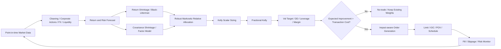
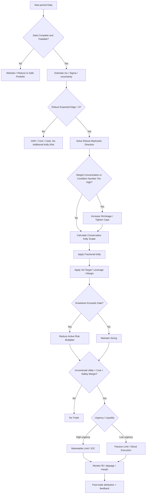

## Executive Summary

The core conclusion of this report is: **Markowitz and Kelly are not two mutually exclusive asset-allocation philosophies; rather, they can be divided into two layers: “portfolio direction” and “total risk scale.”** The Markowitz mean-variance framework is well suited to deciding “how capital should be diversified across assets,” while the Kelly criterion is well suited to answering “how much total risk capital should be committed to this set of investment opportunities.” Under small returns, approximately elliptical distributions, or continuous-time settings, the two even share the same $$\Sigma^{-1}\mu$$ structure; Kelly can be viewed as a mean-variance solution under a particular risk-aversion coefficient, while fractional Kelly corresponds to increasing the degree of risk aversion. Markowitz (1952) established the mean-variance portfolio-selection framework, Kelly (1956) used expected logarithmic wealth growth as the criterion for long-term capital growth, and Merton later extended utility maximization and dynamic asset allocation to continuous time. [Markowitz (1952)](https://onlinelibrary.wiley.com/doi/10.1111/j.1540-6261.1952.tb01525.x) [Kelly (1956)](https://onlinelibrary.wiley.com/doi/abs/10.1002/j.1538-7305.1956.tb03809.x) [Merton (1969)](https://www.hbs.edu/faculty/Pages/item.aspx?num=5096) [Merton (1971)](https://www.sciencedirect.com/science/article/pii/002205317190038X)

But **directly feeding sample mean returns and the sample covariance matrix into an optimizer and then applying full Kelly is one of the approaches that should least be put into live production**. Mean-estimation error is amplified by the optimizer; out-of-sample research by DeMiguel, Garlappi, and Uppal even found that many optimized models did not consistently beat the simple $$1/N$$ allocation, highlighting the practical destructiveness of estimation error. Bayes-Stein, Black–Litterman, Ledoit–Wolf covariance shrinkage, weight constraints, norm regularization, and robust optimization should be treated as basic production components rather than optional academic embellishments. [DeMiguel, Garlappi & Uppal (2009)](https://academic.oup.com/rfs/article-abstract/22/5/1915/1592901) [Jorion (1986)](https://www.cambridge.org/core/journals/journal-of-financial-and-quantitative-analysis/article/bayesstein-estimation-for-portfolio-analysis/B7D5C6C54432BDE3F8E3B107E68B0E1E) [Ledoit & Wolf (2004)](https://www.sciencedirect.com/science/article/pii/S0047259X03000964) [Jagannathan & Ma (2003)](https://onlinelibrary.wiley.com/doi/abs/10.1111/1540-6261.00580) [DeMiguel et al. (2009)](https://pubsonline.informs.org/doi/10.1287/mnsc.1080.0986) [Goldfarb & Iyengar (2003)](https://pubsonline.informs.org/doi/10.1287/moor.28.1.1.14260)

Therefore, the production-grade architecture recommended in this report is:

> **Shrinkage / Bayesian return model → robust Markowitz determines relative weights → robust fractional Kelly determines total exposure → volatility target / drawdown / leverage / margin overlays → transaction-cost-aware no-trade decision → impact-aware execution.**

This architecture is more suitable for live trading than “direct Kelly” because fractional Kelly itself is a trade-off between growth rate and capital security; MacLean, Ziemba, and Blazenko (1992) explicitly constructed the growth-versus-security trade-off using fractional Kelly, while Busseti, Ryu, and Boyd (2016) further added a drawdown-probability constraint to Kelly and showed a direct connection between its quadratic approximation and Markowitz mean-variance. [MacLean, Ziemba & Blazenko (1992)](https://pubsonline.informs.org/doi/10.1287/mnsc.38.11.1562) [Busseti, Ryu & Boyd (2016)](https://arxiv.org/abs/1603.06183)

**Recommended initial engineering parameters, not universal laws**: for medium- to low-frequency multi-asset strategies, one can start with mean-return shrinkage of $$60\%-90\%$$, Ledoit–Wolf covariance shrinkage or $$30\%-70\%$$ target shrinkage, fractional Kelly $$f=0.25\sim0.50$$, a portfolio volatility target of roughly $$8\%-12\%$$, and an initial gross-exposure cap of roughly $$1.0\sim1.25\times$$, then use walk-forward and stress testing to decide whether to relax them. These values are engineering starting points in this report; **they are not literature-claimed optimal constants, and they are not personal investment advice**.

The six-asset simulation built in this report also illustrates why this should be done. On one fixed 25-year out-of-sample simulation path, full Kelly with a 2× gross-exposure cap produced approximately **38.2% annualized volatility and a −66.8% maximum drawdown**, while the hybrid strategy, after adding strong shrinkage, 0.35 fractional Kelly, a 10% volatility target, and a 1.2× exposure cap, fell to approximately **9.9% annualized volatility and a −15.7% maximum drawdown**. This is only a simulation example, not historical ETF performance, but it precisely demonstrates the engineering focus of this report: **the most valuable use of Kelly is sizing, not allowing noisy forecasts to amplify leverage without limit.**

## Theoretical Foundations and a Unified Mathematical Framework

**Markowitz mean-variance.** Let the weights of $$n$$ risky assets be $$w\in\mathbb R^n$$, the expected-return vector be $$\mu$$, and the covariance matrix be $$\Sigma\succeq0$$. The most canonical form is:

$$
\begin{aligned}
\min_w\quad & \frac12w^\top\Sigma w\\
\text{s.t.}\quad&
w^\top\mu\ge \mu^*,\\
&\mathbf 1^\top w=1,\\
&w\in\mathcal W .
\end{aligned}
$$

Here, $$\mathcal W$$ can contain constraints such as long-only, single-asset caps, sector exposure, gross leverage, and tracking error. The equivalent utility form is:

$$
\max_w\quad
\mu^\top w-\frac{\gamma}{2}w^\top\Sigma w ,
$$

where $$\gamma>0$$ is the risk-aversion coefficient. This is a standard convex quadratic program; if there are only linear equality and inequality constraints, it can be solved with interior-point methods, active-set methods, OSQP-type QP solvers, or sequential quadratic programming. Markowitz’s 1952 paper established the foundation for portfolio selection using expected returns and variance. [Markowitz (1952)](https://onlinelibrary.wiley.com/doi/10.1111/j.1540-6261.1952.tb01525.x)

When there are no other constraints and $$\Sigma$$ is positive definite, define

$$
A=\mathbf 1^\top\Sigma^{-1}\mathbf 1,\qquad
B=\mathbf 1^\top\Sigma^{-1}\mu,\qquad
C=\mu^\top\Sigma^{-1}\mu,\qquad
D=AC-B^2,
$$

then the minimum variance for a target return $$r_p$$ is

$$
\sigma_p^2
=
\frac{Ar_p^2-2Br_p+C}{D}.
$$

This is the hyperbolic structure of the traditional efficient frontier. If a risk-free rate $$r_f$$ exists, the direction of the unconstrained tangency portfolio is:

$$
w_T
=
\frac{
\Sigma^{-1}(\mu-r_f\mathbf1)
}{
\mathbf1^\top\Sigma^{-1}(\mu-r_f\mathbf1)
}.
$$

The truly difficult part is therefore usually not the QP solver, but $$\mu$$ and $$\Sigma$$ themselves. Ledoit–Wolf (2004) proposed a well-conditioned covariance shrinkage estimator; Jorion’s Bayes-Stein method directly targets mean-return estimation error, using empirical Bayes to shrink extreme sample means toward a common center. [Ledoit & Wolf (2004)](https://www.sciencedirect.com/science/article/pii/S0047259X03000964) [Jorion (1986)](https://www.cambridge.org/core/journals/journal-of-financial-and-quantitative-analysis/article/bayesstein-estimation-for-portfolio-analysis/B7D5C6C54432BDE3F8E3B107E68B0E1E)

**Kelly criterion.** If the vector of excess simple returns on risky assets over one period is $$X$$, investment exposure is $$w$$, and wealth changes according to

$$
\frac{W_{t+1}}{W_t}=1+w^\top X,
$$

then the Kelly problem is:

$$
\max_w\quad
E[\log(1+w^\top X)]
$$

subject to

$$
1+w^\top X>0
$$

for all possible states, with additional real-world constraints such as leverage, shorting, and margin. Kelly’s original 1956 paper connected information theory with maximizing the long-run rate of capital growth; subsequent log-optimal / capital-growth literature broadly extended it to investment problems. [Kelly (1956)](https://onlinelibrary.wiley.com/doi/abs/10.1002/j.1538-7305.1956.tb03809.x) [MacLean, Ziemba & Blazenko (1992)](https://pubsonline.informs.org/doi/10.1287/mnsc.38.11.1562)

If returns are sufficiently small, we can use

$$
\log(1+x)\approx x-\frac{x^2}{2},
$$

so that:

$$
E[\log(1+w^\top X)]
\approx
w^\top\mu_X-\frac12w^\top\Sigma w.
$$

Without constraints, this gives:

$$
\boxed{
w_K=\Sigma^{-1}\mu_X
}
$$

which has exactly the same direction as the Markowitz solution:

$$
w_{MV}
=
\frac1\gamma\Sigma^{-1}\mu_X.
$$

Therefore, under this approximation:

$$
\boxed{
w_{MV}=f w_K,\qquad f=\frac1\gamma
}
$$

In other words, **fractional Kelly can be understood as Kelly under a mean-variance / CRRA world after increasing the degree of risk aversion**. Merton’s continuous-time model provides a more general foundation for dynamic utility maximization. [Merton (1969)](https://www.hbs.edu/faculty/Pages/item.aspx?num=5096) [Merton (1971)](https://www.sciencedirect.com/science/article/pii/002205317190038X)

For the full Kelly solution $$w_K$$, define its theoretical signal strength as

$$
S^2=\mu_X^\top\Sigma^{-1}\mu_X.
$$

If Kelly exposure is scaled to $$fw_K$$, then under the quadratic approximation the excess log-growth is:

$$
g(f)
=
\left(f-\frac12f^2\right)S^2.
$$

Thus, the growth premium at $$f=1$$ is $$0.5S^2$$, while at $$f=0.5$$ it is $$0.375S^2$$; that is, **in theory, half Kelly retains 75% of the maximum quadratic-approximation growth premium while its exposure variance is only 25% of full Kelly’s**. This is precisely the engineering appeal of fractional Kelly, but it must be emphasized that this 75%/25% relationship holds only under the above quadratic approximation and fixed parameters; real fat tails, transaction costs, and forecast error will change the result. The dynamic analysis by MacLean et al. formally studied the growth-security trade-off of fractional Kelly. [MacLean, Ziemba & Blazenko (1992)](https://pubsonline.informs.org/doi/10.1287/mnsc.38.11.1562)

**From single-period to multi-period.** Traditional Markowitz is primarily a single-period allocation problem; Kelly is inherently concerned with multiplicative wealth accumulation, but the simplest Kelly setting may still assume that the opportunity distribution is stable in every period. The multi-period convex trading framework of Boyd et al. plans multiple future trading periods at each decision point, executes only the first step, and then re-optimizes as new information arrives, effectively using model predictive control; the objective function simultaneously includes expected return, risk, transaction costs, and holding/borrowing costs. [Boyd et al. (2017, arXiv)](https://arxiv.org/abs/1705.00109) [Boyd et al. (2017, Stanford)](https://web.stanford.edu/~boyd/papers/cvx_portfolio.html)

After unification, a more production-like allocation problem can be written as:

$$
\begin{aligned}
\max_{w_t}\quad&
\widetilde\mu_t^\top w_t
-
\frac{\gamma}{2}w_t^\top\widetilde\Sigma_t w_t\\
&-\epsilon_\mu
\left\|
Q_t^{1/2}w_t
\right\|_2
-c^\top|w_t-w_{t-1}|\\
&-\frac12(w_t-w_{t-1})^\top
H_t(w_t-w_{t-1})\\[3pt]
\text{s.t.}\quad&
\mathbf1^\top w_t\le L_t,\\
&l_i\le w_{i,t}\le u_i,\\
&A_w w_t\le b_w .
\end{aligned}
$$

The first line is Markowitz; the first half of the second line is the robust penalty for forecast uncertainty, and the second half is linear turnover cost; the third line represents a quadratic market-impact / liquidity penalty. Goldfarb–Iyengar showed that robust portfolio-selection problems under multiple parameter-uncertainty sets can be transformed into second-order cone programs; Lobo, Fazel, and Boyd showed that linear transaction costs and many risk constraints can still be handled efficiently with convex optimization, while discontinuous costs such as fixed transaction fees make the problem harder. [Goldfarb & Iyengar (2003)](https://pubsonline.informs.org/doi/10.1287/moor.28.1.1.14260) [Lobo, Fazel & Boyd (2007)](https://web.stanford.edu/~boyd/papers/portfolio.html)

## Model Comparison, Major Limitations, and Important Extensions

| Dimension | Markowitz / MV | Kelly | Robust / Hybrid |
|---|---|---|---|
| Objective function | $$E[R]-\gamma Var(R)/2$$ | Maximize $$E[\log W]$$ | robust expected utility / growth, net of costs |
| Primary risk measure | Variance, tracking error | ruin / wealth-growth distribution implicit in log utility | variance + CVaR + drawdown + uncertainty |
| Single-period / multi-period | Original form mainly single-period | Inherently suited to repeated multiplicative wealth | MPC / scenario can be multi-period |
| Risk preference | $$\gamma$$ explicit | Fixed log-utility preference | $$\gamma,f,\epsilon$$, CVaR limits, etc. |
| Leverage | Controlled by constraints | Full Kelly often produces high exposure | fractional Kelly + leverage/margin cap |
| Mean-return error | Extremely sensitive | Equally sensitive, and directly amplifies sizing | shrinkage + robust lower bound |
| Covariance error | Can produce extreme weights | $$\Sigma^{-1}$$ similarly amplifies error | LW shrinkage / factor / regularization |
| Transaction costs | Ignored in the original model | Ignored in the original model | Directly included in objective / no-trade band |
| Drawdown | Not a direct objective | Full Kelly DD can be very deep | fractional / risk-constrained Kelly / throttle |
| Rebalancing | Specified by the user | Can update whenever the opportunity set changes | Determined by alpha decay, costs, and risk triggers |
| Tail risk | Variance is incomplete | Exact log can reflect the full distribution, but mis-estimating the distribution is dangerous | CVaR / scenario / DRO |
| Main advantage | Diversification and convexity are clear | Sizing and long-run growth principle are clear | Most suitable for live implementation |
| Main disadvantage | garbage-in optimizer-out | overbetting is extremely dangerous under forecast error | More complex, more parameters, requires governance |

**Estimation error is the shared Achilles’ heel of both frameworks.** From

$$
w_K=\Sigma^{-1}\mu
$$

a first-order differential gives:

$$
dw
\approx
\Sigma^{-1}d\mu
-
\Sigma^{-1}(d\Sigma)w.
$$

Therefore, whenever $$\Sigma$$ is close to singular and the condition number is large, small forecast errors can become large weight errors. This is the mathematical reason covariance shrinkage, return shrinkage, weight caps, and robust uncertainty sets have value. Ledoit–Wolf improve large-dimensional covariance estimation through shrinkage, Jagannathan–Ma show that even “wrong” nonnegative-weight constraints can reduce sample-estimation error, and DeMiguel et al. build a general regularization framework from norm constraints. [Ledoit & Wolf (2004)](https://www.sciencedirect.com/science/article/pii/S0047259X03000964) [Jagannathan & Ma (2003)](https://onlinelibrary.wiley.com/doi/abs/10.1111/1540-6261.00580) [DeMiguel et al. (2009)](https://pubsonline.informs.org/doi/10.1287/mnsc.1080.0986)

More importantly, the out-of-sample comparison by DeMiguel, Garlappi, and Uppal across 14 models and seven empirical datasets found that none of the tested optimization methods consistently outperformed $$1/N$$ in Sharpe ratio, certainty-equivalent return, or turnover. This does not mean that “optimization is useless”; rather, it means that **forecast estimation and regularization are the parts that truly determine whether an optimizer is useful**. [DeMiguel, Garlappi & Uppal (2009)](https://academic.oup.com/rfs/article-abstract/22/5/1915/1592901)

Important extensions can be viewed as engineering patches at different layers:

| Problem | Representative method | Use in a production environment |
|---|---|---|
| Unreliable means | Jorion Bayes-Stein | Shrink noisy sample means toward a common prior |
| Subjective views and market equilibrium | Black–Litterman | Use equilibrium prior + confidence-weighted views to produce $$\mu$$ |
| Unstable covariance | Ledoit–Wolf | Covariance shrinkage, improve conditioning |
| Weight explosion | Jagannathan–Ma; norm constraints | long-only, box / L1 / L2 regularization |
| Model-parameter uncertainty | Goldfarb–Iyengar robust optimization | Conservative allocation against worst-case mean/covariance |
| Distribution itself is uncertain | Wasserstein DRO | Optimize over a distribution set around the empirical distribution |
| Tail losses | Rockafellar–Uryasev CVaR | scenario-based tail-risk objective |
| Kelly drawdown | Risk-Constrained Kelly | Control capital-growth strategy using drawdown probability |
| Costs and turnover | Lobo–Fazel–Boyd | Directly include transaction costs in the objective |
| Dynamic costs | Gârleanu–Pedersen | Do not jump to target at once; trade partially toward the aim portfolio |
| Multi-period trading | Boyd et al. MPC | Look ahead at future forecast/cost, then rolling re-optimize |
| Execution impact | Almgren–Chriss | execution cost vs price-risk frontier |

Black–Litterman’s original work provides a portfolio-optimization method that starts from market equilibrium and then incorporates investor views; Goldfarb–Iyengar explicitly transform statistical/model uncertainty into a robust-optimization problem. [Black & Litterman (1992)](https://www.tandfonline.com/doi/abs/10.2469/faj.v48.n5.28) [Goldfarb & Iyengar (2003)](https://pubsonline.informs.org/doi/10.1287/moor.28.1.1.14260) Wasserstein distributionally robust mean-variance further addresses distribution uncertainty using a set of distributions around the empirical measure; related models can be represented as mean-variance problems with additional regularization. [Blanchet, Chen & Zhou (2022)](https://pubsonline.informs.org/doi/10.1287/mnsc.2021.4155)

CVaR is another important path. The Rockafellar–Uryasev method makes it possible to directly minimize CVaR through scenario-based optimization, which is often more natural than pure variance for strategies with skew, fat tails, or option-like payoffs. [Rockafellar & Uryasev (2000)](https://www.risk.net/journal-risk/2161159/optimization-conditional-value-risk)

**Kelly’s greatest limitation is not mathematics, but epistemic uncertainty: do you truly know the win probability and payoff distribution?** Full Kelly assumes that the input probability model is sufficiently accurate; if expected returns are overestimated, tail losses are underestimated, or correlations rise during crises, the errors directly become overbetting. Risk-constrained Kelly by Busseti et al. adds a wealth-drawdown probability constraint at precisely this point and puts growth and drawdown risk into the same convex framework. [Busseti, Ryu & Boyd (2016)](https://arxiv.org/abs/1603.06183)

Local Taiwan research repeatedly encounters the same issue. A Chinese-language master’s thesis at National Chengchi University compares sample covariance, decay-rate covariance, and shrinkage covariance in terms of their effects on the Taiwan-market efficient frontier and GMV portfolio, using a rolling window for out-of-sample testing; Taiwan’s National Digital Library of Theses and Dissertations also contains research on applying Kelly to Taiwan index options strategies and stock asset allocation. These are **Taiwan-market application studies, not replacements for the theoretical foundations in the original international literature**. [Taiwan covariance/shrinkage study](https://ndltd.ncl.edu.tw/handle/94053036519007586000) [Kelly applied to Taiwan index options](https://ndltd.ncl.edu.tw/handle/w28k3x) [Kelly applied to stock asset allocation](https://ndltd.ncl.edu.tw/handle/88088298783190637748)

## Engineering Algorithms, Simulation Framework, and Numerical Example

**Recommended implementation workflow:**



The time logic from research to live trading should be:


**Pseudocode for the core hybrid allocator:**

```text
INPUT:
    historical_returns
    current_weights
    liquidity / transaction_costs
    risk_limits
    margin_limits
    prior_returns
    Kelly_fraction f

FOR each rebalance date t:

    # Forecast
    mu_hat     = estimate_expected_returns(history)
    Sigma_hat  = estimate_covariance(history)

    # Shrinkage
    mu_tilde =
        (1-rho_mu) * mu_hat
        + rho_mu * mu_prior

    Sigma_tilde =
        shrink_covariance(Sigma_hat)

    # Robust Markowitz direction
    w_direction = argmax_w [
        mu_tilde' w
        - uncertainty_penalty(w)
        - gamma/2 * w' Sigma_tilde w
        - linear_cost(w-current_weights)
        - impact_cost(w-current_weights)
    ]

    subject to:
        asset / sector bounds
        long-short bounds
        gross leverage cap
        liquidity limits

    # Convert direction to 1-D strategy return
    mu_p     = expected excess return of w_direction
    sigma_p  = forecast volatility of w_direction
    SE_mu_p  = estimation uncertainty of mu_p

    # Conservative edge
    mu_lower = mu_p - z_confidence * SE_mu_p

    IF mu_lower <= 0:
        kelly_size = 0
    ELSE:
        kelly_size = mu_lower / sigma_p^2

    # Fractional Kelly
    exposure = f * kelly_size

    # Portfolio risk overlays
    exposure = min(
        exposure,
        vol_target / sigma_p,
        leverage_cap,
        margin_cap,
        liquidity_cap
    )

    exposure *= drawdown_multiplier(current_drawdown)

    target_weights = exposure * w_direction

    # No-trade decision
    benefit = forecast utility improvement(target_weights)
    cost    = expected implementation cost(target_weights)

    IF benefit <= cost + safety_buffer:
        target_weights = current_weights

    # Execution
    generate impact-aware orders
    monitor fills, slippage, margin, intraday exposure
```

Here, it is especially recommended to use a **conservative Kelly edge**

$$
\mu_L=\widehat\mu_p-z_\alpha SE(\widehat\mu_p)
$$

instead of the point estimate:

$$
k^*_{\text{robust}}
=
\frac{\max(0,\mu_L)}{\widehat\sigma_p^2},
$$

and then apply:

$$
k_{\text{final}}
=
m_{DD}
\min
\left[
f\,k^*_{\text{robust}},
\frac{\sigma_{\text{target}}}{\widehat\sigma_p},
L_{\max},
L_{\text{margin}},
L_{\text{liq}}
\right].
$$

This is not the single standard formula from any one paper; rather, it combines a robust lower confidence bound, Kelly sizing, volatility targeting, and live constraints into a governable engineering rule.

**Minimum data requirements for simulation and backtesting.** For a real historical backtest, the data should preferably include total-return adjusted prices, delisted assets and historical constituents, point-in-time corporate actions, FX, bid/ask, trading volume and ADV, transaction fees/taxes, short borrow cost, funding/margin rates, and the actual tradable hours of each product; otherwise, the optimizer can easily obtain liquidity that did not exist in reality or introduce survivorship/look-ahead bias.

The estimation recommendation can be divided into four layers:

| Component | Baseline | Robust version |
|---|---|---|
| Expected return | rolling sample mean | Bayes-Stein, BL, factor forecast, ensemble |
| Covariance | sample covariance | Ledoit–Wolf, factor, EWMA, regime-conditioned |
| Distribution | Gaussian | Student-t, historical scenarios, regime mixture |
| Uncertainty | point estimate | bootstrap posterior / ellipsoid / Wasserstein DRO |

Ledoit–Wolf’s research specifically proposes a shrinkage estimator to address conditioning and accuracy problems of the sample covariance matrix in high-dimensional settings; Jorion reduces estimation risk from the mean side. [Ledoit & Wolf (2004)](https://www.sciencedirect.com/science/article/pii/S0047259X03000964) [Jorion (1986)](https://www.cambridge.org/core/journals/journal-of-financial-and-quantitative-analysis/article/bayesstein-estimation-for-portfolio-analysis/B7D5C6C54432BDE3F8E3B107E68B0E1E)

**Bootstrap / Monte Carlo.** At minimum, moving-block or stationary bootstrap should be used to preserve part of the time-series dependence, together with regime-switching / fat-tailed Monte Carlo to simulate stress combinations that “did not fully appear in history but are statistically plausible.” For every path, re-estimate $$\mu,\Sigma$$, re-optimize, and re-deduct costs, rather than fixing “true parameters” first and only sampling the next-period return; otherwise, estimation error cannot be measured.

**Walk-forward backtest.** At each point, only information prior to $$t$$ may be used:

$$
\widehat\theta_t
=
\mathcal E(R_{t-L:t-1}),
\qquad
w_t
=
\mathcal A(\widehat\theta_t,w_{t-1}),
$$

then use $$R_t$$ to calculate the true out-of-sample P&L:

$$
r_{p,t}
=
w_t^\top R_t
-C(\Delta w_t).
$$

If the strategy has relatively high turnover, the **post-return drifted weights** must be used as the next period’s pre-trade weights; the previous period’s target weights must not be used directly to calculate turnover.

**Numerical engineering example.** The following is not historical ETF performance; it is the reproducible simulation built in this report to isolate allocation/sizing mechanics. The setup contains six assets: U.S. equities, developed international equities, emerging-market equities, U.S. Treasuries, investment-grade bonds, and gold; there are 360 months of monthly data, with the first 60 months used for rolling estimation and the next 300 months used for walk-forward OOS. Returns use df=6 fat-tailed shocks and normal/stress Markov regimes; the fixed simulation seed is 7, and the stress state occupies approximately 12.5% of this path. The risk-free rate is assumed to be 2%, and the transaction cost is 10 bps per traded notional.

Strategies compared:

| Strategy | Setup |
|---|---|
| $$1/N$$ | Equal weight across six assets |
| GMV | long-only global minimum variance |
| MV-Shrink | mean 65% prior shrink, covariance 55% diagonal shrink, $$\gamma=5$$ |
| Kelly-full | quadratic Kelly, long-only, risky gross cap $$2\times$$ |
| Hybrid | mean 75% prior shrink, cov 60% shrink, mean uncertainty haircut, $$f=0.35$$, 10% vol target, 1.2× cap |

Simulation results:

| Strategy | CAGR | Annualized Volatility | Sharpe* | Maximum Drawdown | Annual Traded Notional / Capital | Average Gross Exposure |
|---|---:|---:|---:|---:|---:|---:|
| $$1/N$$ | 7.87% | 12.15% | 0.48 | −18.73% | 0.39× | 1.00× |
| GMV | 7.27% | 5.89% | **0.90** | **−8.55%** | 0.59× | 1.00× |
| MV-Shrink | 7.40% | 10.29% | 0.52 | −16.66% | 1.27× | 1.00× |
| Kelly-full | 5.91% | **38.23%** | 0.10 | **−66.81%** | **6.27×** | 2.00× |
| Hybrid | 6.56% | 9.88% | 0.46 | −15.71% | 1.07× | 0.70× |

\*The Sharpe in this simulation table is the simplified version $$(CAGR-r_f)/\sigma_{\text{ann}}$$; a formal empirical study should additionally report the standard Sharpe calculated from periodic mean excess returns, bootstrap confidence intervals, and multiple-testing adjustments.

This example does not deliberately make the hybrid strategy “win.” On the contrary, GMV has the best risk-adjusted performance on this path, while full Kelly performs the worst; this is exactly the attitude research should have: **do not use one attractive equity curve to prove that a model is correct.** The out-of-sample research by DeMiguel et al. likewise warns that complex optimization may not outperform simple allocation in the presence of estimation error. [DeMiguel, Garlappi & Uppal (2009)](https://academic.oup.com/rfs/article-abstract/22/5/1915/1592901)


Transaction-cost sensitivity is particularly noteworthy. When costs rise from 0 bps to 50 bps on this simulated path, $$1/N$$ CAGR falls from roughly 7.91% to 7.70%; GMV falls from 7.33% to 7.02%; MV-Shrink falls from 7.54% to 6.86%; Hybrid falls from 6.67% to 6.11%; but full Kelly falls sharply from 6.57% to 3.27%. The reason is not that the Kelly objective itself is “wrong,” but that noisy full-Kelly weights generate approximately 6.27× annual traded notional, causing turnover and forecast error to amplify each other.


Fractional Kelly sensitivity also illustrates the role of the exposure cap:

| $$f$$ | CAGR | Annualized Volatility | Maximum Drawdown | Average Gross Exposure |
|---:|---:|---:|---:|---:|
| 0.10 | 3.37% | 2.83% | −3.85% | 0.20× |
| 0.25 | 5.31% | 7.07% | −10.58% | 0.50× |
| 0.35 | 6.56% | 9.88% | −15.71% | 0.70× |
| 0.50 | 8.00% | 12.06% | −16.33% | 0.90× |
| 0.75 | 8.57% | 12.63% | −17.37% | 0.97× |
| 1.00 | 8.57% | 12.63% | −17.37% | 0.97× |

$$f=0.75$$ and $$1.0$$ are nearly identical in this example because the volatility / exposure constraints are already binding; this is also an important property of a production system: **the Kelly fraction should not be the only safety mechanism.**


The complete simulation outputs can be downloaded here: [Strategy summary CSV](/assets/portfolio_simulation_summary.csv), [Transaction-cost sensitivity CSV](/assets/portfolio_transaction_cost_sensitivity.csv), and [Fractional Kelly sensitivity CSV](/assets/portfolio_fractional_kelly_sensitivity.csv).

## Live Execution, Transaction Costs, and Risk Overlays

Portfolio optimization should not end at “target weights.” The true production objective should be:

$$
\text{Net Alpha}
=
\text{Forecast Alpha}
-
\text{Risk Cost}
-
\text{Spread}
-
\text{Market Impact}
-
\text{Fees/Taxes}
-
\text{Borrow/Funding}
-
\text{Delay/Slippage}.
$$

The transaction-cost portfolio model of Lobo, Fazel, and Boyd shows that linear costs and multiple risk constraints can preserve convexity; the dynamic trading model of Gârleanu–Pedersen, meanwhile, gives the principle of “do not jump to the target all at once,” but instead move gradually toward the aim portfolio according to return predictability and trading frictions. [Lobo, Fazel & Boyd (2007)](https://web.stanford.edu/~boyd/papers/portfolio.html) [Gârleanu & Pedersen (2013)](https://www.nber.org/papers/w15205)

A practical transaction-cost function is:

$$
C(\Delta w)
=
\underbrace{\sum_i s_i|\Delta w_i|}_{spread/fees}
+
\underbrace{
\frac12\Delta w^\top H\Delta w
}_{impact}
+
\underbrace{
\sum_i b_i|w_i^-|
}_{borrow/funding}.
$$

The $$L_1$$ cost naturally creates a no-trade region: if the forecast utility gain from a small weight change is insufficient to pay the spread, the trade should not be made. The quadratic term causes the marginal cost of large orders to rise.

Almgren–Chriss express optimal execution as a trade-off between execution price risk and permanent/temporary market impact, establishing an execution efficient frontier. Therefore, when moving from the portfolio optimizer to the execution engine, a large $$\Delta w$$ should be decomposed into multiple child orders instead of assuming that the target weight can be filled instantaneously at zero cost. [Almgren & Chriss (2001)](https://www.risk.net/journal-risk/2161150/optimal-execution-portfolio-transactions)

Practical order selection can use the following principles:

| Situation | Preferred method | Primary objective |
|---|---|---|
| Extremely high urgency / risk liquidation | market / aggressive IOC | Reduce timing risk |
| General rebalance | limit / marketable limit | Control price and completion rate |
| High liquidity, large order | POV/VWAP-like slicing | Reduce participation / impact |
| Must immediately obtain part of the quantity | IOC | Cancel the unfilled portion immediately |
| Only meaningful if completely filled at once | FOK | Avoid partial fill |
| Low urgency / high spread | passive limit | Reduce spread cost |

Under Taiwan Stock Exchange continuous trading, both limit and market orders are available, together with order instructions such as IOC and FOK; therefore, an execution simulator should not simply assume that “all quantity is filled at the closing price.” [TWSE trading system](https://www.twse.com.tw/zh/products/system/trading.html) [TWSE continuous trading](https://accessibility.twse.com.tw/zh/products/system/continuous-trading.html)

**For slippage backtesting, estimate the components separately:**

$$
Slippage
=
\frac12Spread
+
Impact(q,ADV,\sigma)
+
DelayCost
+
RandomResidual.
$$

Sensitivity tests should run at least low, medium, and high impact coefficients and impose a hard cap on volume participation, for example requiring that a single child order not exceed a certain strategy-specific proportion of tradable volume. Do not use one fixed “5 bps” cost to cover every asset and every volatility regime.

**Leverage and margin must be inside the optimizer, not checked only after the trade.** Using current Taiwan rules as an example, TWSE investor-education materials list a maximum margin-financing ratio of 60%, meaning a typical margin purchase requires 40% self-funded capital; the minimum short-sale margin ratio is listed as 90%, and the material explains a margin-call mechanism at an account maintenance ratio of 130%. Actual broker risk controls may be stricter, and specific securities may be adjusted separately. [TWSE margin trading guide](https://shl.twse.com.tw/page/library/trade/9.html) [TWSE margin-trading materials](https://shl.twse.com.tw/newsArticle/library/list/4028e4f68c5cc01e018c5cc658b30001)

Futures margin changes dynamically. For example, on the Taiwan Futures Exchange page **updated August 12, 2026**, the Taiwan Stock Index Futures settlement / maintenance / initial margins are listed as NT$519,000 / NT$538,000 / NT$701,000; Mini-TAIEX as NT$129,750 / NT$134,500 / NT$175,250; and Micro-TAIEX as NT$25,950 / NT$26,900 / NT$35,050. These figures should only be treated as a snapshot of the rules on 2026-08-12; a live risk engine should retrieve the latest margin table every day rather than hard-code it. [TAIFEX index futures margin](https://www.taifex.com.tw/cht/5/indexMargingDetail)

Therefore, the leverage cap that is truly usable by the strategy should be:

$$
L_{\text{usable}}
=
\min(
L_{\text{model}},
L_{\text{broker}},
L_{\text{exchange}},
L_{\text{margin-buffer}},
L_{\text{liquidity}}
).
$$

The margin buffer should not sit exactly at the maintenance requirement. Real stress conditions often come with rising volatility, converging correlations, greater market impact, and higher margin requirements, causing both model-based “diversification” and “financing capacity” to deteriorate at the same time.

Taiwan’s Financial Supervisory Commission has also specifically warned that leveraged / inverse ETFs are strategy-type exchange-traded products whose returns are affected by leverage, inverse operation, volatility, and compounding effects; therefore, the product’s nominal multiple should not simply be treated as a long-term portfolio leverage coefficient. [FSC leveraged/inverse ETF risk reminder](https://www.fsc.gov.tw/ch/home.jsp?dataserno=202311070003&dtable=News&id=96&mcustomize=news_view.jsp)

**Risk overlays.** I recommend treating the risk overlay as a hard layer of the sizing system that the alpha model cannot bypass:

$$
m_{\sigma,t}
=
\min\left(
1,
\frac{\sigma^*}{\widehat\sigma_t}
\right)
$$

This is the simplest volatility-target multiplier when the overlay is not allowed to actively add leverage; if leverage is allowed, replace 1 with $$L_{\max}$$.

A portfolio-level drawdown throttle can initially use an engineering-style step function:

| Current Peak-to-Trough DD | Suggested starting Active-Risk Multiplier |
|---:|---:|
| < 8% | 1.00 |
| 8–12% | 0.75 |
| 12–15% | 0.50 |
| 15–20% | 0.35 |
| > 20% | 0.25 or suspend active leverage |

These are not universally optimal thresholds; the purpose is to ensure that **model errors, regime shifts, and operational failures have an automatic risk-reduction mechanism**. Before formal deployment, the thresholds should be reverse-engineered from Monte Carlo ruin probability, time-under-water, and recovery period.

As for single-position stop-losses, they should not be applied unconditionally. Research by Kaminski and Lo shows that whether stop-loss rules add value depends on the underlying return dynamics; when there is no exploitable predictability, a simple stop-loss does not necessarily improve performance. Therefore, portfolio-level volatility/drawdown throttles are usually easier to make consistent with the allocation model than mechanically applying a fixed-percentage stop-loss to every asset. [Kaminski & Lo (2014)](https://dspace.mit.edu/entities/publication/bb69ca4b-0cdc-487f-831d-63b2e84fafee)

## Recommended Hybrid Strategy, Sensitivity Rules, and Live Decision Tree

What I recommend most is not choosing between “Markowitz vs Kelly,” but the following **Robust Markowitz + Conservative Fractional Kelly** framework.

First estimate:

$$
\widehat\mu_t,\quad
\widehat\Sigma_t .
$$

For the mean, use:

$$
\widetilde\mu_t
=
(1-\rho_\mu)\widehat\mu_t
+
\rho_\mu\mu_{\text{prior}},
$$

where the prior can be a Black–Litterman equilibrium, long-run asset-class risk premium, factor model, or strategy-specific Bayesian posterior; avoid directly trusting the rolling mean. The important value of Black–Litterman is precisely that it provides a way to combine equilibrium and views into expected returns. [Black & Litterman (1992)](https://www.tandfonline.com/doi/abs/10.2469/faj.v48.n5.28)

For covariance:

$$
\widetilde\Sigma
=
(1-\rho_\Sigma)\widehat\Sigma
+
\rho_\Sigma F,
$$

where $$F$$ may be diagonal, constant-correlation, or a factor target; in practice, it is even more advisable to use a data-driven Ledoit–Wolf shrinkage intensity directly. [Ledoit & Wolf (2004)](https://www.sciencedirect.com/science/article/pii/S0047259X03000964)

Next, solve for the robust direction:

$$
p_t=
\arg\max_p
\left[
\widetilde\mu^\top p
-
\epsilon_\mu\|Q^{1/2}p\|_2
-
\frac{\gamma}{2}p^\top\widetilde\Sigma p
-
C(p-p_{t-1})
\right].
$$

The connection between robust uncertainty sets and confidence regions is one of the core elements of the Goldfarb–Iyengar framework. [Goldfarb & Iyengar (2003)](https://pubsonline.informs.org/doi/10.1287/moor.28.1.1.14260)

Then **do not directly treat the optimizer’s weights as capital exposure**. First view $$p_t$$ as a “risk direction” and calculate:

$$
\widehat\mu_p=p_t^\top\widetilde\mu,
\qquad
\widehat\sigma_p^2=p_t^\top\widetilde\Sigma p_t.
$$

Then calculate the conservative Kelly scalar:

$$
k_t
=
f\frac{
\max(0,\widehat\mu_p-zSE(\widehat\mu_p))
}{
\widehat\sigma_p^2
}.
$$

Finally:

$$
w_t
=
p_t
\cdot
m_{DD,t}
\cdot
\min
\left(
k_t,
\frac{\sigma^*}{\widehat\sigma_p},
L_{\max},
L_{\text{margin}},
L_{\text{liq}}
\right).
$$

This makes Markowitz handle **cross-sectional diversification**, Kelly handle **capital sizing**, robust statistics handle **how much we do not know**, risk overlays handle **how to survive when the model is wrong**, and the execution model handle **the gap between the target and the actual fill**.

**Recommended initial parameter ranges:**

| Parameter | Research / initial deployment value | When to move in a more conservative direction |
|---|---:|---|
| Return shrinkage $$\rho_\mu$$ | 0.60–0.90 | Short horizon, small sample, unstable forecast IC |
| Covariance shrinkage | Ledoit–Wolf or 0.30–0.70 | High $$N/T$$, large condition number |
| Fractional Kelly $$f$$ | **0.25–0.50** | Fat tails, model drift, large estimation SE |
| Vol target | Approximately 8–12% | Low drawdown tolerance, high margin |
| Gross leverage cap | Start at 1.0–1.25× | Poor liquidity, volatile futures margin |
| Single-asset cap | Approximately 20–35% | Should be lower when assets are highly homogeneous |
| Rebalance | Monthly / weekly + no-trade band | Lower frequency when alpha half-life is long |
| DD throttle | Begin reducing exposure at 8–10% | Earlier when regime instability is high |
| Mean uncertainty $$z$$ | Approximately 0.5–1.5 | Increase when the forecast source is immature |
| Cost stress | base, 2×, 5× | Capacity-sensitive strategies must test 5× |

These are all **initialization grids**. The actual values adopted should be determined through nested walk-forward or a predefined train/validation/OOS process, with statistical correction for multiple parameter trials, rather than by selecting the result with the highest Sharpe.

**Sensitivity to estimation error** can be tested directly:

$$
\mu^{(s)}
=
\widehat\mu
+
s\cdot SE(\widehat\mu),
\qquad
s\in\{-2,-1,0,1,2\},
$$

and

$$
\Sigma^{(s)}
=
(1-s)\widehat\Sigma+sF.
$$

If a $$10\%-20\%$$ perturbation in the forecast causes the optimal weight to jump from 20% to 0% or 100%, then the allocation lacks production stability regardless of how high the in-sample Sharpe is.

**For leverage sensitivity**, do not look only at CAGR. You must simultaneously plot:

$$
L\quad\rightarrow\quad
\{
CAGR,\,
\sigma,\,
MDD,\,
ES_{95},\,
P(DD>20\%),\,
P(\text{margin call})
\}.
$$

Kelly theory pursues asymptotic log-growth; but real funds, companies, and individuals often have finite lifetimes, external redemptions, risk limits, and psychological/institutional drawdown constraints. Therefore, “maximum asymptotic growth” is often not the actual utility function. The fractional Kelly growth-security literature provides theoretical support for precisely this gap. [MacLean, Ziemba & Blazenko (1992)](https://pubsonline.informs.org/doi/10.1287/mnsc.38.11.1562)

The recommended live decision rules are as follows:



This process is especially useful for avoiding a common error: **using the same forecast to simultaneously determine asset selection, weight concentration, and leverage.** A production system should give every layer an independent limiter; otherwise, one forecast error can simultaneously create “the wrong asset selection, excessive concentration, and too much leverage.”

## Performance Validation, Statistical Tests, Literature Sources, and Final Recommendations

A complete strategy comparison should not look only at CAGR / Sharpe. At minimum, build the following scorecard:

| Category | Metrics |
|---|---|
| Return | CAGR, annualized arithmetic return, terminal wealth |
| Volatility | annualized volatility, downside deviation |
| Risk-adjusted | Sharpe, Sortino, Calmar |
| Tail | VaR, Expected Shortfall / CVaR, worst month |
| Drawdown | Max DD, average DD, time under water, recovery time |
| Trading | turnover, trades/year, capacity, fill ratio |
| Costs | fees, spread, impact, borrow, implementation shortfall |
| Leverage | avg/max gross, net exposure, margin utilization |
| Stability | weight dispersion, parameter sensitivity, regime performance |
| Statistical reliability | CI, p-value, DSR, SPA / Reality Check |

**Sharpe ratios across strategies should not be compared only by point estimates.** Ledoit–Wolf (2008) proposed robust inference / bootstrap methods for Sharpe-ratio performance hypothesis testing; under serial dependence and non-ideal distributions, these are more appropriate than simply assuming iid normal returns. [Ledoit & Wolf (2008)](https://www.sciencedirect.com/science/article/abs/pii/S0927539808000182)

If a large number of models, lookbacks, shrinkage settings, Kelly fractions, and stop thresholds are tested, the highest Sharpe will almost inevitably be affected by selection bias. White’s Reality Check is specifically designed to address data snooping; Hansen’s Superior Predictive Ability test improves the power of the Reality Check under certain conditions; Bailey–López de Prado’s Deflated Sharpe Ratio further adjusts the significance of Sharpe for multiple testing, selection bias, and non-normal returns. [White (2000)](https://onlinelibrary.wiley.com/doi/abs/10.1111/1468-0262.00152) [Hansen (2005)](https://www.tandfonline.com/doi/abs/10.1198/073500105000000063) [Bailey & López de Prado (2014, SSRN)](https://papers.ssrn.com/sol3/papers.cfm?abstract_id=2460551) [Bailey & López de Prado (2014, Journal of Portfolio Management)](https://www.pm-research.com/content/iijpormgmt/40/5/94)

Therefore, a rigorous strategy-approval gate can be defined as:

$$
H_0:
\text{Hybrid does not outperform benchmark net of costs}
$$

and require:

1. improvement in walk-forward OOS Sharpe / utility;
2. sufficiently stable block-bootstrap confidence intervals for the difference;
3. White Reality Check or Hansen SPA applied to the candidate family for data-snooping correction;
4. if many hyperparameters were tuned, also report the Deflated Sharpe Ratio;
5. the strategy still does not collapse under 2× and 5× execution-cost stress;
6. bootstrap / Monte Carlo tail drawdown and margin-call probability remain within the risk budget.

White (2000), Hansen (2005), and Bailey–López de Prado provide direct statistical tools for bias arising from searches across multiple strategies. [White (2000)](https://onlinelibrary.wiley.com/doi/abs/10.1111/1468-0262.00152) [Hansen (2005)](https://www.tandfonline.com/doi/abs/10.1198/073500105000000063) [Bailey & López de Prado (2014)](https://www.pm-research.com/content/iijpormgmt/40/5/94)

**The final recommendation can be condensed into five principles.**

First, **do not predict exact weights; predict relative edge, then shrink it.** Sensitivity to errors in $$\mu$$ is one of the core weaknesses of mean-variance optimization; Bayes-Stein, Black–Litterman, and robust uncertainty penalties are all closer to live-trading needs than raw historical means. [Jorion (1986)](https://www.cambridge.org/core/journals/journal-of-financial-and-quantitative-analysis/article/bayesstein-estimation-for-portfolio-analysis/B7D5C6C54432BDE3F8E3B107E68B0E1E) [Black & Litterman (1992)](https://www.tandfonline.com/doi/abs/10.2469/faj.v48.n5.28) [Goldfarb & Iyengar (2003)](https://pubsonline.informs.org/doi/10.1287/moor.28.1.1.14260)

Second, **use Markowitz to generate direction and Kelly to generate scale.** Applying one-dimensional Kelly sizing to a portfolio direction that is already diversified and robust is easier to govern than applying full Kelly separately to every noisy asset forecast.

Third, **Kelly should be fractional by default, rather than starting with full Kelly and waiting for risk controls to put out the fire.** For strategies that have not yet been validated across multiple regimes, $$f=0.25\sim0.50$$ is a reasonable research starting point; then reduce it further using forecast confidence, drawdown, volatility, margin, and liquidity. The theoretical purpose of fractional Kelly is precisely to establish a trade-off between growth and security. [MacLean, Ziemba & Blazenko (1992)](https://pubsonline.informs.org/doi/10.1287/mnsc.38.11.1562)

Fourth, **costs should change the target, not merely be deducted from backtest P&L.** If the optimizer first produces a target and only deducts 10 bps at the end, the model will continue requesting small trades that have no economic value. Linear / convex transaction costs should be placed directly in the objective so that the optimizer itself generates no-trade behavior; dynamic trading should move gradually toward the aim portfolio according to signal persistence and cost. [Lobo, Fazel & Boyd (2007)](https://web.stanford.edu/~boyd/papers/portfolio.html) [Gârleanu & Pedersen (2013)](https://www.nber.org/papers/w15205)

Fifth, **the true objective of a production strategy is not “maximum backtest Sharpe,” but maximizing utility that can survive estimation error, tail events, cost uncertainty, and operational constraints.** The out-of-sample results of DeMiguel et al., robust optimization, risk-constrained Kelly, and the multiple-testing literature all point to the same idea: the value of portfolio engineering is not finding the prettiest in-sample optimum, but reducing the sensitivity of the optimum to incorrect inputs. [DeMiguel, Garlappi & Uppal (2009)](https://academic.oup.com/rfs/article-abstract/22/5/1915/1592901) [Goldfarb & Iyengar (2003)](https://pubsonline.informs.org/doi/10.1287/moor.28.1.1.14260) [Busseti, Ryu & Boyd (2016)](https://arxiv.org/abs/1603.06183) [White (2000)](https://onlinelibrary.wiley.com/doi/abs/10.1111/1468-0262.00152)

**Priority literature and primary sources.** The table below is ordered from “original / foundational → important methodological extensions → live implementation / Taiwan.” Where an original author, journal, or official page is available, that source is prioritized.

| Priority | Literature / Source | Role | URL |
|---|---|---|---|
| A | Markowitz, H. (1952), *Portfolio Selection*, Journal of Finance | Original mean-variance paper | [Source](https://onlinelibrary.wiley.com/doi/10.1111/j.1540-6261.1952.tb01525.x) |
| A | Kelly, J. L. Jr. (1956), *A New Interpretation of Information Rate* | Original Kelly paper | [Source](https://onlinelibrary.wiley.com/doi/abs/10.1002/j.1538-7305.1956.tb03809.x) |
| A | Merton, R. C. (1969), *Lifetime Portfolio Selection under Uncertainty* | Continuous-time portfolio choice | [Source](https://www.hbs.edu/faculty/Pages/item.aspx?num=5096) |
| A | Merton, R. C. (1971), *Optimum Consumption and Portfolio Rules in a Continuous-Time Model* | Dynamic utility / portfolio choice | [Source](https://www.sciencedirect.com/science/article/pii/002205317190038X) |
| A | MacLean, Ziemba, Blazenko (1992), *Growth Versus Security in Dynamic Investment Analysis* | Fractional Kelly / growth-security | [Source](https://pubsonline.informs.org/doi/10.1287/mnsc.38.11.1562) |
| A | Black & Litterman (1992), *Global Portfolio Optimization* | Equilibrium prior + investor views | [Source](https://www.tandfonline.com/doi/abs/10.2469/faj.v48.n5.28) |
| A | Jorion (1986), *Bayes-Stein Estimation for Portfolio Analysis* | Return shrinkage | [Source](https://www.cambridge.org/core/journals/journal-of-financial-and-quantitative-analysis/article/bayesstein-estimation-for-portfolio-analysis/B7D5C6C54432BDE3F8E3B107E68B0E1E) |
| A | Ledoit & Wolf (2004), *A Well-Conditioned Estimator for Large-Dimensional Covariance Matrices* | Covariance shrinkage | [Source](https://www.sciencedirect.com/science/article/pii/S0047259X03000964) |
| A | Jagannathan & Ma (2003), *Risk Reduction in Large Portfolios: Why Imposing the Wrong Constraints Helps* | Constraints / estimation error | [Source](https://onlinelibrary.wiley.com/doi/abs/10.1111/1540-6261.00580) |
| A | Goldfarb & Iyengar (2003), *Robust Portfolio Selection Problems* | Robust SOCP | [Source](https://pubsonline.informs.org/doi/10.1287/moor.28.1.1.14260) |
| A | Rockafellar & Uryasev (2000), *Optimization of Conditional Value-at-Risk* | CVaR optimization | [Source](https://www.risk.net/journal-risk/2161159/optimization-conditional-value-risk) |
| A | DeMiguel, Garlappi & Uppal (2009), *Optimal Versus Naive Diversification* | $$1/N$$ and out-of-sample estimation risk | [Source](https://academic.oup.com/rfs/article-abstract/22/5/1915/1592901) |
| A | DeMiguel et al. (2009), *Improving Performance by Constraining Portfolio Norms* | Regularized portfolio optimization | [Source](https://pubsonline.informs.org/doi/10.1287/mnsc.1080.0986) |
| A | Busseti, Ryu & Boyd (2016), *Risk-Constrained Kelly Gambling* | Kelly + drawdown risk | [Source](https://arxiv.org/abs/1603.06183) |
| A | Lobo, Fazel & Boyd (2007), *Portfolio Optimization with Linear and Fixed Transaction Costs* | Cost-aware optimization | [Source](https://web.stanford.edu/~boyd/papers/portfolio.html) |
| A | Gârleanu & Pedersen (2013), *Dynamic Trading with Predictable Returns and Transaction Costs* | Dynamic aim portfolio | [Source](https://www.nber.org/papers/w15205) |
| A | Almgren & Chriss (2001), *Optimal Execution of Portfolio Transactions* | Market impact / execution frontier | [Source](https://www.risk.net/journal-risk/2161150/optimal-execution-portfolio-transactions) |
| A | Boyd et al. (2017), *Multi-Period Trading via Convex Optimization* | MPC / multi-period live trading | [Source](https://web.stanford.edu/~boyd/papers/cvx_portfolio.html) |
| A | Blanchet, Chen & Zhou (2022), *Distributionally Robust Mean-Variance Portfolio Selection with Wasserstein Distances* | Distributional robustness | [Source](https://pubsonline.informs.org/doi/10.1287/mnsc.2021.4155) |
| A | Ledoit & Wolf (2008), *Robust Performance Hypothesis Testing with the Sharpe Ratio* | Sharpe inference | [Source](https://www.sciencedirect.com/science/article/abs/pii/S0927539808000182) |
| A | White (2000), *A Reality Check for Data Snooping* | Multiple-model data snooping | [Source](https://onlinelibrary.wiley.com/doi/abs/10.1111/1468-0262.00152) |
| A | Hansen (2005), *A Test for Superior Predictive Ability* | SPA test | [Source](https://www.tandfonline.com/doi/abs/10.1198/073500105000000063) |
| B | Bailey & López de Prado (2014), *The Deflated Sharpe Ratio* | Backtest selection / non-normality correction | [Source](https://www.pm-research.com/content/iijpormgmt/40/5/94) |
| B | Kaminski & Lo (2014), *When Do Stop-Loss Rules Stop Losses?* | Conditional value of a stop-loss overlay | [Source](https://dspace.mit.edu/entities/publication/bb69ca4b-0cdc-487f-831d-63b2e84fafee) |
| TW | Taiwan Stock Exchange: Trading System Introduction | Taiwan equity order types and continuous-trading system | [Source](https://www.twse.com.tw/zh/products/system/trading.html) |
| TW | Taiwan Stock Exchange: Margin Trading Guide | Margin financing, short selling, and maintenance ratio | [Source](https://shl.twse.com.tw/page/library/trade/9.html) |
| TW | Taiwan Futures Exchange: Equity Index Margin Requirements | Current futures margin | [Source](https://www.taifex.com.tw/cht/5/indexMargingDetail) |
| TW | Financial Supervisory Commission ETF Risk Reminder | Leveraged / inverse ETFs, premiums/discounts, and product risk | [Source](https://www.fsc.gov.tw/ch/home.jsp?dataserno=202311070003&dtable=News&id=96&mcustomize=news_view.jsp) |
| TW | Yeh Kuan-Ting, *The Impact of Covariance Matrix Estimation Methods on the Efficient Frontier and Portfolios* | Taiwan-market covariance/shrinkage application | [Source](https://ndltd.ncl.edu.tw/handle/94053036519007586000) |
| TW | *A Study of Applying the Optimal Risk Proportion to Taiwan Index Option Portfolios* | Taiwan index options application of Kelly-like sizing | [Source](https://ndltd.ncl.edu.tw/handle/w28k3x) |
| TW | *Asset Allocation and Performance Analysis: Application of the Kelly Investment Method* | Taiwan research on Kelly in stock asset allocation | [Source](https://ndltd.ncl.edu.tw/handle/88088298783190637748) |

Overall, what is most worth taking live is neither pure Markowitz nor pure/full Kelly, but:

$$
\boxed{
\text{Shrinkage / Bayesian Forecast}
\rightarrow
\text{Robust Markowitz Direction}
\rightarrow
\text{Fractional Robust Kelly Sizing}
\rightarrow
\text{Vol/DD/Margin Constraints}
\rightarrow
\text{Cost-Aware Execution}
}
$$

The most important governance principle can be condensed into one sentence: **be conservative about forecasts, robust about covariance, discount Kelly, impose hard caps on leverage, optimize transaction costs ex ante, and allow drawdown to automatically reduce capital risk.**
