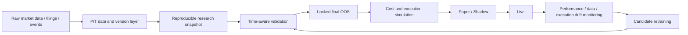
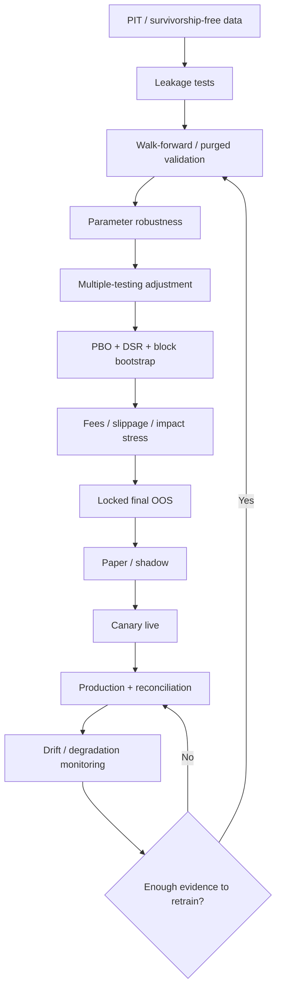

## Executive Summary

The most dangerous errors in quantitative backtesting are usually not incorrect model formulas, but rather that **the information set, model-selection process, and execution conditions simulated during research are more favorable than what a real trader could have obtained at the time**. As a result, a backtest with a high Sharpe ratio may simultaneously be inflated by missing point-in-time (PIT) data, survivorship bias, look-ahead bias, data leakage, repeated parameter tuning, multiple-hypothesis testing, and underestimated trading costs. CRSP explicitly preserves active and inactive securities, SEC EDGAR provides filing-time metadata, while Bailey, López de Prado, and others proposed PBO and the Deflated Sharpe Ratio (DSR); in essence, all of these address performance misjudgment caused by researchers “knowing too much and trying too much” ([CRSP US Stock Databases](https://www.crsp.org/research/), [CRSP Survivor-Bias-Free US Mutual Fund Database](https://www.crsp.org/research/), [SEC EDGAR Data Access](https://www.sec.gov/search-filings/edgar-search-assistance/accessing-edgar-data), [The Probability of Backtest Overfitting](https://papers.ssrn.com/sol3/Papers.cfm?abstract_id=2326253), [The Deflated Sharpe Ratio](https://papers.ssrn.com/sol3/papers.cfm?abstract_id=2460551)).

In practice, a backtest should be treated as a **historical market replay system**, not as `strategy(data)` applied to a fully cleaned table. At any decision time $$t$$, the research system may only see the data versions that had already been public at that time; models and preprocessing may only be fitted on training data; all hyperparameter selection must occur before an independent OOS period; and execution results must deduct the spread, fee, tax, borrow/funding, slippage, and market impact applicable at that time. Lo’s research on the Sharpe ratio further shows that even without data bias, time-series dependence alone is sufficient to make the traditional $$\sqrt{T}$$ annualization method misleading ([The Statistics of Sharpe Ratios](https://rpc.cfainstitute.org/research/financial-analysts-journal/2002/the-statistics-of-sharpe-ratios)).

The core conclusions of this report can be condensed into the following production principles:

| Issue | Common research practice | Production-grade practice | Main direction of distortion |
|---|---|---|---|
| Data | Latest data overwrite history | PIT / bitemporal snapshot | Performance upward |
| Universe | Stocks that still exist today | Historically investable universe at the time | Returns upward, DD downward |
| Time | random K-fold | walk-forward / purged time CV | Generalization performance upward |
| Tuning | Keep changing after seeing test | trial ledger + locked holdout | Sharpe upward |
| Statistics | Accept when $$p<0.05$$ | BH/Bonferroni, PBO, DSR | Significance upward |
| Execution | close-to-close, 0 cost | latency + fills + spread + impact | Returns upward |
| Launch | Deploy once backtest is done | paper/shadow → canary → live monitor | Degradation cannot be detected |

Harvey, Liu, and Zhu show that in a research environment with a large number of factor discoveries, the conventional threshold around $$t=2$$ is insufficient to deal with data mining; their research estimates that a new factor needs a much higher threshold, roughly $$t>3$$, to have a corresponding level of credibility. This is not a fixed “passing score” for every strategy, but an important warning about the severity of multiple testing in financial research ([… and the Cross-Section of Expected Returns](https://doi.org/10.1093/rfs/hhv059)).

Unless explicitly labeled as literature results, all small comparative performance tables below use **synthetic values for methodological illustration**. Their purpose is to demonstrate the direction of bias, not to claim that any Taiwan or U.S. equity strategy actually has those performance characteristics.

## Research Scope, Assumptions, and Validation Framework

Because no asset class or frequency was specified, this report adopts the following baseline assumptions. If applied to high-frequency, options, futures, crypto, or illiquid assets, mechanisms such as order-book queue, contract roll, funding, expiry, and borrow availability should be added. Event-driven Zipline documentation emphasizes event-by-event processing as a way to reduce look-ahead problems, while LEAN supports extending the same engine from research/backtesting into live trading; both are useful reference architectures for research-to-production consistency ([Zipline 3.0](https://zipline.ml4trading.io/), [LEAN](https://www.lean.io/)).

| Baseline assumption | Setting in this report |
|---|---|
| Assets | Relatively liquid stocks / ETFs, multi-asset cross-section |
| Frequency | Daily; signals generated after information becomes available |
| Execution | In principle execute at the next tradable time; do not assume the day’s close was known ex post |
| Annualization | About 252 trading days, with separate correction for serial correlation |
| Label | Examples often use $$t\rightarrow t+5$$ day forward return |
| Universe | Determined by listing / delisting / index eligibility at the time |
| Price | Total-return consistent, preserving corporate actions |
| Data time | Separate `event_time` and `available_at` |
| Costs | Fees, transaction tax, spread, slippage, impact, borrow/funding all included on a net basis |
| Model | Preprocessing, feature selection, and hyperparameter tuning all occur only on the training side |

The ideal research lifecycle is not a single “train/test split,” but the following closed loop:



scikit-learn’s `TimeSeriesSplit` explicitly requires training observations to precede test observations and provides `gap`, `max_train_size`, and `test_size`; skfolio additionally provides walk-forward and combinatorial purged CV. These tools can help construct the framework, but they cannot replace the correct definition of “when information truly became available” or “the information interval of a label” ([TimeSeriesSplit](https://sklearn.org/stable/modules/generated/sklearn.model_selection.TimeSeriesSplit.html), [skfolio model selection](https://github.com/skfolio/skfolio/blob/main/docs/user_guide/model_selection.rst)).

## Data Integrity and Information Timing

**1. Point-in-time datasets**

**Theory.** The core of PIT is not “historical data,” but rather: “at historical decision time $$t$$, return only the version of the data that market participants could already obtain before $$t$$.” Therefore, economic/event time and information/availability time must at minimum be separated. For example, the period end of the 2025 annual financial statements may be 2025-12-31, but the market could not know the complete annual report on that date; joining prices on period end would create look-ahead bias. The SEC EDGAR submissions/XBRL APIs are based on filing metadata and disseminated filings, and the SEC explicitly notes that some filings submitted later in the day may not be disseminated until the next business day. Therefore, a true availability timestamp cannot be simplified to the accounting period end ([SEC Developer Resources](https://www.sec.gov/about/developer-resources), [Accessing EDGAR Data](https://www.sec.gov/search-filings/edgar-search-assistance/accessing-edgar-data)).

The same applies to Taiwan research. TWSE Data E-Shop provides daily market and other end-of-day data, while MOPS is the disclosure system for listed, OTC, and public companies. TEJ’s Taiwan PIT materials also explicitly point out that financial-statement “announcement dates” and pre-restatement versions need to be retained, rather than backfilling history with financial data corrected later ([TWSE Data E-Shop](https://eshop.twse.com.tw/en/home/index), [MOPS Push Server Service](https://eshop.twse.com.tw/en/mops/about), [TEJ Point-in-Time database](https://www.tejwin.com/news/tej-point-in-time-%E6%8A%95%E8%B3%87%E7%94%A8%E8%B2%A1%E5%8B%99%E8%B3%87%E6%96%99%E5%BA%AB/)).

**Construction.** A recommended data model should preserve at least:

```text
entity_id
event_time          # Time the economic event belongs to, e.g. fiscal quarter end
available_at        # Time the market could actually obtain the information
value
revision_id
valid_from
valid_to
source
ingested_at
```

Decision data should use a backward as-of join on `available_at`:

```python
import pandas as pd

signals = signals.sort_values(["asset_id", "decision_at"])
fund = fundamentals.sort_values(["asset_id", "available_at"])

pit = pd.merge_asof(
    signals,
    fund,
    left_on="decision_at",
    right_on="available_at",
    by="asset_id",
    direction="backward",
    allow_exact_matches=True,
)

assert (pit["available_at"] <= pit["decision_at"]).all()
```

Large data platforms should go one step further and adopt **bitemporal storage**: one timeline describes “which date the information refers to,” and another describes “from which date the researcher knew it.” This makes it possible to reconstruct filing restatements, index constituent changes, ticker/name changes, and provider corrections. CRSP’s permanent identifiers (PERMNO/PERMCO) are an important example of avoiding mutable tickers as historical primary keys ([CRSP US Stock Databases](https://www.crsp.org/research/)).

**Common pitfalls.** The most common are using fiscal period end instead of filing date, using the latest restated fundamentals, using today’s index constituents to backtest ten years ago, directly using current ticker mappings, and assuming that values downloaded from a database today were always the same historically. Zipline’s data-bundle design even allows separate ingestions to be maintained, which is an engineering example of reproducible data versions ([Zipline Data Bundles](https://zipline.ml4trading.io/bundles.html)).

**Illustrative example: the same value factor.**

| Data method | Annual return | Sharpe | Max DD |
|---|---:|---:|---:|
| Latest financial-statement values backfilled into history | 16.8% | 1.37 | -19% |
| Announcement date but revisions ignored | 13.7% | 1.09 | -24% |
| Full PIT + revision | 11.9% | 0.91 | -28% |

**Recommended data.** Taiwan: TWSE Data E-Shop, MOPS, TIP constituent history, and TEJ PIT when full historical versions are required; United States: CRSP, CRSP/Compustat, SEC EDGAR. Universe, corporate actions, and fundamentals should all use permanent IDs and availability timestamps. The CRSP US Stock Database explicitly includes active and inactive securities and is therefore suitable for historical backtesting ([CRSP US Stock Databases](https://www.crsp.org/research/), [TWSE TIP constituent files](https://eshop.twse.com.tw/en/category/sub/61)).

**2. Survivorship bias**

**Theory.** If a 2010 strategy selects only from companies that are “still listed today,” it has already used future information: the researcher knows in advance which companies eventually survived. The mutual-fund research by Elton, Gruber, and Blake directly tracks disappearing funds and points out that fund disappearance is often associated with worse performance; CRSP therefore provides a Survivor-Bias-Free Mutual Fund Database that retains retired funds ([Survivor Bias and Mutual Fund Performance](https://doi.org/10.1093/rfs/9.4.1097), [CRSP Survivor-Bias-Free US Mutual Fund Database](https://www.crsp.org/research/)).

Stocks also have a more hidden **delisting-return bias**. Shumway finds that in historical CRSP data, stocks delisted for bankruptcy or other negative reasons frequently lack the correct delisting return, and the omitted terminal returns are large. Therefore, “including delisted stocks” does not by itself mean that survivorship bias has been completely corrected ([The Delisting Bias in CRSP Data](https://doi.org/10.1111/j.1540-6261.1997.tb03818.x)).

**Detection.**

```python
# Historical universe on date d should be determined by status at that time
eligible = securities[
    (securities["listed_at"] <= d) &
    (
        securities["delisted_at"].isna() |
        (d < securities["delisted_at"])
    )
]

# If almost no securities in the historical universe are later delisted, it is a major warning sign
future_delist_rate = eligible["delisted_at"].notna().mean()
```

IPO, merger, bankruptcy, ticker change, delisting code, and terminal cash/return should also be reconciled. CRSP/WRDS exposes fields such as Delisting Code and Delisting Return, demonstrating that these are not peripheral metadata that should be ignored.

If the provider’s definition requires combining normal return and delisting return, compounding may be used according to that version’s documentation:

```python
both = ret.notna() & dlret.notna()

ret_total = ret.copy()
ret_total[both] = (1 + ret[both]) * (1 + dlret[both]) - 1
ret_total[ret.isna()] = dlret[ret.isna()]
```

However, **do not blindly apply this formula across data versions**: the definition of the return field may change, so the relevant data-release documentation must be followed. Shumway’s core lesson is not “use one fixed line of code,” but that one must confirm whether negative delisting events actually enter portfolio return ([The Delisting Bias in CRSP Data](https://doi.org/10.1111/j.1540-6261.1997.tb03818.x)).

**Quantifying the impact.** The most direct method is to construct an A/B backtest:

$$
\Delta SR=SR_{\text{survivors-only}}-SR_{\text{PIT universe}},
$$

and simultaneously calculate differences and bootstrap CIs for CAGR, Sharpe, drawdown, tail loss, turnover, and factor alpha.

| Universe (synthetic illustration) | CAGR | Sharpe | Max DD |
|---|---:|---:|---:|
| Final survivors only | 14.2% | 1.14 | -21% |
| Include historically delisted companies | 11.5% | 0.90 | -28% |
| Also include terminal/delisting losses | 10.8% | 0.83 | -31% |

**Recommended data.** For the United States, prioritize CRSP active + inactive securities and CRSP Survivor-Bias-Free funds; for Taiwan stocks, require the provider to reconstruct historical listing, delisting, merger, and constituent changes rather than using today’s security master ([CRSP US Stock Databases](https://www.crsp.org/research/), [CRSP Survivor-Bias-Free US Mutual Fund Database](https://www.crsp.org/research/)).

**3. Look-ahead bias**

Look-ahead bias means that “a strategy at time $$t$$ uses information that was not yet available at $$t$$.” TEJ’s examples directly point out that using financial statements published or restated later for historical stock selection, or treating financial-statement period end as the information-availability date, are classic look-ahead problems ([TEJ quantitative-investment database](https://www.tejwin.com/news/tej%E6%8A%95%E8%B3%87%E7%94%A8%E8%B3%87%E6%96%99%E5%BA%AB_%E9%87%8F%E5%8C%96%E6%8A%95%E8%B3%87%E5%88%86%E6%9E%90%E6%87%89%E7%94%A8/)).

Common examples include: computing a signal using the same day’s close and assuming execution at that same close; using the complete 09:31 bar high/low/close for a decision at 09:31; using `rolling(..., center=True)`; allowing $$t+5$$ return to participate in feature selection at $$t$$; and backfilling history with the latest index membership.

```python
# Wrong: close_t generates the signal and close_t is also used as the execution price
df["signal_bad"] = (df["close"] > df["ma20"]).astype(int)

# More conservative: after close data is confirmed, hold from the next tradable period
df["signal"] = (df["close"] > df["ma20"]).astype(int)
df["position"] = df["signal"].shift(1)
df["strategy_ret"] = df["position"] * df["ret"]
```

The true rule should be expressed as a timestamp contract:

```python
assert (features["available_at"] <= features["decision_at"]).all()
assert orders["submit_at"].ge(signals["decision_at"]).all()
assert fills["fill_at"].ge(orders["submit_at"]).all()
```

| Execution assumption (illustrative) | Sharpe |
|---|---:|
| Generate signal from same-day close and execute at same close | 1.52 |
| Delay signal to next open | 1.08 |
| Next open + realistic slippage | 0.92 |

Automated **look-ahead unit tests** should be built instead of relying on code review. Event data in particular should verify `max(feature.available_at) <= decision_at`, while labels should only exist during model fitting for training observations whose outcomes have already fully realized.

**4. Data leakage**

Look-ahead is an important subset of leakage, but leakage is broader. Common forms include target leakage, temporal leakage, cross-fold preprocessing leakage, group/entity leakage, revision leakage, and **selection leakage** created when researchers repeatedly inspect the test set. Time-series workflows especially must not fit full-sample scaler, PCA, or feature selection before CV; the value of `TimeSeriesSplit` and sklearn-style pipelines is that transformation fitting is constrained to the training fold ([TimeSeriesSplit](https://sklearn.org/stable/modules/generated/sklearn.model_selection.TimeSeriesSplit.html)).

Wrong:

```python
# Full-sample mean/std have already seen the future
X_scaled = (X - X.mean()) / X.std()
score = cross_val_score(model, X_scaled, y, cv=cv)
```

Correct:

```python
from sklearn.pipeline import Pipeline
from sklearn.preprocessing import StandardScaler
from sklearn.linear_model import Ridge
from sklearn.model_selection import TimeSeriesSplit, cross_val_score

cv = TimeSeriesSplit(n_splits=5, gap=5)

pipe = Pipeline([
    ("scale", StandardScaler()),
    ("model", Ridge(alpha=10.0))
])

scores = cross_val_score(pipe, X, y, cv=cv)
```

If the label itself has a 5-day holding horizon, a simple `gap=5` can only handle a simple fixed horizon; event-based labels, triple-barrier labels, or varying holding periods require purging based on sample-specific information intervals. López de Prado’s related methods are designed precisely for overlapping labels and serial conditionality ([skfolio Combinatorial Purged CV](https://github.com/skfolio/skfolio/blob/main/docs/user_guide/model_selection.rst)).

**Detection methods** should include feature provenance audit, timestamp assertions, train-only transformation tests, permutation/negative-control tests, and a sanity check asking whether performance collapses after shifting the entire feature set back by one period. Extremely high classification accuracy or Sharpe should not be treated as good news; leakage should be suspected first.

| Model workflow (illustrative) | CV Sharpe | Final OOS Sharpe |
|---|---:|---:|
| Full-sample normalization | 1.41 | 0.69 |
| Fold-local preprocessing | 1.01 | 0.73 |
| Fold-local + purge/gap | 0.88 | 0.76 |

In this situation, the “worse CV” is actually the more credible estimate.

## Time Splitting and Validation Design

**5. In-sample and out-of-sample**

IS should be treated as the **model-development zone**, while OOS is the evidence that has not yet been used. If a researcher sees disappointing OOS results, changes the indicator, threshold, or universe, and then reruns the same OOS period, that period has effectively become IS. White’s research on data snooping points out that repeatedly using the same historical data for model selection itself creates chance winners ([A Reality Check for Data Snooping](https://doi.org/10.1111/1468-0262.00152)).

A production recommendation is a three-layer structure:

```text
Development train
        ↓
Time-aware validation / inner CV
        ↓
Frozen final OOS "vault"
```

```python
cut1 = pd.Timestamp("2022-01-01")
cut2 = pd.Timestamp("2025-01-01")

train = df[df.index < cut1]
validation = df[(df.index >= cut1) & (df.index < cut2)]
final_oos = df[df.index >= cut2]  # Does not participate in any model selection
```

The best practice is not a fixed 70/30 split, but to ensure that each segment contains enough regimes, trades, and market conditions. If the model requires tuning, nested time-aware validation should be performed within the training portion. `TimeSeriesSplit` uses successive training sets that accumulate earlier folds, naturally supporting anchored evaluation ([TimeSeriesSplit](https://sklearn.org/stable/modules/generated/sklearn.model_selection.TimeSeriesSplit.html)).

| Design (illustrative) | Validation SR | Final OOS SR |
|---|---:|---:|
| Random 80/20 | 1.48 | 0.67 |
| Chronological 80/20 | 0.94 | 0.72 |
| Nested temporal + locked OOS | 0.82 | 0.78 |

**6. Rolling / expanding windows**

Expanding window:

$$
Train_k=[t_0,t_k],\qquad Test_k=(t_k,t_k+H]
$$

It retains all old data, so statistical estimates are more stable, but it continuously carries old regimes into the model. Rolling window:

$$
Train_k=[t_k-W,t_k],\qquad Test_k=(t_k,t_k+H]
$$

It keeps only the most recent $$W$$ period, which often adapts better to drift, but it has fewer samples and higher estimation variance, and the window length itself can also be over-tuned. skfolio’s `WalkForward` supports both fixed train size and `expand_train`, while sklearn’s `max_train_size` can limit training history ([skfolio WalkForward](https://skfolio.org/generated/skfolio.model_selection.WalkForward.html), [TimeSeriesSplit](https://sklearn.org/stable/modules/generated/sklearn.model_selection.TimeSeriesSplit.html)).

```python
for test_start in test_starts:
    if expanding:
        train = df[df.index < test_start]
    else:
        train = df[
            (df.index >= test_start - train_window) &
            (df.index < test_start)
        ]

    test = df[
        (df.index >= test_start) &
        (df.index < test_start + test_window)
    ]
```

Windows should be defined using **trading calendars / timestamps** rather than simple row counts, because suspensions, holidays, IPOs, different market time zones, and panel data can all break the assumption that “252 rows = one year.” Event-driven engines such as Zipline therefore manage trading calendars explicitly ([Zipline API](https://zipline.ml4trading.io/api-reference.html)).

| Window (synthetic regime-change example) | OOS Sharpe | Turnover | Characteristics |
|---|---:|---:|---|
| Expanding | 0.78 | 42% | Stable but slow to react |
| Rolling 3 years | 0.95 | 61% | Adapts faster |
| Rolling 1 year | 0.69 | 94% | Variance too high |

What should really be examined is not which Sharpe is highest, but whether performance across $$W$$ forms a **broad plateau**. If only one precise window performs especially well, that is instead a warning sign of parameter overfitting.

**7. Walk-forward validation**

Walk-forward is the validation method closest to “letting the research model walk through history.” At each retraining time, fit only on data known at that time; then freeze the model and trade the next segment; after the test period ends, move time forward again. skfolio’s WalkForward documentation explicitly requires later test indices to occur after earlier ones, so shuffling does not apply ([skfolio WalkForward](https://skfolio.org/generated/skfolio.model_selection.WalkForward.html)).

**Standard process:**

1. Sort by `available_at` and construct PIT features.
2. Choose train window $$W$$, test horizon $$H$$, step $$S$$, and gap/purge $$G$$.
3. Fit scaler, feature selection, and model only on the training set.
4. If tuning is required, perform inner temporal CV only within the training set.
5. Freeze the candidate.
6. Predict and simulate execution over the next completely unseen period.
7. Move time forward by $$S$$.
8. Concatenate positions, fills, and PnL containing **only OOS** observations.
9. Only then calculate aggregate OOS metrics.

```python
oos = []

for t in cutoffs:
    tr = df[
        (df.index >= t - train_window) &
        (df.index <  t - gap)
    ]
    te = df[
        (df.index >= t) &
        (df.index <  t + test_horizon)
    ]

    model = build_pipeline()
    model.fit(tr[features], tr[target])

    pred = model.predict(te[features])

    pnl = execute_and_mark_to_market(
        predictions=pred,
        market_data=te,
        costs=cost_model,
    )

    oos.append(pnl)

oos_pnl = pd.concat(oos).sort_index()
```

If test windows overlap, the complete PnL of each window cannot simply be added together, otherwise the same day will be counted multiple times. The frozen model responsible for each timestamp should be defined in advance.

| Validation method (illustrative) | Estimated SR | Difference vs final live-like SR |
|---|---:|---:|
| Random CV | 1.52 | +0.66 |
| Single chronological holdout | 1.04 | +0.18 |
| Walk-forward | 0.89 | +0.03 |
| Simulated live | 0.86 | — |

The computational cost is substantially higher, and different folds use different models; but this is exactly what reflects production reality rather than a weakness.

**8. Time-series cross-validation**

Time-series CV should at least distinguish three types:

**Forward/blocked split** divides time into contiguous blocks, with training always occurring before testing; this is suitable for most forecasting deployments. `TimeSeriesSplit` belongs to this category ([TimeSeriesSplit](https://sklearn.org/stable/modules/generated/sklearn.model_selection.TimeSeriesSplit.html)).

**Gap CV** inserts temporal distance between train and test:

```python
cv = TimeSeriesSplit(
    n_splits=5,
    test_size=63,
    gap=5,
)
```

This is suitable when the label horizon is fixed and only a simple buffer is needed. scikit-learn also demonstrates the use of `gap` to separate train/test periods in time-series prediction examples ([TimeSeriesSplit](https://sklearn.org/stable/modules/generated/sklearn.model_selection.TimeSeriesSplit.html)).

**Purged CV** is not merely a gap based on observation timestamps; it excludes overlaps according to the **information lifecycle** of each label. It is particularly suitable for event labels, varying holding periods, and financial ML ([skfolio Combinatorial Purged CV](https://github.com/skfolio/skfolio/blob/main/docs/user_guide/model_selection.rst)).

| CV method | Preserves order | Handles overlapping labels | Use case |
|---|---|---|---|
| Random K-fold | No | No | Usually unsuitable for trading time series |
| Forward blocked | Yes | Partially | General forecasting |
| Gap TimeSeriesSplit | Yes | Fixed gap | Fixed horizon |
| Purged CV | Yes / by design | Yes | Event-based financial labels |

Note that dividing standard K-fold into contiguous blocks while allowing observations before and after the test block into training is not equivalent to “production OOS.” It may be suitable for estimating generalization of some stationary models, but if the research question is “could this have been traded at the time,” walk-forward usually better respects the causal time direction.

**9. Purged K-fold + embargo**

This is a core financial-ML method for dealing with overlapping information sets. López de Prado uses **purging** to remove training-side observations whose label information intervals overlap test labels; **embargo** adds an additional buffer after the test period to reduce serial dependence / information seepage near the test set ([skfolio Combinatorial Purged CV](https://github.com/skfolio/skfolio/blob/main/docs/user_guide/model_selection.rst)).

Let sample $$i$$ have the information interval:

$$
I_i=[t_{0,i},t_{1,i}].
$$

If a test sample $$j$$ satisfies

$$
I_i\cap I_j\neq\varnothing,
$$

then training sample $$i$$ should be purged.

Embargo additionally removes, for example:

$$
t_{0,i}
\in
\left(
\max_j t_{1,j},
\max_jt_{1,j}+E
\right].
$$

Simplified implementation:

```python
def purge_train(train, test, t0, t1, embargo):
    test_start = t0.loc[test].min()
    test_end   = t1.loc[test].max()

    overlap = (
        (t0.loc[train] <= test_end) &
        (t1.loc[train] >= test_start)
    )

    emb = (
        (t0.loc[train] > test_end) &
        (t0.loc[train] <= test_end + embargo)
    )

    return train[~(overlap | emb)]
```

The key parameter is not “everyone uses 5 days, so I also use 5 days.” **Purge should be determined by the label horizon; embargo should be determined by residual serial dependence, feature lookback, execution horizon, and sensitivity analysis.** CPCV goes one step further by combining different train/test fold configurations into multiple OOS paths, yielding a richer performance distribution than a single path ([skfolio model selection](https://github.com/skfolio/skfolio/blob/main/docs/user_guide/model_selection.rst)).

| 5-day forward-label example | CV Sharpe |
|---|---:|
| Ordinary K-fold | 1.42 |
| Time-blocked | 1.12 |
| Purged K-fold | 0.96 |
| Purged + 2-day embargo | 0.89 |

Using skfolio’s `CombinatorialPurgedCV` is recommended as an inspectable existing implementation, but the researcher must still ensure that sample information intervals are defined correctly ([skfolio model selection](https://github.com/skfolio/skfolio/blob/main/docs/user_guide/model_selection.rst)).

## Overfitting and Statistical Inference

**10. Parameter overfitting**

Parameter overfitting is not limited to neural networks. Parameters such as a 19/83-day moving average, RSI threshold 31.4, 7.2% stop loss, or top-13 ranking all create selection degrees of freedom as long as they were chosen from many historical trials. Research by Bailey and others points out that the more configurations are tried, the greater the risk of finding a historically optimal combination by chance ([The Probability of Backtest Overfitting](https://papers.ssrn.com/sol3/Papers.cfm?abstract_id=2326253), [A Reality Check for Data Snooping](https://doi.org/10.1111/1468-0262.00152)).

The following should be examined together:

`IS–OOS gap`, parameter-surface stability, sign consistency across folds, PBO, DSR, bootstrap CI, and performance degradation under parameter perturbation.

```python
grid = []
for fast in [10, 20, 30, 40]:
    for slow in [80, 100, 120, 140]:
        if fast >= slow:
            continue
        result = backtest(fast, slow)
        grid.append((fast, slow, result.sharpe))
```

Do not simply select the maximum value; first ask whether the surrounding values are also high. Ideal:

```text
0.8  0.9  0.9
0.9  1.0  0.9
0.8  0.9  0.8
```

Dangerous:

```text
0.1  0.2  0.1
0.2  2.4  0.0
0.1 -0.1  0.2
```

Regularization can reduce estimation variance—for example L1/L2/ElasticNet, feature shrinkage, coarser parameter grids, early stopping, turnover penalty, and cost-aware objectives—but regularization **cannot repair leakage or an incorrect OOS design**.

| Model (illustrative) | IS SR | OOS SR | IS–OOS gap |
|---|---:|---:|---:|
| 200-feature unconstrained | 2.10 | 0.31 | 1.79 |
| ElasticNet | 1.35 | 0.71 | 0.64 |
| 12-feature simple model | 1.09 | 0.79 | 0.30 |

**11. Multiple-hypothesis testing**

If $$m=1000$$ mutually independent strategies are tested and all are null, with each judged using 5% nominal significance, many false positives will arise intuitively. This is also the core problem raised by Harvey, Liu, and Zhu for the factor zoo ([… and the Cross-Section of Expected Returns](https://doi.org/10.1093/rfs/hhv059)).

**Bonferroni** controls the family-wise error rate:

$$
\alpha^*=\frac{\alpha}{m}.
$$

With 100 tests and $$\alpha=0.05$$, the threshold for each test becomes $$0.0005$$. It is very conservative, but appropriate for a small number of truly critical go/no-go hypotheses.

**Benjamini–Hochberg (BH)** controls the False Discovery Rate. Sort:

$$
p_{(1)}\le \cdots\le p_{(m)}
$$

and find the largest $$k$$ such that:

$$
p_{(k)}\le\frac{k}{m}q,
$$

then reject $$H_{(1)},\ldots,H_{(k)}$$. The original BH paper introduced FDR as a multiple-testing criterion with more power than FWER and proved its control under the corresponding conditions ([Controlling the False Discovery Rate](https://doi.org/10.1111/j.2517-6161.1995.tb02031.x)).

Python:

```python
from statsmodels.stats.multitest import multipletests

reject_bonf, p_bonf, _, _ = multipletests(
    pvals, alpha=0.05, method="bonferroni"
)

reject_bh, p_bh, _, _ = multipletests(
    pvals, alpha=0.05, method="fdr_bh"
)
```

The official statsmodels API supports Bonferroni and `fdr_bh`.

| 100 candidate factors (illustrative) | Judged effective |
|---|---:|
| raw $$p<0.05$$ | 17 |
| BH $$q=5\%$$ | 6 |
| Bonferroni 5% FWER | 2 |
| Then pass final OOS | 1 |

Financial strategies have an additional complication: strategy returns are often serially correlated, and strategy variants are also highly correlated with each other. Therefore, the raw $$p$$-values fed into multiple-testing procedures must themselves be reasonable—for example using HAC, block bootstrap, or another method that respects the dependence structure rather than a simple IID t-test. Lo’s Sharpe research is an important reason serial dependence cannot be ignored ([The Statistics of Sharpe Ratios](https://rpc.cfainstitute.org/research/financial-analysts-journal/2002/the-statistics-of-sharpe-ratios)).

**12. Probability of Backtest Overfitting (PBO)**

The purpose of PBO is not to estimate the “probability that the strategy loses money,” but to estimate: **the probability that the best configuration selected by the researcher in IS falls into the relatively worse half of the strategy set in OOS.** Bailey, Borwein, López de Prado, and Zhu proposed PBO / CSCV to directly address configuration-selection overfitting ([The Probability of Backtest Overfitting](https://papers.ssrn.com/sol3/Papers.cfm?abstract_id=2326253)).

Assume a performance matrix:

$$
M\in\mathbb{R}^{T\times N},
$$

where $$N$$ is the number of configurations explored.

Calculation process:

1. Divide $$T$$ into an even number $$S$$ of time blocks.
2. Enumerate the $$\binom{S}{S/2}$$ symmetric IS/OOS combinations.
3. For each split, find the configuration $$n^*$$ with the best IS performance.
4. Calculate the percentile rank $$\omega$$ of $$n^*$$ among the OOS configurations.
5. Calculate:

$$
\lambda=
\log\frac{\omega}{1-\omega}.
$$

6. PBO is the proportion for which $$\lambda<0$$, meaning the OOS rank falls below the median ([The Probability of Backtest Overfitting](https://papers.ssrn.com/sol3/Papers.cfm?abstract_id=2326253)).

Simplified pseudocode:

```python
from itertools import combinations
import numpy as np

lambdas = []

for is_blocks in combinations(range(S), S // 2):
    train_idx = concat_blocks(is_blocks)
    test_idx  = complement_blocks(is_blocks)

    sr_is  = sharpe_by_column(M[train_idx])
    sr_oos = sharpe_by_column(M[test_idx])

    winner = np.argmax(sr_is)

    omega = percentile_rank(
        sr_oos[winner],
        sr_oos
    )

    lambdas.append(np.log(omega / (1 - omega)))

pbo = np.mean(np.array(lambdas) < 0)
```

A design with $$S=8$$ has:

$$
\binom84=70
$$

symmetric splits.

Using the fixed-seed synthetic example in this report—20 configurations, 504 daily observations, 8 blocks—the result is approximately:

| Statistic | Synthetic result |
|---|---:|
| CSCV splits | 70 |
| PBO | 45.7% |
| Median OOS SR of the IS winner | -0.06 |
| Interpretation | The IS winner has nearly a 50% chance of falling into the worse half OOS |

PBO should not become another threshold that researchers “tune until it passes.” The point is to examine it together with DSR, OOS degradation, and the parameter surface. Low PBO is one necessary reassuring signal, but not a sufficient condition ([The Probability of Backtest Overfitting](https://papers.ssrn.com/sol3/Papers.cfm?abstract_id=2326253)).

**13. Deflated Sharpe Ratio**

An ordinary Sharpe ratio answers “how large is mean return relative to volatility,” but it does not answer “did you select the highest Sharpe from 500 strategies?” DSR corrects Sharpe significance for both **multiple-selection bias** and **non-normal returns** ([The Deflated Sharpe Ratio](https://papers.ssrn.com/sol3/papers.cfm?abstract_id=2460551), [The Sharpe Ratio Efficient Frontier](https://www.risk.net/journal-risk/2223785/sharpe-ratio-efficient-frontier)).

First define the approximation to the Probabilistic Sharpe Ratio:

$$
PSR(SR^*)=
\Phi
\left[
\frac{
(\widehat{SR}-SR^*)\sqrt{T-1}
}{
\sqrt{
1-\gamma_3\widehat{SR}
+
\frac{\gamma_4-1}{4}\widehat{SR}^2
}
}
\right],
$$

where:

- $$\gamma_3$$: skewness;
- $$\gamma_4$$: kurtosis;
- $$T$$: observations;
- $$SR^*$$: benchmark Sharpe.

DSR replaces $$SR^*$$ with the expected level of the “best Sharpe” under the null after accounting for $$N$$ strategy searches. Bailey and López de Prado therefore transform simple Sharpe significance into search-adjusted evidence ([The Deflated Sharpe Ratio](https://papers.ssrn.com/sol3/papers.cfm?abstract_id=2460551)).

A commonly used expected-max approximation is:

$$
SR_0
\approx
\sigma_{SR}
\left[
(1-\gamma)\Phi^{-1}
\left(1-\frac1N\right)
+
\gamma\Phi^{-1}
\left(1-\frac{e^{-1}}N\right)
\right],
$$

where $$\gamma\approx0.5772$$ is the Euler–Mascheroni constant; finally:

$$
DSR=PSR(SR_0).
$$

In practice, if 500 parameter variants are highly correlated, $$N=500$$ does not mean 500 independent research trials. A complete **trial ledger** should be preserved, and a conservative/effective trial count or the correlation structure among strategies should be used; one cannot record only the final winning configuration. This is exactly the selection process that DSR is designed to correct ([The Deflated Sharpe Ratio](https://papers.ssrn.com/sol3/papers.cfm?abstract_id=2460551)).

The following synthetic example uses 3 years of daily data, observed annualized SR=1.50, skew=-0.5, kurtosis=5, 50 effective trials, and trial Sharpe dispersion of about 0.4 annualized:

| Metric | Value |
|---|---:|
| Observed annualized SR | 1.50 |
| Approx. search-adjusted hurdle | 0.91 |
| Approx. DSR probability | 84% |
| Conclusion | Much weaker than raw SR=1.5; evidence is not yet extremely strong |

Pay special attention to frequency consistency: annualized Sharpe cannot be directly inserted into a formula using daily $$T$$. Lo shows that if returns are serially correlated, Sharpe also cannot be annualized unconditionally by multiplying by $$\sqrt{12}$$ or $$\sqrt{252}$$; in his hedge-fund example, ignoring serial correlation can materially overstate annual Sharpe ([The Statistics of Sharpe Ratios](https://rpc.cfainstitute.org/research/financial-analysts-journal/2002/the-statistics-of-sharpe-ratios)).

**14. Bootstrap**

Financial returns are not naturally IID, so random daily resampling often destroys time dependence such as momentum, mean reversion, and volatility clustering. Künsch’s block bootstrap and Politis–Romano’s stationary bootstrap were both designed to preserve local dependence ([The Jackknife and the Bootstrap for General Stationary Observations](https://www.jstor.org/stable/2241719), [The Stationary Bootstrap](https://doi.org/10.1080/01621459.1994.10476870)).

**Moving/block bootstrap** uses fixed or nearly fixed block lengths; **stationary bootstrap** concatenates random block lengths and produces a bootstrap sequence that preserves stationarity under appropriate conditions. `arch.bootstrap` provides `StationaryBootstrap` and also an optimal block-length estimator for stationary and circular bootstrap ([arch time-series bootstraps](https://arch.readthedocs.io/en/stable/bootstrap/timeseries-bootstraps.html), [optimal_block_length](https://arch.readthedocs.io/en/latest/bootstrap/generated/arch.bootstrap.optimal_block_length.html)).

```python
import numpy as np
from arch.bootstrap import StationaryBootstrap

def sharpe(r):
    return np.sqrt(252) * np.mean(r) / np.std(r, ddof=1)

bs = StationaryBootstrap(
    20,                    # mean block length
    returns.values,
    seed=42,
)

stats = []

for data in bs.bootstrap(2000):
    rb = data[0][0]
    stats.append(sharpe(rb))

lo, hi = np.quantile(stats, [0.025, 0.975])
```

For a path-dependent strategy, the **correlated full state unit** should be resampled rather than shuffling only the final PnL series. For example, joint blocks of position, return, spread, and cost need to remain aligned; otherwise the bootstrap CI will erase real execution dependence.

If the data are clearly nonstationary, stationary bootstrap should not be applied mechanically. Alternatives include regime-stratified blocks, rolling/local blocks, or stratifying by identifiable regimes before bootstrapping; block length itself should also undergo sensitivity analysis.

| Bootstrap (synthetic SR estimate) | 95% CI |
|---|---|
| IID daily | [0.61, 1.21] |
| 5-day blocks | [0.42, 1.27] |
| Stationary bootstrap | [0.35, 1.31] |
| Regime-stratified blocks | [0.24, 1.26] |

This example demonstrates a common phenomenon: once temporal dependence is preserved, the confidence interval may be wider than under IID assumptions.

## Trading Frictions and Live Degradation

**15. Realistic fees, slippage, and market impact**

The true net strategy return should at minimum be written as:

$$
r^{net}
=
r^{gross}
-
C_{fee}
-
C_{tax}
-
C_{spread}
-
C_{slippage}
-
C_{impact}
-
C_{borrow/funding}.
$$

Almgren–Chriss-style execution frameworks jointly incorporate execution cost and market risk into trade scheduling; later empirical impact literature finds that market impact often follows a markedly concave scaling relationship with trading volume, while research including Tóth and others discusses impact scaling close to a square-root law. These models should be treated as calibration starting points, not immutable natural laws across markets ([Optimal Execution of Portfolio Transactions](https://doi.org/10.21314/JOR.2001.041), [The square-root impact law also holds for option markets](https://arxiv.org/abs/1602.03043)).

A common research approximation is:

$$
C_{\text{spread}}
\approx
\frac{s}{2}Q,
$$

$$
I(Q)
\approx
Y\sigma\sqrt{\frac{Q}{ADV}},
$$

where $$s$$ is the bid-ask spread, $$Q$$ is trade size, $$\sigma$$ is volatility, ADV is average daily volume, and $$Y$$ must be calibrated using your own executions.

```python
import numpy as np

def transaction_cost(
    shares,
    price,
    spread_bps,
    sigma_daily,
    adv_shares,
    impact_y,
    explicit_rate=0.0,
):
    q = abs(shares)
    notional = q * price

    explicit = explicit_rate * notional

    spread = (
        0.5 * spread_bps * 1e-4 * notional
    )

    participation = max(q / adv_shares, 0.0)

    impact = (
        impact_y
        * sigma_daily
        * np.sqrt(participation)
        * notional
    )

    return explicit + spread + impact
```

For Taiwan equities in particular, the cost model must not hard-code “10 bps.” As of **August 27, 2026**, Ministry of Finance information shows that the securities transaction tax on ordinary stock sales is **3‰ of transaction value**; the preferential tax rate for eligible same-day stock day trading is currently **1.5‰, extended through December 31, 2027**. Corporate bonds and qualifying bond ETFs have separate tax-suspension periods. Therefore, instrument, trade type, and trade date should all enter the tax engine ([Securities Transaction Tax Act](https://law-out.mof.gov.tw/EngLawContent.aspx?id=20707&kwStr=&lan=E), [Taiwan stock-trading tax information](https://www.etax.nat.gov.tw/etwmain/tax-info/understanding/tax-knowledge/rwG2M1N)).

**Calibration** is best performed directly from production order/fill logs by calculating implementation shortfall:

$$
IS=
\frac{
P_{\text{fill}}-P_{\text{arrival}}
}{
P_{\text{arrival}}
}
\times sign(Q).
$$

Then bucket or regress by spread, volatility, ADV, participation rate, order type, time of day, duration, and venue. Limit-order fills also cannot assume that “if the historical low touches the limit, the order is 100% filled”; hypothetical execution and actual execution can differ materially ([Econometric Models of Limit-Order Executions](https://web.mit.edu/Alo/www/Papers/limit10.html)).

**Sensitivity tests** should at minimum include cost multipliers:

$$
0.5\times,\;1.0\times,\;1.5\times,\;2.0\times,
$$

as well as liquidity shocks, ADV participation caps, spread percentiles, latency, and partial fills.

| Cost assumption (synthetic) | CAGR | Sharpe |
|---|---:|---:|
| Gross / 0 cost | 19.0% | 1.54 |
| Fees + tax only | 16.1% | 1.29 |
| + spread/slippage | 12.7% | 1.02 |
| + calibrated impact | 10.4% | 0.84 |
| Stress: 2× slippage/impact | 6.2% | 0.51 |

For high-turnover alpha, cost is not a small constant deducted at the end; it may determine whether the strategy exists at all.

The most useful charts to draw are:

- **Gross vs net equity curve**;
- **turnover vs realized slippage**;
- **impact bps vs $$Q/ADV$$**;
- **Sharpe/CAGR vs cost multiplier**;
- **fill ratio vs participation/limit distance**.

**16. Live degradation**

Live degradation should be decomposed into at least four categories rather than monitoring only cumulative PnL:

**Performance drift**: changes in rolling alpha, Sharpe, hit rate, drawdown, and factor IC.

**Covariate/data drift**: changes in $$P(X)$$, such as volume, volatility, spread, or feature distributions moving away from the training baseline.

**Concept drift**: changes in $$P(Y|X)$$, meaning the previously effective predictor-return relationship has failed.

**Execution drift**: fill ratio, slippage, impact, rejects, latency, and borrow availability diverge from backtest assumptions.

ADWIN is a classic streaming change-detection method. It uses an adaptive window that expands while data remain stable and shrinks when changes are detected, without requiring a fixed drift time scale in advance; River provides a ready-made ADWIN implementation ([Learning from Time-Changing Data with Adaptive Windowing](https://www.cs.upc.edu/~gavalda/papers/adwin06.pdf), [River ADWIN](https://github.com/online-ml/river/blob/main/river/drift/adwin.py)).

```python
from river.drift import ADWIN

detector = ADWIN(delta=0.002)

for realized_error in live_errors:
    detector.update(realized_error)

    if detector.drift_detected:
        trigger_review()
```

However, drift detection should not directly mean “retrain immediately.” The cause may be a data-feed anomaly, execution-cost spike, temporary market shock, or genuine concept drift; perform root-cause analysis first, then decide whether to retrain.

The most effective production control is **live–shadow reconciliation**: every day, rerun the frozen model using the real data that were actually available in production that day to obtain a hypothetical OOS backtest, then compare it with actual live fills. QuantConnect’s reconciliation feature follows the same idea: compare the live equity curve in parallel with an OOS simulation over the same period to identify simulation/live divergence ([QuantConnect Live Reconciliation](https://www.quantconnect.com/docs/v2/research-environment/meta-analysis/live-reconciliation)).

```python
monitor = {
    "signal_diff": live_signal - shadow_signal,
    "fill_shortfall_bps": realized_fill_bps - modeled_fill_bps,
    "prediction_error": y_realized - y_pred,
    "feature_missing_rate": feature_missing_rate,
}

if (
    abs(monitor["fill_shortfall_bps"]) > cost_limit
    or feature_missing_rate > data_limit
):
    alert()
```

There is no universally optimal retraining cadence such as “once per month.” It should be jointly determined by three factors: the rate at which new labels accumulate, evidence of feature/concept drift, and turnover/cost of model change. Frequently refitting may instead increase estimation noise and implicit multiple testing.

| Trigger (illustrative policy) | Action |
|---|---|
| Data freshness / schema failure | Pause the affected signal |
| Live slippage > model 95% band | execution investigation |
| Feature drift persists across multiple windows | shadow retrain |
| Rolling alpha significantly below OOS expectation | model review |
| Concept drift + enough new labels | candidate retraining |
| Candidate passes full validation | paper/shadow deployment |
| Shadow stable and execution acceptable | canary → production |

A production strategy should retain a champion/challenger structure: the current model remains the champion, while a new model may replace it only **after rerunning PIT, purged validation, cost stress, multiple-testing adjustment, and shadow testing**. It should not be retuned arbitrarily just because the most recent month performed poorly. Detectors such as ADWIN can serve as warning triggers, but model-governance decisions still require statistical and economic evidence ([River ADWIN](https://github.com/online-ml/river/blob/main/river/drift/adwin.py), [QuantConnect Live Reconciliation](https://www.quantconnect.com/docs/v2/research-environment/meta-analysis/live-reconciliation)).

A recommended live dashboard should at minimum plot **live vs shadow equity, rolling Sharpe, rolling IC, drawdown, turnover, realized vs modeled slippage, feature-distribution differences such as PSI/Wasserstein, prediction residual distribution, and fill ratio**. A single rolling Sharpe cannot distinguish alpha decay from execution failure.

## Production Recommendations and Checklist

A credible backtesting platform should build the “judge” before researchers build the strategy. The highest-priority investments are not more complex optimizers, but data lineage, PIT snapshots, universe history, trial ledgers, time-aware model selection, execution simulation, and live reconciliation. This is also consistent with the central idea behind PBO and DSR: if the research process allows uncontrolled repeated search, the final best-looking strategy statistic is less credible than its face value suggests ([The Probability of Backtest Overfitting](https://papers.ssrn.com/sol3/Papers.cfm?abstract_id=2326253), [The Deflated Sharpe Ratio](https://papers.ssrn.com/sol3/papers.cfm?abstract_id=2460551)).

A recommended production stack can be layered as follows:

| Layer | Recommendation |
|---|---|
| PIT storage | immutable raw data + versioned/bitemporal tables |
| Taiwan data | TWSE Data E-Shop, MOPS, TIP; evaluate a PIT vendor when complete historical versions are required |
| US data | CRSP/Compustat, SEC EDGAR |
| Data processing | pandas / NumPy / Arrow-style columnar pipeline |
| ML validation | scikit-learn TimeSeriesSplit, custom purge/embargo |
| Portfolio CV | skfolio WalkForward / CombinatorialPurgedCV |
| Bootstrap | `arch.bootstrap` |
| Multiple testing | statsmodels |
| Event backtester | Zipline-reloaded or a custom event engine |
| Research→live | LEAN-style shared backtest/live engine |
| Drift | River ADWIN + custom performance/execution monitors |

LEAN’s official materials position it as an open-source engine supporting research, backtesting, and live trading; Zipline 3.0 provides event-driven backtesting and data-bundle mechanisms; skfolio natively provides WalkForward and CombinatorialPurgedCV. These libraries solve engineering structure, but they do not automatically determine when financial statements became knowable, whether a test set has already been manually inspected, or whether an impact model is reasonable ([LEAN](https://www.lean.io/), [Zipline 3.0](https://zipline.ml4trading.io/), [skfolio model selection](https://github.com/skfolio/skfolio/blob/main/docs/user_guide/model_selection.rst)).

**Minimum pre-launch checklist:**

| Check | Must answer “yes” |
|---|---|
| PIT | Can every feature prove `available_at <= decision_at`? |
| Revision | Do financial statements and alternative data preserve the version known at the time rather than only latest? |
| Universe | Are IPOs, delistings, mergers, and historical constituent memberships reconstructed? |
| Delisting | Are negative delistings and terminal returns fully included in portfolio PnL? |
| Leakage | Are scaler, PCA, and feature selection fitted only on training within each fold? |
| Label overlap | Has the holding/label horizon been purged? |
| Embargo | Have residual serial dependence and gap sensitivity been tested? |
| OOS | Is there a final holdout period the researcher has truly not inspected repeatedly? |
| Trial ledger | Are all configurations explored during research recorded? |
| Multiple tests | Has BH/Bonferroni or an equivalent search adjustment been applied? |
| PBO | Has the OOS ranking of the IS winner across other time combinations been evaluated? |
| DSR | Has Sharpe accounted for trials, skew, kurtosis, and sample size? |
| Uncertainty | Do Sharpe/CAGR/DD have block-bootstrap uncertainty bands? |
| Costs | Are fee, tax, spread, slippage, impact, borrow/funding included? |
| Taiwan tax | Is tax determined dynamically by instrument + date rather than hard-coded? |
| Liquidity | Are $$Q/ADV$$, participation, and capacity constrained? |
| Fill model | Are partial/no fills possible rather than touch = fill? |
| Stress | Does the strategy still have economic meaning after 2× slippage/impact? |
| Reproducibility | Are code, data snapshot, config, seed, and engine version fixed? |
| Paper/shadow | Has the strategy passed a paper/shadow stage using real data timing? |
| Reconciliation | Is live performance compared daily with a same-period shadow/OOS simulation? |
| Drift | Are data, concept, performance, and execution drift monitored separately? |
| Retraining | Does retraining have predefined triggers rather than ad hoc model changes after poor performance? |
| Deployment | Must a challenger pass the full PIT/OOS/cost validation again? |

Finally, production-grade research can follow an extremely simple but strict decision order:



The most important productionization principle can be expressed in one sentence:

> **The goal of a credible backtest is not to reproduce “how much I could have made if I knew the entire history today,” but to reproduce, point by point, “under the information truly known at the time, the prices that could actually be traded, and the condition that the researcher did not yet know the subsequent outcome, what would this decision process have produced?”**

PIT and survivorship-free data solve the first layer of realism; purging, walk-forward, and locked OOS solve the second; PBO, DSR, multiple-testing adjustment, and bootstrap address the statistical uncertainty created by research search; fees, slippage, impact, and live reconciliation are what move a strategy from paper alpha toward realizable alpha. The primary data sources from CRSP, SEC, and TWSE, together with the literature from Lo, Harvey, Bailey, López de Prado, Benjamini–Hochberg, Politis–Romano, Künsch, and execution-impact research, all point to the same conclusion: **the core product of production-grade backtesting is not a beautiful equity curve, but an experimental system that can demonstrate that it did not use the future, can quantify research uncertainty, and can continue to be validated under real execution conditions** ([CRSP US Stock Databases](https://www.crsp.org/research/), [SEC EDGAR](https://www.sec.gov/search-filings/edgar-search-assistance/accessing-edgar-data), [TWSE Data E-Shop](https://eshop.twse.com.tw/en/home/index), [The Statistics of Sharpe Ratios](https://rpc.cfainstitute.org/research/financial-analysts-journal/2002/the-statistics-of-sharpe-ratios), [… and the Cross-Section of Expected Returns](https://doi.org/10.1093/rfs/hhv059), [The Probability of Backtest Overfitting](https://papers.ssrn.com/sol3/Papers.cfm?abstract_id=2326253), [The Deflated Sharpe Ratio](https://papers.ssrn.com/sol3/papers.cfm?abstract_id=2460551), [Controlling the False Discovery Rate](https://doi.org/10.1111/j.2517-6161.1995.tb02031.x), [The Stationary Bootstrap](https://doi.org/10.1080/01621459.1994.10476870), [Optimal Execution of Portfolio Transactions](https://doi.org/10.21314/JOR.2001.041)).
