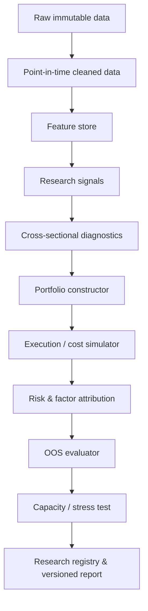

## Executive Summary

**Research scope and assumptions.** This report defines **factor investing** as the construction of diversified portfolios using systematic, repeatable, and continuously updatable asset characteristics, risk exposures, or trading signals in order to capture some form of expected return premium. **Cross-sectional alpha** is defined more broadly as the predictive power of a signal for future relative returns when comparing different assets at the same point in time, or as returns that remain unexplained under a specified asset-pricing benchmark. No specific asset class is imposed in this report, so the theoretical discussion applies to equities, bonds, futures, foreign exchange, and other assets. However, because the most comprehensive data, replication studies, and transaction-cost literature of the past decade are concentrated in **listed equities**, the empirical discussion focuses mainly on stocks. Unless otherwise stated, implementation examples assume monthly frequency, liquid stocks, long–short portfolios, positions formed only from information available at the time, and returns measured as excess returns. The original Fama–MacBeth study also began from the cross-sectional risk–return relation in equities. [Fama and MacBeth (1973)](https://doi.org/10.1086/260061)

The core conclusions can be summarized as follows.

**First, factors, characteristics, and alpha are not the same thing.** “Value, momentum, quality, profitability, investment, size, low volatility, liquidity” can refer to firm characteristics, ranking signals, long–short factor returns, or explanatory factors in a risk model; the same name can denote different objects across papers. One of the most common research errors is to treat a positive Fama–MacBeth slope, positive IC, positive sorted-portfolio spread, and positive benchmark alpha as the same conclusion. They answer different questions. The IPCA framework of Kelly, Pruitt, and Su goes further by showing that observable characteristics can affect returns through **time-varying risk exposures** without having to be interpreted directly as “mispricing characteristics.” [Kelly, Pruitt, and Su (2019)](https://www.sciencedirect.com/science/article/abs/pii/S0304405X19301151)

**Second, the literature of the past decade does not support a simple conclusion that “all factors work” or “all factors have failed.”** Hou, Xue, and Zhang reconstruct 452 anomalies under stringent procedures and find that after using NYSE breakpoints and value weighting to reduce microcap influence, 65% fail to pass $$|t|=1.96$$, and the failure rate rises to 82% after applying multiple-testing thresholds. Yet Chen and Zimmermann, using open-source replications that adhere closely to original study definitions, find that among 161 characteristics explicitly significant in the original papers, 98% of replicated long–short t-statistics still exceed 1.96; Jensen, Kelly, and Pedersen then use a Bayesian replication model and data from 93 countries to obtain a global replication rate of 82.4%. These results do not “disprove” one another. Instead, they demonstrate clearly that whether a factor “exists” depends heavily on signal definition, stock weighting, microcap treatment, philosophy toward multiple testing, the definition of out-of-sample evidence, and Bayesian versus frequentist decision rules. [Hou, Xue, and Zhang (2020)](https://academic.oup.com/rfs/article/33/5/2019/5236964) [Chen and Zimmermann (2022)](https://doi.org/10.1561/104.00000112) [Jensen, Kelly, and Pedersen (2023)](https://onlinelibrary.wiley.com/doi/10.1111/jofi.13249)

**Third, the strongest evidence from 2016–2026 is more consistent with a small number of economically structured factor families than with hundreds of independent alphas.** Harvey, Liu, and Zhu argue that the conventional $$t>1.96$$ threshold is too permissive in the factor zoo and propose a higher evidentiary hurdle of about $$t>3$$ for new factors. Feng, Giglio, and Xiu likewise find that after controlling for a high-dimensional set of existing factors, most new factors are redundant and only a few retain incremental explanatory power. At the same time, the machine-learning study of Gu, Kelly, and Xiu shows that nonlinear interactions can improve out-of-sample prediction, while the variables most consistently important across models remain concentrated in momentum/reversal, liquidity, volatility, and valuation signals. [Harvey, Liu, and Zhu (2016)](https://doi.org/10.1093/rfs/hhv059) [Feng, Giglio, and Xiu (2020)](https://doi.org/10.1111/jofi.12883) [Gu, Kelly, and Xiu (2020)](https://doi.org/10.1093/rfs/hhaa009)

**Fourth, the gap between gross alpha and investable alpha is enormous.** Novy-Marx and Velikov find that anomalies with turnover below roughly 50% per month are more likely to retain statistically significant net returns after applying cost controls such as buy/hold spreads, while high-turnover strategies rarely do; size, value, and profitability also exhibit relatively greater capacity. More importantly, Muravyev, Pearson, and Pollet (2025), using 162 anomalies and actual stock-borrow fees, find that the average long–short return is approximately 0.14% per month before borrowing costs but approximately **−0.01%** after borrowing costs, showing that the short leg and borrow fees can completely change the economic answer to whether “alpha exists.” [Novy-Marx and Velikov (2016)](https://doi.org/10.1093/rfs/hhv063) [Muravyev, Pearson, and Pollet (2025)](https://onlinelibrary.wiley.com/doi/10.1111/jofi.13501)

**Fifth, alpha persistence is much harder to establish than a single full-sample t-statistic.** McLean and Pontiff find that predictor returns decline on average after publication, consistent with both statistical bias and market learning/arbitrage. Green, Hand, and Zhang, after jointly controlling for many characteristics, also find that independent predictability among U.S. non-microcap stocks declines sharply after 2003. Yet the factor-momentum literature shows time-series continuation in factor returns, concentrated in factors that better explain the cross section of stocks. Therefore, whether alpha is persistent cannot be answered with one long-sample average; persistence must be decomposed across **time periods, markets, pre/post publication, pre/post costs, pre/post crowding, and after model controls**. [McLean and Pontiff (2016)](https://onlinelibrary.wiley.com/doi/10.1111/jofi.12365) [Green, Hand, and Zhang (2017)](https://papers.ssrn.com/sol3/papers.cfm?abstract_id=2262374) [Ehsani and Linnainmaa (2022)](https://onlinelibrary.wiley.com/doi/10.1111/jofi.13131)

**Sixth, recent factor performance is highly regime-dependent.** For example, the Kenneth French Data Library shows that for the latest 12 months through June 2026, U.S. five-factor returns were approximately MKT–RF +18.33%, SMB +11.87%, HML +20.33%, RMW −29.03%, and CMA −0.33%. This is an unusually vivid example of value and size being strong at the same time that profitability was extremely weak. It should not be interpreted as an estimate of future expected premia, but rather as a regime snapshot showing that short-run single-factor performance can diverge completely from long-run factor evidence. The French Data Library itself also transitioned from CRSP FIZ to CIZ in 2025, changing return-construction methodology and reinforcing the need to include data versioning in research governance. [Kenneth R. French Data Library](https://mba.tuck.dartmouth.edu/pages/faculty/ken.french/data_Library.html)

*Figure: trailing-12-month snapshot through June 2026; not an estimate of long-run expected returns. Data source: Kenneth French Data Library.* [Kenneth R. French Data Library](https://mba.tuck.dartmouth.edu/pages/faculty/ken.french/data_Library.html)

**Seventh, the research standard worth adopting is not “find significant alpha,” but rather to force alpha through a progressively more difficult funnel:**

This ordering reflects the common lessons of 2016–2026 research on the factor zoo, transaction costs, replication, machine learning, and data vintages: **statistical predictability is necessary but not sufficient; true investment alpha must be out-of-sample, after costs, capacity-adjusted, and relatively robust to methodological choices.** [Harvey, Liu, and Zhu (2016)](https://doi.org/10.1093/rfs/hhv059) [Novy-Marx and Velikov (2016)](https://doi.org/10.1093/rfs/hhv063) [Feng, Giglio, and Xiu (2020)](https://doi.org/10.1111/jofi.12883) [Chen and Zimmermann (2022)](https://doi.org/10.1561/104.00000112) [Akey, Robertson, and Simutin (2026)](https://academic.oup.com/rof/advance-article/doi/10.1093/rof/rfag002/8443460)

## Theoretical Foundations and Cross-Sectional Alpha Models

### Three Distinct Objects in Factor Investing

Strictly speaking, research should separate “factor” into three different objects:

$$
\text{Characteristic / Signal}
\quad\neq\quad
\text{Factor Portfolio}
\quad\neq\quad
\text{Pricing Factor}.
$$

For example, book-to-market can be a characteristic $$z_{i,t}$$ for stock $$i$$ at time $$t$$; buying high-B/M stocks and shorting low-B/M stocks can form an HML-like factor portfolio $$f_t$$; only if that portfolio explains expected returns through assets' covariance with it or their beta exposure does it further qualify as a pricing factor. Part of the reason Fama–French, q-factor, mispricing-factor, and latent-factor models reach different conclusions is that they impose different definitions of what a “factor” should be. [Fama and French (2016)](https://academic.oup.com/rfs/article-abstract/29/1/69/1843682) [Hou, Mo, Xue, and Zhang (2021)](https://doi.org/10.1093/rof/rfaa004) [Stambaugh and Yuan (2017)](https://academic.oup.com/rfs/article/30/4/1270/2965095) [Kelly, Pruitt, and Su (2019)](https://www.sciencedirect.com/science/article/abs/pii/S0304405X19301151)

From an economic perspective, factor premia are usually explained in three broad ways, and these explanations are not mutually exclusive:

$$
E[R_i^e] =
\underbrace{\beta_i^\top\lambda}_{\text{systematic risk compensation}}
+
\underbrace{\alpha_i^{mispricing}}_{\text{behavior/friction}}
+
\underbrace{\alpha_i^{measurement}}_{\text{model/data error}}.
$$

Risk-based theories interpret return differences as compensation for systematic risk; behavioral/mispricing theories attribute them to biased beliefs, limited attention, limits to arbitrage, or short-sale constraints; the third category is not “true alpha” at all, but an artifact of omitted benchmarks, contaminated data, microcaps, bid–ask bounce, or data mining. The mispricing-factor model of Stambaugh and Yuan and the short-/long-horizon behavioral factor model of Daniel, Hirshleifer, and Sun are explicit modeling examples of the second category. [Stambaugh and Yuan (2017)](https://academic.oup.com/rfs/article/30/4/1270/2965095) [Daniel, Hirshleifer, and Sun (2020)](https://academic.oup.com/rfs/article-abstract/33/4/1673/5522378)

### Fama–MacBeth Cross-Sectional Model

The most common modern characteristic-research version of Fama–MacBeth runs the following regression each period:

$$
r_{i,t+1}
=
\gamma_{0,t}
+
\gamma_{1,t}z_{1,i,t}
+\cdots+
\gamma_{K,t}z_{K,i,t}
+
\epsilon_{i,t+1},
$$

and then averages over time:

$$
\bar{\gamma}_k
=
\frac{1}{T}\sum_{t=1}^{T}\gamma_{k,t}.
$$

$$\bar{\gamma}_k>0$$ means that after controlling for other variables, characteristic $$k$$ has a positive cross-sectional relation with next-period returns. The original Fama–MacBeth study was a two-pass risk-pricing test: first estimate asset risk exposures, then run cross-sectional pricing regressions period by period. Today, the name is often extended to “monthly cross-sectional characteristic regressions followed by time-series inference on the coefficients.” [Fama and MacBeth (1973)](https://doi.org/10.1086/260061) [Green, Hand, and Zhang (2017)](https://papers.ssrn.com/sol3/papers.cfm?abstract_id=2262374)

The key point is:

$$
\bar\gamma_k \neq \alpha_k.
$$

For example, a positive value-characteristic slope may simply compensate for exposure to an existing risk factor; it may also be significant even though the signal is concentrated in hard-to-trade stocks and therefore has no practical portfolio alpha. Conversely, a strategy built through nonlinear portfolio construction can produce positive alpha even when a single linear Fama–MacBeth slope is weak. This is one of the main motivations for high-dimensional and nonlinear methods relative to a single traditional regression. [Gu, Kelly, and Xiu (2020)](https://doi.org/10.1093/rfs/hhaa009) [Feng, Giglio, and Xiu (2020)](https://doi.org/10.1111/jofi.12883)

When holding periods overlap, signals update slowly, or monthly slopes are autocorrelated, inference should not treat $$\gamma_t$$ as IID. At minimum, HAC/Newey–West-style time-series standard errors or block bootstrap procedures should be used. For global panels or multi-market research, entity/time dependence must also be considered rather than mechanically applying a single IID t-statistic.

### IC and ICIR

For a pure prediction problem, a quantity closer to the model itself than portfolio return is the information coefficient:

$$
IC_t
=
\operatorname{Corr}_{i}
\left(
s_{i,t},r_{i,t+h}
\right).
$$

Quantitative equity research typically prefers Spearman rank IC:

$$
IC_t^{rank}
=
\operatorname{Corr}
\left(
\operatorname{rank}(s_{i,t}),
\operatorname{rank}(r_{i,t+h})
\right),
$$

because it is less sensitive to extreme observations and monotonic nonlinearities in the score.

The basic ICIR is:

$$
ICIR
=
\frac{\overline{IC}}{\sigma(IC)}.
$$

If one insists on annualizing it, a common expression is:

$$
ICIR_{\rm ann}
=
\sqrt{P}\,
\frac{\overline{IC}}{\sigma(IC)},
$$

where $$P=12$$ for monthly data. But this is only reasonable when the IC series is approximately uncorrelated. With overlapping horizons, persistent signals, or market regimes, multiplying by $$\sqrt{12}$$ directly overstates the effective amount of information. Therefore, an empirical report should ideally show **mean IC, median IC, IC hit rate, IC autocorrelation, HAC t-statistic, rolling IC, and block-bootstrap confidence intervals** together.

*The figure is purely illustrative: assume 120 months, with a population monthly IC mean of about 0.03 and standard deviation of about 0.06. Its purpose is to show that “average IC” alone is insufficient to describe stability; real research should inspect the distribution, tails, time variation, and autocorrelation.*

A particularly important mistake to avoid is the leap from “high ICIR” to “high investable Sharpe.” IC measures prediction ordering; actual portfolio return also depends on breadth, position sizing, factor covariance, risk neutralization, turnover, and transaction costs.

### Benchmark Alpha, SDF, and Mispricing Alpha

The standard benchmark alpha for a portfolio is:

$$
R^p_t-R^f_t
=
\alpha
+
\beta^\top F_t
+
\epsilon_t.
$$

This $$\alpha$$ is only the return **unexplained relative to the specified $$F_t$$**. Switching among CAPM, FF3, FF5/FF6, q5, QMJ/BAB, or mispricing factors can change alpha. The Fama–French multifactor models, Hou et al.'s q5 model, and Stambaugh–Yuan mispricing factors are all different benchmarks. Fama and French themselves emphasize that choosing factors is a central model-selection problem in asset pricing. [Fama and French (2018)](https://doi.org/10.1016/j.jfineco.2018.02.012) [Hou, Mo, Xue, and Zhang (2021)](https://doi.org/10.1093/rof/rfaa004) [Stambaugh and Yuan (2017)](https://academic.oup.com/rfs/article/30/4/1270/2965095)

More generally, in a stochastic discount factor framework:

$$
E_t[m_{t+1}R^e_{i,t+1}] = 0.
$$

An anomaly's “alpha” can be understood as a pricing error under a given SDF/factor model. There is therefore no completely model-free risk-adjusted alpha; there is only alpha relative to a particular information set and a particular benchmark.

Stambaugh and Yuan aggregate eleven anomaly categories into two mispricing factors, together with market and size, with the goal of explaining many anomalies using a smaller number of common mispricing components. Daniel, Hirshleifer, and Sun construct long- and short-horizon behavioral factors and explicitly embed investor psychology into factor construction. These studies remind us that if ten signals are merely different proxies for the same behavioral mechanism, treating them as ten independent alphas will grossly exaggerate breadth. [Stambaugh and Yuan (2017)](https://academic.oup.com/rfs/article/30/4/1270/2965095) [Daniel, Hirshleifer, and Sun (2020)](https://academic.oup.com/rfs/article-abstract/33/4/1673/5522378)

### IPCA and Nonlinear Cross-Sectional Alpha

The core intuition of IPCA can be written as:

$$
r_{i,t+1}
=
\beta_{i,t}'f_{t+1}
+
\epsilon_{i,t+1},
\qquad
\beta_{i,t}
=
\Gamma_\beta' z_{i,t}.
$$

In other words, characteristics $$z_{i,t}$$ do not directly “generate returns”; they instrument conditional factor loadings. This connects characteristic models with latent-factor models and captures the central meaning of the title “Characteristics Are Covariances.” [Kelly, Pruitt, and Su (2019)](https://www.sciencedirect.com/science/article/abs/pii/S0304405X19301151)

If the linear restriction is abandoned, a more general alpha forecast is:

$$
\hat\mu_{i,t+1}
=
\hat m(z_{i,t}).
$$

Gu, Kelly, and Xiu compare linear models, penalized regressions, PCR/PLS, trees, boosting, random forests, and neural networks. In a setting covering nearly 30,000 stocks, 1957–2016, 94 characteristics, and many interactions, trees and neural networks deliver the best out-of-sample results, with their main advantage coming from nonlinear interactions. Their value-weighted long–short decile strategy based on neural-network forecasts reports an out-of-sample annualized Sharpe of about 1.35, above the comparison regression strategy; important signals are concentrated in price trends, liquidity, volatility, and valuation. This is strong evidence that “residual cross-sectional predictability may exist in nonlinear interactions,” but it does not imply that any deep model on modern after-cost data will produce the same result. [Gu, Kelly, and Xiu (2020)](https://doi.org/10.1093/rfs/hhaa009)

## Measurement, Performance Attribution, and Capacity Economics

### Gross Return Is Not Net Alpha

The economic accounting identity for an investment strategy should be written as:

$$
\alpha_{\text{net}}
=
\alpha_{\text{gross}}
-
C_{\text{spread}}
-
C_{\text{commission}}
-
C_{\text{slippage}}
-
C_{\text{impact}}
-
C_{\text{borrow}}
-
C_{\text{financing}}
-
C_{\text{tax}},
$$

where whether taxes are included depends on the investor and investment vehicle. For long–short equity anomalies, **borrow fees and market impact should not be buried inside a generic “20 bps transaction cost” assumption**, because borrow costs may be highly correlated with the anomaly signal itself. The 2025 results of Muravyev et al. illustrate exactly this point: short-leg borrow costs can consume almost all of an apparently significant average anomaly return. [Muravyev, Pearson, and Pollet (2025)](https://onlinelibrary.wiley.com/doi/10.1111/jofi.13501)

Turnover must also be defined first. A common one-way turnover definition is:

$$
TO_t
=
\frac12\sum_i
\left|
w_{i,t}
-
\widetilde w_{i,t^-}
\right|,
$$

where $$\widetilde w_{i,t^-}$$ is the previous-period holding weight after market-return drift and before rebalancing. If a study uses $$\sum|\Delta w|$$ without dividing by two, the reported number doubles, so papers and code must explicitly state whether turnover is one-way or two-way.

One of the important findings of Novy-Marx and Velikov is that **buy/hold spreads**, with different entry and holding thresholds, can materially reduce unnecessary trading; low-turnover anomalies also perform much better after costs than high-turnover anomalies. DeMiguel et al. further show that jointly optimizing multiple characteristics can sometimes reduce transaction costs because the trades demanded by different signals offset one another. [Novy-Marx and Velikov (2016)](https://doi.org/10.1093/rfs/hhv063) [DeMiguel et al. (2020)](https://academic.oup.com/rfs/article-abstract/33/5/2180/5821387)

*Illustrative assumptions: gross alpha fixed at 6% annualized, with linear costs of 10, 25, and 50 bps per 100% one-way turnover. These are not estimates for any particular market; actual market impact typically increases nonlinearly with scale, ADV, volatility, and participation rate.*

### Comparison of Measurement and Attribution Methods

| Method | Typical definition | Question answered | Advantages | Main weaknesses / misuse |
|---|---|---|---|---|
| Average long–short return | $$E[R_L-R_S]$$ | Is there a return difference between the two signal tails? | Intuitive and close to a tradable strategy | Does not control for existing risks; easily dominated by microcaps and the short leg |
| Portfolio-sort monotonicity | Q1…Q5/Q10 returns | Do returns change monotonically with the signal? | Can detect nonlinear / threshold effects | Breakpoints, weighting, and number of bins affect results |
| Fama–MacBeth slope | $$\bar\gamma_k$$ | Does the characteristic add an incremental relation after controlling for others? | Multivariate and interpretable | Assumes linearity; multicollinearity; not directly a tradable return [Fama and MacBeth (1973)](https://doi.org/10.1086/260061) [Green, Hand, and Zhang (2017)](https://papers.ssrn.com/sol3/papers.cfm?abstract_id=2262374) |
| Pearson / Rank IC | $$Corr(s,r_{+h})$$ | Can the score rank future returns? | Directly linked to prediction; rank IC is more robust | Ignores position sizing, costs, and factor exposures |
| ICIR | $$\bar{IC}/\sigma(IC)$$ | Is prediction stable over time? | Useful for signal monitoring | Naive annualization is overly optimistic under autocorrelation |
| CAPM / multi-factor alpha | $$R_p=\alpha+\beta'F+\epsilon$$ | Does the return exceed benchmark factor exposures? | Directly linked to risk attribution | Alpha depends entirely on benchmark choice; the factor zoo creates model uncertainty [Fama and French (2018)](https://doi.org/10.1016/j.jfineco.2018.02.012) [Feng, Giglio, and Xiu (2020)](https://doi.org/10.1111/jofi.12883) |
| Sharpe ratio | $$E[R^e]/\sigma(R^e)$$ | How much excess return is earned per unit of total volatility? | Comparable across strategies | Ignores tail risk, skewness, and serial correlation |
| Information ratio | $$E[R_p-R_b]/TE$$ | How efficient is active return relative to a benchmark? | Appropriate for long-only / benchmark-aware mandates | Benchmark choice itself is subjective |
| Gross-to-net attribution | Gross − spread − impact − borrow… | How much paper alpha is realizable? | Closest to the investment decision | Cost data are difficult; historical spread proxies may be misleading [Novy-Marx and Velikov (2016)](https://doi.org/10.1093/rfs/hhv063) [Muravyev, Pearson, and Pollet (2025)](https://onlinelibrary.wiley.com/doi/10.1111/jofi.13501) |
| Capacity curve | $$\alpha_{net}(AUM)$$ | How much alpha remains as AUM grows? | Directly tied to commercial viability | Impact and borrow supply are nonlinear and regime-dependent |
| Marginal contribution to risk/return | $$\partial R/\partial w,\partial\sigma/\partial w$$ | What is each factor/signal's true contribution to the portfolio? | Useful for multi-factor portfolios | Covariance estimation error can be large |
| Attribution by signal sleeve | Allocate P&L to value/momentum/quality… | Which research sleeve made or lost money? | Easy to govern | P&L attribution is not unique for highly correlated signals |

For a research team, the goal is not to select a single “best metric,” but to build a **hierarchical reporting system**:

$$
\text{Signal efficacy}
\rightarrow
\text{Portfolio efficacy}
\rightarrow
\text{Risk-adjusted efficacy}
\rightarrow
\text{Net investability}.
$$

That means beginning with IC / Fama–MacBeth, then portfolio spreads, then benchmark alpha / Sharpe, and finally turnover, costs, borrow, and capacity. Reporting only the final Sharpe hides the research mechanism; reporting only IC cannot answer the investability question.

### Capacity Is Not a Single AUM Number

Capacity can be formalized as:

$$
\alpha_{\rm net}(A)
=
\alpha_{\rm gross}
-
C_{\rm linear}
-
C_{\rm impact}(A)
-
C_{\rm borrow}(A),
$$

where $$A$$ is AUM. In practice, capacity is often defined as the AUM at which any one of the following conditions first fails:

$$
\alpha_{\rm net}(A^*)=0,
$$

or

$$
IR_{\rm net}(A^*)=IR_{\min},
$$

or a participation/liquidity constraint is breached.

Novy-Marx and Velikov show a close negative relation between capacity and turnover, while lower-frequency characteristics such as size, value, and profitability can support relatively more capital. This also explains why a signal with weaker predictive power but low turnover can have greater commercial value than a high-IC, high-frequency, expensive signal. [Novy-Marx and Velikov (2016)](https://doi.org/10.1093/rfs/hhv063)

Capacity tests should vary at least:

$$
\{\text{AUM},\ \text{participation rate},\ \text{rebalance speed},
\ \text{position cap},\ \text{borrow availability}\}.
$$

They should not produce a single number from “average ADV × 5%” and call that strategy capacity.

## Empirical Evidence from the Past Decade

### Value, Profitability, Investment, and Quality

**Value.** The value drawdown in the late 2010s prompted researchers to distinguish between “the value premium has disappeared” and “the valuation spread was extreme at the time.” Arnott, Harvey, Kalesnik, and Linnainmaa (2021) argue that the underperformance of value at the time was insufficient evidence of permanent death. More generally, the statistical significance of value is sensitive to book-value definitions, intangible-asset treatment, weighting, and industry-neutralization choices. This aligns with the broader message of the factor-zoo literature: the real research target is **economic mechanism and definitional robustness**, not a one-time t-statistic from one fixed HML implementation. [Arnott, Harvey, Kalesnik, and Linnainmaa (2021)](https://doi.org/10.1080/0015198X.2020.1842704)

Kenneth French's June 2026 data offer another regime example: HML returned about +20.33% over the previous 12 months, but that only indicates a short-run performance reversal and does not prove that value's unconditional expected return increased. [Kenneth R. French Data Library](https://mba.tuck.dartmouth.edu/pages/faculty/ken.french/data_Library.html)

**Profitability / investment.** The Fama–French five-factor model adds profitability (RMW) and investment (CMA) to the traditional market/size/value framework, while the investment-based q model of Hou and coauthors derives expected returns from corporate investment theory. Hou, Mo, Xue, and Zhang's 2021 augmented q-factor model adds an expected-growth factor; in the 1967–2018 sample, the expected-growth factor earns an average premium of about 0.84% per month with $$t=10.27$$, and q5 has strong explanatory power for many cross-sectional patterns. This does not mean that every definition of profitability/investment works; rather, it indicates that **corporate investment, expected growth, and expected returns contain a common structure that can be disciplined by theory**. [Hou, Mo, Xue, and Zhang (2021)](https://doi.org/10.1093/rof/rfaa004)

**Quality.** Asness, Frazzini, and Pedersen define quality as a composite of profitability, growth, safety, and payout dimensions. QMJ earns significant risk-adjusted returns in the U.S. and 24 countries, and future QMJ returns are higher when quality is cheaper relative to its price. This is one of the most important cross-country pieces of evidence for quality in the past decade. [Asness, Frazzini, and Pedersen (2019)](https://link.springer.com/article/10.1007/s11142-018-9470-2)

Asian evidence is not entirely dependent on the U.S. sample. A 2020 study of Hong Kong, Japan, Korea, Singapore, and Taiwan over 2000–2016 finds that quality measured by gross profitability or FSCORE has a positive cross-sectional relation with subsequent stock returns. This is directly relevant to Taiwan, but its sample, trading rules, and small-stock effects should still be revalidated using Taiwan point-in-time data. [Ng and Shen (2020)](https://onlinelibrary.wiley.com/doi/full/10.1111/acfi.12446)

It is also worth noting that French's RMW factor returned approximately −29.03% over the latest 12 months through June 2026, again demonstrating that “long-run evidence” does not imply “profitability in every regime.” [Kenneth R. French Data Library](https://mba.tuck.dartmouth.edu/pages/faculty/ken.french/data_Library.html)

### Momentum and Factor Momentum

Momentum is one of the factor-zoo signals that is relatively difficult for other conventional factors to absorb completely, but it also carries high turnover, tail risk, and crash exposure. An important recent extension is **factor momentum**: Ehsani and Linnainmaa find positive autocorrelation in most factor returns. In their study, after a factor loses money over the previous year, its average return the following month is about 6 bps, versus about 51 bps after a positive prior year; factor momentum is also concentrated in factors with greater ability to explain the cross section of stocks. [Ehsani and Linnainmaa (2022)](https://onlinelibrary.wiley.com/doi/10.1111/jofi.13131)

The machine-learning results of Gu, Kelly, and Xiu also support momentum/reversal characteristics as one of the most important signal families in high-dimensional cross-sectional prediction, followed by liquidity, volatility, and valuation. This is more informative than asking whether a standalone momentum decile is statistically significant, because it shows that price-trend information repeatedly appears across different model classes. [Gu, Kelly, and Xiu (2020)](https://doi.org/10.1093/rfs/hhaa009)

In implementation, however, momentum is also one of the factor families most likely to exhibit “beautiful gross alpha, much weaker net alpha,” due to monthly rebalancing, rapid rank migration, market impact, and a volatile short leg. Momentum research should therefore report signal efficacy and execution efficacy separately. French's momentum research portfolios are themselves updated monthly, while many fundamental portfolios update more slowly. [Kenneth R. French Data Library](https://mba.tuck.dartmouth.edu/pages/faculty/ken.french/data_Library.html)

### Size and Low Volatility

The long-run effect of traditional SMB is unstable across samples and definitions. A major point from Asness, Frazzini, Israel, Moskowitz, and Pedersen (2018) is that much of the weakness of the size premium comes from “small junk”; after controlling for quality, the size effect is more robust across time and markets. In other words, “small” alone may not be a complete signal; “small conditional on quality” may better capture an identifiable premium. [Asness et al. (2018)](https://doi.org/10.1016/j.jfineco.2018.05.006)

This creates an interesting tension with implementation economics: small stocks have wider spreads and larger market impact, but potentially larger characteristic spreads. Academic significance for a size factor therefore need not equal capacity value for a large institutional investor. The replication work of Hou et al. also shows that after using NYSE breakpoints and value weighting to reduce microcap dominance, the significance of many anomalies declines sharply. [Hou, Xue, and Zhang (2020)](https://academic.oup.com/rfs/article/33/5/2019/5236964)

**Low-vol / low-beta.** Asness, Frazzini, Gormsen, and Pedersen (2020) use a Betting Against Correlation (BAC) factor to distinguish leverage-constraint explanations of the low-risk effect from behavioral/lottery explanations. The results indicate that the low-risk anomaly is not simply “low idiosyncratic volatility”; the volatility and correlation components of beta help identify the mechanism. [Asness, Frazzini, Gormsen, and Pedersen (2020)](https://www.sciencedirect.com/science/article/pii/S0304405X1930176X)

In practice, a low-vol factor can also contain implicit sector, duration, quality, and bond-proxy exposures. Looking only at raw low-vol portfolio Sharpe can therefore mislabel other common-factor or macro-duration exposures as low-vol alpha.

### Liquidity

A liquidity premium can theoretically represent compensation for holding illiquid assets, or it can reflect trading frictions, price pressure, and microstructure bias. In the high-dimensional study of Gu, Kelly, and Xiu, liquidity characteristics repeatedly appear as important predictors. [Gu, Kelly, and Xiu (2020)](https://doi.org/10.1093/rfs/hhaa009)

But liquidity is also one of the variables most capable of creating its own measured anomaly. Jahan-Parvar and Zikes (2023) find that several low-frequency effective-spread proxies suffer from volatility-induced bias, especially when true spreads are small relative to volatility. This bias has become more important over time and can alter conclusions in existing empirical-finance results. [Jahan-Parvar and Zikes (2023)](https://academic.oup.com/rfs/article-abstract/36/10/4190/7127916)

Liquidity research should therefore validate low-frequency proxies against high-frequency / quote-based benchmarks whenever possible, rather than treating Amihud, Roll, zero-return, high-low, and similar low-frequency estimates as error-free truth.

### Cross-Sectional Alpha Persistence: Why the Evidence Appears Contradictory

McLean–Pontiff, Green–Hand–Zhang, and Hou–Xue–Zhang provide relatively conservative evidence: decay after publication, declining independent predictability after 2003, and many anomalies losing significance under stricter replication procedures. [McLean and Pontiff (2016)](https://onlinelibrary.wiley.com/doi/10.1111/jofi.12365) [Green, Hand, and Zhang (2017)](https://papers.ssrn.com/sol3/papers.cfm?abstract_id=2262374) [Hou, Xue, and Zhang (2020)](https://academic.oup.com/rfs/article/33/5/2019/5236964)

Chen–Zimmermann and Jensen–Kelly–Pedersen provide more optimistic results: when original predictor definitions are followed more faithfully, many original findings can still be reconstructed; global data and Bayesian shrinkage also support broad external validity for many factors. [Chen and Zimmermann (2022)](https://doi.org/10.1561/104.00000112) [Jensen, Kelly, and Pedersen (2023)](https://onlinelibrary.wiley.com/doi/10.1111/jofi.13249)

The most reasonable synthesis is not to average these views, but to separate four different propositions:

| Proposition | Current evidence |
|---|---|
| Can the original paper's code/characteristic be reconstructed? | Often yes; Chen–Zimmermann report very high replication rates for predictors that were clearly significant originally. [Chen and Zimmermann (2022)](https://doi.org/10.1561/104.00000112) |
| Does significance survive stricter microcap/weighting/multiple-testing rules? | Many anomalies disappear; the Hou–Xue–Zhang result is relatively pessimistic. [Hou, Xue, and Zhang (2020)](https://academic.oup.com/rfs/article/33/5/2019/5236964) |
| Is there still common factor evidence after cross-country testing and Bayesian shrinkage? | Jensen–Kelly–Pedersen answer relatively positively, reporting a global replication rate of 82.4%. [Jensen, Kelly, and Pedersen (2023)](https://onlinelibrary.wiley.com/doi/10.1111/jofi.13249) |
| Can the anomaly actually be arbitraged after costs and at scale? | Evidence is much weaker than evidence for statistical replication, especially for short-/borrow-intensive anomalies. [Novy-Marx and Velikov (2016)](https://doi.org/10.1093/rfs/hhv063) [Muravyev, Pearson, and Pollet (2025)](https://onlinelibrary.wiley.com/doi/10.1111/jofi.13501) |

Therefore, a useful definition of persistence is:

$$
Persistence
=
f(
\text{time},
\text{geography},
\text{universe},
\text{methodology},
\text{cost},
\text{capacity}
),
$$

not “whether the full-sample t-statistic is > 2.”

### Crowding

The core of factor crowding is not simply that “many people know this factor,” but whether **similar positions are concentrated in the same assets and are simultaneously exposed to leverage, liquidity, or redemption shocks**. In practice, crowding can be measured using valuation spreads, short interest, ownership overlap, position concentration, factor correlation, pairwise stock correlation, flow sensitivity, borrow utilization, and related dimensions.

MSCI's crowding research indicates that factors with high crowding scores have historically been more likely to experience significant drawdowns in subsequent months. A separate 2024 analysis finds that the average cross-sectional correlation between stock crowding score and momentum exposure was about 0.46 from 1996–2024, while the unusual recent strength of crowded U.S. stocks coincided with high market concentration. These results are an important practitioner warning, but should be interpreted as a **conditioned risk indicator**, not causal evidence that a crowding score can reliably be used as a contrarian timing signal. [MSCI Factor Crowding Research](https://www.msci.com/research-and-insights/blog-post/where-were-the-factor-crowds-this-summer) [MSCI, “Can Crowding Scores Quantify US Stocks' Fragility?” (2024)](https://www.msci.com/research-and-insights/blog-post/can-crowding-scores-quantify-us-stocks-fragility)

The especially dangerous feature of factor crowding is that two alphas with low correlation in normal periods can suddenly move together during deleveraging:

$$
Corr(\alpha_A,\alpha_B\mid\text{stress})
\gg
Corr(\alpha_A,\alpha_B\mid\text{normal}).
$$

Therefore, using a full-sample correlation matrix for factor diversification may systematically overstate crisis diversification.

## Data, Methodological, and Statistical Pitfalls

### Look-Ahead Bias and Point-in-Time Fundamentals

The most basic rule should be:

$$
\text{Feature availability date}
\le
\text{portfolio formation date}.
$$

A fiscal-period end date cannot be used as the information-availability date. Financial statements, analyst forecasts, corporate events, index membership, and securities-lending data must all use the timestamp when the information first became available to the market, not the final revised value stored in today's database.

Items especially prone to leakage include:

- backfilling historical data with final values after financial-statement restatements;
- using today's Compustat/CRSP mapping to infer security relationships that were not known at the time;
- using an announcement-date field without validating time zone and after-close publication timing;
- computing winsorization, normalization, or PCA loadings using the full sample;
- selecting factor definitions, holding periods, or hyperparameters on the test set.

The Open Source Asset Pricing project even publicly corrected an AnnouncementReturn look-ahead bug in a 2024 version update. This is a valuable real-world example: even a mature open asset-pricing library needs version control and data lineage. [Open Source Asset Pricing — AnnouncementReturn look-ahead issue](https://github.com/OpenSourceAP/CrossSection/issues/158)

### Survivorship, Delisting, and Universe Bias

Using only stocks that are still listed today overstates historical strategy performance, especially for distress, quality, momentum, low-price, and related signals. U.S. research should retain delisted firms and appropriate delisting returns; other markets likewise need data on delistings, mergers, and bankruptcies.

Universe definition is itself a model parameter. These three setups can produce completely different results:

$$
\text{All stocks EW},
\qquad
\text{NYSE-breakpoint VW},
\qquad
\text{Top 90\% market-cap}.
$$

Hou–Xue–Zhang show that microcap treatment alone can change whether a large number of anomalies appear significant. [Hou, Xue, and Zhang (2020)](https://academic.oup.com/rfs/article/33/5/2019/5236964)

### Microstructure Effects

The following signals are particularly vulnerable to contamination from bid–ask bounce, stale prices, and nonsynchronous trading:

$$
\text{short-term reversal},
\quad
\text{liquidity},
\quad
\text{very-short momentum},
\quad
\text{volatility},
\quad
\text{price impact}.
$$

Research should at least perform sensitivity analysis between close-to-close returns and executable prices, exclude extremely low-priced stocks, impose minimum ADV, inspect zero-volume/zero-return observations, and avoid using the same-day close simultaneously as signal input and as a zero-cost execution price. Low-frequency liquidity proxies can also absorb variation in volatility; recent direct evidence confirms this measurement bias. [Jahan-Parvar and Zikes (2023)](https://academic.oup.com/rfs/article-abstract/36/10/4190/7127916)

### Data Versions Are Themselves a Risk Factor

This is one of the highest-priority newer issues as of 2026. Akey et al. use archived historical versions of the Fama–French factors and find that **historical factor returns can differ materially depending on the download date**. These differences come not only from revisions to underlying CRSP/Compustat data, but also from changes in factor-construction methodology. For HML, the authors find economically meaningful differences across vintages, and mutual-fund alpha and cross-sectional pricing conclusions can change as a result. [Akey, Robertson, and Simutin (2026)](https://academic.oup.com/rof/advance-article/doi/10.1093/rof/rfag002/8443460)

The Kenneth French website also explicitly records methodology/data changes, including historical adjustments in 2016, 2018, 2020, and 2021, as well as the 2025 transition from CRSP Legacy FIZ to CIZ that changes monthly-return construction. [Kenneth R. French Data Library](https://mba.tuck.dartmouth.edu/pages/faculty/ken.french/data_Library.html)

Therefore, a complete research artifact should not contain only:

> factor.csv

It should contain:

> factor source + download timestamp + checksum + construction code commit + raw-data vintage + schema version.

### Data Snooping, p-Hacking, and Publication Bias

Suppose a researcher tests $$M$$ independent null hypotheses, each at a 5% significance level. The probability of finding at least one “significant” result is:

$$
1-(1-0.05)^M.
$$

When $$M=100$$, this probability is almost 1. Therefore, a factor-zoo result with $$t=2$$ is not especially strong evidence.

Harvey, Liu, and Zhu (2016) address this problem systematically and argue that a new factor should clear a materially higher hurdle than the conventional 1.96, roughly $$t>3$$. [Harvey, Liu, and Zhu (2016)](https://doi.org/10.1093/rfs/hhv059)

Chordia, Goyal, and Saretto warn from another direction that overly mechanical replication procedures can also generate false rejections; in other words, researchers should not replace “everything new is valid” with the equally simplistic belief that “every new finding is p-hacking.” [Chordia, Goyal, and Saretto (2020)](https://academic.oup.com/rfs/article-abstract/33/5/2134/5739455)

A sound research culture should therefore control both:

$$
\text{false positives}
\quad\text{and}\quad
\text{false negatives}.
$$

### Researcher Degrees of Freedom in Factor Definitions

Even a single label such as “value” contains many choices:

$$
\frac{B}{M},
\quad
\frac{E}{P},
\quad
\frac{CF}{P},
\quad
\frac{Sales}{EV},
$$

plus reporting lag, winsorization, industry neutralization, breakpoints, rebalance month, weighting, treatment of negative book value, intangible adjustments, and more.

Therefore, “I tested only one value factor” is often an illusion; the true researcher degrees of freedom may imply hundreds of specification paths.

The 2026 data-vintage evidence of Akey et al. goes even further: even if the researcher does not change the code, **historical versions of external benchmark factors can change** and alter inference. [Akey, Robertson, and Simutin (2026)](https://academic.oup.com/rof/advance-article/doi/10.1093/rof/rfag002/8443460)

## Implementation Design and Robustness Testing

### Portfolio Construction

Moving from alpha score $$s_{i,t}$$ to final portfolio weight $$w_{i,t}$$ is an independent research problem. Common methods include:

**Quantile sorts.**

$$
w_i =
\begin{cases}
+1/N_L, & i\in \text{top quantile}\\
-1/N_S, & i\in \text{bottom quantile}.
\end{cases}
$$

Transparent and robust, but it ignores signal magnitude and quantile boundaries can create unnecessary turnover.

**Rank / score proportional.**

$$
w_i
\propto
z(s_i).
$$

This uses more information, but extreme scores require winsorization, position caps, or nonlinear mapping.

**Value weighted.**

This reduces microcap-driven false performance and better approximates feasibility at larger AUM, but it can concentrate factor exposure in a small number of mega-cap stocks. Hou–Xue–Zhang's replication results clearly show that value weighting materially affects anomaly conclusions. [Hou, Xue, and Zhang (2020)](https://academic.oup.com/rfs/article/33/5/2019/5236964)

**Volatility-scaled / risk parity within signal.**

$$
w_i
\propto
\frac{s_i}{\hat\sigma_i},
$$

which can prevent high-volatility assets from dominating, but if the volatility estimate is itself a signal or is related to the anomaly, this changes the original economic interpretation.

**Cost-aware optimizer.**

$$
\max_w
\left[
\hat\mu^\top w
-
\frac{\lambda}{2}w^\top\Sigma w
-
C(w-w^-)
\right]
$$

subject to

$$
\mathbf 1^\top w = 0,\quad
B^\top w = 0,\quad
|w_i|\le u_i,
$$

where constraints can include market beta, industry, country, currency, duration, and style-exposure neutrality, as well as gross/net leverage, liquidity, and borrow constraints.

For institutional alpha research, cost-aware optimization should be treated as part of the formal backtest rather than an afterthought where one simply “subtracts 20 bps” after the research is finished. Novy-Marx–Velikov and DeMiguel et al. both show that portfolio formation and cost mitigation must be designed jointly. [Novy-Marx and Velikov (2016)](https://doi.org/10.1093/rfs/hhv063) [DeMiguel et al. (2020)](https://academic.oup.com/rfs/article-abstract/33/5/2180/5821387)

### Rebalancing Frequency

The optimal rebalancing frequency should be determined by:

$$
\Delta E[\text{alpha captured}]
>
\Delta E[\text{trading cost}],
$$

not by the assumption that “equity factors rebalance monthly.”

Momentum/reversal signals usually decay faster, while fundamental quality/value/profitability signals decay more slowly. The French Data Library's research portfolios reflect this difference: momentum and short-term reversal portfolio composition is updated monthly, while many fundamental sorts are rebuilt primarily on an annual schedule. [Kenneth R. French Data Library](https://mba.tuck.dartmouth.edu/pages/faculty/ken.french/data_Library.html)

In practice, one should evaluate a turnover-adjusted frontier over:

$$
1D,\ 1W,\ 2W,\ 1M,\ 3M,\ 6M,
$$

rather than compare gross Sharpe alone.

### Turnover Reduction

Four particularly practical methods are:

1. **buffer / hysteresis**: use a higher threshold to enter than to continue holding;
2. **partial rebalance**: move only part of the way toward the target weight;
3. **minimum-trade threshold**: do not trade small target-weight changes;
4. **cost penalty inside the optimizer**.

The first method is directly aligned with the buy/hold-spread idea studied by Novy-Marx and Velikov. [Novy-Marx and Velikov (2016)](https://doi.org/10.1093/rfs/hhv063)

### Constraints

At minimum, stress-test:

$$
\begin{aligned}
&\text{gross leverage},\\
&\text{net exposure},\\
&\beta_{\rm market},\\
&\text{sector/country neutrality},\\
&\text{position cap},\\
&\text{ADV participation},\\
&\text{borrow availability},\\
&\text{short fee},\\
&\text{factor exposure bounds}.
\end{aligned}
$$

A “constraint-free long–short Sharpe of 1.5” and a “beta/sector-neutral Sharpe of 0.5 under a 5% ADV cap, actual borrow fees, and position caps” are completely different research outcomes. Both should be reported; the prettier first result should not be shown alone.

### Multiple Testing and FDR

If there are $$m$$ hypotheses, Benjamini–Hochberg-type procedures can control the false discovery rate, and Harvey–Liu–Zhu explicitly place factor discovery in a multiple-testing framework. [Harvey, Liu, and Zhu (2016)](https://doi.org/10.1093/rfs/hhv059)

At minimum, research should report:

- raw p-value;
- Holm/Bonferroni-style family-wise correction;
- BH, or the more conservative BY/FDR under dependence;
- an economic hurdle, such as minimum after-cost annual alpha;
- out-of-sample significance.

FDR adjustment cannot substitute for OOS testing: the former controls simultaneous discovery error, while the latter tests temporal generalization.

### Bootstrap

If monthly ICs, factor returns, or Fama–MacBeth slopes are serially dependent, use moving-block / stationary block bootstrap rather than randomly resampling individual months.

A stricter approach is to bootstrap the **entire research pipeline**:

$$
\text{sample}
\rightarrow
\text{feature selection}
\rightarrow
\text{hyperparameter selection}
\rightarrow
\text{portfolio formation}
\rightarrow
\text{performance}.
$$

If only the already-selected best signal is bootstrapped, selection uncertainty is omitted.

### Chronological Out-of-Sample Testing

The recommended structure is not random K-fold, but:

$$
\boxed{\text{Train}}
\rightarrow
\boxed{\text{Validation}}
\rightarrow
\boxed{\text{Test}}
\rightarrow
\boxed{\text{Live/Paper}},
$$

advanced through rolling or expanding windows. Gu, Kelly, and Xiu place particular emphasis on regularization and out-of-sample performance for machine learning; without truly chronological OOS, a high-flexibility model can easily turn the factor zoo into an interaction zoo. [Gu, Kelly, and Xiu (2020)](https://doi.org/10.1093/rfs/hhaa009)

Best practice is to keep the final test set completely unseen during research. Once a researcher observes test Sharpe and changes the model in response, that interval has become a validation set.

### High-Dimensional Model Uncertainty

Feng, Giglio, and Xiu ask directly: “Does a new factor really have incremental explanatory power above hundreds of existing factors?” Their conclusion is that most new factors are redundant and only a small number retain incremental value. [Feng, Giglio, and Xiu (2020)](https://doi.org/10.1111/jofi.12883)

Bryzgalova, Huang, and Julliard use a Bayesian framework to handle the enormous factor-model space systematically. Its key advantage is that weak factors, model selection, and model averaging are addressed simultaneously rather than pretending the researcher knows the correct model in advance. [Bryzgalova, Huang, and Julliard (2023)](https://onlinelibrary.wiley.com/doi/full/10.1111/jofi.13197)

Giglio, Xiu, and Zhang's 2025 work on test assets and weak factors adds another warning: the power and conclusions of asset-pricing tests can depend on **which test assets are used** and on weak-factor identification. [Giglio, Xiu, and Zhang (2025)](https://onlinelibrary.wiley.com/doi/10.1111/jofi.13415)

Accordingly, a mature robustness matrix should include at least:

| Dimension | Baseline | Robustness |
|---|---|---|
| Universe | all eligible | large-cap / liquid-only / ex-microcap |
| Weighting | EW | VW / capped VW |
| Signal | baseline definition | alternative economically equivalent definitions |
| Outliers | winsor 1/99 | 0.5/99.5, rank transform |
| Neutralization | none | industry / country / beta |
| Lag | standard | +1 period / conservative publication lag |
| Horizon | 1M | 1W / 3M / 6M |
| Cost | zero | spread / impact / borrow scenarios |
| Factor model | FF5 | FF6 / q5 / QMJ-BAB / mispricing |
| Period | full | pre/post publication, rolling decades |
| Geography | domestic | developed ex-domestic / EM |
| Statistics | naive t | HAC / block bootstrap / FDR |
| Construction | decile EW | quintile, VW, score-weighted, optimizer |
| Data vintage | current | archived / frozen vintage |

“Robust” does not mean every cell must be significant. It means the core conclusion should not depend on one narrow, ex-post-selected specification.

## Recommended Research Workflow, Experiments, and Core Literature

### Recommended Empirical Protocol

The following workflow is suitable as an institutional-grade standard for cross-sectional alpha research.

**Lead with the research hypothesis.** Before examining results, write down the economic mechanism, expected direction, holding horizon, target universe, primary definition, and reasonable failure conditions. Pure feature mining without an economic hypothesis is permissible, but it must be explicitly labeled a discovery exercise rather than confirmatory research. The factor-zoo evidence of Harvey–Liu–Zhu illustrates why ex-post hypotheses deserve substantially less credibility. [Harvey, Liu, and Zhu (2016)](https://doi.org/10.1093/rfs/hhv059)

**Build a frozen point-in-time data layer.** Preserve raw vintage, download timestamp, security-identifier mapping, corporate actions, delistings, first-available dates for fundamentals, borrow data, and transaction prices. The French-factor vintage evidence and the Open Source Asset Pricing bug fix demonstrate that version governance is a statistical issue, not merely an engineering issue. [Akey, Robertson, and Simutin (2026)](https://academic.oup.com/rof/advance-article/doi/10.1093/rof/rfag002/8443460) [Open Source Asset Pricing — AnnouncementReturn look-ahead issue](https://github.com/OpenSourceAP/CrossSection/issues/158)

**Define the universe before the signal.** First set listing venue, price, market cap, ADV, minimum history, shortability, and suspension treatment, then compute the signal. Do not let the signal itself determine the universe.

**Generate raw features and economically sensible transformations.** Preserve raw, ranked, winsorized, and industry-neutral versions; do not keep only the final “best transformation.”

**Start with univariate diagnostics.** Report cross-sectional coverage, missingness, distribution, autocorrelation, rank IC, IC decay, quintile/decile monotonicity, and the long and short legs separately. Do not begin immediately with an optimizer.

**Run multivariate cross-sectional tests.**

$$
r_{i,t+1}
=
\gamma_{0,t}
+\gamma_{signal,t}s_{i,t}
+\Gamma_t'X_{i,t}
+\epsilon_{i,t+1},
$$

where $$X$$ should include at least known close substitutes, size, liquidity, and relevant risk controls. Report the Fama–MacBeth average slope, HAC t-statistic, cross-sectional $$R^2$$, and coefficient stability. [Fama and MacBeth (1973)](https://doi.org/10.1086/260061) [Green, Hand, and Zhang (2017)](https://papers.ssrn.com/sol3/papers.cfm?abstract_id=2262374)

**Build at least three portfolio implementations.** For example, equal-weighted quantiles, value-weighted quantiles, and a cost-aware score optimizer. If alpha exists only in a microcap equal-weighted decile and disappears under value weighting and liquidity screens, that is itself an important research conclusion. [Hou, Xue, and Zhang (2020)](https://academic.oup.com/rfs/article/33/5/2019/5236964)

**Perform benchmark attribution.** At minimum, progress through market, FF5/6, q-model, and relevant style factors. For quality, low-beta, and momentum strategies in particular, test whether the strategy merely repackages an existing factor. The high-dimensional incremental-factor concept of Feng–Giglio–Xiu is a natural extension. [Feng, Giglio, and Xiu (2020)](https://doi.org/10.1111/jofi.12883)

**Apply multiple-testing correction.** Include the feature variants, horizons, universes, and neutralizations attempted throughout the same research project in the hypothesis family rather than correcting only the five signals shown in the final table. [Harvey, Liu, and Zhu (2016)](https://doi.org/10.1093/rfs/hhv059)

**After model lock, run chronological OOS.** Do not use the test period for any further selection. If the model must be changed, open a new unseen data interval.

**Add realistic costs.** Decompose spread, fees, impact, borrow, and financing; report gross and net results together. For short-heavy anomalies, provide a separate borrow-fee attribution. [Novy-Marx and Velikov (2016)](https://doi.org/10.1093/rfs/hhv063) [Muravyev, Pearson, and Pollet (2025)](https://onlinelibrary.wiley.com/doi/10.1111/jofi.13501)

**Run a capacity sweep.** Use at least 5–10 AUM levels and calculate position sizes, ADV participation, expected impact, borrow utilization, net alpha, and net IR.

**Test external validity.** Re-run across time periods, geographies, a large-cap subset, and post-publication intervals. Jensen–Kelly–Pedersen's 93-country dataset is a high standard for geographic validation. [Jensen, Kelly, and Pedersen (2023)](https://onlinelibrary.wiley.com/doi/10.1111/jofi.13249)

**Only then build the composite portfolio.** A new signal should enter production only if it improves:

$$
\Delta IR_{\rm net}>0
$$

and does not merely add more exposure to the same latent factor. At this stage, evaluate marginal contribution rather than standalone Sharpe.

### Recommended Experiment Matrix

The first group of high-information experiments can be designed as follows.

**Experiment A: “Academic version vs. tradable version” of the same factor.**

For value, momentum, quality, and profitability, build:

$$
EW \rightarrow VW \rightarrow LiquidityScreen
\rightarrow CostAware \rightarrow BorrowAdjusted.
$$

The goal is not to identify the prettiest version, but to quantify how much alpha each realism layer removes. The results of Novy-Marx–Velikov and Muravyev et al. imply that the differences can be very large. [Novy-Marx and Velikov (2016)](https://doi.org/10.1093/rfs/hhv063) [Muravyev, Pearson, and Pollet (2025)](https://onlinelibrary.wiley.com/doi/10.1111/jofi.13501)

**Experiment B: Transmission efficiency from IC to portfolio alpha.**

For each month, calculate:

$$
IC_t,\quad TO_t,\quad Spread_t,\quad NetAlpha_t.
$$

Then estimate:

$$
NetAlpha_t
=
a+b_1 IC_t+b_2TO_t+b_3Cost_t
+b_4Crowding_t+\epsilon_t.
$$

Studying “when high IC actually becomes P&L” is often more closely aligned with the investment problem than simply increasing average IC.

**Experiment C: Alpha-decay surface.**

Construct:

$$
IC(h),\quad h=1D,5D,21D,63D,126D,
$$

and simultaneously calculate after-cost returns for different rebalancing frequencies to find:

$$
h^*
=
\arg\max_h
IR_{\rm net}(h).
$$

This directly determines the frequency at which the signal should be deployed.

**Experiment D: Factor-redundancy map.**

Convert candidate signals into cross-sectional return portfolios, compute correlation, PCA/IPCA, and residual returns relative to existing factors, then use high-dimensional selection / Bayesian model averaging to test whether a new signal is only a proxy for existing value, momentum, quality, or liquidity exposure. [Kelly, Pruitt, and Su (2019)](https://www.sciencedirect.com/science/article/abs/pii/S0304405X19301151) [Feng, Giglio, and Xiu (2020)](https://doi.org/10.1111/jofi.12883) [Bryzgalova, Huang, and Julliard (2023)](https://onlinelibrary.wiley.com/doi/full/10.1111/jofi.13197)

**Experiment E: Pre/post publication and crowding.**

For anomalies with a known publication date, estimate:

$$
\alpha_{\rm pre},
\quad
\alpha_{\rm post},
\quad
\alpha_{\rm post,net},
$$

and add crowding proxies such as valuation spread, ownership overlap, and short interest. This can distinguish statistical publication bias, market learning, and capacity crowd-out. McLean–Pontiff provide an important precedent for this design. [McLean and Pontiff (2016)](https://onlinelibrary.wiley.com/doi/10.1111/jofi.12365)

**Experiment F: Data-vintage sensitivity.**

Hold code fixed and change the data vintage; hold the data fixed and change the code version. This allows:

$$
\Delta Result
=
\Delta Data
+
\Delta Methodology
+
\Delta Interaction
$$

to be decomposed. Akey et al. (2026) show that this is no longer a minor robustness exercise and deserves to be part of the core protocol. [Akey, Robertson, and Simutin (2026)](https://academic.oup.com/rof/advance-article/doi/10.1093/rof/rfag002/8443460)

### Programming and Data Requirements

The research is not tied to any particular programming language; Python, R, Julia, MATLAB, C++, or a SQL pipeline can all be used. The important requirement is reproducibility.

The minimum data layer should include:

| Category | Required data | Key requirement |
|---|---|---|
| Security master | permanent ID, ticker/history, listing, currency | Never use ticker as the permanent identifier |
| Prices/returns | adjusted/unadjusted price, return, volume | Include delistings and corporate actions |
| Fundamentals | balance sheet, income statement, cash flow | Point-in-time / first-available timestamp |
| Market cap | shares outstanding × price | Avoid backfilling today's shares |
| Corporate events | split, dividend, merger, delisting | Event timing must be historically correct |
| Liquidity | volume, ADV, spread/quotes | Prefer high-frequency validation |
| Borrow | borrow fee, utilization, availability | Essential for short strategies; 2025 evidence shows it can reverse conclusions [Muravyev, Pearson, and Pollet (2025)](https://onlinelibrary.wiley.com/doi/10.1111/jofi.13501) |
| Benchmark factors | FF, q, QMJ/BAB, etc. | Preserve download vintage; FF history can be revised [Akey, Robertson, and Simutin (2026)](https://academic.oup.com/rof/advance-article/doi/10.1093/rof/rfag002/8443460) [Kenneth R. French Data Library](https://mba.tuck.dartmouth.edu/pages/faculty/ken.french/data_Library.html) |
| Industry/country | historical classification | Avoid look-ahead from current classifications |
| Macro/FX | risk-free rate, FX, rates | Required for global portfolios |

For academic-grade U.S. replication, the common underlying data are CRSP + Compustat. Jensen–Kelly–Pedersen's Global Factor Data provide extensive public factor/characteristic portfolio data; the platform covers 153 characteristics/factors and 93 countries and provides research data together with WRDS/Python/R guidance. [Global Factor Data](https://www.jkpfactors.com/data) [JKP WRDS Data Guide](https://www.jkpfactors.com/jkp-wrds-guide)

AQR also continues to publish and update monthly QMJ and BAB data. As of June 2026, the QMJ/BAB datasets still provide research data for the U.S. and multiple international equity markets and can be used for benchmark replication rather than rebuilding every factor from scratch. [AQR Data Sets](https://www.aqr.com/Insights/Datasets)

The programming architecture should preferably be divided into irreversible layers:

Every experiment should record at least:

`experiment_id`, `git_commit`, `data_vintage`, `universe`, `feature_formula`, `lag`, `holding_period`, `weighting`, `constraints`, `cost_model`, `benchmark`, `train_window`, `validation_window`, `test_window`, `all_metrics`.

Only with this information is it possible a year later to determine whether “alpha disappeared” because of market regime, a code revision, an underlying data revision, or higher transaction costs.

### Core Literature Table

The table below prioritizes peer-reviewed papers and direct research sources from 2016–2026. The “Data / Sample” column includes only the scope most relevant to this report, not the complete paper specification.

| Year | Authors | Title | Venue | Main finding | Data / sample | Method | Link |
|---|---|---|---|---|---|---|---|
| 2016 | Harvey, Liu, Zhu | *… and the Cross-Section of Expected Returns* | Review of Financial Studies | Conventional $$t=1.96$$ is too permissive for the factor zoo; new factors should face a higher evidence hurdle of roughly $$t>3$$ | Historical asset-pricing factor literature | Multiple testing, FDR | [Paper](https://doi.org/10.1093/rfs/hhv059) |
| 2016 | McLean, Pontiff | *Does Academic Research Destroy Stock Return Predictability?* | Journal of Finance | Predictor returns decline after publication, consistent with both statistical bias and arbitrage/market learning | 97 predictors, 79 studies | Pre/post-publication, OOS comparison | [Paper](https://onlinelibrary.wiley.com/doi/10.1111/jofi.12365) |
| 2016 | Novy-Marx, Velikov | *A Taxonomy of Anomalies and Their Trading Costs* | Review of Financial Studies | Buy/hold spreads are most effective at reducing costs; most high-turnover anomalies fail to preserve net returns; size/value/profitability have greater capacity | Multiple equity anomalies | Cost-adjusted portfolio simulation | [Paper](https://doi.org/10.1093/rfs/hhv063) |
| 2016 | Fama, French | *Dissecting Anomalies with a Five-Factor Model* | Review of Financial Studies | Tests multiple anomaly classes with market, size, value, profitability, and investment; whether an anomaly is alpha depends on the benchmark | U.S. equity anomaly portfolios | Multi-factor time-series regressions | [Paper](https://academic.oup.com/rfs/article-abstract/29/1/69/1843682) |
| 2017 | Green, Hand, Zhang | *The Characteristics that Provide Independent Information about Average U.S. Monthly Stock Returns* | Review of Financial Studies | After jointly controlling for 94 characteristics, there are far fewer independent signals than the factor zoo suggests, and predictability declines sharply after 2003 | U.S. stocks, 1980–2014 | Multivariate Fama–MacBeth, data-snooping adjustment | [Paper](https://papers.ssrn.com/sol3/papers.cfm?abstract_id=2262374) |
| 2017 | Stambaugh, Yuan | *Mispricing Factors* | Review of Financial Studies | Aggregates many anomalies into two mispricing factors with stronger explanatory power for anomaly portfolios | U.S. stocks, 11 anomaly families | Anomaly clustering, factor model | [Paper](https://academic.oup.com/rfs/article/30/4/1270/2965095) |
| 2018 | Asness, Frazzini, Israel, Moskowitz, Pedersen | *Size Matters, If You Control Your Junk* | Journal of Financial Economics | After controlling for low-quality “junk,” the size premium is more robust, showing strong interaction between size and quality | U.S. and international stocks | Characteristic controls, factor portfolios | [Paper](https://doi.org/10.1016/j.jfineco.2018.05.006) |
| 2019 | Asness, Frazzini, Pedersen | *Quality Minus Junk* | Review of Accounting Studies | QMJ earns significant risk-adjusted returns in the U.S. and 24 countries; quality valuation also contains timing information | U.S. + 24-country equities | Composite quality score, long–short portfolio | [Paper](https://link.springer.com/article/10.1007/s11142-018-9470-2) |
| 2019 | Kelly, Pruitt, Su | *Characteristics Are Covariances: A Unified Model of Risk and Return* | Journal of Financial Economics | Characteristics can operate through time-varying conditional factor loadings, unifying risk and characteristic predictability | U.S. stocks/characteristic portfolios | Instrumented PCA | [Paper](https://www.sciencedirect.com/science/article/abs/pii/S0304405X19301151) |
| 2020 | Hou, Xue, Zhang | *Replicating Anomalies* | Review of Financial Studies | Of 452 anomalies, 65% fail under strict single tests and 82% fail after multiple-testing adjustments | U.S. stocks, 452 anomalies | NYSE breakpoints, VW, multiple testing | [Paper](https://academic.oup.com/rfs/article/33/5/2019/5236964) |
| 2020 | Feng, Giglio, Xiu | *Taming the Factor Zoo: A Test of New Factors* | Journal of Finance | After controlling for high-dimensional existing factors, most new factors are redundant and only a few add explanatory power | Large candidate-factor and test-portfolio sets | High-dimensional model selection | [Paper](https://doi.org/10.1111/jofi.12883) |
| 2020 | Gu, Kelly, Xiu | *Empirical Asset Pricing via Machine Learning* | Review of Financial Studies | Trees/NN improve OOS prediction through nonlinear interactions; momentum, liquidity, volatility, and valuation are most important | About 30,000 stocks; 1957–2016; 94 characteristics | ML, regularization, chronological OOS | [Paper](https://doi.org/10.1093/rfs/hhaa009) |
| 2020 | Daniel, Hirshleifer, Sun | *Short- and Long-Horizon Behavioral Factors* | Review of Financial Studies | Builds short- and long-horizon mispricing factors from investor psychology to explain the equity cross section | U.S. stocks | Behavioral factor model | [Paper](https://academic.oup.com/rfs/article-abstract/33/4/1673/5522378) |
| 2020 | Asness, Frazzini, Gormsen, Pedersen | *Betting Against Correlation: Testing Theories of the Low-Risk Effect* | Journal of Financial Economics | Uses BAC and related structure to distinguish leverage-constraint from behavioral low-risk explanations | Equities | Factor decomposition, theory tests | [Paper](https://www.sciencedirect.com/science/article/pii/S0304405X1930176X) |
| 2021 | Hou, Mo, Xue, Zhang | *An Augmented q-Factor Model with Expected Growth* | Review of Finance | The expected-growth factor earns about 0.84%/month, $$t=10.27$$, over 1967–2018; q5 strengthens cross-sectional explanatory power | U.S. stocks, 1967–2018 | Investment theory, factor model | [Paper](https://doi.org/10.1093/rof/rfaa004) |
| 2022 | Chen, Zimmermann | *Open Source Cross-Sectional Asset Pricing* | Critical Finance Review | For 161 characteristics clearly significant in the original papers, 98% of replicated portfolio t-statistics exceed 1.96; replication depends strongly on definition | 319 characteristics | Open-source reconstruction | [Paper](https://doi.org/10.1561/104.00000112) |
| 2022 | Ehsani, Linnainmaa | *Factor Momentum and the Momentum Factor* | Journal of Finance | Most factors have positive autocorrelation; factor momentum is concentrated in more important pricing factors | Multiple factor returns | Factor-level momentum tests | [Paper](https://onlinelibrary.wiley.com/doi/10.1111/jofi.13131) |
| 2023 | Jensen, Kelly, Pedersen | *Is There a Replication Crisis in Finance?* | Journal of Finance | A Bayesian framework produces a more optimistic replication conclusion; the final global replication rate across 93 countries is reported as 82.4% | 153 factors, 93 countries | Hierarchical/empirical Bayesian replication | [Paper](https://onlinelibrary.wiley.com/doi/10.1111/jofi.13249) |
| 2023 | Bryzgalova, Huang, Julliard | *Bayesian Solutions for the Factor Zoo: We Just Ran Two Quadrillion Models* | Journal of Finance | Uses Bayesian selection/averaging to handle a huge linear factor-model space, weak factors, and model uncertainty | Large factor-model combination set | Bayesian model selection/averaging | [Paper](https://onlinelibrary.wiley.com/doi/full/10.1111/jofi.13197) |
| 2023 | Jahan-Parvar, Zikes | *When Do Low-Frequency Measures Really Measure Effective Spreads?* | Review of Financial Studies | Several low-frequency spread proxies are contaminated by volatility-induced bias and can alter empirical conclusions | U.S. equities and major FX | Microstructure validation | [Paper](https://academic.oup.com/rfs/article-abstract/36/10/4190/7127916) |
| 2025 | Muravyev, Pearson, Pollet | *Anomalies and Their Short-Sale Costs* | Journal of Finance | Across 162 anomalies, average long–short return is about 0.14%/month before borrow fees and about −0.01% after; practical arbitrageability is far weaker than gross returns suggest | 162 equity anomalies, borrow fees | Short-cost-adjusted portfolios | [Paper](https://onlinelibrary.wiley.com/doi/10.1111/jofi.13501) |
| 2025 | Giglio, Xiu, Zhang | *Test Assets and Weak Factors* | Journal of Finance | Emphasizes the importance of test-asset choice and weak factors for asset-pricing inference | Factor/test-asset setting | Identification and inference | [Paper](https://onlinelibrary.wiley.com/doi/10.1111/jofi.13415) |
| 2026 | Akey et al. | *Noisy Factors? The Retroactive Impact of Methodological Changes on the Fama–French Factors* | Review of Finance | Historical FF factor returns can differ across download vintages, affecting mutual-fund alpha and cross-sectional pricing conclusions | Archived French-factor vintages, CRSP/Compustat | Vintage decomposition, fixed-code reconstruction | [Paper](https://academic.oup.com/rof/advance-article/doi/10.1093/rof/rfag002/8443460) |

### Final Criteria for Research Decisions

If the research objective is to build **tradable cross-sectional alpha**, a signal should be required to satisfy at least all of the following before being promoted to a production candidate:

$$
\boxed{
\text{Economic rationale}
+
\text{Point-in-time validity}
+
\text{OOS predictability}
+
\text{Incremental information}
+
\text{Net profitability}
+
\text{Capacity}
+
\text{Robustness}
}
$$

rather than merely:

$$
\boxed{t>2}.
$$

The clearest message from 2016–2026 research is exactly this: factor investing has not lost meaning because of the “factor zoo,” but **traditional anomaly-discovery standards are no longer strict enough**. Among hundreds of significant characteristics, some are different expressions of the same latent economic mechanism, some depend on microcaps or researcher choices, some decay after publication/arbitrage, and some cannot pay for turnover, market impact, or borrow costs. At the same time, broad factor families such as value, momentum, quality/profitability, investment, low risk, and liquidity continue to reappear across models, markets, and high-dimensional prediction studies. [Gu, Kelly, and Xiu (2020)](https://doi.org/10.1093/rfs/hhaa009) [Feng, Giglio, and Xiu (2020)](https://doi.org/10.1111/jofi.12883) [Jensen, Kelly, and Pedersen (2023)](https://onlinelibrary.wiley.com/doi/10.1111/jofi.13249) [Asness, Frazzini, and Pedersen (2019)](https://link.springer.com/article/10.1007/s11142-018-9470-2) [Hou, Mo, Xue, and Zhang (2021)](https://doi.org/10.1093/rof/rfaa004)

Therefore, the most reasonable research philosophy is not “search for the next significant factor,” but:

$$
\textbf{Search for signals that survive repeated attempts at falsification and still retain marginal information after costs.}
$$

A signal with average IC of only 0.02–0.03 but stable across markets, low turnover, low residual correlation with existing factors, and positive net alpha at realistic capacity is often more valuable than an in-sample anomaly with $$t=5$$ and IC=0.08 that is concentrated in illiquid shorts and disappears six months later. Taken together, the replication, factor-zoo, machine-learning, transaction-cost, and data-vintage literature of the past decade supports **demoting “statistical significance” to the starting point of research and promoting “out-of-sample, after-cost, scalable, reproducible” performance to the final criterion.** [Harvey, Liu, and Zhu (2016)](https://doi.org/10.1093/rfs/hhv059) [Novy-Marx and Velikov (2016)](https://doi.org/10.1093/rfs/hhv063) [Chen and Zimmermann (2022)](https://doi.org/10.1561/104.00000112) [Muravyev, Pearson, and Pollet (2025)](https://onlinelibrary.wiley.com/doi/10.1111/jofi.13501) [Akey, Robertson, and Simutin (2026)](https://academic.oup.com/rof/advance-article/doi/10.1093/rof/rfag002/8443460)
