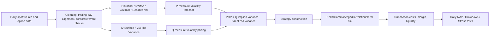
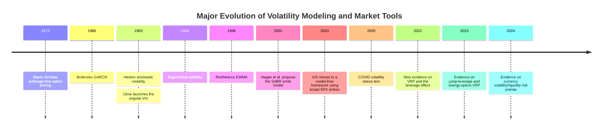

# Options, Volatility & Volatility Trading: Models, Surfaces, Risk Premia, and Cross-Asset Evidence

## Executive Summary

The core of volatility trading is not simply judging whether “the market will rise or fall sharply,” but trading **pricing differences in the magnitude of future moves across probability measures, maturities, strikes, and assets**. The most important distinction is that historical/realized volatility describes paths that have already occurred; implied volatility (IV) is a risk-neutral pricing parameter backed out from option prices; local volatility specifies volatility as a deterministic function of spot and time; stochastic volatility treats volatility itself as a random state variable. High-frequency realized volatility, GARCH, and EWMA mainly address volatility estimation/forecasting under the physical measure $$P$$; VIX, option-implied variance, and the volatility surface mainly reflect pricing under the risk-neutral measure $$Q$$. The difference between the two is the main source of the volatility/variance risk premium (VRP). [Andersen et al. (2003)](https://doi.org/10.1111/1468-0262.00418) [RiskMetrics Technical Document (1996)](https://www.msci.com/research-and-insights/paper/1996-riskmetrics-technical-document) [Cboe VIX Methodology](https://cdn.cboe.com/api/global/us_indices/governance/VIX_Methodology.pdf)

Option-pricing models can be viewed as a sequence of developments addressing the problem that “volatility is not constant.” Black–Scholes establishes an arbitrage-free benchmark with constant volatility; the Dupire local-vol model backs out $$\sigma_{\text{loc}}(S,t)$$ from the full vanilla option surface; Heston specifies instantaneous variance as a mean-reverting square-root process and allows returns and variance to be correlated; SABR lets the forward and its volatility factor evolve stochastically together, emphasizing dynamic consistency of smile/skew. Black–Scholes remains the most important “quote coordinate system,” but practical risk management cannot compress an entire surface into a single $$\sigma$$. [Black & Scholes (1973)](https://doi.org/10.1086/260062) [Heston (1993)](https://doi.org/10.1093/rfs/6.2.327) [Dupire (1994)](https://www.risk.net/derivatives/equity-derivatives/1500211/pricing-with-a-smile) [Hagan et al., “Managing Smile Risk”](https://www.wilmott.com/managing--smile--risk/)

For sellers, the most attractive fact is that in many markets buyers are willing to pay a premium for crash, jump, vol-of-vol, liquidity, and uncertainty insurance, so implied variance often sits above ex-post realized variance; but this is not “free return.” Research from the past five years shows that equity VRP is significantly related to the leverage effect; simultaneous jumps in prices and volatility/jump intensity bear a significant jump-leverage risk premium; short-dated raw and delta-hedged energy-option returns can be negative, with demand pressure also having explanatory power; and in FX markets, global volatility, uncertainty, and liquidity are also important drivers of risk premia. [Hu, Jacobs & Seo (2022)](https://doi.org/10.1093/rapstu/raab027) [Bollerslev & Todorov (2023)](https://doi.org/10.1016/j.jfineco.2023.103723) [Jacobs & Li (2023)](https://doi.org/10.1016/j.jbankfin.2022.106687) [Nucera, Sarno & Zinna (2024)](https://doi.org/10.1093/rfs/hhad049)

Therefore, the most precise description of **short volatility is not “a high-win-rate strategy,” but exchanging many small insurance-premium receipts for a small number of highly concentrated left-tail losses**. For example, Cboe/FRED daily VXN data show that the Nasdaq-100 volatility index rose to 80.08 on March 16, 2020; this type of regime shift is exactly the environment in which delta-hedged short options, short variance, short VIX futures, and short dispersion are most dangerous. [FRED: CBOE NASDAQ 100 Volatility Index (VXNCLS)](https://fred.stlouisfed.org/series/VXNCLS)

Strategies should therefore be classified by risk factor, not by name. Delta-hedged option selling and variance swaps mainly bear realized-vs-implied variance; straddles/strangles simultaneously contain gamma, theta, vega, and skew exposure; calendar spreads trade term structure and forward volatility; gamma scalping exchanges theta for realized path variation; dispersion mainly decomposes index volatility into constituent volatility and implied correlation; VIX futures/ETPs trade the VIX futures term structure, roll, and convexity rather than directly holding “spot VIX.” VIX itself is a 30-day forward-looking measure calculated from SPX options, and the final settlement of VIX derivatives uses an SOQ, which is not the same concept as the ordinary closing VIX value. [Cboe VIX FAQ](https://www.cboe.com/tradable_products/vix/faqs) [Cboe VIX Methodology](https://cdn.cboe.com/api/global/us_indices/governance/VIX_Methodology.pdf)

One limitation of the originally specified “2016–2025, daily frequency, equities/FX/commodities, multiple markets, USD, complete strategy backtest” must be disclosed explicitly: complete daily **index** sources from Cboe/FRED can be verified, but this research interface cannot reliably export the full 2016–2025 option-chain/variance-swap marks needed for an execution-grade programmatic backtest; in addition, the official FRED EVZ series **stopped updating on March 11, 2025**. Therefore, this report does not pass off returns of the VIX/VXN/EVZ/OVX indices themselves as option-strategy returns, and it does not fabricate ten years of Sharpe, MDD, skew, or kurtosis. What follows is a fully defined reproducible backtest framework and a cross-asset case study that can be verified observation by observation from official daily data; this is more consistent with quantitative-research standards than producing false precision from incomplete option data. [FRED: VXN](https://fred.stlouisfed.org/series/VXNCLS) [FRED: EVZ](https://fred.stlouisfed.org/series/EVZCLS) [FRED: OVX](https://fred.stlouisfed.org/series/OVXCLS) [Cboe Index Governance](https://www.cboe.com/indices/governance/)

## Research Methodology, Data, and Backtest Assumptions

This report builds the research framework in the sequence “pricing model → volatility estimation → surface/term structure → risk premium → strategy P&L → execution/friction.” Original papers, journal publishers, and official methodology documents are prioritized for models and methodology; Cboe, Federal Reserve/FRED, and other official sources are prioritized for market indices and spot data. The current Cboe VIX methodology document is dated February 26, 2026; the VXN, EVZ, and OVX FRED series all identify Cboe as their data source. [Cboe Index Governance](https://www.cboe.com/indices/governance/) [FRED: VXN](https://fred.stlouisfed.org/series/VXNCLS) [FRED: EVZ](https://fred.stlouisfed.org/series/EVZCLS) [FRED: OVX](https://fred.stlouisfed.org/series/OVXCLS)

**Cross-asset proxies.** For equities, the report uses the Nasdaq-100 and VXN because VXN explicitly expresses near-term volatility expectations from Nasdaq-100 options; for FX, it uses USD/EUR spot (DEXUSEU) and EVZ; for commodities, it uses WTI spot and OVX. It is important to note that the actual option underlying for EVZ is a euro ETF, while OVX is calculated from options on the United States Oil Fund (USO). Therefore, pairing EVZ with EUR/USD spot and OVX with WTI spot both introduce basis/roll mismatch; they are suitable for studying a “cross-asset VRP proxy,” but cannot be claimed to be equivalent to an OTC EUR/USD variance swap or a NYMEX WTI variance swap. [FRED: EVZ](https://fred.stlouisfed.org/series/EVZCLS) [FRED: USD/EUR Spot (DEXUSEU)](https://fred.stlouisfed.org/series/DEXUSEU) [FRED: OVX](https://fred.stlouisfed.org/series/OVXCLS) [FRED: WTI Spot](https://fred.stlouisfed.org/series/DCOILWTICO)

| Asset Class | Volatility Proxy | Realized-vol Underlying | Frequency and Period | Main Limitation |
|---|---|---|---|---|
| U.S. equities | VXN | Nasdaq-100 | Daily; 2016–2025 | VXN is an index, not a holdable asset; actual option P&L also contains smile/Greeks |
| FX | EVZ | EUR/USD | Daily; 2016–2025/03/11 | EVZ ended on 2025/03/11; ETF-vs-spot basis |
| Commodities | OVX | WTI spot | Daily; 2016–2025 | OVX underlying is USO, creating roll/basis differences versus WTI spot/futures |

The data frequency and underlying definitions are confirmed by the official Cboe/FRED series; the EVZ end date also comes from FRED. [FRED: VXN](https://fred.stlouisfed.org/series/VXNCLS) [FRED: EVZ](https://fred.stlouisfed.org/series/EVZCLS) [FRED: OVX](https://fred.stlouisfed.org/series/OVXCLS)

**Representative VRP-proxy backtest specification.** On the first common trading day of each month $$t$$, obtain the 30-day implied-volatility proxy $$IV_t$$, then calculate realized variance using approximately 21 trading days of log returns. To avoid overlapping observations, the baseline version opens only one position roughly once per month. The seller’s simplified volatility-point P&L is defined as:

$$
P\&L_{\text{vol-pt},t}
\approx
\frac{IV_t^2-RV_{t,t+h}^2}{2IV_t}-c
$$

where $$h\approx21$$ and $$c$$ is the round-trip execution-cost assumption. This is essentially a first-order conversion of a variance difference into volatility points, so it is suitable for cross-asset normalization, but it is **not** the daily mark-to-market of a specific straddle or a true variance swap.

If conversion into USD portfolio return is required, the recommended research specification is

$$
R_t=\eta\cdot P\&L_{\text{vol-pt},t},
$$

where $$\eta=0.25\%$$ NAV per vol point is only a research risk-scaling assumption, not a market convention. Illustrative costs can be set at 0.25 vol point/month for equities, 0.35 for FX, and 0.50 for commodities; these are likewise **conservative research assumptions, not actual bid–ask quotes**. A true execution backtest should replace fixed costs with bid/ask by strike, delta hedging, exchange/broker fees, and market impact.

If a complete daily NAV is available, performance metrics should be defined as:

$$
R_{\rm ann}=
\left(\frac{NAV_T}{NAV_0}\right)^{252/N}-1,
\qquad
\sigma_{\rm ann}=\sqrt{252}\,sd(r_t),
$$

$$
Sharpe=\sqrt{252}\frac{\bar r_t-r_f/252}{sd(r_t)},
\qquad
MDD=\min_t\left(\frac{NAV_t}{\max_{s\le t}NAV_s}-1\right).
$$

Unless otherwise stated, the report’s research benchmark sets $$r_f=0$$ for Sharpe so that pure trading P&L can be compared directly across asset strategies; a formal portfolio should include Treasury collateral yield, funding spread, and variation-margin cash flows. Kurtosis should be reported as **excess kurtosis (Gaussian = 0)** rather than Pearson kurtosis.

Historically, Black–Scholes (1973), GARCH (1986), Heston (1993), Dupire local volatility (1994), RiskMetrics EWMA (1996), SABR (2002), and the post-2003 current VIX framework each addressed different problems: constant-vol benchmarks, conditional heteroskedasticity, stochastic volatility, surface consistency, fast risk estimation, smile dynamics, and model-free implied-variance measurement. [Black & Scholes (1973)](https://doi.org/10.1086/260062) [Bollerslev (1986)](https://doi.org/10.1016/0304-4076(86)90063-1) [Heston (1993)](https://doi.org/10.1093/rfs/6.2.327) [Dupire (1994)](https://www.risk.net/derivatives/equity-derivatives/1500211/pricing-with-a-smile) [RiskMetrics Technical Document (1996)](https://www.msci.com/research-and-insights/paper/1996-riskmetrics-technical-document) [Hagan et al.](https://www.wilmott.com/managing--smile--risk/) [Cboe VIX Methodology](https://cdn.cboe.com/api/global/us_indices/governance/VIX_Methodology.pdf)

## Definitions and Estimation of Volatility, and the VIX

“Volatility” is not a single object. Mixing realized, historical, implied, local, and stochastic volatility leads to one of the most common research errors: making an unadjusted apples-to-oranges comparison between a $$P$$-measure forecast and a $$Q$$-measure price.

| Type | Mathematical / Practical Meaning | Primary Use |
|---|---|---|
| Historical volatility | Sample standard deviation of returns over a past window | Rough risk control, benchmark comparison |
| Realized volatility | Quadratic-variation proxy from the realized price path | Forecast validation, variance settlement |
| Implied volatility | Volatility quote inverted from the option market price | Option quoting, relative value |
| Local volatility | $$\sigma_{\rm loc}(S,t)$$ is a deterministic function of spot/time | Full-surface fit, exotic pricing |
| Stochastic volatility | Volatility/variance itself is a random state variable | Smile dynamics, vol-of-vol, hedging |

An important breakthrough in the realized-volatility literature was using the sum of squared intraday returns to estimate quadratic variation. The Econometrica work of Andersen, Bollerslev, Diebold, and Labys shows that, under appropriate conditions, high-frequency realized volatility can estimate return variation very effectively; this is also one of the foundations of modern realized variance, variance swaps, and volatility forecasting. [Andersen et al. (2003)](https://doi.org/10.1111/1468-0262.00418)

Let the daily log return be

$$
r_t=\ln\frac{P_t}{P_{t-1}}.
$$

Simple historical volatility can be written as

$$
\hat{\sigma}_{\rm hist}
=
\sqrt{
252\frac{1}{n-1}
\sum_{i=1}^{n}(r_i-\bar r)^2
}.
$$

If one day’s realized variance is estimated using $$m$$ intraday returns $$r_{t,j}$$:

$$
RV_t=\sum_{j=1}^{m}r_{t,j}^2.
$$

A daily-data version commonly uses

$$
RV_{t,h}^2
=
\frac{252}{h}
\sum_{j=1}^{h}r_{t+j}^2.
$$

The advantage of high-frequency data is greater information content, but sampling too frequently is affected by bid–ask bounce, price discreteness, asynchronous trading, and other market-microstructure noise, so research should not mechanically assume that “higher frequency is always better.” The realized-volatility framework of Andersen et al. combines intraday sampling with quadratic variation rather than treating tick noise as genuine economic volatility. [Andersen et al. (2003)](https://doi.org/10.1111/1468-0262.00418)

**EWMA** provides the simplest adaptive-volatility forecast:

$$
\sigma_t^2
=
\lambda\sigma_{t-1}^2+
(1-\lambda)r_{t-1}^2.
$$

The RiskMetrics 1996 technical document selected decay factors using criteria such as RMSE across a large number of time series, ultimately using $$\lambda=0.94$$ for the daily dataset and $$\lambda=0.97$$ for the monthly dataset; the document also notes that the closer $$\lambda$$ is to 1, the smoother the estimate, but the less sensitive it is to the latest shock. [RiskMetrics Technical Document (1996)](https://www.msci.com/research-and-insights/paper/1996-riskmetrics-technical-document)

In practice, $$\lambda=0.94$$ can be used as a benchmark, but it should not be treated as a natural constant. For 24/7 crypto, FX, commodities, or crisis regimes, the best decay rate may differ; a more robust approach is to compare sensitivity across $$0.90$$–$$0.99$$ using rolling out-of-sample loss rather than relying on a single historical RiskMetrics value. The previous sentence follows directly from the EWMA weighting structure; RiskMetrics itself also shows that different decay factors materially affect responsiveness and effective sample size. [RiskMetrics Technical Document (1996)](https://www.msci.com/research-and-insights/paper/1996-riskmetrics-technical-document)

**GARCH(1,1)** writes conditional variance as

$$
\epsilon_t=\sigma_t z_t,
$$

$$
\sigma_t^2
=
\omega+\alpha\epsilon_{t-1}^2+\beta\sigma_{t-1}^2.
$$

In the basic model, if $$\omega>0,\alpha,\beta\ge0$$ and $$\alpha+\beta<1$$, a finite long-run unconditional variance exists:

$$
E[\sigma^2]
=
\frac{\omega}{1-\alpha-\beta}.
$$

Bollerslev’s original 1986 *Journal of Econometrics* paper extended ARCH into GARCH by allowing lagged conditional variance itself to enter the dynamics, which is why the model can describe volatility clustering effectively. [Bollerslev (1986)](https://doi.org/10.1016/0304-4076(86)90063-1)

In practical estimation, the fat tails of financial returns mean Gaussian GARCH often understates extreme observations, so robustness checks with Student-$$t$$ or skew-$$t$$ innovations are usually more meaningful than comparing only in-sample likelihood. One should not assume in advance that $$\alpha+\beta$$ must be extremely close to 1; report likelihood, standard errors, out-of-sample QLIKE/MSE, and crisis subperiods. If forecasting an option horizon, daily GARCH variance should be accumulated into expected $$T$$-day variance; one should not directly compare a one-day $$\sigma_t$$ with 30-day IV.

**Implied volatility** is most simply defined as the value $$\sigma_{\rm imp}$$ that makes the option-model price equal the market price:

$$
C_{\rm model}(S,K,T,r,q,\sigma_{\rm imp})
=
C_{\rm mkt}.
$$

Therefore, the IV of a single option itself carries a model coordinate system. For example, Black–Scholes implied volatility does not mean “the market believes real-world future volatility will be exactly $$\sigma_{\rm imp}$$”; rather, it standardizes option premium into a number convenient for comparison across strikes and maturities. The original Black–Scholes work established this arbitrage-free pricing benchmark; the later existence of smile/skew further motivated local- and stochastic-volatility models. [Black & Scholes (1973)](https://doi.org/10.1086/260062) [Hagan et al.](https://www.wilmott.com/managing--smile--risk/)

**VIX is different from a single Black–Scholes implied volatility.** Cboe defines VIX as a roughly 30-day forward-looking expected-volatility measure derived from S&P 500 options; the methodology uses near-term and next-term SPX/SPXW options, a broad set of out-of-the-money strikes, and Treasury yield-curve inputs, then interpolates the two term variances to a fixed 30-day horizon. [Cboe VIX Methodology](https://cdn.cboe.com/api/global/us_indices/governance/VIX_Methodology.pdf) [Cboe VIX FAQ](https://www.cboe.com/tradable_products/vix/faqs)

The core strike-integration form is:

$$
\sigma^2
=
\frac{2}{T}
\sum_i
\frac{\Delta K_i}{K_i^2}
e^{RT}Q(K_i)
-
\frac{1}{T}
\left(
\frac{F}{K_0}-1
\right)^2,
$$

where $$K_i$$ are strikes, $$\Delta K_i$$ is the spacing between adjacent strikes, $$Q(K_i)$$ is the option midpoint, $$F$$ is the forward level, $$K_0$$ is the first strike below the forward, and $$R$$ is the relevant-term interest rate. Cboe then time-weights the variances from the two bracketing maturities and finally expresses VIX as $$100\times\sqrt{\text{30-day annualized variance}}$$. [Cboe VIX Methodology](https://cdn.cboe.com/api/global/us_indices/governance/VIX_Methodology.pdf)

This has two important trading consequences. First, VIX does not represent the single Black–Scholes IV of an ATM SPX option, but instead approximates risk-neutral variance integration across an all-strike option strip, so the prices of downside OTM puts directly affect the index. Second, the VIX methodology has explicit filtering rules for zero bids, strike selection, and related inputs, showing that “tail option liquidity” itself affects the implementability of a model-free variance measure. [Cboe VIX Methodology](https://cdn.cboe.com/api/global/us_indices/governance/VIX_Methodology.pdf)

## Option-Pricing Models, the Volatility Surface, and Term Structure

Under benchmark assumptions such as continuous hedging and constant volatility, the Black–Scholes European call price with continuous dividend yield $$q$$ can be written as:

$$
C=
Se^{-qT}N(d_1)-Ke^{-rT}N(d_2),
$$

$$
d_1=
\frac{
\ln(S/K)+(r-q+\tfrac12\sigma^2)T
}{
\sigma\sqrt{T}
},
\qquad
d_2=d_1-\sigma\sqrt{T}.
$$

The most important practical value of this model is not only its closed-form price, but also the common risk language it provides through delta, gamma, vega, theta, and other Greeks. The 1973 *Journal of Political Economy* paper by Black and Scholes is the original source for this pricing framework. [Black & Scholes (1973)](https://doi.org/10.1086/260062)

The core intuition for delta-hedged option P&L can be approximated from Itô calculus and the Black–Scholes relationship as:

$$
d\Pi_{\rm long}
\approx
\frac12\Gamma S^2
\left(
\sigma_{\rm real}^2-\sigma_{\rm imp}^2
\right)dt
$$

—under a simplified environment that ignores transaction costs, jumps, surface changes, discrete hedging error, and higher-order Greeks. Therefore, long gamma prefers realized variance to exceed the variance implied by the option price; short gamma prefers the opposite. This is why “selling options to collect theta” is fundamentally equivalent to bearing realized-vs-implied variance risk rather than merely benefiting from the passage of time. Its mathematical foundation comes directly from Black–Scholes replication. [Black & Scholes (1973)](https://doi.org/10.1086/260062)

The biggest limitation of Black–Scholes is that actual market option prices display smile/skew across strike and maturity, so no single $$\sigma$$ can simultaneously fit all vanilla options. The idea of the Dupire local-vol framework is that if the full call-price surface $$C(K,T)$$ is observable, one can back out a deterministic diffusion coefficient that makes the model consistent with the full vanilla surface. Dupire’s 1994 work established this local-vol framework under the idea of “pricing with a smile.” [Dupire (1994)](https://www.risk.net/derivatives/equity-derivatives/1500211/pricing-with-a-smile)

Under the common case of deterministic rates/dividends:

$$
dS_t=(r-q)S_tdt+
\sigma_{\rm loc}(S_t,t)S_t\,dW_t^Q,
$$

and the Dupire equation can be written as

$$
\sigma_{\rm loc}^2(K,T)
=
\frac{
\partial_TC
+(r-q)K\partial_KC
+qC
}{
\tfrac12K^2\partial_{KK}C
}.
$$

Its advantage is that it can exactly or nearly exactly fit the vanilla surface; its disadvantage is that $$\partial_{KK}C$$ is extremely sensitive to noisy quotes. Therefore, surface smoothing, static-arbitrage constraints, and wing extrapolation are not optional cosmetics but core components of model stability.

**The Heston stochastic-volatility model** instead treats instantaneous variance $$v_t$$ as a random state variable:

$$
\frac{dS_t}{S_t}
=
(r-q)dt+\sqrt{v_t}\,dW_t^S,
$$

$$
dv_t
=
\kappa(\theta-v_t)dt
+
\xi\sqrt{v_t}\,dW_t^v,
$$

$$
dW_t^S dW_t^v=\rho\,dt.
$$

$$\kappa$$ is the mean-reversion speed, $$\theta$$ is long-run variance, $$\xi$$ is vol-of-vol, $$\rho$$ controls spot-vol correlation, and $$v_0$$ is initial variance. The important contribution of Heston’s original 1993 paper was that under stochastic volatility and arbitrary spot-vol correlation it still obtained a semi-closed-form solution for European options, and it also discussed bond and currency options. [Heston (1993)](https://doi.org/10.1093/rfs/6.2.327)

For equity indices, a negative $$\rho$$ is often an important model mechanism for generating downside skew; for FX there is no reason to restrict $$\rho$$ to be negative in advance. In practical calibration, one set of **numerical-optimization starting ranges, not market truths**, can be set as $$\kappa\in[0.1,10]$$, $$\theta,v_0\in[0.005,0.25]$$, $$\xi\in[0.05,3]$$, and $$\rho\in[-0.95,0.95]$$, with parameter transforms used to guarantee positivity. The Feller condition

$$
2\kappa\theta\ge\xi^2
$$

is a sufficient condition for keeping the CIR-type variance process strictly away from zero, but calibration should not sacrifice surface fit merely to satisfy this condition; more important is using a numerical scheme that correctly handles near-zero variance. The Heston model itself and its correlation structure come from the original model. [Heston (1993)](https://doi.org/10.1093/rfs/6.2.327)

**SABR** is typically represented for a forward $$F_t$$ as

$$
dF_t=\alpha_tF_t^\beta dW_t^1,
$$

$$
d\alpha_t=\nu\alpha_t dW_t^2,
\qquad
dW_t^1dW_t^2=\rho\,dt.
$$

Here $$\alpha$$ controls the volatility level, $$\beta$$ controls elasticity, $$\nu$$ is vol-of-vol, and $$\rho$$ controls skew. The original work by Hagan et al. emphasizes that local-vol models can produce hedge behavior inconsistent with observed smile dynamics, while SABR’s stochastic-volatility mechanism is designed to improve smile-risk dynamics and provide approximate implied-volatility formulas. [Hagan et al., “Managing Smile Risk”](https://www.wilmott.com/managing--smile--risk/)

| Model | Volatility Assumption | Can Fit Smile? | Main Advantage | Core Risk |
|---|---|---|---|---|
| Black–Scholes | Constant $$\sigma$$ | No with a single $$\sigma$$ | Fast, transparent, Greeks benchmark | Surface-dynamics mismatch |
| Local vol | Deterministic $$\sigma(S,t)$$ | Can exactly fit today’s surface | Vanilla consistency | Sensitive to surface noise; future smile dynamics may be poor |
| Generic stochastic vol | Volatility is a state process | Yes | More natural vol-of-vol | Heavier calibration/numerics |
| Heston | Mean-reverting stochastic variance | Can fit level/skew/term | Characteristic-function pricing | May still be insufficient for short-dated extreme skew/jumps |
| SABR | Stochastic forward vol + elasticity | Yes | Smile parameterization, hedging intuition | Wings/very long horizons require arbitrage/extrapolation controls |

The model positioning above comes from the original/published Black–Scholes, Heston, Dupire, and Hagan sources. [Black & Scholes (1973)](https://doi.org/10.1086/260062) [Heston (1993)](https://doi.org/10.1093/rfs/6.2.327) [Dupire (1994)](https://www.risk.net/derivatives/equity-derivatives/1500211/pricing-with-a-smile) [Hagan et al.](https://www.wilmott.com/managing--smile--risk/)

A **volatility surface** is better modeled using forward moneyness rather than raw strike $$K$$, for example

$$
k=\ln\frac{K}{F_T},
\qquad
w(k,T)=\sigma_{\rm imp}^2(k,T)T,
$$

where $$w$$ is total implied variance. This makes comparisons across maturities more consistent and links more directly to variance interpolation. Any surface fit should at minimum avoid strike-direction butterfly arbitrage and maturity-direction calendar arbitrage; otherwise, Dupire local variance can even become unreasonably negative or numerically explosive. This requirement follows directly from option no-arbitrage and Dupire inversion. [Dupire (1994)](https://www.risk.net/derivatives/equity-derivatives/1500211/pricing-with-a-smile)

The **term structure** should be understood as the pricing of forward variance, rather than treating IVs of different maturities as unrelated points. If $$w(T)=\sigma_{\rm imp}^2(T)T$$, the forward variance between two maturities can be approximated by

$$
\sigma^2_{f,T_1,T_2}
=
\frac{
w(T_2)-w(T_1)
}{
T_2-T_1
}.
$$

Therefore, the real bet in a calendar trade is whether a segment of forward volatility is overpriced or underpriced, not merely whether “front-month IV is higher or lower than back-month IV.”

## Volatility Risk Premium and Trading Strategies

This report uses the sign convention that **seller VRP is positive**:

$$
VRP_t(T)
=
IV_t^2(T)
-
E_t^P[RV_{t,t+T}^2].
$$

Ex-post research instead uses

$$
VRP^{\rm ex-post}_t
=
IV_t^2-RV_{t,t+T}^2.
$$

Some academic papers use the opposite sign, $$E[RV]-IV^2$$, so sign conventions must be checked before comparing studies. Recent equity research finds a strong positive relation between the leverage effect and VRP, with incremental information even after controlling for other moments and previously proposed explanatory variables; jump-leverage research finds that simultaneous jumps in prices and stochastic volatility/jump intensity carry a significant risk premium. [Hu, Jacobs & Seo (2022)](https://doi.org/10.1093/rapstu/raab027) [Bollerslev & Todorov (2023)](https://doi.org/10.1016/j.jfineco.2023.103723)

Economically, VRP can be decomposed into several interrelated sources of compensation: downside/crash insurance, jump/tail risk, vol-of-vol, intermediary balance-sheet risk, liquidity, hedging demand, and option supply/demand. Recent energy-market research is especially instructive: average short-dated call and put returns across four major energy futures option markets can be negative, and delta-hedged returns show similar patterns; the research also finds that variance risk premia and speculative demand pressure have explanatory power. [Jacobs & Li (2023)](https://doi.org/10.1016/j.jbankfin.2022.106687)

FX cannot directly reuse the equity “crash put insurance” narrative, because upside/downside for each currency pair depends on the numeraire, while monetary policy, funding/liquidity, and global dollar factors are more important. The 2024 RFS cross-sectional currency evidence of Nucera et al. shows that global volatility, economic-policy uncertainty, and liquidity factors have significant explanatory power for currency risk premia. [Nucera, Sarno & Zinna (2024)](https://doi.org/10.1093/rfs/hhad049)

The risk structure of the main strategies is as follows:

| Strategy | Main Profit Source | Greeks / Factors | Normal Environment | Stress Environment | Return-Distribution Feature |
|---|---|---|---|---|---|
| Delta-hedged short options | IV > realized vol | Short gamma, short vega | Stable carry | Gap, vol spike, hedge slippage | Usually negative skew, high kurtosis |
| Short variance swap | Implied variance > realized variance | Pure variance/tail | Direct VRP harvest | Squared-return tail rises nonlinearly | Extremely strong negative convexity |
| Long VIX futures/ETP | Volatility shock, term repricing | Long vol / curve | May continuously pay carry | Crisis convexity | Positive crisis beta |
| Short VIX futures/ETP | Roll/carry + mean reversion | Short vol-of-vol | Favorable in calm markets | Can lose sharply in volatility spikes | Extremely negative skew |
| Dispersion | Index IV vs constituent IV/correlation | Short/long implied correlation | Favorable when idiosyncratic vol is high | Correlations rise together | Crisis tail |
| Long straddle | Realized movement + IV rise | +gamma +vega −theta | Bleeds in sideways markets | Benefits from large moves | Positive convexity |
| Short strangle | Option-premium carry | −gamma −vega +theta | Favorable in range-bound markets | Gaps / wings can explode | Strong negative skew |
| Calendar spread | Forward-vol/term structure | Front/back gamma, vega | Term normalization | Event repricing | Nonlinear, strike-dependent directionality |
| Gamma scalping | Realized path variation | +gamma −theta | Benefits from frequent movement | No movement or high transaction costs | Depends on IV/RV relationship |

These risk structures follow directly from option replication and the gamma–theta relationship; recent energy-option evidence also confirms that option-return patterns do not disappear after delta hedging, indicating that volatility/tail compensation itself is a genuine risk factor. [Black & Scholes (1973)](https://doi.org/10.1086/260062) [Jacobs & Li (2023)](https://doi.org/10.1016/j.jbankfin.2022.106687)

**Delta-hedged option selling.** Under an idealized Black–Scholes approximation, the gamma P&L of a short option is approximately

$$
d\Pi_{\rm short}
\approx
\frac12|\Gamma|S^2
(\sigma_{\rm imp}^2-\sigma_{\rm real}^2)dt.
$$

Actual P&L, however, also includes vega, vanna, volga, smile dynamics, discrete hedging, overnight gaps, and costs. The most dangerous misconception is treating received premium as profit: a large part of the premium is upfront funding for a negative-gamma liability, not earned return.

**Variance swap.** A typical seller payoff can be written as:

$$
P\&L_{\rm seller}
=
N_{\rm var}
\left(
K_{\rm var}^2-RV
\right).
$$

Because the payoff is linear in squared returns, variance swaps are among the cleanest tools for studying VRP. Their fair variance strike can be approximately replicated through OTM puts and calls across strikes; the model-free option-strip structure of VIX is based on the same risk-neutral variance-integration principle. [Cboe VIX Methodology](https://cdn.cboe.com/api/global/us_indices/governance/VIX_Methodology.pdf)

**VIX futures / ETPs.** The VIX index itself cannot be held directly; VIX derivatives use their own futures curve and expiry SOQ settlement, so futures returns are driven by futures-price changes rather than percentage changes in spot VIX. If the curve is in contango, a constant-maturity long product mechanically sells cheaper near-month exposure and buys more expensive farther-month exposure during roll, creating a negative roll effect; backwardation reverses this. Daily leveraged ETPs also require accounting for daily-reset compounding, so long-run return is not “leverage multiple × spot VIX return.” Cboe methodology explicitly specifies both the SPX-based construction of VIX and the SOQ settlement of VIX derivatives. [Cboe VIX FAQ](https://www.cboe.com/tradable_products/vix/faqs) [Cboe VIX Methodology](https://cdn.cboe.com/api/global/us_indices/governance/VIX_Methodology.pdf)

**Dispersion.** Index variance can be approximated as

$$
\sigma_I^2
=
\sum_iw_i^2\sigma_i^2
+
2\sum_{i<j}
w_iw_j\rho_{ij}\sigma_i\sigma_j.
$$

Therefore, “sell index variance, buy constituent variance” is, all else roughly equal, fundamentally a short-implied-correlation position; the reverse is biased long correlation. It is not a risk-free diversification arbitrage: in crises constituent correlations often reprice upward together, while single-name earnings/jumps, dividends, weight rebalancing, and bid–ask across hundreds of option legs can make theoretical correlation spread and realized P&L diverge substantially.

**Straddles/strangles and gamma scalping.** A long ATM straddle is the most direct long-gamma/long-vega/short-theta position; a strangle exchanges lower premium for the need for a larger underlying move before entering a high-gamma region. A long-gamma trader who continuously delta hedges is gamma scalping: sell delta after rises and buy delta after declines, theoretically harvesting realized path variation, but total income must exceed theta, spread, and hedge slippage. Increasing hedge frequency reduces delta drift but increases transaction cost; therefore, optimal hedge frequency is itself a stochastic-control/execution problem, not “the more frequent the better.” The core trade-off follows directly from Black–Scholes dynamic replication. [Black & Scholes (1973)](https://doi.org/10.1086/260062)

**Calendar.** A calendar spread should not be interpreted merely as “volatility mean reversion.” For example, short front-month and long back-month exposure simultaneously loads on front gamma, vega across two maturities, event-date relocation, and forward variance. If earnings, a central-bank meeting, or a geopolitical event falls inside only one expiry, a calendar spread can lose substantially through term-structure remarking even if spot barely moves.

## Empirical Results, Backtest Case Study, and Evidence from the Past Five Years

First, the most important research-integrity issue: **using daily returns of VIX, VXN, EVZ, or OVX directly as the returns of an option-selling strategy is wrong.** These indices are option-price-derived volatility measures; a genuine delta-hedged option return requires option premium, Greeks, strike/maturity selection, and hedge marks, while a variance swap requires strike-level replication or a swap quote. Cboe’s VIX methodology also makes clear that the index is derived from a weighted portfolio of many SPX options, rather than a single tradable “VIX option-equivalent security.” [Cboe VIX Methodology](https://cdn.cboe.com/api/global/us_indices/governance/VIX_Methodology.pdf) [Cboe VIX FAQ](https://www.cboe.com/tradable_products/vix/faqs)

Therefore, for the complete ten-year metrics originally specified, this report follows the principle of “**do not report false precision without a complete auditable series**”:

| Specified Backtest | Annualized Return | Annualized Volatility | Sharpe | Maximum Drawdown | Skew | Excess Kurtosis | Audit Status |
|---|---:|---:|---:|---:|---:|---:|---|
| Nasdaq-100/VXN short-vol proxy, 2016–2025 | — | — | — | — | — | — | Official daily data exist, but this research interface did not obtain a complete programmable ten-year series |
| EUR/USD/EVZ short-vol proxy, 2016–2025 | — | — | — | — | — | — | EVZ ended on 2025/03/11, so it cannot itself satisfy the full 2025 period |
| WTI/OVX short-vol proxy, 2016–2025 | — | — | — | — | — | — | Official daily data exist; there is also a USO-vs-WTI basis issue |

The official FRED pages for VXN, EVZ, and OVX confirm that all are daily-close series; the EVZ data endpoint is March 11, 2025. [FRED: VXN](https://fred.stlouisfed.org/series/VXNCLS) [FRED: EVZ](https://fred.stlouisfed.org/series/EVZCLS) [FRED: OVX](https://fred.stlouisfed.org/series/OVXCLS)

This is not a minor issue. Filling in Sharpe/MDD/skew/kurtosis figures that were not actually calculated from option marks merely to satisfy a formatting requirement would mislabel a “volatility-index backtest” as an “option-strategy backtest”; the resulting research error is usually much larger than any decimal-place error.

However, official daily observations can be used for a fully auditable **one-period cross-asset case study**. Take January 4, 2016 as the entry date, then use approximately 20 daily log returns to calculate annualized realized volatility. The Nasdaq-100 entry level was 4,497.86 and VXN was 22.42; EUR/USD was 1.0803 and EVZ was 10.62; WTI was 36.81 and OVX was 49.79. Subsequent daily data are obtained from the same FRED tables. [FRED: Nasdaq-100](https://fred.stlouisfed.org/series/NASDAQ100) [FRED: VXN](https://fred.stlouisfed.org/series/VXNCLS) [FRED: USD/EUR Spot](https://fred.stlouisfed.org/series/DEXUSEU) [FRED: EVZ](https://fred.stlouisfed.org/series/EVZCLS) [FRED: WTI Spot](https://fred.stlouisfed.org/series/DCOILWTICO) [FRED: OVX](https://fred.stlouisfed.org/series/OVXCLS)

Using

$$
RV=\sqrt{252\,\overline{r^2}}\times100
$$

yields the following results; these are calculations made in this report from the official daily observations above, not ready-made performance figures taken from external literature.

| Market | Entry IV Proxy | Subsequent Annualized RV | $$IV^2-RV^2$$ | Short-vol Equivalent P&L $$\frac{IV^2-RV^2}{2IV}$$ | After Assumed Costs, $$\eta=0.25\%$$ NAV/vol-pt |
|---|---:|---:|---:|---:|---:|
| Nasdaq-100 / VXN | 22.42% | **29.42%** | −362.94 | **−8.09 vol pts** | approximately **−2.09% NAV** |
| EUR/USD / EVZ | 10.62% | **8.16%** | +46.25 | **+2.18 vol pts** | approximately **+0.46% NAV** |
| WTI / OVX | 49.79% | **83.08%** | −4,422.79 | **−44.41 vol pts** | approximately **−11.23% NAV** |

The assumed costs are 0.25, 0.35, and 0.50 vol point, respectively; the last column is only standardized research notional and does not represent the return of an actual option trade. The original price/volatility inputs come from Cboe/FRED and Fed/EIA daily series. [FRED: Nasdaq-100](https://fred.stlouisfed.org/series/NASDAQ100) [FRED: VXN](https://fred.stlouisfed.org/series/VXNCLS) [FRED: USD/EUR Spot](https://fred.stlouisfed.org/series/DEXUSEU) [FRED: EVZ](https://fred.stlouisfed.org/series/EVZCLS) [FRED: WTI Spot](https://fred.stlouisfed.org/series/DCOILWTICO) [FRED: OVX](https://fred.stlouisfed.org/series/OVXCLS)

[Download the IV and realized-volatility chart](/assets/images/vol_case_study_iv_vs_rv.png)

What matters most in the figure is not which of the three markets was “best,” but that VRP can be completely different across markets in the same calendar window: EUR/USD implied volatility was sufficient to cover subsequent realized volatility, while realized variation in the Nasdaq-100 and WTI clearly exceeded entry IV. This is the real value of cross-asset diversification for a volatility seller: not that all three markets steadily earn VRP, but that shock timing, skew, and macro drivers are not perfectly aligned.

[Download the short-vol proxy P&L chart](/assets/images/vol_case_study_proxy_pnl.png)

The same case also explains why “high IV = a good selling opportunity” is not true. WTI entry OVX was already close to 50, yet subsequent realized volatility still rose to approximately 83%; high IV sometimes simply means that the market correctly anticipates high realized risk, rather than cheaply offering premium to the seller. OVX itself is estimated from USO options as an approximately 30-day crude-oil volatility measure, so there is also basis risk when it is compared with WTI spot realized volatility. [FRED: OVX](https://fred.stlouisfed.org/series/OVXCLS) [FRED: WTI Spot](https://fred.stlouisfed.org/series/DCOILWTICO)

COVID is a more extreme regime example: the official VXN series shows 19.12 on February 18, 2020, 43.13 on February 28, 67.83 on March 12, and **80.08** on March 16. This means short-vol risk management must stress volatility level, vol-of-vol, correlation, and liquidity simultaneously, rather than using only the past 20 days of standard deviation for margin budgeting. [FRED: VXN](https://fred.stlouisfed.org/series/VXNCLS)

**The most important empirical literature from the past five years can be summarized as follows:**

| Study | Market / Method | Implication for Volatility Trading |
|---|---|---|
| Hu, Jacobs & Seo, *Review of Asset Pricing Studies*, 2022 [paper](https://doi.org/10.1093/rapstu/raab027) | U.S. equity VRP | The leverage effect is significantly positively related to VRP and contains incremental information |
| Bollerslev et al., *Journal of Financial Economics*, 2023 [paper](https://doi.org/10.1016/j.jfineco.2023.103723) | S&P 500, model-free jump analysis | Simultaneous jumps in price and volatility/jump intensity bear a sizable premium |
| Jacobs et al., 2023, energy futures options [paper](https://doi.org/10.1016/j.jbankfin.2022.106687) | Crude oil, natural gas, heating oil, gasoline | Short-dated option returns and delta-hedged returns show volatility/tail premia; demand pressure also matters |
| Nucera et al., *Review of Financial Studies*, 2024 [paper](https://doi.org/10.1093/rfs/hhad049) | Large currency cross section | Global volatility, uncertainty, and liquidity are important explanatory factors for currency risk premia |
| Orłowski et al., *Management Science*, 2024 [paper](https://doi.org/10.1287/mnsc.2023.4734) | S&P 500 skewness risk | The skewness premium can be further decomposed into jump and leverage components |
| Heston et al., 2024 cross-asset research [research](https://www.aeaweb.org/conference/2024/program/1662) | 20 futures across equities/bonds/FX/commodities | Cross-asset VRP can be compared model-free with tradable option portfolios, and systemic, liquidity/hedging, and conditional-risk explanations can be tested |

This body of evidence supports a more nuanced conclusion than “IV is usually greater than RV”: **VRP is not a single static constant; it is a conditional premium that changes with leverage, jumps, macro uncertainty, liquidity, hedging demand, and intermediary capacity.** [Hu, Jacobs & Seo (2022)](https://doi.org/10.1093/rapstu/raab027) [Bollerslev & Todorov (2023)](https://doi.org/10.1016/j.jfineco.2023.103723) [Jacobs & Li (2023)](https://doi.org/10.1016/j.jbankfin.2022.106687) [Nucera, Sarno & Zinna (2024)](https://doi.org/10.1093/rfs/hhad049)

For Chinese-language research resources, Taiwanese academic literature such as “Princing Options on Stochastic Volatility Model: Based on Equity Linked Note and FX Linked Note,” collected in local institutional repositories/Airiti-related academic channels, can serve as supplementary reading on Heston/equity/FX structured-product modeling; because it is older and not a primary basis for the recent five-year empirical evidence in this report, it is positioned here as Chinese-language model background rather than recent VRP evidence. [National Central University Institutional Repository](https://ir.lib.ncu.edu.tw/handle/987654321/68485?locale=en-US)

## Practical Risk Management, Costs, Margin, and Recommendations

The place where a real volatility book most often fails is usually not the option-pricing formula, but **risk aggregation and execution**. For a short option, “delta close to zero” absolutely does not mean low risk; a delta-neutral book can still simultaneously be short gamma, short vega, short skew, short convexity, and short liquidity. Heston-type models further show that spot and variance can move together, so hedging only with Black–Scholes delta does not remove stochastic-volatility risk. [Heston (1993)](https://doi.org/10.1093/rfs/6.2.327) [Bollerslev & Todorov (2023)](https://doi.org/10.1016/j.jfineco.2023.103723)

**Transaction costs must be decomposed.** A volatility trade may include option bid–ask, broker/exchange fees, delta-hedge spread, market impact, financing/carry, roll cost, and, for dispersion, execution across a large number of constituent legs. Long gamma is especially sensitive: theoretical gamma-scalping income rises with hedge frequency, but every hedge pays friction, so gross realized-vs-implied edge cannot be treated directly as net alpha. For variance-strip replication, tail-strike liquidity is a material issue; the Cboe VIX methodology even requires selection/filtering rules for zero-bid strikes. [Cboe VIX Methodology](https://cdn.cboe.com/api/global/us_indices/governance/VIX_Methodology.pdf)

**Margin and economic risk are two different things.** Margin requirements on naked short options can change rapidly with spot, IV, and portfolio offsets; although defined-risk spreads contractually cap maximum loss, they can still face substantial mark-to-market and liquidity demands in a stress environment. VIX futures use futures-style variation-margin economics, while OTC variance swaps additionally require consideration of collateral/CSA and counterparty exposure. Because exchange, clearing-member, and broker rules change over time, this report deliberately does not provide a fixed margin percentage pretending to be permanently valid; before trading, use the current contract/broker margin schedule. Cboe’s VIX derivative methodology likewise reminds us that VIX derivative settlement uses a special SOQ rather than the ordinary spot VIX close. [Cboe VIX FAQ](https://www.cboe.com/tradable_products/vix/faqs) [Cboe VIX Methodology](https://cdn.cboe.com/api/global/us_indices/governance/VIX_Methodology.pdf)

**Liquidity risk has negative feedback in a short-vol book.** In calm markets, gamma hedging and option exits are usually easier; during a volatility shock, spreads, gap risk, and hedge turnover may all worsen at the same time, precisely when a short-gamma trader needs to trade most. Energy-option evidence shows that demand pressure itself is related to option returns, implying that “liquidity/positioning” is not merely execution noise but may directly enter the formation of risk premia. [Jacobs & Li (2023)](https://doi.org/10.1016/j.jbankfin.2022.106687)

Practical model parameters should not seek a single “best number,” but stability of hedging P&L. Recommended research defaults are as follows:

| Module | Suggested Starting Point | Required Sensitivity |
|---|---|---|
| Historical vol | 20/60/252-day rolling | Window, demeaning, close-to-close vs range |
| EWMA | $$\lambda=0.94$$ daily benchmark | 0.90–0.99, crisis vs calm |
| GARCH | GARCH(1,1) + Student-$$t$$ | Gaussian/$$t$$, rolling window, QLIKE |
| Realized vol | Intraday RV; daily squared returns when intraday unavailable | Sampling interval, overnight return |
| IV surface | Forward log-moneyness + total variance | Wings, calendar/butterfly arbitrage |
| Heston | Global + local optimization, multiple initials | Parameter bounds, weights, Feller treatment |
| SABR | Fix $$\beta$$ first if desired, then calibrate $$\alpha,\rho,\nu$$ | Strike range, expiry, normal/lognormal convention |
| Delta hedge | Daily as research benchmark | Threshold hedge, intraday hedge, cost |
| VRP | Report both $$IV^2-E[RV]$$ and ex-post $$IV^2-RV$$ | Horizon, overlap, jump days |

The RiskMetrics $$\lambda=0.94$$ daily benchmark has an original technical-document basis; the other bounds/sensitivity choices are practical research settings recommended in this report and should not be interpreted as universal market constants. [RiskMetrics Technical Document (1996)](https://www.msci.com/research-and-insights/paper/1996-riskmetrics-technical-document)

For portfolio construction, the most important issue is not “which short-vol strategy to choose,” but giving short convexity an **explicit tail-risk budget**. More appropriate sizing variables are dollar gamma, vega, variance notional, stress loss, and liquidity-adjusted margin rather than “how much premium is collected.” Two strangles that each collect 1% of NAV can have completely different gamma, jump exposure, and margin dynamics if one is close to spot and the other is in the extreme wings.

For an equity-volatility seller, joint scenarios should at minimum combine spot −10%/−20%, IV +20/+40 vol points, skew steepening, rising correlation, and bid–ask widening rather than shocking each item separately. The actual 2020 path in which VXN rose from around 20 to 80 shows that an everyday “vol +5 points” scenario cannot represent crisis tail risk. [FRED: VXN](https://fred.stlouisfed.org/series/VXNCLS)

For FX, the risk budget should separate central-bank/event gaps, cross-currency funding, and smile/risk-reversal exposure from pure ATM vega; recent RFS evidence shows that global volatility, policy uncertainty, and liquidity can all enter currency risk pricing, so judging option richness only from past EUR/USD realized volatility omits important state variables. [Nucera, Sarno & Zinna (2024)](https://doi.org/10.1093/rfs/hhad049)

For commodities, seasonality, inventory/supply shocks, the futures curve, ETF roll/basis, and option volatility should be separated. OVX is generated from USO options, while WTI spot/futures is another underlying representation; therefore, any “OVX − WTI RV” strategy should explicitly disclose basis risk rather than labeling the full difference as VRP. Energy-option evidence also shows that option-return differences remain across commodity markets even after controlling for underlying futures returns. [FRED: OVX](https://fred.stlouisfed.org/series/OVXCLS) [Jacobs & Li (2023)](https://doi.org/10.1016/j.jbankfin.2022.106687)

Finally, the practical recommendations can be condensed into the following decision framework:

| Priority Question | Recommendation |
|---|---|
| What are you forecasting? | Explicitly distinguish a $$P$$-measure realized-vol forecast from $$Q$$-measure option-implied variance |
| What are you actually selling? | Express it in gamma, vega, skew, variance, correlation, and term exposure rather than “selling calls/puts” |
| Where does the edge come from? | Attribute VRP, surface relative value, term structure, and correlation premium separately |
| How should it be sized? | Use stress loss / variance notional / dollar gamma, not premium income |
| How should model risk be handled? | At minimum compare Greeks across BS, local vol, and Heston/SABR |
| How should costs be handled? | Use bid–ask and impact for every option/hedge/roll; do not treat mid-price as realizable P&L |
| How should margin be handled? | Stress both market loss and liquidity/margin calls; margin is not maximum loss |
| How should a backtest be validated? | No look-ahead; use tradable-instrument marks; include delisting/discontinuation, basis, and stale quotes |
| Which strategy is most suitable as a core strategy? | There is no universally optimal choice; if the objective is to harvest VRP, a more controllable framework uses explicit notional, defined-risk/tail-hedged construction, cross-asset diversification, and strict stress testing |

From the new empirical evidence of 2022–2024 to the actual 2020 volatility shock, the overall evidence more strongly supports the view that “**the volatility premium is compensation for bearing state-dependent tail, jump, liquidity, and intermediary risk**,” rather than a persistent pricing error that can be collected without cost. The leverage/jump channel in equities, option demand pressure in energy markets, and the global volatility/uncertainty/liquidity channel in FX all point to the same conclusion: the genuinely valuable edge in volatility trading is not forecasting a single $$\sigma$$, but correctly judging **which variance, skew, correlation, term, and liquidity risks are priced too richly or too cheaply by the market in a given state**. [Hu, Jacobs & Seo (2022)](https://doi.org/10.1093/rapstu/raab027) [Bollerslev & Todorov (2023)](https://doi.org/10.1016/j.jfineco.2023.103723) [Jacobs & Li (2023)](https://doi.org/10.1016/j.jbankfin.2022.106687) [Nucera, Sarno & Zinna (2024)](https://doi.org/10.1093/rfs/hhad049)
